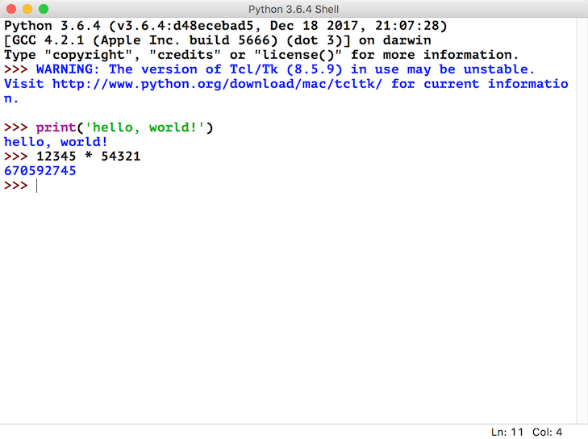
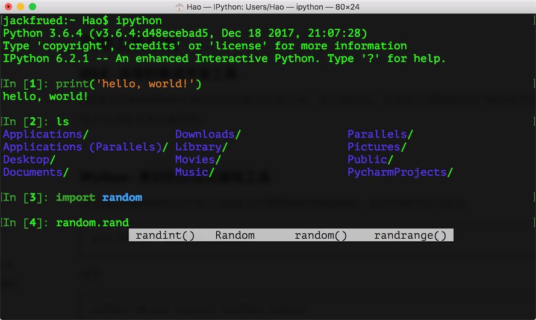
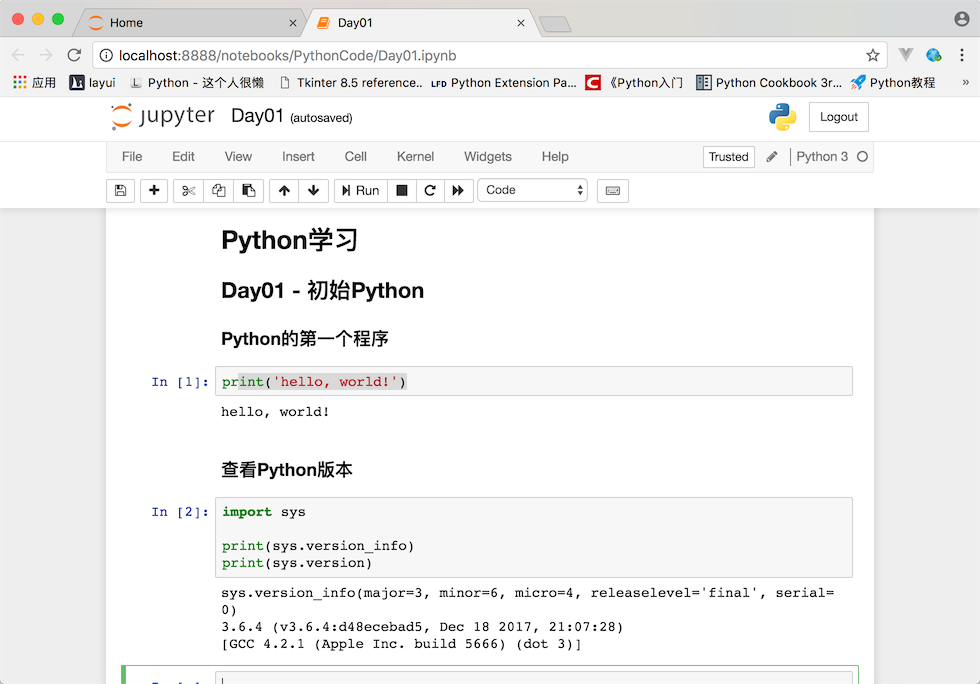
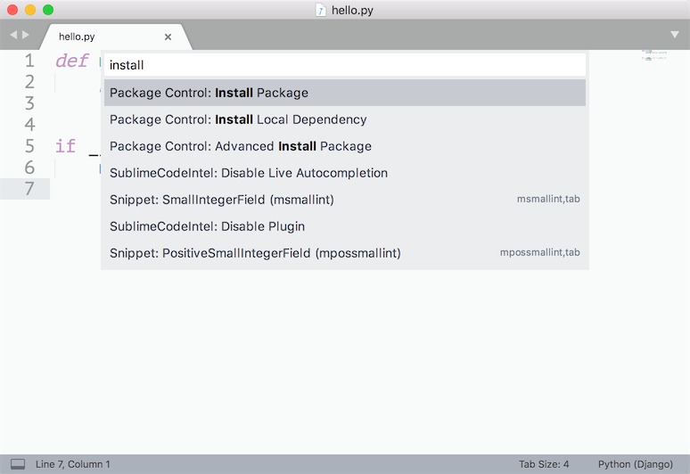

## 初识Python

### Python简介

#### Python的历史

1. 1989年圣诞节：Guido von Rossum开始写Python语言的编译器。
2. 1991年2月：第一个Python编译器（同时也是解释器）诞生，它是用C语言实现的（后面又出现了Java和C#实现的版本Jython和IronPython，以及PyPy、Brython、Pyston等其他实现），可以调用C语言的库函数。在最早的版本中，Python已经提供了对“类”，“函数”，“异常处理”等构造块的支持，同时提供了“列表”和“字典”等核心数据类型，同时支持以模块为基础来构造应用程序。
3. 1994年1月：Python 1.0正式发布。
4. 2000年10月16日：Python 2.0发布，增加了实现完整的[垃圾回收](https://zh.wikipedia.org/wiki/%E5%9E%83%E5%9C%BE%E5%9B%9E%E6%94%B6_(%E8%A8%88%E7%AE%97%E6%A9%9F%E7%A7%91%E5%AD%B8))，提供了对[Unicode](https://zh.wikipedia.org/wiki/Unicode)的支持。与此同时，Python的整个开发过程更加透明，社区对开发进度的影响逐渐扩大，生态圈开始慢慢形成。
5. 2008年12月3日：Python 3.0发布，它并不完全兼容之前的Python代码，不过因为目前还有不少公司在项目和运维中使用Python 2.x版本，所以Python 3.x的很多新特性后来也被移植到Python 2.6/2.7版本中。

目前我们使用的Python 3.7.x的版本是在2018年发布的，Python的版本号分为三段，形如A.B.C。其中A表示大版本号，一般当整体重写，或出现不向后兼容的改变时，增加A；B表示功能更新，出现新功能时增加B；C表示小的改动（例如：修复了某个Bug），只要有修改就增加C。如果对Python的历史感兴趣，可以阅读名为[《Python简史》](http://www.cnblogs.com/vamei/archive/2013/02/06/2892628.html)的博文。

#### Python的优缺点

Python的优点很多，简单的可以总结为以下几点。

1. 简单和明确，做一件事只有一种方法。
2. 学习曲线低，跟其他很多语言相比，Python更容易上手。
3. 开放源代码，拥有强大的社区和生态圈。
4. 解释型语言，天生具有平台可移植性。
5. 支持两种主流的编程范式（面向对象编程和函数式编程）都提供了支持。
6. 可扩展性和可嵌入性，可以调用C/C++代码，也可以在C/C++中调用Python。
7. 代码规范程度高，可读性强，适合有代码洁癖和强迫症的人群。

Python的缺点主要集中在以下几点。

1. 执行效率稍低，因此计算密集型任务可以由C/C++编写。
2. 代码无法加密，但是现在很多公司都不销售卖软件而是销售服务，这个问题会被淡化。
3. 在开发时可以选择的框架太多（如Web框架就有100多个），有选择的地方就有错误。

#### Python的应用领域

目前Python在Web应用开发、云基础设施、DevOps、网络爬虫开发、数据分析挖掘、机器学习等领域都有着广泛的应用，因此也产生了Web后端开发、数据接口开发、自动化运维、自动化测试、科学计算和可视化、数据分析、量化交易、机器人开发、图像识别和处理等一系列的职位。

### 搭建编程环境

#### Windows环境

可以在[Python官方网站](https://www.python.org)下载到Python的Windows安装程序（exe文件），需要注意的是如果在Windows 7环境下安装Python 3.x，需要先安装Service Pack 1补丁包（可以通过一些工具软件自动安装系统补丁的功能来安装），安装过程建议勾选“Add Python 3.x to PATH”（将Python 3.x添加到PATH环境变量）并选择自定义安装，在设置“Optional Features”界面最好将“pip”、“tcl/tk”、“Python test suite”等项全部勾选上。强烈建议选择自定义的安装路径并保证路径中没有中文。安装完成会看到“Setup was successful”的提示。如果稍后运行Python程序时，出现因为缺失一些动态链接库文件而导致Python解释器无法工作的问题，可以按照下面的方法加以解决。

如果系统显示api-ms-win-crt\*.dll文件缺失，可以参照[《api-ms-win-crt\*.dll缺失原因分析和解决方法》](<https://zhuanlan.zhihu.com/p/32087135>)一文讲解的方法进行处理或者直接在[微软官网](https://www.microsoft.com/zh-cn/download/details.aspx?id=48145)下载Visual C++ Redistributable for Visual Studio 2015文件进行修复；如果是因为更新Windows的DirectX之后导致某些动态链接库文件缺失问题，可以下载一个[DirectX修复工具](<https://dl.pconline.com.cn/download/360074-1.html>)进行修复。

#### Linux环境

Linux环境自带了Python 2.x版本，但是如果要更新到3.x的版本，可以在[Python的官方网站](https://www.python.org)下载Python的源代码并通过源代码构建安装的方式进行安装，具体的步骤如下所示。

安装依赖库（因为没有这些依赖库可能在源代码构件安装时因为缺失底层依赖库而失败）。

```Shell
yum -y install wget gcc zlib-devel bzip2-devel openssl-devel ncurses-devel sqlite-devel readline-devel tk-devel gdbm-devel db4-devel libpcap-devel xz-devel libffi-devel
```

下载Python源代码并解压缩到指定目录。

```Shell
wget https://www.python.org/ftp/python/3.7.3/Python-3.7.3.tgz
xz -d Python-3.7.3.tar.xz
tar -xvf Python-3.7.3.tar
```

切换至Python源代码目录并执行下面的命令进行配置和安装。

```Shell
cd Python-3.7.3
./configure --prefix=/usr/local/python37 --enable-optimizations
make && make install
```

修改用户主目录下名为.bash_profile的文件，配置PATH环境变量并使其生效。

```Shell
cd ~
vim .bash_profile
```

```Shell
# ... 此处省略上面的代码 ...

export PATH=$PATH:/usr/local/python37/bin

# ... 此处省略下面的代码 ...
```

激活环境变量。

```Shell
source .bash_profile
```

#### macOS环境

macOS也自带了Python 2.x版本，可以通过[Python的官方网站](https://www.python.org)提供的安装文件（pkg文件）安装Python 3.x的版本。默认安装完成后，可以通过在终端执行python命令来启动2.x版本的Python解释器，可以通过执行python3命令来启动3.x版本的Python解释器。

### 从终端运行Python程序

#### 确认Python的版本

可以Windows的命令行提示符中键入下面的命令。

```Shell
python --version
```
或者是在Linux或macOS系统的终端中键入下面的命令。

```Shell
python3 --version
```

当然也可以先输入python或python3进入交互式环境，再执行以下的代码检查Python的版本。

```Python
import sys

print(sys.version_info)
print(sys.version)
```

#### 编写Python源代码

可以用文本编辑工具（推荐使用[Sublime](<https://www.sublimetext.com/>)、[Atom](<https://atom.io/>)、[Visual Studio Code](<https://code.visualstudio.com/>)等高级文本编辑工具）编写Python源代码并用py作为后缀名保存该文件，代码内容如下所示。

```Python
print('hello, world!')
```

#### 运行程序

切换到源代码所在的目录并执行下面的命令，看看屏幕上是否输出了"hello, world!"。

```Shell
python hello.py
```

或

```Shell
python3 hello.py
```

### 代码中的注释

注释是编程语言的一个重要组成部分，用于在源代码中解释代码的作用从而增强程序的可读性和可维护性，当然也可以将源代码中不需要参与运行的代码段通过注释来去掉，这一点在调试程序的时候经常用到。注释在随源代码进入预处理器或编译时会被移除，不会在目标代码中保留也不会影响程序的执行结果。

1. 单行注释 - 以#和空格开头的部分
2. 多行注释 - 三个引号开头，三个引号结尾

```Python
"""
第一个Python程序 - hello, world!
向伟大的Dennis M. Ritchie先生致敬

Version: 0.1
Author: 骆昊
"""

print('hello, world!')
# print("你好,世界！")
print('你好', '世界')
print('hello', 'world', sep=', ', end='!')
print('goodbye, world', end='!\n')
```

### 其他工具介绍

#### IDLE - 自带的集成开发工具

IDLE是安装Python环境时自带的集成开发工具，如下图所示。但是由于IDLE的用户体验并不是那么好所以很少在实际开发中被采用。



#### IPython - 更好的交互式编程工具

IPython是一种基于Python的交互式解释器。相较于原生的Python交互式环境，IPython提供了更为强大的编辑和交互功能。可以通过Python的包管理工具pip安装IPython和Jupyter，具体的操作如下所示。

```Shell
pip install ipython
```

或

```Shell
pip3 install ipython
```

安装成功后，可以通过下面的ipython命令启动IPython，如下图所示。



当然，我们也可以通过安装Jupyter工具并运行名为notebook的程序在浏览器窗口中进行交互式代码编写操作。

```Shell
pip install jupyter
```

或

```Shell
pip3 intall jupyter
```

然后执行下面的命令：

```Shell
jupyter notebook
```




#### Sublime / Visual Studio Code - 高级文本编辑器



- 首先可以通过[官方网站](https://www.sublimetext.com/)下载安装程序安装Sublime 3或Sublime 2。

- 安装包管理工具。
  1. 通过快捷键Ctrl+`或者在View菜单中选择Show Console打开控制台，输入下面的代码。

  - Sublime 3

  ```Python
  import  urllib.request,os;pf='Package Control.sublime-package';ipp=sublime.installed_packages_path();urllib.request.install_opener(urllib.request.build_opener(urllib.request.ProxyHandler()));open(os.path.join(ipp,pf),'wb').write(urllib.request.urlopen('http://sublime.wbond.net/'+pf.replace(' ','%20')).read())
  ```
  - Sublime 2

  ```Python
  import  urllib2,os;pf='Package Control.sublime-package';ipp=sublime.installed_packages_path();os.makedirs(ipp)ifnotos.path.exists(ipp)elseNone;urllib2.install_opener(urllib2.build_opener(urllib2.ProxyHandler()));open(os.path.join(ipp,pf),'wb').write(urllib2.urlopen('http://sublime.wbond.net/'+pf.replace(' ','%20')).read());print('Please restart Sublime Text to finish installation')
  ```
  2. 手动安装浏览器输入  https://sublime.wbond.net/Package%20Control.sublime-package 下载这个文件
  下载好以后，打开sublime text，选择菜单Preferences->Browse Packages... 打开安装目录
  此时会进入到一个叫做Packages的目录下，点击进入上一层目录Sublime Text3，在此目录下有一个文件夹叫做Installed Packages，把刚才下载的文件放到这里就可以了。然后重启sublime text3，观察Preferences菜单最下边是否有Package Settings 和Package Control两个选项，如果有，则代表安装成功了。


- 安装插件。通过Preference菜单的Package Control或快捷键Ctrl+Shift+P打开命令面板，在面板中输入Install Package就可以找到安装插件的工具，然后再查找需要的插件。我们推荐大家安装以下几个插件：

  - SublimeCodeIntel - 代码自动补全工具插件。
  - Emmet - 前端开发代码模板插件。
  - Git - 版本控制工具插件。
  - Python PEP8 Autoformat - PEP8规范自动格式化插件。
  - ConvertToUTF8 - 将本地编码转换为UTF-8。

> 说明：事实上Visual Studio Code可能是更好的选择，它不用花钱并提供了更为完整和强大的功能，有兴趣的读者可以自行研究。

#### PyCharm - Python开发神器

PyCharm的安装、配置和使用在[《玩转PyCharm》](../玩转PyCharm.md)进行了介绍，有兴趣的读者可以选择阅读。


### 练习

1. 在Python交互环境中查看下面的代码结果，并试着将这些内容翻译成中文。

    ```Python
    import this
    ```

    > 说明：当前键入上面的命令后会在交互式环境中看到如下所示的输出，这段内容被称为“Python之禅”，里面讲述的道理不仅仅适用于Python，也适用于其他编程语言。
    >

2. 学习使用turtle在屏幕上绘制图形。

    > 说明：turtle是Python内置的一个非常有趣的模块，特别适用于让小朋友体会什么是编程，它最早是Logo语言的一部分，Logo语言是Wally Feurzig和Seymour Papert在1966发明的编程语言.

    ```Python
    import turtle
    
    turtle.pensize(4)
    turtle.pencolor('red')
    turtle.forward(100)
    turtle.right(90)
    turtle.forward(100)
    turtle.right(90)
    turtle.forward(100)
    turtle.right(90)
    turtle.forward(100)
    turtle.mainloop()
    ```
