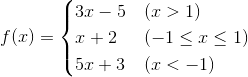

## 分支结构

### 应用场景

迄今为止，我们写的Python代码都是一条一条语句顺序执行，这种代码结构通常称之为顺序结构。然而仅有顺序结构并不能解决所有的问题，比如我们设计一个游戏，游戏第一关的通关条件是玩家获得1000分，那么在完成本局游戏后，我们要根据玩家得到分数来决定究竟是进入第二关，还是告诉玩家“Game Over”，这里就会产生两个分支，而且这两个分支只有一个会被执行。类似的场景还有很多，我们将这种结构称之为“分支结构”或“选择结构”。给大家一分钟的时间，你应该可以想到至少5个以上这样的例子，赶紧试一试。

### if语句的使用

在Python中，要构造分支结构可以使用`if`、`elif`和`else`关键字。所谓**关键字**就是有特殊含义的单词，像`if`和`else`就是专门用于构造分支结构的关键字，很显然你不能够使用它作为变量名（事实上，用作其他的标识符也是不可以）。下面的例子中演示了如何构造一个分支结构。

```Python
"""
用户身份验证

Version: 0.1
Author: 骆昊
"""

username = input('请输入用户名: ')
password = input('请输入口令: ')
# 用户名是admin且密码是123456则身份验证成功否则身份验证失败
if username == 'admin' and password == '123456':
    print('身份验证成功!')
else:
    print('身份验证失败!')
```

唯一需要说明的是和C/C++、Java等语言不同，Python中没有用花括号来构造代码块而是使用了缩进的方式来设置代码的层次结构，如果`if`条件成立的情况下需要执行多条语句，只要保持多条语句具有相同的缩进就可以了，换句话说连续的代码如果又保持了相同的缩进那么它们属于同一个代码块，相当于是一个执行的整体。

当然如果要构造出更多的分支，可以使用`if…elif…else…`结构，例如下面的分段函数求值。



```Python
"""
分段函数求值

        3x - 5  (x > 1)
f(x) =  x + 2   (-1 <= x <= 1)
        5x + 3  (x < -1)

Version: 0.1
Author: 骆昊
"""

x = float(input('x = '))
if x > 1:
    y = 3 * x - 5
elif x >= -1:
    y = x + 2
else:
    y = 5 * x + 3
print('f(%.2f) = %.2f' % (x, y))
```

当然根据实际开发的需要，分支结构是可以嵌套的，例如判断是否通关以后还要根据你获得的宝物或者道具的数量对你的表现给出等级（比如点亮两颗或三颗星星），那么我们就需要在`if`的内部构造出一个新的分支结构，同理`elif`和`else`中也可以再构造新的分支，我们称之为嵌套的分支结构，也就是说上面的代码也可以写成下面的样子。

```Python
"""
分段函数求值
		3x - 5	(x > 1)
f(x) =	x + 2	(-1 <= x <= 1)
		5x + 3	(x < -1)

Version: 0.1
Author: 骆昊
"""

x = float(input('x = '))
if x > 1:
    y = 3 * x - 5
else:
    if x >= -1:
        y = x + 2
    else:
        y = 5 * x + 3
print('f(%.2f) = %.2f' % (x, y))
```

> **说明：** 大家可以自己感受一下这两种写法到底是哪一种更好。在之前我们提到的Python之禅中有这么一句话“Flat is better than nested.”，之所以提倡代码“扁平化”是因为嵌套结构的嵌套层次多了之后会严重的影响代码的可读性，所以能使用扁平化的结构时就不要使用嵌套。

### 练习

#### 练习1：英制单位英寸与公制单位厘米互换。

参考答案：

```Python
"""
英制单位英寸和公制单位厘米互换

Version: 0.1
Author: 骆昊
"""

value = float(input('请输入长度: '))
unit = input('请输入单位: ')
if unit == 'in' or unit == '英寸':
    print('%f英寸 = %f厘米' % (value, value * 2.54))
elif unit == 'cm' or unit == '厘米':
    print('%f厘米 = %f英寸' % (value, value / 2.54))
else:
    print('请输入有效的单位')
```

#### 练习2：百分制成绩转换为等级制成绩。

> **要求**：如果输入的成绩在90分以上（含90分）输出A；80分-90分（不含90分）输出B；70分-80分（不含80分）输出C；60分-70分（不含70分）输出D；60分以下输出E。

参考答案：

```Python
"""
百分制成绩转换为等级制成绩

Version: 0.1
Author: 骆昊
"""

score = float(input('请输入成绩: '))
if score >= 90:
    grade = 'A'
elif score >= 80:
    grade = 'B'
elif score >= 70:
    grade = 'C'
elif score >= 60:
    grade = 'D'
else:
    grade = 'E'
print('对应的等级是:', grade)
```
#### 练习3：输入三条边长，如果能构成三角形就计算周长和面积。

参考答案：

```Python
"""
判断输入的边长能否构成三角形，如果能则计算出三角形的周长和面积

Version: 0.1
Author: 骆昊
"""

a = float(input('a = '))
b = float(input('b = '))
c = float(input('c = '))
if a + b > c and a + c > b and b + c > a:
    print('周长: %f' % (a + b + c))
    p = (a + b + c) / 2
    area = (p * (p - a) * (p - b) * (p - c)) ** 0.5
    print('面积: %f' % (area))
else:
    print('不能构成三角形')
```
> **说明：** 上面使用的通过边长计算三角形面积的公式叫做[海伦公式](https://zh.wikipedia.org/zh-hans/海伦公式)。

