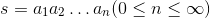
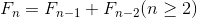
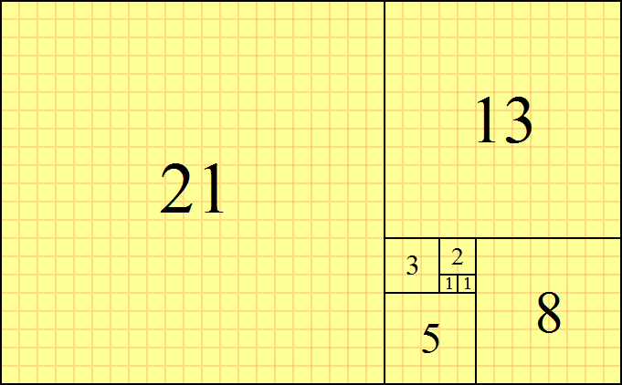
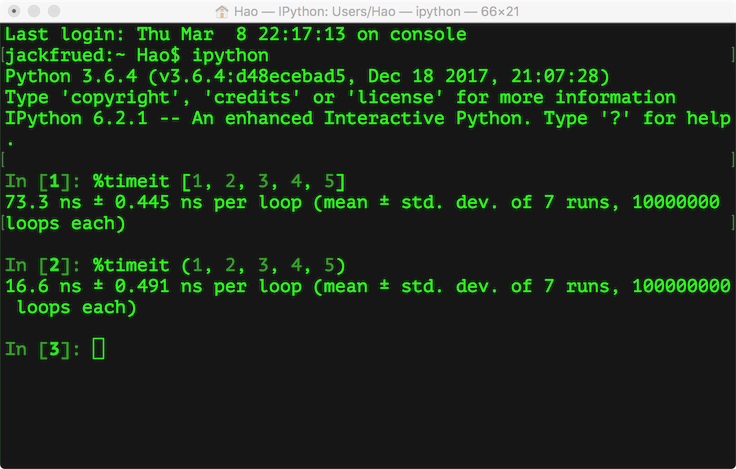
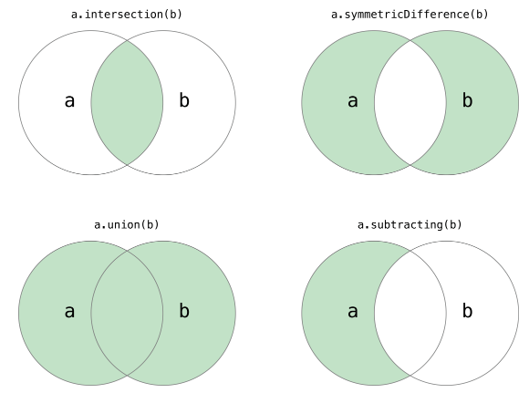

## 字符串和常用数据结构

### 使用字符串

第二次世界大战促使了现代电子计算机的诞生，最初的目的用计算机来快速的完成导弹弹道的计算，因此在计算机刚刚诞生的那个年代，计算机处理的信息基本上都是数值型的信息，而世界上的第一台电子计算机ENIAC每秒钟能够完成约5000次浮点运算。随着时间的推移，虽然数值运算仍然是计算机日常工作中最为重要的事情之一，但是今天的计算机更多的时间需要处理的数据可能都是以文本的方式存在的，如果我们希望通过Python程序操作本这些文本信息，就必须要先了解字符串类型以及与它相关的知识。

所谓**字符串**，就是由零个或多个字符组成的有限序列，一般记为。

我们可以通过下面的代码来了解字符串的使用。

```Python
def main():
    str1 = 'hello, world!'
    # 通过len函数计算字符串的长度
    print(len(str1))  # 13
    # 获得字符串首字母大写的拷贝
    print(str1.capitalize())  # Hello, world!
    # 获得字符串变大写后的拷贝
    print(str1.upper())  # HELLO, WORLD!
    # 从字符串中查找子串所在位置
    print(str1.find('or'))  # 8
    print(str1.find('shit'))  # -1
    # 与find类似但找不到子串时会引发异常
    # print(str1.index('or'))
    # print(str1.index('shit'))
    # 检查字符串是否以指定的字符串开头
    print(str1.startswith('He'))  # False
    print(str1.startswith('hel'))  # True
    # 检查字符串是否以指定的字符串结尾
    print(str1.endswith('!'))  # True
    # 将字符串以指定的宽度居中并在两侧填充指定的字符
    print(str1.center(50, '*'))
    # 将字符串以指定的宽度靠右放置左侧填充指定的字符
    print(str1.rjust(50, ' '))
    str2 = 'abc123456'
    # 从字符串中取出指定位置的字符(下标运算)
    print(str2[2])  # c
    # 字符串切片(从指定的开始索引到指定的结束索引)
    print(str2[2:5])  # c12
    print(str2[2:])  # c123456
    print(str2[2::2])  # c246
    print(str2[::2])  # ac246
    print(str2[::-1])  # 654321cba
    print(str2[-3:-1])  # 45
    # 检查字符串是否由数字构成
    print(str2.isdigit())  # False
    # 检查字符串是否以字母构成
    print(str2.isalpha())  # False
    # 检查字符串是否以数字和字母构成
    print(str2.isalnum())  # True
    str3 = '  jackfrued@126.com '
    print(str3)
    # 获得字符串修剪左右两侧空格的拷贝
    print(str3.strip())


if __name__ == '__main__':
    main()
```

除了字符串，Python还内置了多种类型的数据结构，如果要在程序中保存和操作数据，绝大多数时候可以利用现有的数据结构来实现，最常用的包括列表、元组、集合和字典。

### 使用列表

下面的代码演示了如何定义列表、使用下标访问列表元素以及添加和删除元素的操作。

```Python
def main():
    list1 = [1, 3, 5, 7, 100]
    print(list1)
    list2 = ['hello'] * 5
    print(list2)
    # 计算列表长度(元素个数)
    print(len(list1))
    # 下标(索引)运算
    print(list1[0])
    print(list1[4])
    # print(list1[5])  # IndexError: list index out of range
    print(list1[-1])
    print(list1[-3])
    list1[2] = 300
    print(list1)
    # 添加元素
    list1.append(200)
    list1.insert(1, 400)
    list1 += [1000, 2000]
    print(list1)
    print(len(list1))
    # 删除元素
    list1.remove(3)
    if 1234 in list1:
        list1.remove(1234)
    del list1[0]
    print(list1)
    # 清空列表元素
    list1.clear()
    print(list1)


if __name__ == '__main__':
    main()
```

和字符串一样，列表也可以做切片操作，通过切片操作我们可以实现对列表的复制或者将列表中的一部分取出来创建出新的列表，代码如下所示。

```Python
def main():
    fruits = ['grape', 'apple', 'strawberry', 'waxberry']
    fruits += ['pitaya', 'pear', 'mango']
    # 循环遍历列表元素
    for fruit in fruits:
        print(fruit.title(), end=' ')
    print()
    # 列表切片
    fruits2 = fruits[1:4]
    print(fruits2)
    # fruit3 = fruits  # 没有复制列表只创建了新的引用
    # 可以通过完整切片操作来复制列表
    fruits3 = fruits[:]
    print(fruits3)
    fruits4 = fruits[-3:-1]
    print(fruits4)
    # 可以通过反向切片操作来获得倒转后的列表的拷贝
    fruits5 = fruits[::-1]
    print(fruits5)


if __name__ == '__main__':
    main()
```

下面的代码实现了对列表的排序操作。

```Python
def main():
    list1 = ['orange', 'apple', 'zoo', 'internationalization', 'blueberry']
    list2 = sorted(list1)
    # sorted函数返回列表排序后的拷贝不会修改传入的列表
    # 函数的设计就应该像sorted函数一样尽可能不产生副作用
    list3 = sorted(list1, reverse=True)
    # 通过key关键字参数指定根据字符串长度进行排序而不是默认的字母表顺序
    list4 = sorted(list1, key=len)
    print(list1)
    print(list2)
    print(list3)
    print(list4)
    # 给列表对象发出排序消息直接在列表对象上进行排序
    list1.sort(reverse=True)
    print(list1)


if __name__ == '__main__':
    main()
```

我们还可以使用列表的生成式语法来创建列表，代码如下所示。

```Python
import sys


def main():
    f = [x for x in range(1, 10)]
    print(f)
    f = [x + y for x in 'ABCDE' for y in '1234567']
    print(f)
    # 用列表的生成表达式语法创建列表容器
    # 用这种语法创建列表之后元素已经准备就绪所以需要耗费较多的内存空间
    f = [x ** 2 for x in range(1, 1000)]
    print(sys.getsizeof(f))  # 查看对象占用内存的字节数
    print(f)
    # 请注意下面的代码创建的不是一个列表而是一个生成器对象
    # 通过生成器可以获取到数据但它不占用额外的空间存储数据
    # 每次需要数据的时候就通过内部的运算得到数据(需要花费额外的时间)
    f = (x ** 2 for x in range(1, 1000))
    print(sys.getsizeof(f))  # 相比生成式生成器不占用存储数据的空间
    print(f)
    for val in f:
        print(val)


if __name__ == '__main__':
    main()
```

除了上面提到的生成器语法，Python中还有另外一种定义生成器的方式，就是通过`yield`关键字将一个普通函数改造成生成器函数。下面的代码演示了如何实现一个生成[斐波拉切数列](https://zh.wikipedia.org/wiki/%E6%96%90%E6%B3%A2%E9%82%A3%E5%A5%91%E6%95%B0%E5%88%97)的生成器。所谓斐波拉切数列可以通过下面[递归](https://zh.wikipedia.org/wiki/%E9%80%92%E5%BD%92)的方法来进行定义：






```Python
def fib(n):
    a, b = 0, 1
    for _ in range(n):
        a, b = b, a + b
        yield a


def main():
    for val in fib(20):
        print(val)


if __name__ == '__main__':
    main()
```

### 使用元组

Python 的元组与列表类似，不同之处在于元组的元素不能修改，在前面的代码中我们已经不止一次使用过元组了。顾名思义，我们把多个元素组合到一起就形成了一个元组，所以它和列表一样可以保存多条数据。下面的代码演示了如何定义和使用元组。

```Python
def main():
    # 定义元组
    t = ('骆昊', 38, True, '四川成都')
    print(t)
    # 获取元组中的元素
    print(t[0])
    print(t[3])
    # 遍历元组中的值
    for member in t:
        print(member)
    # 重新给元组赋值
    # t[0] = '王大锤'  # TypeError
    # 变量t重新引用了新的元组原来的元组将被垃圾回收
    t = ('王大锤', 20, True, '云南昆明')
    print(t)
    # 将元组转换成列表
    person = list(t)
    print(person)
    # 列表是可以修改它的元素的
    person[0] = '李小龙'
    person[1] = 25
    print(person)
    # 将列表转换成元组
    fruits_list = ['apple', 'banana', 'orange']
    fruits_tuple = tuple(fruits_list)
    print(fruits_tuple)


if __name__ == '__main__':
    main()
```

这里有一个非常值得探讨的问题，我们已经有了列表这种数据结构，为什么还需要元组这样的类型呢？

1. 元组中的元素是无法修改的，事实上我们在项目中尤其是[多线程](https://zh.wikipedia.org/zh-hans/%E5%A4%9A%E7%BA%BF%E7%A8%8B)环境（后面会讲到）中可能更喜欢使用的是那些不变对象（一方面因为对象状态不能修改，所以可以避免由此引起的不必要的程序错误，简单的说就是一个不变的对象要比可变的对象更加容易维护；另一方面因为没有任何一个线程能够修改不变对象的内部状态，一个不变对象自动就是线程安全的，这样就可以省掉处理同步化的开销。一个不变对象可以方便的被共享访问）。所以结论就是：如果不需要对元素进行添加、删除、修改的时候，可以考虑使用元组，当然如果一个方法要返回多个值，使用元组也是不错的选择。
2. 元组在创建时间和占用的空间上面都优于列表。我们可以使用sys模块的getsizeof函数来检查存储同样的元素的元组和列表各自占用了多少内存空间，这个很容易做到。我们也可以在ipython中使用魔法指令%timeit来分析创建同样内容的元组和列表所花费的时间，下图是我的macOS系统上测试的结果。



### 使用集合

Python中的集合跟数学上的集合是一致的，不允许有重复元素，而且可以进行交集、并集、差集等运算。



```Python
def main():
    set1 = {1, 2, 3, 3, 3, 2}
    print(set1)
    print('Length =', len(set1))
    set2 = set(range(1, 10))
    print(set2)
    set1.add(4)
    set1.add(5)
    set2.update([11, 12])
    print(set1)
    print(set2)
    set2.discard(5)
    # remove的元素如果不存在会引发KeyError
    if 4 in set2:
        set2.remove(4)
    print(set2)
    # 遍历集合容器
    for elem in set2:
        print(elem ** 2, end=' ')
    print()
    # 将元组转换成集合
    set3 = set((1, 2, 3, 3, 2, 1))
    print(set3.pop())
    print(set3)
    # 集合的交集、并集、差集、对称差运算
    print(set1 & set2)
    # print(set1.intersection(set2))
    print(set1 | set2)
    # print(set1.union(set2))
    print(set1 - set2)
    # print(set1.difference(set2))
    print(set1 ^ set2)
    # print(set1.symmetric_difference(set2))
    # 判断子集和超集
    print(set2 <= set1)
    # print(set2.issubset(set1))
    print(set3 <= set1)
    # print(set3.issubset(set1))
    print(set1 >= set2)
    # print(set1.issuperset(set2))
    print(set1 >= set3)
    # print(set1.issuperset(set3))


if __name__ == '__main__':
    main()
```

> **说明：** Python中允许通过一些特殊的方法来为某种类型或数据结构自定义运算符（后面的章节中会讲到），上面的代码中我们对集合进行运算的时候可以调用集合对象的方法，也可以直接使用对应的运算符，例如`&`运算符跟intersection方法的作用就是一样的，但是使用运算符让代码更加直观。

### 使用字典

字典是另一种可变容器模型，类似于我们生活中使用的字典，它可以存储任意类型对象，与列表、集合不同的是，字典的每个元素都是由一个键和一个值组成的“键值对”，键和值通过冒号分开。下面的代码演示了如何定义和使用字典。

```Python
def main():
    scores = {'骆昊': 95, '白元芳': 78, '狄仁杰': 82}
    # 通过键可以获取字典中对应的值
    print(scores['骆昊'])
    print(scores['狄仁杰'])
    # 对字典进行遍历(遍历的其实是键再通过键取对应的值)
    for elem in scores:
        print('%s\t--->\t%d' % (elem, scores[elem]))
    # 更新字典中的元素
    scores['白元芳'] = 65
    scores['诸葛王朗'] = 71
    scores.update(冷面=67, 方启鹤=85)
    print(scores)
    if '武则天' in scores:
        print(scores['武则天'])
    print(scores.get('武则天'))
    # get方法也是通过键获取对应的值但是可以设置默认值
    print(scores.get('武则天', 60))
    # 删除字典中的元素
    print(scores.popitem())
    print(scores.popitem())
    print(scores.pop('骆昊', 100))
    # 清空字典
    scores.clear()
    print(scores)


if __name__ == '__main__':
    main()
```

### 练习

#### 练习1：在屏幕上显示跑马灯文字

```Python
import os
import time


def main():
    content = '北京欢迎你为你开天辟地…………'
    while True:
        # 清理屏幕上的输出
        os.system('cls')  # os.system('clear')
        print(content)
        # 休眠200毫秒
        time.sleep(0.2)
        content = content[1:] + content[0]


if __name__ == '__main__':
    main()
```

#### 练习2：设计一个函数产生指定长度的验证码，验证码由大小写字母和数字构成。

```Python
import random


def generate_code(code_len=4):
    """
    生成指定长度的验证码

    :param code_len: 验证码的长度(默认4个字符)

    :return: 由大小写英文字母和数字构成的随机验证码
    """
    all_chars = '0123456789abcdefghijklmnopqrstuvwxyzABCDEFGHIJKLMNOPQRSTUVWXYZ'
    last_pos = len(all_chars) - 1
    code = ''
    for _ in range(code_len):
        index = random.randint(0, last_pos)
        code += all_chars[index]
    return code
```

#### 练习3：设计一个函数返回给定文件名的后缀名。

```Python
def get_suffix(filename, has_dot=False):
    """
    获取文件名的后缀名

    :param filename: 文件名
    :param has_dot: 返回的后缀名是否需要带点
    :return: 文件的后缀名
    """
    pos = filename.rfind('.')
    if 0 < pos < len(filename) - 1:
        index = pos if has_dot else pos + 1
        return filename[index:]
    else:
        return ''
```

#### 练习4：设计一个函数返回传入的列表中最大和第二大的元素的值。

```Python
def max2(x):
    m1, m2 = (x[0], x[1]) if x[0] > x[1] else (x[1], x[0])
    for index in range(2, len(x)):
        if x[index] > m1:
            m2 = m1
            m1 = x[index]
        elif x[index] > m2:
            m2 = x[index]
    return m1, m2
```

#### 练习5：计算指定的年月日是这一年的第几天

```Python
def is_leap_year(year):
    """
    判断指定的年份是不是闰年

    :param year: 年份
    :return: 闰年返回True平年返回False
    """
    return year % 4 == 0 and year % 100 != 0 or year % 400 == 0


def which_day(year, month, date):
    """
    计算传入的日期是这一年的第几天

    :param year: 年
    :param month: 月
    :param date: 日
    :return: 第几天
    """
    days_of_month = [
        [31, 28, 31, 30, 31, 30, 31, 31, 30, 31, 30, 31],
        [31, 29, 31, 30, 31, 30, 31, 31, 30, 31, 30, 31]
    ][is_leap_year(year)]
    total = 0
    for index in range(month - 1):
        total += days_of_month[index]
    return total + date


def main():
    print(which_day(1980, 11, 28))
    print(which_day(1981, 12, 31))
    print(which_day(2018, 1, 1))
    print(which_day(2016, 3, 1))


if __name__ == '__main__':
    main()
```

#### 练习6：打印[杨辉三角](https://zh.wikipedia.org/wiki/%E6%9D%A8%E8%BE%89%E4%B8%89%E8%A7%92%E5%BD%A2)。

```Python
def main():
    num = int(input('Number of rows: '))
    yh = [[]] * num
    for row in range(len(yh)):
        yh[row] = [None] * (row + 1)
        for col in range(len(yh[row])):
            if col == 0 or col == row:
                yh[row][col] = 1
            else:
                yh[row][col] = yh[row - 1][col] + yh[row - 1][col - 1]
            print(yh[row][col], end='\t')
        print()


if __name__ == '__main__':
    main()
```

### 综合案例

#### 案例1：双色球选号

```Python
from random import randrange, randint, sample


def display(balls):
    """
    输出列表中的双色球号码
    """
    for index, ball in enumerate(balls):
        if index == len(balls) - 1:
            print('|', end=' ')
        print('%02d' % ball, end=' ')
    print()


def random_select():
    """
    随机选择一组号码
    """
    red_balls = [x for x in range(1, 34)]
    selected_balls = []
    selected_balls = sample(red_balls, 6)
    selected_balls.sort()
    selected_balls.append(randint(1, 16))
    return selected_balls


def main():
    n = int(input('机选几注: '))
    for _ in range(n):
        display(random_select())


if __name__ == '__main__':
    main()
```

> **说明：** 上面使用random模块的sample函数来实现从列表中选择不重复的n个元素。

#### 综合案例2：[约瑟夫环问题](https://zh.wikipedia.org/wiki/%E7%BA%A6%E7%91%9F%E5%A4%AB%E6%96%AF%E9%97%AE%E9%A2%98)

```Python
"""
《幸运的基督徒》
有15个基督徒和15个非基督徒在海上遇险，为了能让一部分人活下来不得不将其中15个人扔到海里面去，有个人想了个办法就是大家围成一个圈，由某个人开始从1报数，报到9的人就扔到海里面，他后面的人接着从1开始报数，报到9的人继续扔到海里面，直到扔掉15个人。由于上帝的保佑，15个基督徒都幸免于难，问这些人最开始是怎么站的，哪些位置是基督徒哪些位置是非基督徒。
"""


def main():
    persons = [True] * 30
    counter, index, number = 0, 0, 0
    while counter < 15:
        if persons[index]:
            number += 1
            if number == 9:
                persons[index] = False
                counter += 1
                number = 0
        index += 1
        index %= 30
    for person in persons:
        print('基' if person else '非', end='')


if __name__ == '__main__':
    main()

```

#### 综合案例3：[井字棋](https://zh.wikipedia.org/wiki/%E4%BA%95%E5%AD%97%E6%A3%8B)游戏

```Python
import os


def print_board(board):
    print(board['TL'] + '|' + board['TM'] + '|' + board['TR'])
    print('-+-+-')
    print(board['ML'] + '|' + board['MM'] + '|' + board['MR'])
    print('-+-+-')
    print(board['BL'] + '|' + board['BM'] + '|' + board['BR'])


def main():
    init_board = {
        'TL': ' ', 'TM': ' ', 'TR': ' ',
        'ML': ' ', 'MM': ' ', 'MR': ' ',
        'BL': ' ', 'BM': ' ', 'BR': ' '
    }
    begin = True
    while begin:
        curr_board = init_board.copy()
        begin = False
        turn = 'x'
        counter = 0
        os.system('clear')
        print_board(curr_board)
        while counter < 9:
            move = input('轮到%s走棋, 请输入位置: ' % turn)
            if curr_board[move] == ' ':
                counter += 1
                curr_board[move] = turn
                if turn == 'x':
                    turn = 'o'
                else:
                    turn = 'x'
            os.system('clear')
            print_board(curr_board)
        choice = input('再玩一局?(yes|no)')
        begin = choice == 'yes'


if __name__ == '__main__':
    main()
```

>**说明：** 最后这个案例来自[《Python编程快速上手:让繁琐工作自动化》](https://item.jd.com/11943853.html)一书（这本书对有编程基础想迅速使用Python将日常工作自动化的人来说还是不错的选择），对代码做了一点点的调整。