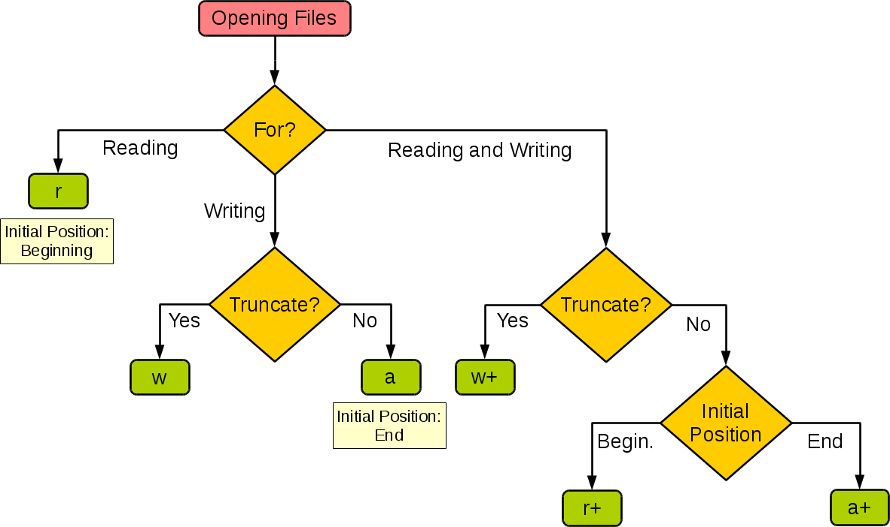

## 文件和异常

实际开发中常常会遇到对数据进行[持久化](https://baike.baidu.com/item/%E6%95%B0%E6%8D%AE%E6%8C%81%E4%B9%85%E5%8C%96)操作的场景，而实现数据持久化最直接简单的方式就是将数据保存到文件中。说到“文件”这个词，可能需要先科普一下关于[文件系统](https://zh.wikipedia.org/wiki/%E6%96%87%E4%BB%B6%E7%B3%BB%E7%BB%9F)的知识，但是这里我们并不浪费笔墨介绍这个概念，请大家自行通过维基百科进行了解。

在Python中实现文件的读写操作其实非常简单，通过Python内置的`open`函数，我们可以指定文件名、操作模式、编码信息等来获得操作文件的对象，接下来就可以对文件进行读写操作了。这里所说的操作模式是指要打开什么样的文件（字符文件还是二进制文件）以及做什么样的操作（读、写还是追加），具体的如下表所示。

| 操作模式 | 具体含义                         |
| -------- | -------------------------------- |
| `'r'`    | 读取 （默认）                    |
| `'w'`    | 写入（会先截断之前的内容）       |
| `'x'`    | 写入，如果文件已经存在会产生异常 |
| `'a'`    | 追加，将内容写入到已有文件的末尾 |
| `'b'`    | 二进制模式                       |
| `'t'`    | 文本模式（默认）                 |
| `'+'`    | 更新（既可以读又可以写）         |

下面这张图来自于[菜鸟教程](http://www.runoob.com)网站，它展示了如果根据应用程序的需要来设置操作模式。



### 读写文本文件

读取文本文件时，需要在使用`open`函数时指定好带路径的文件名（可以使用相对路径或绝对路径）并将文件模式设置为`'r'`（如果不指定，默认值也是`'r'`），然后通过`encoding`参数指定编码（如果不指定，默认值是None，那么在读取文件时使用的是操作系统默认的编码），如果不能保证保存文件时使用的编码方式与encoding参数指定的编码方式是一致的，那么就可能因无法解码字符而导致读取失败。下面的例子演示了如何读取一个纯文本文件。

```Python
def main():
    f = open('致橡树.txt', 'r', encoding='utf-8')
    print(f.read())
    f.close()


if __name__ == '__main__':
    main()
```

请注意上面的代码，如果`open`函数指定的文件并不存在或者无法打开，那么将引发异常状况导致程序崩溃。为了让代码有一定的健壮性和容错性，我们可以使用Python的异常机制对可能在运行时发生状况的代码进行适当的处理，如下所示。

```Python
def main():
    f = None
    try:
        f = open('致橡树.txt', 'r', encoding='utf-8')
        print(f.read())
    except FileNotFoundError:
        print('无法打开指定的文件!')
    except LookupError:
        print('指定了未知的编码!')
    except UnicodeDecodeError:
        print('读取文件时解码错误!')
    finally:
        if f:
            f.close()


if __name__ == '__main__':
    main()
```

在Python中，我们可以将那些在运行时可能会出现状况的代码放在`try`代码块中，在`try`代码块的后面可以跟上一个或多个`except`来捕获可能出现的异常状况。例如在上面读取文件的过程中，文件找不到会引发`FileNotFoundError`，指定了未知的编码会引发`LookupError`，而如果读取文件时无法按指定方式解码会引发`UnicodeDecodeError`，我们在`try`后面跟上了三个`except`分别处理这三种不同的异常状况。最后我们使用`finally`代码块来关闭打开的文件，释放掉程序中获取的外部资源，由于`finally`块的代码不论程序正常还是异常都会执行到（甚至是调用了`sys`模块的`exit`函数退出Python环境，`finally`块都会被执行，因为`exit`函数实质上是引发了`SystemExit`异常），因此我们通常把`finally`块称为“总是执行代码块”，它最适合用来做释放外部资源的操作。如果不愿意在`finally`代码块中关闭文件对象释放资源，也可以使用上下文语法，通过`with`关键字指定文件对象的上下文环境并在离开上下文环境时自动释放文件资源，代码如下所示。

```Python
def main():
    try:
        with open('致橡树.txt', 'r', encoding='utf-8') as f:
            print(f.read())
    except FileNotFoundError:
        print('无法打开指定的文件!')
    except LookupError:
        print('指定了未知的编码!')
    except UnicodeDecodeError:
        print('读取文件时解码错误!')


if __name__ == '__main__':
    main()
```

除了使用文件对象的`read`方法读取文件之外，还可以使用`for-in`循环逐行读取或者用`readlines`方法将文件按行读取到一个列表容器中，代码如下所示。

```Python
import time


def main():
    # 一次性读取整个文件内容
    with open('致橡树.txt', 'r', encoding='utf-8') as f:
        print(f.read())

    # 通过for-in循环逐行读取
    with open('致橡树.txt', mode='r') as f:
        for line in f:
            print(line, end='')
            time.sleep(0.5)
    print()

    # 读取文件按行读取到列表中
    with open('致橡树.txt') as f:
        lines = f.readlines()
    print(lines)
    

if __name__ == '__main__':
    main()
```

要将文本信息写入文件文件也非常简单，在使用`open`函数时指定好文件名并将文件模式设置为`'w'`即可。注意如果需要对文件内容进行追加式写入，应该将模式设置为`'a'`。如果要写入的文件不存在会自动创建文件而不是引发异常。下面的例子演示了如何将1-9999之间的素数分别写入三个文件中（1-99之间的素数保存在a.txt中，100-999之间的素数保存在b.txt中，1000-9999之间的素数保存在c.txt中）。

```Python
from math import sqrt


def is_prime(n):
    """判断素数的函数"""
    assert n > 0
    for factor in range(2, int(sqrt(n)) + 1):
        if n % factor == 0:
            return False
    return True if n != 1 else False


def main():
    filenames = ('a.txt', 'b.txt', 'c.txt')
    fs_list = []
    try:
        for filename in filenames:
            fs_list.append(open(filename, 'w', encoding='utf-8'))
        for number in range(1, 10000):
            if is_prime(number):
                if number < 100:
                    fs_list[0].write(str(number) + '\n')
                elif number < 1000:
                    fs_list[1].write(str(number) + '\n')
                else:
                    fs_list[2].write(str(number) + '\n')
    except IOError as ex:
        print(ex)
        print('写文件时发生错误!')
    finally:
        for fs in fs_list:
            fs.close()
    print('操作完成!')


if __name__ == '__main__':
    main()
```

### 读写二进制文件

知道了如何读写文本文件要读写二进制文件也就很简单了，下面的代码实现了复制图片文件的功能。

```Python
def main():
    try:
        with open('guido.jpg', 'rb') as fs1:
            data = fs1.read()
            print(type(data))  # <class 'bytes'>
        with open('吉多.jpg', 'wb') as fs2:
            fs2.write(data)
    except FileNotFoundError as e:
        print('指定的文件无法打开.')
    except IOError as e:
        print('读写文件时出现错误.')
    print('程序执行结束.')


if __name__ == '__main__':
    main()
```

### 读写JSON文件

通过上面的讲解，我们已经知道如何将文本数据和二进制数据保存到文件中，那么这里还有一个问题，如果希望把一个列表或者一个字典中的数据保存到文件中又该怎么做呢？答案是将数据以JSON格式进行保存。JSON是“JavaScript Object Notation”的缩写，它本来是JavaScript语言中创建对象的一种字面量语法，现在已经被广泛的应用于跨平台跨语言的数据交换，原因很简单，因为JSON也是纯文本，任何系统任何编程语言处理纯文本都是没有问题的。目前JSON基本上已经取代了XML作为异构系统间交换数据的事实标准。关于JSON的知识，更多的可以参考[JSON的官方网站](http://json.org)，从这个网站也可以了解到每种语言处理JSON数据格式可以使用的工具或三方库，下面是一个JSON的简单例子。

```JSON
{
    "name": "骆昊",
    "age": 38,
    "qq": 957658,
    "friends": ["王大锤", "白元芳"],
    "cars": [
        {"brand": "BYD", "max_speed": 180},
        {"brand": "Audi", "max_speed": 280},
        {"brand": "Benz", "max_speed": 320}
    ]
}
```

可能大家已经注意到了，上面的JSON跟Python中的字典其实是一样一样的，事实上JSON的数据类型和Python的数据类型是很容易找到对应关系的，如下面两张表所示。

| JSON                | Python       |
| ------------------- | ------------ |
| object              | dict         |
| array               | list         |
| string              | str          |
| number (int / real) | int / float  |
| true / false        | True / False |
| null                | None         |

| Python                                 | JSON         |
| -------------------------------------- | ------------ |
| dict                                   | object       |
| list, tuple                            | array        |
| str                                    | string       |
| int, float, int- & float-derived Enums | number       |
| True / False                           | true / false |
| None                                   | null         |

我们使用Python中的json模块就可以将字典或列表以JSON格式保存到文件中，代码如下所示。

```Python
import json


def main():
    mydict = {
        'name': '骆昊',
        'age': 38,
        'qq': 957658,
        'friends': ['王大锤', '白元芳'],
        'cars': [
            {'brand': 'BYD', 'max_speed': 180},
            {'brand': 'Audi', 'max_speed': 280},
            {'brand': 'Benz', 'max_speed': 320}
        ]
    }
    try:
        with open('data.json', 'w', encoding='utf-8') as fs:
            json.dump(mydict, fs)
    except IOError as e:
        print(e)
    print('保存数据完成!')


if __name__ == '__main__':
    main()
```

json模块主要有四个比较重要的函数，分别是：

- `dump` - 将Python对象按照JSON格式序列化到文件中
- `dumps` - 将Python对象处理成JSON格式的字符串
- `load` - 将文件中的JSON数据反序列化成对象
- `loads` - 将字符串的内容反序列化成Python对象

这里出现了两个概念，一个叫序列化，一个叫反序列化。自由的百科全书[维基百科](https://zh.wikipedia.org/)上对这两个概念是这样解释的：“序列化（serialization）在计算机科学的数据处理中，是指将数据结构或对象状态转换为可以存储或传输的形式，这样在需要的时候能够恢复到原先的状态，而且通过序列化的数据重新获取字节时，可以利用这些字节来产生原始对象的副本（拷贝）。与这个过程相反的动作，即从一系列字节中提取数据结构的操作，就是反序列化（deserialization）”。

目前绝大多数网络数据服务（或称之为网络API）都是基于[HTTP协议](https://zh.wikipedia.org/wiki/%E8%B6%85%E6%96%87%E6%9C%AC%E4%BC%A0%E8%BE%93%E5%8D%8F%E8%AE%AE)提供JSON格式的数据，关于HTTP协议的相关知识，可以看看阮一峰老师的[《HTTP协议入门》](http://www.ruanyifeng.com/blog/2016/08/http.html)，如果想了解国内的网络数据服务，可以看看[聚合数据](https://www.juhe.cn/)和[阿凡达数据](http://www.avatardata.cn/)等网站，国外的可以看看[{API}Search](http://apis.io/)网站。下面的例子演示了如何使用[requests](http://docs.python-requests.org/zh_CN/latest/)模块（封装得足够好的第三方网络访问模块）访问网络API获取国内新闻，如何通过json模块解析JSON数据并显示新闻标题，这个例子使用了[天行数据](https://www.tianapi.com/)提供的国内新闻数据接口，其中的APIKey需要自己到该网站申请。

```Python
import requests
import json


def main():
    resp = requests.get('http://api.tianapi.com/guonei/?key=APIKey&num=10')
    data_model = json.loads(resp.text)
    for news in data_model['newslist']:
        print(news['title'])


if __name__ == '__main__':
    main()
```

在Python中要实现序列化和反序列化除了使用json模块之外，还可以使用pickle和shelve模块，但是这两个模块是使用特有的序列化协议来序列化数据，因此序列化后的数据只能被Python识别。关于这两个模块的相关知识可以自己看看网络上的资料。另外，如果要了解更多的关于Python异常机制的知识，可以看看segmentfault上面的文章[《总结：Python中的异常处理》](https://segmentfault.com/a/1190000007736783)，这篇文章不仅介绍了Python中异常机制的使用，还总结了一系列的最佳实践，很值得一读。