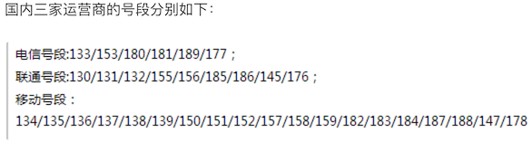

## 使用正则表达式

### 正则表达式相关知识

在编写处理字符串的程序或网页时，经常会有查找符合某些复杂规则的字符串的需要，正则表达式就是用于描述这些规则的工具，换句话说正则表达式是一种工具，它定义了字符串的匹配模式（如何检查一个字符串是否有跟某种模式匹配的部分或者从一个字符串中将与模式匹配的部分提取出来或者替换掉）。如果你在Windows操作系统中使用过文件查找并且在指定文件名时使用过通配符（\*和?），那么正则表达式也是与之类似的用来进行文本匹配的工具，只不过比起通配符正则表达式更强大，它能更精确地描述你的需求（当然你付出的代价是书写一个正则表达式比打出一个通配符要复杂得多，要知道任何给你带来好处的东西都是有代价的，就如同学习一门编程语言一样），比如你可以编写一个正则表达式，用来查找所有以0开头，后面跟着2-3个数字，然后是一个连字号“-”，最后是7或8位数字的字符串（像028-12345678或0813-7654321），这不就是国内的座机号码吗。最初计算机是为了做数学运算而诞生的，处理的信息基本上都是数值，而今天我们在日常工作中处理的信息基本上都是文本数据，我们希望计算机能够识别和处理符合某些模式的文本，正则表达式就显得非常重要了。今天几乎所有的编程语言都提供了对正则表达式操作的支持，Python通过标准库中的re模块来支持正则表达式操作。

我们可以考虑下面一个问题：我们从某个地方（可能是一个文本文件，也可能是网络上的一则新闻）获得了一个字符串，希望在字符串中找出手机号和座机号。当然我们可以设定手机号是11位的数字（注意并不是随机的11位数字，因为你没有见过“25012345678”这样的手机号吧）而座机号跟上一段中描述的模式相同，如果不使用正则表达式要完成这个任务就会很麻烦。

关于正则表达式的相关知识，大家可以阅读一篇非常有名的博客叫[《正则表达式30分钟入门教程》](https://deerchao.net/tutorials/regex/regex.htm)，读完这篇文章后你就可以看懂下面的表格，这是我们对正则表达式中的一些基本符号进行的扼要总结。

| 符号               | 解释                                      | 示例             | 说明                                               |
| ------------------ | ----------------------------------------- | ---------------- | -------------------------------------------------- |
| .                  | 匹配任意字符                              | b.t              | 可以匹配bat / but / b#t / b1t等                    |
| \\w                | 匹配字母/数字/下划线                      | b\\wt            | 可以匹配bat / b1t / b_t等<br>但不能匹配b#t         |
| \\s                | 匹配空白字符（包括\r、\n、\t等）          | love\\syou       | 可以匹配love you                                   |
| \\d                | 匹配数字                                  | \\d\\d           | 可以匹配01 / 23 / 99等                             |
| \\b                | 匹配单词的边界                            | \\bThe\\b        |                                                    |
| ^                  | 匹配字符串的开始                          | ^The             | 可以匹配The开头的字符串                            |
| $                  | 匹配字符串的结束                          | .exe$            | 可以匹配.exe结尾的字符串                           |
| \\W                 | 匹配非字母/数字/下划线                    | b\\Wt            | 可以匹配b#t / b@t等<br>但不能匹配but / b1t / b_t等 |
| \\S                 | 匹配非空白字符                            | love\\Syou       | 可以匹配love#you等<br>但不能匹配love you           |
| \\D                 | 匹配非数字                                | \\d\\D           | 可以匹配9a / 3# / 0F等                             |
| \\B                 | 匹配非单词边界                            | \\Bio\\B         |                                                    |
| []                 | 匹配来自字符集的任意单一字符              | [aeiou]          | 可以匹配任一元音字母字符                           |
| [^]                | 匹配不在字符集中的任意单一字符            | [^aeiou]         | 可以匹配任一非元音字母字符                         |
| *                  | 匹配0次或多次                             | \\w*             |                                                    |
| +                  | 匹配1次或多次                             | \\w+             |                                                    |
| ?                  | 匹配0次或1次                              | \\w?             |                                                    |
| {N}                | 匹配N次                                   | \\w{3}            |                                                    |
| {M,}               | 匹配至少M次                               | \\w{3,}           |                                                    |
| {M,N}              | 匹配至少M次至多N次                        | \\w{3,6}          |                                                    |
| \|                 | 分支                                      | foo\|bar         | 可以匹配foo或者bar                                 |
| (?#)               | 注释                                      |                  |                                                    |
| (exp)              | 匹配exp并捕获到自动命名的组中             |                  |                                                    |
| (?&lt;name&gt;exp) | 匹配exp并捕获到名为name的组中             |                  |                                                    |
| (?:exp)            | 匹配exp但是不捕获匹配的文本               |                  |                                                    |
| (?=exp)            | 匹配exp前面的位置                         | \\b\\w+(?=ing)     | 可以匹配I'm dancing中的danc                        |
| (?<=exp)           | 匹配exp后面的位置                         | (?<=\\bdanc)\\w+\\b | 可以匹配I love dancing and reading中的第一个ing    |
| (?!exp)            | 匹配后面不是exp的位置                     |                  |                                                    |
| (?<!exp)           | 匹配前面不是exp的位置                     |                  |                                                    |
| *?                 | 重复任意次，但尽可能少重复 | a.\*b<br>a.\*?b | 将正则表达式应用于aabab，前者会匹配整个字符串aabab，后者会匹配aab和ab两个字符串 |
| +?                 | 重复1次或多次，但尽可能少重复 |                  |                                                    |
| ??                 | 重复0次或1次，但尽可能少重复 |                  |                                                    |
| {M,N}?             | 重复M到N次，但尽可能少重复 |                  |                                                    |
| {M,}?              | 重复M次以上，但尽可能少重复 |                  |                                                    |

> **说明：** 如果需要匹配的字符是正则表达式中的特殊字符，那么可以使用\\进行转义处理，例如想匹配小数点可以写成\\.就可以了，因为直接写.会匹配任意字符；同理，想匹配圆括号必须写成\\(和\\)，否则圆括号被视为正则表达式中的分组。

### Python对正则表达式的支持

Python提供了re模块来支持正则表达式相关操作，下面是re模块中的核心函数。

| 函数                                         | 说明                                                         |
| -------------------------------------------- | ------------------------------------------------------------ |
| compile(pattern, flags=0)                    | 编译正则表达式返回正则表达式对象                             |
| match(pattern, string, flags=0)              | 用正则表达式匹配字符串 成功返回匹配对象 否则返回None         |
| search(pattern, string, flags=0)             | 搜索字符串中第一次出现正则表达式的模式 成功返回匹配对象 否则返回None |
| split(pattern, string, maxsplit=0, flags=0)  | 用正则表达式指定的模式分隔符拆分字符串 返回列表              |
| sub(pattern, repl, string, count=0, flags=0) | 用指定的字符串替换原字符串中与正则表达式匹配的模式 可以用count指定替换的次数 |
| fullmatch(pattern, string, flags=0)          | match函数的完全匹配（从字符串开头到结尾）版本                |
| findall(pattern, string, flags=0)            | 查找字符串所有与正则表达式匹配的模式 返回字符串的列表        |
| finditer(pattern, string, flags=0)           | 查找字符串所有与正则表达式匹配的模式 返回一个迭代器          |
| purge()                                      | 清除隐式编译的正则表达式的缓存                               |
| re.I / re.IGNORECASE                         | 忽略大小写匹配标记                                           |
| re.M / re.MULTILINE                          | 多行匹配标记                                                 |

> **说明：** 上面提到的re模块中的这些函数，实际开发中也可以用正则表达式对象的方法替代对这些函数的使用，如果一个正则表达式需要重复的使用，那么先通过compile函数编译正则表达式并创建出正则表达式对象无疑是更为明智的选择。

下面我们通过一系列的例子来告诉大家在Python中如何使用正则表达式。

#### 例子1：验证输入用户名和QQ号是否有效并给出对应的提示信息。

```Python
"""
验证输入用户名和QQ号是否有效并给出对应的提示信息

要求：用户名必须由字母、数字或下划线构成且长度在6~20个字符之间，QQ号是5~12的数字且首位不能为0
"""
import re


def main():
    username = input('请输入用户名: ')
    qq = input('请输入QQ号: ')
    # match函数的第一个参数是正则表达式字符串或正则表达式对象
    # 第二个参数是要跟正则表达式做匹配的字符串对象
    m1 = re.match(r'^[0-9a-zA-Z_]{6,20}$', username)
    if not m1:
        print('请输入有效的用户名.')
    m2 = re.match(r'^[1-9]\d{4,11}$', qq)
    if not m2:
        print('请输入有效的QQ号.')
    if m1 and m2:
        print('你输入的信息是有效的!')


if __name__ == '__main__':
    main()
```

> **提示：** 上面在书写正则表达式时使用了“原始字符串”的写法（在字符串前面加上了r），所谓“原始字符串”就是字符串中的每个字符都是它原始的意义，说得更直接一点就是字符串中没有所谓的转义字符啦。因为正则表达式中有很多元字符和需要进行转义的地方，如果不使用原始字符串就需要将反斜杠写作\\\\，例如表示数字的\\d得书写成\\\\d，这样不仅写起来不方便，阅读的时候也会很吃力。

#### 例子2：从一段文字中提取出国内手机号码。

下面这张图是截止到2017年底，国内三家运营商推出的手机号段。



```Python
import re


def main():
    # 创建正则表达式对象 使用了前瞻和回顾来保证手机号前后不应该出现数字
    pattern = re.compile(r'(?<=\D)1[34578]\d{9}(?=\D)')
    sentence = '''
    重要的事情说8130123456789遍，我的手机号是13512346789这个靓号，
    不是15600998765，也是110或119，王大锤的手机号才是15600998765。
    '''
    # 查找所有匹配并保存到一个列表中
    mylist = re.findall(pattern, sentence)
    print(mylist)
    print('--------华丽的分隔线--------')
    # 通过迭代器取出匹配对象并获得匹配的内容
    for temp in pattern.finditer(sentence):
        print(temp.group())
    print('--------华丽的分隔线--------')
    # 通过search函数指定搜索位置找出所有匹配
    m = pattern.search(sentence)
    while m:
        print(m.group())
        m = pattern.search(sentence, m.end())


if __name__ == '__main__':
    main()
```

> **说明：** 上面匹配国内手机号的正则表达式并不够好，因为像14开头的号码只有145或147，而上面的正则表达式并没有考虑这种情况，要匹配国内手机号，更好的正则表达式的写法是：`(?<=\D)(1[38]\d{9}|14[57]\d{8}|15[0-35-9]\d{8}|17[678]\d{8})(?=\D)`，国内最近好像有19和16开头的手机号了，但是这个暂时不在我们考虑之列。

#### 例子3：替换字符串中的不良内容

```Python
import re


def main():
    sentence = '你丫是傻叉吗? 我操你大爷的. Fuck you.'
    purified = re.sub('[操肏艹]|fuck|shit|傻[比屄逼叉缺吊屌]|煞笔',
                      '*', sentence, flags=re.IGNORECASE)
    print(purified)  # 你丫是*吗? 我*你大爷的. * you.


if __name__ == '__main__':
    main()
```

> **说明：** re模块的正则表达式相关函数中都有一个flags参数，它代表了正则表达式的匹配标记，可以通过该标记来指定匹配时是否忽略大小写、是否进行多行匹配、是否显示调试信息等。如果需要为flags参数指定多个值，可以使用[按位或运算符](http://www.runoob.com/python/python-operators.html#ysf5)进行叠加，如`flags=re.I | re.M`。

#### 例子4：拆分长字符串

```Python
import re


def main():
    poem = '窗前明月光，疑是地上霜。举头望明月，低头思故乡。'
    sentence_list = re.split(r'[，。, .]', poem)
    while '' in sentence_list:
        sentence_list.remove('')
    print(sentence_list)  # ['窗前明月光', '疑是地上霜', '举头望明月', '低头思故乡']


if __name__ == '__main__':
    main()
```

### 后话

如果要从事爬虫类应用的开发，那么正则表达式一定是一个非常好的助手，因为它可以帮助我们迅速的从网页代码中发现某种我们指定的模式并提取出我们需要的信息，当然对于初学者来收，要编写一个正确的适当的正则表达式可能并不是一件容易的事情（当然有些常用的正则表达式可以直接在网上找找），所以实际开发爬虫应用的时候，有很多人会选择[Beautiful Soup](https://www.crummy.com/software/BeautifulSoup/)或[Lxml](http://lxml.de/)来进行匹配和信息的提取，前者简单方便但是性能较差，后者既好用性能也好，但是安装稍嫌麻烦，这些内容我们会在后期的爬虫专题中为大家介绍。