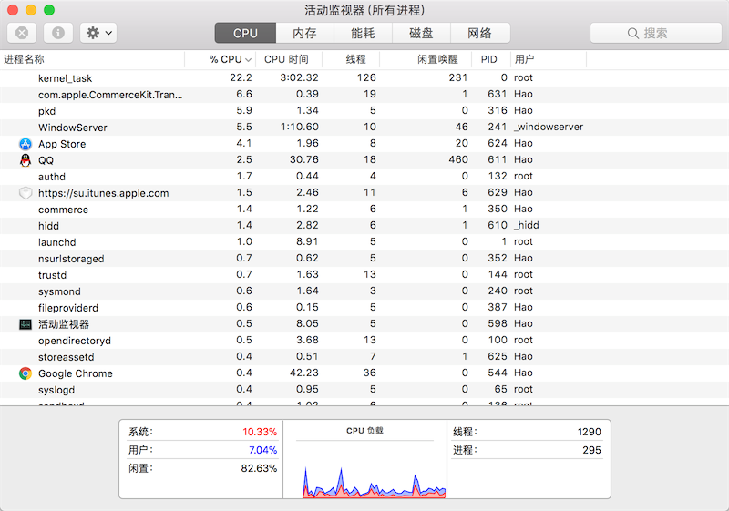

## 进程和线程

今天我们使用的计算机早已进入多CPU或多核时代，而我们使用的操作系统都是支持“多任务”的操作系统，这使得我们可以同时运行多个程序，也可以将一个程序分解为若干个相对独立的子任务，让多个子任务并发的执行，从而缩短程序的执行时间，同时也让用户获得更好的体验。因此在当下不管是用什么编程语言进行开发，实现让程序同时执行多个任务也就是常说的“并发编程”，应该是程序员必备技能之一。为此，我们需要先讨论两个概念，一个叫进程，一个叫线程。

### 概念

进程就是操作系统中执行的一个程序，操作系统以进程为单位分配存储空间，每个进程都有自己的地址空间、数据栈以及其他用于跟踪进程执行的辅助数据，操作系统管理所有进程的执行，为它们合理的分配资源。进程可以通过fork或spawn的方式来创建新的进程来执行其他的任务，不过新的进程也有自己独立的内存空间，因此必须通过进程间通信机制（IPC，Inter-Process Communication）来实现数据共享，具体的方式包括管道、信号、套接字、共享内存区等。

一个进程还可以拥有多个并发的执行线索，简单的说就是拥有多个可以获得CPU调度的执行单元，这就是所谓的线程。由于线程在同一个进程下，它们可以共享相同的上下文，因此相对于进程而言，线程间的信息共享和通信更加容易。当然在单核CPU系统中，真正的并发是不可能的，因为在某个时刻能够获得CPU的只有唯一的一个线程，多个线程共享了CPU的执行时间。使用多线程实现并发编程为程序带来的好处是不言而喻的，最主要的体现在提升程序的性能和改善用户体验，今天我们使用的软件几乎都用到了多线程技术，这一点可以利用系统自带的进程监控工具（如macOS中的“活动监视器”、Windows中的“任务管理器”）来证实，如下图所示。



当然多线程也并不是没有坏处，站在其他进程的角度，多线程的程序对其他程序并不友好，因为它占用了更多的CPU执行时间，导致其他程序无法获得足够的CPU执行时间；另一方面，站在开发者的角度，编写和调试多线程的程序都对开发者有较高的要求，对于初学者来说更加困难。

Python既支持多进程又支持多线程，因此使用Python实现并发编程主要有3种方式：多进程、多线程、多进程+多线程。

### Python中的多进程

Unix和Linux操作系统上提供了`fork()`系统调用来创建进程，调用`fork()`函数的是父进程，创建出的是子进程，子进程是父进程的一个拷贝，但是子进程拥有自己的PID。`fork()`函数非常特殊它会返回两次，父进程中可以通过`fork()`函数的返回值得到子进程的PID，而子进程中的返回值永远都是0。Python的os模块提供了`fork()`函数。由于Windows系统没有`fork()`调用，因此要实现跨平台的多进程编程，可以使用multiprocessing模块的`Process`类来创建子进程，而且该模块还提供了更高级的封装，例如批量启动进程的进程池（`Pool`）、用于进程间通信的队列（`Queue`）和管道（`Pipe`）等。

下面用一个下载文件的例子来说明使用多进程和不使用多进程到底有什么差别，先看看下面的代码。

```Python
from random import randint
from time import time, sleep


def download_task(filename):
    print('开始下载%s...' % filename)
    time_to_download = randint(5, 10)
    sleep(time_to_download)
    print('%s下载完成! 耗费了%d秒' % (filename, time_to_download))


def main():
    start = time()
    download_task('Python从入门到住院.pdf')
    download_task('Peking Hot.avi')
    end = time()
    print('总共耗费了%.2f秒.' % (end - start))


if __name__ == '__main__':
    main()
```

下面是运行程序得到的一次运行结果。

```Shell
开始下载Python从入门到住院.pdf...
Python从入门到住院.pdf下载完成! 耗费了6秒
开始下载Peking Hot.avi...
Peking Hot.avi下载完成! 耗费了7秒
总共耗费了13.01秒.
```

从上面的例子可以看出，如果程序中的代码只能按顺序一点点的往下执行，那么即使执行两个毫不相关的下载任务，也需要先等待一个文件下载完成后才能开始下一个下载任务，很显然这并不合理也没有效率。接下来我们使用多进程的方式将两个下载任务放到不同的进程中，代码如下所示。

```Python
from multiprocessing import Process
from os import getpid
from random import randint
from time import time, sleep


def download_task(filename):
    print('启动下载进程，进程号[%d].' % getpid())
    print('开始下载%s...' % filename)
    time_to_download = randint(5, 10)
    sleep(time_to_download)
    print('%s下载完成! 耗费了%d秒' % (filename, time_to_download))


def main():
    start = time()
    p1 = Process(target=download_task, args=('Python从入门到住院.pdf', ))
    p1.start()
    p2 = Process(target=download_task, args=('Peking Hot.avi', ))
    p2.start()
    p1.join()
    p2.join()
    end = time()
    print('总共耗费了%.2f秒.' % (end - start))


if __name__ == '__main__':
    main()
```

在上面的代码中，我们通过`Process`类创建了进程对象，通过`target`参数我们传入一个函数来表示进程启动后要执行的代码，后面的`args`是一个元组，它代表了传递给函数的参数。`Process`对象的`start`方法用来启动进程，而`join`方法表示等待进程执行结束。运行上面的代码可以明显发现两个下载任务“同时”启动了，而且程序的执行时间将大大缩短，不再是两个任务的时间总和。下面是程序的一次执行结果。

```Shell
启动下载进程，进程号[1530].
开始下载Python从入门到住院.pdf...
启动下载进程，进程号[1531].
开始下载Peking Hot.avi...
Peking Hot.avi下载完成! 耗费了7秒
Python从入门到住院.pdf下载完成! 耗费了10秒
总共耗费了10.01秒.
```

我们也可以使用subprocess模块中的类和函数来创建和启动子进程，然后通过管道来和子进程通信，这些内容我们不在此进行讲解，有兴趣的读者可以自己了解这些知识。接下来我们将重点放在如何实现两个进程间的通信。我们启动两个进程，一个输出Ping，一个输出Pong，两个进程输出的Ping和Pong加起来一共10个。听起来很简单吧，但是如果这样写可是错的哦。

```Python
from multiprocessing import Process
from time import sleep

counter = 0


def sub_task(string):
    global counter
    while counter < 10:
        print(string, end='', flush=True)
        counter += 1
        sleep(0.01)

        
def main():
    Process(target=sub_task, args=('Ping', )).start()
    Process(target=sub_task, args=('Pong', )).start()


if __name__ == '__main__':
    main()
```

看起来没毛病，但是最后的结果是Ping和Pong各输出了10个，Why？当我们在程序中创建进程的时候，子进程复制了父进程及其所有的数据结构，每个子进程有自己独立的内存空间，这也就意味着两个子进程中各有一个`counter`变量，所以结果也就可想而知了。要解决这个问题比较简单的办法是使用multiprocessing模块中的`Queue`类，它是可以被多个进程共享的队列，底层是通过管道和[信号量（semaphore）]()机制来实现的，有兴趣的读者可以自己尝试一下。


### Python中的多线程

在Python早期的版本中就引入了thread模块（现在名为_thread）来实现多线程编程，然而该模块过于底层，而且很多功能都没有提供，因此目前的多线程开发我们推荐使用threading模块，该模块对多线程编程提供了更好的面向对象的封装。我们把刚才下载文件的例子用多线程的方式来实现一遍。

```Python
from random import randint
from threading import Thread
from time import time, sleep


def download(filename):
    print('开始下载%s...' % filename)
    time_to_download = randint(5, 10)
    sleep(time_to_download)
    print('%s下载完成! 耗费了%d秒' % (filename, time_to_download))


def main():
    start = time()
    t1 = Thread(target=download, args=('Python从入门到住院.pdf',))
    t1.start()
    t2 = Thread(target=download, args=('Peking Hot.avi',))
    t2.start()
    t1.join()
    t2.join()
    end = time()
    print('总共耗费了%.3f秒' % (end - start))


if __name__ == '__main__':
    main()
```

我们可以直接使用threading模块的`Thread`类来创建线程，但是我们之前讲过一个非常重要的概念叫“继承”，我们可以从已有的类创建新类，因此也可以通过继承`Thread`类的方式来创建自定义的线程类，然后再创建线程对象并启动线程。代码如下所示。

```Python
from random import randint
from threading import Thread
from time import time, sleep


class DownloadTask(Thread):

    def __init__(self, filename):
        super().__init__()
        self._filename = filename

    def run(self):
        print('开始下载%s...' % self._filename)
        time_to_download = randint(5, 10)
        sleep(time_to_download)
        print('%s下载完成! 耗费了%d秒' % (self._filename, time_to_download))


def main():
    start = time()
    t1 = DownloadTask('Python从入门到住院.pdf')
    t1.start()
    t2 = DownloadTask('Peking Hot.avi')
    t2.start()
    t1.join()
    t2.join()
    end = time()
    print('总共耗费了%.2f秒.' % (end - start))


if __name__ == '__main__':
    main()
```

因为多个线程可以共享进程的内存空间，因此要实现多个线程间的通信相对简单，大家能想到的最直接的办法就是设置一个全局变量，多个线程共享这个全局变量即可。但是当多个线程共享同一个变量（我们通常称之为“资源”）的时候，很有可能产生不可控的结果从而导致程序失效甚至崩溃。如果一个资源被多个线程竞争使用，那么我们通常称之为“临界资源”，对“临界资源”的访问需要加上保护，否则资源会处于“混乱”的状态。下面的例子演示了100个线程向同一个银行账户转账（转入1元钱）的场景，在这个例子中，银行账户就是一个临界资源，在没有保护的情况下我们很有可能会得到错误的结果。

```Python
from time import sleep
from threading import Thread


class Account(object):

    def __init__(self):
        self._balance = 0

    def deposit(self, money):
        # 计算存款后的余额
        new_balance = self._balance + money
        # 模拟受理存款业务需要0.01秒的时间
        sleep(0.01)
        # 修改账户余额
        self._balance = new_balance

    @property
    def balance(self):
        return self._balance


class AddMoneyThread(Thread):

    def __init__(self, account, money):
        super().__init__()
        self._account = account
        self._money = money

    def run(self):
        self._account.deposit(self._money)


def main():
    account = Account()
    threads = []
    # 创建100个存款的线程向同一个账户中存钱
    for _ in range(100):
        t = AddMoneyThread(account, 1)
        threads.append(t)
        t.start()
    # 等所有存款的线程都执行完毕
    for t in threads:
        t.join()
    print('账户余额为: ￥%d元' % account.balance)


if __name__ == '__main__':
    main()
```

运行上面的程序，结果让人大跌眼镜，100个线程分别向账户中转入1元钱，结果居然远远小于100元。之所以出现这种情况是因为我们没有对银行账户这个“临界资源”加以保护，多个线程同时向账户中存钱时，会一起执行到`new_balance = self._balance + money`这行代码，多个线程得到的账户余额都是初始状态下的`0`，所以都是`0`上面做了+1的操作，因此得到了错误的结果。在这种情况下，“锁”就可以派上用场了。我们可以通过“锁”来保护“临界资源”，只有获得“锁”的线程才能访问“临界资源”，而其他没有得到“锁”的线程只能被阻塞起来，直到获得“锁”的线程释放了“锁”，其他线程才有机会获得“锁”，进而访问被保护的“临界资源”。下面的代码演示了如何使用“锁”来保护对银行账户的操作，从而获得正确的结果。

```Python
from time import sleep
from threading import Thread, Lock


class Account(object):

    def __init__(self):
        self._balance = 0
        self._lock = Lock()

    def deposit(self, money):
        # 先获取锁才能执行后续的代码
        self._lock.acquire()
        try:
            new_balance = self._balance + money
            sleep(0.01)
            self._balance = new_balance
        finally:
            # 在finally中执行释放锁的操作保证正常异常锁都能释放
            self._lock.release()

    @property
    def balance(self):
        return self._balance


class AddMoneyThread(Thread):

    def __init__(self, account, money):
        super().__init__()
        self._account = account
        self._money = money

    def run(self):
        self._account.deposit(self._money)


def main():
    account = Account()
    threads = []
    for _ in range(100):
        t = AddMoneyThread(account, 1)
        threads.append(t)
        t.start()
    for t in threads:
        t.join()
    print('账户余额为: ￥%d元' % account.balance)


if __name__ == '__main__':
    main()
```

比较遗憾的一件事情是Python的多线程并不能发挥CPU的多核特性，这一点只要启动几个执行死循环的线程就可以得到证实了。之所以如此，是因为Python的解释器有一个“全局解释器锁”（GIL）的东西，任何线程执行前必须先获得GIL锁，然后每执行100条字节码，解释器就自动释放GIL锁，让别的线程有机会执行，这是一个历史遗留问题，但是即便如此，就如我们之前举的例子，使用多线程在提升执行效率和改善用户体验方面仍然是有积极意义的。

### 多进程还是多线程

无论是多进程还是多线程，只要数量一多，效率肯定上不去，为什么呢？我们打个比方，假设你不幸正在准备中考，每天晚上需要做语文、数学、英语、物理、化学这5科的作业，每项作业耗时1小时。如果你先花1小时做语文作业，做完了，再花1小时做数学作业，这样，依次全部做完，一共花5小时，这种方式称为单任务模型。如果你打算切换到多任务模型，可以先做1分钟语文，再切换到数学作业，做1分钟，再切换到英语，以此类推，只要切换速度足够快，这种方式就和单核CPU执行多任务是一样的了，以旁观者的角度来看，你就正在同时写5科作业。

但是，切换作业是有代价的，比如从语文切到数学，要先收拾桌子上的语文书本、钢笔（这叫保存现场），然后，打开数学课本、找出圆规直尺（这叫准备新环境），才能开始做数学作业。操作系统在切换进程或者线程时也是一样的，它需要先保存当前执行的现场环境（CPU寄存器状态、内存页等），然后，把新任务的执行环境准备好（恢复上次的寄存器状态，切换内存页等），才能开始执行。这个切换过程虽然很快，但是也需要耗费时间。如果有几千个任务同时进行，操作系统可能就主要忙着切换任务，根本没有多少时间去执行任务了，这种情况最常见的就是硬盘狂响，点窗口无反应，系统处于假死状态。所以，多任务一旦多到一个限度，反而会使得系统性能急剧下降，最终导致所有任务都做不好。

是否采用多任务的第二个考虑是任务的类型，可以把任务分为计算密集型和I/O密集型。计算密集型任务的特点是要进行大量的计算，消耗CPU资源，比如对视频进行编码解码或者格式转换等等，这种任务全靠CPU的运算能力，虽然也可以用多任务完成，但是任务越多，花在任务切换的时间就越多，CPU执行任务的效率就越低。计算密集型任务由于主要消耗CPU资源，这类任务用Python这样的脚本语言去执行效率通常很低，最能胜任这类任务的是C语言，我们之前提到了Python中有嵌入C/C++代码的机制。

除了计算密集型任务，其他的涉及到网络、存储介质I/O的任务都可以视为I/O密集型任务，这类任务的特点是CPU消耗很少，任务的大部分时间都在等待I/O操作完成（因为I/O的速度远远低于CPU和内存的速度）。对于I/O密集型任务，如果启动多任务，就可以减少I/O等待时间从而让CPU高效率的运转。有一大类的任务都属于I/O密集型任务，这其中包括了我们很快会涉及到的网络应用和Web应用。

> **说明：** 上面的内容和例子来自于[廖雪峰官方网站的《Python教程》](https://www.liaoxuefeng.com/wiki/0014316089557264a6b348958f449949df42a6d3a2e542c000)，因为对作者文中的某些观点持有不同的看法，对原文的文字描述做了适当的调整。

### 单线程+异步I/O

现代操作系统对I/O操作的改进中最为重要的就是支持异步I/O。如果充分利用操作系统提供的异步I/O支持，就可以用单进程单线程模型来执行多任务，这种全新的模型称为事件驱动模型。Nginx就是支持异步I/O的Web服务器，它在单核CPU上采用单进程模型就可以高效地支持多任务。在多核CPU上，可以运行多个进程（数量与CPU核心数相同），充分利用多核CPU。用Node.js开发的服务器端程序也使用了这种工作模式，这也是当下实现多任务编程的一种趋势。

在Python语言中，单线程+异步I/O的编程模型称为协程，有了协程的支持，就可以基于事件驱动编写高效的多任务程序。协程最大的优势就是极高的执行效率，因为子程序切换不是线程切换，而是由程序自身控制，因此，没有线程切换的开销。协程的第二个优势就是不需要多线程的锁机制，因为只有一个线程，也不存在同时写变量冲突，在协程中控制共享资源不用加锁，只需要判断状态就好了，所以执行效率比多线程高很多。如果想要充分利用CPU的多核特性，最简单的方法是多进程+协程，既充分利用多核，又充分发挥协程的高效率，可获得极高的性能。关于这方面的内容，我稍后会做一个专题来进行讲解。

### 应用案例

#### 例子1：将耗时间的任务放到线程中以获得更好的用户体验。

如下所示的界面中，有“下载”和“关于”两个按钮，用休眠的方式模拟点击“下载”按钮会联网下载文件需要耗费10秒的时间，如果不使用“多线程”，我们会发现，当点击“下载”按钮后整个程序的其他部分都被这个耗时间的任务阻塞而无法执行了，这显然是非常糟糕的用户体验，代码如下所示。

```Python
import time
import tkinter
import tkinter.messagebox


def download():
    # 模拟下载任务需要花费10秒钟时间
    time.sleep(10)
    tkinter.messagebox.showinfo('提示', '下载完成!')


def show_about():
    tkinter.messagebox.showinfo('关于', '作者: 骆昊(v1.0)')


def main():
    top = tkinter.Tk()
    top.title('单线程')
    top.geometry('200x150')
    top.wm_attributes('-topmost', True)

    panel = tkinter.Frame(top)
    button1 = tkinter.Button(panel, text='下载', command=download)
    button1.pack(side='left')
    button2 = tkinter.Button(panel, text='关于', command=show_about)
    button2.pack(side='right')
    panel.pack(side='bottom')

    tkinter.mainloop()


if __name__ == '__main__':
    main()
```

如果使用多线程将耗时间的任务放到一个独立的线程中执行，这样就不会因为执行耗时间的任务而阻塞了主线程，修改后的代码如下所示。

```Python
import time
import tkinter
import tkinter.messagebox
from threading import Thread


def main():

    class DownloadTaskHandler(Thread):

        def run(self):
            time.sleep(10)
            tkinter.messagebox.showinfo('提示', '下载完成!')
            # 启用下载按钮
            button1.config(state=tkinter.NORMAL)

    def download():
        # 禁用下载按钮
        button1.config(state=tkinter.DISABLED)
        # 通过daemon参数将线程设置为守护线程(主程序退出就不再保留执行)
        # 在线程中处理耗时间的下载任务
        DownloadTaskHandler(daemon=True).start()

    def show_about():
        tkinter.messagebox.showinfo('关于', '作者: 骆昊(v1.0)')

    top = tkinter.Tk()
    top.title('单线程')
    top.geometry('200x150')
    top.wm_attributes('-topmost', 1)

    panel = tkinter.Frame(top)
    button1 = tkinter.Button(panel, text='下载', command=download)
    button1.pack(side='left')
    button2 = tkinter.Button(panel, text='关于', command=show_about)
    button2.pack(side='right')
    panel.pack(side='bottom')

    tkinter.mainloop()


if __name__ == '__main__':
    main()
```

#### 例子2：使用多进程对复杂任务进行“分而治之”。

我们来完成1~100000000求和的计算密集型任务，这个问题本身非常简单，有点循环的知识就能解决，代码如下所示。

```Python
from time import time


def main():
    total = 0
    number_list = [x for x in range(1, 100000001)]
    start = time()
    for number in number_list:
        total += number
    print(total)
    end = time()
    print('Execution time: %.3fs' % (end - start))


if __name__ == '__main__':
    main()
```

在上面的代码中，我故意先去创建了一个列表容器然后填入了100000000个数，这一步其实是比较耗时间的，所以为了公平起见，当我们将这个任务分解到8个进程中去执行的时候，我们暂时也不考虑列表切片操作花费的时间，只是把做运算和合并运算结果的时间统计出来，代码如下所示。

```Python
from multiprocessing import Process, Queue
from random import randint
from time import time


def task_handler(curr_list, result_queue):
    total = 0
    for number in curr_list:
        total += number
    result_queue.put(total)


def main():
    processes = []
    number_list = [x for x in range(1, 100000001)]
    result_queue = Queue()
    index = 0
    # 启动8个进程将数据切片后进行运算
    for _ in range(8):
        p = Process(target=task_handler,
                    args=(number_list[index:index + 12500000], result_queue))
        index += 12500000
        processes.append(p)
        p.start()
    # 开始记录所有进程执行完成花费的时间
    start = time()
    for p in processes:
        p.join()
    # 合并执行结果
    total = 0
    while not result_queue.empty():
        total += result_queue.get()
    print(total)
    end = time()
    print('Execution time: ', (end - start), 's', sep='')


if __name__ == '__main__':
    main()
```

比较两段代码的执行结果（在我目前使用的MacBook上，上面的代码需要大概6秒左右的时间，而下面的代码只需要不到1秒的时间，再强调一次我们只是比较了运算的时间，不考虑列表创建及切片操作花费的时间），使用多进程后由于获得了更多的CPU执行时间以及更好的利用了CPU的多核特性，明显的减少了程序的执行时间，而且计算量越大效果越明显。当然，如果愿意还可以将多个进程部署在不同的计算机上，做成分布式进程，具体的做法就是通过`multiprocessing.managers`模块中提供的管理器将`Queue`对象通过网络共享出来（注册到网络上让其他计算机可以访问），这部分内容也留到爬虫的专题再进行讲解。

