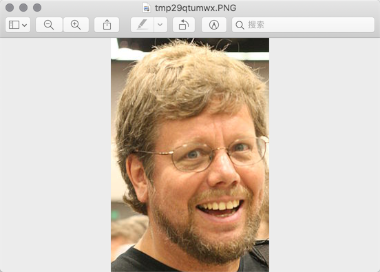
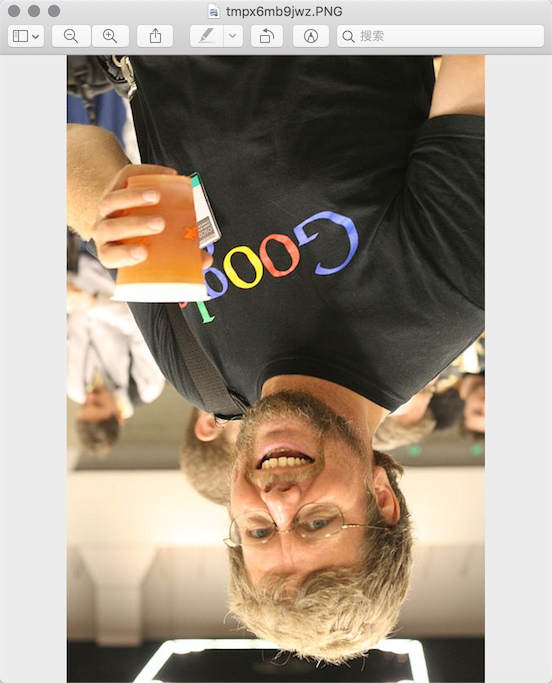

## 图像和办公文档处理

用程序来处理图像和办公文档经常出现在实际开发中，Python的标准库中虽然没有直接支持这些操作的模块，但我们可以通过Python生态圈中的第三方模块来完成这些操作。

### 操作图像

#### 计算机图像相关知识

1. 颜色。如果你有使用颜料画画的经历，那么一定知道混合红、黄、蓝三种颜料可以得到其他的颜色，事实上这三种颜色就是被我们称为美术三原色的东西，它们是不能再分解的基本颜色。在计算机中，我们可以将红、绿、蓝三种色光以不同的比例叠加来组合成其他的颜色，因此这三种颜色就是色光三原色，所以我们通常会将一个颜色表示为一个RGB值或RGBA值（其中的A表示Alpha通道，它决定了透过这个图像的像素，也就是透明度）。

   | 名称  |        RGBA值        |  名称  |       RGBA值       |
   | :---: | :------------------: | :----: | :----------------: |
   | White | (255, 255, 255, 255) |  Red   |  (255, 0, 0, 255)  |
   | Green |   (0, 255, 0, 255)   |  Blue  |  (0, 0, 255, 255)  |
   | Gray  | (128, 128, 128, 255) | Yellow | (255, 255, 0, 255) |
   | Black |    (0, 0, 0, 255)    | Purple | (128, 0, 128, 255) |

2. 像素。对于一个由数字序列表示的图像来说，最小的单位就是图像上单一颜色的小方格，这些小方块都有一个明确的位置和被分配的色彩数值，而这些一小方格的颜色和位置决定了该图像最终呈现出来的样子，它们是不可分割的单位，我们通常称之为像素（pixel）。每一个图像都包含了一定量的像素，这些像素决定图像在屏幕上所呈现的大小。

#### 用Pillow操作图像

Pillow是由从著名的Python图像处理库PIL发展出来的一个分支，通过Pillow可以实现图像压缩和图像处理等各种操作。可以使用下面的命令来安装Pillow。

```Shell
pip install pillow
```

Pillow中最为重要的是Image类，读取和处理图像都要通过这个类来完成。

```Python
>>> from PIL import Image
>>>
>>> image = Image.open('./res/guido.jpg')
>>> image.format, image.size, image.mode
('JPEG', (500, 750), 'RGB')
>>> image.show()
```


1. 剪裁图像

   ```Python
   >>> image = Image.open('./res/guido.jpg')
   >>> rect = 80, 20, 310, 360
   >>> image.crop(rect).show()
   ```

   

2. 生成缩略图

   ```Python
   >>> image = Image.open('./res/guido.jpg')
   >>> size = 128, 128
   >>> image.thumbnail(size)
   >>> image.show()
   ```

   

3. 缩放和黏贴图像

   ```Python
   >>> image1 = Image.open('./res/luohao.png')
   >>> image2 = Image.open('./res/guido.jpg')
   >>> rect = 80, 20, 310, 360
   >>> guido_head = image2.crop(rect)
   >>> width, height = guido_head.size
   >>> image1.paste(guido_head.resize((int(width / 1.5), int(height / 1.5))), (172, 40))
   ```

   

4. 旋转和翻转

   ```Python
   >>> image = Image.open('./res/guido.png')
   >>> image.rotate(180).show()
   >>> image.transpose(Image.FLIP_LEFT_RIGHT).show()
   ```

   

   

5. 操作像素

   ```Python
   >>> image = Image.open('./res/guido.jpg')
   >>> for x in range(80, 310):
   ...     for y in range(20, 360):
   ...         image.putpixel((x, y), (128, 128, 128))
   ... 
   >>> image.show()
   ```

   

6. 滤镜效果

   ```Python
   >>> from PIL import Image, ImageFilter
   >>>
   >>> image = Image.open('./res/guido.jpg')
   >>> image.filter(ImageFilter.CONTOUR).show()
   ```

   

### 处理Excel电子表格

Python的openpyxl模块让我们可以在Python程序中读取和修改Excel电子表格，由于微软从Office 2007开始使用了新的文件格式，这使得Office Excel和LibreOffice Calc、OpenOffice Calc是完全兼容的，这就意味着openpyxl模块也能处理来自这些软件生成的电子表格。

```Python
import datetime

from openpyxl import Workbook

wb = Workbook()
ws = wb.active

ws['A1'] = 42
ws.append([1, 2, 3])
ws['A2'] = datetime.datetime.now()

wb.save("sample.xlsx")
```

### 处理Word文档

利用python-docx模块，Python可以创建和修改Word文档，当然这里的Word文档不仅仅是指通过微软的Office软件创建的扩展名为docx的文档，LibreOffice Writer和OpenOffice Writer都是免费的字处理软件。

```Python
from docx import Document
from docx.shared import Inches

document = Document()

document.add_heading('Document Title', 0)

p = document.add_paragraph('A plain paragraph having some ')
p.add_run('bold').bold = True
p.add_run(' and some ')
p.add_run('italic.').italic = True

document.add_heading('Heading, level 1', level=1)
document.add_paragraph('Intense quote', style='Intense Quote')

document.add_paragraph(
    'first item in unordered list', style='List Bullet'
)
document.add_paragraph(
    'first item in ordered list', style='List Number'
)

document.add_picture('monty-truth.png', width=Inches(1.25))

records = (
    (3, '101', 'Spam'),
    (7, '422', 'Eggs'),
    (4, '631', 'Spam, spam, eggs, and spam')
)

table = document.add_table(rows=1, cols=3)
hdr_cells = table.rows[0].cells
hdr_cells[0].text = 'Qty'
hdr_cells[1].text = 'Id'
hdr_cells[2].text = 'Desc'
for qty, id, desc in records:
    row_cells = table.add_row().cells
    row_cells[0].text = str(qty)
    row_cells[1].text = id
    row_cells[2].text = desc

document.add_page_break()

document.save('demo.docx')
```
