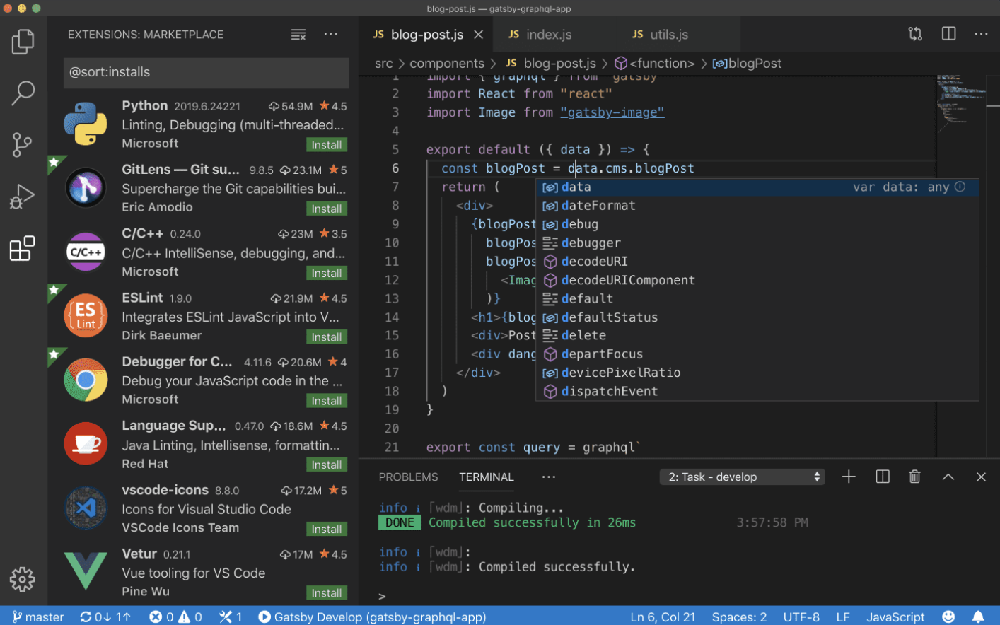
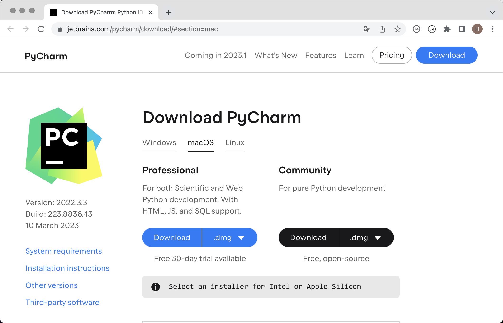
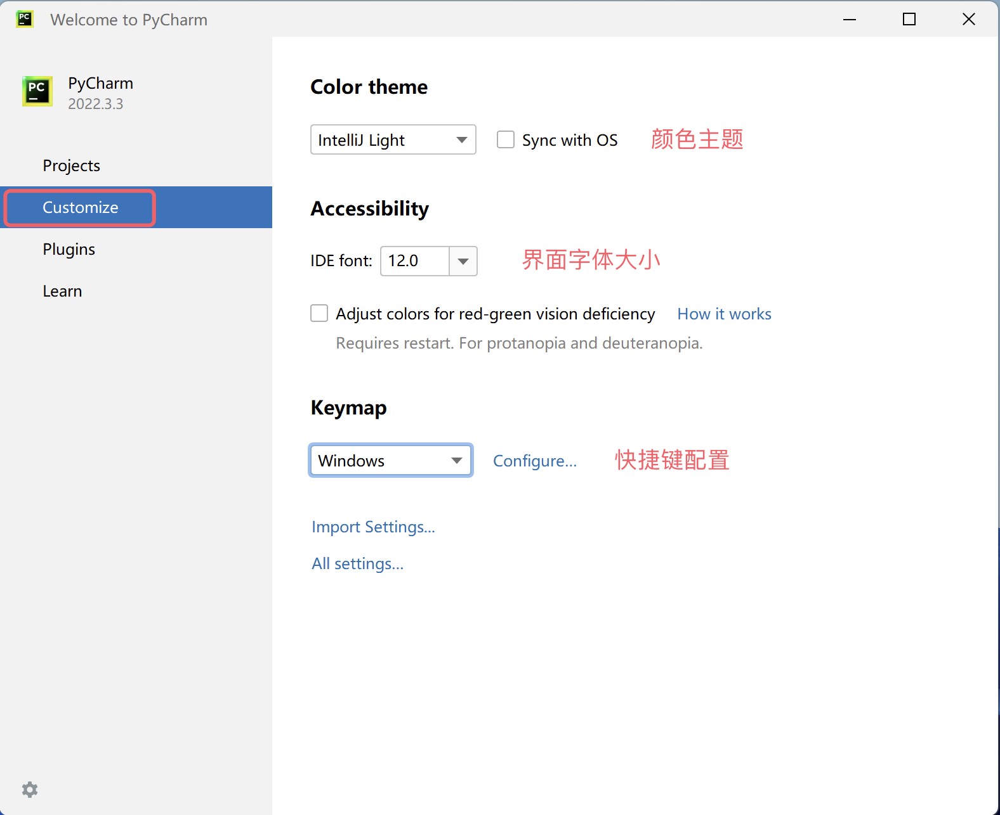
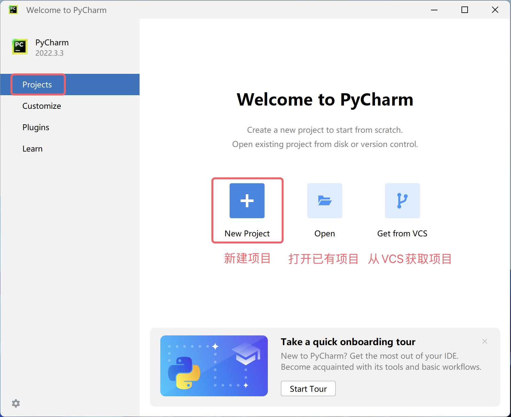
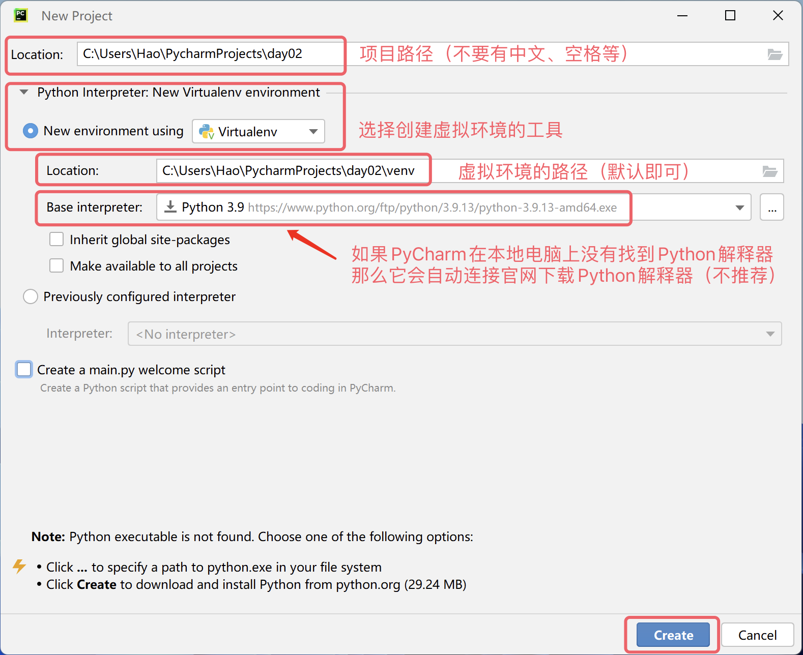
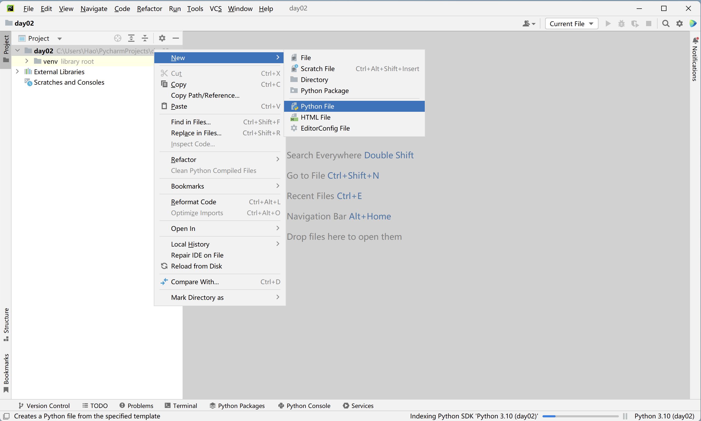
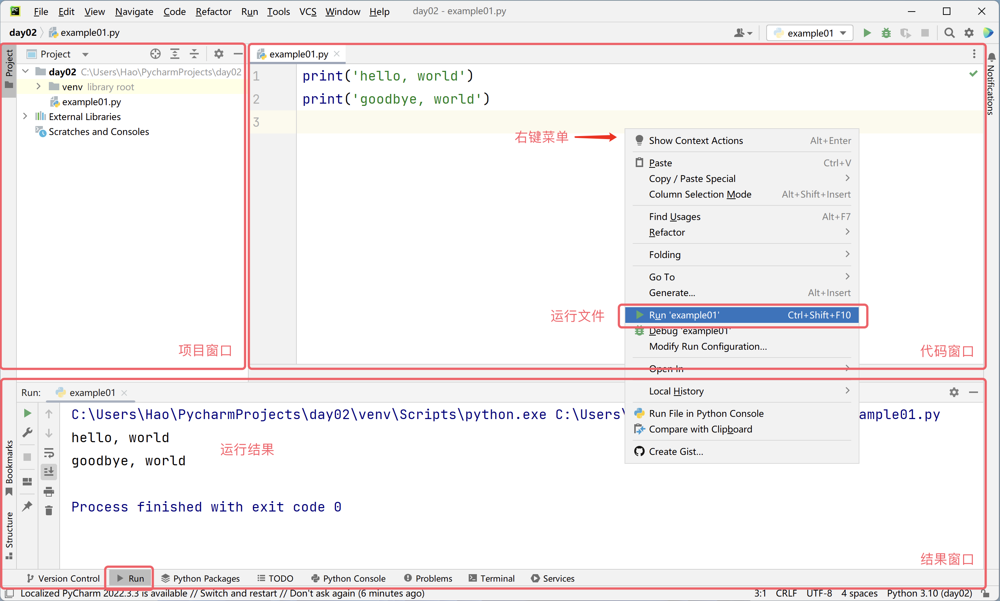
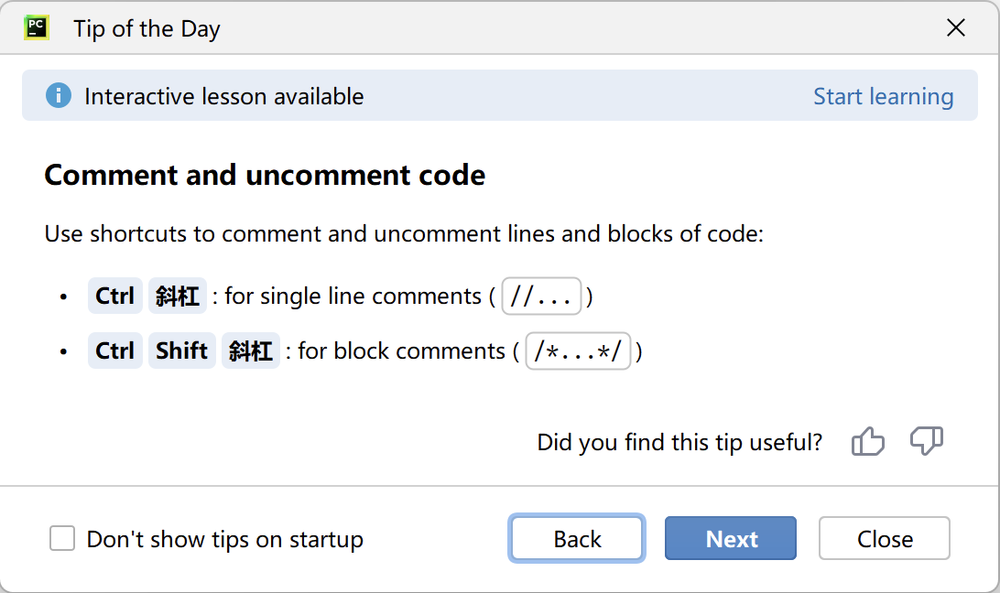

## 第一个Python程序

在上一课中，我们对 Python 语言的过去现在有了一些了解，我们准备好了运行 Python 程序所需要的解释器环境。相信大家已经迫不及待的想开始自己的 Python 编程之旅了，但是新问题来了，我们应该在什么地方书写 Python 程序，然后又怎么运行它呢？

### 编写代码的工具

下面我们为大家讲解几种可以编写和运行 Python 代码的工具，大家可以根据自己的需求来选择合适的工具。当然，对于初学者，我个人比较推荐使用 PyCharm，因为它不需要太多的配置也非常的强大，对新手还是很友好的。

#### 默认的交互式环境

我们打开Windows的“命令提示符”或“PowerShell”工具，输入`python`然后按下`Enter`键，这个命令会把我们带到一个交互式环境中。所谓交互式环境，就是我们输入一行代码并按下`Enter`键，代码马上会被执行，如果代码有产出结果，那么结果会被显示在窗口中，如下所示。

```Bash
Python 3.10.10
Type "help", "copyright", "credits" or "license" for more information.
>>> 2 * 3
6
>>> 2 + 3
5
>>>
```

> **说明**：使用 macOS 系统的用户需要打开“终端”工具，输入`python3`进入交互式环境。

如果希望退出交互式环境，可以在交互式环境中输入`quit()`，如下所示。

```Bash
>>> quit()
```

#### 更好的交互式环境 - IPython

上面说的交互式环境用户体验并不怎么好，大家使用一下就能清晰的感受到。我们可以用 IPython 来替换掉它，因为 IPython 提供了更为强大的编辑和交互功能。我们可以使用 Python 的包管理工具`pip`来安装 IPython，如下所示。

```bash
pip install ipython
```

> **提示**：在使用上面的命令安装 IPython 之前，可以先通过`pip config set global.index-url https://pypi.doubanio.com/simple`命令或`pip config set global.index-url https://pypi.tuna.tsinghua.edu.cn/simple/`将下载源修改为国内的豆瓣镜像或清华镜像，否则下载安装的过程可能会非常的缓慢。

接下来可以使用下面的命令启动 IPython，进入交互式环境。

```bash
ipython
```

> **说明**：还有一个网页版的 IPython 名字叫 Jupyter，由于暂时用不上它们，我们在其他的地方再给大家介绍。

#### 文本编辑神器 - Visual Studio Code

Visual Studio Code 是由微软开发能够在 Windows、 Linux 和 macOS 等操作系统上运行的代码编辑神器。它支持语法高亮、自动补全、多点编辑、运行调试等一系列便捷功能，而且能够支持多种编程语言。如果大家要选择一款高级文本编辑工具，强烈推荐 Visual Studio Code，关于它的[下载](https://code.visualstudio.com/)、安装和使用，有兴趣的读者可以自行研究。



#### 集成开发环境 - PyCharm

如果用 Python 语言开发商业项目，我们推荐大家使用更为专业的工具 PyCharm。PyCharm 是由捷克一家名为 [JetBrains](https://www.jetbrains.com/) 的公司针对 Python 语言提供的集成开发环境（IDE)。所谓集成开发环境，通常是指提供了编写代码、运行代码、调试代码、分析代码、版本控制等一系列强大功能和便捷操作的开发工具，因此特别适合用于商业项目的开发。我们可以在 JetBrains 公司的官方网站上找到 PyCharm 的[下载链接](<https://www.jetbrains.com/pycharm/download>)，如下图所示。



官方提供了两个 PyCharm 的版本，一个是免费的社区版（Community Edition），功能相对弱小，但对于初学者来说是完全够用的；另一个是付费的专业版（Professional Edition），功能非常强大，但需要按年或按月支付费用，新用户可以免费试用30天时间。PyCharm 的安装没有任何难度，运行下载的安装程序，几乎全部使用默认设置进行安装就可以了，其中有一个步骤可以按照下图所示，勾选“创建桌面快捷方式”和“在右键菜单中添加"Open Folder as Project"”就可以了。


第一次运行 PyCharm 时，在提示你导入 PyCharm 设置的界面上直接选择“Do not import settings”，然后我们就可以看到如下图所示的欢迎界面。此处，我们可以先点击“Customize”选项对 PyCharm 做一些个性化的设置。



接下来，我们可以在“Projects”选项中点击“New Project”来创建一个新的项目，此处还可以“打开已有项目”或“从版本控制服务器（VCS）获取项目”，如下图所示。



创建项目的时候需要指定项目的路径并创建”虚拟环境“，我们建议每个 Python 都在自己专属的虚拟环境中运行。如果你的系统上还没 Python 环境，那么 PyCharm 会提供官网的下载链接，当你点击“Create”按钮创建项目时，它会联网下载 Python 解释器，如下图所示。



当然，我们并不推荐这么做，因为我们在上一课已经安装过 Python 环境了。在系统有 Python 环境的情况下，PyCharm 通常会自动发现 Python 解释器的位置并以此为基础创建虚拟环境，所以大家看到的画面应该如下图所示。


> **说明**：上面的截图来自于 Windows 系统，如果使用 macOS 系统，你看到的项目路径和 Python 解释器路径会跟上面有所不同。

创建好项目后会出现如下图所示的画面，我们可以通过在项目文件夹上点击鼠标右键，选择“New”菜单下的“Python File”来创建一个 Python 文件，在给文件命名时建议使用英文字母和下划线的组合，创建好的 Python 文件会自动打开，进入可编辑的状态。



接下来，我们可以在代码窗口编写我们的 Python 代码。写好代码后，可以在窗口中点击鼠标右键，选择“Run”菜单项来运行代码，下面的“Run”窗口会显示代码的执行结果，如下图所示。



到这里，我们的第一个 Python 程序已经运转起来了，很酷吧！对了，PyCharm 有一个叫“每日小贴士”的弹窗，会教给你一些使用 PyCharm 的小技巧，如下图所示。如果不需要，直接关闭就可以了；如果不希望它再次出现，在关闭前可以勾选“Don't show tips on startup”。



### 你好世界

按照行业惯例，我们学习任何一门编程语言写的第一个程序都是输出`hello, world`，因为这段代码是伟大的丹尼斯·里奇（C 语言之父，和肯·汤普森一起开发了 Unix 操作系统）和布莱恩·柯尼汉（awk 语言的发明者）在他们的不朽著作《*The C Programming Language*》中写的第一段代码，下面是对应的 Python 语言的版本。

```Python
print('hello, world')
```

> **注意**：上面代码中的圆括号、单引号都是在英文输入法状态下输入的，如果不小心写成了中文的圆括号或单引号，运行代码时会出现`SyntaxError: invalid character '（' (U+FF08)`或`SyntaxError: invalid character '‘' (U+2018)`这样的错误提示。

上面的代码只有一个语句，在这个语句中，我们用到了一个名为`print`的函数，它可以帮助我们输出指定的内容；`print`函数圆括号中的`'hello, world'`是一个字符串，它代表了一段文本内容；在 Python 语言中，我们可以用单引号或双引号来表示一个字符串。不同于 C、C++ 或 Java 这样的编程语言，Python 代码中的语句不需要用分号来表示结束，也就是说，如果我们想再写一条语句，只需要回车换行即可，代码如下所示。此外，Python 代码也不需要通过编写名为`main`的入口函数来使其运行，提供入口函数是编写可执行的 C、C++ 或 Java 代码必须要做的事情，这一点很多程序员都不陌生，但是在 Python 语言中它并不是必要的。

```Python
print('hello, world')
print('goodbye, world')
```

如果不使用 PyCharm 这样的集成开发环境，我们也可以直接调用 Python 解释器来运行 Python 程序。我们可以将上面的代码保存成一个名为`example01.py`的文件，对于Windows 系统，我们假设该文件在`C:\code\`目录下，我们打开“命令提示符”或“PowerShell”并输入下面的命令就可以运行它。

```powershell
python C:\code\example01.py
```

对于 macOS 系统，假设我们的文件在`/Users/Hao/`目录下，那么可以在终端中输入下面的命令来运行程序。

```Bash
python3 /Users/Hao/example01.py
```

> **提示**：如果路径比较长，不愿意手动输入，我们可以通过拖拽的方式将文件直接拖到“命令提示符”或“终端”中，这样会自动输入完整的文件路径。

大家可以试着修改上面的代码，比如将单引号中的`hello, world`换成其他内容或者多写几个这样的语句，看看会运行出怎样的结果。需要提醒大家的是，写 Python 代码时，最好每一行只写一条语句。虽然，我们可以使用`;`作为分隔将多个语句写在一行中，但是这样做会让代码变得非常难看，不再具备良好的可读性。

### 注释你的代码

注释是编程语言的一个重要组成部分，用于在代码中解释代码的作用，从而达到增强代码可读性的目标。当然，我们也可以将代码中暂时不需要运行的代码段通过添加注释来去掉，这样当你需要重新使用这些代码的时候，去掉注释符号就可以了。简单的说，**注释会让代码更容易看懂但不会影响代码的执行结果**。

Python 中有两种形式的注释：

1. 单行注释：以`#`和空格开头，可以注释掉从`#`开始后面一整行的内容。
2. 多行注释：三个引号（通常用双引号）开头，三个引号结尾，通常用于添加多行说明性内容。

```Python
"""
第一个Python程序 - hello, world

Version: 1.0
Author: 骆昊
"""
# print('hello, world')
print("你好，世界！")
```

### 总结

到此，我们已经把第一个 Python 程序运行起来了，是不是很有成就感？！只要你坚持学习下去，再过一段时间，我们就可以用 Python 语言做更多更酷的事情。今时今日，编程就跟英语一样，对很多人来说都是一项必须要掌握的技能。
