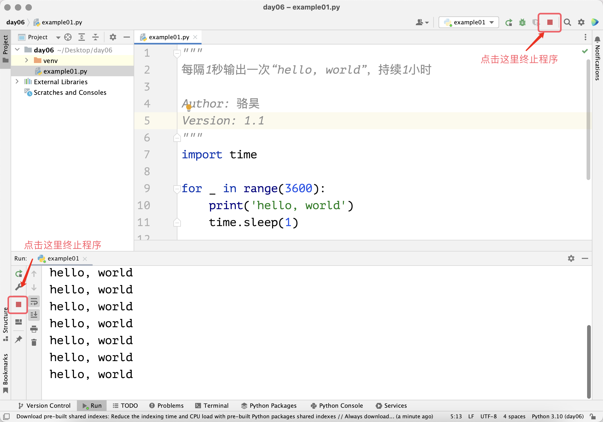

## 循环结构

我们在写程序的时候，极有可能遇到需要重复执行某条指令或某些指令的场景，例如我们需要每隔1秒钟在屏幕上输出一次“hello, world”并持续输出一个小时。如下所示的代码可以完成一次这样的操作，如果要持续输出一个小时，我们就需要把这段代码写3600遍，你愿意这么做吗？

```python
import time

print('hello, world')
time.sleep(1)
```

> **说明**：Python 内置`time`模块的`sleep`函数可以实现程序的休眠，参数`1`表示休眠的秒数，可以使用`int`或`float`类型，例如`0.05`表示`50`毫秒。

为了应对上述场景，我们可以在 Python 程序中使用循环结构。所谓循环结构，就是程序中控制某条或某些指令重复执行的结构。有了这样的结构，刚才的代码就不需要写3600遍，而是写一遍然后放到循环结构中重复3600次。在 Python 语言中构造循环结构有两种做法，一种是`for-in`循环，另一种是`while`循环。

### for-in循环

如果明确知道循环执行的次数，我们推荐使用`for-in`循环，例如上面说的那个重复3600次的场景，我们可以用下面的代码来实现。 注意，被`for-in`循环控制的代码块也是通过缩进的方式来构造，这一点跟分支结构中构造代码块的做法是一样的。我们被`for-in`循环控制的代码块称为循环体，通常循环体中的语句会根据循环的设定被重复执行。

```python
"""
每隔1秒输出一次“hello, world”，持续1小时

Author: 骆昊
Version: 1.0
"""
import time

for i in range(3600):
    print('hello, world')
    time.sleep(1)
```

需要说明的是，上面代码中的`range(3600)`可以构造出一个从`0`到`3599`的范围，当我们把这样一个范围放到`for-in`循环中，就可以通过前面的循环变量`i`依次取出从`0`到`3599`的整数，这就让`for-in`代码块中的语句可以重复3600次。当然，`range`的用法非常灵活，下面的清单给出了使用`range`函数的例子：

- `range(101)`：可以用来产生`0`到`100`范围的整数，需要注意的是取不到`101`。
- `range(1, 101)`：可以用来产生`1`到`100`范围的整数，相当于是左闭右开的设定，即`[1, 101)`。
- `range(1, 101, 2)`：可以用来产生`1`到`100`的奇数，其中`2`是步长（跨度），即每次递增的值，`101`取不到。
- `range(100, 0, -2)`：可以用来产生`100`到`1`的偶数，其中`-2`是步长（跨度），即每次递减的值，`0`取不到。

大家可能已经注意到了，上面的输出和休眠操作都没有用到循环变量`i`，对于不需要用到循环变量的`for-in`循环结构，按照 Python 的编程惯例，我们通常把循环变量命名为`_`，修改后的代码如下所示。虽然结果没什么变化，但是这样写显得你更专业。

```python
"""
每隔1秒输出一次“hello, world”，持续1小时

Author: 骆昊
Version: 1.1
"""
import time

for _ in range(3600):
    print('hello, world')
    time.sleep(1)
```

上面的代码要执行一个小时，如果想提前结束程序，在 PyCharm 中可以点击运行窗口上的停止按钮，如下图所示。如果在命令提示符或终端中运行代码，可以使用组合键`ctrl+c`来终止程序。



下面，我们用`for-in`循环实现从1到100的整数求和，即$\small{\sum_{n=1}^{100}n}$。

```python
"""
从1到100的整数求和

Version: 1.0
Author: 骆昊
"""
total = 0
for i in range(1, 101):
    total += i
print(total)
```

上面的代码中，变量`total`的作用是保存累加的结果。在循环的过程中，循环变量`i`的值会从`1`一直取到`100`。对于变量`i`的每个取值，我们都执行了`total += i`，它相当于`total = total + i`，这条语句实现了累加操作。所以，当循环结束，我们输出变量`total` 的值，它的值就是从`1`累加到`100`的结果`5050`。注意，`print(total)`这条语句前是没有缩进的，它不受`for-in`循环的控制，不会重复执行。

我们再来写一个从1到100偶数求和的代码，如下所示。

```python
"""
从1到100的偶数求和

Version: 1.0
Author: 骆昊
"""
total = 0
for i in range(1, 101):
    if i % 2 == 0:
        total += i
print(total)
```

> **说明**：上面的`for-in`循环中我们使用了分支结构来判断循环变量`i`是不是偶数。

我们也可以修改`range`函数的参数，将起始值和跨度修改为`2`，用更为简单的代码实现从1到100的偶数求和。

```python
"""
从1到100的偶数求和

Version: 1.1
Author: 骆昊
"""
total = 0
for i in range(2, 101, 2):
    total += i
print(total)
```

当然， 更为简单的办法是使用 Python 内置的`sum`函数求和，这样我们连循环结构都省掉了。

```python
"""
从1到100的偶数求和

Version: 1.2
Author: 骆昊
"""
print(sum(range(2, 101, 2)))
```

### while循环

如果要构造循环结构但是又不能确定循环重复的次数，我们推荐使用`while`循环。`while`循环通过布尔值或能产生布尔值的表达式来控制循环，当布尔值或表达式的值为`True`时，循环体（`while`语句下方保持相同缩进的代码块）中的语句就会被重复执行，当表达式的值为`False`时，结束循环。

下面我们用`while`循环来实现从1到100的整数求和，代码如下所示。

```python
"""
从1到100的整数求和

Version: 1.1
Author: 骆昊
"""
total = 0
i = 1
while i <= 100:
    total += i
    i += 1
print(total)
```

相较于`for-in`循环，上面的代码我们在循环开始前增加了一个变量`i`，我们使用这个变量来控制循环，所以`while`后面给出了`i <= 100`的条件。在`while`的循环体中，我们除了做累加，还需要让变量`i`的值递增，所以我们添加了`i += 1`这条语句，这样`i`的值就会依次取到`1`、`2`、`3`、……，直到`101`。当`i`变成`101`时，`while`循环的条件不再成立，代码会离开`while`循环，此时我们输出变量`total`的值，它就是从`1`到`100`求和的结果`5050`。

如果要实现从1到100的偶数求和，我们可以对上面的代码稍作修改。

```python
"""
从1到100的偶数求和

Version: 1.3
Author: 骆昊
"""
total = 0
i = 2
while i <= 100:
    total += i
    i += 2
print(total)
```

### break和continue

我们再来看一个极端的场景，把`while`循环的条件直接设置为布尔值`True`，还是从1到100的偶数求和。

```python
"""
从1到100的偶数求和

Version: 1.4
Author: 骆昊
"""
total = 0
i = 2
while True:
    total += i
    i += 2
    if i > 100:
        break
print(total) 
```

上面的代码中使用`while True`构造了一个条件恒成立的循环，也就意味着如果不做特殊处理，循环是不会结束的，这也就是常说的“死循环”。为了在`i`的值超过`100`后让循环停下来，我们使用了`break`关键字，它的作用是终止循环结构的执行。需要注意的是，`break`只能终止它所在的那个循环，这一点在使用嵌套循环结构时需要引起注意，后面我们会讲到什么是嵌套的循环结构。除了`break`之外，还有另一个在循环结构中可以使用的关键字`continue`，它可以用来放弃本次循环后续的代码直接让循环进入下一轮，代码如下所示。

```python
"""
从1到100的偶数求和

Version: 1.5
Author: 骆昊
"""
total = 0
for i in range(1, 101):
    if i % 2 != 0:
        continue
    total += i
print(total)
```

> **说明**：上面的代码使用`continue`关键字跳过了`i`是奇数的情况，只有在`i`是偶数的前提下，才会执行到`total += i`。

### 嵌套的循环结构

和分支结构一样，循环结构也是可以嵌套的，也就是说在循环结构中还可以构造循环结构。下面的例子演示了如何通过嵌套的循环来输出一个乘法口诀表（九九表）。

```python
"""
打印乘法口诀表

Version: 1.0
Author: 骆昊
"""
for i in range(1, 10):
    for j in range(1, i + 1):
        print(f'{i}×{j}={i * j}', end='\t')
    print()
```

上面的代码中，`for-in`循环的循环体中又用到了`for-in`循环，外面的循环用来控制产生`i`行的输出，而里面的循环则用来控制在一行中输出`j`列。显然，里面的`for-in`循环的输出就是乘法口诀表中的一整行。所以在里面的循环完成时，我们用了一个`print()`来实现换行的效果，最后的输出如下所示。

```
1×1=1	
2×1=2	2×2=4	
3×1=3	3×2=6	3×3=9	
4×1=4	4×2=8	4×3=12	4×4=16	
5×1=5	5×2=10	5×3=15	5×4=20	5×5=25	
6×1=6	6×2=12	6×3=18	6×4=24	6×5=30	6×6=36	
7×1=7	7×2=14	7×3=21	7×4=28	7×5=35	7×6=42	7×7=49	
8×1=8	8×2=16	8×3=24	8×4=32	8×5=40	8×6=48	8×7=56	8×8=64	
9×1=9	9×2=18	9×3=27	9×4=36	9×5=45	9×6=54	9×7=63	9×8=72	9×9=81
```

### 循环结构应用举例

#### 例子1：判断素数

要求：输入一个大于1的正整数，判断它是不是素数。

> **提示**：素数指的是只能被1和自身整除的大于1的整数。例如对于正整数`n`，我们可以通过在`2`到`n-1`之间寻找有没有`n`的因子，来判断它到底是不是一个素数。当然，循环不用从`2`开始到`n-1`结束，因为对于大于1的正整数，因子应该都是成对出现的，所以循环到$\small{\sqrt{n}}$就可以结束了。

```python
"""
输入一个大于1的正整数判断它是不是素数

Version: 1.0
Author: 骆昊
"""
num = int(input('请输入一个正整数: '))
end = int(num ** 0.5)
is_prime = True
for i in range(2, end + 1):
    if num % i == 0:
        is_prime = False
        break
if is_prime:
    print(f'{num}是素数')
else:
    print(f'{num}不是素数')
```

> **说明**：上面的代码中我们用了布尔型的变量`is_prime`，我们先将它赋值为`True`，假设`num`是一个素数；接下来，我们在`2`到`num ** 0.5`的范围寻找`num`的因子，如果找到了`num`的因子，那么它一定不是素数，此时我们将`is_prime`赋值为`False`，同时使用`break`关键字终止循环结构；最后，我们根据`is_prime`的值是`True`还是`False`来给出不同的输出。

#### 例子2：最大公约数

要求：输入两个大于`0`的正整数，求两个数的最大公约数。

> **提示**：两个数的最大公约数是两个数的公共因子中最大的那个数。

```python
"""
输入两个正整数求它们的最大公约数

Version: 1.0
Author: 骆昊
"""
x = int(input('x = '))
y = int(input('y = '))
for i in range(x, 0, -1):
    if x % i == 0 and y % i == 0:
        print(f'最大公约数: {i}')
        break
```

> **说明**：上面代码中`for-in`循环的循环变量值是从大到小的，这样我们找到的能够同时整除`x`和`y`的因子`i`，就是`x`和`y`的最大公约数，此时我们用`break`终止循环。如果`x`和`y`互质，那么循环会执行到`i`变成`1`，因为`1`是所有正整数的因子，此时`x`和`y`的最大公约数就是`1`。

用上面代码的找最大公约数在执行效率是有问题的。假如`x`的值是`999999999998`，`y`的值是`999999999999`，很显然两个数是互质的，最大公约数为`1`。但是我们使用上面的代码，循环会重复`999999999998`次，这通常是难以接受的。我们可以使用欧几里得算法（辗转相除法）来找最大公约数，它能帮我们更快的得到想要的结果，代码如下所示。

```python
"""
输入两个正整数求它们的最大公约数

Version: 1.1
Author: 骆昊
"""
x = int(input('x = '))
y = int(input('y = '))
while y % x != 0:
    x, y = y % x, x
print(f'最大公约数: {x}')
```

> **说明**：解决问题的方法和步骤可以称之为算法，对于同一个问题，我们可以设计出不同的算法，不同的算法在存储空间的占用和执行效率上都会存在差别，而这些差别就代表了算法的优劣。大家可以对比上面的两段待会，体会一下为什么我们说欧几里得算法是更好的选择。上面的代码中`x, y = y % x, x`语句表示将`y % x`的值赋给`x`，将`x` 原来的值赋给`y`。

#### 例子3：猜数字游戏

要求：计算机出一个`1`到`100`之间的随机数，玩家输入自己猜的数字，计算机给出对应的提示信息“大一点”、“小一点”或“猜对了”，如果玩家猜中了数字，计算机提示用户一共猜了多少次，游戏结束，否则游戏继续。

```python
"""
猜数字小游戏

Version: 1.0
Author: 骆昊
"""
import random

answer = random.randrange(1, 101)
counter = 0
while True:
    counter += 1
    num = int(input('请输入: '))
    if num < answer:
        print('大一点.')
    elif num > answer:
        print('小一点.')
    else:
        print('猜对了.')
        break
print(f'你一共猜了{counter}次.')
```

> **说明**：上面的代码使用`import random`导入了 Python 标准库的`random`模块，该模块的`randrange`函数帮助我们生成了`1`到`100`范围的随机数。变量`counter`用来记录循环执行的次数，也就是用户一共做出了几次猜测，每循环一次`counter`的值都会加`1`。

### 总结

学会了 Python 中的分支结构和循环结构，我们就可以解决很多实际的问题了。通过这节课的学习，大家应该已经知道了可以用`for`和`while`关键字来构造循环结构。**如果事先知道循环结构重复的次数，我们通常使用`for`循环**；**如果循环结构的重复次数不能确定，可以用`while`循环**。此外，我们可以在循环结构中**使用`break`终止循环**，也可以在循环结构中**使用`continue`关键字让循环结构直接进入下一轮次**。
