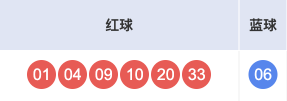
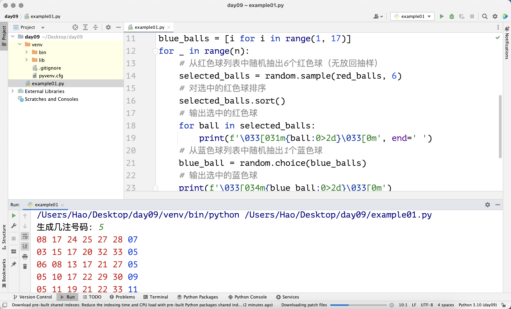

## 常用数据结构之列表-2

### 列表的方法

列表类型的变量拥有很多方法可以帮助我们操作一个列表，假设我们有名为`foos`的列表，列表有名为`bar`的方法，那么使用列表方法的语法是：`foos.bar()`，这是一种通过对象引用调用对象方法的语法。后面我们讲面向对象编程的时候，还会对这种语法进行详细的讲解，这种语法也称为给对象发消息。

#### 添加和删除元素

列表是一种可变容器，可变容器指的是我们可以向容器中添加元素、可以从容器移除元素，也可以修改现有容器中的元素。我们可以使用列表的`append`方法向列表中追加元素，使用`insert`方法向列表中插入元素。追加指的是将元素添加到列表的末尾，而插入则是在指定的位置添加新元素，大家可以看看下面的代码。

```python
languages = ['Python', 'Java', 'C++']
languages.append('JavaScript')
print(languages)  # ['Python', 'Java', 'C++', 'JavaScript']
languages.insert(1, 'SQL')
print(languages)  # ['Python', 'SQL', 'Java', 'C++', 'JavaScript']
```

我们可以用列表的`remove`方法从列表中删除指定元素，需要注意的是，如果要删除的元素并不在列表中，会引发`ValueError`错误导致程序崩溃，所以建议大家在删除元素时，先用之前讲过的成员运算做一个判断。我们还可以使用`pop`方法从列表中删除元素，`pop`方法默认删除列表中的最后一个元素，当然也可以给一个位置，删除指定位置的元素。在使用`pop`方法删除元素时，如果索引的值超出了范围，会引发`IndexError`异常，导致程序崩溃。除此之外，列表还有一个`clear`方法，可以清空列表中的元素，代码如下所示。

```python
languages = ['Python', 'SQL', 'Java', 'C++', 'JavaScript']
if 'Java' in languages:
    languages.remove('Java')
if 'Swift' in languages:
    languages.remove('Swift')
print(languages)  # ['Python', 'SQL', C++', 'JavaScript']
languages.pop()
temp = languages.pop(1)
print(temp)       # SQL
languages.append(temp)
print(languages)  # ['Python', C++', 'SQL']
languages.clear()
print(languages)  # []
```

> **说明**：`pop`方法删除元素时会得到被删除的元素，上面的代码中，我们将`pop`方法删除的元素赋值给了名为`temp`的变量。当然如果你愿意，还可以把这个元素再次加入到列表中，正如上面的代码`languages.append(temp)`所做的那样。

这里还有一个小问题，例如`languages`列表中有多个`'Python'`，那么我们用`languages.remove('Python')`是删除所有的`'Python'`，还是删除第一个`'Python'`，大家可以先猜一猜，然后再自己动手尝试一下。

从列表中删除元素其实还有一种方式，就是使用 Python 中的`del`关键字后面跟要删除的元素，这种做法跟使用`pop`方法指定索引删除元素没有实质性的区别，但后者会返回删除的元素，前者在性能上略优，因为`del`对应的底层字节码指令是`DELETE_SUBSCR`，而`pop`对应的底层字节码指令是`CALL_METHOD`和`POP_TOP`，如果不理解就不用管它了。

```python
items = ['Python', 'Java', 'C++']
del items[1]
print(items)  # ['Python', 'C++']
```

#### 元素位置和频次

列表的`index`方法可以查找某个元素在列表中的索引位置，如果找不到指定的元素，`index`方法会引发`ValueError`错误；列表的`count`方法可以统计一个元素在列表中出现的次数，代码如下所示。

```python
items = ['Python', 'Java', 'Java', 'C++', 'Kotlin', 'Python']
print(items.index('Python'))     # 0
# 从索引位置1开始查找'Python'
print(items.index('Python', 1))  # 5
print(items.count('Python'))     # 2
print(items.count('Kotlin'))     # 1
print(items.count('Swfit'))      # 0
# 从索引位置3开始查找'Java'
print(items.index('Java', 3))    # ValueError: 'Java' is not in list
```

#### 元素排序和反转

列表的`sort`操作可以实现列表元素的排序，而`reverse`操作可以实现元素的反转，代码如下所示。

```python
items = ['Python', 'Java', 'C++', 'Kotlin', 'Swift']
items.sort()
print(items)  # ['C++', 'Java', 'Kotlin', 'Python', 'Swift']
items.reverse()
print(items)  # ['Swift', 'Python', 'Kotlin', 'Java', 'C++']
```

### 列表生成式

在 Python 中，列表还可以通过一种特殊的字面量语法来创建，这种语法叫做生成式。下面，我们通过例子来说明使用列表生成式创建列表到底有什么好处。

场景一：创建一个取值范围在`1`到`99`且能被`3`或者`5`整除的数字构成的列表。

```python
items = []
for i in range(1, 100):
    if i % 3 == 0 or i % 5 == 0:
        items.append(i)
print(items)
```

使用列表生成式做同样的事情，代码如下所示。

```python
items = [i for i in range(1, 100) if i % 3 == 0 or i % 5 == 0]
print(items)
```

场景二：有一个整数列表`nums1`，创建一个新的列表`nums2`，`nums2`中的元素是`nums1`中对应元素的平方。

```python
nums1 = [35, 12, 97, 64, 55]
nums2 = []
for num in nums1:
    nums2.append(num ** 2)
print(nums2)
```

使用列表生成式做同样的事情，代码如下所示。

```python
nums1 = [35, 12, 97, 64, 55]
nums2 = [num ** 2 for num in nums1]
print(nums2)
```

场景三： 有一个整数列表`nums1`，创建一个新的列表`nums2`，将`nums1`中大于`50`的元素放到`nums2`中。

```Python
nums1 = [35, 12, 97, 64, 55]
nums2 = []
for num in nums1:
    if num > 50:
        nums2.append(num)
print(nums2)
```

使用列表生成式做同样的事情，代码如下所示。

```Python
nums1 = [35, 12, 97, 64, 55]
nums2 = [num for num in nums1 if num > 50]
print(nums2)
```

使用列表生成式创建列表不仅代码简单优雅，而且性能上也优于使用`for-in`循环和`append`方法向空列表中追加元素的方式。为什么说生成式有更好的性能呢，那是因为 Python 解释器的字节码指令中有专门针对生成式的指令（`LIST_APPEND`指令）；而`for`循环是通过方法调用（`LOAD_METHOD`和`CALL_METHOD`指令）的方式为列表添加元素，方法调用本身就是一个相对比较耗时的操作。对这一点不理解也没有关系，记住“**强烈建议用生成式语法来创建列表**”这个结论就可以了。

### 嵌套列表

Python 语言没有限定列表中的元素必须是相同的数据类型，也就是说一个列表中的元素可以任意的数据类型，当然也包括列表本身。如果列表中的元素也是列表，那么我们可以称之为嵌套的列表。嵌套的列表可以用来表示表格或数学上的矩阵，例如：我们想保存5个学生3门课程的成绩，可以用如下所示的列表。

```python
scores = [[95, 83, 92], [80, 75, 82], [92, 97, 90], [80, 78, 69], [65, 66, 89]]
print(scores[0])
print(scores[0][1])
```

对于上面的嵌套列表，每个元素相当于就是一个学生3门课程的成绩，例如`[95, 83, 92]`，而这个列表中的`83`代表了这个学生某一门课的成绩，如果想访问这个值，可以使用两次索引运算`scores[0][1]`，其中`scores[0]`可以得到`[95, 83, 92]`这个列表，再次使用索引运算`[1]`就可以获得该列表中的第二个元素。

如果想通过键盘输入的方式来录入5个学生3门课程的成绩并保存在列表中，可以使用如下所示的代码。

```Python
scores = []
for _ in range(5):
    temp = []
    for _ in range(3):
        score = int(input('请输入: '))
        temp.append(score)
    scores.append(temp)
print(scores)
```

如果想通过产生随机数的方式来生成5个学生3门课程的成绩并保存在列表中，我们可以使用列表生成式，代码如下所示。

```python
import random

scores = [[random.randrange(60, 101) for _ in range(3)] for _ in range(5)]
print(scores)
```

> **说明**：上面的代码`[random.randrange(60, 101) for _ in range(3)] `可以产生由3个随机整数构成的列表，我们把这段代码又放在了另一个列表生成式中作为列表的元素，这样的元素一共生成5个，最终得到了一个嵌套列表。

### 列表的应用

下面我们通过一个双色球随机选号的例子为大家讲解列表的应用。双色球是由中国福利彩票发行管理中心发售的乐透型彩票，每注投注号码由`6`个红色球和`1`个蓝色球组成。红色球号码从`1`到`33`中选择，蓝色球号码从`1`到`16`中选择。每注需要选择`6`个红色球号码和`1`个蓝色球号码，如下所示。



> **提示**：知乎上有一段对国内各种形式的彩票本质的论述相当精彩，这里分享给大家：“**虚构一个不劳而获的人，去忽悠一群想不劳而获的人，最终养活一批真正不劳而获的人**”。很多对概率没有概念的人，甚至认为彩票中与不中的概率都是50%；还有很多人认为如果中奖的概率是1%，那么买100次就一定可以中奖，这些都是非常荒唐的想法。所以，珍爱生命，远离（任何形式的）赌博！

下面，我们通过 Python 程序来生成一组随机号码。

```python
"""
双色球随机选号程序

Author: 骆昊
Version: 1.0
"""
import random

red_balls = list(range(1, 34))
selected_balls = []
# 添加6个红色球到选中列表
for _ in range(6):
    # 生成随机整数代表选中的红色球的索引位置
    index = random.randrange(len(red_balls))
    # 将选中的球从红色球列表中移除并添加到选中列表
    selected_balls.append(red_balls.pop(index))
# 对选中的红色球排序
selected_balls.sort()
# 输出选中的红色球
for ball in selected_balls:
    print(f'\033[031m{ball:0>2d}\033[0m', end=' ')
# 随机选择1个蓝色球
blue_ball = random.randrange(1, 17)
# 输出选中的蓝色球
print(f'\033[034m{blue_ball:0>2d}\033[0m')
```

> **说明**：上面代码中`print(f'\033[0m...\033[0m')`是为了控制输出内容的颜色，红色球输出成红色，蓝色球输出成蓝色。其中省略号代表我们要输出的内容，`\033[0m`是一个控制码，表示关闭所有属性，也就是说之前的控制码将会失效，你也可以将其简单的理解为一个定界符，`m`前面的`0`表示控制台的显示方式为默认值，`0`可以省略，`1`表示高亮，`5`表示闪烁，`7`表示反显等。在`0`和`m`的中间，我们可以写上代表颜色的数字，比如`30`代表黑色，`31`代表红色，`32`代表绿色，`33`代表黄色，`34`代表蓝色等。

我们还可以利用`random`模块提供的`sample`和`choice`函数来简化上面的代码，前者可以实现无放回随机抽样，后者可以实现随机抽取一个元素，修改后的代码如下所示。

```python
"""
双色球随机选号程序

Author: 骆昊
Version: 1.1
"""
import random

red_balls = [i for i in range(1, 34)]
blue_balls = [i for i in range(1, 17)]
# 从红色球列表中随机抽出6个红色球（无放回抽样）
selected_balls = random.sample(red_balls, 6)
# 对选中的红色球排序
selected_balls.sort()
# 输出选中的红色球
for ball in selected_balls:
    print(f'\033[031m{ball:0>2d}\033[0m', end=' ')
# 从蓝色球列表中随机抽出1个蓝色球
blue_ball = random.choice(blue_balls)
# 输出选中的蓝色球
print(f'\033[034m{blue_ball:0>2d}\033[0m')
```

如果要实现随机生成`N`注号码，我们只需要将上面的代码放到一个`N`次的循环中，如下所示。

```python
"""
双色球随机选号程序

Author: 骆昊
Version: 1.2
"""
import random

n = int(input('生成几注号码: '))
red_balls = [i for i in range(1, 34)]
blue_balls = [i for i in range(1, 17)]
for _ in range(n):
    # 从红色球列表中随机抽出6个红色球（无放回抽样）
    selected_balls = random.sample(red_balls, 6)
    # 对选中的红色球排序
    selected_balls.sort()
    # 输出选中的红色球
    for ball in selected_balls:
        print(f'\033[031m{ball:0>2d}\033[0m', end=' ')
    # 从蓝色球列表中随机抽出1个蓝色球
    blue_ball = random.choice(blue_balls)
    # 输出选中的蓝色球
    print(f'\033[034m{blue_ball:0>2d}\033[0m')
```

我们在 PyCharm 中运行上面的代码，输入`5`，运行效果如下图所示。



### 总结

Python 中的列表底层是一个可以动态扩容的数组，列表元素在计算机内存中是连续存储的，所以可以实现随机访问（通过一个有效的索引获取对应的元素且操作时间与列表元素个数无关）。我们可以暂时不去触碰这些底层的存储细节，也不需要大家理解列表每个方法的渐近时间复杂度（执行方法耗费的时间跟列表元素个数之间的关系），大家先学会用列表解决工作中的问题，我想这一点更为重要。