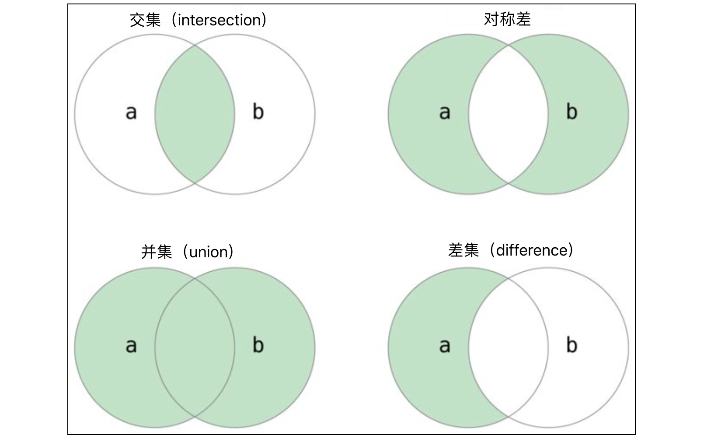

## 常用数据结构之集合

在学习了列表和元组之后，我们再来学习一种容器型的数据类型，它的名字叫集合（set）。说到集合这个词大家一定不会陌生，在数学课本上就有这个概念。如果我们**把一定范围的、确定的、可以区别的事物当作一个整体来看待**，那么这个整体就是集合，集合中的各个事物称为集合的**元素**。通常，集合需要满足以下特性：

1. **无序性**：一个集合中，每个元素的地位都是相同的，元素之间是无序的。
2. **互异性**：一个集合中，任何两个元素都是不相同的，即元素在集合中只能出现一次。
3. **确定性**：给定一个集合和一个任意元素，该元素要么属这个集合，要么不属于这个集合，二者必居其一，不允许有模棱两可的情况出现。

Python 程序中的集合跟数学上的集合没有什么本质区别，需要强调的是上面所说的无序性和互异性。无序性说明集合中的元素并不像列中的元素那样存在某种次序，可以通过索引运算就能访问任意元素，**集合并不支持索引运算**。另外，集合的互异性决定了**集合中不能有重复元素**，这一点也是集合区别于列表的地方，我们无法将重复的元素添加到一个集合中。集合类型必然是支持`in`和`not in`成员运算的，这样就可以确定一个元素是否属于集合，也就是上面所说的集合的确定性。**集合的成员运算在性能上要优于列表的成员运算**，这是集合的底层存储特性决定的，此处我们暂时不做讨论，大家记住这个结论即可。

> **说明**：集合底层使用了哈希存储（散列存储），对哈希存储感兴趣的读者可以看看维基百科上“散列表”这个词条。

### 创建集合

在 Python 中，创建集合可以使用`{}`字面量语法，`{}`中需要至少有一个元素，因为没有元素的`{}`并不是空集合而是一个空字典，字典类型我们会在下一节课中为大家介绍。当然，也可以使用 Python 内置函数`set`来创建一个集合，准确的说`set`并不是一个函数，而是创建集合对象的构造器，这个知识点会在后面讲解面向对象编程的地方为大家介绍。我们可以使用`set`函数创建一个空集合，也可以用它将其他序列转换成集合，例如：`set('hello')`会得到一个包含了`4`个字符的集合（重复的字符`l`只会在集合中出现一次）。除了这两种方式，还可以使用生成式语法来创建集合，就像我们之前用生成式语法创建列表那样。

```python
set1 = {1, 2, 3, 3, 3, 2}
print(set1)

set2 = {'banana', 'pitaya', 'apple', 'apple', 'banana', 'grape'}
print(set2)

set3 = set('hello')
print(set3)

set4 = set([1, 2, 2, 3, 3, 3, 2, 1])
print(set4)

set5 = {num for num in range(1, 20) if num % 3 == 0 or num % 7 == 0}
print(set5)
```

需要提醒大家，集合中的元素必须是`hashable`类型，使用哈希存储的容器都会对元素提出这一要求。所谓`hashable`类型指的是能够计算出哈希码的数据类型，通常不可变类型都是`hashable`类型，如整数（`int`）、浮点小数（`float`）、布尔值（`bool`）、字符串（`str`）、元组（`tuple`）等。可变类型都不是`hashable`类型，因为可变类型无法计算出确定的哈希码，所以它们不能放到集合中。例如：我们不能将列表作为集合中的元素；同理，由于集合本身也是可变类型，所以集合也不能作为集合中的元素。我们可以创建出嵌套的列表，但是我们不能创建出嵌套的集合，这一点在使用集合的时候一定要引起注意。

### 元素的遍历

我们可以通过`len`函数来获得集合中有多少个元素，但是我们不能通过索引运算来遍历集合中的元素，因为集合元素并没有特定的顺序。当然，要实现对集合元素的遍历，我们仍然可以使用`for-in`循环，代码如下所示。

```python
set1 = {'Python', 'C++', 'Java', 'Kotlin', 'Swift'}
for elem in set1:
    print(elem)
```

> **提示**：大家看看上面代码的运行结果，通过单词输出的顺序体会一下集合的无序性。

### 集合的运算

Python 为集合类型提供了非常丰富的运算符，主要包括：成员运算、交集运算、并集运算、差集运算、比较运算（相等性、子集、超集）等。

#### 成员运算

可以通过成员运算`in`和`not in `检查元素是否在集合中，代码如下所示。

```python
set1 = {11, 12, 13, 14, 15}
print(10 in set1)      # False 
print(15 in set1)      # True
set2 = {'Python', 'Java', 'C++', 'Swift'}
print('Ruby' in set2)  # False
print('Java' in set2)  # True
```

#### 二元运算

集合的二元运算主要指集合的交集、并集、差集、对称差等运算，这些运算可以通过运算符来实现，也可以通过集合类型的方法来实现，代码如下所示。



```python
set1 = {1, 2, 3, 4, 5, 6, 7}
set2 = {2, 4, 6, 8, 10}

# 交集
print(set1 & set2)                      # {2, 4, 6}
print(set1.intersection(set2))          # {2, 4, 6}

# 并集
print(set1 | set2)                      # {1, 2, 3, 4, 5, 6, 7, 8, 10}
print(set1.union(set2))                 # {1, 2, 3, 4, 5, 6, 7, 8, 10}

# 差集
print(set1 - set2)                      # {1, 3, 5, 7}
print(set1.difference(set2))            # {1, 3, 5, 7}

# 对称差
print(set1 ^ set2)                      # {1, 3, 5, 7, 8, 10}
print(set1.symmetric_difference(set2))  # {1, 3, 5, 7, 8, 10}
```

通过上面的代码可以看出，对两个集合求交集，`&`运算符和`intersection`方法的作用是完全相同的，使用运算符的方式显然更直观且代码也更简短。需要说明的是，集合的二元运算还可以跟赋值运算一起构成复合赋值运算，例如：`set1 |= set2`相当于`set1 = set1 | set2`，跟`|=`作用相同的方法是`update`；`set1 &= set2`相当于`set1 = set1 & set2`，跟`&=`作用相同的方法是`intersection_update`，代码如下所示。

```python
set1 = {1, 3, 5, 7}
set2 = {2, 4, 6}
set1 |= set2
# set1.update(set2)
print(set1)  # {1, 2, 3, 4, 5, 6, 7}
set3 = {3, 6, 9}
set1 &= set3
# set1.intersection_update(set3)
print(set1)  # {3, 6}
set2 -= set1
# set2.difference_update(set1)
print(set2)  # {2, 4}
```

#### 比较运算

两个集合可以用`==`和`!=`进行相等性判断，如果两个集合中的元素完全相同，那么`==`比较的结果就是`True`，否则就是`False`。如果集合`A`的任意一个元素都是集合`B`的元素，那么集合`A`称为集合`B`的子集，即对于$\small{\forall{a} \in {A}}$，均有$\small{{a} \in {B}}$，则$\small{{A} \subseteq {B}}$，`A`是`B`的子集，反过来也可以称`B`是`A`的超集。如果`A`是`B`的子集且`A`不等于`B`，那么`A`就是`B`的真子集。Python 为集合类型提供了判断子集和超集的运算符，其实就是我们非常熟悉的`<`、`<=`、`>`、`>=`这些运算符。当然，我们也可以通过集合类型的方法`issubset`和`issuperset`来判断集合之间的关系，代码如下所示。

```python
set1 = {1, 3, 5}
set2 = {1, 2, 3, 4, 5}
set3 = {5, 4, 3, 2, 1}

print(set1 < set2)   # True
print(set1 <= set2)  # True
print(set2 < set3)   # False
print(set2 <= set3)  # True
print(set2 > set1)   # True
print(set2 == set3)  # True

print(set1.issubset(set2))    # True
print(set2.issuperset(set1))  # True
```

> **说明**：上面的代码中，`set1 < set2`判断`set1`是不是`set2`的真子集，`set1 <= set2`判断`set1`是不是`set2`的子集，`set2 > set1`判断`set2`是不是`set1`的超集。当然，我们也可以通过`set1.issubset(set2)`判断`set1`是不是`set2`的子集；通过`set2.issuperset(set1)`判断`set2`是不是`set1`的超集。

### 集合的方法

刚才我们说过，Python 中的集合是可变类型，我们可以通过集合类型的方法向集合添加元素或从集合中删除元素。

```python
set1 = {1, 10, 100}

# 添加元素
set1.add(1000)
set1.add(10000)
print(set1)  # {1, 100, 1000, 10, 10000}

# 删除元素
set1.discard(10)
if 100 in set1:
    set1.remove(100)
print(set1)  # {1, 1000, 10000}

# 清空元素
set1.clear()
print(set1)  # set()
```

> **说明**：删除集合元素的`remove`方法在元素不存在时会引发`KeyError`错误，所以上面的代码中我们先通过成员运算判断元素是否在集合中。集合类型还有一个`pop`方法可以从集合中随机删除一个元素，该方法在删除元素的同时会获得被删除的元素，而`remove`和`discard`方法仅仅是删除元素，不会获得被删除的元素。

集合类型还有一个名为`isdisjoint`的方法可以判断两个集合有没有相同的元素，如果没有相同元素，该方法返回`True`，否则该方法返回`False`，代码如下所示。

```python
set1 = {'Java', 'Python', 'C++', 'Kotlin'}
set2 = {'Kotlin', 'Swift', 'Java', 'Dart'}
set3 = {'HTML', 'CSS', 'JavaScript'}
print(set1.isdisjoint(set2))  # False
print(set1.isdisjoint(set3))  # True
```

### 不可变集合

Python 中还有一种不可变类型的集合，名字叫`frozenset`。`set`跟`frozenset`的区别就如同`list`跟`tuple`的区别，`frozenset`由于是不可变类型，能够计算出哈希码，因此它可以作为`set`中的元素。除了不能添加和删除元素，`frozenset`在其他方面跟`set`是一样的，下面的代码简单的展示了`frozenset`的用法。

```python
fset1 = frozenset({1, 3, 5, 7})
fset2 = frozenset(range(1, 6))
print(fset1)          # frozenset({1, 3, 5, 7})
print(fset2)          # frozenset({1, 2, 3, 4, 5})
print(fset1 & fset2)  # frozenset({1, 3, 5})
print(fset1 | fset2)  # frozenset({1, 2, 3, 4, 5, 7})
print(fset1 - fset2)  # frozenset({7})
print(fset1 < fset2)  # False
```

### 总结

Python 中的**集合类型是一种无序容器**，**不允许有重复运算**，由于底层使用了哈希存储，集合中的元素必须是`hashable`类型。集合与列表最大的区别在于**集合中的元素没有顺序**、所以**不能够通过索引运算访问元素**、但是集合可以执行交集、并集、差集等二元运算，也可以通过关系运算符检查两个集合是否存在超集、子集等关系。
