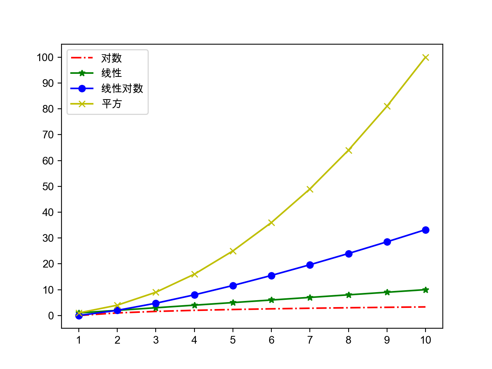
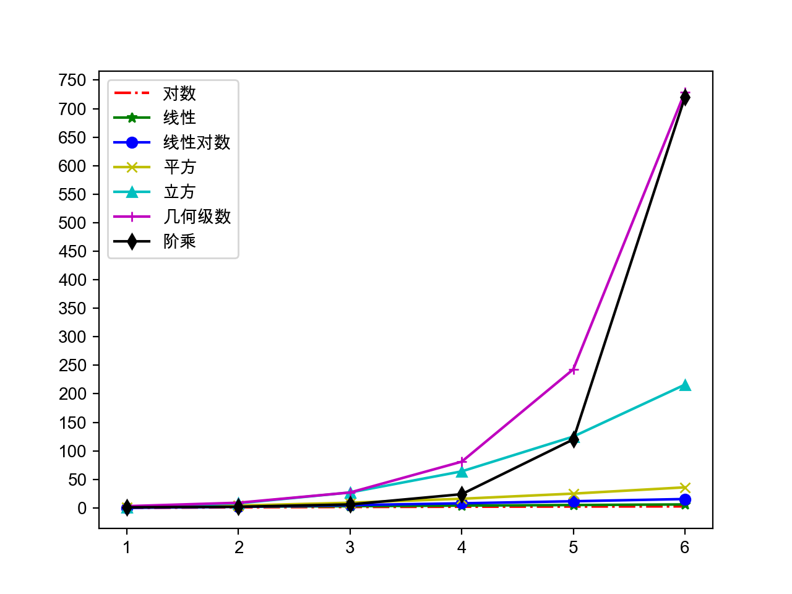

## Python语言进阶

1. 数据结构和算法

   - 算法：解决问题的方法和步骤

   - 评价算法的好坏：渐近时间复杂度和渐近空间复杂度。

   - 渐近时间复杂度的大O标记：
     -  - 常量时间复杂度 - 布隆过滤器 / 哈希存储
     -  - 对数时间复杂度 - 折半查找（二分查找）
     -  - 线性时间复杂度 - 顺序查找 / 桶排序
     -  - 对数线性时间复杂度 - 高级排序算法（归并排序、快速排序）
     -  - 平方时间复杂度 - 简单排序算法（选择排序、插入排序、冒泡排序）
     -  - 立方时间复杂度 - Floyd算法 / 矩阵乘法运算
     -  - 几何级数时间复杂度 - 汉诺塔
     -  - 阶乘时间复杂度 - 旅行经销商问题 - NP

     

     

   - 排序算法（选择、冒泡和归并）和查找算法（顺序和折半）

     ```Python
     def select_sort(origin_items, comp=lambda x, y: x < y):
         """简单选择排序"""
         items = origin_items[:]
         for i in range(len(items) - 1):
             min_index = i
             for j in range(i + 1, len(items)):
                 if comp(items[j], items[min_index]):
                     min_index = j
             items[i], items[min_index] = items[min_index], items[i]
         return items
     ```

     ```Python
     def bubble_sort(origin_items, comp=lambda x, y: x > y):
         """高质量冒泡排序(搅拌排序)"""
         items = origin_items[:]
         for i in range(len(items) - 1):
             swapped = False
             for j in range(i, len(items) - 1 - i):
                 if comp(items[j], items[j + 1]):
                     items[j], items[j + 1] = items[j + 1], items[j]
                     swapped = True
             if swapped:
                 swapped = False
                 for j in range(len(items) - 2 - i, i, -1):
                     if comp(items[j - 1], items[j]):
                         items[j], items[j - 1] = items[j - 1], items[j]
                         swapped = True
             if not swapped:
                 break
         return items
     ```

     ```Python
     def merge_sort(items, comp=lambda x, y: x <= y):
         """归并排序(分治法)"""
         if len(items) < 2:
             return items[:]
         mid = len(items) // 2
         left = merge_sort(items[:mid], comp)
         right = merge_sort(items[mid:], comp)
         return merge(left, right, comp)
     
     
     def merge(items1, items2, comp):
         """合并(将两个有序的列表合并成一个有序的列表)"""
         items = []
         index, index2 = 0, 0
         while index1 < len(items1) and index2 < len(items2):
             if comp(items1[index1], items2[index2]):
                 items.append(items1[index1])
                 index1 += 1
             else:
                 items.append(items2[index2])
                 index2 += 1
         items += items1[index1:]
         items += items2[index2:]
         return items
     ```

     ```Python
     def seq_search(items, key):
         """顺序查找"""
         for index, item in enumerate(items):
             if item == key:
                 return index
         return -1
     ```

     ```Python
     def bin_search(items, key):
         """折半查找"""
         start, end = 0, len(items) - 1
         while start <= end:
             mid = (start + end) // 2
             if key > items[mid]:
                 start = mid + 1
             elif key < items[mid]:
                 end = mid - 1
             else:
                 return mid
         return -1
     ```

   - 使用生成式（推导式）语法

     ```Python
     prices = {
         'AAPL': 191.88,
         'GOOG': 1186.96,
         'IBM': 149.24,
         'ORCL': 48.44,
         'ACN': 166.89,
         'FB': 208.09,
         'SYMC': 21.29
     }
     # 用股票价格大于100元的股票构造一个新的字典
     prices2 = {key: value for key, value in prices.items() if value > 100}
     print(prices2)
     ```

     > 说明：生成式（推导式）可以用来生成列表、集合和字典。

   - 嵌套的列表

     ```Python
     names = ['关羽', '张飞', '赵云', '马超', '黄忠']
     courses = ['语文', '数学', '英语']
     # 录入五个学生三门课程的成绩
     # 错误 - 参考http://pythontutor.com/visualize.html#mode=edit
     # scores = [[None] * len(courses)] * len(names)
     scores = [[None] * len(courses) for _ in range(len(names))]
     for row, name in enumerate(names):
         for col, course in enumerate(courses):
             scores[row][col] = float(input(f'请输入{name}的{course}成绩: '))
             print(scores)
     ```

     [Python Tutor](http://pythontutor.com/) - VISUALIZE CODE AND GET LIVE HELP

   - heapq、itertools等的用法
     ```Python
     """
     从列表中找出最大的或最小的N个元素
     堆结构(大根堆/小根堆)
     """
     import heapq
     
     list1 = [34, 25, 12, 99, 87, 63, 58, 78, 88, 92]
     list2 = [
         {'name': 'IBM', 'shares': 100, 'price': 91.1},
         {'name': 'AAPL', 'shares': 50, 'price': 543.22},
         {'name': 'FB', 'shares': 200, 'price': 21.09},
         {'name': 'HPQ', 'shares': 35, 'price': 31.75},
         {'name': 'YHOO', 'shares': 45, 'price': 16.35},
         {'name': 'ACME', 'shares': 75, 'price': 115.65}
     ]
     print(heapq.nlargest(3, list1))
     print(heapq.nsmallest(3, list1))
     print(heapq.nlargest(2, list2, key=lambda x: x['price']))
     print(heapq.nlargest(2, list2, key=lambda x: x['shares']))
     ```

     ```Python
     """
     迭代工具 - 排列 / 组合 / 笛卡尔积
     """
     import itertools
     
     itertools.permutations('ABCD')
     itertools.combinations('ABCDE', 3)
     itertools.product('ABCD', '123')
     ```

   - collections模块下的工具类

     ```Python
     """
     找出序列中出现次数最多的元素
     """
     from collections import Counter
     
     words = [
         'look', 'into', 'my', 'eyes', 'look', 'into', 'my', 'eyes',
         'the', 'eyes', 'the', 'eyes', 'the', 'eyes', 'not', 'around',
         'the', 'eyes', "don't", 'look', 'around', 'the', 'eyes',
         'look', 'into', 'my', 'eyes', "you're", 'under'
     ]
     counter = Counter(words)
     print(counter.most_common(3))
     ```

   - 常用算法：

     - 穷举法 - 又称为暴力破解法，对所有的可能性进行验证，直到找到正确答案。
     - 贪婪法 - 在对问题求解时，总是做出在当前看来
     - 最好的选择，不追求最优解，快速找到满意解。
     - 分治法 - 把一个复杂的问题分成两个或更多的相同或相似的子问题，再把子问题分成更小的子问题，直到可以直接求解的程度，最后将子问题的解进行合并得到原问题的解。
     - 回溯法 - 回溯法又称为试探法，按选优条件向前搜索，当搜索到某一步发现原先选择并不优或达不到目标时，就退回一步重新选择。
     - 动态规划 - 基本思想也是将待求解问题分解成若干个子问题，先求解并保存这些子问题的解，避免产生大量的重复运算。

     穷举法例子：百钱百鸡和五人分鱼。

     ```Python
     # 公鸡5元一只 母鸡3元一只 小鸡1元三只
     # 用100元买100只鸡 问公鸡/母鸡/小鸡各多少只
     for x in range(20):
         for y in range(33):
             z = 100 - x - y
             if 5 * x + 3 * y + z // 3 == 100 and z % 3 == 0:
                 print(x, y, z)
     
     # A、B、C、D、E五人在某天夜里合伙捕鱼 最后疲惫不堪各自睡觉
     # 第二天A第一个醒来 他将鱼分为5份 扔掉多余的1条 拿走自己的一份
     # B第二个醒来 也将鱼分为5份 扔掉多余的1条 拿走自己的一份
     # 然后C、D、E依次醒来也按同样的方式分鱼 问他们至少捕了多少条鱼
     fish = 6
     while True:
         total = fish
         enough = True
         for _ in range(5):
             if (total - 1) % 5 == 0:
                 total = (total - 1) // 5 * 4
             else:
                 enough = False
                 break
         if enough:
             print(fish)
             break
         fish += 5
     ```

     贪婪法例子：假设小偷有一个背包，最多能装20公斤赃物，他闯入一户人家，发现如下表所示的物品。很显然，他不能把所有物品都装进背包，所以必须确定拿走哪些物品，留下哪些物品。

     |  名称  | 价格（美元） | 重量（kg） |
     | :----: | :----------: | :--------: |
     |  电脑  |     200      |     20     |
     | 收音机 |      20      |     4      |
     |   钟   |     175      |     10     |
     |  花瓶  |      50      |     2      |
     |   书   |      10      |     1      |
     |  油画  |      90      |     9      |

     ```Python
     """
     贪婪法：在对问题求解时，总是做出在当前看来是最好的选择，不追求最优解，快速找到满意解。
     输入：
     20 6
     电脑 200 20
     收音机 20 4
     钟 175 10
     花瓶 50 2
     书 10 1
     油画 90 9
     """
     class Thing(object):
         """物品"""
     
         def __init__(self, name, price, weight):
             self.name = name
             self.price = price
             self.weight = weight
     
         @property
         def value(self):
             """价格重量比"""
             return self.price / self.weight
     
     
     def input_thing():
         """输入物品信息"""
         name_str, price_str, weight_str = input().split()
         return name_str, int(price_str), int(weight_str)
     
     
     def main():
         """主函数"""
         max_weight, num_of_things = map(int, input().split())
         all_things = []
         for _ in range(num_of_things):
             all_things.append(Thing(*input_thing()))
         all_things.sort(key=lambda x: x.value, reverse=True)
         total_weight = 0
         total_price = 0
         for thing in all_things:
             if total_weight + thing.weight <= max_weight:
                 print(f'小偷拿走了{thing.name}')
                 total_weight += thing.weight
                 total_price += thing.price
         print(f'总价值: {total_price}美元')
     
     
     if __name__ == '__main__':
         main()
     ```

     分治法例子：[快速排序](https://zh.wikipedia.org/zh/%E5%BF%AB%E9%80%9F%E6%8E%92%E5%BA%8F)。

     ```Python
     """
     快速排序 - 选择枢轴对元素进行划分，左边都比枢轴小右边都比枢轴大
     """
     def quick_sort(origin_items, comp=lambda x, y: x <= y):
         items = origin_items[:]
         _quick_sort(items, 0, len(items) - 1, comp)
         return items
     
     
     def _quick_sort(items, start, end, comp):
         if start < end:
             pos = _partition(items, start, end, comp)
             _quick_sort(items, start, pos - 1, comp)
             _quick_sort(items, pos + 1, end, comp)
     
     
     def _partition(items, start, end, comp):
         pivot = items[end]
         i = start - 1
         for j in range(start, end):
             if comp(items[j], pivot):
                 i += 1
                 items[i], items[j] = items[j], items[i]
         items[i + 1], items[end] = items[end], items[i + 1]
         return i + 1
     ```

     回溯法例子：[骑士巡逻](https://zh.wikipedia.org/zh/%E9%AA%91%E5%A3%AB%E5%B7%A1%E9%80%BB)。

     ```Python
     """
     递归回溯法：叫称为试探法，按选优条件向前搜索，当搜索到某一步，发现原先选择并不优或达不到目标时，就退回一步重新选择，比较经典的问题包括骑士巡逻、八皇后和迷宫寻路等。
     """
     import sys
     import time
     
     SIZE = 5
     total = 0
     
     
     def print_board(board):
         for row in board:
             for col in row:
                 print(str(col).center(4), end='')
             print()
     
     
     def patrol(board, row, col, step=1):
         if row >= 0 and row < SIZE and \
             col >= 0 and col < SIZE and \
             board[row][col] == 0:
             board[row][col] = step
             if step == SIZE * SIZE:
                 global total
                 total += 1
                 print(f'第{total}种走法: ')
                 print_board(board)
             patrol(board, row - 2, col - 1, step + 1)
             patrol(board, row - 1, col - 2, step + 1)
             patrol(board, row + 1, col - 2, step + 1)
             patrol(board, row + 2, col - 1, step + 1)
             patrol(board, row + 2, col + 1, step + 1)
             patrol(board, row + 1, col + 2, step + 1)
             patrol(board, row - 1, col + 2, step + 1)
             patrol(board, row - 2, col + 1, step + 1)
             board[row][col] = 0
     
     
     def main():
         board = [[0] * SIZE for _ in range(SIZE)]
         patrol(board, SIZE - 1, SIZE - 1)
     
     
     if __name__ == '__main__':
         main()
     ```

     动态规划例子1：[斐波拉切数列]()。（不使用动态规划将会是几何级数复杂度）

     ```Python
     """
     动态规划 - 适用于有重叠子问题和最优子结构性质的问题
     使用动态规划方法所耗时间往往远少于朴素解法(用空间换取时间)
     """
     def fib(num, temp={}):
         """用递归计算Fibonacci数"""
         if num in (1, 2):
             return 1
         try:
             return temp[num]
         except KeyError:
             temp[num] = fib(num - 1) + fib(num - 2)
             return temp[num]
     ```

     动态规划例子2：子列表元素之和的最大值。（使用动态规划可以避免二重循环）

     > 说明：子列表指的是列表中索引（下标）连续的元素构成的列表；列表中的元素是int类型，可能包含正整数、0、负整数；程序输入列表中的元素，输出子列表元素求和的最大值，例如：
     >
     > 输入：1 -2 3 5 -3 2
     >
     > 输出：8
     >
     > 输入：0 -2 3 5 -1 2
     >
     > 输出：9
     >
     > 输入：-9 -2 -3 -5 -3
     >
     > 输出：-2

     ```Python
     def main():
         items = list(map(int, input().split()))
         size = len(items)
         overall, partial = {}, {}
         overall[size - 1] = partial[size - 1] = items[size - 1]
         for i in range(size - 2, -1, -1):
             partial[i] = max(items[i], partial[i + 1] + items[i])
             overall[i] = max(partial[i], overall[i + 1])
         print(overall[0])
     
     
     if __name__ == '__main__':
         main()
     ```

2. 函数的使用方式

   - 将函数视为“一等公民”

     - 函数可以赋值给变量
     - 函数可以作为函数的参数
     - 函数可以作为函数的返回值

   - 高阶函数的用法（`filter`、`map`以及它们的替代品）

     ```Python
     items1 = list(map(lambda x: x ** 2, filter(lambda x: x % 2, range(1, 10))))
     items2 = [x ** 2 for x in range(1, 10) if x % 2]
     ```

   - 位置参数、可变参数、关键字参数、命名关键字参数

   - 参数的元信息（代码可读性问题）

   - 匿名函数和内联函数的用法（`lambda`函数）

   - 闭包和作用域问题

     - Python搜索变量的LEGB顺序（Local --> Embedded --> Global --> Built-in）

     - `global`和`nonlocal`关键字的作用

       `global`：声明或定义全局变量（要么直接使用现有的全局作用域的变量，要么定义一个变量放到全局作用域）。

       `nonlocal`：声明使用嵌套作用域的变量（嵌套作用域必须存在该变量，否则报错）。

   - 装饰器函数（使用装饰器和取消装饰器）

     例子：输出函数执行时间的装饰器。

     ```Python
     def record_time(func):
         """自定义装饰函数的装饰器"""
         
         @wraps(func)
         def wrapper(*args, **kwargs):
             start = time()
             result = func(*args, **kwargs)
             print(f'{func.__name__}: {time() - start}秒')
             return result
             
         return wrapper
     ```

     如果装饰器不希望跟`print`函数耦合，可以编写带参数的装饰器。

     ```Python
     from functools import wraps
     from time import time
     
     
     def record(output):
         """自定义带参数的装饰器"""
     	
     	def decorate(func):
     		
     		@wraps(func)
     		def wrapper(*args, **kwargs):
     			start = time()
     			result = func(*args, **kwargs)
     			output(func.__name__, time() - start)
     			return result
                 
     		return wrapper
     	
     	return decorate
     ```

     ```Python
     from functools import wraps
     from time import time
     
     
     class Record():
         """自定义装饰器类(通过__call__魔术方法使得对象可以当成函数调用)"""
     
         def __init__(self, output):
             self.output = output
     
         def __call__(self, func):
     
             @wraps(func)
             def wrapper(*args, **kwargs):
                 start = time()
                 result = func(*args, **kwargs)
                 self.output(func.__name__, time() - start)
                 return result
     
             return wrapper
     ```

     > 说明：由于对带装饰功能的函数添加了@wraps装饰器，可以通过`func.__wrapped__`方式获得被装饰之前的函数或类来取消装饰器的作用。

     例子：用装饰器来实现单例模式。

     ```Python
     from functools import wraps
     
     
     def singleton(cls):
         """装饰类的装饰器"""
         instances = {}
     
         @wraps(cls)
         def wrapper(*args, **kwargs):
             if cls not in instances:
                 instances[cls] = cls(*args, **kwargs)
             return instances[cls]
     
         return wrapper
     
     
     @singleton
     class President():
         """总统(单例类)"""
         pass
     ```

     > 说明：上面的代码中用到了闭包（closure），不知道你是否已经意识到了。还没有一个小问题就是，上面的代码并没有实现线程安全的单例，如果要实现线程安全的单例应该怎么做呢？

     ```Python
     from functools import wraps
     from threading import Lock
     
     
     def singleton(cls):
         """线程安全的单例装饰器"""
         instances = {}
         locker = Lock()
     
         @wraps(cls)
         def wrapper(*args, **kwargs):
             if cls not in instances:
                 with locker:
                     if cls not in instances:
                         instances[cls] = cls(*args, **kwargs)
             return instances[cls]
     
         return wrapper
     ```

3. 面向对象相关知识

   - 三大支柱：封装、继承、多态

     例子：工资结算系统。

     ```Python
     """
     月薪结算系统 - 部门经理每月15000 程序员每小时200 销售员1800底薪加销售额5%提成
     """
     from abc import ABCMeta, abstractmethod
     
     
     class Employee(metaclass=ABCMeta):
         """员工(抽象类)"""
     
         def __init__(self, name):
             self.name = name
     
         @abstractmethod
         def get_salary(self):
             """结算月薪(抽象方法)"""
             pass
     
     
     class Manager(Employee):
         """部门经理"""
     
         def get_salary(self):
             return 15000.0
     
     
     class Programmer(Employee):
         """程序员"""
     
         def __init__(self, name, working_hour=0):
             self.working_hour = working_hour
             super().__init__(name)
     
         def get_salary(self):
             return 200.0 * self.working_hour
     
     
     class Salesman(Employee):
         """销售员"""
     
         def __init__(self, name, sales=0.0):
             self.sales = sales
             super().__init__(name)
     
         def get_salary(self):
             return 1800.0 + self.sales * 0.05
     
     
     class EmployeeFactory():
         """创建员工的工厂（工厂模式 - 通过工厂实现对象使用者和对象之间的解耦合）"""
     
         @staticmethod
         def create(emp_type, *args, **kwargs):
             """创建员工"""
             emp_type = emp_type.upper()
             emp = None
             if emp_type == 'M':
                 emp = Manager(*args, **kwargs)
             elif emp_type == 'P':
                 emp = Programmer(*args, **kwargs)
             elif emp_type == 'S':
                 emp = Salesman(*args, **kwargs)
             return emp
     
     
     def main():
         """主函数"""
         emps = [
             EmployeeFactory.create('M', '曹操'), 
             EmployeeFactory.create('P', '荀彧', 120),
             EmployeeFactory.create('P', '郭嘉', 85), 
             EmployeeFactory.create('S', '典韦', 123000),
         ]
         for emp in emps:
             print('%s: %.2f元' % (emp.name, emp.get_salary()))
     
     
     if __name__ == '__main__':
         main()
     ```

   - 类与类之间的关系

     - is-a关系：继承
     - has-a关系：关联 / 聚合 / 合成
     - use-a关系：依赖

     例子：扑克游戏。

     ```Python
     """
     经验：符号常量总是优于字面常量，枚举类型是定义符号常量的最佳选择
     """
     from enum import Enum, unique
     
     import random
     
     
     @unique
     class Suite(Enum):
         """花色"""
     
         SPADE, HEART, CLUB, DIAMOND = range(4)
     
         def __lt__(self, other):
             return self.value < other.value
     
     
     class Card():
         """牌"""
     
         def __init__(self, suite, face):
             """初始化方法"""
             self.suite = suite
             self.face = face
     
         def show(self):
             """显示牌面"""
             suites = ['♠️', '♥️', '♣️', '♦️']
             faces = ['', 'A', '2', '3', '4', '5', '6', '7', '8', '9', '10', 'J', 'Q', 'K']
             return f'{suites[self.suite.value]} {faces[self.face]}'
     
         def __str__(self):
             return self.show()
     
         def __repr__(self):
             return self.show()
     
     
     class Poker():
         """扑克"""
     
         def __init__(self):
             self.index = 0
             self.cards = [Card(suite, face)
                           for suite in Suite
                           for face in range(1, 14)]
     
         def shuffle(self):
             """洗牌（随机乱序）"""
             random.shuffle(self.cards)
             self.index = 0
     
         def deal(self):
             """发牌"""
             card = self.cards[self.index]
             self.index += 1
             return card
     
         @property
         def has_more(self):
             return self.index < len(self.cards)
     
     
     class Player():
         """玩家"""
     
         def __init__(self, name):
             self.name = name
             self.cards = []
     
         def get_one(self, card):
             """摸一张牌"""
             self.cards.append(card)
     
         def sort(self, comp=lambda card: (card.suite, card.face)):
             """整理手上的牌"""
             self.cards.sort(key=comp)
     
     
     def main():
         """主函数"""
         poker = Poker()
         poker.shuffle()
         players = [Player('东邪'), Player('西毒'), Player('南帝'), Player('北丐')]
         while poker.has_more:
             for player in players:
                     player.get_one(poker.deal())
         for player in players:
             player.sort()
             print(player.name, end=': ')
             print(player.cards)
     
     
     if __name__ == '__main__':
         main()
     ```

     > 说明：上面的代码中使用了Emoji字符来表示扑克牌的四种花色，在某些不支持Emoji字符的系统上可能无法显示。

   - 对象的复制（深复制/深拷贝/深度克隆和浅复制/浅拷贝/影子克隆）

   - 垃圾回收、循环引用和弱引用

     Python使用了自动化内存管理，这种管理机制以**引用计数**为基础，同时也引入了**标记-清除**和**分代收集**两种机制为辅的策略。

     ```C
     typedef struct_object {
         /* 引用计数 */
         int ob_refcnt;
         /* 对象指针 */
         struct_typeobject *ob_type;
     } PyObject;
     ```

     ```C
     /* 增加引用计数的宏定义 */
     #define Py_INCREF(op)   ((op)->ob_refcnt++)
     /* 减少引用计数的宏定义 */
     #define Py_DECREF(op) \ //减少计数
         if (--(op)->ob_refcnt != 0) \
             ; \
         else \
             __Py_Dealloc((PyObject *)(op))
     ```

     导致引用计数+1的情况：

     - 对象被创建，例如`a = 23`
     - 对象被引用，例如`b = a`
     - 对象被作为参数，传入到一个函数中，例如`f(a)`
     - 对象作为一个元素，存储在容器中，例如`list1 = [a, a]`

     导致引用计数-1的情况：

     - 对象的别名被显式销毁，例如`del a`
     - 对象的别名被赋予新的对象，例如`a = 24`
     - 一个对象离开它的作用域，例如f函数执行完毕时，f函数中的局部变量（全局变量不会）
     - 对象所在的容器被销毁，或从容器中删除对象

     引用计数可能会导致循环引用问题，而循环引用会导致内存泄露，如下面的代码所示。为了解决这个问题，Python中引入了“标记-清除”和“分代收集”。在创建一个对象的时候，对象被放在第一代中，如果在第一代的垃圾检查中对象存活了下来，该对象就会被放到第二代中，同理在第二代的垃圾检查中对象存活下来，该对象就会被放到第三代中。

     ```Python
     # 循环引用会导致内存泄露 - Python除了引用技术还引入了标记清理和分代回收
     # 在Python 3.6以前如果重写__del__魔术方法会导致循环引用处理失效
     # 如果不想造成循环引用可以使用弱引用
     list1 = []
     list2 = [] 
     list1.append(list2)
     list2.append(list1)
     ```

     以下情况会导致垃圾回收：

     - 调用`gc.collect()`
     - gc模块的计数器达到阀值
     - 程序退出

     如果循环引用中两个对象都定义了`__del__`方法，gc模块不会销毁这些不可达对象，因为gc模块不知道应该先调用哪个对象的`__del__`方法，这个问题在Python 3.6中得到了解决。

     也可以通过`weakref`模块构造弱引用的方式来解决循环引用的问题。

   - 魔法属性和方法（请参考《Python魔法方法指南》）

     有几个小问题请大家思考：

     - 自定义的对象能不能使用运算符做运算？
     - 自定义的对象能不能放到set中？能去重吗？
     - 自定义的对象能不能作为dict的键？
     - 自定义的对象能不能使用上下文语法？

   - 混入（Mixin）

     例子：自定义字典限制只有在指定的key不存在时才能在字典中设置键值对。

     ```Python
     class SetOnceMappingMixin():
         """自定义混入类"""
         __slots__ = ()
     
         def __setitem__(self, key, value):
             if key in self:
                 raise KeyError(str(key) + ' already set')
             return super().__setitem__(key, value)
     
     
     class SetOnceDict(SetOnceMappingMixin, dict):
         """自定义字典"""
         pass
     
     
     my_dict= SetOnceDict()
     try:
         my_dict['username'] = 'jackfrued'
         my_dict['username'] = 'hellokitty'
     except KeyError:
         pass
     print(my_dict)
     ```

   - 元编程和元类

     例子：用元类实现单例模式。

     ```Python
     import threading
     
     
     class SingletonMeta(type):
         """自定义元类"""
     
         def __init__(cls, *args, **kwargs):
             cls.__instance = None
             cls.__lock = threading.Lock()
             super().__init__(*args, **kwargs)
     
         def __call__(cls, *args, **kwargs):
             if cls.__instance is None:
                 with cls.__lock:
                     if cls.__instance is None:
                         cls.__instance = super().__call__(*args, **kwargs)
             return cls.__instance
     
     
     class President(metaclass=SingletonMeta):
         """总统(单例类)"""
         pass
     ```

   - 面向对象设计原则

     - 单一职责原则 （**S**RP）- 一个类只做该做的事情（类的设计要高内聚）
     - 开闭原则 （**O**CP）- 软件实体应该对扩展开发对修改关闭
     - 依赖倒转原则（DIP）- 面向抽象编程（在弱类型语言中已经被弱化）
     - 里氏替换原则（**L**SP） - 任何时候可以用子类对象替换掉父类对象
     - 接口隔离原则（**I**SP）- 接口要小而专不要大而全（Python中没有接口的概念）
     - 合成聚合复用原则（CARP） - 优先使用强关联关系而不是继承关系复用代码
     - 最少知识原则（迪米特法则，Lo**D**）- 不要给没有必然联系的对象发消息

     > 说明：上面加粗的字母放在一起称为面向对象的**SOLID**原则。

   - GoF设计模式

     - 创建型模式：单例、工厂、建造者、原型
     - 结构型模式：适配器、门面（外观）、代理
     - 行为型模式：迭代器、观察者、状态、策略

     例子：可插拔的哈希算法。

     ```Python
     class StreamHasher():
         """哈希摘要生成器(策略模式)"""
     
         def __init__(self, alg='md5', size=4096):
             self.size = size
             alg = alg.lower()
             self.hasher = getattr(__import__('hashlib'), alg.lower())()
     
         def __call__(self, stream):
             return self.to_digest(stream)
     
         def to_digest(self, stream):
             """生成十六进制形式的摘要"""
             for buf in iter(lambda: stream.read(self.size), b''):
                 self.hasher.update(buf)
             return self.hasher.hexdigest()
     
     def main():
         """主函数"""
         hasher1 = StreamHasher()
         with open('Python-3.7.1.tgz', 'rb') as stream:
             print(hasher1.to_digest(stream))
         hasher2 = StreamHasher('sha1')
         with open('Python-3.7.1.tgz', 'rb') as stream:
             print(hasher2(stream))
     
     
     if __name__ == '__main__':
         main()
     ```

4. 迭代器和生成器

   - 和迭代器相关的魔术方法（`__iter__`和`__next__`）

   - 两种创建生成器的方式（生成器表达式和`yield`关键字）

     ```Python
     def fib(num):
         """生成器"""
         a, b = 0, 1
         for _ in range(num):
             a, b = b, a + b
             yield a
        
        
     class Fib(object):
         """迭代器"""
         
         def __init__(self, num):
             self.num = num
             self.a, self.b = 0, 1
             self.idx = 0
        
         def __iter__(self):
             return self
     
         def __next__(self):
             if self.idx < self.num:
                 self.a, self.b = self.b, self.a + self.b
                 self.idx += 1
                 return self.a
             raise StopIteration()
     ```

5. 并发编程

   Python中实现并发编程的三种方案：多线程、多进程和异步I/O。并发编程的好处在于可以提升程序的执行效率以及改善用户体验；坏处在于并发的程序不容易开发和调试，同时对其他程序来说它并不友好。

   - 多线程：Python中提供了Thread类并辅以Lock、Condition、Event、Semaphore和Barrier。Python中有GIL来防止多个线程同时执行本地字节码，这个锁对于CPython是必须的，因为CPython的内存管理并不是线程安全的，因为GIL的存在多线程并不能发挥CPU的多核特性。

     ```Python
     """
     面试题：进程和线程的区别和联系？
     进程 - 操作系统分配内存的基本单位 - 一个进程可以包含一个或多个线程
     线程 - 操作系统分配CPU的基本单位
     并发编程（concurrent programming）
     1. 提升执行性能 - 让程序中没有因果关系的部分可以并发的执行
     2. 改善用户体验 - 让耗时间的操作不会造成程序的假死
     """
     import glob
     import os
     import threading
     
     from PIL import Image
     
     PREFIX = 'thumbnails'
     
     
     def generate_thumbnail(infile, size, format='PNG'):
         """生成指定图片文件的缩略图"""
     	file, ext = os.path.splitext(infile)
     	file = file[file.rfind('/') + 1:]
     	outfile = f'{PREFIX}/{file}_{size[0]}_{size[1]}.{ext}'
     	img = Image.open(infile)
     	img.thumbnail(size, Image.ANTIALIAS)
     	img.save(outfile, format)
     
     
     def main():
         """主函数"""
     	if not os.path.exists(PREFIX):
     		os.mkdir(PREFIX)
     	for infile in glob.glob('images/*.png'):
     		for size in (32, 64, 128):
                 # 创建并启动线程
     			threading.Thread(
     				target=generate_thumbnail, 
     				args=(infile, (size, size))
     			).start()
     			
     
     if __name__ == '__main__':
     	main()
     ```

     多个线程竞争资源的情况

     ```Python
     """
     多线程程序如果没有竞争资源处理起来通常也比较简单
     当多个线程竞争临界资源的时候如果缺乏必要的保护措施就会导致数据错乱
     说明：临界资源就是被多个线程竞争的资源
     """
     import time
     import threading
     
     from concurrent.futures import ThreadPoolExecutor
     
     
     class Account(object):
         """银行账户"""
     
         def __init__(self):
             self.balance = 0.0
             self.lock = threading.Lock()
     
         def deposit(self, money):
             # 通过锁保护临界资源
             with self.lock:
                 new_balance = self.balance + money
                 time.sleep(0.001)
                 self.balance = new_balance
     
     
     class AddMoneyThread(threading.Thread):
         """自定义线程类"""
     
         def __init__(self, account, money):
             self.account = account
             self.money = money
             # 自定义线程的初始化方法中必须调用父类的初始化方法
             super().__init__()
     
         def run(self):
             # 线程启动之后要执行的操作
             self.account.deposit(self.money)
     
     def main():
         """主函数"""
         account = Account()
         # 创建线程池
         pool = ThreadPoolExecutor(max_workers=10)
         futures = []
         for _ in range(100):
             # 创建线程的第1种方式
             # threading.Thread(
             #     target=account.deposit, args=(1, )
             # ).start()
             # 创建线程的第2种方式
             # AddMoneyThread(account, 1).start()
             # 创建线程的第3种方式
             # 调用线程池中的线程来执行特定的任务
             future = pool.submit(account.deposit, 1)
             futures.append(future)
         # 关闭线程池
         pool.shutdown()
         for future in futures:
             future.result()
         print(account.balance)
     
     
     if __name__ == '__main__':
         main()
     ```

     修改上面的程序，启动5个线程向账户中存钱，5个线程从账户中取钱，取钱时如果余额不足就暂停线程进行等待。为了达到上述目标，需要对存钱和取钱的线程进行调度，在余额不足时取钱的线程暂停并释放锁，而存钱的线程将钱存入后要通知取钱的线程，使其从暂停状态被唤醒。可以使用`threading`模块的Condition来实现线程调度，该对象也是基于锁来创建的，代码如下所示：

     ```Python
     """
     多个线程竞争一个资源 - 保护临界资源 - 锁（Lock/RLock）
     多个线程竞争多个资源（线程数>资源数） - 信号量（Semaphore）
     多个线程的调度 - 暂停线程执行/唤醒等待中的线程 - Condition
     """
     from concurrent.futures import ThreadPoolExecutor
     from random import randint
     from time import sleep
     
     import threading
     
     
     class Account():
         """银行账户"""
     
         def __init__(self, balance=0):
             self.balance = balance
             lock = threading.Lock()
             self.condition = threading.Condition(lock)
     
         def withdraw(self, money):
             """取钱"""
             with self.condition:
                 while money > self.balance:
                     self.condition.wait()
                 new_balance = self.balance - money
                 sleep(0.001)
                 self.balance = new_balance
     
         def deposit(self, money):
             """存钱"""
             with self.condition:
                 new_balance = self.balance + money
                 sleep(0.001)
                 self.balance = new_balance
                 self.condition.notify_all()
     
     
     def add_money(account):
         while True:
             money = randint(5, 10)
             account.deposit(money)
             print(threading.current_thread().name, 
                   ':', money, '====>', account.balance)
             sleep(0.5)
     
     
     def sub_money(account):
         while True:
             money = randint(10, 30)
             account.withdraw(money)
             print(threading.current_thread().name, 
                   ':', money, '<====', account.balance)
             sleep(1)
     
     
     def main():
         account = Account()
         with ThreadPoolExecutor(max_workers=10) as pool:
             for _ in range(5):
                 pool.submit(add_money, account)
                 pool.submit(sub_money, account)
     
     
     if __name__ == '__main__':
         main()
     ```

   - 多进程：多进程可以有效的解决GIL的问题，实现多进程主要的类是Process，其他辅助的类跟threading模块中的类似，进程间共享数据可以使用管道、套接字等，在multiprocessing模块中有一个Queue类，它基于管道和锁机制提供了多个进程共享的队列。下面是官方文档上关于多进程和进程池的一个示例。

     ```Python
     """
     多进程和进程池的使用
     多线程因为GIL的存在不能够发挥CPU的多核特性
     对于计算密集型任务应该考虑使用多进程
     time python3 example22.py
     real    0m11.512s
     user    0m39.319s
     sys     0m0.169s
     使用多进程后实际执行时间为11.512秒，而用户时间39.319秒约为实际执行时间的4倍
     这就证明我们的程序通过多进程使用了CPU的多核特性，而且这台计算机配置了4核的CPU
     """
     import concurrent.futures
     import math
     
     PRIMES = [
         1116281,
         1297337,
         104395303,
         472882027,
         533000389,
         817504243,
         982451653,
         112272535095293,
         112582705942171,
         112272535095293,
         115280095190773,
         115797848077099,
         1099726899285419
     ] * 5
     
     
     def is_prime(n):
         """判断素数"""
         if n % 2 == 0:
             return False
     
         sqrt_n = int(math.floor(math.sqrt(n)))
         for i in range(3, sqrt_n + 1, 2):
             if n % i == 0:
                 return False
         return True
     
     
     def main():
         """主函数"""
         with concurrent.futures.ProcessPoolExecutor() as executor:
             for number, prime in zip(PRIMES, executor.map(is_prime, PRIMES)):
                 print('%d is prime: %s' % (number, prime))
     
     
     if __name__ == '__main__':
         main()
     ```

     > 说明：**多线程和多进程的比较**。
     >
     > 以下情况需要使用多线程：
     >
     > 1. 程序需要维护许多共享的状态（尤其是可变状态），Python中的列表、字典、集合都是线程安全的，所以使用线程而不是进程维护共享状态的代价相对较小。
     > 2. 程序会花费大量时间在I/O操作上，没有太多并行计算的需求且不需占用太多的内存。
     >
     > 以下情况需要使用多进程：
     >
     > 1. 程序执行计算密集型任务（如：字节码操作、数据处理、科学计算）。
     > 2. 程序的输入可以并行的分成块，并且可以将运算结果合并。
     > 3. 程序在内存使用方面没有任何限制且不强依赖于I/O操作（如：读写文件、套接字等）。

   - 异步处理：从调度程序的任务队列中挑选任务，该调度程序以交叉的形式执行这些任务，我们并不能保证任务将以某种顺序去执行，因为执行顺序取决于队列中的一项任务是否愿意将CPU处理时间让位给另一项任务。异步任务通常通过多任务协作处理的方式来实现，由于执行时间和顺序的不确定，因此需要通过回调式编程或者`future`对象来获取任务执行的结果。Python 3通过`asyncio`模块和`await`和`async`关键字（在Python 3.7中正式被列为关键字）来支持异步处理。

     ```Python
     """
     异步I/O - async / await
     """
     import asyncio
     
     
     def num_generator(m, n):
         """指定范围的数字生成器"""
         yield from range(m, n + 1)
     
     
     async def prime_filter(m, n):
         """素数过滤器"""
         primes = []
         for i in num_generator(m, n):
             flag = True
             for j in range(2, int(i ** 0.5 + 1)):
                 if i % j == 0:
                     flag = False
                     break
             if flag:
                 print('Prime =>', i)
                 primes.append(i)
     
             await asyncio.sleep(0.001)
         return tuple(primes)
     
     
     async def square_mapper(m, n):
         """平方映射器"""
         squares = []
         for i in num_generator(m, n):
             print('Square =>', i * i)
             squares.append(i * i)
     
             await asyncio.sleep(0.001)
         return squares
     
     
     def main():
         """主函数"""
         loop = asyncio.get_event_loop()
         future = asyncio.gather(prime_filter(2, 100), square_mapper(1, 100))
         future.add_done_callback(lambda x: print(x.result()))
         loop.run_until_complete(future)
         loop.close()
     
     
     if __name__ == '__main__':
         main()
     ```

     > 说明：上面的代码使用`get_event_loop`函数获得系统默认的事件循环，通过`gather`函数可以获得一个`future`对象，`future`对象的`add_done_callback`可以添加执行完成时的回调函数，`loop`对象的`run_until_complete`方法可以等待通过`future`对象获得协程执行结果。

     Python中有一个名为`aiohttp`的三方库，它提供了异步的HTTP客户端和服务器，这个三方库可以跟`asyncio`模块一起工作，并提供了对`Future`对象的支持。Python 3.6中引入了async和await来定义异步执行的函数以及创建异步上下文，在Python 3.7中它们正式成为了关键字。下面的代码异步的从5个URL中获取页面并通过正则表达式的命名捕获组提取了网站的标题。

     ```Python
     import asyncio
     import re
     
     import aiohttp
     
     PATTERN = re.compile(r'\<title\>(?P<title>.*)\<\/title\>')
     
     
     async def fetch_page(session, url):
         async with session.get(url, ssl=False) as resp:
             return await resp.text()
     
     
     async def show_title(url):
         async with aiohttp.ClientSession() as session:
             html = await fetch_page(session, url)
             print(PATTERN.search(html).group('title'))
     
     
     def main():
         urls = ('https://www.python.org/',
                 'https://git-scm.com/',
                 'https://www.jd.com/',
                 'https://www.taobao.com/',
                 'https://www.douban.com/')
         loop = asyncio.get_event_loop()
         tasks = [show_title(url) for url in urls]
         loop.run_until_complete(asyncio.wait(tasks))
         loop.close()
     
     
     if __name__ == '__main__':
         main()
     ```

     > 说明：**异步I/O与多进程的比较**。
     >
     > 当程序不需要真正的并发性或并行性，而是更多的依赖于异步处理和回调时，asyncio就是一种很好的选择。如果程序中有大量的等待与休眠时，也应该考虑asyncio，它很适合编写没有实时数据处理需求的Web应用服务器。

     Python还有很多用于处理并行任务的三方库，例如：joblib、PyMP等。实际开发中，要提升系统的可扩展性和并发性通常有垂直扩展（增加单个节点的处理能力）和水平扩展（将单个节点变成多个节点）两种做法。可以通过消息队列来实现应用程序的解耦合，消息队列相当于是多线程同步队列的扩展版本，不同机器上的应用程序相当于就是线程，而共享的分布式消息队列就是原来程序中的Queue。消息队列（面向消息的中间件）的最流行和最标准化的实现是AMQP（高级消息队列协议），AMQP源于金融行业，提供了排队、路由、可靠传输、安全等功能，最著名的实现包括：Apache的ActiveMQ、RabbitMQ等。

     要实现任务的异步化，可以使用名为Celery的三方库。Celery是Python编写的分布式任务队列，它使用分布式消息进行工作，可以基于RabbitMQ或Redis来作为后端的消息代理。
