## Web前端概述

> 说明：本文使用的部分插图来自*Jon Duckett*先生的*[HTML and CSS: Design and Build Websites](https://www.amazon.cn/dp/1118008189/ref=sr_1_5?__mk_zh_CN=%E4%BA%9A%E9%A9%AC%E9%80%8A%E7%BD%91%E7%AB%99&keywords=html+%26+css&qid=1554609325&s=gateway&sr=8-5)*一书，这是一本非常棒的前端入门书，有兴趣的读者可以在亚马逊或者其他网站上找到该书的购买链接。

### HTML简史

1. 1991年10月：一个非正式CERN（[欧洲核子研究中心](https://zh.wikipedia.org/wiki/%E6%AD%90%E6%B4%B2%E6%A0%B8%E5%AD%90%E7%A0%94%E7%A9%B6%E7%B5%84%E7%B9%94)）文件首次公开18个HTML标签，这个文件的作者是物理学家[蒂姆·伯纳斯-李](https://zh.wikipedia.org/wiki/%E8%92%82%E5%A7%86%C2%B7%E4%BC%AF%E7%BA%B3%E6%96%AF-%E6%9D%8E)，因此他是[万维网](https://zh.wikipedia.org/wiki/%E4%B8%87%E7%BB%B4%E7%BD%91)的发明者，也是[万维网联盟](https://zh.wikipedia.org/wiki/%E4%B8%87%E7%BB%B4%E7%BD%91%E8%81%94%E7%9B%9F)的主席。
2. 1995年11月：HTML 2.0标准发布（RFC 1866）。
3. 1997年1月：HTML 3.2作为[W3C](https://zh.wikipedia.org/wiki/W3C)推荐标准发布。
4. 1997年12月：HTML 4.0作为W3C推荐标准发布。
5.  1999年12月：HTML4.01作为W3C推荐标准发布。
6. 2008年1月：HTML5由W3C作为工作草案发布。
7. 2011年5月：W3C将HTML5推进至“最终征求”（Last Call）阶段。
8. 2012年12月：W3C指定HTML5作为“候选推荐”阶段。
9. 2014年10月：HTML5作为稳定W3C推荐标准发布，这意味着HTML5的标准化已经完成。

#### HTML5新特性

1. 引入原生多媒体支持（audio和video标签）
2. 引入可编程内容（canvas标签）
3. 引入语义Web（article、aside、details、figure、footer、header、nav、section、summary等标签）
4. 引入新的表单控件（日历、邮箱、搜索、滑条等）
5. 引入对离线存储更好的支持（localStorage和sessionStorage）
6. 引入对定位、拖放、WebSocket、后台任务等的支持

### 使用标签承载内容

####  结构

- html
  - head
    - title
    - meta
  - body

#### 文本

- 标题（heading）和段落（paragraph）
  - h1 ~ h6
  - p
- 上标（superscript）和下标（subscript）
  - sup
  - sub
- 空白（白色空间折叠）
- 折行（break）和水平标尺（horizontal ruler）
  - br
  - hr
- 语义化标签
  - 加粗和强调 - strong
  - 引用 - blockquote
  - 缩写词和首字母缩写词 - abbr / acronym
  - 引文 - cite
  - 所有者联系信息 - address
  - 内容的修改 - ins / del

#### 列表（list）

 - 有序列表（ordered list）- ol / li
 - 无序列表（unordered list）- ul / li
 - 定义列表（definition list）- dl / dt / dd

#### 链接（anchor）

- 页面链接
- 锚链接
- 功能链接

#### 图像（image）

- 图像存储位置

  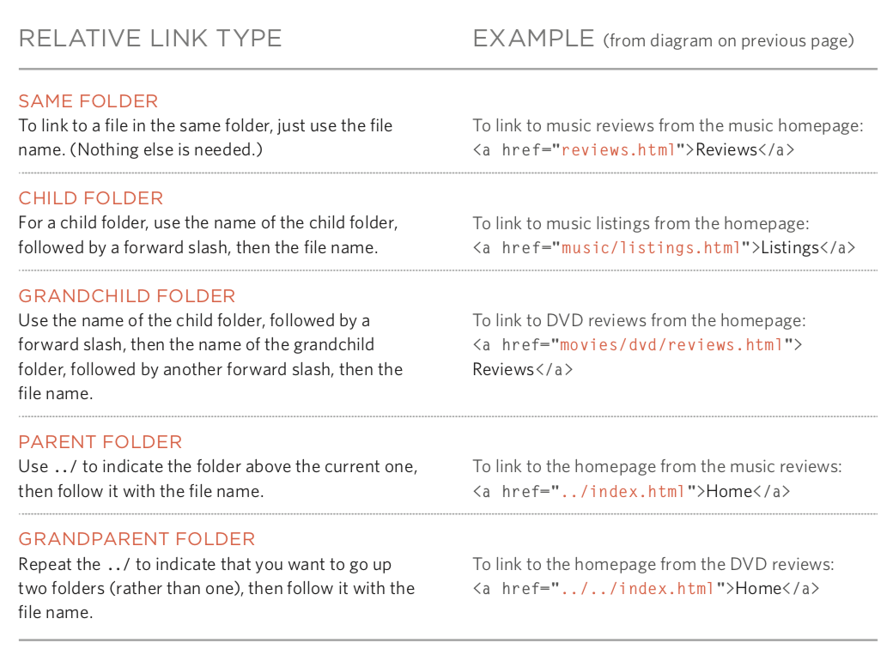

- 图像及其宽高

- 选择正确的图像格式
  - JPEG
  - GIF
  - PNG

- 矢量图

- 语义化标签 - figure / figcaption

#### 表格（table）

- 基本的表格结构 - table / tr / td / th
- 表格的标题 - caption
- 跨行和跨列 - rowspan属性 / colspan属性
- 长表格 - thead / tbody / tfoot

#### 表单（form）

- 重要属性 - action / method / enctype
- 表单控件（input）- type属性
  - 文本框 - text / 密码框 - password / 数字框 - number
  - 邮箱 - email / 电话 - tel / 日期 - date / 滑条 - range / URL - url / 搜索 - search
  - 单选按钮 - radio / 复选按钮 - checkbox
  - 文件上传 - file / 隐藏域 - hidden
  - 提交按钮 - submit / 图像按钮 - image  / 重置按钮 - reset
- 下拉列表 - select / option
- 文本域（多行文本）- textarea
- 组合表单元素 - fieldset / legend

#### 音视频（audio / video）

- 视频格式和播放器
- 视频托管服务
- 添加视频的准备工作
- video标签和属性 - autoplay / controls / loop / muted / preload / src
- audio标签和属性 - autoplay / controls / loop / muted / preload / src / width / height / poster

#### 窗口（frame）

- 框架集（过时，不建议使用） - frameset / frame

- 内嵌窗口 - iframe

#### 其他

- 文档类型

  ```HTML
  <!doctype html>
  ```

  ```HTML
  <!DOCTYPE HTML PUBLIC "-//W3C//DTD HTML 4.01//EN" "http://www.w3.org/TR/html4/strict.dtd">
  ```

  ```HTML
  <!DOCTYPE HTML PUBLIC "-//W3C//DTD HTML 4.01 Transitional//EN" "http://www.w3.org/TR/html4/loose.dtd">
  ```

- 注释

  ```HTML
  <!-- 这是一段注释，注释不能够嵌套 -->
  ```

- 属性
  - id：唯一标识
  - class：元素所属的类，用于区分不同的元素
  - title：元素的额外信息（鼠标悬浮时会显示工具提示文本）
  - tabindex：Tab键切换顺序
  - contenteditable：元素是否可编辑
  - draggable：元素是否可拖拽

- 块级元素 / 行级元素

- 字符实体（实体替换符）

  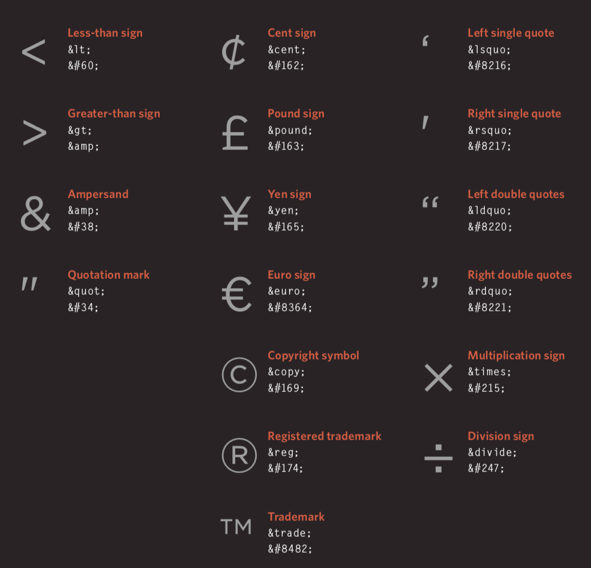

### 使用CSS渲染页面

#### 简介

- CSS的作用

- CSS的工作原理

- 规则、属性和值

  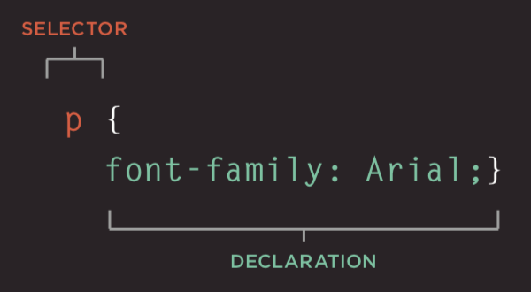

- 常用选择器

  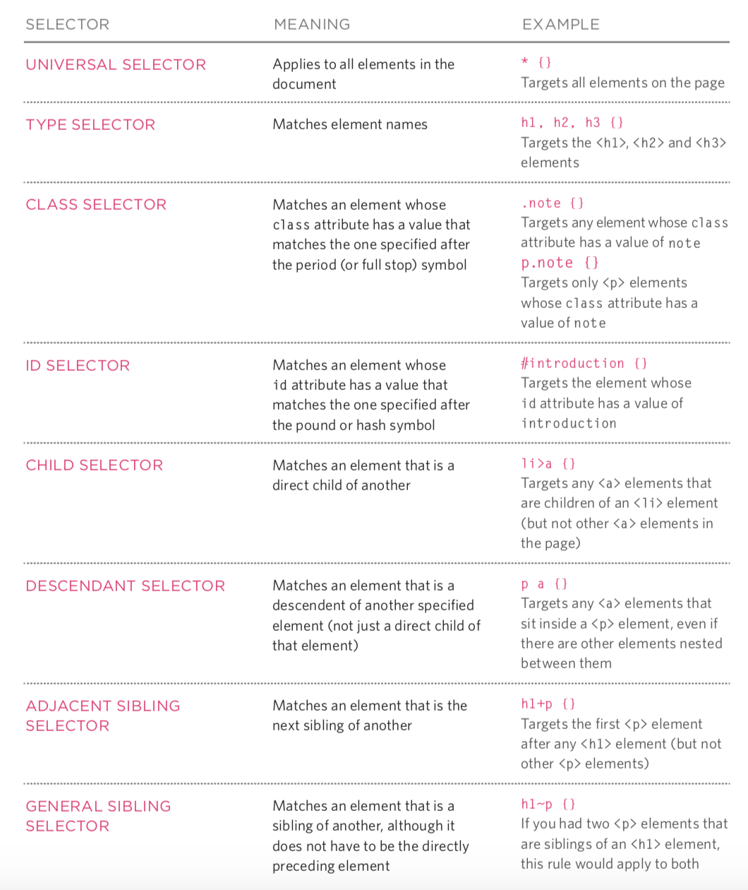

#### 颜色（color）

- 如何指定颜色
- 颜色术语和颜色对比
- 背景色

#### 文本（text / font）

- 文本的大小和字型(font-size / font-family)

  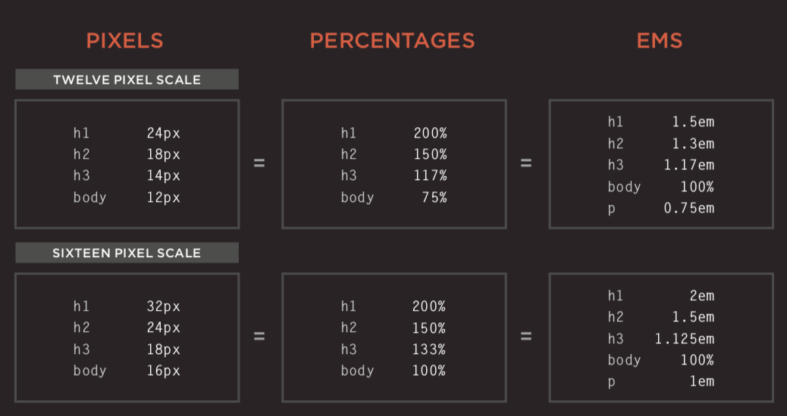

  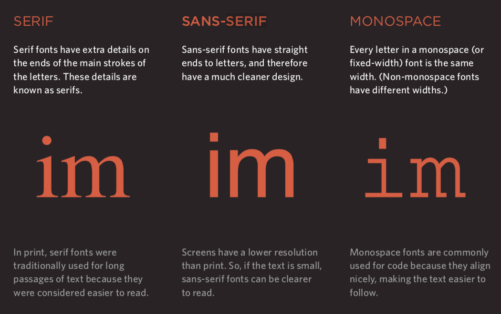

- 粗细、样式、拉伸和装饰(font-weight / font-style / font-stretch / text-decoration)

  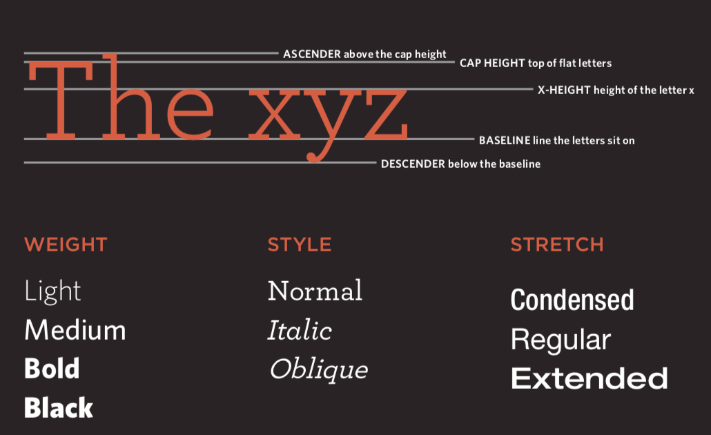

- 行间距(line-height)、字母间距(letter-spacing)和单词间距(word-spacing)

- 对齐(text-align)方式和缩进(text-ident)

- 链接样式（:link / :visited / :active / :hover）

- CSS3新属性
  - 阴影效果 - text-shadow
  - 首字母和首行文本(:first-letter / :first-line)
  - 响应用户

#### 盒子（box model）

- 盒子大小的控制（width / height）

  

- 盒子的边框、外边距和内边距（border /  margin / padding）

  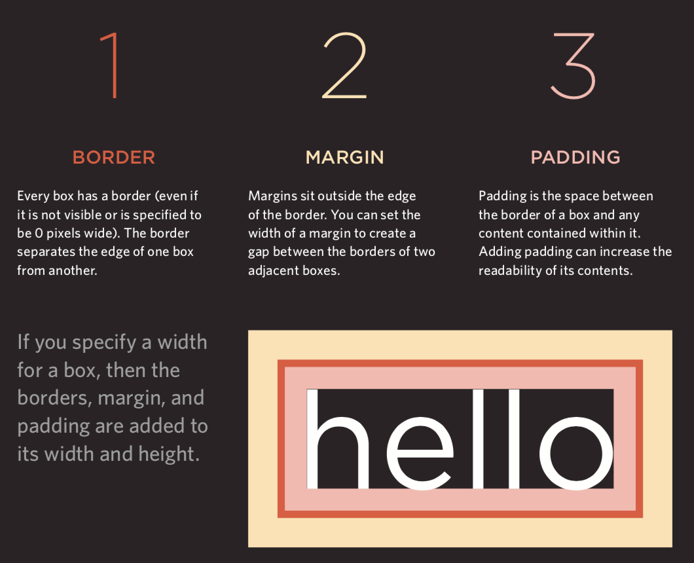

- 盒子的显示和隐藏（display / visibility）

- CSS3新属性
  - 边框图像（border-image）
  - 投影（border-shadow）
  - 圆角（border-radius）

#### 列表、表格和表单

- 列表的项目符号（list-style）
- 表格的边框和背景（border-collapse）
- 表单控件的外观
- 表单控件的对齐
- 浏览器的开发者工具

#### 图像

- 控制图像的大小（display: inline-block）
- 对齐图像
- 背景图像（background / background-image / background-repeat / background-position）

#### 布局

- 控制元素的位置（position / z-index）
  - 普通流
  - 相对定位
  - 绝对定位
  - 固定定位
  - 浮动元素（float / clear）
- 网站布局

  - HTML5布局

    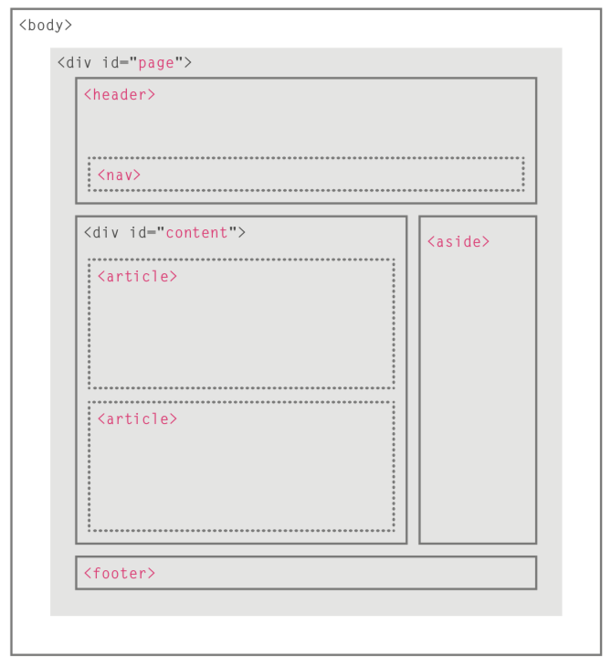
- 适配屏幕尺寸
  - 固定宽度布局
  - 流体布局
  - 布局网格

### 使用JavaScript控制行为

#### JavaScript基本语法

- 语句和注释
- 变量和数据类型
  - 声明和赋值
  - 简单数据类型和复杂数据类型
  - 变量的命名规则
- 表达式和运算符
  - 赋值运算符
  - 算术运算符
  - 比较运算符
  - 逻辑运算符
- 分支结构
  - `if...else...`
  - `switch...cas...default...`
- 循环结构
  - `for`循环
  - `while`循环
  - `do...while`循环
- 数组
  - 创建数组
  - 操作数组中的元素
- 函数
  - 声明函数
  - 调用函数
  - 参数和返回值
  - 匿名函数
  - 立即调用函数

#### 面向对象

 - 对象的概念
 - 创建对象的字面量语法
 - 访问成员运算符
 - 创建对象的构造函数语法
    - `this`关键字
 - 添加和删除属性
    - `delete`关键字
 - 标准对象
    - `Number` / `String` / `Boolean` / `Symbol` / `Array` / `Function` 
    - `Date` / `Error` / `Math` / `RegEx` / `Object` / `Map` / `Set`
    - `JSON` / `Promise` / `Generator` / `Reflect` / `Proxy`

#### BOM

 - `window`对象的属性和方法
 - `history`对象
    - `forward()` / `back()` / `go()`
 - `location`对象
 - `navigator`对象
 - `screen`对象

#### DOM

 - DOM树
 - 访问元素
    - `getElementById()` / `querySelector()`
    - `getElementsByClassName()` / `getElementsByTagName()` / `querySelectorAll()`
    - `parentNode` / `previousSibling` / `nextSibling` / `children` / `firstChild` / `lastChild`
- 操作元素
  - `nodeValue`
  - `innerHTML` / `textContent` / `createElement()` / `createTextNode()` / `appendChild()` / `insertBefore()` / `removeChild()`
  - `className` / `id` / `hasAttribute()` / `getAttribute()` / `setAttribute()` / `removeAttribute()`
- 事件处理
  - 事件类型
    - UI事件：`load` / `unload` / `error` / `resize` / `scroll`
    - 键盘事件：`keydown` / `keyup` / `keypress`
    - 鼠标事件：`click` / `dbclick` / `mousedown` / `mouseup` / `mousemove` / `mouseover` / `mouseout`
    - 焦点事件：`focus` / `blur`
    - 表单事件：`input` / `change` / `submit` / `reset` / `cut` / `copy` / `paste` / `select`
  - 事件绑定
    - HTML事件处理程序（不推荐使用，因为要做到标签与代码分离）
    - 传统的DOM事件处理程序（只能附加一个回调函数）
    - 事件监听器（旧的浏览器中不被支持）
  - 事件流：事件捕获 / 事件冒泡
  - 事件对象（低版本IE中的window.event）
    - `target`（有些浏览器使用srcElement）
    - `type`
    - `cancelable`
    - `preventDefault()`
    - `stopPropagation()`（低版本IE中的cancelBubble）
  - 鼠标事件 - 事件发生的位置
    - 屏幕位置：`screenX`和`screenY`
    - 页面位置：`pageX`和`pageY`
    - 客户端位置：`clientX`和`clientY`
  - 键盘事件 - 哪个键被按下了
    - `keyCode`属性（有些浏览器使用`which`）
    - `String.fromCharCode(event.keyCode)`
  - HTML5事件
    - `DOMContentLoaded`
    - `hashchange`
    - `beforeunload`

#### JavaScript API

- 客户端存储 - `localStorage`和`sessionStorage`

  ```JavaScript
  localStorage.colorSetting = '#a4509b';
  localStorage['colorSetting'] = '#a4509b';
  localStorage.setItem('colorSetting', '#a4509b');
  ```

- 获取位置信息 - `geolocation`

  ```JavaScript
  navigator.geolocation.getCurrentPosition(function(pos) { 		  
      console.log(pos.coords.latitude)
      console.log(pos.coords.longitude)
  })
  ```

- 从服务器获取数据 - Fetch API
- 绘制图形 - `<canvas>`的API
- 音视频 - `<audio>`和`<video>`的API

### 使用jQuery

#### jQuery概述

1. Write Less Do More（用更少的代码来完成更多的工作）
2. 使用CSS选择器来查找元素（更简单更方便）
3. 使用jQuery方法来操作元素（解决浏览器兼容性问题、应用于所有元素并施加多个方法）

#### 引入jQuery

- 下载jQuery的开发版和压缩版
- 从CDN加载jQuery

```HTML
<script src="https://cdn.bootcss.com/jquery/3.3.1/jquery.min.js"></script>
<script>
    window.jQuery || 
        document.write('<script src="js/jquery-3.3.1.min.js"></script>')
</script>
```

#### 查找元素

- 选择器
  - \* / element / #id / .class / selector1, selector2
  - ancestor descendant / parent>child / previous+next / previous~siblings 
- 筛选器
  - 基本筛选器：:not(selector) / :first / :last / :even / :odd / :eq(index) / :gt(index) / :lt(index) / :animated / :focus
  - 内容筛选器：:contains('…') / :empty / :parent / :has(selector)
  - 可见性筛选器：:hidden / :visible
  - 子节点筛选器：:nth-child(expr) / :first-child / :last-child / :only-child
  - 属性筛选器：[attribute] / [attribute='value'] / [attribute!='value'] / [attribute^='value'] / [attribute$='value'] / [attribute|='value'] / [attribute~='value']
- 表单：:input / :text / :password / :radio / :checkbox / :submit / :image / :reset / :button / :file / :selected / :enabled / :disabled / :checked

#### 执行操作

- 内容操作
  - 获取/修改内容：`html()` / `text()` / `replaceWith()` / `remove()`
  - 获取/设置元素：`before()` / `after()` / `prepend()` / `append()` / `remove()` / `clone()` / `unwrap()` / `detach()` / `empty()` / `add()`
  - 获取/修改属性：`attr()` / `removeAttr()` / `addClass()` / `removeClass()` / `css()`
  - 获取/设置表单值：`val()`
- 查找操作
  - 查找方法：`find()` /  `parent()` / `children()` / `siblings()` / `next()` / `nextAll()` / `prev()` / `prevAll()`
  - 筛选器：`filter()` / `not()` / `has()` / `is()` / `contains()`
  - 索引编号：`eq()`
- 尺寸和位置
  - 尺寸相关：`height()` / `width()` / `innerHeight()` / `innerWidth()` / `outerWidth()` / `outerHeight()`
  - 位置相关：`offset()` / `position()` / `scrollLeft()` / `scrollTop()`
- 特效和动画
  - 基本动画：`show()` / `hide()` / `toggle()`
  - 消失出现：`fadeIn()` / `fadeOut()` / `fadeTo()` / `fadeToggle()`
  - 滑动效果：`slideDown()` / `slideUp()` / `slideToggle()`
  - 自定义：`delay()` / `stop()` / `animate()`
- 事件
  - 文档加载：`ready()` / `load()`
  - 用户交互：`on()` / `off()`

#### 链式操作

#### 检测页面是否可用

```HTML
<script>
    $(document).ready(function() {
        
    });
</script>
```

```HTML
<script>
    $(function() {
        
    });
</script>
```

#### jQuery插件

- jQuery Validation
- jQuery Treeview
- jQuery Autocomplete
- jQuery UI

#### 避免和其他库的冲突

先引入其他库再引入jQuery的情况。

```HTML
<script src="other.js"></script>
<script src="jquery.js"></script>
<script>
	jQuery.noConflict();
    jQuery(function() {
        jQuery('div').hide();
    });
</script>
```

先引入jQuery再引入其他库的情况。

```HTML

<script src="jquery.js"></script>
<script src="other.js"></script>
<script>
    jQuery(function() {
        jQuery('div').hide();
    });
</script>
```

#### 使用Ajax

Ajax是一种在无需重新加载整个网页的情况下，能够更新部分网页的技术。

- 原生的Ajax
- 基于jQuery的Ajax
  - 加载内容
  - 提交表单

### 前端框架

#### 渐进式框架 - [Vue.js](<https://cn.vuejs.org/>)

前后端分离开发（前端渲染）必选框架。

##### 快速上手

1. 引入Vue的JavaScript文件，我们仍然推荐从CDN服务器加载它。

   ```HTML
   <script src="https://cdn.jsdelivr.net/npm/vue"></script>
   ```

2. 数据绑定（声明式渲染 ）。

   ```HTML
   <div id="app">
   	<h1>{{ product }}库存信息</h1>
   </div>
   
   <script src="https://cdn.jsdelivr.net/npm/vue"></script>
   <script>
   	const app = new Vue({
   		el: '#app',
   		data: {
   			product: 'iPhone X'
   		}
   	});
   </script>
   ```

3. 条件与循环。

   ```HTML
   <div id="app">
   	<h1>库存信息</h1>
       <hr>
   	<ul>
   		<li v-for="product in products">
   			{{ product.name }} - {{ product.quantity }}
   			<span v-if="product.quantity === 0">
   				已经售罄
   			</span>
   		</li>
   	</ul>
   </div>
   
   <script src="https://cdn.jsdelivr.net/npm/vue"></script>
   <script>
   	const app = new Vue({
   		el: '#app',
   		data: {
   			products: [
   				{"id": 1, "name": "iPhone X", "quantity": 20},
   				{"id": 2, "name": "华为 Mate20", "quantity": 0},
   				{"id": 3, "name": "小米 Mix3", "quantity": 50}
   			]
   		}
   	});
   </script>
   ```

4. 计算属性。

   ```HTML
   <div id="app">
   	<h1>库存信息</h1>
   	<hr>
   	<ul>
   		<li v-for="product in products">
   			{{ product.name }} - {{ product.quantity }}
   			<span v-if="product.quantity === 0">
   				已经售罄
   			</span>
   		</li>
   	</ul>
   	<h2>库存总量：{{ totalQuantity }}台</h2>
   </div>
   
   <script src="https://cdn.jsdelivr.net/npm/vue"></script>
   <script>
   	const app = new Vue({
   		el: '#app',
   		data: {
   			products: [
   				{"id": 1, "name": "iPhone X", "quantity": 20},
   				{"id": 2, "name": "华为 Mate20", "quantity": 0},
   				{"id": 3, "name": "小米 Mix3", "quantity": 50}
   			]
   		},
   		computed: {
   			totalQuantity() {
   				return this.products.reduce((sum, product) => {
   					return sum + product.quantity
   				}, 0);
   			}
   		}
   	});
   </script>
   ```

5. 处理事件。

   ```HTML
   <div id="app">
   	<h1>库存信息</h1>
   	<hr>
   	<ul>
   		<li v-for="product in products">
   			{{ product.name }} - {{ product.quantity }}
   			<span v-if="product.quantity === 0">
   				已经售罄
   			</span>
   			<button @click="product.quantity += 1">
   				增加库存
   			</button>
   		</li>
   	</ul>
   	<h2>库存总量：{{ totalQuantity }}台</h2>
   </div>
   
   <script src="https://cdn.jsdelivr.net/npm/vue"></script>
   <script>
   	const app = new Vue({
   		el: '#app',
   		data: {
   			products: [
   				{"id": 1, "name": "iPhone X", "quantity": 20},
   				{"id": 2, "name": "华为 Mate20", "quantity": 0},
   				{"id": 3, "name": "小米 Mix3", "quantity": 50}
   			]
   		},
   		computed: {
   			totalQuantity() {
   				return this.products.reduce((sum, product) => {
   					return sum + product.quantity
   				}, 0);
   			}
   		}
   	});
   </script>
   ```

6. 用户输入。

   ```HTML
   <div id="app">
   	<h1>库存信息</h1>
   	<hr>
   	<ul>
   		<li v-for="product in products">
   			{{ product.name }} - 
   			<input type="number" v-model.number="product.quantity" min="0">
   			<span v-if="product.quantity === 0">
   				已经售罄
   			</span>
   			<button @click="product.quantity += 1">
   				增加库存
   			</button>
   		</li>
   	</ul>
   	<h2>库存总量：{{ totalQuantity }}台</h2>
   </div>
   
   <script src="https://cdn.jsdelivr.net/npm/vue"></script>
   <script>
   	const app = new Vue({
   		el: '#app',
   		data: {
   			products: [
   				{"id": 1, "name": "iPhone X", "quantity": 20},
   				{"id": 2, "name": "华为 Mate20", "quantity": 0},
   				{"id": 3, "name": "小米 Mix3", "quantity": 50}
   			]
   		},
   		computed: {
   			totalQuantity() {
   				return this.products.reduce((sum, product) => {
   					return sum + product.quantity
   				}, 0);
   			}
   		}
   	});
   </script>
   ```

7. 通过网络加载JSON数据。

   ```HTML
   <div id="app">
   	<h2>库存信息</h2>
   	<ul>
   		<li v-for="product in products">
   			{{ product.name }} - {{ product.quantity }}
   			<span v-if="product.quantity === 0">
   				已经售罄
   			</span>
   		</li>
   	</ul>
   </div>
   
   <script src="https://cdn.jsdelivr.net/npm/vue"></script>
   <script>
   	const app = new Vue({
   		el: '#app',
   		data: {
   			products: []
   		}，
   		created() {
   			fetch('https://jackfrued.top/api/products')
   				.then(response => response.json())
   				.then(json => {
   					this.products = json
   				});
   		}
   	});
   </script>
   ```

##### 使用脚手架 - vue-cli

Vue为商业项目开发提供了非常便捷的脚手架工具vue-cli，通过工具可以省去手工配置开发环境、测试环境和运行环境的步骤，让开发者只需要关注要解决的问题。

1. 安装脚手架。
2. 创建项目。
3. 安装依赖包。
4. 运行项目。


#### UI框架 - [Element](<http://element-cn.eleme.io/#/zh-CN>)

基于Vue 2.0的桌面端组件库，用于构造用户界面，支持响应式布局。

1. 引入Element的CSS和JavaScript文件。

   ```HTML
   <!-- 引入样式 -->
   <link rel="stylesheet" href="https://unpkg.com/element-ui/lib/theme-chalk/index.css">
   <!-- 引入组件库 -->
   <script src="https://unpkg.com/element-ui/lib/index.js"></script>
   ```

2. 一个简单的例子。

   ```HTML
   <!DOCTYPE html>
   <html>
   	<head>
   		<meta charset="UTF-8">
   		<link rel="stylesheet" href="https://unpkg.com/element-ui/lib/theme-chalk/index.css">
   	</head>
   	<body>
   		<div id="app">
   			<el-button @click="visible = true">点我</el-button>
   			<el-dialog :visible.sync="visible" title="Hello world">
   				<p>开始使用Element吧</p>
   			</el-dialog>
               </div>
   	</body>
   	<script src="https://unpkg.com/vue/dist/vue.js"></script>
   	<script src="https://unpkg.com/element-ui/lib/index.js"></script>
   	<script>
   		new Vue({
   			el: '#app',
   			data: {
   				visible: false,
   			}
   		})
   	</script>
   </html>
   ```

3. 使用组件。

   ```HTML
   <!DOCTYPE html>
   <html>
   	<head>
   		<meta charset="UTF-8">
   		<link rel="stylesheet" href="https://unpkg.com/element-ui/lib/theme-chalk/index.css">
   	</head>
   	<body>
   		<div id="app">
   			<el-table :data="tableData" stripe style="width: 100%">
   				<el-table-column prop="date" label="日期" width="180">
   				</el-table-column>
   				<el-table-column prop="name" label="姓名" width="180">
   				</el-table-column>
   				<el-table-column prop="address" label="地址">
   				</el-table-column>
   			</el-table>
   		</div>
   	</body>
   	<script src="https://unpkg.com/vue/dist/vue.js"></script>
   	<script src="https://unpkg.com/element-ui/lib/index.js"></script>
   	<script>
   		new Vue({
   			el: '#app',
   			data: {
   				tableData:  [
   					{
   						date: '2016-05-02',
   						name: '王一霸',
   						address: '上海市普陀区金沙江路 1518 弄'
   					}, 
   					{
   						date: '2016-05-04',
   						name: '刘二狗',
   						address: '上海市普陀区金沙江路 1517 弄'
   					}, 
   					{
   						date: '2016-05-01',
   						name: '杨三萌',
   						address: '上海市普陀区金沙江路 1519 弄'
   					}, 
   					{
   						date: '2016-05-03',
   						name: '陈四吹',
   						address: '上海市普陀区金沙江路 1516 弄'
   					}
   				]
   			}
   		})
   	</script>
   </html>
   ```


#### 报表框架 - [ECharts](<https://echarts.baidu.com>)

百度出品的开源可视化库，常用于生成各种类型的报表。

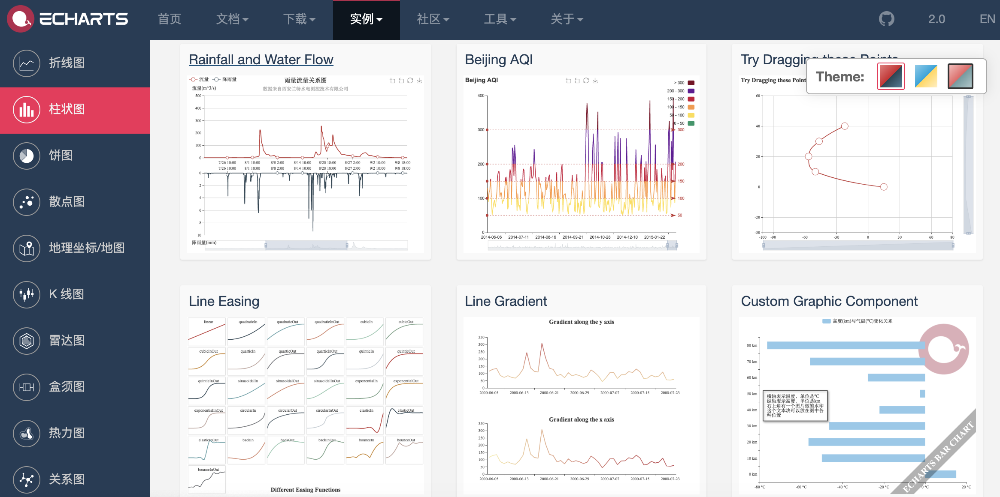

#### 基于弹性盒子的CSS框架 - [Bulma](<https://bulma.io/>)

Bulma是一个基于Flexbox的现代化的CSS框架，其初衷就是移动优先（Mobile First），模块化设计，可以轻松用来实现各种简单或者复杂的内容布局，即使不懂CSS的开发者也能够使用它定制出漂亮的页面。

```HTML
<!DOCTYPE html>
<html lang="en">
<head>
	<meta charset="UTF-8">
	<title>Bulma</title>
	<link href="https://cdn.bootcss.com/bulma/0.7.4/css/bulma.min.css" rel="stylesheet">
	<style type="text/css">
		div { margin-top: 10px; }
		.column { color: #fff; background-color: #063; margin: 10px 10px; text-align: center; }
	</style>
</head>
<body>
	<div class="columns">
		<div class="column">1</div>
		<div class="column">2</div>
		<div class="column">3</div>
		<div class="column">4</div>
	</div>
	<div>
		<a class="button is-primary">Primary</a>
		<a class="button is-link">Link</a>
		<a class="button is-info">Info</a>
		<a class="button is-success">Success</a>
		<a class="button is-warning">Warning</a>
		<a class="button is-danger">Danger</a>
	</div>
	<div>
		<progress class="progress is-danger is-medium" max="100">60%</progress>
	</div>
	<div>
		<table class="table is-hoverable">
			<tr>
				<th>One</th>
				<th>Two</th>
			</tr>
			<tr>
				<td>Three</td>
				<td>Four</td>
			</tr>
			<tr>
				<td>Five</td>
				<td>Six</td>
			</tr>
			<tr>
				<td>Seven</td>
				<td>Eight</td>
			</tr>
			<tr>
				<td>Nine</td>
				<td>Ten</td>
			</tr>
			<tr>
				<td>Eleven</td>
				<td>Twelve</td>
			</tr>
		</table>
	</div>
</body>
</html>
```

#### 响应式布局框架 - [Bootstrap](<http://www.bootcss.com/>)

用于快速开发Web应用程序的前端框架，支持响应式布局。

1. 特点
   - 支持主流的浏览器和移动设备
   - 容易上手
   - 响应式设计

2. 内容
   - 网格系统
   - 封装的CSS
   - 现成的组件
   - JavaScript插件

3. 可视化

   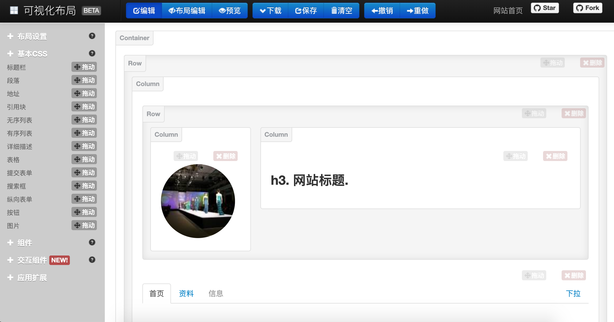