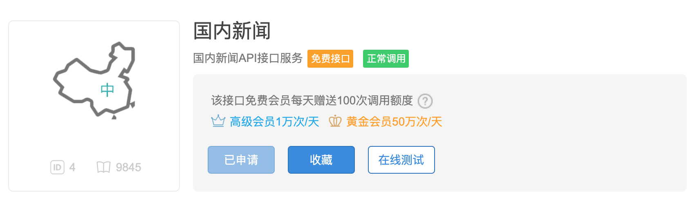

## 对象的序列化和反序列化

###JSON概述

通过上面的讲解，我们已经知道如何将文本数据和二进制数据保存到文件中，那么这里还有一个问题，如果希望把一个列表或者一个字典中的数据保存到文件中又该怎么做呢？在Python中，我们可以将程序中的数据以JSON格式进行保存。JSON是“JavaScript Object Notation”的缩写，它本来是JavaScript语言中创建对象的一种字面量语法，现在已经被广泛的应用于跨语言跨平台的数据交换。使用JSON的原因非常简单，因为它结构紧凑而且是纯文本，任何操作系统和编程语言都能处理纯文本，这就是**实现跨语言跨平台数据交换**的前提条件。目前JSON基本上已经取代了XML（可扩展标记语言）作为**异构系统间交换数据的事实标准**。可以在[JSON的官方网站](https://www.json.org/json-zh.html)找到更多关于JSON的知识，这个网站还提供了每种语言处理JSON数据格式可以使用的工具或三方库。

```JavaScript
{
    name: "骆昊",
    age: 40,
    friends: ["王大锤", "白元芳"],
    cars: [
        {"brand": "BMW", "max_speed": 240},
        {"brand": "Benz", "max_speed": 280},
        {"brand": "Audi", "max_speed": 280}
    ]
}
```

上面是JSON的一个简单例子，大家可能已经注意到了，它跟Python中的字典非常类似而且支持嵌套结构，就好比Python字典中的值可以是另一个字典。我们可以尝试把下面的代码输入浏览器的控制台（对于Chrome浏览器，可以通过“更多工具”菜单找到“开发者工具”子菜单，就可以打开浏览器的控制台），浏览器的控制台提供了一个运行JavaScript代码的交互式环境（类似于Python的交互式环境），下面的代码会帮我们创建出一个JavaScript的对象，我们将其赋值给名为`obj`的变量。

```JavaScript
let obj = {
    name: "骆昊",
    age: 40,
    friends: ["王大锤", "白元芳"],
    cars: [
        {"brand": "BMW", "max_speed": 240},
        {"brand": "Benz", "max_speed": 280},
        {"brand": "Audi", "max_speed": 280}
    ]
}
```


上面的`obj`就是JavaScript中的一个对象，我们可以通过`obj.name`或`obj["name"]`两种方式获取到`name`对应的值，如下图所示。可以注意到，`obj["name"]`这种获取数据的方式跟Python字典通过键获取值的索引操作是完全一致的，而Python中也通过名为`json`的模块提供了字典与JSON双向转换的支持。


我们在JSON中使用的数据类型（JavaScript数据类型）和Python中的数据类型也是很容易找到对应关系的，大家可以看看下面的两张表。

表1：JavaScript数据类型（值）对应的Python数据类型（值）

| JSON         | Python       |
| ------------ | ------------ |
| `object`      |`dict`|
| `array`      |`list`|
| `string`     | `str`        |
| `number ` |`int` / `float`|
| `number` (real)   |`float`|
| `boolean` (`true` / `false`) | `bool` (`True` / `False`) |
| `null`       | `None`       |

表2：Python数据类型（值）对应的JavaScript数据类型（值）

| Python                      | JSON                         |
| --------------------------- | ---------------------------- |
| `dict`                      | `object`                     |
| `list` / `tuple`            | `array`                      |
| `str`                       | `string`                     |
| `int` / `float`             | `number`                     |
| `bool` （`True` / `False`） | `boolean` (`true` / `false`) |
| `None`                      | `null`                       |

### 读写JSON格式的数据

在Python中，如果要将字典处理成JSON格式（以字符串形式存在），可以使用`json`模块的`dumps`函数，代码如下所示。

```Python
import json

my_dict = {
    'name': '骆昊',
    'age': 40,
    'friends': ['王大锤', '白元芳'],
    'cars': [
        {'brand': 'BMW', 'max_speed': 240},
        {'brand': 'Audi', 'max_speed': 280},
        {'brand': 'Benz', 'max_speed': 280}
    ]
}
print(json.dumps(my_dict))
```

运行上面的代码，输出如下所示，可以注意到中文字符都是用Unicode编码显示的。

```JSON
{"name": "\u9a86\u660a", "age": 40, "friends": ["\u738b\u5927\u9524", "\u767d\u5143\u82b3"], "cars": [{"brand": "BMW", "max_speed": 240}, {"brand": "Audi", "max_speed": 280}, {"brand": "Benz", "max_speed": 280}]}
```

如果要将字典处理成JSON格式并写入文本文件，只需要将`dumps`函数换成`dump`函数并传入文件对象即可，代码如下所示。

```Python
import json

my_dict = {
    'name': '骆昊',
    'age': 40,
    'friends': ['王大锤', '白元芳'],
    'cars': [
        {'brand': 'BMW', 'max_speed': 240},
        {'brand': 'Audi', 'max_speed': 280},
        {'brand': 'Benz', 'max_speed': 280}
    ]
}
with open('data.json', 'w') as file:
    json.dump(my_dict, file)
```

执行上面的代码，会创建`data.json`文件，文件的内容跟上面代码的输出是一样的。

`json`模块有四个比较重要的函数，分别是：

- `dump` - 将Python对象按照JSON格式序列化到文件中
- `dumps` - 将Python对象处理成JSON格式的字符串
- `load` - 将文件中的JSON数据反序列化成对象
- `loads` - 将字符串的内容反序列化成Python对象

这里出现了两个概念，一个叫序列化，一个叫反序列化，[维基百科](https://zh.wikipedia.org/)上的解释是：“序列化（serialization）在计算机科学的数据处理中，是指将数据结构或对象状态转换为可以存储或传输的形式，这样在需要的时候能够恢复到原先的状态，而且通过序列化的数据重新获取字节时，可以利用这些字节来产生原始对象的副本（拷贝）。与这个过程相反的动作，即从一系列字节中提取数据结构的操作，就是反序列化（deserialization）”。

我们可以通过下面的代码，读取上面创建的`data.json`文件，将JSON格式的数据还原成Python中的字典。

```Python
import json

with open('data.json', 'r') as file:
    my_dict = json.load(file)
    print(type(my_dict))
    print(my_dict)
```

### 包管理工具pip

Python标准库中的`json`模块在数据序列化和反序列化时性能并不是非常理想，为了解决这个问题，可以使用三方库`ujson`来替换`json`。所谓三方库，是指非公司内部开发和使用的，也不是来自于官方标准库的Python模块，这些模块通常由其他公司、组织或个人开发，所以被称为三方库。虽然Python语言的标准库虽然已经提供了诸多模块来方便我们的开发，但是对于一个强大的语言来说，它的生态圈一定也是非常繁荣的。

之前安装Python解释器时，默认情况下已经勾选了安装pip，大家可以在命令提示符或终端中通过`pip --version`来确定是否已经拥有了pip。pip是Python的包管理工具，通过pip可以查找、安装、卸载、更新Python的三方库或工具，macOS和Linux系统应该使用pip3。例如要安装替代`json`模块的`ujson`，可以使用下面的命令。

```Bash
pip install ujson
```

在默认情况下，pip会访问`https://pypi.org/simple/`来获得三方库相关的数据，但是国内访问这个网站的速度并不是十分理想，因此国内用户可以使用豆瓣网提供的镜像来替代这个默认的下载源，操作如下所示。

```Bash
pip install ujson
```

可以通过`pip search`命令根据名字查找需要的三方库，可以通过`pip list`命令来查看已经安装过的三方库。如果想更新某个三方库，可以使用`pip install -U`或`pip install --upgrade`；如果要删除某个三方库，可以使用`pip uninstall`命令。

搜索`ujson`三方库。

```Bash
pip search ujson

micropython-cpython-ujson (0.2)  - MicroPython module ujson ported to CPython
pycopy-cpython-ujson (0.2)       - Pycopy module ujson ported to CPython
ujson (3.0.0)                    - Ultra fast JSON encoder and decoder for Python
ujson-bedframe (1.33.0)          - Ultra fast JSON encoder and decoder for Python
ujson-segfault (2.1.57)          - Ultra fast JSON encoder and decoder for Python. Continuing 
                                   development.
ujson-ia (2.1.1)                 - Ultra fast JSON encoder and decoder for Python (Internet 
                                   Archive fork)
ujson-x (1.37)                   - Ultra fast JSON encoder and decoder for Python
ujson-x-legacy (1.35.1)          - Ultra fast JSON encoder and decoder for Python
drf_ujson (1.2)                  - Django Rest Framework UJSON Renderer
drf-ujson2 (1.6.1)               - Django Rest Framework UJSON Renderer
ujsonDB (0.1.0)                  - A lightweight and simple database using ujson.
fast-json (0.3.2)                - Combines best parts of json and ujson for fast serialization
decimal-monkeypatch (0.4.3)      - Python 2 performance patches: decimal to cdecimal, json to 
                                   ujson for psycopg2
```

查看已经安装的三方库。

```Bash
pip list

Package                       Version
----------------------------- ----------
aiohttp                       3.5.4
alipay                        0.7.4
altgraph                      0.16.1
amqp                          2.4.2
...							  ...
```

更新`ujson`三方库。

```Bash
pip install -U ujson
```

删除`ujson`三方库。

```Bash
pip uninstall -y ujson
```

> **提示**：如果要更新`pip`自身，对于macOS系统来说，可以使用命令`pip install -U pip`。在Windows系统上，可以将命令替换为`python -m pip install -U --user pip`。

### 使用网络API获取数据

如果想在我们自己的程序中显示天气、路况、航班等信息，这些信息我们自己没有能力提供，所以必须使用网络数据服务。目前绝大多数的网络数据服务（或称之为网络API）都是基于[HTTP](https://zh.wikipedia.org/wiki/%E8%B6%85%E6%96%87%E6%9C%AC%E4%BC%A0%E8%BE%93%E5%8D%8F%E8%AE%AE)或HTTPS提供JSON格式的数据，我们可以通过Python程序发送HTTP请求给指定的URL（统一资源定位符），这个URL就是所谓的网络API，如果请求成功，它会返回HTTP响应，而HTTP响应的消息体中就有我们需要的JSON格式的数据。关于HTTP的相关知识，可以看看阮一峰的[《HTTP协议入门》](http://www.ruanyifeng.com/blog/2016/08/http.html)一文。

国内有很多提供网络API接口的网站，例如[聚合数据](https://www.juhe.cn/)、[阿凡达数据](http://www.avatardata.cn/)等，这些网站上有免费的和付费的数据接口，国外的[{API}Search](http://apis.io/)网站也提供了类似的功能，有兴趣的可以自行研究。下面的例子演示了如何使用[`requests`](http://docs.python-requests.org/zh_CN/latest/)库（基于HTTP进行网络资源访问的三方库）访问网络API获取国内新闻并显示新闻标题和链接。在这个例子中，我们使用了名为[天行数据](https://www.tianapi.com/)的网站提供的国内新闻数据接口，其中的APIKey需要自己到网站上注册申请。在天行数据网站注册账号后会自动分配APIKey，但是要访问接口获取数据，需要绑定验证邮箱或手机，然后还要申请需要使用的接口，如下图所示。



Python通过URL接入网络，我们推荐大家使用`requests`三方库，它简单且强大，但需要自行安装。

```Bash
pip install requests
```

获取国内新闻并显示新闻标题和链接。

```Python
import requests

resp = requests.get('http://api.tianapi.com/guonei/?key=APIKey&num=10')
if resp.status_code == 200:
    data_model = resp.json()
    for news in data_model['newslist']:
        print(news['title'])
        print(news['url'])
        print('-' * 60)
```

上面的代码通过`requests`模块的`get`函数向天行数据的国内新闻接口发起了一次请求，如果请求过程没有出现问题，`get`函数会返回一个`Response`对象，通过该对象的`status_code`属性表示HTTP响应状态码，如果不理解没关系，你只需要关注它的值，如果值等于`200`或者其他`2`字头的值，那么我们的请求是成功的。通过`Response`对象的`json()`方法可以将返回的JSON格式的数据直接处理成Python字典，非常方便。天行数据国内新闻接口返回的JSON格式的数据（部分）如下图所示。


> **提示**：上面代码中的APIKey需要换成自己在天行数据网站申请的APIKey。天行数据网站上还有提供了很多非常有意思的API接口，例如：垃圾分类、周公解梦等，大家可以仿照上面的代码来调用这些接口。每个接口都有对应的接口文档，文档中有关于如何使用接口的详细说明。

###  总结

Python中实现序列化和反序列化除了使用`json`模块之外，还可以使用`pickle`和`shelve`模块，但是这两个模块是使用特有的序列化协议来序列化数据，因此序列化后的数据只能被Python识别，关于这两个模块的相关知识，有兴趣的读者可以自己查找网络上的资料。处理JSON格式的数据很显然是程序员必须掌握的一项技能，因为不管是访问网络API接口还是提供网络API接口给他人使用，都需要具备处理JSON格式数据的相关知识。

