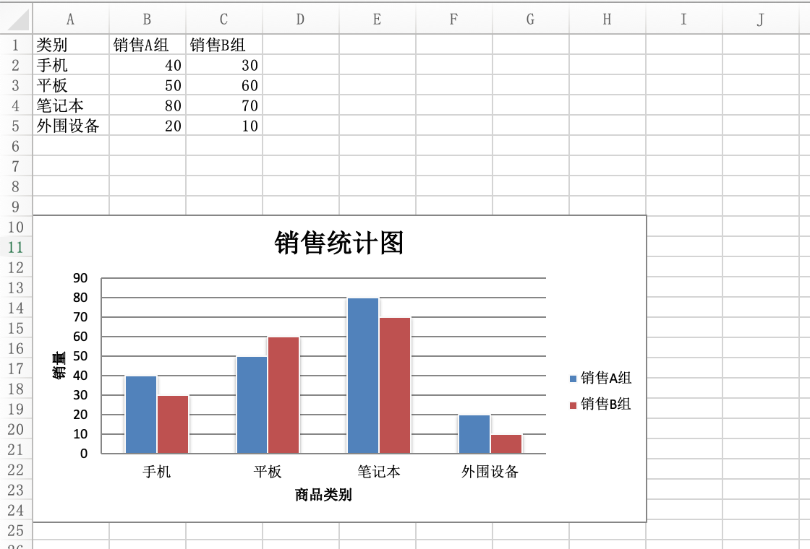

## Python读写Excel文件-2

### Excel简介

Excel是Microsoft（微软）为使用Windows和macOS操作系统开发的一款电子表格软件。Excel凭借其直观的界面、出色的计算功能和图表工具，再加上成功的市场营销，一直以来都是最为流行的个人计算机数据处理软件。当然，Excel也有很多竞品，例如Google Sheets、LibreOffice Calc、Numbers等，这些竞品基本上也能够兼容Excel，至少能够读写较新版本的Excel文件，当然这些不是我们讨论的重点。掌握用Python程序操作Excel文件，可以让日常办公自动化的工作更加轻松愉快，而且在很多商业项目中，导入导出Excel文件都是特别常见的功能。

本章我们继续讲解基于另一个三方库`openpyxl`如何进行Excel文件操作，首先需要先安装它。

```Bash
pip install openpyxl
```

`openpyxl`的优点在于，当我们打开一个Excel文件后，既可以对它进行读操作，又可以对它进行写操作，而且在操作的便捷性上是优于`xlwt`和`xlrd`的。此外，如果要进行样式编辑和公式计算，使用`openpyxl`也远比上一个章节我们讲解的方式更为简单，而且`openpyxl`还支持数据透视和插入图表等操作，功能非常强大。有一点需要再次强调，`openpyxl`并不支持操作Office 2007以前版本的Excel文件。

### 读取Excel文件

例如在当前文件夹下有一个名为“阿里巴巴2020年股票数据.xlsx”的Excel文件，如果想读取并显示该文件的内容，可以通过如下所示的代码来完成。

```Python
import datetime

import openpyxl

# 加载一个工作簿 ---> Workbook
wb = openpyxl.load_workbook('阿里巴巴2020年股票数据.xlsx')
# 获取工作表的名字
print(wb.sheetnames)
# 获取工作表 ---> Worksheet
sheet = wb.worksheets[0]
# 获得单元格的范围
print(sheet.dimensions)
# 获得行数和列数
print(sheet.max_row, sheet.max_column)

# 获取指定单元格的值
print(sheet.cell(3, 3).value)
print(sheet['C3'].value)
print(sheet['G255'].value)

# 获取多个单元格（嵌套元组）
print(sheet['A2:C5'])

# 读取所有单元格的数据
for row_ch in range(2, sheet.max_row + 1):
    for col_ch in 'ABCDEFG':
        value = sheet[f'{col_ch}{row_ch}'].value
        if type(value) == datetime.datetime:
            print(value.strftime('%Y年%m月%d日'), end='\t')
        elif type(value) == int:
            print(f'{value:<10d}', end='\t')
        elif type(value) == float:
            print(f'{value:.4f}', end='\t')
        else:
            print(value, end='\t')
    print()
```

> **提示**：上面代码中使用的Excel文件“阿里巴巴2020年股票数据.xlsx”可以通过后面的百度云盘地址进行获取。链接:https://pan.baidu.com/s/1rQujl5RQn9R7PadB2Z5g_g 提取码:e7b4。

需要提醒大家一点，`openpyxl`获取指定的单元格有两种方式，一种是通过`cell`方法，需要注意，该方法的行索引和列索引都是从`1`开始的，这是为了照顾用惯了Excel的人的习惯；另一种是通过索引运算，通过指定单元格的坐标，例如`C3`、`G255`，也可以取得对应的单元格，再通过单元格对象的`value`属性，就可以获取到单元格的值。通过上面的代码，相信大家还注意到了，可以通过类似`sheet['A2:C5']`或`sheet['A2':'C5']`这样的切片操作获取多个单元格，该操作将返回嵌套的元组，相当于获取到了多行多列。

### 写Excel文件

下面我们使用`openpyxl`来进行写Excel操作。

```Python
import random

import openpyxl

# 第一步：创建工作簿（Workbook）
wb = openpyxl.Workbook()

# 第二步：添加工作表（Worksheet）
sheet = wb.active
sheet.title = '期末成绩'

titles = ('姓名', '语文', '数学', '英语')
for col_index, title in enumerate(titles):
    sheet.cell(1, col_index + 1, title)

names = ('关羽', '张飞', '赵云', '马超', '黄忠')
for row_index, name in enumerate(names):
    sheet.cell(row_index + 2, 1, name)
    for col_index in range(2, 5):
        sheet.cell(row_index + 2, col_index, random.randrange(50, 101))

# 第四步：保存工作簿
wb.save('考试成绩表.xlsx')
```

### 调整样式和公式计算

在使用`openpyxl`操作Excel时，如果要调整单元格的样式，可以直接通过单元格对象（`Cell`对象）的属性进行操作。单元格对象的属性包括字体（`font`）、对齐（`alignment`）、边框（`border`）等，具体的可以参考`openpyxl`的[官方文档](https://openpyxl.readthedocs.io/en/stable/index.html)。在使用`openpyxl`时，如果需要做公式计算，可以完全按照Excel中的操作方式来进行，具体的代码如下所示。

```Python
import openpyxl
from openpyxl.styles import Font, Alignment, Border, Side

# 对齐方式
alignment = Alignment(horizontal='center', vertical='center')
# 边框线条
side = Side(color='ff7f50', style='mediumDashed')

wb = openpyxl.load_workbook('考试成绩表.xlsx')
sheet = wb.worksheets[0]

# 调整行高和列宽
sheet.row_dimensions[1].height = 30
sheet.column_dimensions['E'].width = 120

sheet['E1'] = '平均分'
# 设置字体
sheet.cell(1, 5).font = Font(size=18, bold=True, color='ff1493', name='华文楷体')
# 设置对齐方式
sheet.cell(1, 5).alignment = alignment
# 设置单元格边框
sheet.cell(1, 5).border = Border(left=side, top=side, right=side, bottom=side)
for i in range(2, 7):
    # 公式计算每个学生的平均分
    sheet[f'E{i}'] = f'=average(B{i}:D{i})'
    sheet.cell(i, 5).font = Font(size=12, color='4169e1', italic=True)
    sheet.cell(i, 5).alignment = alignment

wb.save('考试成绩表.xlsx')
```

### 生成统计图表

通过`openpyxl`库，可以直接向Excel中插入统计图表，具体的做法跟在Excel中插入图表大体一致。我们可以创建指定类型的图表对象，然后通过该对象的属性对图表进行设置。当然，最为重要的是为图表绑定数据，即横轴代表什么，纵轴代表什么，具体的数值是多少。最后，可以将图表对象添加到表单中，具体的代码如下所示。

```Python
from openpyxl import Workbook
from openpyxl.chart import BarChart, Reference

wb = Workbook(write_only=True)
sheet = wb.create_sheet()

rows = [
    ('类别', '销售A组', '销售B组'),
    ('手机', 40, 30),
    ('平板', 50, 60),
    ('笔记本', 80, 70),
    ('外围设备', 20, 10),
]

# 向表单中添加行
for row in rows:
    sheet.append(row)

# 创建图表对象
chart = BarChart()
chart.type = 'col'
chart.style = 10
# 设置图表的标题
chart.title = '销售统计图'
# 设置图表纵轴的标题
chart.y_axis.title = '销量'
# 设置图表横轴的标题
chart.x_axis.title = '商品类别'
# 设置数据的范围
data = Reference(sheet, min_col=2, min_row=1, max_row=5, max_col=3)
# 设置分类的范围
cats = Reference(sheet, min_col=1, min_row=2, max_row=5)
# 给图表添加数据
chart.add_data(data, titles_from_data=True)
# 给图表设置分类
chart.set_categories(cats)
chart.shape = 4
# 将图表添加到表单指定的单元格中
sheet.add_chart(chart, 'A10')

wb.save('demo.xlsx')
```

运行上面的代码，打开生成的Excel文件，效果如下图所示。



###  总结

掌握了Python程序操作Excel的方法，可以解决日常办公中很多繁琐的处理Excel电子表格工作，最常见就是将多个数据格式相同的Excel文件合并到一个文件以及从多个Excel文件或表单中提取指定的数据。如果数据体量较大或者处理数据的方式比较复杂，我们还是推荐大家使用Python数据分析神器之一的`pandas`库。
