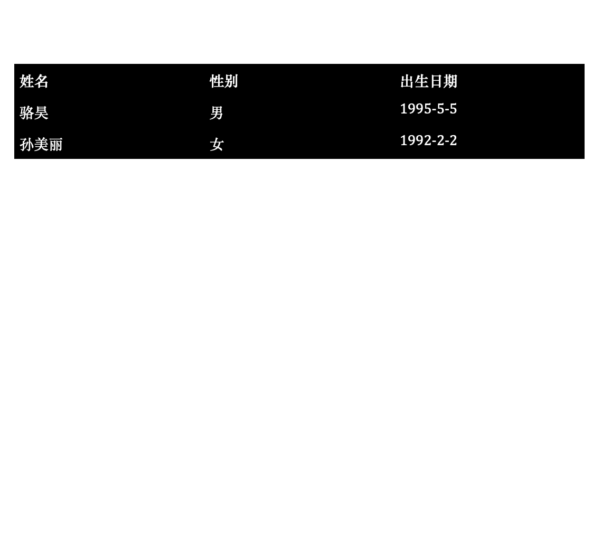
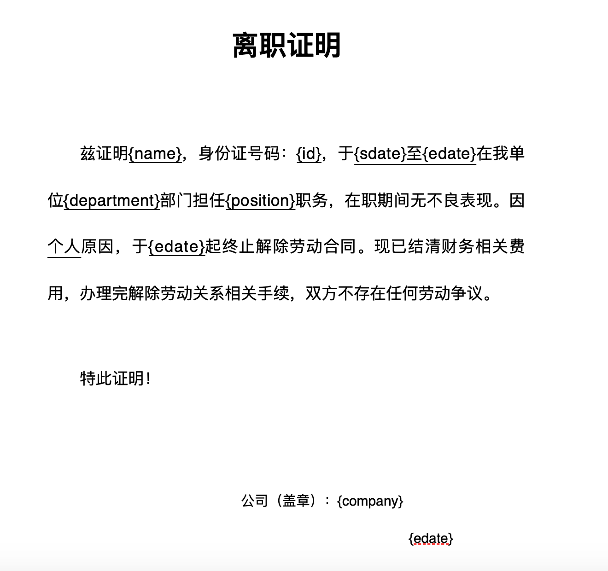
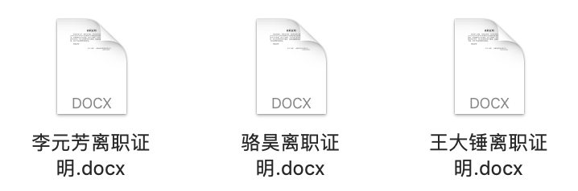
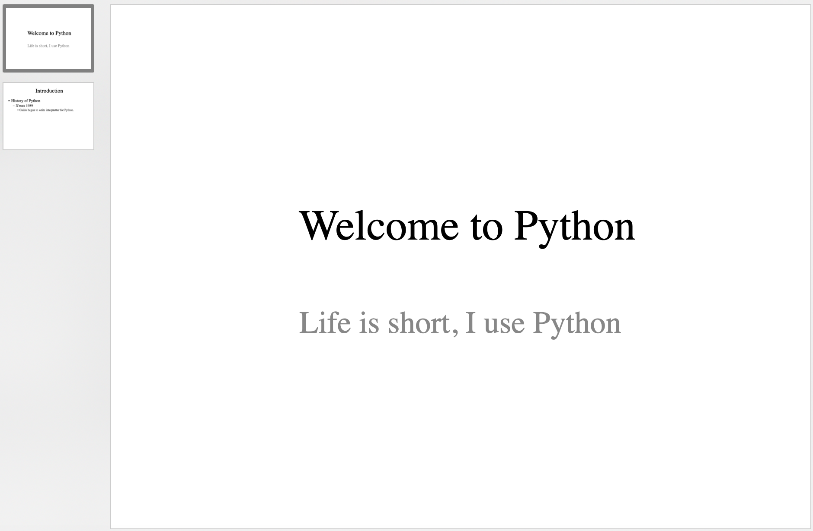

## Python操作Word和PowerPoint文件

在日常工作中，有很多简单重复的劳动其实完全可以交给Python程序，比如根据样板文件（模板文件）批量的生成很多个Word文件或PowerPoint文件。Word是微软公司开发的文字处理程序，相信大家都不陌生，日常办公中很多正式的文档都是用Word进行撰写和编辑的，目前使用的Word文件后缀名一般为`.docx`。PowerPoint是微软公司开发的演示文稿程序，是微软的Office系列软件中的一员，被商业人士、教师、学生等群体广泛使用，通常也将其称之为“幻灯片”。在Python中，可以使用名为`python-docx` 的三方库来操作Word，可以使用名为`python-pptx`的三方库来生成PowerPoint。

### 操作Word文档

我们可以先通过下面的命令来安装`python-docx`三方库。

```bash
pip install python-docx
```

按照[官方文档](https://python-docx.readthedocs.io/en/latest/)的介绍，我们可以使用如下所示的代码来生成一个简单的Word文档。

```Python
from docx import Document
from docx.shared import Cm, Pt

from docx.document import Document as Doc

# 创建代表Word文档的Doc对象
document = Document()  # type: Doc
# 添加大标题
document.add_heading('快快乐乐学Python', 0)
# 添加段落
p = document.add_paragraph('Python是一门非常流行的编程语言，它')
run = p.add_run('简单')
run.bold = True
run.font.size = Pt(18)
p.add_run('而且')
run = p.add_run('优雅')
run.font.size = Pt(18)
run.underline = True
p.add_run('。')

# 添加一级标题
document.add_heading('Heading, level 1', level=1)
# 添加带样式的段落
document.add_paragraph('Intense quote', style='Intense Quote')
# 添加无序列表
document.add_paragraph(
    'first item in unordered list', style='List Bullet'
)
document.add_paragraph(
    'second item in ordered list', style='List Bullet'
)
# 添加有序列表
document.add_paragraph(
    'first item in ordered list', style='List Number'
)
document.add_paragraph(
    'second item in ordered list', style='List Number'
)

# 添加图片（注意路径和图片必须要存在）
document.add_picture('resources/guido.jpg', width=Cm(5.2))

# 添加分节符
document.add_section()

records = (
    ('骆昊', '男', '1995-5-5'),
    ('孙美丽', '女', '1992-2-2')
)
# 添加表格
table = document.add_table(rows=1, cols=3)
table.style = 'Dark List'
hdr_cells = table.rows[0].cells
hdr_cells[0].text = '姓名'
hdr_cells[1].text = '性别'
hdr_cells[2].text = '出生日期'
# 为表格添加行
for name, sex, birthday in records:
    row_cells = table.add_row().cells
    row_cells[0].text = name
    row_cells[1].text = sex
    row_cells[2].text = birthday

# 添加分页符
document.add_page_break()

# 保存文档
document.save('demo.docx')
```

> **提示**：上面代码第7行中的注释`# type: Doc`是为了在PyCharm中获得代码补全提示，因为如果不清楚对象具体的数据类型，PyCharm无法在后续代码中给出`Doc`对象的代码补全提示。

执行上面的代码，打开生成的Word文档，效果如下图所示。

&nbsp;&nbsp;

对于一个已经存在的Word文件，我们可以通过下面的代码去遍历它所有的段落并获取对应的内容。

```Python
from docx import Document
from docx.document import Document as Doc

doc = Document('resources/离职证明.docx')  # type: Doc
for no, p in enumerate(doc.paragraphs):
    print(no, p.text)
```

> **提示**：如果需要上面代码中的Word文件，可以通过下面的百度云盘地址进行获取。链接:https://pan.baidu.com/s/1rQujl5RQn9R7PadB2Z5g_g 提取码:e7b4。

读取到的内容如下所示。

```
0 
1 离 职 证 明
2 
3 兹证明 王大锤 ，身份证号码： 100200199512120001 ，于 2018 年 8 月 7 日至 2020 年 6 月 28 日在我单位  开发部 部门担任 Java开发工程师 职务，在职期间无不良表现。因 个人 原因，于 2020 年 6 月 28 日起终止解除劳动合同。现已结清财务相关费用，办理完解除劳动关系相关手续，双方不存在任何劳动争议。
4 
5 特此证明！
6 
7 
8 公司名称（盖章）:成都风车车科技有限公司
9    			2020 年 6 月 28 日
```

讲到这里，相信很多读者已经想到了，我们可以把上面的离职证明制作成一个模板文件，把姓名、身份证号、入职和离职日期等信息用占位符代替，这样通过对占位符的替换，就可以根据实际需要写入对应的信息，这样就可以批量的生成Word文档。

按照上面的思路，我们首先编辑一个离职证明的模板文件，如下图所示。



接下来我们读取该文件，将占位符替换为真实信息，就可以生成一个新的Word文档，如下所示。

```Python
from docx import Document
from docx.document import Document as Doc

# 将真实信息用字典的方式保存在列表中
employees = [
    {
        'name': '骆昊',
        'id': '100200198011280001',
        'sdate': '2008年3月1日',
        'edate': '2012年2月29日',
        'department': '产品研发',
        'position': '架构师',
        'company': '成都华为技术有限公司'
    },
    {
        'name': '王大锤',
        'id': '510210199012125566',
        'sdate': '2019年1月1日',
        'edate': '2021年4月30日',
        'department': '产品研发',
        'position': 'Python开发工程师',
        'company': '成都谷道科技有限公司'
    },
    {
        'name': '李元芳',
        'id': '2102101995103221599',
        'sdate': '2020年5月10日',
        'edate': '2021年3月5日',
        'department': '产品研发',
        'position': 'Java开发工程师',
        'company': '同城企业管理集团有限公司'
    },
]
# 对列表进行循环遍历，批量生成Word文档 
for emp_dict in employees:
    # 读取离职证明模板文件
    doc = Document('resources/离职证明模板.docx')  # type: Doc
    # 循环遍历所有段落寻找占位符
    for p in doc.paragraphs:
        if '{' not in p.text:
            continue
        # 不能直接修改段落内容，否则会丢失样式
        # 所以需要对段落中的元素进行遍历并进行查找替换
        for run in p.runs:
            if '{' not in run.text:
                continue
            # 将占位符换成实际内容
            start, end = run.text.find('{'), run.text.find('}')
            key, place_holder = run.text[start + 1:end], run.text[start:end + 1]
            run.text = run.text.replace(place_holder, emp_dict[key])
    # 每个人对应保存一个Word文档
    doc.save(f'{emp_dict["name"]}离职证明.docx')
```

执行上面的代码，会在当前路径下生成三个Word文档，如下图所示。



### 生成PowerPoint

首先我们需要安装名为`python-pptx`的三方库，命令如下所示。

```Bash
pip install python-pptx
```

用Python操作PowerPoint的内容，因为实际应用场景不算很多，我不打算在这里进行赘述，有兴趣的读者可以自行阅读`python-pptx`的[官方文档](https://python-pptx.readthedocs.io/en/latest/)，下面仅展示一段来自于官方文档的代码。

```Python
from pptx import Presentation

# 创建幻灯片对象
pres = Presentation()

# 选择母版添加一页
title_slide_layout = pres.slide_layouts[0]
slide = pres.slides.add_slide(title_slide_layout)
# 获取标题栏和副标题栏
title = slide.shapes.title
subtitle = slide.placeholders[1]
# 编辑标题和副标题
title.text = "Welcome to Python"
subtitle.text = "Life is short, I use Python"

# 选择母版添加一页
bullet_slide_layout = pres.slide_layouts[1]
slide = pres.slides.add_slide(bullet_slide_layout)
# 获取页面上所有形状
shapes = slide.shapes
# 获取标题和主体
title_shape = shapes.title
body_shape = shapes.placeholders[1]
# 编辑标题
title_shape.text = 'Introduction'
# 编辑主体内容
tf = body_shape.text_frame
tf.text = 'History of Python'
# 添加一个一级段落
p = tf.add_paragraph()
p.text = 'X\'max 1989'
p.level = 1
# 添加一个二级段落
p = tf.add_paragraph()
p.text = 'Guido began to write interpreter for Python.'
p.level = 2

# 保存幻灯片
pres.save('test.pptx')
```

运行上面的代码，生成的PowerPoint文件如下图所示。



### 总结

用Python程序解决办公自动化的问题真的非常酷，它可以将我们从繁琐乏味的劳动中解放出来。写这类代码就是去做一件一劳永逸的事情，写代码的过程即便不怎么愉快，使用这些代码的时候应该是非常开心的。
