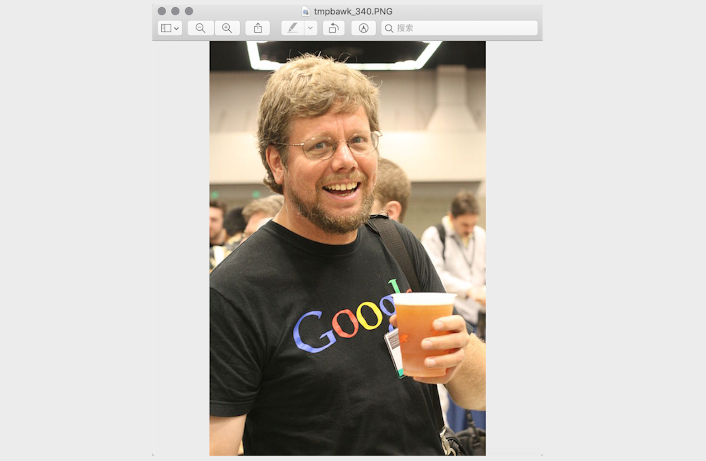
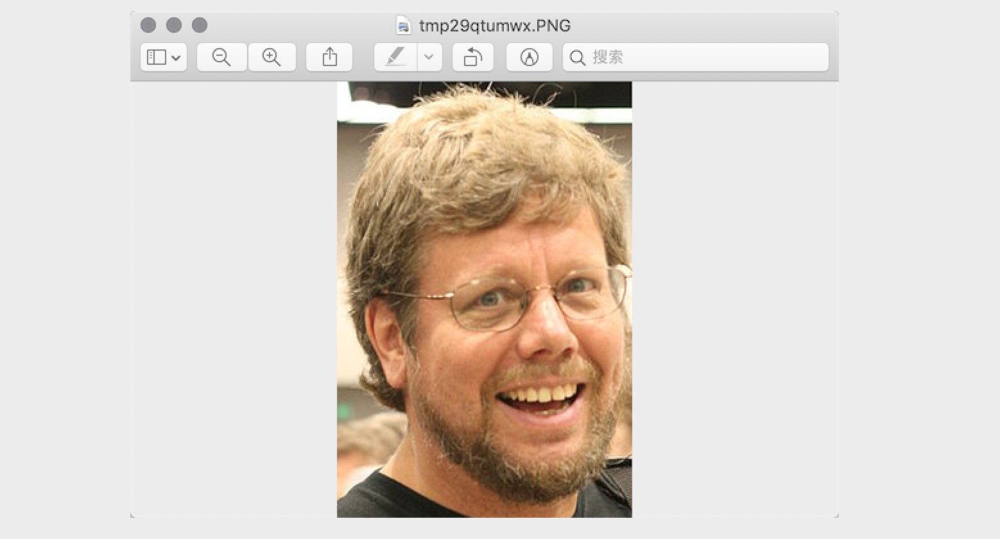
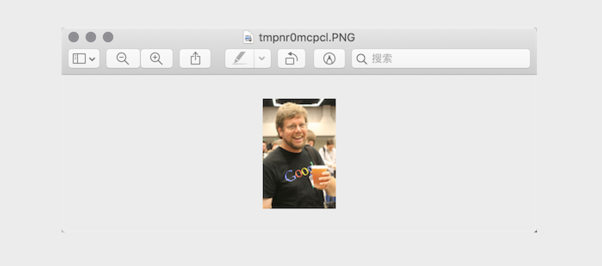
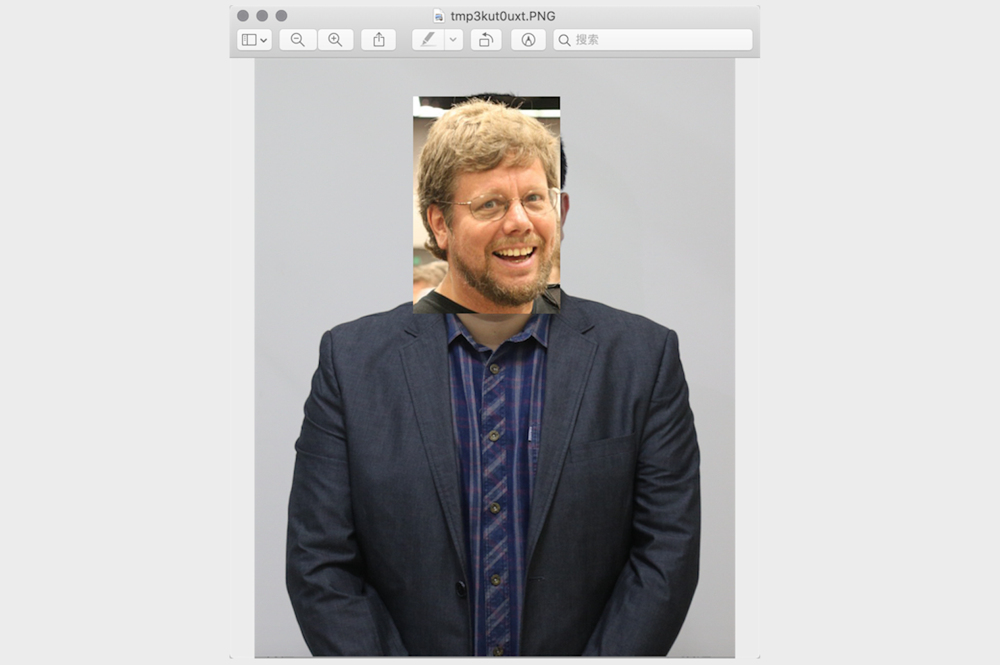
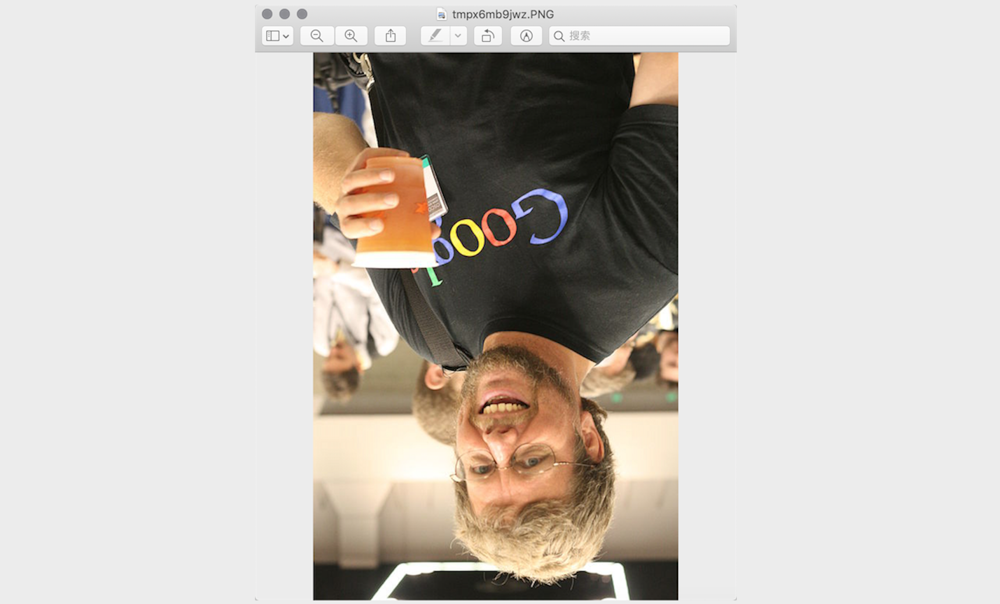
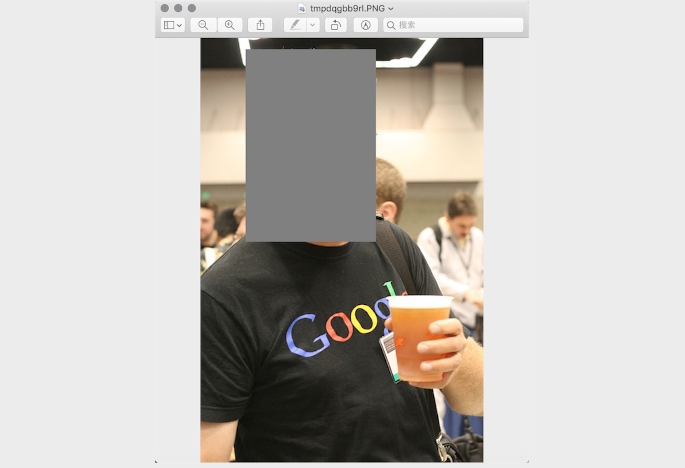
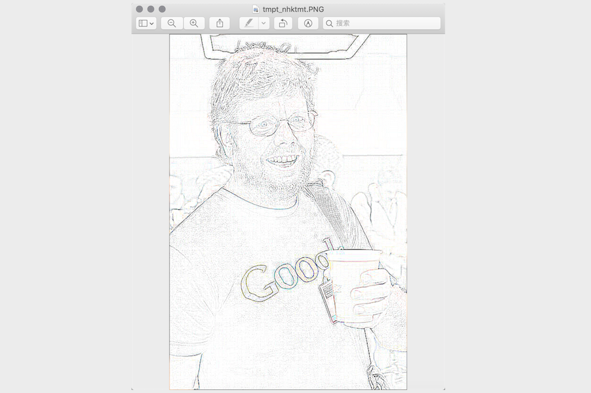
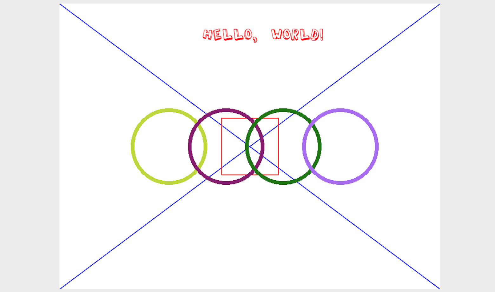

## Python处理图像

### 入门知识

1. 颜色。如果你有使用颜料画画的经历，那么一定知道混合红、黄、蓝三种颜料可以得到其他的颜色，事实上这三种颜色就是美术中的三原色，它们是不能再分解的基本颜色。在计算机中，我们可以将红、绿、蓝三种色光以不同的比例叠加来组合成其他的颜色，因此这三种颜色就是色光三原色。在计算机系统中，我们通常会将一个颜色表示为一个RGB值或RGBA值（其中的A表示Alpha通道，它决定了透过这个图像的像素，也就是透明度）。

   |    名称     |      RGB值      |     名称     |     RGB值     |
   | :---------: | :-------------: | :----------: | :-----------: |
   | White（白） | (255, 255, 255) |  Red（红）   |  (255, 0, 0)  |
   | Green（绿） |   (0, 255, 0)   |  Blue（蓝）  |  (0, 0, 255)  |
   | Gray（灰）  | (128, 128, 128) | Yellow（黄） | (255, 255, 0) |
   | Black（黑） |    (0, 0, 0)    | Purple（紫） | (128, 0, 128) |

2. 像素。对于一个由数字序列表示的图像来说，最小的单位就是图像上单一颜色的小方格，这些小方块都有一个明确的位置和被分配的色彩数值，而这些一小方格的颜色和位置决定了该图像最终呈现出来的样子，它们是不可分割的单位，我们通常称之为像素（pixel）。每一个图像都包含了一定量的像素，这些像素决定图像在屏幕上所呈现的大小，大家如果爱好拍照或者自拍，对像素这个词就不会陌生。

### 用Pillow处理图像

Pillow是由从著名的Python图像处理库PIL发展出来的一个分支，通过Pillow可以实现图像压缩和图像处理等各种操作。可以使用下面的命令来安装Pillow。

```Shell
pip install pillow
```

Pillow中最为重要的是`Image`类，可以通过`Image`模块的`open`函数来读取图像并获得`Image`类型的对象。

1. 读取和显示图像

   ```Python
   from PIL import Image
   
   # 读取图像获得Image对象
   image = Image.open('guido.jpg')
   # 通过Image对象的format属性获得图像的格式
   print(image.format) # JPEG
   # 通过Image对象的size属性获得图像的尺寸
   print(image.size)   # (500, 750)
   # 通过Image对象的mode属性获取图像的模式
   print(image.mode)   # RGB
   # 通过Image对象的show方法显示图像
   image.show()
   ```

   

2. 剪裁图像

   ```Python
   # 通过Image对象的crop方法指定剪裁区域剪裁图像
   image.crop((80, 20, 310, 360)).show()
   ```

   

3. 生成缩略图

   ```Python
   # 通过Image对象的thumbnail方法生成指定尺寸的缩略图
   image.thumbnail((128, 128))
   image.show()
   ```

   

4. 缩放和黏贴图像

   ```Python
   # 读取骆昊的照片获得Image对象
   luohao_image = Image.open('luohao.png')
   # 读取吉多的照片获得Image对象
   guido_image = Image.open('guido.jpg')
   # 从吉多的照片上剪裁出吉多的头
   guido_head = guido_image.crop((80, 20, 310, 360))
   width, height = guido_head.size
   # 使用Image对象的resize方法修改图像的尺寸
   # 使用Image对象的paste方法将吉多的头粘贴到骆昊的照片上
   luohao_image.paste(guido_head.resize((int(width / 1.5), int(height / 1.5))), (172, 40))
   luohao_image.show()
   ```

   

5. 旋转和翻转

   ```Python
   image = Image.open('guido.jpg')
   # 使用Image对象的rotate方法实现图像的旋转
   image.rotate(45).show()
   # 使用Image对象的transpose方法实现图像翻转
   # Image.FLIP_LEFT_RIGHT - 水平翻转
   # Image.FLIP_TOP_BOTTOM - 垂直翻转
   image.transpose(Image.FLIP_TOP_BOTTOM).show()
   ```

   

6. 操作像素

   ```Python
   for x in range(80, 310):
       for y in range(20, 360):
           # 通过Image对象的putpixel方法修改图像指定像素点
           image.putpixel((x, y), (128, 128, 128))
   image.show()
   ```

   

7. 滤镜效果

   ```Python
   from PIL import ImageFilter
   
   # 使用Image对象的filter方法对图像进行滤镜处理
   # ImageFilter模块包含了诸多预设的滤镜也可以自定义滤镜
   image.filter(ImageFilter.CONTOUR).show()
   ```

   

### 使用Pillow绘图

Pillow中有一个名为`ImageDraw`的模块，该模块的`Draw`函数会返回一个`ImageDraw`对象，通过`ImageDraw`对象的`arc`、`line`、`rectangle`、`ellipse`、`polygon`等方法，可以在图像上绘制出圆弧、线条、矩形、椭圆、多边形等形状，也可以通过该对象的`text`方法在图像上添加文字。



要绘制如上图所示的图像，完整的代码如下所示。

```Python
import random

from PIL import Image, ImageDraw, ImageFont


def random_color():
    """生成随机颜色"""
    red = random.randint(0, 255)
    green = random.randint(0, 255)
    blue = random.randint(0, 255)
    return red, green, blue


width, height = 800, 600
# 创建一个800*600的图像，背景色为白色
image = Image.new(mode='RGB', size=(width, height), color=(255, 255, 255))
# 创建一个ImageDraw对象
drawer = ImageDraw.Draw(image)
# 通过指定字体和大小获得ImageFont对象
font = ImageFont.truetype('Kongxin.ttf', 32)
# 通过ImageDraw对象的text方法绘制文字
drawer.text((300, 50), 'Hello, world!', fill=(255, 0, 0), font=font)
# 通过ImageDraw对象的line方法绘制两条对角直线
drawer.line((0, 0, width, height), fill=(0, 0, 255), width=2)
drawer.line((width, 0, 0, height), fill=(0, 0, 255), width=2)
xy = width // 2 - 60, height // 2 - 60, width // 2 + 60, height // 2 + 60
# 通过ImageDraw对象的rectangle方法绘制矩形
drawer.rectangle(xy, outline=(255, 0, 0), width=2)
# 通过ImageDraw对象的ellipse方法绘制椭圆
for i in range(4):
    left, top, right, bottom = 150 + i * 120, 220, 310 + i * 120, 380
    drawer.ellipse((left, top, right, bottom), outline=random_color(), width=8)
# 显示图像
image.show()
# 保存图像
image.save('result.png')
```

> **注意**：上面代码中使用的字体文件需要根据自己准备，可以选择自己喜欢的字体文件并放置在代码目录下。

###  总结

使用Python语言做开发，除了可以用Pillow来处理图像外，还可以使用更为强大的OpenCV库来完成图形图像的处理，OpenCV（**Open** Source **C**omputer **V**ision Library）是一个跨平台的计算机视觉库，可以用来开发实时图像处理、计算机视觉和模式识别程序。在我们的日常工作中，有很多繁琐乏味的任务其实都可以通过Python程序来处理，编程的目的就是让计算机帮助我们解决问题，减少重复乏味的劳动。通过本章节的学习，相信大家已经感受到了使用Python程序绘图P图的乐趣，其实Python能做的事情还远不止这些，继续你的学习吧。
