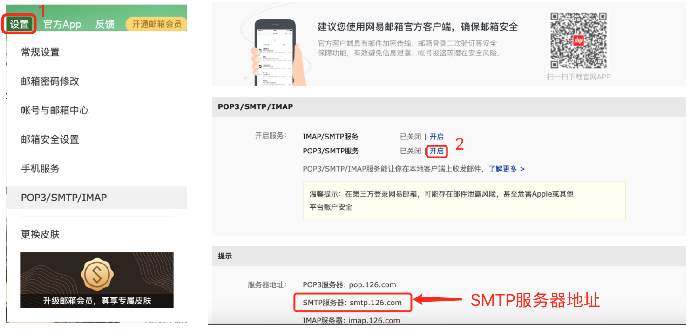
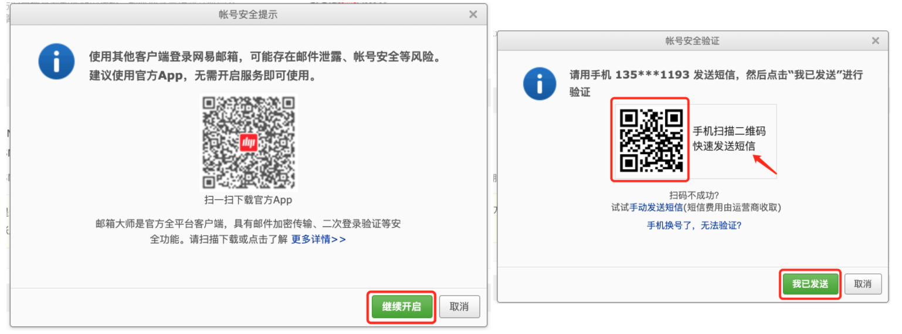
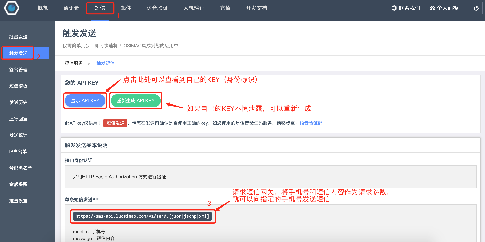
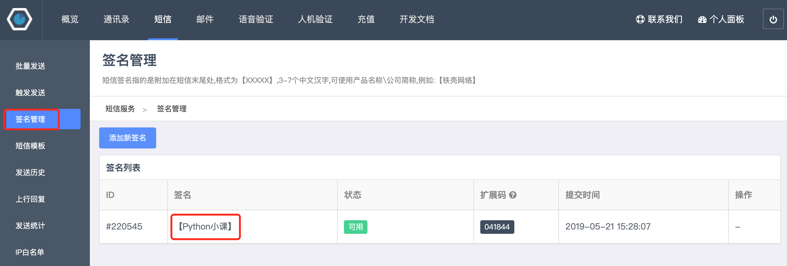

## Python发送邮件和短信

在前面的课程中，我们已经教会大家如何用Python程序自动的生成Excel、Word、PDF文档，接下来我们还可以更进一步，就是通过邮件将生成好的文档发送给指定的收件人，然后用短信告知对方我们发出了邮件。这些事情利用Python程序也可以轻松愉快的解决。

### 发送电子邮件

在即时通信软件如此发达的今天，电子邮件仍然是互联网上使用最为广泛的应用之一，公司向应聘者发出录用通知、网站向用户发送一个激活账号的链接、银行向客户推广它们的理财产品等几乎都是通过电子邮件来完成的，而这些任务应该都是由程序自动完成的。

我们可以用HTTP（超文本传输协议）来访问网站资源，HTTP是一个应用级协议，它建立在TCP（传输控制协议）之上，TCP为很多应用级协议提供了可靠的数据传输服务。如果要发送电子邮件，需要使用SMTP（简单邮件传输协议），它也是建立在TCP之上的应用级协议，规定了邮件的发送者如何跟邮件服务器进行通信的细节。Python通过名为`smtplib`的模块将这些操作简化成了`SMTP_SSL`对象，通过该对象的`login`和`send_mail`方法，就能够完成发送邮件的操作。

我们先尝试一下发送一封极为简单的邮件，该邮件不包含附件、图片以及其他超文本内容。发送邮件首先需要接入邮件服务器，我们可以自己架设邮件服务器，这件事情对新手并不友好，但是我们可以选择使用第三方提供的邮件服务。例如，我在<www.126.com>已经注册了账号，登录成功之后，就可以在设置中开启SMTP服务，这样就相当于获得了邮件服务器，具体的操作如下所示。





用手机扫码上面的二维码可以通过发送短信的方式来获取授权码，短信发送成功后，点击“我已发送”就可以获得授权码。授权码需要妥善保管，因为一旦泄露就会被其他人冒用你的身份来发送邮件。接下来，我们就可以编写发送邮件的代码了，如下所示。

```Python
import smtplib
from email.header import Header
from email.mime.multipart import MIMEMultipart
from email.mime.text import MIMEText

# 创建邮件主体对象
email = MIMEMultipart()
# 设置发件人、收件人和主题
email['From'] = 'xxxxxxxxx@126.com'
email['To'] = 'yyyyyy@qq.com;zzzzzz@1000phone.com'
email['Subject'] = Header('上半年工作情况汇报', 'utf-8')
# 添加邮件正文内容
content = """据德国媒体报道，当地时间9日，德国火车司机工会成员进行了投票，
定于当地时间10日起进行全国性罢工，货运交通方面的罢工已于当地时间10日19时开始。
此后，从11日凌晨2时到13日凌晨2时，德国全国范围内的客运和铁路基础设施将进行48小时的罢工。"""
email.attach(MIMEText(content, 'plain', 'utf-8'))

# 创建SMTP_SSL对象（连接邮件服务器）
smtp_obj = smtplib.SMTP_SSL('smtp.126.com', 465)
# 通过用户名和授权码进行登录
smtp_obj.login('xxxxxxxxx@126.com', '邮件服务器的授权码')
# 发送邮件（发件人、收件人、邮件内容（字符串））
smtp_obj.sendmail(
    'xxxxxxxxx@126.com',
    ['yyyyyy@qq.com', 'zzzzzz@1000phone.com'],
    email.as_string()
)
```

如果要发送带有附件的邮件，只需要将附件的内容处理成BASE64编码，那么它就和普通的文本内容几乎没有什么区别。BASE64是一种基于64个可打印字符来表示二进制数据的表示方法，常用于某些需要表示、传输、存储二进制数据的场合，电子邮件就是其中之一。对这种编码方式不理解的同学，推荐阅读[《Base64笔记》](http://www.ruanyifeng.com/blog/2008/06/base64.html)一文。在之前的内容中，我们也提到过，Python标准库的`base64`模块提供了对BASE64编解码的支持。

下面的代码演示了如何发送带附件的邮件。

```Python
import smtplib
from email.header import Header
from email.mime.multipart import MIMEMultipart
from email.mime.text import MIMEText
from urllib.parse import quote

# 创建邮件主体对象
email = MIMEMultipart()
# 设置发件人、收件人和主题
email['From'] = 'xxxxxxxxx@126.com'
email['To'] = 'zzzzzzzz@1000phone.com'
email['Subject'] = Header('请查收离职证明文件', 'utf-8')
# 添加邮件正文内容（带HTML标签排版的内容）
content = """<p>亲爱的前同事：</p>
<p>你需要的离职证明在附件中，请查收！</p>
<br>
<p>祝，好！</p>
<hr>
<p>孙美丽 即日</p>"""
email.attach(MIMEText(content, 'html', 'utf-8'))
# 读取作为附件的文件
with open(f'resources/王大锤离职证明.docx', 'rb') as file:
    attachment = MIMEText(file.read(), 'base64', 'utf-8')
    # 指定内容类型
    attachment['content-type'] = 'application/octet-stream'
    # 将中文文件名处理成百分号编码
    filename = quote('王大锤离职证明.docx')
    # 指定如何处置内容
    attachment['content-disposition'] = f'attachment; filename="{filename}"'

# 创建SMTP_SSL对象（连接邮件服务器）
smtp_obj = smtplib.SMTP_SSL('smtp.126.com', 465)
# 通过用户名和授权码进行登录
smtp_obj.login('xxxxxxxxx@126.com', '邮件服务器的授权码')
# 发送邮件（发件人、收件人、邮件内容（字符串））
smtp_obj.sendmail(
    'xxxxxxxxx@126.com',
    'zzzzzzzz@1000phone.com',
    email.as_string()
)
```

为了方便大家用Python实现邮件发送，我将上面的代码封装成了函数，使用的时候大家只需要调整邮件服务器域名、端口、用户名和授权码就可以了。

```Python
import smtplib
from email.header import Header
from email.mime.multipart import MIMEMultipart
from email.mime.text import MIMEText
from urllib.parse import quote

# 邮件服务器域名（自行修改）
EMAIL_HOST = 'smtp.126.com'
# 邮件服务端口（通常是465）
EMAIL_PORT = 465
# 登录邮件服务器的账号（自行修改）
EMAIL_USER = 'xxxxxxxxx@126.com'
# 开通SMTP服务的授权码（自行修改）
EMAIL_AUTH = '邮件服务器的授权码'


def send_email(*, from_user, to_users, subject='', content='', filenames=[]):
    """发送邮件
    
    :param from_user: 发件人
    :param to_users: 收件人，多个收件人用英文分号进行分隔
    :param subject: 邮件的主题
    :param content: 邮件正文内容
    :param filenames: 附件要发送的文件路径
    """
    email = MIMEMultipart()
    email['From'] = from_user
    email['To'] = to_users
    email['Subject'] = subject

    message = MIMEText(content, 'plain', 'utf-8')
    email.attach(message)
    for filename in filenames:
        with open(filename, 'rb') as file:
            pos = filename.rfind('/')
            display_filename = filename[pos + 1:] if pos >= 0 else filename
            display_filename = quote(display_filename)
            attachment = MIMEText(file.read(), 'base64', 'utf-8')
            attachment['content-type'] = 'application/octet-stream'
            attachment['content-disposition'] = f'attachment; filename="{display_filename}"'
            email.attach(attachment)

    smtp = smtplib.SMTP_SSL(EMAIL_HOST, EMAIL_PORT)
    smtp.login(EMAIL_USER, EMAIL_AUTH)
    smtp.sendmail(from_user, to_users.split(';'), email.as_string())
```

### 发送短信

发送短信也是项目中常见的功能，网站的注册码、验证码、营销信息基本上都是通过短信来发送给用户的。发送短信需要三方平台的支持，下面我们以[螺丝帽平台](https://luosimao.com/)为例，为大家介绍如何用Python程序发送短信。注册账号和购买短信服务的细节我们不在这里进行赘述，大家可以咨询平台的客服。



接下来，我们可以通过`requests`库向平台提供的短信网关发起一个HTTP请求，通过将接收短信的手机号和短信内容作为参数，就可以发送短信，代码如下所示。

```Python
import random

import requests


def send_message_by_luosimao(tel, message):
    """发送短信（调用螺丝帽短信网关）"""
    resp = requests.post(
        url='http://sms-api.luosimao.com/v1/send.json',
        auth=('api', 'key-注册成功后平台分配的KEY'),
        data={
            'mobile': tel,
            'message': message
        },
        timeout=10,
        verify=False
    )
    return resp.json()


def gen_mobile_code(length=6):
    """生成指定长度的手机验证码"""
    return ''.join(random.choices('0123456789', k=length))


def main():
    code = gen_mobile_code()
    message = f'您的短信验证码是{code}，打死也不能告诉别人哟！【Python小课】'
    print(send_message_by_luosimao('13500112233', message))


if __name__ == '__main__':
    main()
```

上面请求螺丝帽的短信网关`http://sms-api.luosimao.com/v1/send.json`会返回JSON格式的数据，如果返回`{'error': 0, 'msg': 'OK'}`就说明短信已经发送成功了，如果`error`的值不是`0`，可以通过查看官方的[开发文档](https://luosimao.com/docs/api/)了解到底哪个环节出了问题。螺丝帽平台常见的错误类型如下图所示。


目前，大多数短信平台都会要求短信内容必须附上签名，下图是我在螺丝帽平台配置的短信签名“【Python小课】”。有些涉及到敏感内容的短信，还需要提前配置短信模板，有兴趣的读者可以自行研究。一般情况下，平台为了防范短信被盗用，还会要求设置“IP白名单”，不清楚如何配置的可以咨询平台客服。



当然国内的短信平台很多，读者可以根据自己的需要进行选择（通常会考虑费用预算、短信达到率、使用的难易程度等指标），如果需要在商业项目中使用短信服务建议购买短信平台提供的套餐服务。

### 总结

其实，发送邮件和发送短信一样，也可以通过调用三方服务来完成，在实际的商业项目中，建议自己架设邮件服务器或购买三方服务来发送邮件，这个才是比较靠谱的选择。
