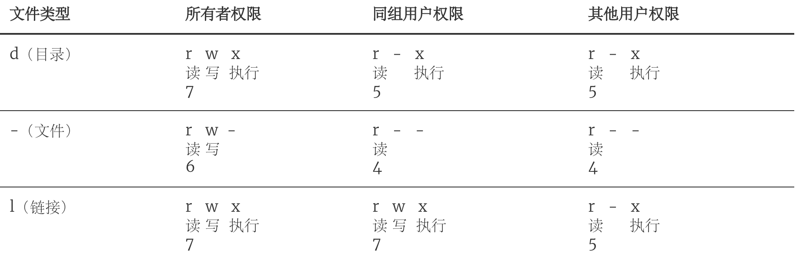
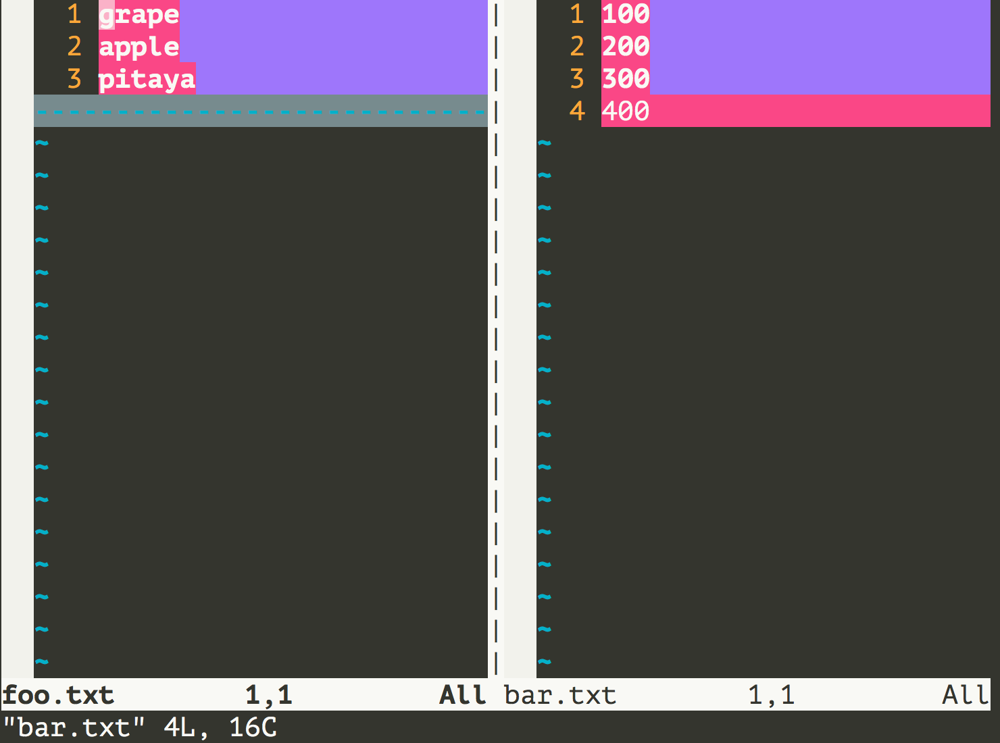
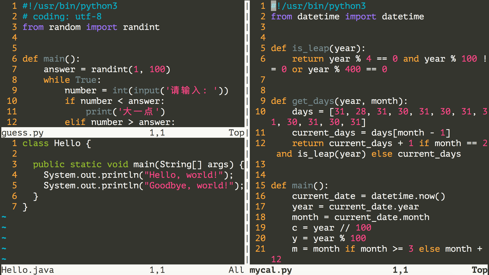
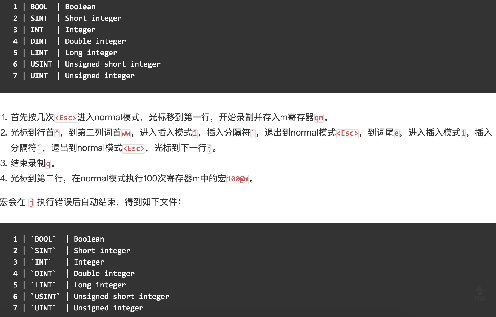

## 玩转Linux操作系统

> 说明：本文中对Linux命令的讲解都是基于名为CentOS的Linux发行版本，我自己使用的是阿里云服务器，系统版本为CentOS Linux release 7.6.1810。不同的Linux发行版本在Shell命令和工具程序上会有一些差别，但是这些差别是很小的。

### 操作系统发展史

只有硬件没有软件的计算机系统被称之为“裸机”，我们很难用“裸机”来完成计算机日常的工作（如存储和运算），所以必须用特定的软件来控制硬件的工作。最靠近计算机硬件的软件是系统软件，其中最为重要的就是“操作系统”。“操作系统”是控制和管理整个计算机硬件和软件资源、实现资源分配和任务调配、为系统用户以及其他软件提供接口和环境的程序的集合。

#### 没有操作系统（手工操作）

在计算机诞生之初没有操作系统的年代，人们先把程序纸带（或卡片）装上计算机，然后启动输入机把程序送入计算机，接着通过控制台开关启动程序运行。当程序执行完毕，打印机输出计算的结果，用户卸下并取走纸带（或卡片）。第二个用户上机，重复同样的步骤。在整个过程中用户独占机器，CPU等待手工操作，资源利用率极低。

#### 批处理系统

首先启动计算机上的一个监督程序，在监督程序的控制下，计算机能够自动的、成批的处理一个或多个用户的作业。完成一批作业后，监督程度又从输入机读取作业存入磁带机。按照上面的步骤重复处理任务。监督程序不停的处理各个作业，实现了作业的自动转接，减少了作业的建立时间和手工操作时间，提高了计算机资源的利用率。 批处理系统又可以分为单道批处理系统、多道批处理系统、联机批处理系统、脱机批处理系统。

#### 分时系统和实时系统

分时系统是把处理器的运行时间分成很短的时间片，按时间片轮流把处理机分配给各联机作业使用。 若某个作业在分配给它的时间片内不能完成其计算，则该作业暂时中断，把处理机让给另一作业使用，等待下一轮调度时再继续其运行。由于计算机速度很快，作业运行轮转得很快，给每个用户的感觉是他独占了一台计算机。而每个用户可以通过自己的终端向系统发出各种操作控制命令，在充分的人机交互情况下，完成作业的运行。为了解决分时系统不能及时响应用户指令的情况，又出现了能够在在严格的时间范围内完成事件处理，及时响应随机外部事件的实时系统。

#### 通用操作系统

1. 1960s：IBM的System/360系列的机器有了统一的操作系统OS/360。

2. 1965年：AT&T的贝尔实验室加入GE和MIT的合作计划开始开发MULTICS。

3. 1969年：MULTICS项目失败，Ken Tompson赋闲在家，为了玩“Space Travel”游戏用汇编语言在当时已经被淘汰的PDP-7上开发了Unics。

   > 注：很难想象，Unix这么伟大的系统，居然是一个赋闲在家的程序员（关键是老婆回娘家还带上了孩子）在一台被淘汰的设备上为了玩游戏开发出来的。

4. 1970年~1971年：Ken Tompson和Dennis Ritchie用B语言在PDP-11上重写了Unics，并在Brian Kernighan的建议下将其更名为Unix。

   

5. 1972年~1973年：Dennis Ritchie发明了C语言来取代可移植性较差的B语言，并开启了用C语言重写Unix的工作。

6. 1974年：Unix推出了里程碑意义的第5版，几乎完全用C语言来实现。

7. 1979年：从Unix第7版开始，AT&T发布新的使用条款，将Unix私有化。

8. 1987年：Andrew S. Tanenbaum教授为了能在课堂上为学生讲解操作系统运作的细节，决定在不使用任何AT&T的源代码前提下，自行开发与Unix兼容的操作系统以避免版权上的争议，该系统被命名为Minix。

   

9. 1991年：Linus Torvalds就读于芬兰赫尔辛基大学期间，尝试在Minix上做一些开发工作，但因为Minix只是作为教学用途的操作系统，功能并不强大，为了方便在学校的新闻组和邮件系统中读写和下载文件，Linus编写了磁盘驱动程序和文件系统，这些东西形成了Linux系统内核的雏形。

   

下图是Unix操作系统家族的图谱。


### Linux概述

Linux是一个通用操作系统。一个操作系统要负责任务调度、内存分配、处理外围设备I/O等操作。操作系统通常由内核（运行其他程序，管理像磁盘、打印机等硬件设备的核心程序）和系统程序（设备驱动、底层库、shell、服务程序等）两部分组成。

Linux内核是芬兰人Linus Torvalds开发的，于1991年9月发布。而Linux操作系统作为Internet时代的产物，它是由全世界许多开发者共同合作开发的，是一个自由的操作系统（注意自由和免费并不是同一个概念，想了解二者的差别可以[点击这里](https://www.debian.org/intro/free)）。

### Linux系统优点

1. 通用操作系统，不跟特定的硬件绑定。
2. 用C语言编写，可移植性强，有内核编程接口。
3. 支持多用户和多任务，支持安全的分层文件系统。
4. 大量的实用程序，完善的网络功能以及强大的支持文档。
5. 可靠的安全性和良好的稳定性，对开发者更友好。

### Linux系统发行版本

1. [Redhat](https://www.redhat.com/en)
2. [Ubuntu](https://www.ubuntu.com/)
3. [CentOS](https://www.centos.org/)
4. [Fedora](https://getfedora.org/)
5. [Debian](https://www.debian.org/)
6. [openSUSE](https://www.opensuse.org/)

### 基础命令

Linux系统的命令通常都是如下所示的格式：

```Shell
命令名称 [命名参数] [命令对象]
```

1. 获取登录信息 - **w** / **who** / **last**/ **lastb**。

   ```Shell
   [root ~]# w
    23:31:16 up 12:16,  2 users,  load average: 0.00, 0.01, 0.05
   USER     TTY      FROM             LOGIN@   IDLE   JCPU   PCPU WHAT
   root     pts/0    182.139.66.250   23:03    4.00s  0.02s  0.00s w
   jackfrue pts/1    182.139.66.250   23:26    3:56   0.00s  0.00s -bash
   [root ~]# who
   root     pts/0        2018-04-12 23:03 (182.139.66.250)
   jackfrued pts/1        2018-04-12 23:26 (182.139.66.250)
   [root ~]# who am i
   root     pts/0        2018-04-12 23:03 (182.139.66.250)
   [root ~]# who mom likes
   root     pts/0        2018-04-12 23:03 (182.139.66.250)
   [root ~]# last
   root     pts/0        117.136.63.184   Sun May 26 18:57   still logged in   
   reboot   system boot  3.10.0-957.10.1. Mon May 27 02:52 - 19:10  (-7:-42)   
   root     pts/4        117.136.63.184   Sun May 26 18:51 - crash  (08:01)    
   root     pts/4        117.136.63.184   Sun May 26 18:49 - 18:49  (00:00)    
   root     pts/3        117.136.63.183   Sun May 26 18:35 - crash  (08:17)    
   root     pts/2        117.136.63.183   Sun May 26 18:34 - crash  (08:17)    
   root     pts/0        117.136.63.183   Sun May 26 18:10 - crash  (08:42)    
   ```

2. 查看自己使用的Shell - **ps**。

   Shell也被称为“壳”或“壳程序”，它是用户与操作系统内核交流的翻译官，简单的说就是人与计算机交互的界面和接口。目前很多Linux系统默认的Shell都是bash（<u>B</u>ourne <u>A</u>gain <u>SH</u>ell），因为它可以使用tab键进行命令和路径补全、可以保存历史命令、可以方便的配置环境变量以及执行批处理操作。

   ```Shell
   [root@izwz97tbgo9lkabnat2lo8z ~]# ps
     PID TTY          TIME CMD
    3531 pts/0    00:00:00 bash
    3553 pts/0    00:00:00 ps
   ```

3. 查看命令的说明和位置 - **whatis** / **which** / **whereis**。

   ```Shell
   [root ~]# whatis ps
   ps (1)        - report a snapshot of the current processes.
   [root ~]# whatis python
   python (1)    - an interpreted, interactive, object-oriented programming language
   [root ~]# whereis ps
   ps: /usr/bin/ps /usr/share/man/man1/ps.1.gz
   [root ~]# whereis python
   python: /usr/bin/python /usr/bin/python2.7 /usr/lib/python2.7 /usr/lib64/python2.7 /etc/python /usr/include/python2.7 /usr/share/man/man1/python.1.gz
   [root ~]# which ps
   /usr/bin/ps
   [root ~]# which python
   /usr/bin/python
   ```

4. 清除屏幕上显示的内容 - **clear**。

5. 查看帮助文档 - **man** / **info** / **help** / **apropos**。
   ```Shell
   [root@izwz97tbgo9lkabnat2lo8z ~]# ps --help
   Usage:
    ps [options]
    Try 'ps --help <simple|list|output|threads|misc|all>'
     or 'ps --help <s|l|o|t|m|a>'
    for additional help text.
   For more details see ps(1).
   [root@izwz97tbgo9lkabnat2lo8z ~]# man ps
   PS(1)                                User Commands                                PS(1)
   NAME
          ps - report a snapshot of the current processes.
   SYNOPSIS
          ps [options]
   DESCRIPTION
   ...
   ```

6. 查看系统和主机名 - **uname** / **hostname**。

   ```Shell
   [root@izwz97tbgo9lkabnat2lo8z ~]# uname
   Linux
   [root@izwz97tbgo9lkabnat2lo8z ~]# hostname
   izwz97tbgo9lkabnat2lo8z
   [root@iZwz97tbgo9lkabnat2lo8Z ~]# cat /etc/centos-release
   CentOS Linux release 7.6.1810 (Core)
   ```

   > 说明：`cat`是连接文件内容并打印到标准输出的命令，后面会讲到该命令；`/etc`是Linux系统上的一个非常重要的目录，它保存了很多的配置文件；`centos-release`是该目录下的一个文件，因为我自己使用的Linux发行版本是CentOS 7.6，因此这里会有一个这样的文件。

7. 时间和日期 - **date** / **cal**。

   ```Shell
   [root@iZwz97tbgo9lkabnat2lo8Z ~]# date
   Wed Jun 20 12:53:19 CST 2018
   [root@iZwz97tbgo9lkabnat2lo8Z ~]# cal
         June 2018
   Su Mo Tu We Th Fr Sa
                   1  2
    3  4  5  6  7  8  9
   10 11 12 13 14 15 16
   17 18 19 20 21 22 23
   24 25 26 27 28 29 30
   [root@iZwz97tbgo9lkabnat2lo8Z ~]# cal 5 2017
         May 2017
   Su Mo Tu We Th Fr Sa
       1  2  3  4  5  6
    7  8  9 10 11 12 13
   14 15 16 17 18 19 20
   21 22 23 24 25 26 27
   28 29 30 31
   ```

8. 重启和关机 - **reboot** / **shutdown**。

   ```Shell
   [root ~]# shutdown -h +5
   Shutdown scheduled for Sun 2019-05-26 19:34:27 CST, use 'shutdown -c' to cancel.
   [root ~]# 
   Broadcast message from root (Sun 2019-05-26 19:29:27 CST):
   
   The system is going down for power-off at Sun 2019-05-26 19:34:27 CST!
   [root ~]# shutdown -c
   
   Broadcast message from root (Sun 2019-05-26 19:30:22 CST):
   
   The system shutdown has been cancelled at Sun 2019-05-26 19:31:22 CST!
   [root ~]# shutdown -r 23:58
   Shutdown scheduled for Sun 2019-05-26 23:58:00 CST, use 'shutdown -c' to cancel.
   [root ~]# shutdown -c
   
   Broadcast message from root (Sun 2019-05-26 19:31:06 CST):
   
   The system shutdown has been cancelled at Sun 2019-05-26 19:32:06 CST!
   ```

   > 说明：在执行`shutdown`命令时会向登录系统的用户发出警告，可以在命令后面跟上警告消息来替换默认的警告消息，也可以在`-h`参数后通过`now`来表示立刻关机。

9. 退出登录 -  **exit** / **logout**。

10. 查看历史命令 - **history**。

  ```Shell
  [root@iZwz97tbgo9lkabnat2lo8Z ~]# history
  ...
  452  ls
  453  cd Python-3.6.5/
  454  clear
  455  history
  [root@iZwz97tbgo9lkabnat2lo8Z ~]# !454
  ```

  > 说明：查看到历史命令之后，可以用`!历史命令编号`来重新执行该命令；通过`history -c`可以清除历史命令。

### 实用程序

#### 文件和文件夹操作

1. 创建/删除空目录 - **mkdir** / **rmdir**。

   ```Shell
   [root ~]# mkdir abc
   [root ~]# mkdir -p xyz/abc
   [root ~]# rmdir abc
   ```

2. 创建/删除文件 - **touch** / **rm**。

   ```Shell
   [root ~]# touch readme.txt
   [root ~]# touch error.txt
   [root ~]# rm error.txt
   rm: remove regular empty file ‘error.txt’? y
   [root ~]# rm -rf xyz
   ```

   - `touch`命令用于创建空白文件或修改文件时间。在Linux系统中一个文件有三种时间：
     - 更改内容的时间 - mtime。
     - 更改权限的时间 - ctime。
     - 最后访问时间 - atime。
   - `rm`的几个重要参数：
     - `-i`：交互式删除，每个删除项都会进行询问。
     - `-r`：删除目录并递归的删除目录中的文件和目录。
     - `-f`：强制删除，忽略不存在的文件，没有任何提示。

3. 切换和查看当前工作目录 - **cd** / **pwd**。

   > 说明：`cd`命令后面可以跟相对路径（以当前路径作为参照）或绝对路径（以`/`开头）来切换到指定的目录，也可以用`cd ..`来返回上一级目录。请大家想一想，如果要返回到上上一级目录应该给`cd`命令加上什么样的参数呢？

4. 查看目录内容 - **ls**。

   - `-l`：以长格式查看文件和目录。
   - `-a`：显示以点开头的文件和目录（隐藏文件）。
   - `-R`：遇到目录要进行递归展开（继续列出目录下面的文件和目录）。
   - `-d`：只列出目录，不列出其他内容。
   - `-S` / `-t`：按大小/时间排序。

5. 查看文件内容 - **cat** / **tac** / **head** / **tail** / **more** / **less** / **rev** / **od**。

   ```Shell
   [root ~]# wget http://www.sohu.com/ -O sohu.html
   --2018-06-20 18:42:34--  http://www.sohu.com/
   Resolving www.sohu.com (www.sohu.com)... 14.18.240.6
   Connecting to www.sohu.com (www.sohu.com)|14.18.240.6|:80... connected.
   HTTP request sent, awaiting response... 200 OK
   Length: 212527 (208K) [text/html]
   Saving to: ‘sohu.html’
   100%[==================================================>] 212,527     --.-K/s   in 0.03s
   2018-06-20 18:42:34 (7.48 MB/s) - ‘sohu.html’ saved [212527/212527]
   [root ~]# cat sohu.html
   ...
   [root ~]# head -10 sohu.html
   <!DOCTYPE html>
   <html>
   <head>
   <title>搜狐</title>
   <meta name="Keywords" content="搜狐,门户网站,新媒体,网络媒体,新闻,财经,体育,娱乐,时尚,汽车,房产,科技,图片,论坛,微博,博客,视频,电影,电视剧"/>
   <meta name="Description" content="搜狐网为用户提供24小时不间断的最新资讯，及搜索、邮件等网络服务。内容包括全球热点事件、突发新闻、时事评论、热播影视剧、体育赛事、行业动态、生活服务信息，以及论坛、博客、微博、我的搜狐等互动空间。" />
   <meta name="shenma-site-verification" content="1237e4d02a3d8d73e96cbd97b699e9c3_1504254750">
   <meta charset="utf-8"/>
   <meta http-equiv="X-UA-Compatible" content="IE=Edge,chrome=1"/>
   [root ~]# tail -2 sohu.html
   </body>
   </html>
   [root ~]# less sohu.html
   ...
   [root ~]# cat -n sohu.html | more
   ...
   ```

   > 说明：上面用到了一个名为`wget`的命令，它是一个网络下载器程序，可以从指定的URL下载资源。

6. 拷贝/移动文件 - **cp** / **mv**。

   ```Shell
   [root ~]# mkdir backup
   [root ~]# cp sohu.html backup/
   [root ~]# cd backup
   [root backup]# ls
   sohu.html
   [root backup]# mv sohu.html sohu_index.html
   [root backup]# ls
   sohu_index.html
   ```

7. 文件重命名 - **rename**。

  ```Shell
  [root@iZwz97tbgo9lkabnat2lo8Z ~]# rename .htm .html *.htm
  ```

8. 查找文件和查找内容 - **find** / **grep**。

   ```Shell
   [root@iZwz97tbgo9lkabnat2lo8Z ~]# find / -name "*.html"
   /root/sohu.html
   /root/backup/sohu_index.html
   [root@izwz97tbgo9lkabnat2lo8z ~]# find . -atime 7 -type f -print
   [root@izwz97tbgo9lkabnat2lo8z ~]# find . -type f -size +2k
   [root@izwz97tbgo9lkabnat2lo8z ~]# find . -type f -name "*.swp" -delete
   [root@iZwz97tbgo9lkabnat2lo8Z ~]# grep "<script>" sohu.html -n
   20:<script>
   [root@iZwz97tbgo9lkabnat2lo8Z ~]# grep -E \<\/?script.*\> sohu.html -n
   20:<script>
   22:</script>
   24:<script src="//statics.itc.cn/web/v3/static/js/es5-shim-08e41cfc3e.min.js"></script>
   25:<script src="//statics.itc.cn/web/v3/static/js/es5-sham-1d5fa1124b.min.js"></script>
   26:<script src="//statics.itc.cn/web/v3/static/js/html5shiv-21fc8c2ba6.js"></script>
   29:<script type="text/javascript">
   52:</script>
   ...
   ```
   > 说明：`grep`在搜索字符串时可以使用正则表达式，如果需要使用正则表达式可以用`grep -E`或者直接使用`egrep`。

9. 创建链接和查看链接 - **ln** / **readlink**。

   ```Shell
   [root@iZwz97tbgo9lkabnat2lo8Z ~]# ls -l sohu.html
   -rw-r--r-- 1 root root 212131 Jun 20 19:15 sohu.html
   [root@iZwz97tbgo9lkabnat2lo8Z ~]# ln /root/sohu.html /root/backup/sohu_backup
   [root@iZwz97tbgo9lkabnat2lo8Z ~]# ls -l sohu.html
   -rw-r--r-- 2 root root 212131 Jun 20 19:15 sohu.html
   [root@iZwz97tbgo9lkabnat2lo8Z ~]# ln /root/sohu.html /root/backup/sohu_backup2
   [root@iZwz97tbgo9lkabnat2lo8Z ~]# ls -l sohu.html
   -rw-r--r-- 3 root root 212131 Jun 20 19:15 sohu.html
   [root@iZwz97tbgo9lkabnat2lo8Z ~]# ln -s /etc/centos-release sysinfo
   [root@iZwz97tbgo9lkabnat2lo8Z ~]# ls -l sysinfo
   lrwxrwxrwx 1 root root 19 Jun 20 19:21 sysinfo -> /etc/centos-release
   [root@iZwz97tbgo9lkabnat2lo8Z ~]# cat sysinfo
   CentOS Linux release 7.4.1708 (Core)
   [root@iZwz97tbgo9lkabnat2lo8Z ~]# cat /etc/centos-release
   CentOS Linux release 7.4.1708 (Core)
   ```

   > 说明：链接可以分为硬链接和软链接（符号链接）。硬链接可以认为是一个指向文件数据的指针，就像Python中对象的引用计数，每添加一个硬链接，文件的对应链接数就增加1，只有当文件的链接数为0时，文件所对应的存储空间才有可能被其他文件覆盖。我们平常删除文件时其实并没有删除硬盘上的数据，我们删除的只是一个指针，或者说是数据的一条使用记录，所以类似于“文件粉碎机”之类的软件在“粉碎”文件时除了删除文件指针，还会在文件对应的存储区域填入数据来保证文件无法再恢复。软链接类似于Windows系统下的快捷方式，当软链接链接的文件被删除时，软链接也就失效了。

10. 压缩/解压缩和归档/解归档 - **gzip** / **gunzip** / **xz**。

  ```Shell
  [root@iZwz97tbgo9lkabnat2lo8Z ~]# wget http://download.redis.io/releases/redis-4.0.10.tar.gz
  --2018-06-20 19:29:59--  http://download.redis.io/releases/redis-4.0.10.tar.gz
  Resolving download.redis.io (download.redis.io)... 109.74.203.151
  Connecting to download.redis.io (download.redis.io)|109.74.203.151|:80... connected.
  HTTP request sent, awaiting response... 200 OK
  Length: 1738465 (1.7M) [application/x-gzip]
  Saving to: ‘redis-4.0.10.tar.gz’
  100%[==================================================>] 1,738,465   70.1KB/s   in 74s
  2018-06-20 19:31:14 (22.9 KB/s) - ‘redis-4.0.10.tar.gz’ saved [1738465/1738465]
  [root@iZwz97tbgo9lkabnat2lo8Z ~]# ls redis*
  redis-4.0.10.tar.gz
  [root@iZwz97tbgo9lkabnat2lo8Z ~]# gunzip redis-4.0.10.tar.gz
  [root@iZwz97tbgo9lkabnat2lo8Z ~]# ls redis*
  redis-4.0.10.tar
  ```

11. 归档和解归档 - **tar**。

   ```Shell
   [root@iZwz97tbgo9lkabnat2lo8Z ~]# tar -xvf redis-4.0.10.tar
   redis-4.0.10/
   redis-4.0.10/.gitignore
   redis-4.0.10/00-RELEASENOTES
   redis-4.0.10/BUGS
   redis-4.0.10/CONTRIBUTING
   redis-4.0.10/COPYING
   redis-4.0.10/INSTALL
   redis-4.0.10/MANIFESTO
   redis-4.0.10/Makefile
   redis-4.0.10/README.md
   redis-4.0.10/deps/
   redis-4.0.10/deps/Makefile
   redis-4.0.10/deps/README.md
   ...
   ```

   > 说明：归档（也称为创建归档）和解归档都使用`tar`命令，通常创建归档需要`-cvf`三个参数，其中`c`表示创建（create），`v`表示显示创建归档详情（verbose），`f`表示指定归档的文件（file）；解归档需要加上`-xvf`参数，其中`x`表示抽取（extract），其他两个参数跟创建归档相同。

12. 将标准输入转成命令行参数 - **xargs**。

   下面的命令会将查找当前路径下的html文件，然后通过`xargs`将这些文件作为参数传给`rm`命令，实现查找并删除文件的操作。

   ```Shell
   [root@iZwz97tbgo9lkabnat2lo8Z ~]# find . -type f -name "*.html" | xargs rm -f
   ```

   下面的命令将a.txt文件中的多行内容变成一行输出到b.txt文件中，其中`<`表示从a.txt中读取输入，`>`表示将命令的执行结果输出到b.txt中。

   ```Shell
   [root@iZwz97tbgo9lkabnat2lo8Z ~]# xargs < a.txt > b.txt
   ```

   > 说明：这个命令就像上面演示的那样常在管道（实现进程间通信的一种方式）和重定向（重新指定输入输出的位置）操作中用到，后面的内容中会讲到管道操作和输入输出重定向操作。

13. 显示文件或目录 - **basename** / **dirname**。

14. 其他相关工具。 

   - **sort** - 对内容排序
   - **uniq** - 去掉相邻重复内容
   - **tr** - 替换指定内容为新内容
   - **cut** / **paste** - 剪切/黏贴内容
   - **split** - 拆分文件
   - **file** - 判断文件类型
   - **wc** - 统计文件行数、单词数、字节数
   - **iconv** - 编码转换

   ```Shell
   [root ~]# cat foo.txt
   grape
   apple
   pitaya
   [root ~]# cat bar.txt
   100
   200
   300
   400
   [root ~]# paste foo.txt bar.txt
   grape   100
   apple   200
   pitaya  300
           400
   [root ~]# paste foo.txt bar.txt > hello.txt
   [root ~]# cut -b 4-8 hello.txt
   pe      10
   le      20
   aya     3
   0
   [root ~]# cat hello.txt | tr '\t' ','
   grape,100
   apple,200
   pitaya,300
   ,400
   [root ~]# split -l 100 sohu.html hello
   [root ~]# wget https://www.baidu.com/img/bd_logo1.png
   [root ~]# file bd_logo1.png
   bd_logo1.png: PNG image data, 540 x 258, 8-bit colormap, non-interlaced
   [root ~]# wc sohu.html
     2979   6355 212527 sohu.html
   [root ~]# wc -l sohu.html
   2979 sohu.html
   [root ~]# wget http://www.qq.com -O qq.html
   [root ~]# iconv -f gb2312 -t utf-8 qq.html
   ```

#### 管道和重定向

1. 管道的使用 - **\|**。

   例子：查找当前目录下文件个数。

   ```Shell
   [root ~]# find ./ | wc -l
   6152
   ```

   例子：列出当前路径下的文件和文件夹，给每一项加一个编号。

   ```Shell
   [root ~]# ls | cat -n
        1  dump.rdb
        2  mongodb-3.6.5
        3  Python-3.6.5
        4  redis-3.2.11
        5  redis.conf
   ```

   例子：查找record.log中包含AAA，但不包含BBB的记录的总数

   ```Shell
   [root ~]# cat record.log | grep AAA | grep -v BBB | wc -l
   ```

2. 输出重定向和错误重定向 - **\>** / **>>** / **2\>**。

   ```Shell
   [root ~]# cat readme.txt
   banana
   apple
   grape
   apple
   grape
   watermelon
   pear
   pitaya
   [root ~]# cat readme.txt | sort | uniq > result.txt
   [root ~]# cat result.txt
   apple
   banana
   grape
   pear
   pitaya
   watermelon
   ```

3. 输入重定向 - **\<**。

   ```Shell
   [root ~]# echo 'hello, world!' > hello.txt
   [root ~]# wall < hello.txt
   [root ~]#
   Broadcast message from root (Wed Jun 20 19:43:05 2018):
   hello, world!
   [root ~]# echo 'I will show you some code.' >> hello.txt
   [root ~]# wall < hello.txt
   [root ~]#
   Broadcast message from root (Wed Jun 20 19:43:55 2018):
   hello, world!
   I will show you some code.
   ```

4. 多重定向 - **tee**。

   下面的命令除了在终端显示命令`ls`的结果之外，还会追加输出到`ls.txt`文件中。

   ```Shell
   [root ~]# ls | tee -a ls.txt
   ```

#### 别名

1. **alias**

   ```Shell
   [root ~]# alias ll='ls -l'
   [root ~]# alias frm='rm -rf'
   [root ~]# ll
   ...
   drwxr-xr-x  2 root       root   4096 Jun 20 12:52 abc
   ...
   [root ~]# frm abc
   ```

2. **unalias**

   ```Shell
   [root ~]# unalias frm
   [root ~]# frm sohu.html
   -bash: frm: command not found
   ```

#### 文本处理

1. 字符流编辑器 - **sed**。

   sed是操作、过滤和转换文本内容的工具。假设有一个名为fruit.txt的文件，内容如下所示。

   ```Shell
   [root ~]# cat -n fruit.txt 
        1  banana
        2  grape
        3  apple
        4  watermelon
        5  orange
   ```

   接下来，我们在第2行后面添加一个pitaya。

   ```Shell
   [root ~]# sed '2a pitaya' fruit.txt 
   banana
   grape
   pitaya
   apple
   watermelon
   orange
   ```

   > 注意：刚才的命令和之前我们讲过的很多命令一样并没有改变fruit.txt文件，而是将添加了新行的内容输出到终端中，如果想保存到fruit.txt中，可以使用输出重定向操作。

   在第2行前面插入一个waxberry。

   ```Shell
   [root ~]# sed '2i waxberry' fruit.txt
   banana
   waxberry
   grape
   apple
   watermelon
   orange
   ```

   删除第3行。

   ```Shell
   [root ~]# sed '3d' fruit.txt
   banana
   grape
   watermelon
   orange
   ```

   删除第2行到第4行。

   ```Shell
   [root ~]# sed '2,4d' fruit.txt
   banana
   orange
   ```

   将文本中的字符a替换为@。

   ```Shell
   [root ~]# sed 's#a#@#' fruit.txt 
   b@nana
   gr@pe
   @pple
   w@termelon
   or@nge
   ```

   将文本中的字符a替换为@，使用全局模式。

   ```Shell
   [root ~]# sed 's#a#@#g' fruit.txt 
   b@n@n@
   gr@pe
   @pple
   w@termelon
   or@nge
   ```

2. 模式匹配和处理语言 - **awk**。

   awk是一种编程语言，也是Linux系统中处理文本最为强大的工具，它的作者之一和现在的维护者就是之前提到过的Brian Kernighan（ken和dmr最亲密的伙伴）。通过该命令可以从文本中提取出指定的列、用正则表达式从文本中取出我们想要的内容、显示指定的行以及进行统计和运算，总之它非常强大。

   假设有一个名为fruit2.txt的文件，内容如下所示。

   ```Shell
   [root ~]# cat fruit2.txt 
   1       banana      120
   2       grape       500
   3       apple       1230
   4       watermelon  80
   5       orange      400
   ```

   显示文件的第3行。

   ```Shell
   [root ~]# awk 'NR==3' fruit2.txt 
   3       apple       1230
   ```

   显示文件的第2列。

   ```Shell
   [root ~]# awk '{print $2}' fruit2.txt 
   banana
   grape
   apple
   watermelon
   orange
   ```

   显示文件的最后一列。

   ```Shell
   [root ~]# awk '{print $NF}' fruit2.txt 
   120
   500
   1230
   80
   400
   ```

   输出末尾数字大于等于300的行。

   ```Shell
   [root ~]# awk '{if($3 >= 300) {print $0}}' fruit2.txt 
   2       grape       500
   3       apple       1230
   5       orange      400
   ```

   上面展示的只是awk命令的冰山一角，更多的内容留给读者自己在实践中去探索。

### 用户管理

1. 创建和删除用户 - **useradd** / **userdel**。

   ```Shell
   [root home]# useradd hellokitty
   [root home]# userdel hellokitty
   ```

   - `-d` - 创建用户时为用户指定用户主目录
   - `-g` - 创建用户时指定用户所属的用户组

2. 创建和删除用户组 - **groupadd** / **groupdel**。

   > 说明：用户组主要是为了方便对一个组里面所有用户的管理。

3. 修改密码 - **passwd**。

   ```Shell
   [root ~]# passwd hellokitty
   New password: 
   Retype new password: 
   passwd: all authentication tokens updated successfully.
   ```

   > 说明：输入密码和确认密码没有回显且必须一气呵成的输入完成（不能使用退格键），密码和确认密码需要一致。如果使用`passwd`命令时没有指定命令作用的对象，则表示要修改当前用户的密码。如果想批量修改用户密码，可以使用`chpasswd`命令。

   - `-l` / `-u` - 锁定/解锁用户。
   - `-d` - 清除用户密码。
   - `-e` - 设置密码立即过期，用户登录时会强制要求修改密码。
   - `-i` - 设置密码过期多少天以后禁用该用户。

4. 查看和修改密码有效期 - **chage**。

   设置hellokitty用户100天后必须修改密码，过期前15天通知该用户，过期后15天禁用该用户。

   ```Shell
   chage -M 100 -W 15 -I 15 hellokitty
   ```

5. 切换用户 - **su**。

   ```Shell
   [root ~]# su hellokitty
   [hellokitty root]$
   ```

6. 以管理员身份执行命令 - **sudo**。

   ```Shell
   [hellokitty ~]$ ls /root
   ls: cannot open directory /root: Permission denied
   [hellokitty ~]$ sudo ls /root
   [sudo] password for hellokitty:
   ```

   > **说明**：如果希望用户能够以管理员身份执行命令，用户必须要出现在sudoers名单中，sudoers文件在 `/etc`目录下，如果希望直接编辑该文件也可以使用下面的命令。

7. 编辑sudoers文件 - **visudo**。

   这里使用的编辑器是vi，关于vi的知识在后面有讲解。该文件的部分内容如下所示：

   ```
   ## Allow root to run any commands anywhere 
   root    ALL=(ALL)   ALL
   
   ## Allows members of the 'sys' group to run networking, software, 
   ## service management apps and more.
   # %sys ALL = NETWORKING, SOFTWARE, SERVICES, STORAGE, DELEGATING, PROCESSES, LOCATE, DRIVERS
   ## Allows people in group wheel to run all commands
   %wheel  ALL=(ALL)   ALL
   
   ## Same thing without a password
   # %wheel    ALL=(ALL)   NOPASSWD: ALL
   
   ## Allows members of the users group to mount and unmount the
   ## cdrom as root
   # %users  ALL=/sbin/mount /mnt/cdrom, /sbin/umount /mnt/cdrom
   
   ## Allows members of the users group to shutdown this system
   # %users  localhost=/sbin/shutdown -h now
   ```

8. 显示用户与用户组的信息 - **id**。

9. 给其他用户发消息 -**write** / **wall**。

   发送方：

   ```Shell
   [root ~]# write hellokitty
   Dinner is on me.
   Call me at 6pm.
   ```

   接收方：

   ```Shell
   [hellokitty ~]$ 
   Message from root on pts/0 at 17:41 ...
   Dinner is on me.
   Call me at 6pm.
   EOF
   ```

10. 查看/设置是否接收其他用户发送的消息 - **mesg**。

   ```Shell
   [hellokitty ~]$ mesg
   is y
   [hellokitty ~]$ mesg n
   [hellokitty ~]$ mesg
   is n
   ```

### 文件系统

#### 文件和路径

1. 命名规则：文件名的最大长度与文件系统类型有关，一般情况下，文件名不应该超过255个字符，虽然绝大多数的字符都可以用于文件名，但是最好使用英文大小写字母、数字、下划线、点这样的符号。文件名中虽然可以使用空格，但应该尽可能避免使用空格，否则在输入文件名时需要用将文件名放在双引号中或者通过`\`对空格进行转义。
2. 扩展名：在Linux系统下文件的扩展名是可选的，但是使用扩展名有助于对文件内容的理解。有些应用程序要通过扩展名来识别文件，但是更多的应用程序并不依赖文件的扩展名，就像`file`命令在识别文件时并不是依据扩展名来判定文件的类型。
3. 隐藏文件：以点开头的文件在Linux系统中是隐藏文件（不可见文件）。

#### 目录结构

1. /bin - 基本命令的二进制文件。
2. /boot - 引导加载程序的静态文件。
3. /dev - 设备文件。
4. **/etc** - 配置文件。
5. /home - 普通用户主目录的父目录。
6. /lib - 共享库文件。
7. /lib64 - 共享64位库文件。
8. /lost+found - 存放未链接文件。
9. /media - 自动识别设备的挂载目录。
10. /mnt - 临时挂载文件系统的挂载点。
11. /opt - 可选插件软件包安装位置。
12. /proc -  内核和进程信息。
13. **/root** - 超级管理员用户主目录。
14. /run - 存放系统运行时需要的东西。
15. /sbin - 超级用户的二进制文件。
16. /sys - 设备的伪文件系统。
17. /tmp - 临时文件夹。
18. **/usr** - 用户应用目录。
19. /var - 变量数据目录。

#### 访问权限

1. **chmod** - 改变文件模式比特。

   ```Shell
   [root ~]# ls -l
   ...
   -rw-r--r--  1 root       root 211878 Jun 19 16:06 sohu.html
   ...
   [root ~]# chmod g+w,o+w sohu.html
   [root ~]# ls -l
   ...
   -rw-rw-rw-  1 root       root 211878 Jun 19 16:06 sohu.html
   ...
   [root ~]# chmod 644 sohu.html
   [root ~]# ls -l
   ...
   -rw-r--r--  1 root       root 211878 Jun 19 16:06 sohu.html
   ...
   ```
   > 说明：通过上面的例子可以看出，用`chmod`改变文件模式比特有两种方式：一种是字符设定法，另一种是数字设定法。除了`chmod`之外，可以通过`umask`来设定哪些权限将在新文件的默认权限中被删除。

   长格式查看目录或文件时显示结果及其对应权限的数值如下表所示。

   

2. **chown** - 改变文件所有者。

    ```Shell
    [root ~]# ls -l
    ...
    -rw-r--r--  1 root root     54 Jun 20 10:06 readme.txt
    ...
    [root ~]# chown hellokitty readme.txt
    [root ~]# ls -l
    ...
    -rw-r--r--  1 hellokitty root     54 Jun 20 10:06 readme.txt
    ...
    ```

3. **chgrp** - 改变用户组。

#### 磁盘管理

1. 列出文件系统的磁盘使用状况 - **df**。

   ```Shell
   [root ~]# df -h
   Filesystem      Size  Used Avail Use% Mounted on
   /dev/vda1        40G  5.0G   33G  14% /
   devtmpfs        486M     0  486M   0% /dev
   tmpfs           497M     0  497M   0% /dev/shm
   tmpfs           497M  356K  496M   1% /run
   tmpfs           497M     0  497M   0% /sys/fs/cgroup
   tmpfs           100M     0  100M   0% /run/user/0
   ```

2. 磁盘分区表操作 - **fdisk**。

   ```Shell
   [root ~]# fdisk -l
   Disk /dev/vda: 42.9 GB, 42949672960 bytes, 83886080 sectors
   Units = sectors of 1 * 512 = 512 bytes
   Sector size (logical/physical): 512 bytes / 512 bytes
   I/O size (minimum/optimal): 512 bytes / 512 bytes
   Disk label type: dos
   Disk identifier: 0x000a42f4
      Device Boot      Start         End      Blocks   Id  System
   /dev/vda1   *        2048    83884031    41940992   83  Linux
   Disk /dev/vdb: 21.5 GB, 21474836480 bytes, 41943040 sectors
   Units = sectors of 1 * 512 = 512 bytes
   Sector size (logical/physical): 512 bytes / 512 bytes
   I/O size (minimum/optimal): 512 bytes / 512 bytes
   ```

3. 磁盘分区工具 - **parted**。

4. 格式化文件系统 - **mkfs**。

   ```Shell
   [root ~]# mkfs -t ext4 -v /dev/sdb
   ```

   - `-t` - 指定文件系统的类型。
   - `-c` - 创建文件系统时检查磁盘损坏情况。
   - `-v` - 显示详细信息。

5. 文件系统检查 - **fsck**。

6. 转换或拷贝文件 - **dd**。

7. 挂载/卸载 - **mount** / **umount**。

8. 创建/激活/关闭交换分区 - **mkswap** / **swapon** / **swapoff**。

> 说明：执行上面这些命令会带有一定的风险，如果不清楚这些命令的用法，最好不用随意使用，在使用的过程中，最好对照参考资料进行操作，并在操作前确认是否要这么做。

### 编辑器 - vim

1. 启动vim。可以通过`vi`或`vim`命令来启动vim，启动时可以指定文件名来打开一个文件，如果没有指定文件名，也可以在保存的时候指定文件名。

   ```Shell
   [root ~]# vim guess.py
   ```

2. 命令模式、编辑模式和末行模式：启动vim进入的是命令模式（也称为Normal模式），在命令模式下输入英文字母`i`会进入编辑模式（Insert模式），屏幕下方出现`-- INSERT --`提示；在编辑模式下按下`Esc`会回到命令模式，此时如果输入英文`:`会进入末行模式，在末行模式下输入`q!`可以在不保存当前工作的情况下强行退出vim；在命令模式下输入`v`会进入可视模式（Visual模式），可以用光标选择一个区域再完成对应的操作。

3. 保存和退出vim：在命令模式下输入`:` 进入末行模式，输入`wq`可以实现保存退出；如果想放弃编辑的内容输入`q!`强行退出，这一点刚才已经提到过了；在命令模式下也可以直接输入`ZZ`实现保存退出。如果只想保存文件不退出，那么可以在末行模式下输入`w`；可以在`w`后面输入空格再指定要保存的文件名。

4. 光标操作。

   - 在命令模式下可以通过`h`、`j`、`k`、`l`来控制光标向左、下、上、右的方向移动，可以在字母前输入数字来表示移动的距离，例如：`10h`表示向左移动10个字符。
   - 在命令模式下可以通过`Ctrl+y`和`Ctrl+e`来实现向上、向下滚动一行文本的操作，可以通过`Ctrl+f`和`Ctrl+b`来实现向前和向后翻页的操作。
   - 在命令模式下可以通过输入英文字母`G`将光标移到文件的末尾，可以通过`gg`将光标移到文件的开始，也可以通过在`G`前输入数字来将光标移动到指定的行。

5. 文本操作。

   - 删除：在命令模式下可以用`dd`来删除整行；可以在`dd`前加数字来指定删除的行数；可以用`d$`来实现删除从光标处删到行尾的操作，也可以通过`d0`来实现从光标处删到行首的操作；如果想删除一个单词，可以使用`dw`；如果要删除全文，可以在输入`:%d`（其中`:`用来从命令模式进入末行模式）。
   - 复制和粘贴：在命令模式下可以用`yy`来复制整行；可以在`yy`前加数字来指定复制的行数；可以通过`p`将复制的内容粘贴到光标所在的地方。
   - 撤销和恢复：在命令模式下输入`u`可以撤销之前的操作；通过`Ctrl+r`可以恢复被撤销的操作。
   - 对内容进行排序：在命令模式下输入`%!sort`。

6. 查找和替换。

   - 查找操作需要输入`/`进入末行模式并提供正则表达式来匹配与之对应的内容，例如：`/doc.*\.`，输入`n`来向前搜索，也可以输入`N`来向后搜索。
   - 替换操作需要输入`:`进入末行模式并指定搜索的范围、正则表达式以及替换后的内容和匹配选项，例如：`:1,$s/doc.*/hello/gice`，其中：
     - `g` - global：全局匹配。
     - `i` - ignore case：忽略大小写匹配。
     - `c` - confirm：替换时需要确认。
     - `e` - error：忽略错误。

7. 参数设定：在输入`:`进入末行模式后可以对vim进行设定。

   - 设置Tab键的空格数：`set ts=4`

   - 设置显示/不显示行号：`set nu` / `set nonu`

   - 设置启用/关闭高亮语法：`syntax on` / `syntax off`

   - 设置显示标尺（光标所在的行和列）： `set ruler`

   - 设置启用/关闭搜索结果高亮：`set hls` / `set nohls`

     > 说明：如果希望上面的这些设定在每次启动vim时都能自动生效，需要将这些设定写到用户主目录下的.vimrc文件中。

8. 高级技巧

   - 比较多个文件。

     ```Shell
     [root ~]# vim -d foo.txt bar.txt
     ```
     

   - 打开多个文件。

     ```Shell
     [root ~]# vim foo.txt bar.txt hello.txt
     ```

     启动vim后只有一个窗口显示的是foo.txt，可以在末行模式中输入`ls`查看到打开的三个文件，也可以在末行模式中输入`b <num>`来显示另一个文件，例如可以用`:b 2`将bar.txt显示出来，可以用`:b 3`将hello.txt显示出来。

   - 拆分和切换窗口。

     可以在末行模式中输入`sp`或`vs`来实现对窗口的水平或垂直拆分，这样我们就可以同时打开多个编辑窗口，通过按两次`Ctrl+w`就可以实现编辑窗口的切换，在一个窗口中执行退出操作只会关闭对应的窗口，其他的窗口继续保留。

     

   - 映射快捷键：在vim下可以将一些常用操作映射为快捷键来提升工作效率。
     - 例子1：在命令模式下输入`F4`执行从第一行开始删除10000行代码的操作。

       `:map <F4> gg10000dd`。

       例子2：在编辑模式下输入`__main`直接补全为`if __name__ == '__main__':`。

       `:inoremap __main if __name__ == '__main__':`

     > 说明：上面例子2的`inoremap`中的`i`表示映射的键在编辑模式使用， `nore`表示不要递归，这一点非常重要，否则如果键对应的内容中又出现键本身，就会引发递归（相当于进入了死循环）。如果希望映射的快捷键每次启动vim时都能生效，需要将映射写到用户主目录下的.vimrc文件中。

   - 录制宏。

     - 在命令模式下输入`qa`开始录制宏（其中`a`是寄存器的名字，也可以是其他英文字母或0-9的数字）。

     - 执行你的操作（光标操作、编辑操作等），这些操作都会被录制下来。

     - 如果录制的操作已经完成了，按`q`结束录制。

     - 通过`@a`（`a`是刚才使用的寄存器的名字）播放宏，如果要多次执行宏可以在前面加数字，例如`100@a`表示将宏播放100次。

     - 可以试一试下面的例子来体验录制宏的操作，该例子来源于[Harttle Land网站](https://harttle.land/tags.html#Vim)，该网站上提供了很多关于vim的使用技巧，有兴趣的可以了解一下。

       

### 软件安装和配置

#### 使用包管理工具

1. **yum** - Yellowdog Updater Modified。
   - `yum search`：搜索软件包，例如`yum search nginx`。
   - `yum list installed`：列出已经安装的软件包，例如`yum list installed | grep zlib`。
   - `yum install`：安装软件包，例如`yum install nginx`。
   - `yum remove`：删除软件包，例如`yum remove nginx`。
   - `yum update`：更新软件包，例如`yum update`可以更新所有软件包，而`yum update tar`只会更新tar。
   - `yum check-update`：检查有哪些可以更新的软件包。
   - `yum info`：显示软件包的相关信息，例如`yum info nginx`。
2. **rpm** - Redhat Package Manager。
   - 安装软件包：`rpm -ivh <packagename>.rpm`。
   - 移除软件包：`rpm -e <packagename>`。
   - 查询软件包：`rpm -qa`，例如可以用`rpm -qa | grep mysql`来检查是否安装了MySQL相关的软件包。

下面以Nginx为例，演示如何使用yum安装软件。

```Shell
[root ~]# yum -y install nginx
...
Installed:
  nginx.x86_64 1:1.12.2-2.el7
Dependency Installed:
  nginx-all-modules.noarch 1:1.12.2-2.el7
  nginx-mod-http-geoip.x86_64 1:1.12.2-2.el7
  nginx-mod-http-image-filter.x86_64 1:1.12.2-2.el7
  nginx-mod-http-perl.x86_64 1:1.12.2-2.el7
  nginx-mod-http-xslt-filter.x86_64 1:1.12.2-2.el7
  nginx-mod-mail.x86_64 1:1.12.2-2.el7
  nginx-mod-stream.x86_64 1:1.12.2-2.el7
Complete!
[root ~]# yum info nginx
Loaded plugins: fastestmirror
Loading mirror speeds from cached hostfile
Installed Packages
Name        : nginx
Arch        : x86_64
Epoch       : 1
Version     : 1.12.2
Release     : 2.el7
Size        : 1.5 M
Repo        : installed
From repo   : epel
Summary     : A high performance web server and reverse proxy server
URL         : http://nginx.org/
License     : BSD
Description : Nginx is a web server and a reverse proxy server for HTTP, SMTP, POP3 and
            : IMAP protocols, with a strong focus on high concurrency, performance and low
            : memory usage.
[root ~]# nginx -v
nginx version: nginx/1.12.2
```

移除Nginx。

```Shell
[root ~]# yum -y remove nginx
```

下面以MySQL为例，演示如何使用rpm安装软件。要安装MySQL需要先到[MySQL官方网站](https://www.mysql.com/)下载对应的[RPM文件](https://dev.mysql.com/downloads/mysql/)，当然要选择和你使用的Linux系统对应的版本。MySQL现在是Oracle公司旗下的产品，在MySQL被收购后，MySQL的作者重新制作了一个MySQL的分支MariaDB，可以通过yum进行安装。

```Shell
[root mysql]# ls
mysql-community-client-5.7.22-1.el7.x86_64.rpm
mysql-community-common-5.7.22-1.el7.x86_64.rpm
mysql-community-libs-5.7.22-1.el7.x86_64.rpm
mysql-community-server-5.7.22-1.el7.x86_64.rpm
[root mysql]# yum -y remove mariadb-libs
[root mysql]# yum -y install libaio
[root mysql]#rpm -ivh mysql-community-common-5.7.26-1.el7.x86_64.rpm
...
[root mysql]#rpm -ivh mysql-community-libs-5.7.26-1.el7.x86_64.rpm
...
[root mysql]#rpm -ivh mysql-community-client-5.7.26-1.el7.x86_64.rpm
...
[root mysql]#rpm -ivh mysql-community-server-5.7.26-1.el7.x86_64.rpm
...
```

> 说明：由于MySQL和[MariaDB](https://mariadb.org/)的底层依赖库是有冲突的，所以上面我们首先用`yum`移除了名为mariadb-libs的依赖库并安装了名为libaio支持异步I/O操作的依赖库。关于MySQL和MariaDB之间的关系，可以阅读[维基百科](https://zh.wikipedia.org/wiki/MariaDB)上关于MariaDB的介绍。

移除安装的MySQL。

```Shell
[root ~]# rpm -qa | grep mysql | xargs rpm -e
```

#### 下载解压配置环境变量

下面以安装MongoDB为例，演示这类软件应该如何安装。

```Shell
[root ~]# wget https://fastdl.mongodb.org/linux/mongodb-linux-x86_64-rhel70-3.6.5.tgz
--2018-06-21 18:32:53--  https://fastdl.mongodb.org/linux/mongodb-linux-x86_64-rhel70-3.6.5.tgz
Resolving fastdl.mongodb.org (fastdl.mongodb.org)... 52.85.83.16, 52.85.83.228, 52.85.83.186, ...
Connecting to fastdl.mongodb.org (fastdl.mongodb.org)|52.85.83.16|:443... connected.
HTTP request sent, awaiting response... 200 OK
Length: 100564462 (96M) [application/x-gzip]
Saving to: ‘mongodb-linux-x86_64-rhel70-3.6.5.tgz’
100%[==================================================>] 100,564,462  630KB/s   in 2m 9s
2018-06-21 18:35:04 (760 KB/s) - ‘mongodb-linux-x86_64-rhel70-3.6.5.tgz’ saved [100564462/100564462]
[root ~]# gunzip mongodb-linux-x86_64-rhel70-3.6.5.tgz
[root ~]# tar -xvf mongodb-linux-x86_64-rhel70-3.6.5.tar
mongodb-linux-x86_64-rhel70-3.6.5/README
mongodb-linux-x86_64-rhel70-3.6.5/THIRD-PARTY-NOTICES
mongodb-linux-x86_64-rhel70-3.6.5/MPL-2
mongodb-linux-x86_64-rhel70-3.6.5/GNU-AGPL-3.0
mongodb-linux-x86_64-rhel70-3.6.5/bin/mongodump
mongodb-linux-x86_64-rhel70-3.6.5/bin/mongorestore
mongodb-linux-x86_64-rhel70-3.6.5/bin/mongoexport
mongodb-linux-x86_64-rhel70-3.6.5/bin/mongoimport
mongodb-linux-x86_64-rhel70-3.6.5/bin/mongostat
mongodb-linux-x86_64-rhel70-3.6.5/bin/mongotop
mongodb-linux-x86_64-rhel70-3.6.5/bin/bsondump
mongodb-linux-x86_64-rhel70-3.6.5/bin/mongofiles
mongodb-linux-x86_64-rhel70-3.6.5/bin/mongoreplay
mongodb-linux-x86_64-rhel70-3.6.5/bin/mongoperf
mongodb-linux-x86_64-rhel70-3.6.5/bin/mongod
mongodb-linux-x86_64-rhel70-3.6.5/bin/mongos
mongodb-linux-x86_64-rhel70-3.6.5/bin/mongo
mongodb-linux-x86_64-rhel70-3.6.5/bin/install_compass
[root ~]# vim .bash_profile
...
PATH=$PATH:$HOME/bin:$HOME/mongodb-linux-x86_64-rhel70-3.6.5/bin
export PATH
...
[root ~]# source .bash_profile
[root ~]# mongod --version
db version v3.6.5
git version: a20ecd3e3a174162052ff99913bc2ca9a839d618
OpenSSL version: OpenSSL 1.0.1e-fips 11 Feb 2013
allocator: tcmalloc
modules: none
build environment:
    distmod: rhel70
    distarch: x86_64
    target_arch: x86_64
[root ~]# mongo --version
MongoDB shell version v3.6.5
git version: a20ecd3e3a174162052ff99913bc2ca9a839d618
OpenSSL version: OpenSSL 1.0.1e-fips 11 Feb 2013
allocator: tcmalloc
modules: none
build environment:
    distmod: rhel70
    distarch: x86_64
    target_arch: x86_64
```

> 说明：当然也可以通过yum来安装MongoDB，具体可以参照[官方网站](https://docs.mongodb.com/master/administration/install-on-linux/)上给出的说明。

#### 源代码构建安装

1. 安装Python 3.6。

   ```Shell
   [root ~]# yum install gcc
   [root ~]# wget https://www.python.org/ftp/python/3.6.5/Python-3.6.5.tgz
   [root ~]# gunzip Python-3.6.5.tgz
   [root ~]# tar -xvf Python-3.6.5.tar
   [root ~]# cd Python-3.6.5
   [root ~]# ./configure --prefix=/usr/local/python36 --enable-optimizations
   [root ~]# yum -y install zlib-devel bzip2-devel openssl-devel ncurses-devel sqlite-devel readline-devel tk-devel gdbm-devel db4-devel libpcap-devel xz-devel
   [root ~]# make && make install
   ...
   [root ~]# ln -s /usr/local/python36/bin/python3.6 /usr/bin/python3
   [root ~]# python3 --version
   Python 3.6.5
   [root ~]# python3 -m pip install -U pip
   [root ~]# pip3 --version
   ```

   > 说明：上面在安装好Python之后还需要注册PATH环境变量，将Python安装路径下bin文件夹的绝对路径注册到PATH环境变量中。注册环境变量可以修改用户主目录下的.bash_profile或者/etc目录下的profile文件，二者的区别在于前者相当于是用户环境变量，而后者相当于是系统环境变量。

2. 安装Redis-3.2.12。

   ```Shell
   [root ~]# wget http://download.redis.io/releases/redis-3.2.12.tar.gz
   [root ~]# gunzip redis-3.2.12.tar.gz
   [root ~]# tar -xvf redis-3.2.12.tar
   [root ~]# cd redis-3.2.12
   [root ~]# make && make install
   [root ~]# redis-server --version
   Redis server v=3.2.12 sha=00000000:0 malloc=jemalloc-4.0.3 bits=64 build=5bc5cd3c03d6ceb6
   [root ~]# redis-cli --version
   redis-cli 3.2.12
   ```

### 配置服务

我们可以Linux系统下安装和配置各种服务，也就是说我们可以把Linux系统打造成数据库服务器、Web服务器、缓存服务器、文件服务器、消息队列服务器等等。Linux下的大多数服务都被设置为守护进程（驻留在系统后台运行，但不会因为服务还在运行而导致Linux无法停止运行），所以我们安装的服务通常名字后面都有一个字母`d`，它是英文单词`daemon`的缩写，例如：防火墙服务叫firewalld，我们之前安装的MySQL服务叫mysqld，Apache服务器叫httpd等。在安装好服务之后，可以使用`systemctl`命令或`service`命令来完成对服务的启动、停止等操作，具体操作如下所示。

1. 启动防火墙服务。

   ```Shell
   [root ~]# systemctl start firewalld
   ```

2. 终止防火墙服务。

   ```Shell
   [root ~]# systemctl stop firewalld
   ```

3. 重启防火墙服务。

   ```Shell
   [root ~]# systemctl restart firewalld
   ```

4. 查看防火墙服务状态。

    ```Shell
    [root ~]# systemctl status firewalld
    ```

5. 设置/禁用防火墙服务开机自启。

   ```Shell
   [root ~]# systemctl enable firewalld
   Created symlink from /etc/systemd/system/dbus-org.fedoraproject.FirewallD1.service to /usr/lib/systemd/system/firewalld.service.
   Created symlink from /etc/systemd/system/multi-user.target.wants/firewalld.service to /usr/lib/systemd/system/firewalld.service.
   [root ~]# systemctl disable firewalld
   Removed symlink /etc/systemd/system/multi-user.target.wants/firewalld.service.
   Removed symlink /etc/systemd/system/dbus-org.fedoraproject.FirewallD1.service.
   ```

### 计划任务

1. 在指定的时间执行命令

   - **at** - 将任务排队，在指定的时间执行。
   - **atq** - 查看待执行的任务队列。
   - **atrm** - 从队列中删除待执行的任务。

   指定3天以后下午5点要执行的任务。

   ```Shell
   [root ~]# at 5pm+3days
   at> rm -f /root/*.html
   at> <EOT>
   job 9 at Wed Jun  5 17:00:00 2019
   ```

   查看待执行的任务队列。

   ```Shell
   [root ~]# atq
   9       Wed Jun  5 17:00:00 2019 a root
   ```

   从队列中删除指定的任务。

   ```Shell
   [root ~]$ atrm 9
   ```

2. 计划任务表 - **crontab**。

   ```Shell
   [root ~]# crontab -e
   * * * * * echo "hello, world!" >> /root/hello.txt
   59 23 * * * rm -f /root/*.log
   ```
   > 说明：输入`crontab -e`命令会打开vim来编辑Cron表达式并指定触发的任务，上面我们定制了两个计划任务，一个是每分钟向/root目录下的hello.txt中追加输出`hello, world!`；另一个是每天23时59分执行删除/root目录下以log为后缀名的文件。如果不知道Cron表达式如何书写，可以参照/etc/crontab文件中的提示（下面会讲到）或者用搜索引擎找一下“Cron表达式在线生成器”来生成Cron表达式。

   和crontab相关的文件在`/etc`目录下，通过修改`/etc`目录下的crontab文件也能够定制计划任务。

   ```Shell
   [root ~]# cd /etc
   [root etc]# ls -l | grep cron
   -rw-------.  1 root root      541 Aug  3  2017 anacrontab
   drwxr-xr-x.  2 root root     4096 Mar 27 11:56 cron.d
   drwxr-xr-x.  2 root root     4096 Mar 27 11:51 cron.daily
   -rw-------.  1 root root        0 Aug  3  2017 cron.deny
   drwxr-xr-x.  2 root root     4096 Mar 27 11:50 cron.hourly
   drwxr-xr-x.  2 root root     4096 Jun 10  2014 cron.monthly
   -rw-r--r--   1 root root      493 Jun 23 15:09 crontab
   drwxr-xr-x.  2 root root     4096 Jun 10  2014 cron.weekly
   [root etc]# vim crontab
     1 SHELL=/bin/bash
     2 PATH=/sbin:/bin:/usr/sbin:/usr/bin
     3 MAILTO=root
     4
     5 # For details see man 4 crontabs
     6
     7 # Example of job definition:
     8 # .---------------- minute (0 - 59)
     9 # |  .------------- hour (0 - 23)
    10 # |  |  .---------- day of month (1 - 31)
    11 # |  |  |  .------- month (1 - 12) OR jan,feb,mar,apr ...
    12 # |  |  |  |  .---- day of week (0 - 6) (Sunday=0 or 7) OR sun,mon,tue,wed,thu,fri,sat
    13 # |  |  |  |  |
    14 # *  *  *  *  * user-name  command to be executed
   ```


### 网络访问和管理

1. 安全远程连接 - **ssh**。

    ```Shell
    [root ~]$ ssh root@120.77.222.217
    The authenticity of host '120.77.222.217 (120.77.222.217)' can't be established.
    ECDSA key fingerprint is SHA256:BhUhykv+FvnIL03I9cLRpWpaCxI91m9n7zBWrcXRa8w.
    ECDSA key fingerprint is MD5:cc:85:e9:f0:d7:07:1a:26:41:92:77:6b:7f:a0:92:65.
    Are you sure you want to continue connecting (yes/no)? yes
    Warning: Permanently added '120.77.222.217' (ECDSA) to the list of known hosts.
    root@120.77.222.217's password: 
    ```

2. 通过网络获取资源 - **wget**。

   - -b 后台下载模式
   - -O 下载到指定的目录
   - -r 递归下载

3. 发送和接收邮件 - **mail**。

4. 网络配置工具（旧） - **ifconfig**。

   ```Shell
   [root ~]# ifconfig eth0
   eth0: flags=4163<UP,BROADCAST,RUNNING,MULTICAST>  mtu 1500
           inet 172.18.61.250  netmask 255.255.240.0  broadcast 172.18.63.255
           ether 00:16:3e:02:b6:46  txqueuelen 1000  (Ethernet)
           RX packets 1067841  bytes 1296732947 (1.2 GiB)
           RX errors 0  dropped 0  overruns 0  frame 0
           TX packets 409912  bytes 43569163 (41.5 MiB)
           TX errors 0  dropped 0 overruns 0  carrier 0  collisions 
   ```

5. 网络配置工具（新） - **ip**。

   ```Shell
   [root ~]# ip address
   1: lo: <LOOPBACK,UP,LOWER_UP> mtu 65536 qdisc noqueue state UNKNOWN qlen 1
       link/loopback 00:00:00:00:00:00 brd 00:00:00:00:00:00
       inet 127.0.0.1/8 scope host lo
          valid_lft forever preferred_lft forever
   2: eth0: <BROADCAST,MULTICAST,UP,LOWER_UP> mtu 1500 qdisc pfifo_fast state UP qlen 1000
       link/ether 00:16:3e:02:b6:46 brd ff:ff:ff:ff:ff:ff
       inet 172.18.61.250/20 brd 172.18.63.255 scope global eth0
          valid_lft forever preferred_lft forever
   ```

6. 网络可达性检查 - **ping**。

   ```Shell
   [root ~]# ping www.baidu.com -c 3
   PING www.a.shifen.com (220.181.111.188) 56(84) bytes of data.
   64 bytes from 220.181.111.188 (220.181.111.188): icmp_seq=1 ttl=51 time=36.3 ms
   64 bytes from 220.181.111.188 (220.181.111.188): icmp_seq=2 ttl=51 time=36.4 ms
   64 bytes from 220.181.111.188 (220.181.111.188): icmp_seq=3 ttl=51 time=36.4 ms
   --- www.a.shifen.com ping statistics ---
   3 packets transmitted, 3 received, 0% packet loss, time 2002ms
   rtt min/avg/max/mdev = 36.392/36.406/36.427/0.156 ms
   ```

7. 显示或管理路由表 - **route**。

8. 查看网络服务和端口 - **netstat** / **ss**。

   ```Shell
   [root ~]# netstat -nap | grep nginx
   ```

9. 网络监听抓包 - **tcpdump**。

10. 安全文件拷贝 - **scp**。

  ```Shell
  [root ~]# scp root@1.2.3.4:/root/guido.jpg hellokitty@4.3.2.1:/home/hellokitty/pic.jpg
  ```

11. 文件同步工具 - **rsync**。

    > 说明：使用`rsync`可以实现文件的自动同步，这个对于文件服务器来说相当重要。关于这个命令的用法，我们在后面讲项目部署的时候为大家详细说明。

12. 安全文件传输 - **sftp**。

    ```Shell
    [root ~]# sftp root@1.2.3.4
    root@1.2.3.4's password:
    Connected to 1.2.3.4.
    sftp>
    ```

    - `help`：显示帮助信息。

    - `ls`/`lls`：显示远端/本地目录列表。

    - `cd`/`lcd`：切换远端/本地路径。

    - `mkdir`/`lmkdir`：创建远端/本地目录。

    - `pwd`/`lpwd`：显示远端/本地当前工作目录。

    - `get`：下载文件。

    - `put`：上传文件。

    - `rm`：删除远端文件。

    - `bye`/`exit`/`quit`：退出sftp。

### 进程管理

1. 查看进程 - **ps**。

   ```Shell
   [root ~]# ps -ef
   UID        PID  PPID  C STIME TTY          TIME CMD
   root         1     0  0 Jun23 ?        00:00:05 /usr/lib/systemd/systemd --switched-root --system --deserialize 21
   root         2     0  0 Jun23 ?        00:00:00 [kthreadd]
   ...
   [root ~]# ps -ef | grep mysqld
   root      4943  4581  0 22:45 pts/0    00:00:00 grep --color=auto mysqld
   mysql    25257     1  0 Jun25 ?        00:00:39 /usr/sbin/mysqld --daemonize --pid-file=/var/run/mysqld/mysqld.pid
   ```

2. 显示进程状态树 - **pstree**。

    ```Shell
    [root ~]# pstree
    systemd─┬─AliYunDun───18*[{AliYunDun}]
            ├─AliYunDunUpdate───3*[{AliYunDunUpdate}]
            ├─2*[agetty]
            ├─aliyun-service───2*[{aliyun-service}]
            ├─atd
            ├─auditd───{auditd}
            ├─dbus-daemon
            ├─dhclient
            ├─irqbalance
            ├─lvmetad
            ├─mysqld───28*[{mysqld}]
            ├─nginx───2*[nginx]
            ├─ntpd
            ├─polkitd───6*[{polkitd}]
            ├─rsyslogd───2*[{rsyslogd}]
            ├─sshd───sshd───bash───pstree
            ├─systemd-journal
            ├─systemd-logind
            ├─systemd-udevd
            └─tuned───4*[{tuned}]
    ```

3. 查找与指定条件匹配的进程 - **pgrep**。

   ```Shell
   [root ~]$ pgrep mysqld
   3584
   ```

4. 通过进程号终止进程 - **kill**。

   ```Shell
   [root ~]$ kill -l
    1) SIGHUP       2) SIGINT       3) SIGQUIT      4) SIGILL       5) SIGTRAP
    6) SIGABRT      7) SIGBUS       8) SIGFPE       9) SIGKILL     10) SIGUSR1
   11) SIGSEGV     12) SIGUSR2     13) SIGPIPE     14) SIGALRM     15) SIGTERM
   16) SIGSTKFLT   17) SIGCHLD     18) SIGCONT     19) SIGSTOP     20) SIGTSTP
   21) SIGTTIN     22) SIGTTOU     23) SIGURG      24) SIGXCPU     25) SIGXFSZ
   26) SIGVTALRM   27) SIGPROF     28) SIGWINCH    29) SIGIO       30) SIGPWR
   31) SIGSYS      34) SIGRTMIN    35) SIGRTMIN+1  36) SIGRTMIN+2  37) SIGRTMIN+3
   38) SIGRTMIN+4  39) SIGRTMIN+5  40) SIGRTMIN+6  41) SIGRTMIN+7  42) SIGRTMIN+8
   43) SIGRTMIN+9  44) SIGRTMIN+10 45) SIGRTMIN+11 46) SIGRTMIN+12 47) SIGRTMIN+13
   48) SIGRTMIN+14 49) SIGRTMIN+15 50) SIGRTMAX-14 51) SIGRTMAX-13 52) SIGRTMAX-12
   53) SIGRTMAX-11 54) SIGRTMAX-10 55) SIGRTMAX-9  56) SIGRTMAX-8  57) SIGRTMAX-7
   58) SIGRTMAX-6  59) SIGRTMAX-5  60) SIGRTMAX-4  61) SIGRTMAX-3  62) SIGRTMAX-2
   63) SIGRTMAX-1  64) SIGRTMAX
   [root ~]# kill 1234
   [root ~]# kill -9 1234
   ```

   例子：用一条命令强制终止正在运行的Redis进程。

    ```Shell
   ps -ef | grep redis | grep -v grep | awk '{print $2}' | xargs kill
    ```

5. 通过进程名终止进程 - **killall** / **pkill**。

    结束名为mysqld的进程。

    ```Shell
    [root ~]# pkill mysqld
    ```

    结束hellokitty用户的所有进程。

    ```Shell
    [root ~]# pkill -u hellokitty
    ```

    > 说明：这样的操作会让hellokitty用户和服务器断开连接。

6. 将进程置于后台运行。

   - `Ctrl+Z` - 快捷键，用于停止进程并置于后台。
   - `&` - 将进程置于后台运行。

   ```Shell
   [root ~]# mongod &
   [root ~]# redis-server
   ...
   ^Z
   [4]+  Stopped                 redis-server
   ```

7. 查询后台进程 - **jobs**。

   ```Shell
   [root ~]# jobs
   [2]   Running                 mongod &
   [3]-  Stopped                 cat
   [4]+  Stopped                 redis-server
   ```

8. 让进程在后台继续运行 - **bg**。

   ```Shell
   [root ~]# bg %4
   [4]+ redis-server &
   [root ~]# jobs
   [2]   Running                 mongod &
   [3]+  Stopped                 cat
   [4]-  Running                 redis-server &
   ```

9. 将后台进程置于前台 - **fg**。

    ```Shell
    [root ~]# fg %4
    redis-server
    ```

    > 说明：置于前台的进程可以使用`Ctrl+C`来终止它。

10. 调整程序/进程运行时优先级 - **nice** / **renice**。

11. 用户登出后进程继续工作 - **nohup**。

     ```Shell
     [root ~]# nohup ping www.baidu.com > result.txt &
     ```

12. 跟踪进程系统调用情况 - **strace**。

     ```Shell
     [root ~]# pgrep mysqld
     8803
     [root ~]# strace -c -p 8803
     strace: Process 8803 attached
     ^Cstrace: Process 8803 detached
     % time     seconds  usecs/call     calls    errors syscall
     ------ ----------- ----------- --------- --------- ----------------
      99.18    0.005719        5719         1           restart_syscall
       0.49    0.000028          28         1           mprotect
       0.24    0.000014          14         1           clone
       0.05    0.000003           3         1           mmap
       0.03    0.000002           2         1           accept
     ------ ----------- ----------- --------- --------- ----------------
     100.00    0.005766                     5           total
     ```

     > 说明：这个命令的用法和参数都比较复杂，建议大家在真正用到这个命令的时候再根据实际需要进行了解。

13. 查看当前运行级别 - **runlevel**。

     ```Shell
     [root ~]# runlevel
     N 3
     ```

14. 实时监控进程占用资源状况 - **top**。

     ```Shell
     [root ~]# top
     top - 23:04:23 up 3 days, 14:10,  1 user,  load average: 0.00, 0.01, 0.05
     Tasks:  65 total,   1 running,  64 sleeping,   0 stopped,   0 zombie
     %Cpu(s):  0.3 us,  0.3 sy,  0.0 ni, 99.3 id,  0.0 wa,  0.0 hi,  0.0 si,  0.0 st
     KiB Mem :  1016168 total,   191060 free,   324700 used,   500408 buff/cache
     KiB Swap:        0 total,        0 free,        0 used.   530944 avail Mem
     ...
     ```

     - `-c` - 显示进程的整个路径。
     - `-d` - 指定两次刷屏之间的间隔时间（秒为单位）。
     - `-i` - 不显示闲置进程或僵尸进程。
     - `-p` - 显示指定进程的信息。

### 系统诊断

1. 系统启动异常诊断 - **dmesg**。

2. 查看系统活动信息 - **sar**。

   ```Shell
   [root ~]# sar -u -r 5 10
   Linux 3.10.0-957.10.1.el7.x86_64 (izwz97tbgo9lkabnat2lo8z)      06/02/2019      _x86_64_        (2 CPU)
   
   06:48:30 PM     CPU     %user     %nice   %system   %iowait    %steal     %idle
   06:48:35 PM     all      0.10      0.00      0.10      0.00      0.00     99.80
   
   06:48:30 PM kbmemfree kbmemused  %memused kbbuffers  kbcached  kbcommit   %commit  kbactive   kbinact   kbdirty
   06:48:35 PM   1772012   2108392     54.33    102816   1634528    784940     20.23    793328   1164704         0
   ```

   - `-A` - 显示所有设备（CPU、内存、磁盘）的运行状况。
   - `-u` - 显示所有CPU的负载情况。
   - `-d` - 显示所有磁盘的使用情况。
   - `-r` - 显示内存的使用情况。
   - `-n` - 显示网络运行状态。

3. 查看内存使用情况 - **free**。

   ```Shell
   [root ~]# free
                 total        used        free      shared  buff/cache   available
   Mem:        1016168      323924      190452         356      501792      531800
   Swap:             0           0           0
   ```

4. 虚拟内存统计 - **vmstat**。

   ```Shell
   [root ~]# vmstat
   procs -----------memory---------- ---swap-- -----io---- -system-- ------cpu-----
    r  b   swpd   free   buff  cache   si   so    bi    bo   in   cs us sy id wa st
    2  0      0 204020  79036 667532    0    0     5    18  101   58  1  0 99  0  0
   ```

5. CPU信息统计 - **mpstat**。

   ```Shell
   [root ~]# mpstat
   Linux 3.10.0-957.5.1.el7.x86_64 (iZ8vba0s66jjlfmo601w4xZ)       05/30/2019      _x86_64_        (1 CPU)
   
   01:51:54 AM  CPU    %usr   %nice    %sys %iowait    %irq   %soft  %steal  %guest  %gnice   %idle
   01:51:54 AM  all    0.71    0.00    0.17    0.04    0.00    0.00    0.00    0.00    0.00   99.07
   ```

6. 查看进程使用内存状况 - **pmap**。

   ```Shell
   [root ~]# ps
     PID TTY          TIME CMD
    4581 pts/0    00:00:00 bash
    5664 pts/0    00:00:00 ps
   [root ~]# pmap 4581
   4581:   -bash
   0000000000400000    884K r-x-- bash
   00000000006dc000      4K r---- bash
   00000000006dd000     36K rw--- bash
   00000000006e6000     24K rw---   [ anon ]
   0000000001de0000    400K rw---   [ anon ]
   00007f82fe805000     48K r-x-- libnss_files-2.17.so
   00007f82fe811000   2044K ----- libnss_files-2.17.so
   ...
   ```

7. 报告设备CPU和I/O统计信息 - **iostat**。

   ```Shell
   [root ~]# iostat
   Linux 3.10.0-693.11.1.el7.x86_64 (iZwz97tbgo9lkabnat2lo8Z)      06/26/2018      _x86_64_       (1 CPU)
   avg-cpu:  %user   %nice %system %iowait  %steal   %idle
              0.79    0.00    0.20    0.04    0.00   98.97
   Device:            tps    kB_read/s    kB_wrtn/s    kB_read    kB_wrtn
   vda               0.85         6.78        21.32    2106565    6623024
   vdb               0.00         0.01         0.00       2088          0
   ```

8. 显示所有PCI设备 - **lspci**。

   ```Shell
   [root ~]# lspci
   00:00.0 Host bridge: Intel Corporation 440FX - 82441FX PMC [Natoma] (rev 02)
   00:01.0 ISA bridge: Intel Corporation 82371SB PIIX3 ISA [Natoma/Triton II]
   00:01.1 IDE interface: Intel Corporation 82371SB PIIX3 IDE [Natoma/Triton II]
   00:01.2 USB controller: Intel Corporation 82371SB PIIX3 USB [Natoma/Triton II] (rev 01)
   00:01.3 Bridge: Intel Corporation 82371AB/EB/MB PIIX4 ACPI (rev 03)
   00:02.0 VGA compatible controller: Cirrus Logic GD 5446
   00:03.0 Ethernet controller: Red Hat, Inc. Virtio network device
   00:04.0 Communication controller: Red Hat, Inc. Virtio console
   00:05.0 SCSI storage controller: Red Hat, Inc. Virtio block device
   00:06.0 SCSI storage controller: Red Hat, Inc. Virtio block device
   00:07.0 Unclassified device [00ff]: Red Hat, Inc. Virtio memory balloon
   ```

9. 显示进程间通信设施的状态 - **ipcs**。

   ```Shell
   [root ~]# ipcs
   
   ------ Message Queues --------
   key        msqid      owner      perms      used-bytes   messages    
   
   ------ Shared Memory Segments --------
   key        shmid      owner      perms      bytes      nattch     status      
   
   ------ Semaphore Arrays --------
   key        semid      owner      perms      nsems
   ```

### Shell编程

之前我们提到过，Shell是一个连接用户和操作系统的应用程序，它提供了人机交互的界面（接口），用户通过这个界面访问操作系统内核的服务。Shell脚本是一种为Shell编写的脚本程序，我们可以通过Shell脚本来进行系统管理，同时也可以通过它进行文件操作。总之，编写Shell脚本对于使用Linux系统的人来说，应该是一项标配技能。

互联网上有大量关于Shell脚本的相关知识，我不打算再此对Shell脚本做一个全面系统的讲解，我们通过下面的代码来感性的认识下Shell脚本就行了。

例子1：输入两个整数m和n，计算从m到n的整数求和的结果。

```Shell
#!/usr/bin/bash
printf 'm = '
read m
printf 'n = '
read n
a=$m
sum=0
while [ $a -le $n ]
do
    sum=$[ sum + a ]
    a=$[ a + 1 ]
done
echo '结果: '$sum
```

例子2：自动创建文件夹和指定数量的文件。

```Shell
#!/usr/bin/bash
printf '输入文件名: '
read file
printf '输入文件数量(<1000): '
read num
if [ $num -ge 1000 ]
then
    echo '文件数量不能超过1000'
else
    if [ -e $dir -a -d $dir ]
    then
        rm -rf $dir
    else
        if [ -e $dir -a -f $dir ]
        then
            rm -f $dir
        fi
    fi
    mkdir -p $dir
    index=1
    while [ $index -le $num ]
    do
        if [ $index -lt 10 ]
        then
            pre='00'
        elif [ $index -lt 100 ]
        then
            pre='0'
        else
            pre=''
        fi
        touch $dir'/'$file'_'$pre$index
        index=$[ index + 1 ]
    done
fi
```

例子3：自动安装指定版本的Redis。

```Shell
#!/usr/bin/bash
install_redis() {
    if ! which redis-server > /dev/null
    then
        cd /root
        wget $1$2'.tar.gz' >> install.log
        gunzip /root/$2'.tar.gz'
        tar -xf /root/$2'.tar'
        cd /root/$2
        make >> install.log
        make install >> install.log
        echo '安装完成'
    else
        echo '已经安装过Redis'
    fi
}

install_redis 'http://download.redis.io/releases/' $1
```

### 相关资源

1. Linux命令行常用快捷键

   | 快捷键     | 功能说明                                     |
   | ---------- | -------------------------------------------- |
   | tab        | 自动补全命令或路径                           |
   | Ctrl+a     | 将光标移动到命令行行首                       |
   | Ctrl+e     | 将光标移动到命令行行尾                       |
   | Ctrl+f     | 将光标向右移动一个字符                       |
   | Ctrl+b     | 将光标向左移动一个字符                       |
   | Ctrl+k     | 剪切从光标到行尾的字符                       |
   | Ctrl+u     | 剪切从光标到行首的字符                       |
   | Ctrl+w     | 剪切光标前面的一个单词                       |
   | Ctrl+y     | 复制剪切命名剪切的内容                       |
   | Ctrl+c     | 中断正在执行的任务                           |
   | Ctrl+h     | 删除光标前面的一个字符                       |
   | Ctrl+d     | 退出当前命令行                               |
   | Ctrl+r     | 搜索历史命令                                 |
   | Ctrl+g     | 退出历史命令搜索                             |
   | Ctrl+l     | 清除屏幕上所有内容在屏幕的最上方开启一个新行 |
   | Ctrl+s     | 锁定终端使之暂时无法输入内容                 |
   | Ctrl+q     | 退出终端锁定                                 |
   | Ctrl+z     | 将正在终端执行的任务停下来放到后台           |
   | !!         | 执行上一条命令                               |
   | !数字      | 执行数字对应的历史命令                       |
   | !字母      | 执行最近的以字母打头的命令                   |
   | !$ / Esc+. | 获得上一条命令最后一个参数                   |
   | Esc+b      | 移动到当前单词的开头                         |
   | Esc+f      | 移动到当前单词的结尾                         |

2. man查阅命令手册的内容说明

   | 手册中的标题 | 功能说明                                                     |
   | ------------ | ------------------------------------------------------------ |
   | NAME         | 命令的说明和介绍                                             |
   | SYNOPSIS     | 使用该命令的基本语法                                         |
   | DESCRIPTION  | 使用该命令的详细描述，各个参数的作用，有时候这些信息会出现在OPTIONS中 |
   | OPTIONS      | 命令相关参数选项的说明                                       |
   | EXAMPLES     | 使用该命令的参考例子                                         |
   | EXIT STATUS  | 命令结束的退出状态码，通常0表示成功执行                      |
   | SEE ALSO     | 和命令相关的其他命令或信息                                   |
   | BUGS         | 和命令相关的缺陷的描述                                       |
   | AUTHOR       | 该命令的作者介绍                                             |
