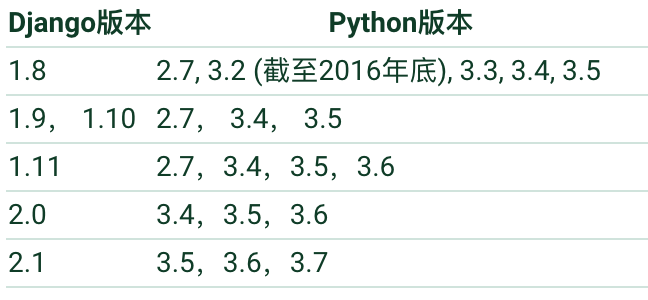
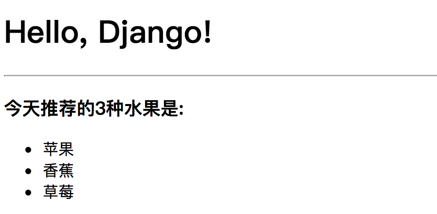

## Django实战(01) - 快速上手

Web开发的早期阶段，开发者需要手动编写每个页面，例如一个新闻门户网站，每天都要修改它的HTML页面，这样随着网站规模和体量的增大，这种方式就变得极度糟糕。为了解决这个问题，开发人员想到了用外部程序来为Web服务器生成动态内容，也就是说HTML页面以及页面中的动态内容不再通过手动编写而是通过程序自动生成。最早的时候，这项技术被称为CGI（公共网关接口），当然随着时间的推移，CGI暴露出的问题也越来越多，例如大量重复的样板代码，总体性能较为低下等，因此在呼唤新的英雄的时代，PHP、ASP、JSP这类Web应用开发技术在上世纪90年代中后期如雨后春笋般涌现。通常我们说的Web应用是指通过浏览器来访问网络资源的应用程序，因为浏览器的普及性以及易用性，Web应用使用起来方便简单，而且在应用更新时用户通常不需要做任何的处理就能使用更新后的应用，而且也不用关心用户到底用的是什么操作系统，甚至不用区分是PC端还是移动端。

### Web应用机制和术语

下图向我们展示了Web应用的工作流程，其中涉及到的术语如下表所示。


| 术语          | 解释                                                         |
| ------------- | ------------------------------------------------------------ |
| **URL/URI**   | 统一资源定位符/统一资源标识符，网络资源的唯一标识            |
| **域名**      | 与Web服务器地址对应的一个易于记忆的字符串名字                |
| **DNS**       | 域名解析服务，可以将域名转换成对应的IP地址                   |
| **IP地址**    | 网络上的主机的身份标识，通过IP地址可以区分不同的主机         |
| **HTTP**      | 超文本传输协议，应用层协议，万维网数据通信的基础             |
| **反向代理**  | 代理客户端向服务器发出请求，然后将服务器返回的资源返回给客户端 |
| **Web服务器** | 接受HTTP请求，然后返回HTML文件、纯文本文件、图像等资源给请求者 |
| **Nginx**     | 高性能的Web服务器，也可以用作[反向代理](https://zh.wikipedia.org/wiki/%E5%8F%8D%E5%90%91%E4%BB%A3%E7%90%86)，[负载均衡](https://zh.wikipedia.org/wiki/%E8%B4%9F%E8%BD%BD%E5%9D%87%E8%A1%A1) 和 [HTTP缓存](https://zh.wikipedia.org/wiki/HTTP%E7%BC%93%E5%AD%98) |


### Python的Web框架

Python的Web框架有上百个，比它的关键字还要多。所谓Web框架，就是用于开发Web服务器端应用的基础设施（通常指封装好的模块和一系列的工具）。事实上，即便没有Web框架，我们仍然可以通过socket或[CGI](https://zh.wikipedia.org/wiki/%E9%80%9A%E7%94%A8%E7%BD%91%E5%85%B3%E6%8E%A5%E5%8F%A3)来开发Web服务器端应用，但是这样做的成本和代价在实际开发中通常是不能接受的。通过Web框架，我们可以化繁为简，同时降低创建、更新、扩展应用程序的工作量。Python的Web框架中比较有名的有：Flask、Django、Tornado、Pyramid、Bottle、Web2py、web.py等。

### Django概述

在基于Python的Web框架中，Django是所有重量级选手中最有代表性的一位，开发者可以基于Django快速的开发可靠的Web应用程序，因为它减少了Web开发中不必要的开销，对常用的设计和开发模式进行了封装，并对MVC架构提供了支持（MTV）。许多成功的网站和App都是基于Django框架构建的，国内比较有代表性的网站包括：知乎、豆瓣网、果壳网、搜狐闪电邮箱、101围棋网、海报时尚网、背书吧、堆糖、手机搜狐网、咕咚、爱福窝、果库等。


Django诞生于2003年，它是一个在真正的应用中成长起来的项目，由劳伦斯出版集团旗下在线新闻网站的内容管理系统（CMS）研发团队编写（主要是Adrian Holovaty和Simon Willison），以比利时的吉普赛爵士吉他手Django Reinhardt来命名，在2005年夏天作为开源框架发布。使用Django能用很短的时间构建出功能完备的网站，因为它代替程序员完成了所有乏味和重复的劳动，剩下真正有意义的核心业务给程序员，这一点就是对DRY（Don't Repeat Yourself）理念的最好践行。

### 快速上手

#### 准备工作

1. 检查Python环境：Django 1.11需要Python 2.7或Python 3.4以上的版本；Django 2.0需要Python 3.4以上的版本。

   ```Shell
   $ python3 --version
   ```

   ```Shell
   $ python3
   >>> import sys
   >>> sys.version
   >>> sys.version_info
   ```

2. 创建项目文件夹并切换到该目录。

   ```Shell
   $ mkdir hello_django
   $ cd hello_django
   ```

3. 创建并激活虚拟环境。

   ```Shell
   $ python3 -m venv venv
   $ source venv/bin/activate
   ```
   > 注意：Windows系统下是执行`venv/Scripts/activate.bat`批处理文件。

4. 更新包管理工具pip。

   ```Shell
   (venv)$ python -m pip install --upgrade pip
   ```
   > 注意：虚拟环境下的python和pip已经是Python 3的解释器和包管理工具了。

5. 安装Django。

   ```Shell
   (venv)$ pip install django
   ```

   或

   ```Shell
   (venv)$ pip install django==1.11
   ```

6. 检查Django的版本。

   ```Shell
   (venv)$ python -m django --version
   (venv)$ django-admin --version
   ```

   ```Shell
   (venv)$ python
   >>> import django
   >>> django.get_version()
   ```
   

7. 使用`django-admin`创建项目。

   ```Shell
   (venv)$ django-admin startproject hello_django .
   ```

   > 注意：上面的命令最后的.表示在当前路径下创建项目。

   执行上面的命令后看看生成的文件和文件夹，它们的作用如下所示：

   - `manage.py`： 一个让你用各种方式管理 Django 项目的命令行工具。
   - `hello_django/__init__.py`：一个空文件，告诉 Python 这个目录应该被认为是一个 Python 包。
   - `hello_django/settings.py`：Django 项目的配置文件。
   - `hello_django/urls.py`：Django 项目的 URL 声明，就像你网站的“目录”。
   - `hello_django/wsgi.py`：作为你的项目的运行在 WSGI 兼容的Web服务器上的入口。

8. 启动服务器运行项目。

   ```Shell
   (venv)$ python manage.py runserver
   ```

   > 说明1：刚刚启动的是Django自带的用于开发和测试的服务器，它是一个用纯Python编写的轻量级Web服务器，但它并不是真正意义上的生产级别的服务器，千万不要将这个服务器用于和生产环境相关的任何地方。

   > 说明2：用于开发的服务器在需要的情况下会对每一次的访问请求重新载入一遍Python代码。所以你不需要为了让修改的代码生效而频繁的重新启动服务器。然而，一些动作，比如添加新文件，将不会触发自动重新加载，这时你得自己手动重启服务器。

   > 说明3：可以通过`python manage.py help`命令查看可用命令列表；在启动服务器时，也可以通过`python manage.py runserver 1.2.3.4:56789`来指定绑定的IP地址和端口。

9. 创建应用程序（一个项目可以包含多个应用程序）。

   ```Shell
   (venv)$ python manage.py startapp hrs
   ```

   创建的目录结构如下所示：

   - `__init__.py`：一个空文件，告诉 Python 这个目录应该被认为是一个 Python 包。
   - `admin.py`：可以用来注册模型，让Django自动创建管理界面。
   -  `apps.py`：当前应用的配置。
   - `migrations`：存放与模型有关的数据库信息。
     - `__init__.py`：略过。
   - `models.py`：存放应用的数据模型，即实体类及其之间的关系（MVC/MVT中的M）。
   - `tests.py`：测试应用的各种测试函数。
   - `views.py`：处理请求并返回响应的函数（MVC中的C，MVT中的V）。

#### 动态页面

1. 进入应用目录修改视图文件views.py。

   ```Shell
   (venv)$ cd hrs
   (venv)$ vim views.py
   ```

   ```Python
   from django.http import HttpResponse
   
   
   def index(request):
       return HttpResponse('<h1>Hello, Django!</h1>')
   
   ```

2. 在应用目录创建一个urls.py文件并映射URL。

   ```Shell
   (venv)$ touch urls.py
   (venv)$ vim urls.py
   ```

   ```Python
   from django.urls import path
   
   from hrs import views
   
   urlpatterns = [
       path('', views.index, name='index'),
   ]
   ```
   > 说明：上面使用的path函数是Django 2.0中新添加的函数，除此之外还有re_path是支持正则表达式的URL映射函数；Django 1.x中是用url函数来设定URL映射。

3. 切换到项目目录，修改该目录下的urls.py文件合并应用中设定的URL。

   ```Shell
   (venv) $ cd ..
   (venv) $ cd hello_django
   (venv) $ vim urls.py
   ```

   ```Python
   from django.contrib import admin
   from django.urls import path, include
   
   urlpatterns = [
       path('admin/', admin.site.urls),
       path('hrs/', include('hrs.urls')),
   ]
   ```

4. 启动项目并访问应用。

   ```Shell
   (venv)$ python manage.py runserver
   ```

   在浏览器中访问<http://localhost:8000/hrs>。

   > 说明：如果想实现远程访问，需要先确认防火墙是否已经打开了8000端口，而且需要在配置文件settings.py中修改ALLOWED_HOSTS的设置，添加一个'*'表示允许所有的客户端访问Web应用。

5. 修改views.py生成动态内容。

   ```Shell
   (venv)$ cd hrs
   (venv)$ vim views.py
   ```

   ```Python
   from django.http import HttpResponse
   
   from io import StringIO
   from random import randrange
   
   fruits = ['苹果', '草莓', '榴莲', '香蕉', '葡萄', '山竹', '蓝莓', '西瓜']
   
   
   def index(request):
       output = StringIO()
       output.write('<html>\n')
       output.write('<head>\n')
       output.write('\t<meta charset="utf-8">\n')
       output.write('\t<title>首页</title>')
       output.write('</head>\n')
       output.write('<body>\n')
       output.write('\t<h1>Hello, world!</h1>\n')
       output.write('\t<hr>\n')
       output.write('\t<ol>\n')
       for _ in range(3):
           rindex = randrange(0, len(fruits))
           output.write('\t\t<li>' + fruits[rindex]  + '</li>\n')
       output.write('\t</ol>\n')
       output.write('</body>\n')
       output.write('</html>\n')
       return HttpResponse(output.getvalue())
   
   ```

#### 使用视图模板

上面生成动态视图的方式在实际开发中是无法接受的，为了解决这个问题，我们可以提前准备一个模板页，所谓模板页就是一个带占位符的HTML页面，当我们将程序中获得的数据替换掉占位符的时候，一个动态页面就生成好了。

可以用Django框架中template模块的Template类创建模板对象，通过模板对象的render方法实现对模板的渲染。所谓的渲染就是用数据替换掉模板页中的占位符，Django框架通过shortcuts模块的快捷函数render简化了渲染模板的操作，具体的用法如下所示。

1. 先回到manage.py文件所在的目录创建一个templates文件夹。

   ```Shell
   (venv)$ cd ..
   (venv)$ mkdir templates
   (venv)$ cd templates
   ```

2. 创建模板页index.html。

   ```Shell
   (venv)$ touch index.html
   (venv)$ vim index.html
   ```
   ```HTML
   <!DOCTYPE html>
   <html lang="en">
   <head>
   	<meta charset="UTF-8">
   	<title>首页</title>
   </head>
   <body>
   	<h1>{{ greeting }}</h1>
   	<hr>
   	<h3>今天推荐3种水果是:</h3>
   	<ul>
   		
   		<li>{{ fruit }}</li>
   		
   	</ul>
   </body>
   </html>
   ```

3. 回到应用目录，修改views.py文件。

   ```Shell
   (venv)$ cd ..
   (venv)$ cd hrs
   (venv)$ vim views.py
   ```

   ```Python
   from django.shortcuts import render
   from random import randrange
   
   
   def index(request):
       fruits = ['苹果', '香蕉', '草莓', '葡萄', '山竹', '杨梅', '西瓜', '榴莲']
       start, end = 0, randrange(len(fruits))
       ctx = {
           'greeting': 'Hello, Django!',
           'num': end + 1,
           'fruits': fruits[start:end + 1]
       }
       return render(request, 'index.html', ctx)
   
   ```

   到这里我们还没有办法让视图找到模板文件index.html，需要修改settings.py配置模板文件所在的路径。

4. 切换到项目目录修改settings.py文件。

   ```Shell
   (venv)$ cd ..
   (venv)$ cd hello_django
   (venv)$ vim settings.py
   ```

   ```Python
   # 此处省略上面的内容
   
   TEMPLATES = [
       {
           'BACKEND': 'django.template.backends.django.DjangoTemplates',
           'DIRS': [os.path.join(BASE_DIR, 'templates')],
           'APP_DIRS': True,
           'OPTIONS': {
               'context_processors': [
                   'django.template.context_processors.debug',
                   'django.template.context_processors.request',
                   'django.contrib.auth.context_processors.auth',
                   'django.contrib.messages.context_processors.messages',
               ],
           },
       },
   ]
   
   # 此处省略下面的内容
   ```

5. 重新运行项目查看结果。

   ```Shell
   (venv)$ python manage.py runserver
   ```

   
