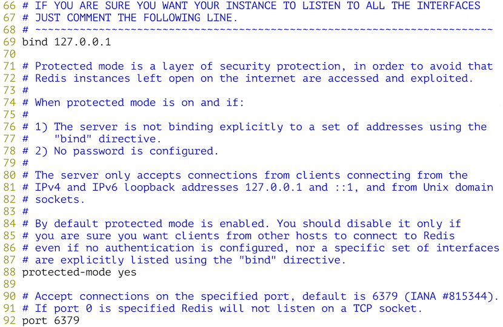
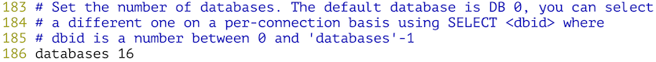
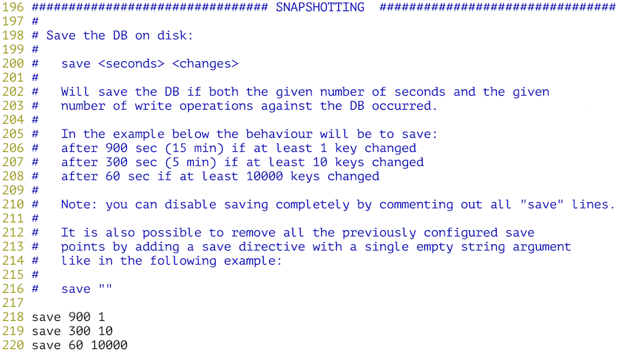
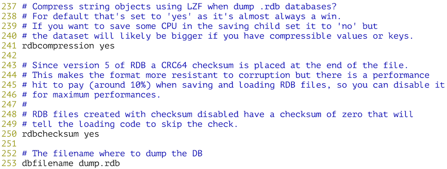
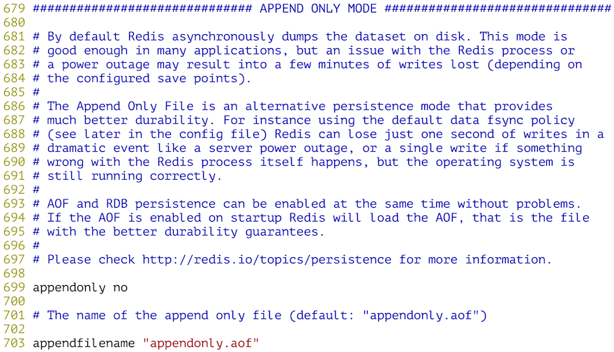
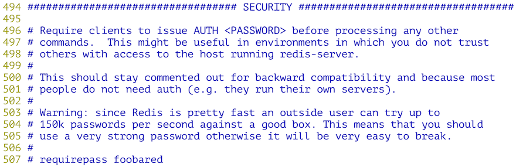
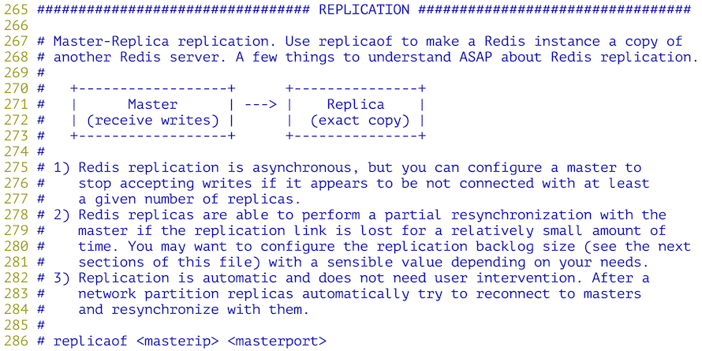
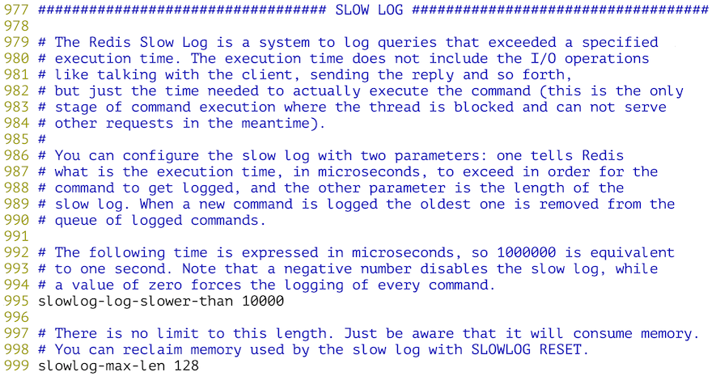
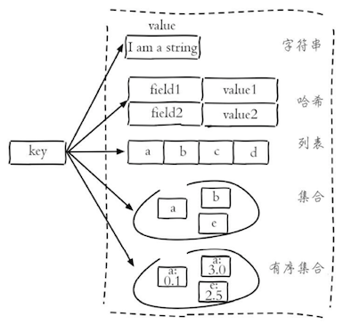

## NoSQL入门

### NoSQL概述

如今，大多数的计算机系统（包括服务器、PC、移动设备等）都会产生庞大的数据量。其实，早在2012年的时候，全世界每天产生的数据量就达到了2.5EB（艾字节，$$1EB\approx10^{18}B$$）。这些数据有很大一部分是由关系型数据库来存储和管理的。 早在1970年，E.F.Codd发表了论述关系型数据库的著名论文“*A relational model of data for large shared data banks*”，这篇文章奠定了关系型数据库的基础并在接下来的数十年时间内产生了深远的影响。实践证明，关系型数据库是实现数据持久化最为重要的方式，它也是大多数应用在选择持久化方案时的首选技术。

NoSQL是一项全新的数据库革命性运动，虽然它的历史可以追溯到1998年，但是NoSQL真正深入人心并得到广泛的应用是在进入大数据时候以后，业界普遍认为NoSQL是更适合大数据存储的技术方案，这才使得NoSQL的发展达到了前所未有的高度。2012年《纽约时报》的一篇专栏中写到，大数据时代已经降临，在商业、经济及其他领域中，决策将不再基于经验和直觉而是基于数据和分析而作出。事实上，在天文学、气象学、基因组学、生物学、社会学、互联网搜索引擎、金融、医疗、社交网络、电子商务等诸多领域，由于数据过于密集和庞大，在数据的分析和处理上也遇到了前所未有的限制和阻碍，这一切都使得对大数据处理技术的研究被提升到了新的高度，也使得各种NoSQL的技术方案进入到了公众的视野。

NoSQL数据库按照其存储类型可以大致分为以下几类：

| 类型       | 部分代表                            | 特点                                                         |
| ---------- | ----------------------------------- | ------------------------------------------------------------ |
| 列族数据库 | HBase<br>Cassandra<br>Hypertable    | 顾名思义是按列存储数据的。最大的特点是方便存储结构化和半结构化数据，方便做数据压缩，对针对某一列或者某几列的查询有非常大的I/O优势，适合于批量数据处理和即时查询。 |
| 文档数据库 | MongoDB<br>CouchDB<br>ElasticSearch | 文档数据库一般用类JSON格式存储数据，存储的内容是文档型的。这样也就有机会对某些字段建立索引，实现关系数据库的某些功能，但不提供对参照完整性和分布事务的支持。 |
| KV数据库   | DynamoDB<br>Redis<br>LevelDB        | 可以通过key快速查询到其value，有基于内存和基于磁盘两种实现方案。 |
| 图数据库   | Neo4J<br>FlockDB<br>JanusGraph      | 使用图结构进行语义查询的数据库，它使用节点、边和属性来表示和存储数据。图数据库从设计上，就可以简单快速的检索难以在关系系统中建模的复杂层次结构。 |
| 对象数据库 | db4o<br>Versant                     | 通过类似面向对象语言的语法操作数据库，通过对象的方式存取数据。 |

> 说明：想了解更多的NoSQL数据库，可以访问<http://nosql-database.org/>。

### Redis概述

Redis是一种基于键值对的NoSQL数据库，它提供了对多种数据类型（字符串、哈希、列表、集合、有序集合、位图等）的支持，能够满足很多应用场景的需求。Redis将数据放在内存中，因此读写性能是非常惊人的。与此同时，Redis也提供了持久化机制，能够将内存中的数据保存到硬盘上，在发生意外状况时数据也不会丢掉。此外，Redis还支持键过期、地理信息运算、发布订阅、事务、管道、Lua脚本扩展等功能，总而言之，Redis的功能和性能都非常强大，如果项目中要实现高速缓存和消息队列这样的服务，直接交给Redis就可以了。目前，国内外很多著名的企业和商业项目都使用了Redis，包括：Twitter、Github、StackOverflow、新浪微博、百度、优酷土豆、美团、小米、唯品会等。


#### Redis简介

2008年，一个名为Salvatore Sanfilippo的程序员为他开发的LLOOGG项目定制了专属的数据库（因为之前他无论怎样优化MySQL，系统性能已经无法再提升了），这项工作的成果就是Redis的初始版本。后来他将Redis的代码放到了全球最大的代码托管平台[Github](<https://github.com/antirez/redis>)，从那以后，Redis引发了大量开发者的好评和关注，继而有数百人参与了Redis的开发和维护，这使得Redis的功能越来越强大和性能越来越好。

Redis是REmote DIctionary Server的缩写，它是一个用ANSI C编写的高性能的key-value存储系统，与其他的key-value存储系统相比，Redis有以下一些特点（也是优点）：

- Redis的读写性能极高，并且有丰富的特性（发布/订阅、事务、通知等）。
- Redis支持数据的持久化（RDB和AOF两种方式），可以将内存中的数据保存在磁盘中，重启的时候可以再次加载进行使用。
- Redis支持多种数据类型，包括：string、hash、list、set，zset、bitmap、hyperloglog等。
- Redis支持主从复制（实现读写分析）以及哨兵模式（监控master是否宕机并自动调整配置）。
- Redis支持分布式集群，可以很容易的通过水平扩展来提升系统的整体性能。
- Redis基于TCP提供的可靠传输服务进行通信，很多编程语言都提供了Redis客户端支持。

#### Redis的应用场景

1. 高速缓存  - 将不常变化但又经常被访问的热点数据放到Redis数据库中，可以大大降低关系型数据库的压力，从而提升系统的响应性能。
2. 排行榜 - 很多网站都有排行榜功能，利用Redis中的列表和有序集合可以非常方便的构造各种排行榜系统。
3. 商品秒杀/投票点赞 - Redis提供了对计数操作的支持，网站上常见的秒杀、点赞等功能都可以利用Redis的计数器通过+1或-1的操作来实现，从而避免了使用关系型数据的`update`操作。
4. 分布式锁 - 利用Redis可以跨多台服务器实现分布式锁（类似于线程锁，但是能够被多台机器上的多个线程或进程共享）的功能，用于实现一个阻塞式操作。
5. 消息队列 - 消息队列和高速缓存一样，是一个大型网站不可缺少的基础服务，可以实现业务解耦和非实时业务削峰等特性，这些我们都会在后面的项目中为大家展示。

#### Redis的安装和配置

可以使用Linux系统的包管理工具（如yum）来安装Redis，也可以通过在Redis的[官方网站](https://redis.io/)下载Redis的源代码，解压缩解归档之后通过make工具对源代码进行构建并安装，在更新这篇文档时，Redis官方提供的最新稳定版本是[Redis 5.0.4](http://download.redis.io/releases/redis-5.0.4.tar.gz)。

```Shell
wget http://download.redis.io/releases/redis-5.0.4.tar.gz
gunzip redis-5.0.4.tar.gz
tar -xvf redis-5.0.4.tar
cd redis-5.0.4
make && make install
```

在redis源代码目录下有一个名为redis.conf的配置文件，我们可以先查看一下该文件。

```Shell
vim redis.conf
```

配置将Redis服务绑定到指定的IP地址和端口。



配置底层有多少个数据库。



配置Redis的持久化机制 - RDB。





配置Redis的持久化机制 - AOF。



配置访问Redis服务器的验证口令。



配置Redis的主从复制，通过主从复制可以实现读写分离。



配置慢查询。



上面这些内容就是Redis的基本配置，如果你对上面的内容感到困惑也没有关系，先把Redis用起来再回头去推敲这些内容就行了。如果想找一些参考书，[《Redis开发与运维》](https://item.jd.com/12121730.html)是一本不错的入门读物，而[《Redis实战》](https://item.jd.com/11791607.html)是不错的进阶读物。

#### Redis的服务器和客户端

接下来启动Redis服务器，下面的方式将以默认的配置启动Redis服务。

```Shell
redis-server
```

如果希望修改Redis的配置（如端口、认证口令、持久化方式等），可以通过下面两种方式。

方式一：通过参数指定认证口令和AOF持久化方式。

```Shell
redis-server --requirepass 1qaz2wsx --appendonly yes
```

方式二：通过指定的配置文件来修改Redis的配置。

```Shell
redis-server /root/redis-5.0.4/redis.conf
```

下面我们使用第一种方式来启动Redis并将其置于后台运行，将Redis产生的输出重定向到名为redis.log的文件中。

```Shell
redis-server --requirepass 1qaz2wsx > redis.log &
```

可以通过ps或者netstat来检查Redis服务器是否启动成功。

```Shell
ps -ef | grep redis-server
netstat -nap | grep redis-server
```

接下来，我们尝试用Redis客户端去连接服务器。

```Shell
redis-cli
127.0.0.1:6379> auth 1qaz2wsx
OK
127.0.0.1:6379> ping
PONG
127.0.0.1:6379>
```

Redis有着非常丰富的数据类型，也有很多的命令来操作这些数据，具体的内容可以查看[Redis命令参考](http://redisdoc.com/)，在这个网站上，除了Redis的命令参考，还有Redis的详细文档，其中包括了通知、事务、主从复制、持久化、哨兵、集群等内容。



> 说明：上面的插图来自付磊和张益军先生编著的《Redis开发与运维》一书。

```Shell
127.0.0.1:6379> set username admin
OK
127.0.0.1:6379> get username
"admin"
127.0.0.1:6379> set password "123456" ex 300
OK
127.0.0.1:6379> get password
"123456"
127.0.0.1:6379> ttl username
(integer) -1
127.0.0.1:6379> ttl password
(integer) 286
127.0.0.1:6379> hset stu1 name hao
(integer) 0
127.0.0.1:6379> hset stu1 age 38
(integer) 1
127.0.0.1:6379> hset stu1 gender male
(integer) 1
127.0.0.1:6379> hgetall stu1
1) "name"
2) "hao"
3) "age"
4) "38"
5) "gender"
6) "male"
127.0.0.1:6379> hvals stu1
1) "hao"
2) "38"
3) "male"
127.0.0.1:6379> hmset stu2 name wang age 18 gender female tel 13566778899
OK
127.0.0.1:6379> hgetall stu2
1) "name"
2) "wang"
3) "age"
4) "18"
5) "gender"
6) "female"
7) "tel"
8) "13566778899"
127.0.0.1:6379> lpush nums 1 2 3 4 5
(integer) 5
127.0.0.1:6379> lrange nums 0 -1
1) "5"
2) "4"
3) "3"
4) "2"
5) "1"
127.0.0.1:6379> lpop nums
"5"
127.0.0.1:6379> lpop nums
"4"
127.0.0.1:6379> rpop nums
"1"
127.0.0.1:6379> rpop nums
"2"
127.0.0.1:6379> sadd fruits apple banana orange apple grape grape
(integer) 4
127.0.0.1:6379> scard fruits
(integer) 4
127.0.0.1:6379> smembers fruits
1) "grape"
2) "orange"
3) "banana"
4) "apple"
127.0.0.1:6379> sismember fruits apple
(integer) 1
127.0.0.1:6379> sismember fruits durian
(integer) 0
127.0.0.1:6379> sadd nums1 1 2 3 4 5
(integer) 5
127.0.0.1:6379> sadd nums2 2 4 6 8
(integer) 4
127.0.0.1:6379> sinter nums1 nums2
1) "2"
2) "4"
127.0.0.1:6379> sunion nums1 nums2
1) "1"
2) "2"
3) "3"
4) "4"
5) "5"
6) "6"
7) "8"
127.0.0.1:6379> sdiff nums1 nums2
1) "1"
2) "3"
3) "5"
127.0.0.1:6379> zadd topsinger 5234 zhangxy 1978 chenyx 2235 zhoujl 3520 xuezq
(integer) 4
127.0.0.1:6379> zrange topsinger 0 -1 withscores
1) "chenyx"
2) "1978"
3) "zhoujl"
4) "2235"
5) "xuezq"
6) "3520"
7) "zhangxy"
8) "5234"
127.0.0.1:6379> zrevrange topsinger 0 -1
1) "zhangxy"
2) "xuezq"
3) "zhoujl"
4) "chenyx"
127.0.0.1:6379> geoadd pois 116.39738549206541 39.90862689286386 tiananmen 116.27172936413572 39.99
135172904494 yiheyuan 117.27766503308104 40.65332064313784 gubeishuizhen
(integer) 3
127.0.0.1:6379> geodist pois tiananmen gubeishuizhen km
"111.5333"
127.0.0.1:6379> geodist pois tiananmen yiheyuan km
"14.1230"
127.0.0.1:6379> georadius pois 116.86499108288572 40.40149669363615 50 km withdist
1) 1) "gubeishuizhen"
   2) "44.7408"
```

#### 在Python程序中使用Redis

可以使用pip安装redis模块。redis模块的核心是名为Redis的类，该类的对象代表一个Redis客户端，通过该客户端可以向Redis服务器发送命令并获取执行的结果。上面我们在Redis客户端中使用的命令基本上就是Redis对象可以接收的消息，所以如果了解了Redis的命令就可以在Python中玩转Redis。

```Shell
pip3 install redis
python3
```

```Python
>>> import redis
>>> client = redis.Redis(host='1.2.3.4', port=6379, password='1qaz2wsx')
>>> client.set('username', 'admin')
True
>>> client.hset('student', 'name', 'hao')
1
>>> client.hset('student', 'age', 38)
1
>>> client.keys('*')
[b'username', b'student']
>>> client.get('username')
b'admin'
>>> client.hgetall('student')
{b'name': b'hao', b'age': b'38'}
```

### MongoDB概述

#### MongoDB简介

MongoDB是2009年问世的一个面向文档的数据库管理系统，由C++语言编写，旨在为Web应用提供可扩展的高性能数据存储解决方案。虽然在划分类别的时候后，MongoDB被认为是NoSQL的产品，但是它更像一个介于关系数据库和非关系数据库之间的产品，在非关系数据库中它功能最丰富，最像关系数据库。

MongoDB将数据存储为一个文档，一个文档由一系列的“键值对”组成，其文档类似于JSON对象，但是MongoDB对JSON进行了二进制处理（能够更快的定位key和value），因此其文档的存储格式称为BSON。关于JSON和BSON的差别大家可以看看MongoDB官方网站的文章[《JSON and BSON》](https://www.mongodb.com/json-and-bson)。

目前，MongoDB已经提供了对Windows、MacOS、Linux、Solaris等多个平台的支持，而且也提供了多种开发语言的驱动程序，Python当然是其中之一。

#### MongoDB的安装和配置

可以从MongoDB的[官方下载链接](https://www.mongodb.com/download-center#community)下载MongoDB，官方为Windows系统提供了一个Installer程序，而Linux和MacOS则提供了压缩文件。下面简单说一下Linux系统如何安装和配置MongoDB。

```Shell
wget https://fastdl.mongodb.org/linux/mongodb-linux-x86_64-amazon-3.6.5.tgz
gunzip mongodb-linux-x86_64-amazon-3.6.5.tgz
mkdir mongodb-3.6.5
tar -xvf mongodb-linux-x86_64-amazon-3.6.5.tar --strip-components 1 -C mongodb-3.6.5/
export PATH=$PATH:~/mongodb-3.6.5/bin
mkdir -p /data/db
mongod --bind_ip 172.18.61.250

2018-06-03T18:03:28.232+0800 I CONTROL  [initandlisten] MongoDB starting : pid=1163 port=27017 dbpath=/data/db 64-bit host=iZwz97tbgo9lkabnat2lo8Z
2018-06-03T18:03:28.232+0800 I CONTROL  [initandlisten] db version v3.6.5
2018-06-03T18:03:28.232+0800 I CONTROL  [initandlisten] git version: a20ecd3e3a174162052ff99913bc2ca9a839d618
2018-06-03T18:03:28.232+0800 I CONTROL  [initandlisten] OpenSSL version: OpenSSL 1.0.0-fips29 Mar 2010
...
2018-06-03T18:03:28.945+0800 I NETWORK  [initandlisten] waiting for connections on port 27017
```

> 说明：上面的操作中，export命令是设置PATH环境变量，这样可以在任意路径下执行mongod来启动MongoDB服务器。MongoDB默认保存数据的路径是/data/db目录，为此要提前创建该目录。此外，在使用mongod启动MongoDB服务器时，--bind_ip参数用来将服务绑定到指定的IP地址，也可以用--port参数来指定端口，默认端口为27017。

#### MongoDB基本概念

我们通过与关系型数据库进行对照的方式来说明MongoDB中的一些概念。

| SQL         | MongoDB     | 解释（SQL/MongoDB）    |
| ----------- | ----------- | ---------------------- |
| database    | database    | 数据库/数据库          |
| table       | collection  | 二维表/集合            |
| row         | document    | 记录（行）/文档        |
| column      | field       | 字段（列）/域          |
| index       | index       | 索引/索引              |
| table joins | ---         | 表连接/嵌套文档        |
| primary key | primary key | 主键/主键（`_id`字段） |

#### 通过Shell操作MongoDB

启动服务器后可以使用交互式环境跟服务器通信，如下所示。

```shell
mongo --host 172.18.61.250

MongoDB shell version v3.6.5
connecting to: mongodb://172.18.61.250:27017/
```

1. 查看、创建和删除数据库。

   ```JavaScript
   > // 显示所有数据库
   > show dbs
   admin   0.000GB
   config  0.000GB
   local   0.000GB
   > // 创建并切换到school数据库
   > use school
   switched to db school
   > // 删除当前数据库
   > db.dropDatabase()
   { "ok" : 1 }
   >
   ```

2. 创建、删除和查看集合。

   ```JavaScript
   > // 创建并切换到school数据库
   > use school
   switched to db school
   > // 创建colleges集合
   > db.createCollection('colleges')
   { "ok" : 1 }
   > // 创建students集合
   > db.createCollection('students')
   { "ok" : 1 }
   > // 查看所有集合
   > show collections
   colleges
   students
   > // 删除colleges集合
   > db.colleges.drop()
   true
   > 
   ```

   > 说明：在MongoDB中插入文档时如果集合不存在会自动创建集合，所以也可以按照下面的方式通过创建文档来创建集合。

3. 文档的CRUD操作。

   ```JavaScript
   > // 向students集合插入文档
   > db.students.insert({stuid: 1001, name: '骆昊', age: 38})
   WriteResult({ "nInserted" : 1 })
   > // 向students集合插入文档
   > db.students.save({stuid: 1002, name: '王大锤', tel: '13012345678', gender: '男'})
   WriteResult({ "nInserted" : 1 })
   > // 查看所有文档
   > db.students.find()
   { "_id" : ObjectId("5b13c72e006ad854460ee70b"), "stuid" : 1001, "name" : "骆昊", "age" : 38 }
   { "_id" : ObjectId("5b13c790006ad854460ee70c"), "stuid" : 1002, "name" : "王大锤", "tel" : "13012345678", "gender" : "男" }
   > // 更新stuid为1001的文档
   > db.students.update({stuid: 1001}, {'$set': {tel: '13566778899', gender: '男'}})
   WriteResult({ "nMatched" : 1, "nUpserted" : 0, "nModified" : 1 })
   > // 插入或更新stuid为1003的文档
   > db.students.update({stuid: 1003}, {'$set': {name: '白元芳', tel: '13022223333', gender: '男'}},  upsert=true)
   WriteResult({
           "nMatched" : 0,
           "nUpserted" : 1,
           "nModified" : 0,
           "_id" : ObjectId("5b13c92dd185894d7283efab")
   })
   > // 查询所有文档
   > db.students.find().pretty()
   {
           "_id" : ObjectId("5b13c72e006ad854460ee70b"),
           "stuid" : 1001,
           "name" : "骆昊",
           "age" : 38,
           "gender" : "男",
           "tel" : "13566778899"
   }
   {
           "_id" : ObjectId("5b13c790006ad854460ee70c"),
           "stuid" : 1002,
           "name" : "王大锤",
           "tel" : "13012345678",
           "gender" : "男"
   }
   {
           "_id" : ObjectId("5b13c92dd185894d7283efab"),
           "stuid" : 1003,
           "gender" : "男",
           "name" : "白元芳",
           "tel" : "13022223333"
   }
   > // 查询stuid大于1001的文档
   > db.students.find({stuid: {'$gt': 1001}}).pretty()
   {
           "_id" : ObjectId("5b13c790006ad854460ee70c"),
           "stuid" : 1002,
           "name" : "王大锤",
           "tel" : "13012345678",
           "gender" : "男"
   }
   {
           "_id" : ObjectId("5b13c92dd185894d7283efab"),
           "stuid" : 1003,
           "gender" : "男",
           "name" : "白元芳",
           "tel" : "13022223333"
   }
   > // 查询stuid大于1001的文档只显示name和tel字段
   > db.students.find({stuid: {'$gt': 1001}}, {_id: 0, name: 1, tel: 1}).pretty()
   { "name" : "王大锤", "tel" : "13012345678" }
   { "name" : "白元芳", "tel" : "13022223333" }
   > // 查询name为“骆昊”或者tel为“13022223333”的文档
   > db.students.find({'$or': [{name: '骆昊'}, {tel: '13022223333'}]}, {_id: 0, name: 1, tel: 1}).pretty()
   { "name" : "骆昊", "tel" : "13566778899" }
   { "name" : "白元芳", "tel" : "13022223333" }
   > // 查询学生文档跳过第1条文档只查1条文档
   > db.students.find().skip(1).limit(1).pretty()
   {
           "_id" : ObjectId("5b13c790006ad854460ee70c"),
           "stuid" : 1002,
           "name" : "王大锤",
           "tel" : "13012345678",
           "gender" : "男"
   }
   > // 对查询结果进行排序(1表示升序，-1表示降序)
   > db.students.find({}, {_id: 0, stuid: 1, name: 1}).sort({stuid: -1})
   { "stuid" : 1003, "name" : "白元芳" }
   { "stuid" : 1002, "name" : "王大锤" }
   { "stuid" : 1001, "name" : "骆昊" }
   > // 在指定的一个或多个字段上创建索引
   > db.students.ensureIndex({name: 1})
   {
           "createdCollectionAutomatically" : false,
           "numIndexesBefore" : 1,
           "numIndexesAfter" : 2,
           "ok" : 1
   }
   > 
   ```

使用MongoDB可以非常方便的配置数据复制，通过冗余数据来实现数据的高可用以及灾难恢复，也可以通过数据分片来应对数据量迅速增长的需求。关于MongoDB更多的操作可以查阅[官方文档](https://mongodb-documentation.readthedocs.io/en/latest/) ，同时推荐大家阅读Kristina Chodorow写的[《MongoDB权威指南》](http://www.ituring.com.cn/book/1172)。

#### 在Python程序中操作MongoDB

可以通过pip安装pymongo来实现对MongoDB的操作。

```Shell
pip3 install pymongo
python3
```

```Python
>>> from pymongo import MongoClient
>>> client = MongoClient('mongodb://127.0.0.1:27017') 
>>> db = client.school
>>> for student in db.students.find():
...     print('学号:', student['stuid'])
...     print('姓名:', student['name'])
...     print('电话:', student['tel'])
... 
学号: 1001.0
姓名: 骆昊
电话: 13566778899
学号: 1002.0
姓名: 王大锤
电话: 13012345678
学号: 1003.0
姓名: 白元芳
电话: 13022223333
>>> db.students.find().count()
3
>>> db.students.remove()
{'n': 3, 'ok': 1.0}
>>> db.students.find().count()
0
>>> coll = db.students
>>> from pymongo import ASCENDING
>>> coll.create_index([('name', ASCENDING)], unique=True)
'name_1'
>>> coll.insert_one({'stuid': int(1001), 'name': '骆昊', 'gender': True})
<pymongo.results.InsertOneResult object at 0x1050cc6c8>
>>> coll.insert_many([{'stuid': int(1002), 'name': '王大锤', 'gender': False}, {'stuid': int(1003), 'name': '白元芳', 'gender': True}])
<pymongo.results.InsertManyResult object at 0x1050cc8c8>
>>> for student in coll.find({'gender': True}):
...     print('学号:', student['stuid'])
...     print('姓名:', student['name'])
...     print('性别:', '男' if student['gender'] else '女')
... 
学号: 1001
姓名: 骆昊
性别: 男
学号: 1003
姓名: 白元芳
性别: 男
>>> 
```

关于PyMongo更多的知识可以通过它的[官方文档](https://api.mongodb.com/python/current/tutorial.html)进行了解，也可以使用[MongoEngine](<https://pypi.org/project/mongoengine/>)这样的库来简化Python程序对MongoDB的操作，除此之外，还有以异步I/O方式访问MongoDB的三方库[motor](<https://pypi.org/project/motor/>)都是不错的选择。