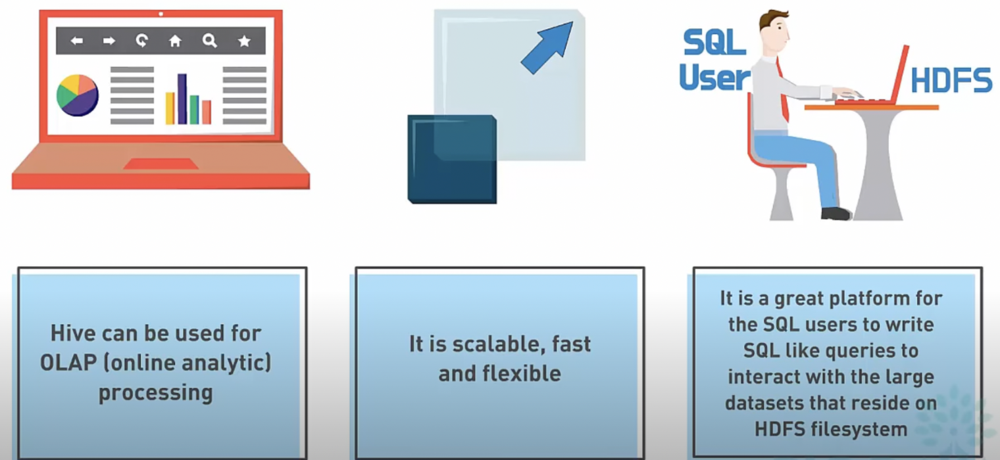
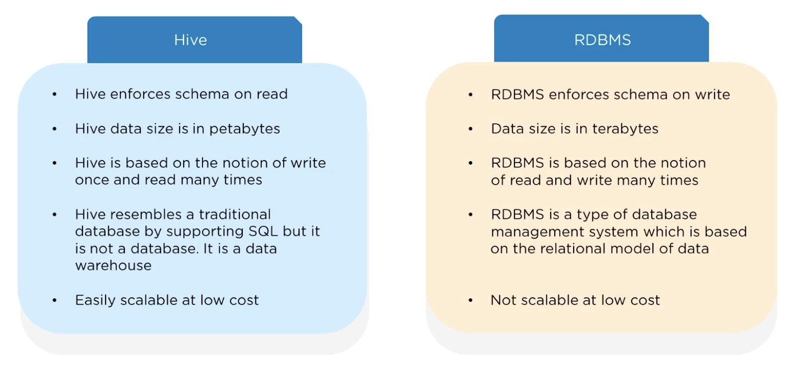
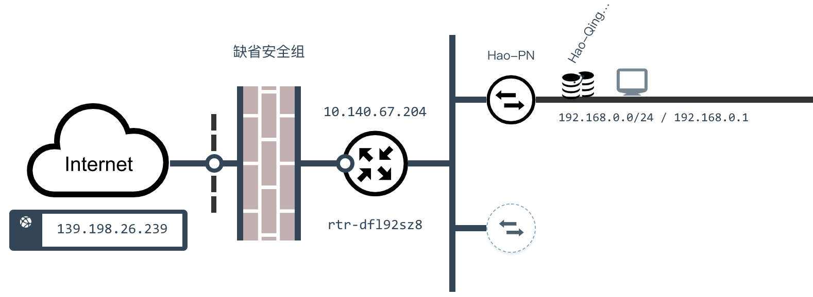
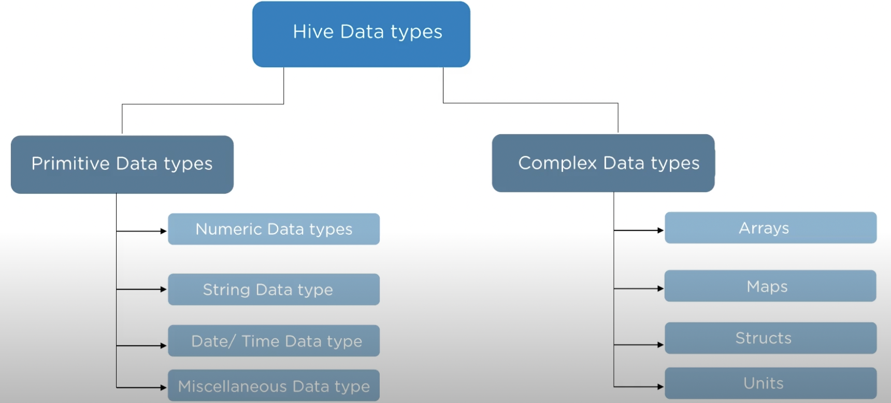

## Hive简介

[Hive](https://hive.apache.org/) 是 Facebook 开源的一款基于 Hadoop 的数据仓库工具，目前由 Apache 软件基金会维护，它是应用最广泛的大数据处理解决方案，它能将 SQL 查询转变为 MapReduce（Google提出的一个软件架构，用于大规模数据集的并行运算）任务，对 SQL 提供了完美的支持，能够非常方便的实现大数据统计。


> **说明**：可以通过<https://www.edureka.co/blog/hadoop-ecosystem>来了解 Hadoop 生态圈。

如果要简单的介绍 Hive，那么以下两点是其核心：

1. 把 HDFS 中结构化的数据映射成表。
2. 通过把 HQL 进行解析和转换，最终生成一系列基于 Hadoop 的 MapReduce 任务或 Spark 任务，通过执行这些任务完成对数据的处理。也就是说，即便不学习 Java、Scala 这样的编程语言，一样可以实现对数据的处理。

Hive的应用场景。




Hive和传统关系型数据库的对比如下图和下表所示。



|          | Hive              | RDBMS        |
| -------- | ----------------- | ------------ |
| 查询语言 | HQL               | SQL          |
| 存储数据 | HDFS              | 本地文件系统 |
| 执行方式 | MapReduce / Spark | Executor     |
| 执行延迟 | 高                | 低           |
| 数据规模 | 大                | 小           |

### 准备工作

1. 搭建如下图所示的大数据平台。

    

2. 通过Client节点（跳板机）访问大数据平台。

    

3. 创建文件Hadoop的文件系统。

    ```Shell
    hdfs dfs -mkdir /user/root
    ```

4. 将准备好的数据文件拷贝到Hadoop文件系统中。

    ```Shell
    hdfs dfs -put /home/ubuntu/data/* /user/root
    ```

5. 进入 hive 命令行。

    ```Shell
    hive
    ```

### 建库建表

1. 创建。

    ```SQL
    create database eshop;
    ```

2. 删除。

    ```SQL
    drop database eshop cascade;
    ```

3. 切换。

    ```SQL
    use eshop;
    ```

#### 数据类型

Hive的数据类型如下所示。



基本数据类型：

| 数据类型  | 占用空间 | 支持版本 |
| --------- | -------- | -------- |
| tinyint   | 1-Byte   |          |
| smallint  | 2-Byte   |          |
| int       | 4-Byte   |          |
| bigint    | 8-Byte   |          |
| boolean   |          |          |
| float     | 4-Byte   |          |
| double    | 8-Byte   |          |
| string    |          |          |
| binary    |          | 0.8版本  |
| timestamp |          | 0.8版本  |
| decimal   |          | 0.11版本 |
| char      |          | 0.13版本 |
| varchar   |          | 0.12版本 |
| date      |          | 0.12版本 |

复合数据类型：

| 数据类型 | 描述                     | 例子                                          |
| -------- | ------------------------ | --------------------------------------------- |
| struct   | 和C语言中的结构体类似    | `struct<first_name:string, last_name:string>` |
| map      | 由键值对构成的元素的集合 | `map<string,int>`                             |
| array    | 具有相同类型的变量的容器 | `array<string>`                               |

4. 创建内部表。

    ```SQL
    create table if not exists dim_user_info 
    (
    user_id string,
    user_name string, 
    sex string,
    age int,
    city string,
    firstactivetime string,
    level int,
    extra1 string,
    extra2 map<string,string>
    )
    row format delimited fields terminated by '\t'
    collection items terminated by ','
    map keys terminated by ':'
    lines terminated by '\n'
    stored as textfile;
    ```

5. 加载数据。

    ```SQL
    load data local inpath '/home/ubuntu/data/user_info/user_info.txt' overwrite into table dim_user_info;
    ```

    或

    ```SQL
    load data inpath '/user/root/user_info.txt' overwrite into table dim_user_info;
    ```

6. 创建分区表。

    ```SQL
    create table if not exists fact_user_trade 
    (
    user_name string,
    piece int,
    price double,
    pay_amount double,
    goods_category string,
    pay_time bigint
    )  
    partitioned by (dt string)
    row format delimited fields terminated by '\t';
    ```

7. 提供分区数据。

    ```Shell
    hdfs dfs -put /home/ubuntu/data/user_trade/* /user/hive/warehouse/eshop.db/fact_user_trade
    ```

8. 设置动态分区。

    ```SQL
    set hive.exec.dynamic.partition=true;
    set hive.exec.dynamic.partition.mode=nonstrict;
    set hive.exec.max.dynamic.partitions=10000;
    set hive.exec.max.dynamic.partitions.pernode=10000;
    ```

9. 修复分区。

    ```SQL
    msck repair table fact_user_trade;
    ```

### 查询

#### 基本语法

```SQL
-- 查询北京女用户的姓名取前10个
select user_name from dim_user_info where city='beijing' and sex='female' limit 10;

-- 查询2019年3月24日购买了food类商品的用户名、购买数量和支付金额（不聚合）
select user_name, piece, pay_amount from fact_user_trade where dt='2019-03-24' and goods_category='food';

-- 统计用户 ELLA 在2018年的总支付金额和最近最远两次消费间隔天数
select sum(pay_amount) as total, datediff(max(from_unixtime(pay_time, 'yyyy-MM-dd')), min(from_unixtime(pay_time, 'yyyy-MM-dd'))) from fact_user_trade where year(dt)='2018' and user_name='ELLA';
```

#### group by

```SQL
-- 查询2019年1月到4月，每个品类有多少人购买，累计金额是多少
select goods_category, count(distinct user_name) as total_user, sum(pay_amount) as total_pay from fact_user_trade where dt between '2019-01-01' and '2019-04-30' group by goods_category;
```

```SQL
-- 查询2019年4月支付金额超过5万元的用户
select user_name, sum(pay_amount) as total from fact_user_trade where dt between '2019-04-01' and '2019-04-30' group by user_name having sum(pay_amount) > 50000;
```

```hive
-- 查询2018年购买的商品品类在两个以上的用户数
select count(tmp.user_name) from (select user_name, count(distinct goods_category) as total from fact_user_trade where year(dt)='2018' group by user_name having count(distinct goods_category)>2) tmp;
```

#### order by

```SQL
-- 查询2019年4月支付金额最多的用户前5名
select user_name, sum(pay_amount) as total from fact_user_trade where dt between '2019-04-01' and '2019-04-30' group by user_name order by total desc limit 5;
```

#### 常用函数

1. `from_unixtime`：将时间戳转换成日期

    ```hive
    select from_unixtime(pay_time, 'yyyy-MM-dd hh:mm:ss') from fact_user_trade limit 10;
    ```

2. `unix_timestamp`：将日期转换成时间戳

3. `datediff`：计算两个日期的时间差

    ```Hive
    -- 用户首次激活时间与设定参照时间的间隔
    select user_name, datediff('2019-4-1', to_date(firstactivetime)) from dim_user_info limit 10;
    ```

4. `if`：根据条件返回不同的值

    ```Hive
    -- 统计不同年龄段的用户数
    select case when age < 20 then '20岁以下' when age < 30 then '30岁以下' when age < 40 then '40岁以下' else '40岁以上' end as age_seg, count(distinct user_id) as total from dim_user_info group by case when age < 20 then '20岁以下' when age < 30 then '30岁以下' when age < 40 then '40岁以下' else '40岁以上' end;
    ```

    ```Hive
    -- 不同性别高级等用户数量
    select sex, if(level > 5, '高', '低') as level_type, count(distinct user_id) as total from dim_user_info group by sex, if(level > 5, '高', '低');
    ```

5. `substr`：字符串取子串

    ```Hive
    -- 统计每个月激活的新用户数
    select substr(firstactivetime, 1, 7) as month, count(distinct user_id) as total from dim_user_info group by substr(firstactivetime, 1, 7);
    ```

6. `get_json_object`：从JSON字符串中取出指定的`key`对应的`value`，如：`get_json_object(info, '$.first_name')`。

    ```Hive
    -- 统计不同手机品牌的用户数
    select get_json_object(extra1, '$.phonebrand') as phone, count(distinct user_id) as total from user_info group by get_json_object(extra1, '$.phonebrand');
    
    select extra2['phonebrand'] as phone, count(distinct user_id) as total from user_info group by extra2['phonebrand'];
    ```

    > 说明：MySQL对应的函数名字叫`json_extract`。
