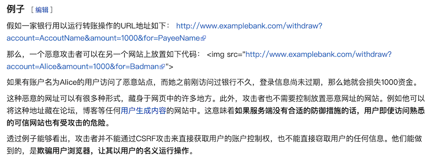

## 表单的应用

我们继续来完成上一章节中的项目，实现“用户注册”和“用户登录”的功能，并限制只有登录的用户才能为老师投票。Django框架中提供了对表单的封装，而且提供了多种不同的使用方式。

首先添加用户模型。

```Python
class User(models.Model):
    """用户"""
    no = models.AutoField(primary_key=True, verbose_name='编号')
    username = models.CharField(max_length=20, unique=True, verbose_name='用户名')
    password = models.CharField(max_length=32, verbose_name='密码')
    regdate = models.DateTimeField(auto_now_add=True, verbose_name='注册时间')

    class Meta:
        db_table = 'tb_user'
        verbose_name_plural = '用户'
```

通过生成迁移和执行迁移操作，在数据库中创建对应的用户表。

```Shell
python manage.py makemigrations 应用名
python manage.py migrate
```

定制一个非常简单的注册模板页面。

```HTML
<!DOCTYPE html>
<html lang="en">
<head>
    <meta charset="UTF-8">
    <title>用户注册</title>
    <style>/* 此处省略层叠样式表选择器 */</style>
</head>
<body>
    <h1>用户注册</h1>
    <hr>
    <p class="hint">{{ hint }}</p>
    <form action="/register/" method="post">
        
        <div class="input">
            <label for="username">用户名：</label>
            <input type="text" id="username" name="username">
        </div>
        <div class="input">
            <label for="password">密码：</label>
            <input type="password" id="password" name="password">
        </div>
        <div class="input">
            <label for="repassword">确认密码：</label>
            <input type="password" id="repassword" name="repassword">
        </div>
        <div class="input">
            <input type="submit" value="注册">
            <input type="reset" value="重置">
        </div>
    </form>
    <a href="/login">返回登录</a>
</body>
</html>
```

注意，在上面的表单中，我们使用了模板指令``为表单添加一个隐藏域（type属性值为hidden的input标签），它的作用是在表单中生成一个随机令牌（token）来防范[跨站请求伪造](<https://zh.wikipedia.org/wiki/%E8%B7%A8%E7%AB%99%E8%AF%B7%E6%B1%82%E4%BC%AA%E9%80%A0>)（通常简称为CSRF），这也是Django在提交表单时的硬性要求，除非我们专门设置了免除CSRF令牌。下图是一个关于CSRF简单生动的例子，它来自于[维基百科](<https://zh.wikipedia.org/wiki/Wikipedia:%E9%A6%96%E9%A1%B5>)。



用户在提交注册表单时，我们还需要对用户的输入进行验证，例如我们的网站要求用户名必须由字母、数字、下划线构成且长度在4-20个字符之间，密码的长度为8-20个字符，确认密码必须跟密码保持一致。这些验证操作首先可以通过浏览器中的JavaScript代码来完成，但是即便如此，在服务器端仍然要对用户输入再次进行验证来避免将无效的数据库交给数据库，因为用户可能会禁用浏览器的JavaScript功能，也有可能绕过浏览器的输入检查将注册数据提交给服务器，所以服务器端的用户输入检查仍然是必要的。

我们可以利用Django框架封装的表单功能来对用户输入的有效性进行检查，虽然Django封装的表单还能帮助我们定制出页面上的表单元素，但是这显然是一种灵活性很差的设计，这样的功能在实际开发中基本不考虑，所以表单主要的作用就在于数据验证，具体的做法如下所示。

```Python
USERNAME_PATTERN = re.compile(r'\w{4,20}')

class RegisterForm(forms.ModelForm):
    repassword = forms.CharField(min_length=8, max_length=20)
    
    def clean_username(self):
        username = self.cleaned_data['username']
        if not USERNAME_PATTERN.fullmatch(username):
            raise ValidationError('用户名由字母、数字和下划线构成且长度为4-20个字符')
        return username
        
    def clean_password(self):
        password = self.cleaned_data['password']
        if len(password) < 8 or len(password) > 20:
            raise ValidationError('无效的密码，密码长度为8-20个字符')
        return to_md5_hex(self.cleaned_data['password'])

    def clean_repassword(self):
        repassword = to_md5_hex(self.cleaned_data['repassword'])
        if repassword != self.cleaned_data['password']:
            raise ValidationError('密码和确认密码不一致')
        return repassword

    class Meta:
        model = User
        exclude = ('no', 'regdate')
```

上面，我们定义了一个与User模型绑定的表单（继承自ModelForm），我们排除了用户编号（no）和注册日期（regdate）这两个属性，并添加了一个repassword属性用来接收从用户表单传给服务器的确认密码。我们在定义User模型时已经对用户名的最大长度进行了限制，上面我们又对确认密码的最小和最大长度进行了限制，但是这些都不足以完成我们对用户输入的验证。上面以`clean_`打头的方法就是我们自定义的验证规则。很明显，`clean_username`是对用户名的检查，而`clean_password`是对密码的检查。由于数据库二维表中不应该保存密码的原文，所以对密码做了一个简单的MD5摘要处理，实际开发中这样处理还不太够，因为有被实施反向查表法（利用彩虹表反向查询）破解用户密码的风险。为字符串生成MD5摘要的代码如下所示。

```Python
def to_md5_hex(message):
    return hashlib.md5(message.encode()).hexdigest()
```

新增一个视图函数实现用户注册的功能。

```Python
def register(request):
    page, hint = 'register.html', ''
    if request.method == 'POST':
        form = RegisterForm(request.POST)
        if form.is_valid():
            form.save()
            page = 'login.html'
            hint = '注册成功，请登录'
        else:
            hint = '请输入有效的注册信息'
    return render(request, page, {'hint': hint})
```

如果用户发起GET请求，将直接跳转到注册的页面；如果用户以POST方式提交注册表单，则创建自定义的注册表单对象并获取用户输入。可以通过表单对象的`is_valid`方法对表单进行验证，如果用户输入没有问题，该方法返回True，否则返回False；由于我们定义的RegisterForm继承自ModelForm，因此也可以直接使用表单对象的`save`方法来保存模型。下面是注册请求的URL配置。

```Python
from django.contrib import admin
from django.urls import path

from vote import views

urlpatterns = [
    path('', views.show_subjects),
    path('captcha/', views.get_captcha),
    path('teachers/', views.show_teachers),
    path('prise/', views.praise_or_criticize),
    path('criticize/', views.praise_or_criticize),
    path('login/', views.login, name='login'),
    path('register/', views.register, name='register'),
    path('admin/', admin.site.urls),
]
```

> 说明：上面的代码中我们把待会要用到的登录和验证码的URL也顺便做了映射。`path`函数还可以通过name参数给URL绑定一个逆向解析的名字，也就是说，如果需要可以从后面给的名字逆向得到对应的URL。

我们再来定制一个非常简单的登录页。

```HTML
<!DOCTYPE html>
<html lang="en">
<head>
    <meta charset="UTF-8">
    <title>用户登录</title>
    <style>/* 此处省略层叠样式表选择器 */</style>
</head>
<body>
    <h1>用户登录</h1>
    <hr>
    <p class="hint">{{ hint }}</p>
    <form action="/login/" method="post">
        <input type="hidden" name="backurl" value="{{ backurl }}">
        
        <div class="input">
            <label for="username">用户名：</label>
            <input type="text" id="username" name="username">
        </div>
        <div class="input">
            <label for="password">密码：</label>
            <input type="password" id="password" name="password">
        </div>
        <div class="input captcha">
            <label for="captcha">验证码：</label>
            <input type="text" id="captcha" name="captcha">
            
        </div>
        <div class="input">
            <input type="submit" value="登录">
            <input type="reset" value="重置">
        </div>
    </form>
    <a href="/register">注册新用户</a>
</body>
</html>
```

上面的登录页中，我们要求用户提供验证码，验证码全称是**全自动区分计算机和人类的公开图灵测试**，它是一种用来区分系统的使用者是计算机还是人类的程序。简单的说就是程序出一个只有人类能够回答的问题，由系统使用者来解答，由于计算机理论上无法解答程序提出的问题，所以回答出问题的用户就可以被认为是人类。大多数的网站都使用了不同类型的验证码技术来防范计算机自动注册用户或模拟用户登录（暴力破解用户密码），因为验证码具有一次消费性，而没有通过图灵测试的计算机是不能够注册或登录的。

在Python程序中生成验证码并不算特别复杂，但需要三方库pillow的支持（PIL的分支）。我们可以借鉴现有的方法用Python稍作封装即可。下面的代码已经实现了生成验证码图片并得到图片二进制数据的功能。

```Python
"""
图片验证码
"""
import os
import random

from io import BytesIO

from PIL import Image
from PIL import ImageFilter
from PIL.ImageDraw import Draw
from PIL.ImageFont import truetype


class Bezier(object):
    """贝塞尔曲线"""

    def __init__(self):
        self.tsequence = tuple([t / 20.0 for t in range(21)])
        self.beziers = {}

    def make_bezier(self, n):
        """绘制贝塞尔曲线"""
        try:
            return self.beziers[n]
        except KeyError:
            combinations = pascal_row(n - 1)
            result = []
            for t in self.tsequence:
                tpowers = (t ** i for i in range(n))
                upowers = ((1 - t) ** i for i in range(n - 1, -1, -1))
                coefs = [c * a * b for c, a, b in zip(combinations,
                                                      tpowers, upowers)]
                result.append(coefs)
            self.beziers[n] = result
            return result


class Captcha(object):
    """验证码"""

    def __init__(self, width, height, fonts=None, color=None):
        self._image = None
        self._fonts = fonts if fonts else \
            [os.path.join(os.path.dirname(__file__), 'fonts', font)
             for font in ['Action.ttf', 'Silom.ttf', 'Verdana.ttf']]
        self._color = color if color else random_color(0, 200, random.randint(220, 255))
        self._width, self._height = width, height

    @classmethod
    def instance(cls, width=200, height=75):
        if not hasattr(Captcha, "_instance"):
            cls._instance = cls(width, height)
        return cls._instance

    def background(self):
        """绘制背景"""
        Draw(self._image).rectangle([(0, 0), self._image.size],
                                    fill=random_color(230, 255))

    def smooth(self):
        """平滑图像"""
        return self._image.filter(ImageFilter.SMOOTH)

    def curve(self, width=4, number=6, color=None):
        """绘制曲线"""
        dx, height = self._image.size
        dx /= number
        path = [(dx * i, random.randint(0, height))
                for i in range(1, number)]
        bcoefs = Bezier().make_bezier(number - 1)
        points = []
        for coefs in bcoefs:
            points.append(tuple(sum([coef * p for coef, p in zip(coefs, ps)])
                                for ps in zip(*path)))
        Draw(self._image).line(points, fill=color if color else self._color, width=width)

    def noise(self, number=62, level=2, color=None):
        """绘制扰码"""
        width, height = self._image.size
        dx, dy = width / 10, height / 10
        width, height = width - dx, height - dy
        draw = Draw(self._image)
        for i in range(number):
            x = int(random.uniform(dx, width))
            y = int(random.uniform(dy, height))
            draw.line(((x, y), (x + level, y)),
                      fill=color if color else self._color, width=level)

    def text(self, captcha_text, fonts, font_sizes=None, drawings=None, squeeze_factor=0.75, color=None):
        """绘制文本"""
        color = color if color else self._color
        fonts = tuple([truetype(name, size)
                       for name in fonts
                       for size in font_sizes or (65, 70, 75)])
        draw = Draw(self._image)
        char_images = []
        for c in captcha_text:
            font = random.choice(fonts)
            c_width, c_height = draw.textsize(c, font=font)
            char_image = Image.new('RGB', (c_width, c_height), (0, 0, 0))
            char_draw = Draw(char_image)
            char_draw.text((0, 0), c, font=font, fill=color)
            char_image = char_image.crop(char_image.getbbox())
            for drawing in drawings:
                d = getattr(self, drawing)
                char_image = d(char_image)
            char_images.append(char_image)
        width, height = self._image.size
        offset = int((width - sum(int(i.size[0] * squeeze_factor)
                                  for i in char_images[:-1]) -
                      char_images[-1].size[0]) / 2)
        for char_image in char_images:
            c_width, c_height = char_image.size
            mask = char_image.convert('L').point(lambda i: i * 1.97)
            self._image.paste(char_image,
                        (offset, int((height - c_height) / 2)),
                        mask)
            offset += int(c_width * squeeze_factor)

    @staticmethod
    def warp(image, dx_factor=0.3, dy_factor=0.3):
        """图像扭曲"""
        width, height = image.size
        dx = width * dx_factor
        dy = height * dy_factor
        x1 = int(random.uniform(-dx, dx))
        y1 = int(random.uniform(-dy, dy))
        x2 = int(random.uniform(-dx, dx))
        y2 = int(random.uniform(-dy, dy))
        warp_image = Image.new(
            'RGB',
            (width + abs(x1) + abs(x2), height + abs(y1) + abs(y2)))
        warp_image.paste(image, (abs(x1), abs(y1)))
        width2, height2 = warp_image.size
        return warp_image.transform(
            (width, height),
            Image.QUAD,
            (x1, y1, -x1, height2 - y2, width2 + x2, height2 + y2, width2 - x2, -y1))

    @staticmethod
    def offset(image, dx_factor=0.1, dy_factor=0.2):
        """图像偏移"""
        width, height = image.size
        dx = int(random.random() * width * dx_factor)
        dy = int(random.random() * height * dy_factor)
        offset_image = Image.new('RGB', (width + dx, height + dy))
        offset_image.paste(image, (dx, dy))
        return offset_image

    @staticmethod
    def rotate(image, angle=25):
        """图像旋转"""
        return image.rotate(random.uniform(-angle, angle),
                            Image.BILINEAR, expand=1)

    def generate(self, captcha_text='', fmt='PNG'):
        """生成验证码(文字和图片)"""
        self._image = Image.new('RGB', (self._width, self._height), (255, 255, 255))
        self.background()
        self.text(captcha_text, self._fonts,
                  drawings=['warp', 'rotate', 'offset'])
        self.curve(), self.noise(), self.smooth()
        image_bytes = BytesIO()
        self._image.save(image_bytes, format=fmt)
        return image_bytes.getvalue()


def pascal_row(n=0):
    """生成Pascal三角第n行"""
    result = [1]
    x, numerator = 1, n
    for denominator in range(1, n // 2 + 1):
        x *= numerator
        x /= denominator
        result.append(x)
        numerator -= 1
    if n & 1 == 0:
        result.extend(reversed(result[:-1]))
    else:
        result.extend(reversed(result))
    return result


def random_color(start=0, end=255, opacity=255):
    """获得随机颜色"""
    red = random.randint(start, end)
    green = random.randint(start, end)
    blue = random.randint(start, end)
    if opacity is None:
        return red, green, blue
    return red, green, blue, opacity
```

> 说明：上面的代码在生成验证码图片时用到了三种字体文件，使用上面的代码时需要添加字体文件到应用目录下的fonts目录中。

下面的视图函数用来生成验证码并通过HttpResponse对象输出到用户浏览器中。

```Python
ALL_CHARS = '0123456789abcdefghijklmnopqrstuvwxyzABCDEFGHIJKLMNOPQRSTUVWXYZ'


def get_captcha_text(length=4):
    selected_chars = random.choices(ALL_CHARS, k=length)
    return ''.join(selected_chars)


def get_captcha(request):
    """获得验证码"""
    captcha_text = get_captcha_text()
    image = Captcha.instance().generate(captcha_text)
    return HttpResponse(image, content_type='image/png')
```

生成的验证码如下图所示。


为了验证用户提交的登录表单，我们再定义个表单类。

```Python
class LoginForm(forms.Form):
    username = forms.CharField(min_length=4, max_length=20)
    password = forms.CharField(min_length=8, max_length=20)
    captcha = forms.CharField(min_length=4, max_length=4)

    def clean_username(self):
        username = self.cleaned_data['username']
        if not USERNAME_PATTERN.fullmatch(username):
            raise ValidationError('无效的用户名')
        return username

    def clean_password(self):
        return to_md5_hex(self.cleaned_data['password'])
```

跟之前我们定义的注册表单类略有区别，登录表单类直接继承自Form没有跟模型绑定，定义了三个字段分别对应登录表单中的用户名、密码和验证码。接下来是处理用户登录的视图函数。

```Python
def login(request):
    hint = ''
    if request.method == 'POST':
        form = LoginForm(request.POST)
        if form.is_valid():
            username = form.cleaned_data['username']
            password = form.cleaned_data['password']
            user = User.objects.filter(username=username, password=password).first()
            if user:
                return redirect('/')
            else:
                hint = '用户名或密码错误'
        else:
            hint = '请输入有效的登录信息'
    return render(request, 'login.html', {'hint': hint})
```

需要指出，上面我们设定用户登录成功时直接返回首页，而且在用户登录时并没有验证用户输入的验证码是否正确，这些我们留到下一个单元再为大家讲解。