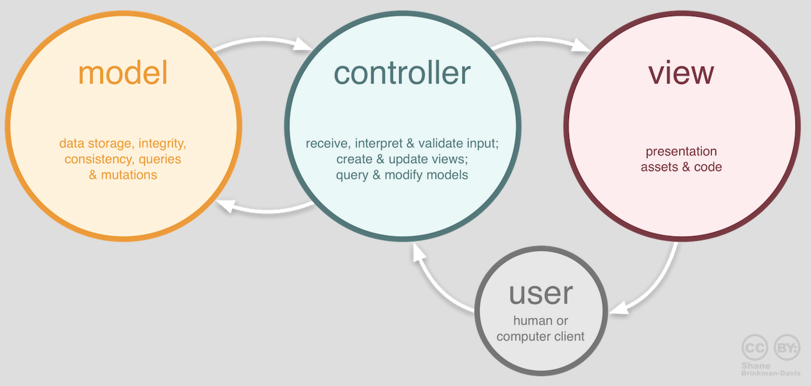
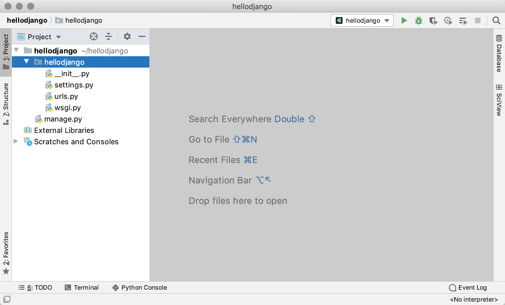
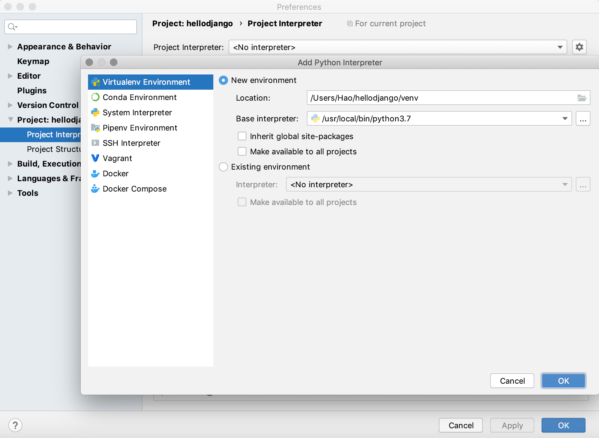
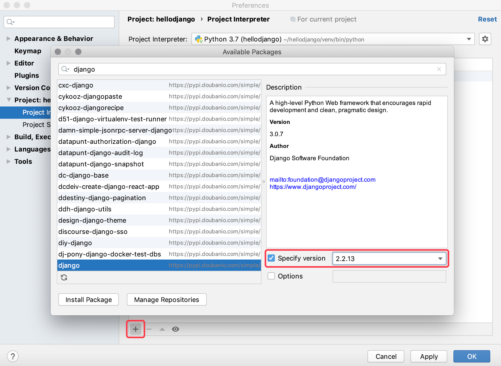
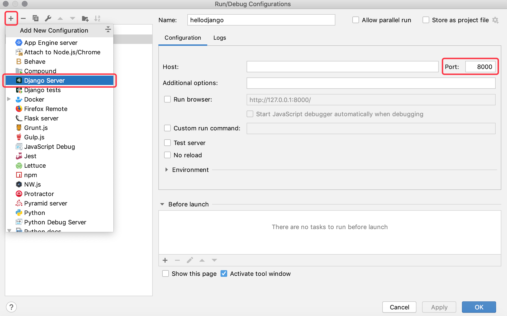
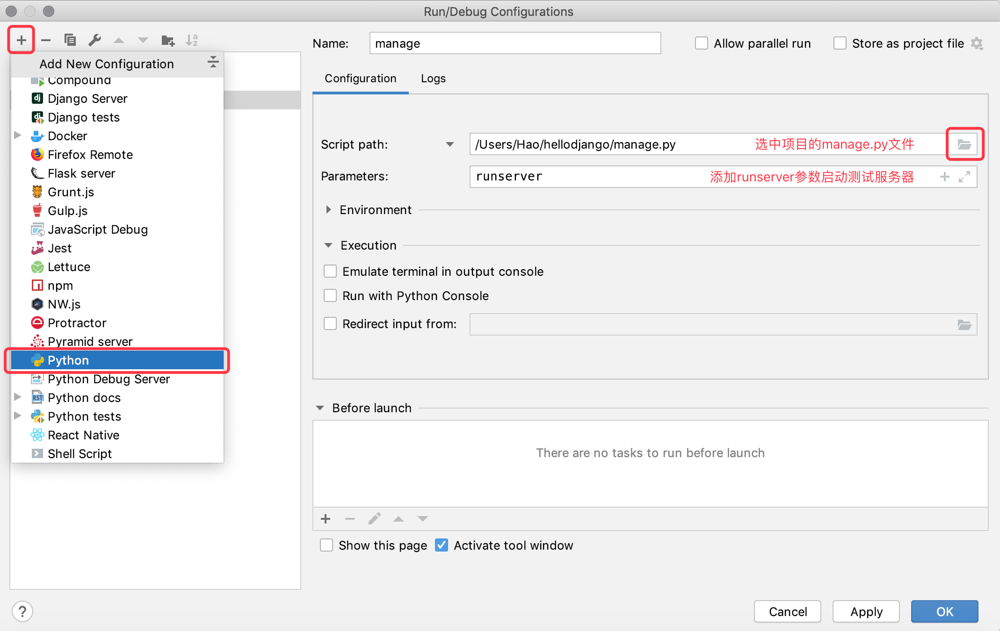
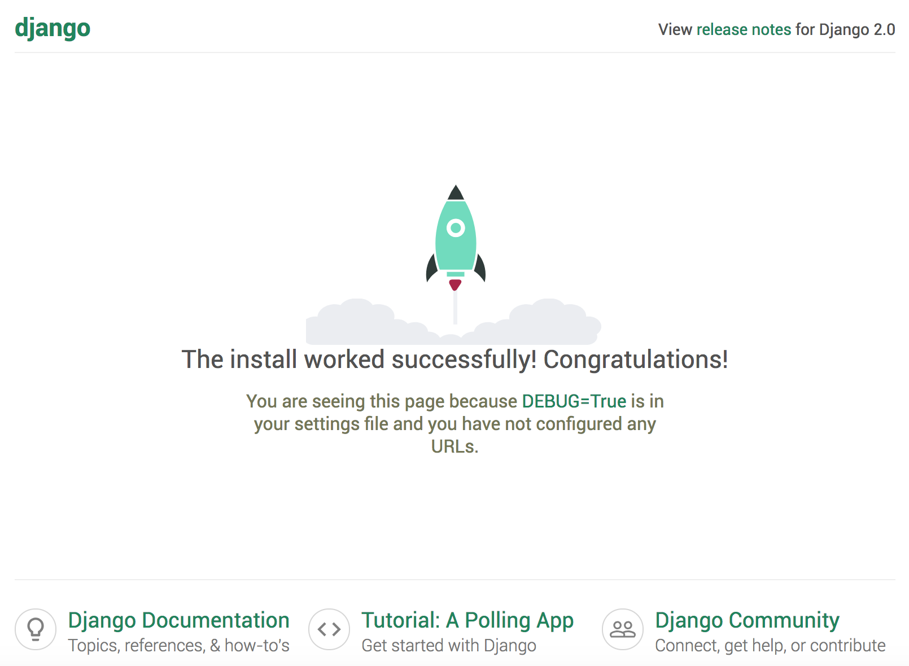
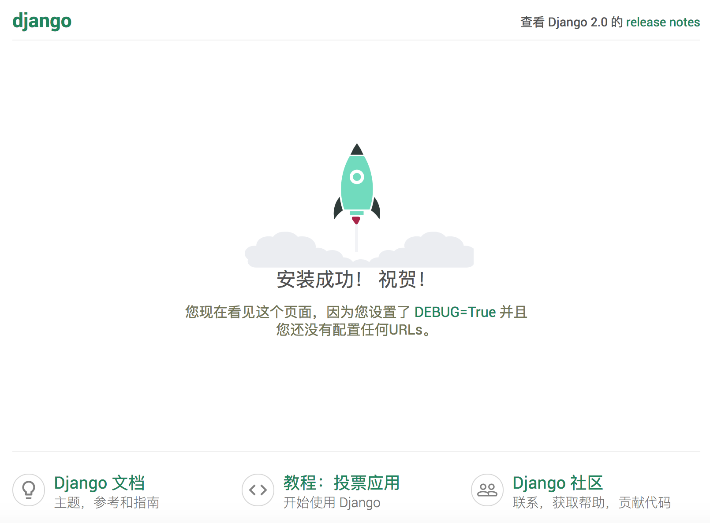
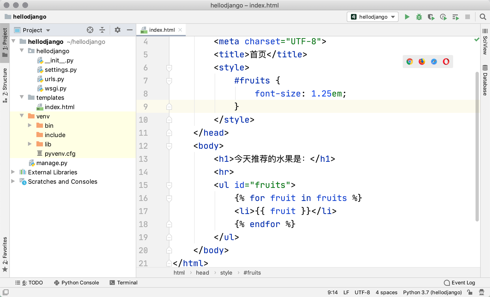

## Django快速上手

Web开发的早期阶段，开发者需要手动编写每个页面，例如一个新闻门户网站，每天都要修改它的HTML页面，随着网站规模和体量的增大，这种做法一定是非常糟糕的。为了解决这个问题，开发人员想到了用程序来为Web服务器生成动态内容，也就是说网页中的动态内容不再通过手动编写而是通过程序自动生成。最早的时候，这项技术被称为CGI（公共网关接口），当然随着时间的推移，CGI暴露出的问题也越来越多，例如大量重复的样板代码，总体性能较为低下等。在时代呼唤新英雄的背景下，PHP、ASP、JSP这类Web应用开发技术在上世纪90年代中后期如雨后春笋般涌现。通常我们说的Web应用是指通过浏览器来访问网络资源的应用程序，因为浏览器的普及性以及易用性，Web应用使用起来方便简单，免除了安装和更新应用程序带来的麻烦；站在开发者的角度，也不用关心用户使用什么样的操作系统，甚至不用区分是PC端还是移动端。

### Web应用机制和术语

下图向我们展示了Web应用的工作流程，其中涉及到的术语如下表所示。


> 说明：相信有经验的读者会发现，这张图中其实还少了很多东西，例如反向代理服务器、数据库服务器、防火墙等，而且图中的每个节点在实际项目部署时可能是一组节点组成的集群。当然，如果你对这些没有什么概念也不要紧，继续下去就行了，后面会给大家一一讲解的。

| 术语          | 解释                                                         |
| ------------- | ------------------------------------------------------------ |
| **URL/URI**   | 统一资源定位符/统一资源标识符，网络资源的唯一标识            |
| **域名**      | 与Web服务器地址对应的一个易于记忆的字符串名字                |
| **DNS**       | 域名解析服务，可以将域名转换成对应的IP地址                   |
| **IP地址**    | 网络上的主机的身份标识，通过IP地址可以区分不同的主机         |
| **HTTP**      | 超文本传输协议，构建在TCP之上的应用级协议，万维网数据通信的基础 |
| **反向代理**  | 代理客户端向服务器发出请求，然后将服务器返回的资源返回给客户端 |
| **Web服务器** | 接受HTTP请求，然后返回HTML文件、纯文本文件、图像等资源给请求者 |
| **Nginx**     | 高性能的Web服务器，也可以用作[反向代理](https://zh.wikipedia.org/wiki/%E5%8F%8D%E5%90%91%E4%BB%A3%E7%90%86)，[负载均衡](https://zh.wikipedia.org/wiki/%E8%B4%9F%E8%BD%BD%E5%9D%87%E8%A1%A1) 和 [HTTP缓存](https://zh.wikipedia.org/wiki/HTTP%E7%BC%93%E5%AD%98) |

#### HTTP协议

这里我们先费一些笔墨来说说HTTP这个协议。HTTP（超文本传输协议）是构建于TCP（传输控制协议）之上应用级协议，它利用了TCP提供的可靠的传输服务实现了Web应用中的数据交换。按照维基百科上的介绍，设计HTTP最初的目的是为了提供一种发布和接收[HTML](https://zh.wikipedia.org/wiki/HTML)页面的方法，也就是说这个协议是浏览器和Web服务器之间传输的数据的载体。关于这个协议的详细信息以及目前的发展状况，大家可以阅读[《HTTP 协议入门》](http://www.ruanyifeng.com/blog/2016/08/http.html)、[《互联网协议入门》](http://www.ruanyifeng.com/blog/2012/05/internet_protocol_suite_part_i.html)系列以及[《图解HTTPS协议》](http://www.ruanyifeng.com/blog/2014/09/illustration-ssl.html)这几篇文章进行了解。下图是我在四川省网络通信技术重点实验室学习和工作期间使用开源协议分析工具Ethereal（抓包工具WireShark的前身）截取的访问百度首页时的HTTP请求和响应的报文（协议数据），由于Ethereal截取的是经过网络适配器的数据，因此可以清晰的看到从物理链路层到应用层的协议数据。

HTTP请求（请求行+请求头+空行+[消息体]）：


HTTP响应（响应行+响应头+空行+消息体）：


>  **说明**：这两张图是在2009年9月10日凌晨获得的，但愿这两张如同泛黄的照片般的截图能帮助你了解HTTP到底是什么样子的。当然，如果没有专业的抓包工具，也可以通过浏览器提供的“开发者工具”来查看HTTP请求和响应的数据格式。

### Django概述

Python的Web框架有上百个，比它的关键字还要多。所谓Web框架，就是用于开发Web服务器端应用的基础设施，说得通俗一点就是一系列封装好的模块和工具。事实上，即便没有Web框架，我们仍然可以通过socket或[CGI](https://zh.wikipedia.org/wiki/%E9%80%9A%E7%94%A8%E7%BD%91%E5%85%B3%E6%8E%A5%E5%8F%A3)来开发Web服务器端应用，但是这样做的成本和代价在商业项目中通常是不能接受的。通过Web框架，我们可以化繁为简，降低创建、更新、扩展应用程序的工作量。刚才我们说到Python有上百个Web框架，这些框架包括Django、Flask、Tornado、Sanic、Pyramid、Bottle、Web2py、web.py等。

在上述Python的Web框架中，Django无疑是最有代表性的重量级选手，开发者可以基于Django快速的开发可靠的Web应用程序，因为它减少了Web开发中不必要的开销，对常用的设计和开发模式进行了封装，并对MVC架构提供了支持（Django中称之为MTV架构）。MVC是软件系统开发领域中一种放之四海而皆准的架构，它将系统中的组件分为模型（Model）、视图（View）和控制器（Controller）三个部分并借此实现模型（数据）和视图（显示）的解耦合。由于模型和视图进行了分离，所以需要一个中间人将解耦合的模型和视图联系起来，扮演这个角色的就是控制器。稍具规模的软件系统都会使用MVC架构（或者是从MVC演进出的其他架构），Django项目中我们称之为MTV，MTV中的M跟MVC中的M没有区别，就是代表数据的模型，T代表了网页模板（显示数据的视图），而V代表了视图函数，在Django框架中，视图函数和Django框架本身一起扮演了MVC中C的角色。



Django框架诞生于2003年，它是一个在真正的应用中成长起来的项目，由劳伦斯出版集团旗下在线新闻网站的内容管理系统（CMS）研发团队（主要是Adrian Holovaty和Simon Willison）开发，以比利时的吉普赛爵士吉他手Django Reinhardt来命名。Django框架在2005年夏天作为开源框架发布，使用Django框架能用很短的时间构建出功能完备的网站，因为它代替程序员完成了那些重复乏味的劳动，剩下真正有意义的核心业务给程序员来开发，这一点就是对DRY（Don't Repeat Yourself）理念的最好践行。许多成功的网站和应用都是基于Python语言进行开发的，国内比较有代表性的网站包括：知乎、豆瓣网、果壳网、搜狐闪电邮箱、101围棋网、海报时尚网、背书吧、堆糖、手机搜狐网、咕咚、爱福窝、果库等，其中不乏使用了Django框架的产品。

### 快速上手

#### 第一个Django项目

1. 检查Python环境：Django 1.11需要Python 2.7或Python 3.4以上的版本；Django 2.0需要Python 3.4以上的版本；Django 2.1和2.2需要Python 3.5以上的版本；Django 3.0需要Python 3.6以上版本。

   > **说明**：Django框架不同版本所需的Python解释器环境，可以在Django官方文档的[FAQ](https://docs.djangoproject.com/zh-hans/3.0/faq/install/#faq-python-version-support)中找到。

   可以在macOS的终端中输入下面的命令检查Python解释器版本，Windows系统可以在命令行提示符中输入`python --version`。
   
   ```Bash
python3 --version
   ```
   
   也可以在Python的交互式环境中执行下面的代码来查看Python解释器的版本。
   
   ```Shell
   import sys
   sys.version
   sys.version_info
   ```
   
2. 更新包管理工具并安装Django环境（用于创建Django项目）。

   > **说明**：在更新这个文档时，Django最新的正式版本是3.0.7，Django 3.0提供了对ASGI的支持，可以实现全双工的异步通信，但是目前的使用体验一般，所以暂时不推荐大家使用Django 3.0，下面我们安装的是Django 2.2.13版本。使用`pip`安装三方库和工具时，可以通过`==`来指定安装的版本。
   
   ```Bash
   pip3 install -U pip
   pip3 install django==2.2.13
   ```
   
3. 检查Django环境并使用`django-admin`命令创建Django项目（项目名称为hellodjango）。

   ```Shell
   django-admin --version
   django-admin startproject hellodjango
   ```

4. 用PyCharm打开创建好的Djang项目，并为其添加虚拟环境。

   

   如上图所示，PyCharm的项目浏览器中，最顶层的文件夹`hellodjango`是Python项目文件夹，这个文件夹的名字并不重要，Django项目也不关心这个文件夹叫什么名字。该文件夹下有一个同名的文件夹，它是Django项目文件夹，其中包含了`__init__.py`、`settings.py`、`urls.py`、`wsgi.py`四个文件，与名为`hellodjango`的Django项目文件夹同级的还有一个名为`manage.py` 的文件，这些文件的作用如下所示：

   - `hellodjango/__init__.py`：空文件，告诉Python解释器这个目录应该被视为一个Python的包。
   - `hellodjango/settings.py`：Django项目的配置文件。
   - `hellodjango/urls.py`：Django项目的URL映射声明，就像是网站的“目录”。
   - `hellodjango/wsgi.py`：项目运行在WSGI兼容Web服务器上的入口文件。
   - `manage.py`： 管理Django项目的脚本程序。

   > 说明：WSGI全称是Web服务器网关接口，维基百科上给出的解释是“为Python语言定义的[Web服务器](https://zh.wikipedia.org/wiki/%E7%B6%B2%E9%A0%81%E4%BC%BA%E6%9C%8D%E5%99%A8)和[Web应用程序](https://zh.wikipedia.org/wiki/%E7%BD%91%E7%BB%9C%E5%BA%94%E7%94%A8%E7%A8%8B%E5%BA%8F)或框架之间的一种简单而通用的接口”。

   创建虚拟环境的界面如下图所示。

   

5. 安装项目依赖项。

   方法一：打开PyCharm的终端，在终端中通过`pip`命令安装Django项目的依赖项。

   > **说明**：由于已经基于Python 3解释器环境为项目创建了虚拟环境，所以虚拟环境中的`python`命令对应的是Python 3的解释器，而`pip`命令对应的是Python 3的包管理工具。

   ```Shell
   pip install django==2.2.13
   ```

   方法二：在PyCharm的偏好设置中，可以找到项目的解释器环境和已经安装的三方库，可以通过点击添加按钮来安装新的依赖项，需要提醒大家的是在安装Django依赖项时，需要指定版本号，否则将默认安装更新本文时最新的3.0.7版本。

   

   下图展示了Django版本和Python版本的对应关系，请大家自行对号入座。

   | Django版本 | Python版本                                |
   | ---------- | ----------------------------------------- |
   | 1.8        | 2.7、3.2、3.3、3.4、3.5                   |
   | 1.9、1.10  | 2.7、3.4、3.5                             |
   | 1.11       | 2.7、3.4、3.5、3.6、3.7（Django 1.11.17） |
   | 2.0        | 3.4、3.5、3.6、3.7                        |
   | 2.1        | 3.5、3.6、3.7                             |
   | 2.2        | 3.5、3.6、3.7、3.8（Django 2.2.8）        |
   | 3.0        | 3.6、3.7、3.8                             |

6. 启动Django自带的服务器运行项目。

   方法一：在“Run”菜单选择“Edit Configuration”，配置“Django server”运行项目（适用于专业版PyCharm）。

   

   方法二：在“Run”菜单选择“Edit Configuration”，配置运行“Python”程序运行项目（适用于专业版和社区版PyCharm）。

   

   方法三：在PyCharm的终端（Terminal）中通过命令运行项目（适用于专业版和社区版PyCharm）。

   ```Shell
   python manage.py runserver
   ```

7. 查看运行效果。

  在浏览器中输入`http://127.0.0.1:8000`访问我们的服务器，效果如下图所示。

   

   > **说明**：
   >
   > 1. 刚刚启动的Django自带的服务器只能用于开发和测试环境，因为这个服务器是纯Python编写的轻量级Web服务器，不适合在生产环境中使用。
   > 2. 如果修改了代码，不需要为了让修改的代码生效而重新启动Django自带的服务器。但是，在添加新的项目文件时，该服务器不会自动重新加载，这个时候就得手动重启服务器。
   > 3. 可以在终端中通过`python manage.py help`命令查看Django管理脚本程序可用的命令参数。
   > 4. 使用`python manage.py runserver`启动服务器时，可以在后面添加参数来指定IP地址和端口号，默认情况下启动的服务器将运行在本机的`8000`端口。
   > 5. 在终端中运行的服务器，可以通过Ctrl+C来停止它 。通过PyCharm的“运行配置”运行的服务器直接点击窗口上的关闭按钮就可以终止服务器的运行。
   > 6. 不能在同一个端口上启动多个服务器，因为会导致地址的冲突（端口是对IP地址的扩展，也是计算机网络地址的一部分）。
8. 修改项目的配置文件`settings.py`。

   Django是一个支持国际化和本地化的框架，因此刚才我们看到的Django项目的默认首页也是支持国际化的，我们可以通过修改配置文件将默认语言修改为中文，时区设置为东八区。

   找到修改前的配置（在`settings.py`文件第100行以后）。

   ```Python
   LANGUAGE_CODE = 'en-us'
   TIME_ZONE = 'UTC'
   ```

   修改为以下内容。

   ```Python
   LANGUAGE_CODE = 'zh-hans'
   TIME_ZONE = 'Asia/Chongqing'
   ```

   刷新刚才的页面，可以看到修改语言代码和时区之后的结果。

   

#### 创建自己的应用

如果要开发自己的Web应用，需要先在Django项目中创建“应用”，一个Django项目可以包含一个或多个应用。

1. 在PyCharm的终端中执行下面的命令，创建名为`first`的应用。

   ```Shell
   python manage.py startapp first
   ```

   执行上面的命令会在当前路径下创建`first`目录，其目录结构如下所示：

   - `__init__.py`：一个空文件，告诉Python解释器这个目录应该被视为一个Python的包。
   - `admin.py`：可以用来注册模型，用于在Django框架自带的管理后台中管理模型。
   -  `apps.py`：当前应用的配置文件。
   - `migrations`：存放与模型有关的数据库迁移信息。
     - `__init__.py`：一个空文件，告诉Python解释器这个目录应该被视为一个Python的包。
   - `models.py`：存放应用的数据模型（MTV中的M）。
   - `tests.py`：包含测试应用各项功能的测试类和测试函数。
   - `views.py`：处理用户HTTP请求并返回HTTP响应的函数或类（MTV中的V）。

2. 修改应用目录下的视图文件`views.py`。

   ```Python
   from django.http import HttpResponse
   

   def show_index(request):
       return HttpResponse('<h1>Hello, Django!</h1>')
   ```
   
4. 修改Django项目目录下的`urls.py`文件，将视图函数和用户在浏览器中请求的路径对应。

   ```Python
   from django.contrib import admin
   from django.urls import path, include

   from first.views import show_index
   
   urlpatterns = [
       path('admin/', admin.site.urls),
       path('hello/', show_index),
   ]
   ```
   
5. 重新运行项目，并打开浏览器中访问`http://127.0.0.1:8000/hello/`。

5. 上面我们通过代码为浏览器生成了内容，但仍然是静态内容，如果要生成动态内容，可以修改`views.py`文件并添加如下所示的代码。

   ```Python
   from random import sample
   
   from django.http import HttpResponse
   
   
   def show_index(request):
       fruits = [
           'Apple', 'Orange', 'Pitaya', 'Durian', 'Waxberry', 'Blueberry',
           'Grape', 'Peach', 'Pear', 'Banana', 'Watermelon', 'Mango'
       ]
       selected_fruits = sample(fruits, 3)
       content = '<h3>今天推荐的水果是：</h3>'
       content += '<hr>'
       content += '<ul>'
       for fruit in selected_fruits:
           content += f'<li>{fruit}</li>'
       content += '</ul>'
       return HttpResponse(content)
   ```

6. 刷新页面查看程序的运行结果，看看每次刷新的网页的时候，是不是可以看到不一样的内容。


#### 使用模板

上面通过拼接HTML代码的方式为浏览器生成动态内容的做法在实际开发中是无能接受的，因为实际项目中的前端页面可能非常复杂，无法用这种拼接动态内容的方式来完成，这一点大家一定能够想到。为了解决这个问题，我们可以提前准备一个模板页（MTV中的T），所谓模板页就是一个带占位符和模板指令的HTML页面。

Django框架中有一个名为`render`的便捷函数可以来完成渲染模板的操作。所谓的渲染就是用数据替换掉模板页中的模板指令和占位符，当然这里的渲染称为后端渲染，即在服务器端完成页面的渲染再输出到浏览器中。后端渲染的做法在Web应用的访问量较大时，会让服务器承受较大的负担，所以越来越多的Web应用会选择前端渲染的方式，即服务器只提供页面所需的数据（通常是JSON格式），在浏览器中通过JavaScript代码获取这些数据并渲染页面上。关于前端渲染的内容，我们会在后续的课程中为大家讲解，目前我们使用的是通过模板页进行后端渲染的做法，具体步骤如下所示。

使用模板页的步骤如下所示。

1. 在项目目录下创建名为templates文件夹。

   

2. 添加模板页`index.html`。

   > **说明**：实际项目开发中，静态页由前端开发者提供，后端开发者需要将静态页修改为模板页，以便通过Python程序对其进行渲染，这种做法就是上面提到的后端渲染。

   ```HTML
   <!DOCTYPE html>
   <html lang="en">
       <head>
           <meta charset="UTF-8">
           <title>首页</title>
           <style>
               #fruits {
                   font-size: 1.25em;
               }
           </style>
       </head>
       <body>
           <h1>今天推荐的水果是：</h1>
           <hr>
           <ul id="fruits">
               
               <li>{{ fruit }}</li>
               
           </ul>
       </body>
   </html>
   ```
   在上面的模板页中我们使用了`{{ fruit }}`这样的模板占位符语法，也使用了``这样的模板指令，这些都是Django模板语言（DTL）的一部分。关于模板语法和指令，大家可以看看官方文档，相信这些内容还是很容易理解的，并不需要过多的赘述，大家也可以参考[官方文档]()了解模板指令和语法。

3. 修改`views.py`文件，调用`render`函数渲染模板页。

   ```Python
   from random import sample
   
   from django.shortcuts import render
   
   
   def show_index(request):
       fruits = [
           'Apple', 'Orange', 'Pitaya', 'Durian', 'Waxberry', 'Blueberry',
           'Grape', 'Peach', 'Pear', 'Banana', 'Watermelon', 'Mango'
       ]
       selected_fruits = sample(fruits, 3)
       return render(request, 'index.html', {'fruits': selected_fruits})
   ```

   `render`函数的第一个参数是请求对象request，第二个参数是我们要渲染的模板页的名字，第三个参数是要渲染到页面上的数据，我们通过一个字典将数据交给模板页，字典中的键就是模板页中使用的模板指令或占位符中的变量名。

4. 到此为止，视图函数中的`render`还无法找到模板文件`index.html`，需要修改`settings.py`文件，配置模板文件所在的路径。修改`settings.py`文件，找到`TEMPLATES`配置，修改其中的`DIRS`配置。

   ```Python
   TEMPLATES = [
       {
           'BACKEND': 'django.template.backends.django.DjangoTemplates',
           'DIRS': [os.path.join(BASE_DIR, 'templates'), ],
           'APP_DIRS': True,
           'OPTIONS': {
               'context_processors': [
                   'django.template.context_processors.debug',
                   'django.template.context_processors.request',
                   'django.contrib.auth.context_processors.auth',
                   'django.contrib.messages.context_processors.messages',
               ],
           },
       },
   ]
   ```

5. 重新运行项目或直接刷新页面查看结果。

### 总结

至此，我们已经利用Django框架完成了一个非常小的Web应用，虽然它并没有任何的实际价值，但是可以通过这个项目对Django框架有一个感性的认识。学习Django最好的资料肯定是它的[官方文档](https://docs.djangoproject.com/zh-hans/2.0/)，官方文档提供了对多国语言的支持，而且有新手教程引导初学者学习使用Django框架，建议大家通过阅读Django的官方文档来学习和使用这个框架。当然图灵社区出版的[《Django基础教程》](http://www.ituring.com.cn/book/2630)也是非常适合初学者的入门级读物，有兴趣的读者可以点击链接进行购买。 
