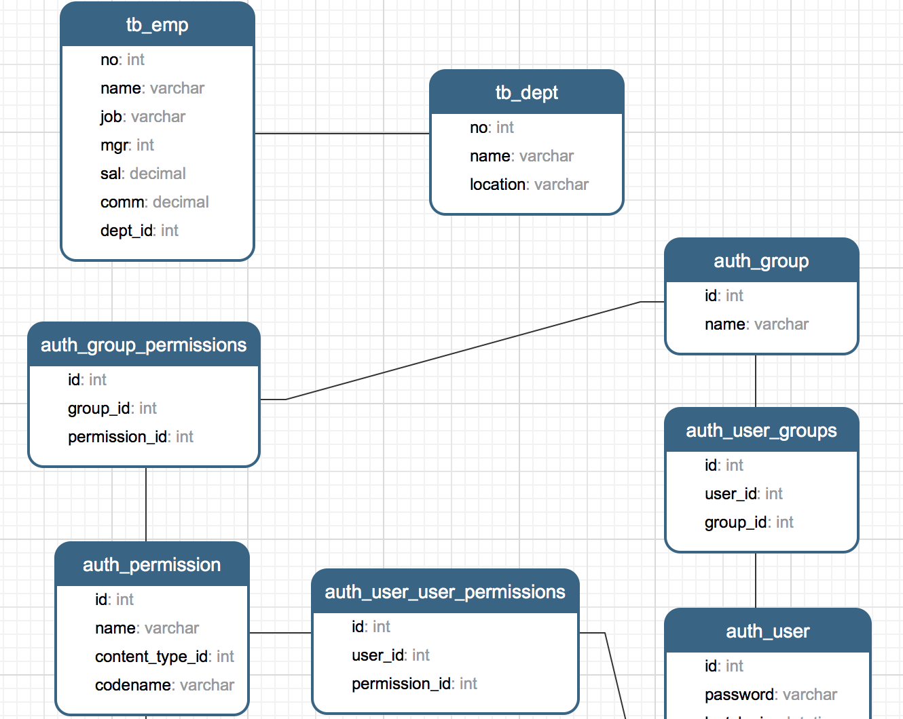
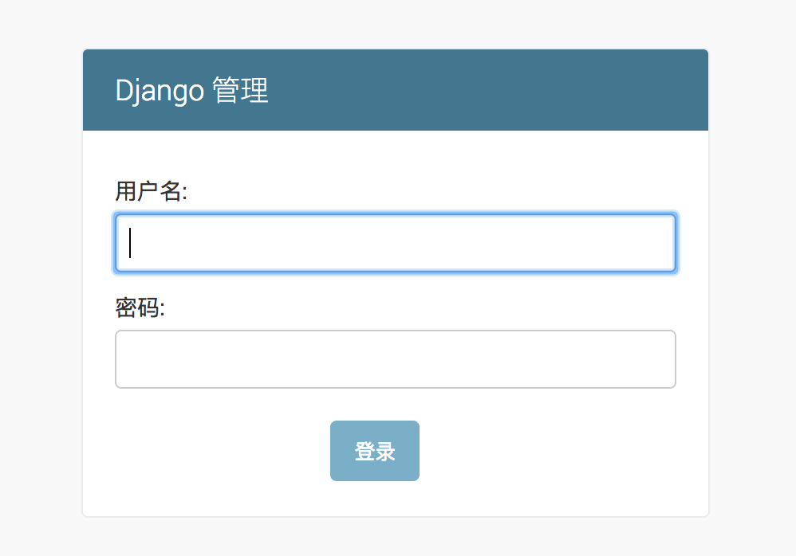
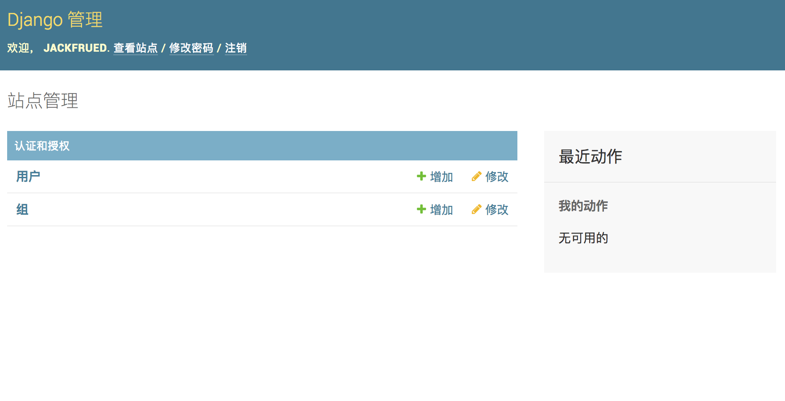
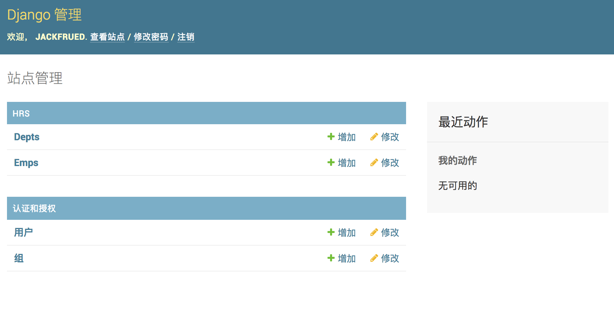
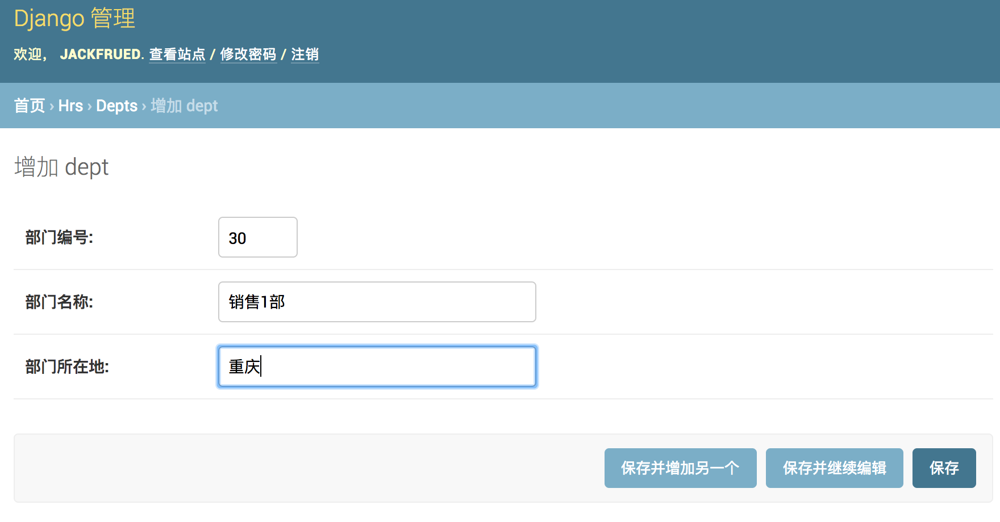
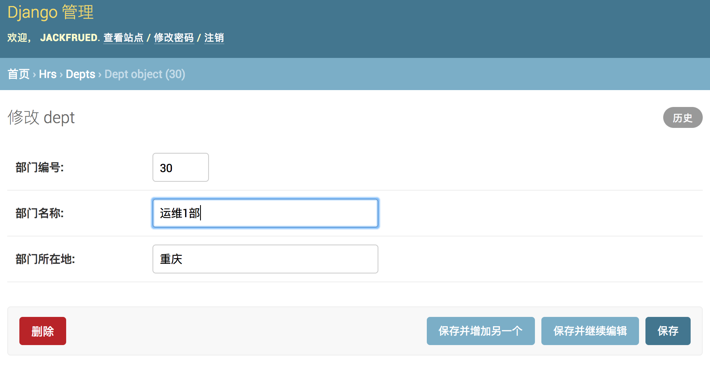
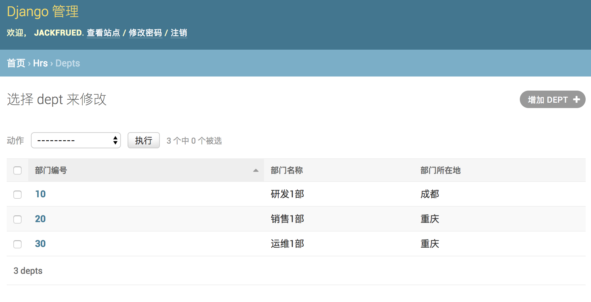
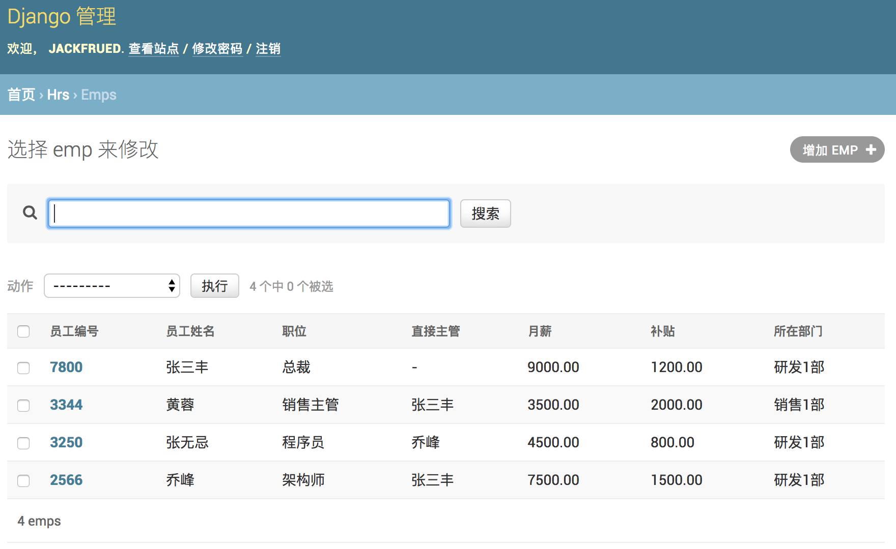

## 深入模型

在上一个章节中，我们提到了Django是基于MVC架构的Web框架，MVC架构追求的是“模型”和“视图”的解耦合。所谓“模型”说得更直白一些就是数据（的表示），所以通常也被称作“数据模型”。在实际的项目中，数据模型通常通过数据库实现持久化操作，而关系型数据库在过去和当下都是持久化的首选方案，下面我们以MySQL为例来说明如何使用关系型数据库来实现持久化操作。

### 配置关系型数据库MySQL 

我们继续来完善上一个章节中的OA项目，首先从配置项目使用的数据库开始。

1. 修改项目的settings.py文件，首先将我们之前创建的应用hrs添加已安装的项目中，然后配置MySQL作为持久化方案。

   ```Shell
   (venv)$ vim oa/settings.py
   ```

   ```Python
   # 此处省略上面的代码
   
   INSTALLED_APPS = [
       'django.contrib.admin',
       'django.contrib.auth',
       'django.contrib.contenttypes',
       'django.contrib.sessions',
       'django.contrib.messages',
       'django.contrib.staticfiles',
       'hrs',
   ]
   
   DATABASES = {
       'default': {
           'ENGINE': 'django.db.backends.mysql',
           'NAME': 'oa',
           'HOST': '127.0.0.1',
           'PORT': 3306,
           'USER': 'root',
           'PASSWORD': '123456',
       }
   }
   
   # 此处省略下面的代码
   ```

   在配置ENGINE属性时，常用的可选值包括：

   - `'django.db.backends.sqlite3'`：SQLite嵌入式数据库。
   - `'django.db.backends.postgresql'`：BSD许可证下发行的开源关系型数据库产品。
   - `'django.db.backends.mysql'`：转手多次目前属于甲骨文公司的经济高效的数据库产品。
   - `'django.db.backends.oracle'`：甲骨文公司的关系型数据库旗舰产品。

   其他的配置可以参考官方文档中[数据库配置](https://docs.djangoproject.com/zh-hans/2.0/ref/databases/#third-party-notes)的部分。

   NAME属性代表数据库的名称，如果使用SQLite它对应着一个文件，在这种情况下NAME的属性值应该是一个绝对路径；使用其他关系型数据库，则要配置对应的HOST（主机）、PORT（端口）、USER（用户名）、PASSWORD（口令）等属性。

2. 安装Python操作MySQL的依赖库，Python 3中通常使用PyMySQL，Python 2中通常用MySQLdb。

   ```Shell
   (venv)$ pip install pymysql
   ```

   如果使用Python 3需要修改**项目目录**下的`__init__.py`文件并加入如下所示的代码，这段代码的作用是将PyMySQL视为MySQLdb来使用，从而避免Django找不到连接MySQL的客户端工具而询问你：“Did you install mysqlclient? ”（你安装了mysqlclient吗？）。

   ```Python
   import pymysql
   
   pymysql.install_as_MySQLdb()
   ```

3. 如果之前没有为应用程序创建数据库，那么现在是时候创建名为oa的数据库了。在MySQL中创建数据库的SQL语句如下所示：

   ```SQL
   create database oa default charset utf8;
   ```

4. Django框架本身有自带的数据模型，我们稍后会用到这些模型，为此我们先做一次迁移操作。所谓迁移，就是根据模型自动生成关系数据库中的二维表，命令如下所示：

   ```Shell
   (venv)$ python manage.py migrate
   Operations to perform:
     Apply all migrations: admin, auth, contenttypes, sessions
   Running migrations:
     Applying contenttypes.0001_initial... OK
     Applying auth.0001_initial... OK
     Applying admin.0001_initial... OK
     Applying admin.0002_logentry_remove_auto_add... OK
     Applying contenttypes.0002_remove_content_type_name... OK
     Applying auth.0002_alter_permission_name_max_length... OK
     Applying auth.0003_alter_user_email_max_length... OK
     Applying auth.0004_alter_user_username_opts... OK
     Applying auth.0005_alter_user_last_login_null... OK
     Applying auth.0006_require_contenttypes_0002... OK
     Applying auth.0007_alter_validators_add_error_messages... OK
     Applying auth.0008_alter_user_username_max_length... OK
     Applying auth.0009_alter_user_last_name_max_length... OK
     Applying sessions.0001_initial... OK
   ```

5. 接下来，我们为自己的应用创建数据模型。如果要在hrs应用中实现对部门和员工的管理，我们可以先创建部门和员工数据模型，代码如下所示。

   ```Shell
   (venv)$ vim hrs/models.py
   ```

   ```Python
   from django.db import models
   
   
   class Dept(models.Model):
       """部门类"""
       
       no = models.IntegerField(primary_key=True, db_column='dno', verbose_name='部门编号')
       name = models.CharField(max_length=20, db_column='dname', verbose_name='部门名称')
       location = models.CharField(max_length=10, db_column='dloc', verbose_name='部门所在地')
   
       class Meta:
           db_table = 'tb_dept'
   
   
   class Emp(models.Model):
       """员工类"""
       
       no = models.IntegerField(primary_key=True, db_column='eno', verbose_name='员工编号')
       name = models.CharField(max_length=20, db_column='ename', verbose_name='员工姓名')
       job = models.CharField(max_length=10, verbose_name='职位')
       # 多对一外键关联(自参照)
       mgr = models.ForeignKey('self', on_delete=models.SET_NULL, null=True, blank=True, verbose_name='主管')
       sal = models.DecimalField(max_digits=7, decimal_places=2, verbose_name='月薪')
       comm = models.DecimalField(max_digits=7, decimal_places=2, null=True, blank=True, verbose_name='补贴')
       # 多对一外键关联(参照部门模型)
       dept = models.ForeignKey(Dept, db_column='dno', on_delete=models.PROTECT, verbose_name='所在部门')
   
       class Meta:
           db_table = 'tb_emp'
   ```
   > 说明：上面定义模型时使用了字段类及其属性，其中IntegerField对应数据库中的integer类型，CharField对应数据库的varchar类型，DecimalField对应数据库的decimal类型，ForeignKey用来建立多对一外键关联。字段属性primary_key用于设置主键，max_length用来设置字段的最大长度，db_column用来设置数据库中与字段对应的列，verbose_name则设置了Django后台管理系统中该字段显示的名称。如果对这些东西感到很困惑也不要紧，文末提供了字段类、字段属性、元数据选项等设置的相关说明，不清楚的读者可以稍后查看对应的参考指南。

6. 再次执行迁移操作，先通过模型生成迁移文件，再执行迁移创建二维表。

   ```Shell
   (venv)$ python manage.py makemigrations hrs
   Migrations for 'hrs':
     hrs/migrations/0001_initial.py
       - Create model Dept
       - Create model Emp
   (venv)$ python manage.py migrate
   Operations to perform:
     Apply all migrations: admin, auth, contenttypes, hrs, sessions
   Running migrations:
     Applying hrs.0001_initial... OK
   ```

   执行完数据模型迁移操作之后，可以在通过图形化的MySQL客户端工具查看到E-R图（实体关系图）。

   

### 利用Django后台管理模型

Django框架有自带的后台管理系统来实现对模型的管理。虽然实际应用中，这个后台可能并不能满足我们的需求，但是在学习Django框架时，我们暂时可以利用Django自带的后台管理系统来管理我们的模型，同时也可以了解一个项目的后台管理系统到底需要哪些功能。

1. 创建超级管理员账号。

   ```Shell
   (venv)$ python manage.py createsuperuser
   Username (leave blank to use 'hao'): jackfrued
   Email address: jackfrued@126.com
   Password: 
   Password (again): 
   Superuser created successfully.
   ```

2. 启动Web服务器，登录后台管理系统。

   ```Shell
   (venv)$ python manage.py runserver
   ```

   访问<http://127.0.0.1:8000/admin>，会来到如下图所示的登录界面。

   

   登录后进入管理员操作平台。

   

   至此我们还没有看到之前创建的模型类，需要在应用的admin.py文件中模型进行注册。

3. 注册模型类。

   ```Shell
   (venv)$ vim hrs/admin.py
   ```

   ```Python
   from django.contrib import admin
   
   from hrs.models import Emp, Dept
   
   admin.site.register(Dept)
   admin.site.register(Emp)
   ```

   注册模型类后，就可以在后台管理系统中看到它们。

   

4. 对模型进行CRUD操作。

   可以在管理员平台对模型进行C（新增）、R（查看）、U（更新）、D（删除）操作，如下图所示。

   - 添加新的部门。

   

   - 查看所有部门。

   

   - 更新和删除部门。

   

5. 注册模型管理类。

   可能大家已经注意到了，刚才在后台查看部门信息的时候，显示的部门信息并不直观，为此我们再修改admin.py文件，通过注册模型管理类，可以在后台管理系统中更好的管理模型。

   ```Python
   from django.contrib import admin
   
   from hrs.models import Emp, Dept
   
   
   class DeptAdmin(admin.ModelAdmin):
   
       list_display = ('no', 'name', 'location')
       ordering = ('no', )
   
   
   class EmpAdmin(admin.ModelAdmin):
   
       list_display = ('no', 'name', 'job', 'mgr', 'sal', 'comm', 'dept')
       search_fields = ('name', 'job')
   
   
   admin.site.register(Dept, DeptAdmin)
   admin.site.register(Emp, EmpAdmin)
   ```

   

   

   为了更好的查看模型数据，可以为Dept和Emp两个模型类添加`__str__`魔法方法。

   ```Python
   from django.db import models
   
   
   class Dept(models.Model):
       """部门类"""
       
       # 此处省略上面的代码
       
       def __str__(self):
           return self.name
   
       # 此处省略下面的代码
   
   
   class Emp(models.Model):
       """员工类"""
       
       # 此处省略上面的代码
   
       def __str__(self):
           return self.name
   
       # 此处省略下面的代码
   ```

   修改代码后刷新查看Emp模型的页面，效果如下图所示。

   

### 使用ORM完成模型的CRUD操作

在了解了Django提供的模型管理平台之后，我们来看看如何从代码层面完成对模型的CRUD（Create / Read / Update / Delete）操作。我们可以通过manage.py开启Shell交互式环境，然后使用Django内置的ORM框架对模型进行CRUD操作。

```Shell
(venv)$ python manage.py shell
Python 3.6.4 (v3.6.4:d48ecebad5, Dec 18 2017, 21:07:28) 
[GCC 4.2.1 (Apple Inc. build 5666) (dot 3)] on darwin
Type "help", "copyright", "credits" or "license" for more information.
(InteractiveConsole)
>>> 
```

#### 新增

```Shell
>>> from hrs.models import Dept, Emp
>>>
>>> dept = Dept(40, '研发2部', '深圳')
>>> dept.save()
```

#### 更新

```Shell
>>> dept.name = '研发3部'
>>> dept.save()
```

#### 查询

1. 查询所有对象。

```Shell
>>> Dept.objects.all()
<QuerySet [<Dept: 研发1部>, <Dept: 销售1部>, <Dept: 运维1部>, <Dept: 研发3部>]>
```

2. 过滤数据。

```Shell
>>> Dept.objects.filter(name='研发3部') # 查询部门名称为“研发3部”的部门
<QuerySet [<Dept: 研发3部>]>
>>>
>>> Dept.objects.filter(name__contains='研发') # 查询部门名称包含“研发”的部门(模糊查询)
<QuerySet [<Dept: 研发1部>, <Dept: 研发3部>]>
>>>
>>> Dept.objects.filter(no__gt=10).filter(no__lt=40) # 查询部门编号大于10小于40的部门
<QuerySet [<Dept: 销售1部>, <Dept: 运维1部>]>
>>>
>>> Dept.objects.filter(no__range=(10, 30)) # 查询部门编号在10到30之间的部门
<QuerySet [<Dept: 研发1部>, <Dept: 销售1部>, <Dept: 运维1部>]>
```

3. 查询单个对象。

```Shell
>>> Dept.objects.get(pk=10)
<Dept: 研发1部>
>>>
>>> Dept.objects.get(no=20)
<Dept: 销售1部>
>>>
>>> Dept.objects.get(no__exact=30)
<Dept: 运维1部>
>>>
>>> Dept.objects.filter(no=10).first()
<Dept: 研发1部>
```

4. 排序数据。

```Shell
>>> Dept.objects.order_by('no') # 查询所有部门按部门编号升序排列
<QuerySet [<Dept: 研发1部>, <Dept: 销售1部>, <Dept: 运维1部>, <Dept: 研发3部>]>
>>>
>>> Dept.objects.order_by('-no') # 查询所有部门按部门编号降序排列
<QuerySet [<Dept: 研发3部>, <Dept: 运维1部>, <Dept: 销售1部>, <Dept: 研发1部>]>
```

5. 数据切片（分页查询）。

```Shell
>>> Dept.objects.order_by('no')[0:2] # 按部门编号排序查询1~2部门
<QuerySet [<Dept: 研发1部>, <Dept: 销售1部>]>
>>>
>>> Dept.objects.order_by('no')[2:4] # 按部门编号排序查询3~4部门
<QuerySet [<Dept: 运维1部>, <Dept: 研发3部>]>
```

6. 高级查询。

```Shell
>>> Emp.objects.filter(dept__no=10) # 根据部门编号查询该部门的员工
<QuerySet [<Emp: 乔峰>, <Emp: 张无忌>, <Emp: 张三丰>]>
>>>
>>> Emp.objects.filter(dept__name__contains='销售') # 查询名字包含“销售”的部门的员工
<QuerySet [<Emp: 黄蓉>]>
>>>
>>> Dept.objects.get(pk=10).emp_set.all() # 通过部门反查部门所有的员工
<QuerySet [<Emp: 乔峰>, <Emp: 张无忌>, <Emp: 张三丰>]>
```

> 说明1：由于员工与部门之间存在多对一外键关联，所以也能通过部门反向查询该部门的员工（从一对多关系中“一”的一方查询“多”的一方），反向查询属性默认的名字是`类名小写_set`（如上面例子中的`emp_set`），当然也可以在创建模型时通过`ForeingKey`的`related_name`属性指定反向查询属性的名字。如果不希望执行反向查询可以将`related_name`属性设置为`'+'`或以`'+'`开头的字符串。

> 说明2：查询多个对象的时候返回的是QuerySet对象，QuerySet使用了惰性查询，即在创建QuerySet对象的过程中不涉及任何数据库活动，等真正用到对象时（求值QuerySet）才向数据库发送SQL语句并获取对应的结果，这一点在实际开发中需要引起注意！

> 说明3：可以在QuerySet上使用`update()`方法一次更新多个对象。

#### 删除

```Shell
>>> Dept.objects.get(pk=40).delete()
(1, {'hrs.Dept': 1})
```

### Django模型最佳实践

1. 正确的为模型和关系字段命名。
2. 设置适当的`related_name`属性。
3. 用`OneToOneField`代替`ForeignKeyField(unique=True)`。
4. 通过“迁移操作”（migrate）来添加模型。
5. 用NoSQL来应对需要降低范式级别的场景。
6. 如果布尔类型可以为空要使用`NullBooleanField`。
7. 在模型中放置业务逻辑。
8. 用`<ModelName>.DoesNotExists`取代`ObjectDoesNotExists`。
9. 在数据库中不要出现无效数据。
10. 不要对`QuerySet`调用`len()`函数。
11. 将`QuerySet`的`exists()`方法的返回值用于`if`条件。
12. 用`DecimalField`来存储货币相关数据而不是`FloatField`。
13. 定义`__str__`方法。
14. 不要将数据文件放在同一个目录中。

> 说明：以上内容来自于STEELKIWI网站的[*Best Practice working with Django models in Python*](https://steelkiwi.com/blog/best-practices-working-django-models-python/)，有兴趣的小伙伴可以阅读原文。

### 模型定义参考

#### 字段

对字段名称的限制

- 字段名不能是Python的保留字，否则会导致语法错误
- 字段名不能有多个连续下划线，否则影响ORM查询操作

Django模型字段类

| 字段类                |  说明                                                         |
| --------------------- | ------------------------------------------------------------ |
| AutoField             |自增ID字段                                                   |
| BigIntegerField       |64位有符号整数                                               |
| BinaryField           | 存储二进制数据的字段，对应Python的bytes类型                  |
| BooleanField          | 存储True或False                                              |
| CharField             | 长度较小的字符串                                             |
| DateField             | 存储日期，有auto_now和auto_now_add属性                       |
| DateTimeField         | 存储日期和日期，两个附加属性同上                             |
| DecimalField          |存储固定精度小数，有max_digits（有效位数）和decimal_places（小数点后面）两个必要的参数 |
| DurationField         |存储时间跨度                                                 |
| EmailField            | 与CharField相同，可以用EmailValidator验证                    |
| FileField             | 文件上传字段                                                 |
| FloatField            | 存储浮点数                                                   |
| ImageField            | 其他同FileFiled，要验证上传的是不是有效图像                  |
| IntegerField          | 存储32位有符号整数。                                         |
| GenericIPAddressField | 存储IPv4或IPv6地址                                           |
| NullBooleanField      | 存储True、False或null值                                      |
| PositiveIntegerField  | 存储无符号整数（只能存储正数）                               |
| SlugField             | 存储slug（简短标注）                                         |
| SmallIntegerField     | 存储16位有符号整数                                           |
| TextField             | 存储数据量较大的文本                                         |
| TimeField             | 存储时间                                                     |
| URLField              | 存储URL的CharField                                           |
| UUIDField             | 存储全局唯一标识符                                           |

#### 字段属性

通用字段属性

| 选项           | 说明                                                         |
| -------------- | ------------------------------------------------------------ |
| null           | 数据库中对应的字段是否允许为NULL，默认为False                |
| blank          | 后台模型管理验证数据时，是否允许为NULL，默认为False          |
| choices        | 设定字段的选项，各元组中的第一个值是设置在模型上的值，第二值是人类可读的值 |
| db_column      | 字段对应到数据库表中的列名，未指定时直接使用字段的名称       |
| db_index       | 设置为True时将在该字段创建索引                               |
| db_tablespace  | 为有索引的字段设置使用的表空间，默认为DEFAULT_INDEX_TABLESPACE |
| default        | 字段的默认值                                                 |
| editable       | 字段在后台模型管理或ModelForm中是否显示，默认为True          |
| error_messages | 设定字段抛出异常时的默认消息的字典，其中的键包括null、blank、invalid、invalid_choice、unique和unique_for_date |
| help_text      | 表单小组件旁边显示的额外的帮助文本。                         |
| primary_key    | 将字段指定为模型的主键，未指定时会自动添加AutoField用于主键，只读。 |
| unique         | 设置为True时，表中字段的值必须是唯一的                       |
| verbose_name   | 字段在后台模型管理显示的名称，未指定时使用字段的名称         |

ForeignKey属性

1. limit_choices_to：值是一个Q对象或返回一个Q对象，用于限制后台显示哪些对象。
2. related_name：用于获取关联对象的关联管理器对象（反向查询），如果不允许反向，该属性应该被设置为`'+'`，或者以`'+'`结尾。
3. to_field：指定关联的字段，默认关联对象的主键字段。
4. db_constraint：是否为外键创建约束，默认值为True。
5. on_delete：外键关联的对象被删除时对应的动作，可取的值包括django.db.models中定义的：
   - CASCADE：级联删除。
   - PROTECT：抛出ProtectedError异常，阻止删除引用的对象。
   - SET_NULL：把外键设置为null，当null属性被设置为True时才能这么做。
   - SET_DEFAULT：把外键设置为默认值，提供了默认值才能这么做。

ManyToManyField属性

1. symmetrical：是否建立对称的多对多关系。
2. through：指定维持多对多关系的中间表的Django模型。
3. throughfields：定义了中间模型时可以指定建立多对多关系的字段。
4. db_table：指定维持多对多关系的中间表的表名。

#### 模型元数据选项

| 选项                  | 说明                                                         |
| --------------------- | ------------------------------------------------------------ |
| abstract              | 设置为True时模型是抽象父类                                   |
| app_label             | 如果定义模型的应用不在INSTALLED_APPS中可以用该属性指定       |
| db_table              | 模型使用的数据表名称                                         |
| db_tablespace         | 模型使用的数据表空间                                         |
| default_related_name  | 关联对象回指这个模型时默认使用的名称，默认为<model_name>_set |
| get_latest_by         | 模型中可排序字段的名称。                                     |
| managed               | 设置为True时，Django在迁移中创建数据表并在执行flush管理命令时把表移除 |
| order_with_respect_to | 标记对象为可排序的                                           |
| ordering              | 对象的默认排序                                               |
| permissions           | 创建对象时写入权限表的额外权限                               |
| default_permissions   | 默认为`('add', 'change', 'delete')`                          |
| unique_together       | 设定组合在一起时必须独一无二的字段名                         |
| index_together        | 设定一起建立索引的多个字段名                                 |
| verbose_name          | 为对象设定人类可读的名称                                     |
| verbose_name_plural   | 设定对象的复数名称                                           |

### 查询参考

按字段查找可以用的条件：

1. exact / iexact：精确匹配/忽略大小写的精确匹配查询
2. contains / icontains / startswith / istartswith / endswith / iendswith：基于`like`的模糊查询
3. in：集合运算
4. gt / gte / lt / lte：大于/大于等于/小于/小于等于关系运算
5. range：指定范围查询（SQL中的`between…and…`）
6. year / month / day / week_day / hour / minute / second：查询时间日期
7. isnull：查询空值（True）或非空值（False）
8. search：基于全文索引的全文检索
9. regex / iregex：基于正则表达式的模糊匹配查询

Q对象（用于执行复杂查询）的使用：

```Shell
>>> from django.db.models import Q
>>> Emp.objects.filter(
...     Q(name__startswith='张'),
...     Q(sal__gte=5000) | Q(comm__gte=1000)
... ) # 查询名字以“张”开头且工资大于等于5000或补贴大于等于1000的员工
<QuerySet [<Emp: 张三丰>]>
```


