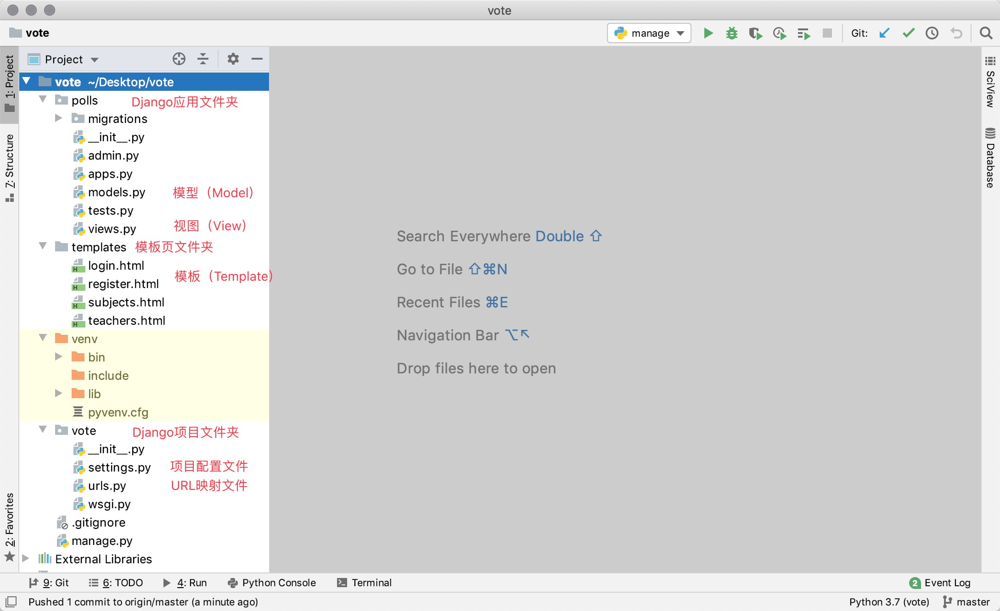
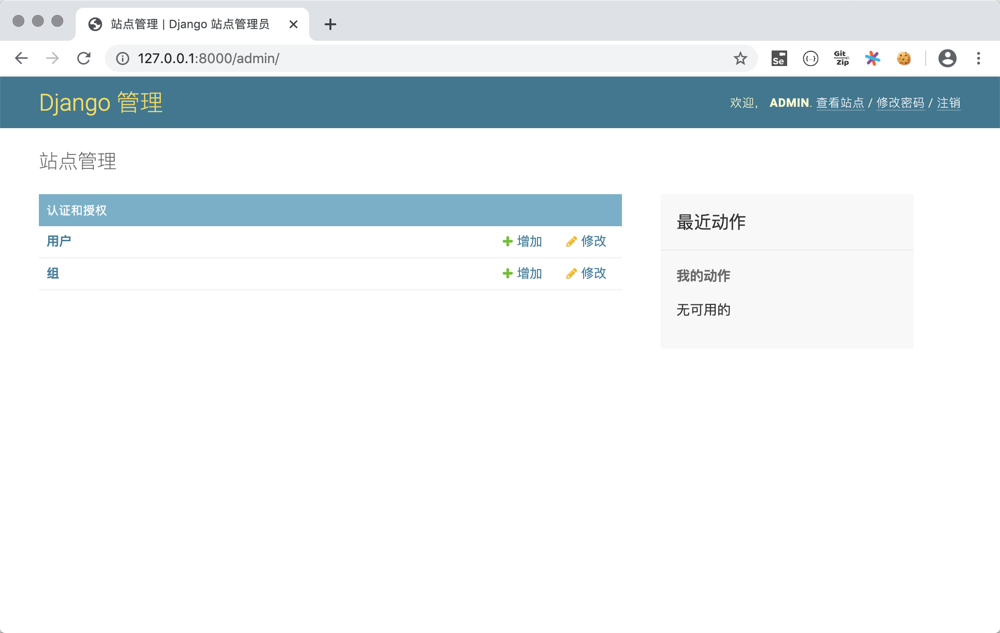
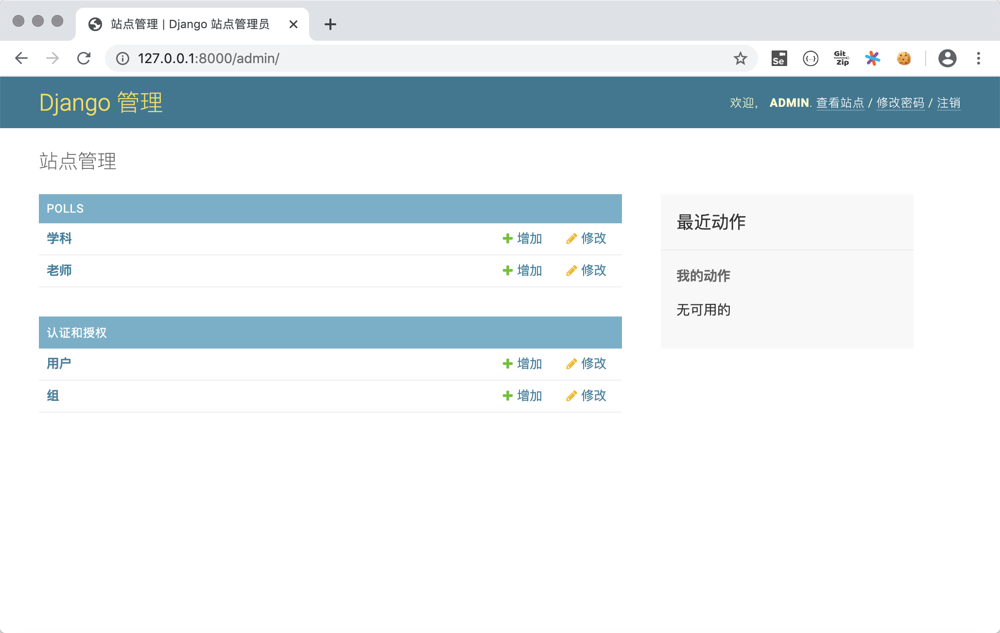
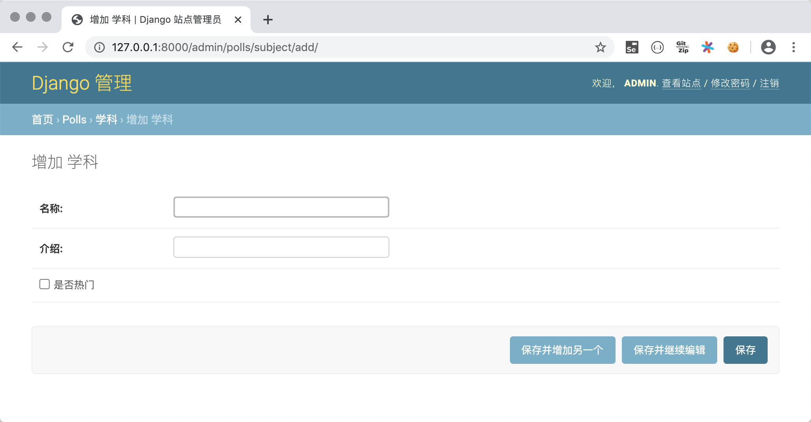
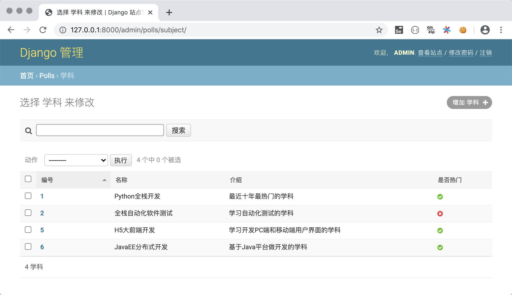
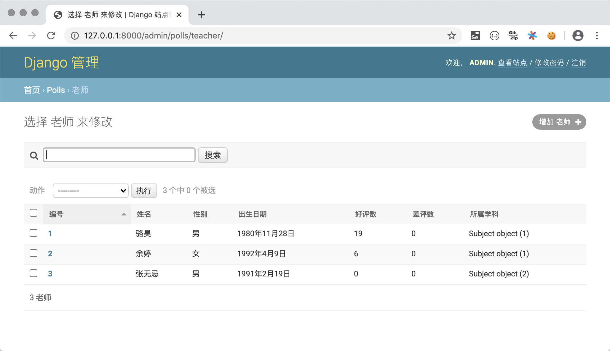

## 深入模型

在上一个章节中，我们提到了Django是基于MVC架构的Web框架，MVC架构追求的是“模型”和“视图”的解耦合。所谓“模型”说得更直白一些就是数据（的表示），所以通常也被称作“数据模型”。在实际的项目中，数据模型通常通过数据库实现持久化操作，而关系型数据库在过去和当下都是持久化的首选方案，下面我们通过完成一个投票项目来讲解和模型相关的知识点。投票项目的首页会展示某在线教育平台所有的学科；点击学科可以查看到该学科的老师及其信息；用户登录后在查看老师的页面为老师投票，可以投赞成票和反对票；未登录的用户可以通过登录页进行登录；尚未注册的用户可以通过注册页输入个人信息进行注册。在这个项目中，我们使用MySQL数据库来实现数据持久化操作。

### 创建项目和应用

我们首先创建Django项目`vote`并为其添加虚拟环境和依赖项。接下来，在项目下创建名为`polls`的应用和保存模板页的文件夹`tempaltes`，项目文件夹的结构如下所示。



根据上面描述的项目需求，我们准备了四个静态页面，分别是展示学科的页面`subjects.html`，显示学科老师的页面`teachers.html`，登录页面`login.html`，注册页面`register.html`，稍后我们会将静态页修改为Django项目所需的模板页。

### 配置关系型数据库MySQL 

1. 在MySQL中创建数据库，创建用户，授权用户访问该数据库。

   ```SQL
   create database vote default charset utf8;
   create user 'hellokitty'@'%' identified by 'Hellokitty.618';
   grant all privileges on vote.* to 'hellokitty'@'%';
   flush privileges;
   ```

2. 在MySQL中创建保存学科和老师信息的二维表（保存用户信息的表稍后处理）。

   ```SQL
   use vote;
   
   -- 创建学科表
   create table `tb_subject`
   (
   	`no` integer auto_increment comment '学科编号',
       `name` varchar(50) not null comment '学科名称',
       `intro` varchar(1000) not null default '' comment '学科介绍',
       `is_hot` boolean not null default 0 comment '是不是热门学科',
       primary key (`no`)
   );
   -- 创建老师表
   create table `tb_teacher`
   (
       `no` integer auto_increment comment '老师编号',
       `name` varchar(20) not null comment '老师姓名',
       `sex` boolean not null default 1 comment '老师性别',
       `birth` date not null comment '出生日期',
       `intro` varchar(1000) not null default '' comment '老师介绍',
       `photo` varchar(255) not null default '' comment '老师照片',
       `gcount` integer not null default 0 comment '好评数',
       `bcount` integer not null default 0 comment '差评数',
       `sno` integer not null comment '所属学科',
       primary key (`no`),
       foreign key (`sno`) references `tb_subject` (`no`)
   );
   ```

3. 在虚拟环境中安装连接MySQL数据库所需的依赖项。

   ```Bash
   pip install mysqlclient
   ```

   > **说明**：如果因为某些原因无法安装`mysqlclient`三方库，可以使用它的替代品`pymysql`，`pymysql`是用纯Python开发的连接MySQL的Python库，安装更容易成功，但是需要在Django项目文件夹的`__init__.py`中添加如下所示的代码。
   >
   > ```Python
   > import pymysql
   > 
   > pymysql.install_as_MySQLdb()
   > ```
   >
   > 如果使用Django 2.2及以上版本，还会遇到PyMySQL跟Django框架的兼容性问题，兼容性问题会导致项目无法运行，需要按照GitHub上PyMySQL仓库[Issues](https://github.com/PyMySQL/PyMySQL/issues/790)中提供的方法进行处理。总体来说，使用`pymysql`会比较麻烦，强烈建议大家首选安装`mysqlclient`。

4. 修改项目的settings.py文件，首先将我们创建的应用`polls`添加已安装的项目（`INSTALLED_APPS`）中，然后配置MySQL作为持久化方案。

   ```Python
   INSTALLED_APPS = [
       'django.contrib.admin',
       'django.contrib.auth',
       'django.contrib.contenttypes',
       'django.contrib.sessions',
       'django.contrib.messages',
       'django.contrib.staticfiles',
       'polls',
   ]
   
   DATABASES = {
       'default': {
           # 数据库引擎配置
           'ENGINE': 'django.db.backends.mysql',
           # 数据库的名字
           'NAME': 'vote',
           # 数据库服务器的IP地址（本机可以写localhost或127.0.0.1）
           'HOST': 'localhost',
           # 启动MySQL服务的端口号
           'PORT': 3306,
           # 数据库用户名和口令
           'USER': 'hellokitty',
           'PASSWORD': 'Hellokitty.618',
           # 数据库使用的字符集
           'CHARSET': 'utf8',
           # 数据库时间日期的时区设定
           'TIME_ZONE': 'Asia/Chongqing',
       }
   }
   ```

   在配置ENGINE属性时，常用的可选值包括：

   - `'django.db.backends.sqlite3'`：SQLite嵌入式数据库。
   - `'django.db.backends.postgresql'`：BSD许可证下发行的开源关系型数据库产品。
   - `'django.db.backends.mysql'`：甲骨文公司经济高效的数据库产品。
   - `'django.db.backends.oracle'`：甲骨文公司关系型数据库旗舰产品。

   其他的配置可以参考官方文档中[数据库配置](https://docs.djangoproject.com/zh-hans/2.0/ref/databases/#third-party-notes)的部分。

5. Django框架提供了ORM来解决数据持久化问题，ORM翻译成中文叫“对象关系映射”。因为Python是面向对象的编程语言，我们在Python程序中使用对象模型来保存数据，而关系型数据库使用关系模型，用二维表来保存数据，这两种模型并不匹配。使用ORM是为了实现对象模型到关系模型的**双向转换**，这样就不用在Python代码中书写SQL语句和游标操作，因为这些都会由ORM自动完成。利用Django的ORM，我们可以直接将刚才创建的学科表和老师表变成Django中的模型类。

   ```Bash
   python manage.py inspectdb > polls/models.py
   ```

   我们可以对自动生成的模型类稍作调整，代码如下所示。

   ```Python
   from django.db import models
   
   
   class Subject(models.Model):
       no = models.AutoField(primary_key=True, verbose_name='编号')
       name = models.CharField(max_length=50, verbose_name='名称')
       intro = models.CharField(max_length=1000, verbose_name='介绍')
       is_hot = models.BooleanField(verbose_name='是否热门')
   
       class Meta:
           managed = False
           db_table = 'tb_subject'
           verbose_name = '学科'
           verbose_name_plural = '学科'
   
   
   class Teacher(models.Model):
       no = models.AutoField(primary_key=True, verbose_name='编号')
       name = models.CharField(max_length=20, verbose_name='姓名')
       sex = models.BooleanField(default=True, verbose_name='性别')
       birth = models.DateField(verbose_name='出生日期')
       intro = models.CharField(max_length=1000, verbose_name='个人介绍')
       photo = models.ImageField(max_length=255, verbose_name='照片')
       good_count = models.IntegerField(default=0, db_column='gcount', verbose_name='好评数')
       bad_count = models.IntegerField(default=0, db_column='bcount', verbose_name='差评数')
       subject = models.ForeignKey(Subject, models.DO_NOTHING, db_column='sno')
   
       class Meta:
           managed = False
           db_table = 'tb_teacher'
   ```

   > **说明**：模型类都直接或间接继承自`Model`类，模型类跟关系型数据库的二维表对应，模型对象跟表中的记录对应，模型对象的属性跟表中的字段对应。如果对上面模型类的属性定义不是特别理解，可以看看本文后面提供的“模型定义参考”部分的内容。

### 使用ORM完成模型的CRUD操作

有了Django框架的ORM，我们可以直接使用面向对象的方式来实现对数据的CRUD（增删改查）操作。我们可以在PyCharm的终端中输入下面的命令进入到Django项目的交互式环境，然后尝试对模型的操作。

```Bash
python manage.py shell
```

#### 新增

```Python
from polls.models import Subject

subject1 = Subject(name='Python全栈开发', intro='当下最热门的学科', is_hot=True)
subject1.save()
subject2 = Subject(name='全栈软件测试', intro='学习自动化测试的学科', is_hot=False)
subject2.save()
subject3 = Subject(name='JavaEE分布式开发', intro='基于Java语言的服务器应用开发', is_hot=True)
```

#### 删除

```Python
subject = Subject.objects.get(no=2)
subject.delete()
```

#### 更新

```Shell
subject = Subject.objects.get(no=1)
subject.name = 'Python全栈+人工智能'
subject.save()
```

#### 查询

1. 查询所有对象。

```Shell
Subjects.objects.all()
```

2. 过滤数据。

```Shell
# 查询名称为“Python全栈+人工智能”的学科
Subject.objects.filter(name='Python全栈+人工智能')

# 查询名称包含“全栈”的学科（模糊查询）
Subject.objects.filter(name__contains='全栈')

# 查询所有热门学科
Subject.objects.filter(is_hot=True)

# 查询编号大于3小于10的学科
Subject.objects.filter(no__gt=3).filter(no__lt=10)
Subject.objects.filter(no__gt=3, no__lt=10)

# 查询编号在3到7之间的学科
Subject.objects.filter(no__ge=3, no__le=7)
Subject.objects.filter(no__range=(3, 7))
```

3. 查询单个对象。

```Shell
# 查询主键为1的学科
Subject.objects.get(pk=1)
Subject.objects.get(no=1)
Subject.objects.filter(no=1).first()
Subject.objects.filter(no=1).last()
```

4. 排序。

```Shell
# 查询所有学科按编号升序排列
Subject.objects.order_by('no')
# 查询所有部门按部门编号降序排列
Subject.objects.order_by('-no')
```

5. 切片（分页查询）。

```Shell
# 按编号从小到大查询前3个学科
Subject.objects.order_by('no')[:3]
```

6. 计数。

```Python
# 查询一共有多少个学科
Subject.objects.count()
```

7. 高级查询。

```Shell
# 查询编号为1的学科的老师
Teacher.objects.filter(subject__no=1)
Subject.objects.get(pk=1).teacher_set.all() 

# 查询学科名称有“全栈”二字的学科的老师
Teacher.objects.filter(subject__name__contains='全栈') 
```

> **说明1**：由于老师与学科之间存在多对一外键关联，所以能通过学科反向查询到该学科的老师（从一对多关系中“一”的一方查询“多”的一方），反向查询属性默认的名字是`类名小写_set`（如上面例子中的`teacher_set`），当然也可以在创建模型时通过`ForeingKey`的`related_name`属性指定反向查询属性的名字。如果不希望执行反向查询可以将`related_name`属性设置为`'+'`或者以`'+'`开头的字符串。

> **说明2**：ORM查询多个对象时会返回QuerySet对象，QuerySet使用了惰性查询，即在创建QuerySet对象的过程中不涉及任何数据库活动，等真正用到对象时（对QuerySet求值）才向数据库发送SQL语句并获取对应的结果，这一点在实际开发中需要引起注意！

> **说明3**：如果希望更新多条数据，不用先逐一获取模型对象再修改对象属性，可以直接使用QuerySet对象的`update()`方法一次性更新多条数据。


### 利用Django后台管理模型

在创建好模型类之后，可以通过Django框架自带的后台管理应用（`admin`应用）实现对模型的管理。虽然实际应用中，这个后台可能并不能满足我们的需求，但是在学习Django框架时，我们可以利用`admin`应用来管理我们的模型，同时也通过它来了解一个项目的后台管理系统需要哪些功能。使用Django自带的`admin`应用步骤如下所示。

1. 将`admin`应用所需的表迁移到数据库中。`admin`应用本身也需要数据库的支持，而且在`admin`应用中已经定义好了相关的数据模型类，我们只需要通过模型迁移操作就能自动在数据库中生成所需的二维表。

   ```Bash
   python manage.py migrate
   ```
   
2. 创建访问`admin`应用的超级用户账号，这里需要输入用户名、邮箱和口令。

   ```Shell
   python manage.py createsuperuser
   ```

   > **说明**：输入口令时没有回显也不能退格，需要一气呵成完成输入。

3. 运行项目，在浏览器中访问`http://127.0.0.1:8000/admin`，输入刚才创建的超级用户账号和密码进行登录。

   

   登录后进入管理员操作平台。

   

   注意，我们暂时还没能在`admin`应用中看到之前创建的模型类，为此需要在`polls`应用的`admin.py`文件中对需要管理的模型进行注册。

4. 注册模型类。

   ```Python
   from django.contrib import admin
   
   from polls.models import Subject, Teacher

   admin.site.register(Subject)
   admin.site.register(Teacher)
   ```
   
   注册模型类后，就可以在后台管理系统中看到它们。
   
   

5. 对模型进行CRUD操作。

   可以在管理员平台对模型进行C（新增）、R（查看）、U（更新）、D（删除）操作，如下图所示。

   - 添加学科。

       

   - 查看所有学科。

       

   - 删除和更新学科。

       

6. 注册模型管理类。

   可能大家已经注意到了，刚才在后台查看部门信息的时候，显示的部门信息并不直观，为此我们再修改`admin.py`文件，通过注册模型管理类，可以在后台管理系统中更好的管理模型。

   ```Python
   from django.contrib import admin

   from polls.models import Subject, Teacher
   
   
   class SubjectModelAdmin(admin.ModelAdmin):
       list_display = ('no', 'name', 'intro', 'is_hot')
       search_fields = ('name', )
       ordering = ('no', )
   
   
   class TeacherModelAdmin(admin.ModelAdmin):
       list_display = ('no', 'name', 'sex', 'birth', 'good_count', 'bad_count', 'subject')
       search_fields = ('name', )
       ordering = ('no', )
   
   
   admin.site.register(Subject, SubjectModelAdmin)
   admin.site.register(Teacher, TeacherModelAdmin)
   ```
   
   
   
   
   
   为了更好的查看模型，我们为`Subject`类添加`__str__`魔法方法，并在该方法中返回学科名字。这样在如上图所示的查看老师的页面上显示老师所属学科时，就不再是`Subject object(1)`这样晦涩的信息，而是学科的名称。

### 实现学科页和老师页效果

1. 修改`polls/views.py`文件，编写视图函数实现对学科页和老师页的渲染。

    ```Python
    from django.shortcuts import render, redirect
    
    from polls.models import Subject, Teacher
    
    
    def show_subjects(request):
        subjects = Subject.objects.all().order_by('no')
        return render(request, 'subjects.html', {'subjects': subjects})
    
    
    def show_teachers(request):
        try:
            sno = int(request.GET.get('sno'))
            teachers = []
            if sno:
                subject = Subject.objects.only('name').get(no=sno)
                teachers = Teacher.objects.filter(subject=subject).order_by('no')
            return render(request, 'teachers.html', {
                'subject': subject,
                'teachers': teachers
            })
        except (ValueError, Subject.DoesNotExist):
            return redirect('/')
   ```

2. 修改`templates/subjects.html`和`templates/teachers.html`模板页。

    `subjects.html`

     ```HTML
    <!DOCTYPE html>
    <html lang="en">
    <head>
        <meta charset="UTF-8">
        <title>学科信息</title>
        <style>
            #container {
                width: 80%;
                margin: 10px auto;
            }
            .user {
                float: right;
                margin-right: 10px;
            }
            .user>a {
                margin-right: 10px;
            }
            #main>dl>dt {
                font-size: 1.5em;
                font-weight: bold;
            }
            #main>dl>dd {
                font-size: 1.2em;
            }
            a {
                text-decoration: none;
                color: darkcyan;
            }
        </style>
    </head>
    <body>
        <div id="container">
            <div class="user">
                <a href="login.html">用户登录</a>
                <a href="register.html">快速注册</a>
            </div>
            <h1>扣丁学堂所有学科</h1>
            <hr>
            <div id="main">
                
                <dl>
                    <dt>
                        <a href="/teachers/?sno={{ subject.no }}">{{ subject.name }}</a>
                        
                        
                        
                    </dt>
                    <dd>{{ subject.intro }}</dd>
                </dl>
                
            </div>
        </div>
    </body>
    </html>
     ```

    `teachers.html`

    ```HTML
    <!DOCTYPE html>
    <html lang="en">
    <head>
        <meta charset="UTF-8">
        <title>老师信息</title>
        <style>
            #container {
                width: 80%;
                margin: 10px auto;
            }
            .teacher {
                width: 100%;
                margin: 0 auto;
                padding: 10px 0;
                border-bottom: 1px dashed gray;
                overflow: auto;
            }
            .teacher>div {
                float: left;
            }
            .photo {
                height: 140px;
                border-radius: 75px;
                overflow: hidden;
                margin-left: 20px;
            }
            .info {
                width: 75%;
                margin-left: 30px;
            }
            .info div {
                clear: both;
                margin: 5px 10px;
            }
            .info span {
                margin-right: 25px;
            }
            .info a {
                text-decoration: none;
                color: darkcyan;
            }
        </style>
    </head>
    <body>
        <div id="container">
            <h1>{{ subject.name }}学科的老师信息</h1>
            <hr>
            
                <h2>暂无该学科老师信息</h2>
            
            
            <div class="teacher">
                <div class="photo">
                    
                </div>
                <div class="info">
                    <div>
                        <span><strong>姓名：{{ teacher.name }}</strong></span>
                        <span>性别：{{ teacher.sex | yesno:'男,女' }}</span>
                        <span>出生日期：{{ teacher.birth }}</span>
                    </div>
                    <div class="intro">{{ teacher.intro }}</div>
                    <div class="comment">
                        <a href="">好评</a>&nbsp;(<strong>{{ teacher.good_count }}</strong>)
                        &nbsp;&nbsp;&nbsp;&nbsp;
                        <a href="">差评</a>&nbsp;<strong>{{ teacher.bad_count }}</strong>)
                    </div>
                </div>
            </div>
            
            <a href="/">返回首页</a>
        </div>
    </body>
    </html>
    ```

3. 修改`vote/urls.py`文件，实现映射URL。

    ```Python
    from django.contrib import admin
    from django.urls import path
    
    from polls.views import show_subjects, show_teachers
    
    urlpatterns = [
        path('admin/', admin.site.urls),
        path('', show_subjects),
        path('teachers/', show_teachers),
    ]
    ```

到此为止，页面上需要的图片（静态资源）还没有能够正常展示，我们在下一章节中为大家介绍如何处理模板页上的需要的静态资源。

### 补充内容

#### Django模型最佳实践

1. 正确的为模型和关系字段命名。
2. 设置适当的`related_name`属性。
3. 用`OneToOneField`代替`ForeignKeyField(unique=True)`。
4. 通过“迁移操作”（migrate）来添加模型。
5. 用NoSQL来应对需要降低范式级别的场景。
6. 如果布尔类型可以为空要使用`NullBooleanField`。
7. 在模型中放置业务逻辑。
8. 用`<ModelName>.DoesNotExists`取代`ObjectDoesNotExists`。
9. 在数据库中不要出现无效数据。
10. 不要对`QuerySet`调用`len()`函数。
11. 将`QuerySet`的`exists()`方法的返回值用于`if`条件。
12. 用`DecimalField`来存储货币相关数据而不是`FloatField`。
13. 定义`__str__`方法。
14. 不要将数据文件放在同一个目录中。

> **说明**：以上内容来自于STEELKIWI网站的[*Best Practice working with Django models in Python*](https://steelkiwi.com/blog/best-practices-working-django-models-python/)，有兴趣的小伙伴可以阅读原文。

#### 模型定义参考

##### 字段

对字段名称的限制

- 字段名不能是Python的保留字，否则会导致语法错误
- 字段名不能有多个连续下划线，否则影响ORM查询操作

Django模型字段类

| 字段类                  | 说明                                                         |
| ----------------------- | ------------------------------------------------------------ |
| `AutoField`             | 自增ID字段                                                   |
| `BigIntegerField`       | 64位有符号整数                                               |
| `BinaryField`           | 存储二进制数据的字段，对应Python的`bytes`类型                |
| `BooleanField`          | 存储`True`或`False`                                          |
| `CharField`             | 长度较小的字符串                                             |
| `DateField`             | 存储日期，有`auto_now`和`auto_now_add`属性                   |
| `DateTimeField`         | 存储日期和日期，两个附加属性同上                             |
| `DecimalField`          | 存储固定精度小数，有`max_digits`（有效位数）和`decimal_places`（小数点后面）两个必要的参数 |
| `DurationField`         | 存储时间跨度                                                 |
| `EmailField`            | 与`CharField`相同，可以用`EmailValidator`验证                |
| `FileField`             | 文件上传字段                                                 |
| `FloatField`            | 存储浮点数                                                   |
| `ImageField`            | 其他同`FileFiled`，要验证上传的是不是有效图像                |
| `IntegerField`          | 存储32位有符号整数。                                         |
| `GenericIPAddressField` | 存储IPv4或IPv6地址                                           |
| `NullBooleanField`      | 存储`True`、`False`或`null`值                                |
| `PositiveIntegerField`  | 存储无符号整数（只能存储正数）                               |
| `SlugField`             | 存储slug（简短标注）                                         |
| `SmallIntegerField`     | 存储16位有符号整数                                           |
| `TextField`             | 存储数据量较大的文本                                         |
| `TimeField`             | 存储时间                                                     |
| `URLField`              | 存储URL的`CharField`                                         |
| `UUIDField`             | 存储全局唯一标识符                                           |

##### 字段属性

通用字段属性

| 选项             | 说明                                                         |
| ---------------- | ------------------------------------------------------------ |
| `null`           | 数据库中对应的字段是否允许为`NULL`，默认为`False`            |
| `blank`          | 后台模型管理验证数据时，是否允许为`NULL`，默认为`False`      |
| `choices`        | 设定字段的选项，各元组中的第一个值是设置在模型上的值，第二值是人类可读的值 |
| `db_column`      | 字段对应到数据库表中的列名，未指定时直接使用字段的名称       |
| `db_index`       | 设置为`True`时将在该字段创建索引                             |
| `db_tablespace`  | 为有索引的字段设置使用的表空间，默认为`DEFAULT_INDEX_TABLESPACE` |
| `default`        | 字段的默认值                                                 |
| `editable`       | 字段在后台模型管理或`ModelForm`中是否显示，默认为`True`      |
| `error_messages` | 设定字段抛出异常时的默认消息的字典，其中的键包括`null`、`blank`、`invalid`、`invalid_choice`、`unique`和`unique_for_date` |
| `help_text`      | 表单小组件旁边显示的额外的帮助文本。                         |
| `primary_key`    | 将字段指定为模型的主键，未指定时会自动添加`AutoField`用于主键，只读。 |
| `unique`         | 设置为`True`时，表中字段的值必须是唯一的                     |
| `verbose_name`   | 字段在后台模型管理显示的名称，未指定时使用字段的名称         |

`ForeignKey`属性

1. `limit_choices_to`：值是一个Q对象或返回一个Q对象，用于限制后台显示哪些对象。
2. `related_name`：用于获取关联对象的关联管理器对象（反向查询），如果不允许反向，该属性应该被设置为`'+'`，或者以`'+'`结尾。
3. `to_field`：指定关联的字段，默认关联对象的主键字段。
4. `db_constraint`：是否为外键创建约束，默认值为`True`。
5. `on_delete`：外键关联的对象被删除时对应的动作，可取的值包括`django.db.models`中定义的：
   - `CASCADE`：级联删除。
   - `PROTECT`：抛出`ProtectedError`异常，阻止删除引用的对象。
   - `SET_NULL`：把外键设置为`null`，当`null`属性被设置为`True`时才能这么做。
   - `SET_DEFAULT`：把外键设置为默认值，提供了默认值才能这么做。

`ManyToManyField`属性

1. `symmetrical`：是否建立对称的多对多关系。
2. `through`：指定维持多对多关系的中间表的Django模型。
3. `throughfields`：定义了中间模型时可以指定建立多对多关系的字段。
4. `db_table`：指定维持多对多关系的中间表的表名。

##### 模型元数据选项

| 选项                    | 说明                                                         |
| ----------------------- | ------------------------------------------------------------ |
| `abstract`              | 设置为True时模型是抽象父类                                   |
| `app_label`             | 如果定义模型的应用不在INSTALLED_APPS中可以用该属性指定       |
| `db_table`              | 模型使用的数据表名称                                         |
| `db_tablespace`         | 模型使用的数据表空间                                         |
| `default_related_name`  | 关联对象回指这个模型时默认使用的名称，默认为<model_name>_set |
| `get_latest_by`         | 模型中可排序字段的名称。                                     |
| `managed`               | 设置为True时，Django在迁移中创建数据表并在执行flush管理命令时把表移除 |
| `order_with_respect_to` | 标记对象为可排序的                                           |
| `ordering`              | 对象的默认排序                                               |
| `permissions`           | 创建对象时写入权限表的额外权限                               |
| `default_permissions`   | 默认为`('add', 'change', 'delete')`                          |
| `unique_together`       | 设定组合在一起时必须独一无二的字段名                         |
| `index_together`        | 设定一起建立索引的多个字段名                                 |
| `verbose_name`          | 为对象设定人类可读的名称                                     |
| `verbose_name_plural`   | 设定对象的复数名称                                           |

#### 查询参考

##### 按字段查找可以用的条件

1. `exact` / `iexact`：精确匹配/忽略大小写的精确匹配查询
2. `contains` / `icontains` / `startswith` / `istartswith` / `endswith` / `iendswith`：基于`like`的模糊查询
3. `in` ：集合运算
4. `gt` / `gte` / `lt` / `lte`：大于/大于等于/小于/小于等于关系运算
5. `range`：指定范围查询（SQL中的`between…and…`）
6. `year` / `month` / `day` / `week_day` / `hour` / `minute` / `second`：查询时间日期
7. `isnull`：查询空值（True）或非空值（False）
8. `search`：基于全文索引的全文检索（一般很少使用）
9. `regex` / `iregex`：基于正则表达式的模糊匹配查询


