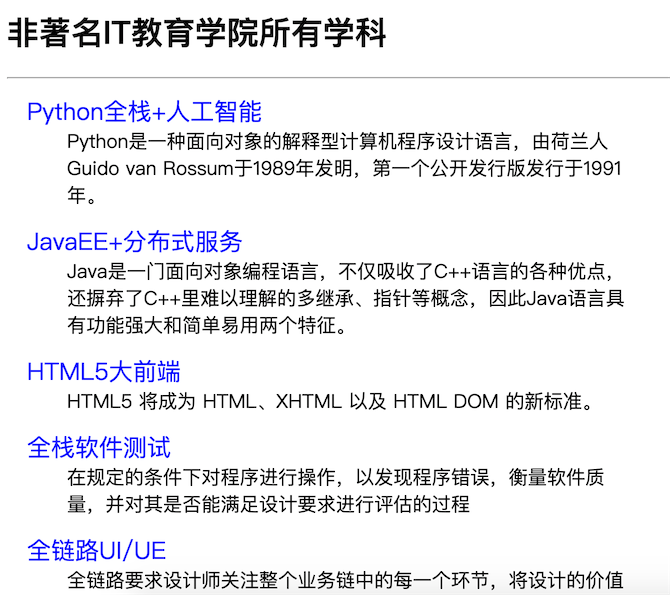
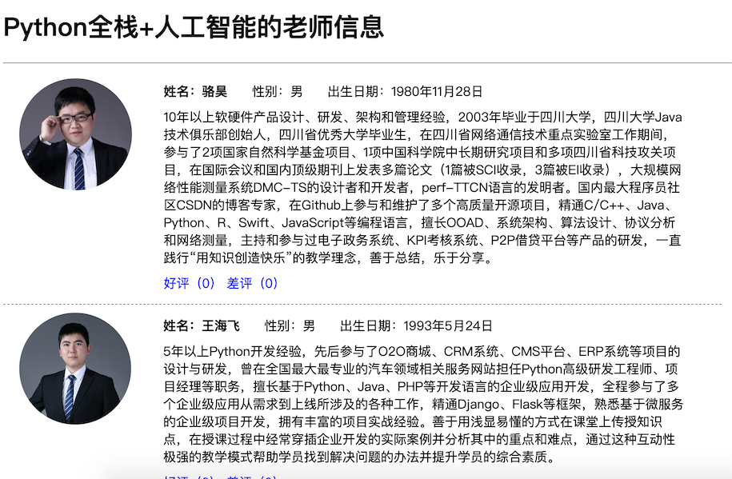

## 静态资源和Ajax请求

基于前面两个章节讲解的知识，我们已经可以使用Django框架来实现Web应用的开发了。接下来我们就尝试实现一个投票应用，具体的需求是用户进入应用首先查看到“学科介绍”页面，该页面显示了一个学校所开设的所有学科；通过点击某个学科，可以进入“老师介绍”页面，该页面展示了该学科所有老师的详细情况，可以在该页面上给老师点击“好评”或“差评”，但是会先跳转到“登录页”要求用户登录，登录成功才能投票；对于未注册的用户，可以在“登录页”点击“新用户注册”进入“注册页”完成用户注册，注册成功后会跳转到“登录页”，注册失败会获得相应的提示信息。

### 准备工作

由于之前已经详细的讲解了如何创建Django项目以及项目的相关配置，因此我们略过这部分内容，唯一需要说明的是，从上面对投票应用需求的描述中我们可以分析出三个业务实体：学科、老师和用户。学科和老师之间通常是一对多关联关系（一个学科有多个老师，一个老师通常只属于一个学科），用户因为要给老师投票，所以跟老师之间是多对多关联关系（一个用户可以给多个老师投票，一个老师也可以收到多个用户的投票）。首先修改应用下的models.py文件来定义数据模型，先给出学科和老师的模型。

```Python
from django.db import models


class Subject(models.Model):
    """学科"""
    no = models.AutoField(primary_key=True, verbose_name='编号')
    name = models.CharField(max_length=31, verbose_name='名称')
    intro = models.CharField(max_length=511, verbose_name='介绍')

    def __str__(self):
        return self.name

    class Meta:
        db_table = 'tb_subject'
        verbose_name_plural = '学科'


class Teacher(models.Model):
    """老师"""
    no = models.AutoField(primary_key=True, verbose_name='编号')
    name = models.CharField(max_length=15, verbose_name='姓名')
    gender = models.BooleanField(default=True, choices=((True, '男'), (False, '女')), verbose_name='性别')
    birth = models.DateField(null=True, verbose_name='出生日期')
    intro = models.CharField(max_length=511, default='', verbose_name='')
    good_count = models.IntegerField(default=0, verbose_name='好评数')
    bad_count = models.IntegerField(default=0, verbose_name='差评数')
    photo = models.CharField(max_length=255, verbose_name='照片')
    subject = models.ForeignKey(to=Subject, on_delete=models.PROTECT, db_column='sno', verbose_name='所属学科')

    def __str__(self):
        return self.name

    class Meta:
        db_table = 'tb_teacher'
        verbose_name_plural = '老师'
```

模型定义完成后，可以通过“生成迁移”和“执行迁移”来完成关系型数据库中二维表的创建，当然这需要提前启动数据库服务器并创建好对应的数据库，同时我们在项目中已经安装了PyMySQL而且完成了相应的配置，这些内容此处不再赘述。

```Shell
(venv)$ python manage.py makemigrations vote
...
(venv)$ python manage.py migrate
...
```

> 注意：为了给vote应用生成迁移，需要先修改Django项目的配置文件settings.py，在INSTALLED_APPS中添加vote应用。

完成模型迁移之后，我们可以通过下面的SQL语句来添加学科和老师测试的数据。

```SQL
INSERT INTO `tb_subject` (`no`,`name`,`intro`) 
VALUES 
(1, 'Python全栈+人工智能', 'Python是一种面向对象的解释型计算机程序设计语言，由荷兰人Guido van Rossum于1989年发明，第一个公开发行版发行于1991年。'),
(2, 'JavaEE+分布式服务', 'Java是一门面向对象编程语言，不仅吸收了C++语言的各种优点，还摒弃了C++里难以理解的多继承、指针等概念，因此Java语言具有功能强大和简单易用两个特征。'),
(3, 'HTML5大前端', 'HTML5 将成为 HTML、XHTML 以及 HTML DOM 的新标准。'),
(4, '全栈软件测试', '在规定的条件下对程序进行操作，以发现程序错误，衡量软件质量，并对其是否能满足设计要求进行评估的过程'),
(5, '全链路UI/UE', '全链路要求设计师关注整个业务链中的每一个环节，将设计的价值融入每一个和用户的接触点中，让整个业务的用户体验质量得到几何级数的增长。');

INSERT INTO `tb_teacher` (`no`,`name`,`gender`,`birth`,`intro`,`good_count`,`bad_count`,`photo`,`sno`) 
VALUES 
(1, '骆昊', 1, '1980-11-28', '10年以上软硬件产品设计、研发、架构和管理经验，2003年毕业于四川大学，四川大学Java技术俱乐部创始人，四川省优秀大学毕业生，在四川省网络通信技术重点实验室工作期间，参与了2项国家自然科学基金项目、1项中国科学院中长期研究项目和多项四川省科技攻关项目，在国际会议和国内顶级期刊上发表多篇论文（1篇被SCI收录，3篇被EI收录），大规模网络性能测量系统DMC-TS的设计者和开发者，perf-TTCN语言的发明者。国内最大程序员社区CSDN的博客专家，在Github上参与和维护了多个高质量开源项目，精通C/C++、Java、Python、R、Swift、JavaScript等编程语言，擅长OOAD、系统架构、算法设计、协议分析和网络测量，主持和参与过电子政务系统、KPI考核系统、P2P借贷平台等产品的研发，一直践行“用知识创造快乐”的教学理念，善于总结，乐于分享。', 0, 0, 'images/luohao.png', 1),
(2, '王海飞', 1, '1993-05-24', '5年以上Python开发经验，先后参与了O2O商城、CRM系统、CMS平台、ERP系统等项目的设计与研发，曾在全国最大最专业的汽车领域相关服务网站担任Python高级研发工程师、项目经理等职务，擅长基于Python、Java、PHP等开发语言的企业级应用开发，全程参与了多个企业级应用从需求到上线所涉及的各种工作，精通Django、Flask等框架，熟悉基于微服务的企业级项目开发，拥有丰富的项目实战经验。善于用浅显易懂的方式在课堂上传授知识点，在授课过程中经常穿插企业开发的实际案例并分析其中的重点和难点，通过这种互动性极强的教学模式帮助学员找到解决问题的办法并提升学员的综合素质。', 0, 0, 'images/wangdachui.png', 1),
(3, '余婷', 0, '1992-03-12', '5年以上移动互联网项目开发经验和教学经验，曾担任上市游戏公司高级软件研发工程师和移动端（iOS）技术负责人，参了多个企业级应用和游戏类应用的移动端开发和后台服务器开发，拥有丰富的开发经验和项目管理经验，以个人开发者和协作开发者的身份在苹果的AppStore上发布过多款App。精通Python、C、Objective-C、Swift等开发语言，熟悉iOS原生App开发、RESTful接口设计以及基于Cocos2d-x的游戏开发。授课条理清晰、细致入微，性格活泼开朗、有较强的亲和力，教学过程注重理论和实践的结合，在学员中有良好的口碑。', 0, 0, 'images/yuting.png', 1),
(4, '肖世荣', 1, '1977-07-02', '10年以上互联网和移动互联网产品设计、研发、技术架构和项目管理经验，曾在中国移动、symbio、ajinga.com、万达信息等公司担任架构师、项目经理、技术总监等职务，长期为苹果、保时捷、耐克、沃尔玛等国际客户以及国内的政府机构提供信息化服务，主导的项目曾获得“世界科技先锋”称号，个人作品“许愿吧”曾在腾讯应用市场生活类App排名前3，拥有百万级用户群体，运营的公众号“卵石坊”是国内知名的智能穿戴设备平台。精通Python、C++、Java、Ruby、JavaScript等开发语言，主导和参与了20多个企业级项目（含国家级重大项目和互联网创新项目），涉及的领域包括政务、社交、电信、卫生和金融，有极为丰富的项目实战经验。授课深入浅出、条理清晰，善于调动学员的学习热情并帮助学员理清思路和方法。', 0, 0, 'images/xiaoshirong.png', 1),
(5, '张无忌', 1, '1987-07-07', '出生起便在冰火岛过着原始生活，踏入中土后因中玄冥神掌命危而带病习医，忍受寒毒煎熬七年最后因福缘际会练成“九阳神功”更在之后又练成了“乾坤大挪移”等盖世武功，几乎无敌于天下。 生性随和，宅心仁厚，精通医术和药理。20岁时便凭着盖世神功当上明教教主，率领百万教众及武林群雄反抗蒙古政权元朝的高压统治，最后推翻了元朝。由于擅长乾坤大挪移神功，上课遇到问题就转移话题，属于拉不出屎怪地球没有引力的类型。', 0, 0, 'images/zhangwuji.png', 5),
(6, '韦一笑', 1, '1975-12-15', '外号“青翼蝠王”，为明教四大护教法王之一。  身披青条子白色长袍，轻功十分了得。由于在修炼至阴至寒的“寒冰绵掌”时出了差错，经脉中郁积了至寒阴毒，只要运上内力，寒毒就会发作，如果不吸人血解毒，全身血脉就会凝结成冰，后得张无忌相助，以其高明医术配以“九阳神功”，终将寒毒驱去，摆脱了吸吮人血这一命运。由于轻功绝顶，学生一问问题就跑了。', 0, 0, 'images/weiyixiao.png', 3);
```

当然也可以直接使用Django提供的后台管理应用来添加学科和老师信息，这需要先注册模型类和模型管理类。

```SQL
from django.contrib import admin
from django.contrib.admin import ModelAdmin

from vote.models import Teacher, Subject


class SubjectModelAdmin(ModelAdmin):
    """学科模型管理"""
    list_display = ('no', 'name')
    ordering = ('no', )


class TeacherModelAdmin(ModelAdmin):
    """老师模型管理"""
    list_display = ('no', 'name', 'gender', 'birth', 'good_count', 'bad_count', 'subject')
    ordering = ('no', )
    search_fields = ('name', )


admin.site.register(Subject, SubjectModelAdmin)
admin.site.register(Teacher, TeacherModelAdmin)
```

接下来，我们就可以修改views.py文件，通过编写视图函数先实现“学科介绍”页面。

```Python
def show_subjects(request):
    """查看所有学科"""
    subjects = Subject.objects.all()
    return render(request, 'subject.html', {'subjects': subjects})
```

至此，我们还需要一个模板页，模板的配置以及模板页中模板语言的用法在之前已经进行过简要的介绍，如果不熟悉可以看看下面的代码，相信这并不是一件困难的事情。

```HTML
<!DOCTYPE html>
<html lang="en">
<head>
    <meta charset="UTF-8">
    <title>学科信息</title>
    <style>/* 此处略去了层叠样式表的选择器 */</style>
</head>
<body>
    <h1>千锋互联所有学科信息</h1>
    <hr>
    <div id="container">
        
        <dl>
            <dt>
                <a href="/teachers?sno={{ subject.no }}">
                    {{ subject.name }}
                </a>
            </dt>
            <dd>{{ subject.intro }}</dd>
        </dl>
        
    </div>
</body>
</html>
```

在上面的模板中，我们为每个学科添加了一个超链接，点击超链接可以查看该学科的讲师信息，为此需要再编写一个视图函数来处理查看指定学科老师信息。

```Python
def show_teachers(request):
    """查看指定学科的老师"""
    try:
        sno = int(request.GET['sno'])
        subject = Subject.objects.get(no=sno)
        teachers = Teacher.objects.filter(subject__no=sno)
        context = {'subject': subject, 'teachers': teachers}
        return render(request, 'teacher.html', context)
    except (KeyError, ValueError, Subject.DoesNotExist):
        return redirect('/')
```

显示老师信息的模板页。

```HTML
<!DOCTYPE html>

<html lang="en">
<head>
    <meta charset="UTF-8">
    <title>老师信息</title>
    <style>/* 此处略去了层叠样式表的选择器 */</style>
</head>
<body>
    <h1>{{ subject.name }}学科老师信息</h1>
    <hr>
    
    <div id="container">
        
        <div class="teacher">
            <div class="photo">
                
            </div>
            <div class="info">
                <div>
                    <span><strong>姓名：{{ teacher.name }}</strong></span>
                    <span>性别：{{ teacher.gender | yesno:'男,女' }}</span>
                    <span>出生日期：{{ teacher.birth }}</span>
                </div>
                <div class="intro">{{ teacher.intro }}</div>
                <div class="comment">
                    <a href="">好评（{{ teacher.good_count }}）</a>
                    <a href="">差评（{{ teacher.bad_count }}）</a>
                </div>
            </div>
        </div>
        
    </div>
    
    <h2>暂时没有该学科的老师信息</h2>
    
    <div class="back">
        <a href="/">&lt;&lt;&nbsp;返回学科</a>
    </div>
</body>
</html>
```

### 加载静态资源

在上面的模板页面中，我们使用了``标签来加载老师的照片，其中使用了引用静态资源的模板指令``，要使用该指令，首先要使用``指令来加载静态资源，我们将这段代码放在了页码开始的位置。在上面的项目中，我们将静态资源置于名为static的文件夹中，在该文件夹下又创建了三个文件夹：css、js和images，分别用来保存外部层叠样式表、外部JavaScript文件和图片资源。为了能够找到保存静态资源的文件夹，我们还需要修改Django项目的配置文件settings.py，如下所示：

```Python
# 此处省略上面的代码

STATICFILES_DIRS = [os.path.join(BASE_DIR, 'static'), ]
STATIC_URL = '/static/'

# 此处省略下面的代码
```

接下来修改urls.py文件，配置用户请求的URL和视图函数的对应关系。

```Python
from django.contrib import admin
from django.urls import path

from vote import views

urlpatterns = [
    path('', views.show_subjects),
    path('teachers/', views.show_teachers),
    path('admin/', admin.site.urls),
]
```

启动服务器运行项目，进入首页查看学科信息。



点击学科查看老师信息。



### Ajax请求

接下来就可以实现“好评”和“差评”的功能了，很明显如果能够在不刷新页面的情况下实现这两个功能会带来更好的用户体验，因此我们考虑使用[Ajax](https://zh.wikipedia.org/wiki/AJAX)技术来实现“好评”和“差评”，Ajax技术我们在之前的章节中已经介绍过了，此处不再赘述。

首先修改项目的urls.py文件，为“好评”和“差评”功能映射对应的URL。

```Python
from django.contrib import admin
from django.urls import path

from vote import views

urlpatterns = [
    path('', views.show_subjects),
    path('teachers/', views.show_teachers),
    path('praise/', views.prise_or_criticize),
    path('criticize/', views.prise_or_criticize),
    path('admin/', admin.site.urls),
]
```

设计视图函数`praise_or_criticize`来支持“好评”和“差评”功能，该视图函数通过Django封装的JsonResponse类将字典序列化成JSON字符串作为返回给浏览器的响应内容。

```Python
def praise_or_criticize(request):
    """好评"""
    try:
        tno = int(request.GET['tno'])
        teacher = Teacher.objects.get(no=tno)
        if request.path.startswith('/prise'):
            teacher.good_count += 1
        else:
            teacher.bad_count += 1
        teacher.save()
        data = {'code': 200, 'hint': '操作成功'}
    except (KeyError, ValueError, Teacher.DoseNotExist):
        data = {'code': 404, 'hint': '操作失败'}
    return JsonResponse(data)
```

修改显示老师信息的模板页，引入jQuery库来实现事件处理、Ajax请求和DOM操作。

```HTML
<script src=""></script>
<script>
    $(() => {
        $('.comment>a').on('click', (evt) => {
            evt.preventDefault();
            let a = $(evt.target)
            let span = a.next()
            $.getJSON(a.attr('href'), (json) => {
                if (json.code == 200) {
                    span.text(parseInt(span.text()) + 1)
                } else {
                    alert(json.hint)
                }
            })
        })
    })
</script>
```

### 小结

到此为止，这个投票项目的核心功能已然完成，在下面的章节中我们会要求用户必须登录才能投票，没有账号的用户可以通过注册功能注册一个账号。