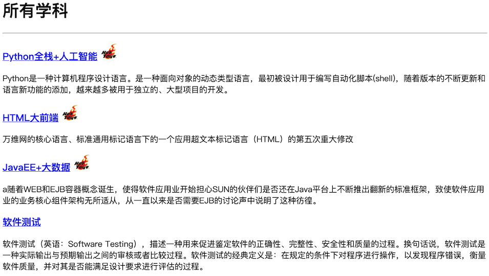

## 静态资源和Ajax请求

基于前面两个章节讲解的知识，我们已经可以使用Django框架来完成Web应用的开发了。接下来我们就尝试实现一个投票应用，具体的需求是用户进入应用首先查看到“学科介绍”页面，该页面显示了一个学校所开设的所有学科；通过点击某个学科，可以进入“老师介绍”页面，该页面展示了该学科所有老师的详细情况，可以在该页面上给老师点击“好评”或“差评”；如果用户没有登录，在投票时会先跳转到“登录页”要求用户登录，登录成功才能投票；对于未注册的用户，可以在“登录页”点击“新用户注册”进入“注册页”完成用户注册操作，注册成功后会跳转到“登录页”，注册失败会获得相应的提示信息。

### 准备工作

由于之前已经详细的讲解了如何创建Django项目以及项目的相关配置，因此我们略过这部分内容，唯一需要说明的是，从上面对投票应用需求的描述中我们可以分析出三个业务实体：学科、老师和用户。学科和老师之间通常是一对多关联关系（一个学科有多个老师，一个老师通常只属于一个学科），用户因为要给老师投票，所以跟老师之间是多对多关联关系（一个用户可以给多个老师投票，一个老师也可以收到多个用户的投票）。首先修改应用下的models.py文件来定义数据模型，先给出学科和老师的模型。

```Python
from django.db import models


class Subject(models.Model):
    """学科"""
    no = models.IntegerField(primary_key=True, verbose_name='编号')
    name = models.CharField(max_length=20, verbose_name='名称')
    intro = models.CharField(max_length=511, default='', verbose_name='介绍')
    create_date = models.DateField(null=True, verbose_name='成立日期')
    is_hot = models.BooleanField(default=False, verbose_name='是否热门')

    def __str__(self):
        return self.name

    class Meta:
        db_table = 'tb_subject'
        verbose_name = '学科'
        verbose_name_plural = '学科'


class Teacher(models.Model):
    """老师"""
    no = models.AutoField(primary_key=True, verbose_name='编号')
    name = models.CharField(max_length=20, verbose_name='姓名')
    detail = models.CharField(max_length=1023, default='', blank=True, verbose_name='详情')
    photo = models.CharField(max_length=1023, default='', verbose_name='照片')
    good_count = models.IntegerField(default=0, verbose_name='好评数')
    bad_count = models.IntegerField(default=0, verbose_name='差评数')
    subject = models.ForeignKey(to=Subject, on_delete=models.PROTECT, db_column='sno', verbose_name='所属学科')

    class Meta:
        db_table = 'tb_teacher'
        verbose_name = '老师'
        verbose_name_plural = '老师'
```

模型定义完成后，可以通过“生成迁移”和“执行迁移”来完成关系型数据库中二维表的创建，当然这需要提前启动数据库服务器并创建好对应的数据库，同时我们在项目中已经安装了PyMySQL而且完成了相应的配置，这些内容此处不再赘述。

```Shell
(venv)$ python manage.py makemigrations vote
...
(venv)$ python manage.py migrate
...
```

> 注意：为了给vote应用生成迁移文件，需要修改Django项目settings.py文件，在INSTALLED_APPS中添加vote应用。

完成模型迁移之后，我们可以直接使用Django提供的后台管理来添加学科和老师信息，这需要先注册模型类和模型管理类。

```SQL
from django.contrib import admin

from poll2.forms import UserForm
from poll2.models import Subject, Teacher


class SubjectAdmin(admin.ModelAdmin):
    list_display = ('no', 'name', 'create_date', 'is_hot')
    ordering = ('no', )


class TeacherAdmin(admin.ModelAdmin):
    list_display = ('no', 'name', 'detail', 'good_count', 'bad_count', 'subject')
    ordering = ('subject', 'no')


admin.site.register(Subject, SubjectAdmin)
admin.site.register(Teacher, TeacherAdmin)
```

接下来，我们就可以修改views.py文件，通过编写视图函数先实现“学科介绍”页面。

```Python
def show_subjects(request):
    """查看所有学科"""
    subjects = Subject.objects.all()
    return render(request, 'subject.html', {'subjects': subjects})
```

至此，我们还需要一个模板页，模板的配置以及模板页中模板语言的用法在之前已经进行过简要的介绍，如果不熟悉可以看看下面的代码，相信这并不是一件困难的事情。

```HTML
<!DOCTYPE html>
<html lang="en">
<head>
    <meta charset="UTF-8">
    <title>所有学科信息</title>
    <style>/* 此处略去了层叠样式表的选择器 */</style>
</head>
<body>
    <h1>所有学科</h1>
    <hr>
    
    <div>
        <h3>
            <a href="/teachers/?sno={{ subject.no }}">{{ subject.name }}</a>
            
            
            
        </h3>
        <p>{{ subject.intro }}</p>
    </div>
    
</body>
</html>
```

在上面的模板中，我们为每个学科添加了一个超链接，点击超链接可以查看该学科的讲师信息，为此需要再编写一个视图函数来处理查看指定学科老师信息。

```Python
def show_teachers(request):
    """显示指定学科的老师"""
    try:
        sno = int(request.GET['sno'])
        subject = Subject.objects.get(no=sno)
        teachers = subject.teacher_set.all()
        return render(request, 'teachers.html', {'subject': subject, 'teachers': teachers})
    except (KeyError, ValueError, Subject.DoesNotExist):
        return redirect('/')
```

显示老师信息的模板页。

```HTML
<!DOCTYPE html>

<html lang="en">
<head>
    <meta charset="UTF-8">
    <title>老师</title>
    <style>/* 此处略去了层叠样式表的选择器 */</style>
</head>
<body>
    <h1>{{ subject.name }}学科老师信息</h1>
    <hr>
    
    
    <div>
        <div>
            
        </div>
        <div>
            <h3>{{ teacher.name }}</h3>
            <p>{{ teacher.detail }}</p>
            <p class="comment">
                <a href="">好评</a>
                (<span>{{ teacher.good_count }}</span>)
                <a href="">差评</a>
                (<span>{{ teacher.bad_count }}</span>)
            </p>
        </div>
    </div>
    
    
    <h3>暂时没有该学科的老师信息</h3>
    
    <p>
        <a href="/">返回首页</a>
    </p>
</body>
</html>
```

### 加载静态资源

在上面的模板页面中，我们使用了``标签来加载老师的照片，其中使用了引用静态资源的模板指令``，要使用该指令，首先要使用``指令来加载静态资源，我们将这段代码放在了页码开始的位置。在上面的项目中，我们将静态资源置于名为static的文件夹中，在该文件夹下又创建了三个文件夹：css、js和images，分别用来保存外部层叠样式表、外部JavaScript文件和图片资源。为了能够找到保存静态资源的文件夹，我们还需要修改Django项目的配置文件settings.py，如下所示：

```Python
# 此处省略上面的代码

STATICFILES_DIRS = [os.path.join(BASE_DIR, 'static'), ]
STATIC_URL = '/static/'

# 此处省略下面的代码
```

接下来修改urls.py文件，配置用户请求的URL和视图函数的对应关系。

```Python
from django.contrib import admin
from django.urls import path

from vote import views

urlpatterns = [
    path('', views.show_subjects),
    path('teachers/', views.show_teachers),
    path('admin/', admin.site.urls),
]
```

启动服务器运行项目，进入首页查看学科信息。



点击学科查看老师信息。


### Ajax请求

接下来就可以实现“好评”和“差评”的功能了，很明显如果能够在不刷新页面的情况下实现这两个功能会带来更好的用户体验，因此我们考虑使用[Ajax](https://zh.wikipedia.org/wiki/AJAX)技术来实现“好评”和“差评”，Ajax技术我们在Web前端部分已经介绍过了，此处不再赘述。

首先修改项目的urls.py文件，为“好评”和“差评”功能映射对应的URL。

```Python
from django.contrib import admin
from django.urls import path

from vote import views

urlpatterns = [
    path('', views.show_subjects),
    path('teachers/', views.show_teachers),
    path('praise/', views.prise_or_criticize),
    path('criticize/', views.prise_or_criticize),
    path('admin/', admin.site.urls),
]
```

设计视图函数`praise_or_criticize`来支持“好评”和“差评”功能，该视图函数通过Django封装的JsonResponse类将字典序列化成JSON字符串作为返回给浏览器的响应内容。

```Python
def praise_or_criticize(request):
    """好评"""
    try:
        tno = int(request.GET['tno'])
        teacher = Teacher.objects.get(no=tno)
        if request.path.startswith('/praise'):
            teacher.good_count += 1
        else:
            teacher.bad_count += 1
        teacher.save()
        data = {'code': 200, 'hint': '操作成功'}
    except (KeyError, ValueError, Teacher.DoseNotExist):
        data = {'code': 404, 'hint': '操作失败'}
    return JsonResponse(data)
```

修改显示老师信息的模板页，引入jQuery库来实现事件处理、Ajax请求和DOM操作。

```HTML
<!DOCTYPE html>

<html lang="en">
<head>
    <meta charset="UTF-8">
    <title>老师</title>
    <style>/* 此处略去了层叠样式表的选择器 */</style>
</head>
<body>
    <h1>{{ subject.name }}学科老师信息</h1>
    <hr>
    
    
    <div class="teacher">
        <div class="photo">
            
        </div>
        <div class="info">
            <h3>{{ teacher.name }}</h3>
            <p>{{ teacher.detail }}</p>
            <p class="comment">
                <a href="/praise/?tno={{ teacher.no }}">好评</a>
                (<span>{{ teacher.good_count }}</span>)
                &nbsp;&nbsp;
                <a href="/criticize/?tno={{ teacher.no }}">差评</a>
                (<span>{{ teacher.bad_count }}</span>)
            </p>
        </div>
    </div>
    
    
    <h3>暂时没有该学科的老师信息</h3>
    
    <p>
        <a href="/">返回首页</a>
    </p>
    <script src="https://cdn.bootcss.com/jquery/3.4.1/jquery.min.js"></script>
    <script>
        $(() => {
            $('.comment>a').on('click', (evt) => {
                evt.preventDefault()
                let anchor = $(evt.target)
                let url = anchor.attr('href')
                $.getJSON(url, (json) => {
                    if (json.code == 10001) {
                        let span = anchor.next()
                        span.text(parseInt(span.text()) + 1)
                    } else {
                        alert(json.hint)
                    }
                })
            })
        })
    </script>
</body>
</html>
```

### 小结

到此为止，这个投票项目的核心功能已然完成，在下面的章节中我们会要求用户必须登录才能投票，没有账号的用户可以通过注册功能注册一个账号。