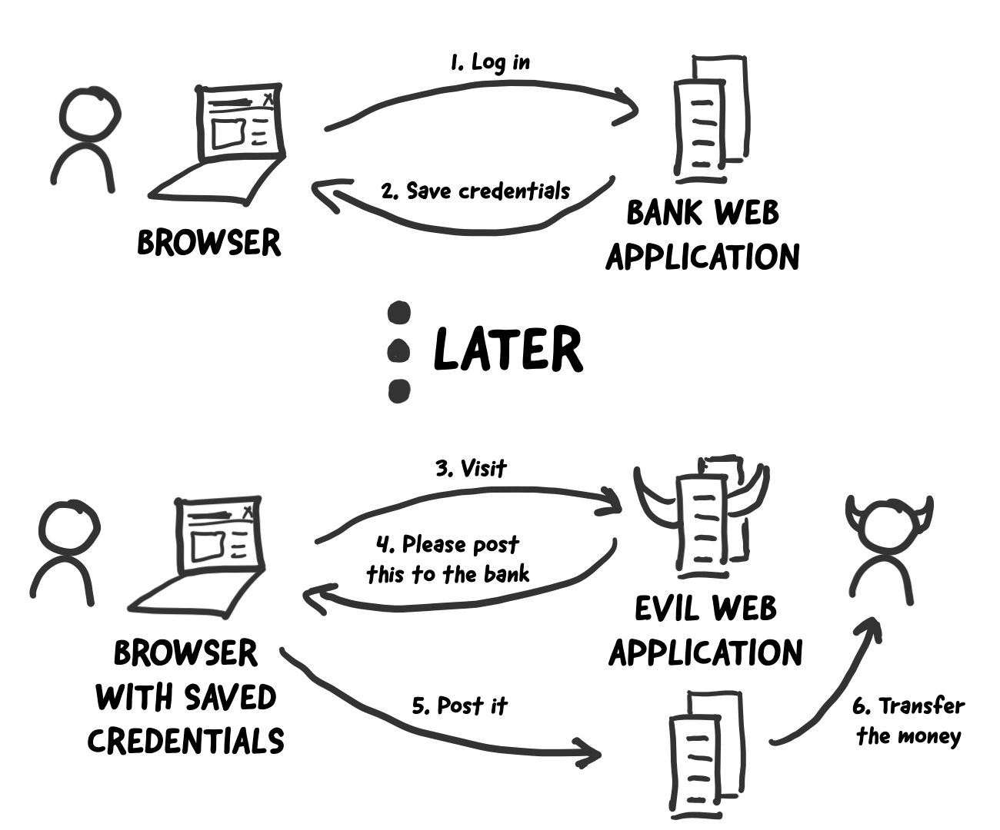

## Cookie和Session

我们继续来完成上一章节中的项目，实现“用户登录”的功能，并限制只有登录的用户才能投票。

### 用户登录的准备工作

我们先为实现用户登录做一些准备工作。

1. 创建用户模型。之前我们讲解过如果通过Django的ORM实现从二维表到模型的转换（反向工程），这次我们尝试把模型变成二维表（正向工程）。

    ```Python
    class User(models.Model):
        """用户"""
        no = models.AutoField(primary_key=True, verbose_name='编号')
        username = models.CharField(max_length=20, unique=True, verbose_name='用户名')
        password = models.CharField(max_length=32, verbose_name='密码')
        tel = models.CharField(max_length=20, verbose_name='手机号')
        reg_date = models.DateTimeField(auto_now_add=True, verbose_name='注册时间')
        last_visit = models.DateTimeField(null=True, verbose_name='最后登录时间')
    
        class Meta:
            db_table = 'tb_user'
            verbose_name = '用户'
            verbose_name_plural = '用户'
    ```
    
2. 使用下面的命令生成迁移文件并执行迁移，将`User`模型直接变成关系型数据库中的二维表`tb_user`。

    ```Bash
    python manage.py makemigrations polls
    python manage.py migrate polls
    ```

3. 用下面的SQL语句直接插入两条测试数据，通常不能讲用户的密码直接保存在数据库中，因此我们将用户密码处理成对应的MD5摘要。MD5消息摘要算法是一种被广泛使用的密码哈希函数（散列函数），可以产生出一个128位（比特）的哈希值（散列值），用于确保信息传输完整一致。在使用哈希值时，通常会将哈希值表示为16进制字符串，因此128位的MD5摘要通常表示为32个十六进制符号。

    ```SQL
    insert into `tb_user`
        (`username`, `password`, `tel`, `reg_date`)
    values
        ('wangdachui', '1c63129ae9db9c60c3e8aa94d3e00495', '13122334455', now()),
        ('hellokitty', 'c6f8cf68e5f68b0aa4680e089ee4742c', '13890006789', now());
    ```

    > **说明**：上面创建的两个用户`wangdachui`和`hellokitty`密码分别是`1qaz2wsx`和`Abc123!!`。

4. 我们在应用下增加一个名为`utils.py`的模块用来保存需要使用的工具函数。Python标准库中的`hashlib`模块封装了常用的哈希算法，包括：MD5、SHA1、SHA256等。下面是使用`hashlib`中的`md5`类将字符串处理成MD5摘要的函数如下所示。

    ```Python
    import hashlib
    
    
    def gen_md5_digest(content):
        return hashlib.md5(content.encode()).hexdigest()
    ```

5. 编写用户登录的视图函数和模板页。

    添加渲染登录页面的视图函数：

    ```Python
    def login(request: HttpRequest) -> HttpResponse:
        hint = ''
        return render(request, 'login.html', {'hint': hint})
    ```

    增加`login.html`模板页：

    ```HTML
    <!DOCTYPE html>
    <html lang="en">
    <head>
        <meta charset="UTF-8">
        <title>用户登录</title>
        <style>
            #container {
                width: 520px;
                margin: 10px auto;
            }
            .input {
                margin: 20px 0;
                width: 460px;
                height: 40px;
            }
            .input>label {
                display: inline-block;
                width: 140px;
                text-align: right;
            }
            .input>img {
                width: 150px;
                vertical-align: middle;
            }
            input[name=captcha] {
                vertical-align: middle;
            }
            form+div {
                margin-top: 20px;
            }
            form+div>a {
                text-decoration: none;
                color: darkcyan;
                font-size: 1.2em;
            }
            .button {
                width: 500px;
                text-align: center;
                margin-top: 20px;
            }
            .hint {
                color: red;
                font-size: 12px;
            }
        </style>
    </head>
    <body>
        <div id="container">
            <h1>用户登录</h1>
            <hr>
            <p class="hint">{{ hint }}</p>
            <form action="/login/" method="post">
                
                <fieldset>
                    <legend>用户信息</legend>
                    <div class="input">
                        <label>用户名：</label>
                        <input type="text" name="username">
                    </div>
                    <div class="input">
                        <label>密码：</label>
                        <input type="password" name="password">
                    </div>
                    <div class="input">
                        <label>验证码：</label>
                        <input type="text" name="captcha">
                        
                    </div>
                </fieldset>
                <div class="button">
                    <input type="submit" value="登录">
                    <input type="reset" value="重置">
                </div>
            </form>
            <div>
                <a href="/">返回首页</a>
                <a href="/register/">注册新用户</a>
            </div>
        </div>
    </body>
    </html>
    ```

    注意，在上面的表单中，我们使用了模板指令``为表单添加一个隐藏域（大家可以在浏览器中显示网页源代码就可以看到这个指令生成的`type`属性为`hidden`的`input`标签），它的作用是在表单中生成一个随机令牌（token）来防范[跨站请求伪造](<https://zh.wikipedia.org/wiki/%E8%B7%A8%E7%AB%99%E8%AF%B7%E6%B1%82%E4%BC%AA%E9%80%A0>)（简称为CSRF），这也是Django在提交表单时的硬性要求。如果我们的表单中没有这样的令牌，那么提交表单时，Django框架会产生一个响应状态码为`403`的响应（禁止访问），除非我们设置了免除CSRF令牌。下图是一个关于CSRF简单生动的例子。

    

接下来，我们可以编写提供验证码和实现用户登录的视图函数，在此之前，我们先说说一个Web应用实现用户跟踪的方式以及Django框架对实现用户跟踪所提供的支持。对一个Web应用来说，用户登录成功后必然要让服务器能够记住该用户已经登录，这样服务器才能为这个用户提供更好的服务，而且上面说到的CSRF也是通过钓鱼网站来套取用户登录信息进行恶意操作的攻击手段，这些都是以用户跟踪技术为基础的。在理解了这些背景知识后，我们就清楚用户登录时到底需要执行哪些操作。

### 实现用户跟踪

如今，一个网站如果不通过某种方式记住你是谁以及你之前在网站的活动情况，失去的就是网站的可用性和便利性，继而很有可能导致网站用户的流式，所以记住一个用户（更专业的说法叫**用户跟踪**）对绝大多数Web应用来说都是必需的功能。

在服务器端，我们想记住一个用户最简单的办法就是创建一个对象，通过这个对象就可以把用户相关的信息都保存起来，这个对象就是我们常说的session（用户会话对象）。那么问题来了，HTTP本身是一个**无连接**（每次请求和响应的过程中，服务器一旦完成对客户端请求的响应之后就断开连接）、**无状态**（客户端再次发起对服务器的请求时，服务器无法得知这个客户端之前的任何信息）的协议，即便服务器通过session对象保留了用户数据，还得通过某种方式来确定当前的请求与之前保存过的哪一个session是有关联的。相信很多人都能想到，我们可以给每个session对象分配一个全局唯一的标识符来识别session对象，我们姑且称之为sessionid，每次客户端发起请求时，只要携带上这个sessionid，就有办法找到与之对应的session对象，从而实现在两次请求之间记住该用户的信息，也就是我们之前说的用户跟踪。

要让客户端记住并在每次请求时带上sessionid又有以下几种做法：

1. URL重写。所谓URL重写就是在URL中携带sessionid，例如：`http://www.example.com/index.html?sessionid=123456`，服务器通过获取sessionid参数的值来取到与之对应的session对象。

2. 隐藏域（隐式表单域）。在提交表单的时候，可以通过在表单中设置隐藏域向服务器发送额外的数据。例如：`<input type="hidden" name="sessionid" value="123456">`。

3. 本地存储。现在的浏览器都支持多种本地存储方案，包括：cookie、localStorage、sessionStorage、IndexedDB等。在这些方案中，cookie是历史最为悠久也是被诟病得最多的一种方案，也是我们接下来首先为大家讲解的一种方案。简单的说，cookie是一种以键值对方式保存在浏览器临时文件中的数据，每次请求时，请求头中会携带本站点的cookie到服务器，那么只要将sessionid写入cookie，下次请求时服务器只要读取请求头中的cookie就能够获得这个sessionid，如下图所示。

   

   在HTML5时代要，除了cookie，还可以使用新的本地存储API来保存数据，就是刚才提到的localStorage、sessionStorage、IndexedDB等技术，如下图所示。

   

**总结一下**，要实现用户跟踪，服务器端可以为每个用户会话创建一个session对象并将session对象的ID写入到浏览器的cookie中；用户下次请求服务器时，浏览器会在HTTP请求头中携带该网站保存的cookie信息，这样服务器就可以从cookie中找到session对象的ID并根据此ID获取到之前创建的session对象；由于session对象可以用键值对的方式保存用户数据，这样之前保存在session对象中的信息可以悉数取出，服务器也可以根据这些信息判定用户身份和了解用户偏好，为用户提供更好的个性化服务。

### Django框架对session的支持

在创建Django项目时，默认的配置文件`settings.py`文件中已经激活了一个名为`SessionMiddleware`的中间件（关于中间件的知识我们在后面的章节做详细讲解，这里只需要知道它的存在即可），因为这个中间件的存在，我们可以直接通过请求对象的`session`属性来操作会话对象。前面我们说过，`session`属性是一个像字典一样可以读写数据的容器对象，因此我们可以使用“键值对”的方式来保留用户数据。与此同时，`SessionMiddleware`中间件还封装了对cookie的操作，在cookie中保存了sessionid，这一点我们在上面已经提到过了。

在默认情况下，Django将session的数据序列化后保存在关系型数据库中，在Django 1.6以后的版本中，默认的序列化数据的方式是JSON序列化，而在此之前一直使用Pickle序列化。JSON序列化和Pickle序列化的差别在于前者将对象序列化为字符串（字符形式），而后者将对象序列化为字节串（二进制形式），因为安全方面的原因，JSON序列化成为了目前Django框架默认序列化数据的方式，这就要求在我们保存在session中的数据必须是能够JSON序列化的，否则就会引发异常。还有一点需要说明的是，使用关系型数据库保存session中的数据在大多数时候并不是最好的选择，因为数据库可能会承受巨大的压力而成为系统性能的瓶颈，在后面的章节中我们会告诉大家如何将session保存到缓存服务中以提升系统的性能。

### 实现用户登录验证

首先，我们在刚才的`polls/utils.py`文件中编写生成随机验证码的函数`gen_random_code`，内容如下所示。

```Python
import random

ALL_CHARS = '0123456789abcdefghijklmnopqrstuvwxyzABCDEFGHIJKLMNOPQRSTUVWXYZ'


def gen_random_code(length=4):
    return ''.join(random.choices(ALL_CHARS, k=length))
```

编写生成验证码图片的类`Captcha`。

```Python
"""
图片验证码
"""
import os
import random
from io import BytesIO

from PIL import Image
from PIL import ImageFilter
from PIL.ImageDraw import Draw
from PIL.ImageFont import truetype


class Bezier:
    """贝塞尔曲线"""

    def __init__(self):
        self.tsequence = tuple([t / 20.0 for t in range(21)])
        self.beziers = {}

    def make_bezier(self, n):
        """绘制贝塞尔曲线"""
        try:
            return self.beziers[n]
        except KeyError:
            combinations = pascal_row(n - 1)
            result = []
            for t in self.tsequence:
                tpowers = (t ** i for i in range(n))
                upowers = ((1 - t) ** i for i in range(n - 1, -1, -1))
                coefs = [c * a * b for c, a, b in zip(combinations,
                                                      tpowers, upowers)]
                result.append(coefs)
            self.beziers[n] = result
            return result


class Captcha:
    """验证码"""

    def __init__(self, width, height, fonts=None, color=None):
        self._image = None
        self._fonts = fonts if fonts else \
            [os.path.join(os.path.dirname(__file__), 'fonts', font)
             for font in ['Arial.ttf', 'Georgia.ttf', 'Action.ttf']]
        self._color = color if color else random_color(0, 200, random.randint(220, 255))
        self._width, self._height = width, height

    @classmethod
    def instance(cls, width=200, height=75):
        """用于获取Captcha对象的类方法"""
        prop_name = f'_instance_{width}_{height}'
        if not hasattr(cls, prop_name):
            setattr(cls, prop_name, cls(width, height))
        return getattr(cls, prop_name)

    def _background(self):
        """绘制背景"""
        Draw(self._image).rectangle([(0, 0), self._image.size],
                                    fill=random_color(230, 255))

    def _smooth(self):
        """平滑图像"""
        return self._image.filter(ImageFilter.SMOOTH)

    def _curve(self, width=4, number=6, color=None):
        """绘制曲线"""
        dx, height = self._image.size
        dx /= number
        path = [(dx * i, random.randint(0, height))
                for i in range(1, number)]
        bcoefs = Bezier().make_bezier(number - 1)
        points = []
        for coefs in bcoefs:
            points.append(tuple(sum([coef * p for coef, p in zip(coefs, ps)])
                                for ps in zip(*path)))
        Draw(self._image).line(points, fill=color if color else self._color, width=width)

    def _noise(self, number=50, level=2, color=None):
        """绘制扰码"""
        width, height = self._image.size
        dx, dy = width / 10, height / 10
        width, height = width - dx, height - dy
        draw = Draw(self._image)
        for i in range(number):
            x = int(random.uniform(dx, width))
            y = int(random.uniform(dy, height))
            draw.line(((x, y), (x + level, y)),
                      fill=color if color else self._color, width=level)

    def _text(self, captcha_text, fonts, font_sizes=None, drawings=None, squeeze_factor=0.75, color=None):
        """绘制文本"""
        color = color if color else self._color
        fonts = tuple([truetype(name, size)
                       for name in fonts
                       for size in font_sizes or (65, 70, 75)])
        draw = Draw(self._image)
        char_images = []
        for c in captcha_text:
            font = random.choice(fonts)
            c_width, c_height = draw.textsize(c, font=font)
            char_image = Image.new('RGB', (c_width, c_height), (0, 0, 0))
            char_draw = Draw(char_image)
            char_draw.text((0, 0), c, font=font, fill=color)
            char_image = char_image.crop(char_image.getbbox())
            for drawing in drawings:
                d = getattr(self, drawing)
                char_image = d(char_image)
            char_images.append(char_image)
        width, height = self._image.size
        offset = int((width - sum(int(i.size[0] * squeeze_factor)
                                  for i in char_images[:-1]) -
                      char_images[-1].size[0]) / 2)
        for char_image in char_images:
            c_width, c_height = char_image.size
            mask = char_image.convert('L').point(lambda i: i * 1.97)
            self._image.paste(char_image,
                              (offset, int((height - c_height) / 2)),
                              mask)
            offset += int(c_width * squeeze_factor)

    @staticmethod
    def _warp(image, dx_factor=0.3, dy_factor=0.3):
        """图像扭曲"""
        width, height = image.size
        dx = width * dx_factor
        dy = height * dy_factor
        x1 = int(random.uniform(-dx, dx))
        y1 = int(random.uniform(-dy, dy))
        x2 = int(random.uniform(-dx, dx))
        y2 = int(random.uniform(-dy, dy))
        warp_image = Image.new(
            'RGB',
            (width + abs(x1) + abs(x2), height + abs(y1) + abs(y2)))
        warp_image.paste(image, (abs(x1), abs(y1)))
        width2, height2 = warp_image.size
        return warp_image.transform(
            (width, height),
            Image.QUAD,
            (x1, y1, -x1, height2 - y2, width2 + x2, height2 + y2, width2 - x2, -y1))

    @staticmethod
    def _offset(image, dx_factor=0.1, dy_factor=0.2):
        """图像偏移"""
        width, height = image.size
        dx = int(random.random() * width * dx_factor)
        dy = int(random.random() * height * dy_factor)
        offset_image = Image.new('RGB', (width + dx, height + dy))
        offset_image.paste(image, (dx, dy))
        return offset_image

    @staticmethod
    def _rotate(image, angle=25):
        """图像旋转"""
        return image.rotate(random.uniform(-angle, angle),
                            Image.BILINEAR, expand=1)

    def generate(self, captcha_text='', fmt='PNG'):
        """生成验证码(文字和图片)
        :param captcha_text: 验证码文字
        :param fmt: 生成的验证码图片格式
        :return: 验证码图片的二进制数据
        """
        self._image = Image.new('RGB', (self._width, self._height), (255, 255, 255))
        self._background()
        self._text(captcha_text, self._fonts,
                   drawings=['_warp', '_rotate', '_offset'])
        self._curve()
        self._noise()
        self._smooth()
        image_bytes = BytesIO()
        self._image.save(image_bytes, format=fmt)
        return image_bytes.getvalue()


def pascal_row(n=0):
    """生成毕达哥拉斯三角形（杨辉三角）"""
    result = [1]
    x, numerator = 1, n
    for denominator in range(1, n // 2 + 1):
        x *= numerator
        x /= denominator
        result.append(x)
        numerator -= 1
    if n & 1 == 0:
        result.extend(reversed(result[:-1]))
    else:
        result.extend(reversed(result))
    return result


def random_color(start=0, end=255, opacity=255):
    """获得随机颜色"""
    red = random.randint(start, end)
    green = random.randint(start, end)
    blue = random.randint(start, end)
    if opacity is None:
        return red, green, blue
    return red, green, blue, opacity
```

> **说明**：上面的代码中用到了三个字体文件，字体文件位于`polls/fonts`目录下，大家可以自行添加字体文件，但是需要注意字体文件的文件名跟上面代码的第45行保持一致。

接下来，我们先完成提供验证码的视图函数。

```Python
def get_captcha(request: HttpRequest) -> HttpResponse:
    """验证码"""
    captcha_text = gen_random_code()
    request.session['captcha'] = captcha_text
    image_data = Captcha.instance().generate(captcha_text)
    return HttpResponse(image_data, content_type='image/png')
```

注意上面代码中的第4行，我们将随机生成的验证码字符串保存到session中，稍后用户登录时，我们要将保存在session中的验证码字符串和用户输入的验证码字符串进行比对，如果用户输入了正确的验证码才能够执行后续的登录流程，代码如下所示。

```Python
def login(request: HttpRequest) -> HttpResponse:
    hint = ''
    if request.method == 'POST':
        username = request.POST.get('username')
        password = request.POST.get('password')
        if username and password:
            password = gen_md5_digest(password)
            user = User.objects.filter(username=username, password=password).first()
            if user:
                request.session['userid'] = user.no
                request.session['username'] = user.username
                return redirect('/')
            else:
                hint = '用户名或密码错误'
        else:
            hint = '请输入有效的用户名和密码'
    return render(request, 'login.html', {'hint': hint})
```

>**说明**：上面的代码没有对用户名和密码没有进行验证，实际项目中建议使用正则表达式验证用户输入信息，否则有可能将无效的数据交给数据库进行处理或者造成其他安全方面的隐患。

上面的代码中，我们设定了登录成功后会在session中保存用户的编号（`userid`）和用户名（`username`），页面会重定向到首页。接下来我们可以稍微对首页的代码进行调整，在页面的右上角显示出登录用户的用户名。我们将这段代码单独写成了一个名为header.html的HTML文件，首页中可以通过在`<body>`标签中添加``来包含这个页面，代码如下所示。

```HTML
<div class="user">
    
    <span>{{ request.session.username }}</span>
    <a href="/logout">注销</a>
    
    <a href="/login">登录</a>&nbsp;&nbsp;
    
    <a href="/register">注册</a>
</div>
```

如果用户没有登录，页面会显示登录和注册的超链接；而用户登录成功后，页面上会显示用户名和注销的链接，注销链接对应的视图函数如下所示，URL的映射与之前讲过的类似，不再赘述。

```Python
def logout(request):
    """注销"""
    request.session.flush()
    return redirect('/')
```

上面的代码通过session对象`flush`方法来销毁session，一方面清除了服务器上session对象保存的用户数据，一方面将保存在浏览器cookie中的sessionid删除掉，稍后我们会对如何读写cookie的操作加以说明。

我们可以通过项目使用的数据库中名为`django_session` 的表来找到所有的session，该表的结构如下所示：

| session_key                      | session_data                    | expire_date                |
| -------------------------------- | ------------------------------- | -------------------------- |
| c9g2gt5cxo0k2evykgpejhic5ae7bfpl | MmI4YzViYjJhOGMyMDJkY2M5Yzg3... | 2019-05-25 23:16:13.898522 |

其中，第1列就是浏览器cookie中保存的sessionid；第2列是经过BASE64编码后的session中的数据，如果使用Python的`base64`对其进行解码，解码的过程和结果如下所示。

```Python
import base64

base64.b64decode('MmI4YzViYjJhOGMyMDJkY2M5Yzg3ZWIyZGViZmUzYmYxNzdlNDdmZjp7ImNhcHRjaGEiOiJzS3d0Iiwibm8iOjEsInVzZXJuYW1lIjoiamFja2ZydWVkIn0=')
```

第3列是session的过期时间，session过期后浏览器保存的cookie中的sessionid就会失效，但是数据库中的这条对应的记录仍然会存在，如果想清除过期的数据，可以使用下面的命令。

```Shell
python manage.py clearsessions
```

Django框架默认的session过期时间为两周（1209600秒），如果想修改这个时间，可以在项目的配置文件中添加如下所示的代码。

```Python
# 配置会话的超时时间为1天（86400秒）
SESSION_COOKIE_AGE = 86400
```

有很多对安全性要求较高的应用都必须在关闭浏览器窗口时让会话过期，不再保留用户的任何信息，如果希望在关闭浏览器窗口时就让会话过期（cookie中的sessionid失效），可以加入如下所示的配置。

```Python
# 设置为True在关闭浏览器窗口时session就过期
SESSION_EXPIRE_AT_BROWSER_CLOSE = True
```

如果不希望将session的数据保存在数据库中，可以将其放入缓存中，对应的配置如下所示，缓存的配置和使用我们在后面讲解。

```Python
# 配置将会话对象放到缓存中存储
SESSION_ENGINE = 'django.contrib.sessions.backends.cache'
# 配置使用哪一组缓存来保存会话
SESSION_CACHE_ALIAS = 'default'
```

如果要修改session数据默认的序列化方式，可以将默认的`JSONSerializer`修改为`PickleSerializer`。

```Python
SESSION_SERIALIZER = 'django.contrib.sessions.serializers.PickleSerializer'
```

接下来，我们就可以限制只有登录用户才能为老师投票，修改后的`praise_or_criticize`函数如下所示，我们通过从`request.session`中获取`userid`来判定用户是否登录。

```Python
def praise_or_criticize(request: HttpRequest) -> HttpResponse:
    if request.session.get('userid'):
        try:
            tno = int(request.GET.get('tno'))
            teacher = Teacher.objects.get(no=tno)
            if request.path.startswith('/praise/'):
                teacher.good_count += 1
                count = teacher.good_count
            else:
                teacher.bad_count += 1
                count = teacher.bad_count
            teacher.save()
            data = {'code': 20000, 'mesg': '投票成功', 'count': count}
        except (ValueError, Teacher.DoesNotExist):
            data = {'code': 20001, 'mesg': '投票失败'}
    else:
        data = {'code': 20002, 'mesg': '请先登录'}
    return JsonResponse(data)
```

当然，在修改了视图函数后，`teachers.html`也需要进行调整，用户如果没有登录，就将用户引导至登录页，登录成功再返回到投票页，此处不再赘述。

### 在视图函数中读写cookie

下面我们对如何使用cookie做一个更为细致的说明以便帮助大家在Web项目中更好的使用这项技术。Django封装的`HttpRequest`和`HttpResponse`对象分别提供了读写cookie的操作。

HttpRequest封装的属性和方法：

1. `COOKIES`属性 - 该属性包含了HTTP请求携带的所有cookie。
2. `get_signed_cookie`方法 - 获取带签名的cookie，如果签名验证失败，会产生`BadSignature`异常。

HttpResponse封装的方法：

1. `set_cookie`方法 - 该方法可以设置一组键值对并将其最终将写入浏览器。
2. `set_signed_cookie`方法 - 跟上面的方法作用相似，但是会对cookie进行签名来达到防篡改的作用。因为如果篡改了cookie中的数据，在不知道[密钥](<https://zh.wikipedia.org/wiki/%E5%AF%86%E9%92%A5>)和[盐](<https://zh.wikipedia.org/wiki/%E7%9B%90_(%E5%AF%86%E7%A0%81%E5%AD%A6)>)的情况下是无法生成有效的签名，这样服务器在读取cookie时会发现数据与签名不一致从而产生`BadSignature`异常。需要说明的是，这里所说的密钥就是我们在Django项目配置文件中指定的`SECRET_KEY`，而盐是程序中设定的一个字符串，你愿意设定为什么都可以，只要是一个有效的字符串。

上面提到的方法，如果不清楚它们的具体用法，可以自己查阅一下Django的[官方文档](<https://docs.djangoproject.com/en/2.1/ref/request-response/>)，没有什么资料比官方文档能够更清楚的告诉你这些方法到底如何使用。

刚才我们说过了，激活`SessionMiddleware`之后，每个`HttpRequest`对象都会绑定一个session属性，它是一个类似字典的对象，除了保存用户数据之外还提供了检测浏览器是否支持cookie的方法，包括：

1. `set_test_cookie`方法 - 设置用于测试的cookie。
2. `test_cookie_worked`方法 - 检测测试cookie是否工作。
3. `delete_test_cookie`方法 - 删除用于测试的cookie。
4. `set_expiry`方法 - 设置会话的过期时间。
5. `get_expire_age`/`get_expire_date`方法 - 获取会话的过期时间。
6. `clear_expired`方法 - 清理过期的会话。

下面是在执行登录之前检查浏览器是否支持cookie的代码。通常情况下，浏览器默认开启了对cookie的支持，但是可能因为某种原因，用户禁用了浏览器的cookie功能，遇到这种情况我们可以在视图函数中提供一个检查功能，如果检查到用户浏览器不支持cookie，可以给出相应的提示。

```Python
def login(request):
    if request.method == 'POST':
        if request.session.test_cookie_worked():
            request.session.delete_test_cookie()
            # Add your code to perform login process here
        else:
            return HttpResponse("Please enable cookies and try again.")
    request.session.set_test_cookie()
    return render_to_response('login.html')
```

### Cookie的替代品

之前我们说过了，cookie的名声一直都不怎么好，当然我们在实际开发中是不会在cookie中保存用户的敏感信息（如用户的密码、信用卡的账号等）的，而且保存在cookie中的数据一般也会做好编码和签名的工作。对于支持HTML5的浏览器来说，可以使用localStorage和sessionStorage做为cookie的替代方案，相信从名字上你就能听出二者的差别，存储在`localStorage`的数据可以长期保留；而存储在`sessionStorage`的数据会在浏览器关闭时会被清除 。关于这些cookie替代品的用法，建议大家查阅[MDN](<https://developer.mozilla.org/zh-CN/docs/Web>)来进行了解。 