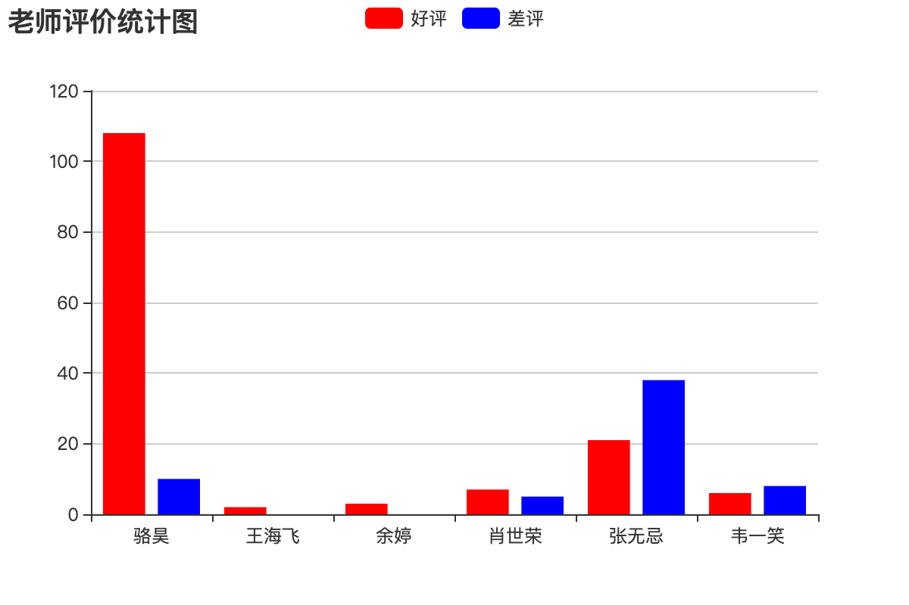

## 制作报表

### 导出Excel报表

报表就是用表格、图表等格式来动态显示数据，所以有人用这样的公式来描述报表：

```
报表 = 多样的格式 + 动态的数据
```

有很多的三方库支持在Python程序中写Excel文件，包括[`xlwt`](<https://xlwt.readthedocs.io/en/latest/>)、[`xlwings`](<https://docs.xlwings.org/en/latest/quickstart.html>)、[`openpyxl`](<https://openpyxl.readthedocs.io/en/latest/>)、[`xlswriter`](<https://xlsxwriter.readthedocs.io/>)等，其中的xlwt虽然只支持写xls格式的Excel文件，但在性能方面的表现还是不错的。下面我们就以`xlwt`为例，来演示如何在Django项目中导出Excel报表。

安装`xlwt`。

```Bash
pip install xlwt
```

导出包含所有老师信息的Excel表格的视图函数。

```Python
def export_teachers_excel(request):
    # 创建工作簿
    wb = xlwt.Workbook()
    # 添加工作表
    sheet = wb.add_sheet('老师信息表')
    # 查询所有老师的信息
    queryset = Teacher.objects.all()
    # 向Excel表单中写入表头
    colnames = ('姓名', '介绍', '好评数', '差评数', '学科')
    for index, name in enumerate(colnames):
        sheet.write(0, index, name)
    # 向单元格中写入老师的数据
    props = ('name', 'detail', 'good_count', 'bad_count', 'subject')
    for row, teacher in enumerate(queryset):
        for col, prop in enumerate(props):
            value = getattr(teacher, prop, '')
            if isinstance(value, Subject):
                value = value.name
            sheet.write(row + 1, col, value)
    # 保存Excel
    buffer = BytesIO()
    wb.save(buffer)
    # 将二进制数据写入响应的消息体中并设置MIME类型
    resp = HttpResponse(buffer.getvalue(), content_type='application/vnd.ms-excel')
    # 中文文件名需要处理成百分号编码
    filename = quote('老师.xls')
    # 通过响应头告知浏览器下载该文件以及对应的文件名
    resp['content-disposition'] = f'attachment; filename*=utf-8\'\'{filename}'
    return resp
```

映射URL。

```Python
urlpatterns = [
    
    path('excel/', views.export_teachers_excel),
    
]
```

### 导出PDF报表

在Django项目中，如果需要导出PDF报表，可以借助三方库`reportlab`来生成PDF文件的内容，再将文件的二进制数据输出给浏览器并指定MIME类型为`application/pdf`，具体的代码如下所示。

```Python
def export_pdf(request: HttpRequest) -> HttpResponse:
    buffer = io.BytesIO()
    pdf = canvas.Canvas(buffer)
    pdf.setFont("Helvetica", 80)
    pdf.setFillColorRGB(0.2, 0.5, 0.3)
    pdf.drawString(100, 550, 'hello, world!')
    pdf.showPage()
    pdf.save()
    resp = HttpResponse(buffer.getvalue(), content_type='application/pdf')
    resp['content-disposition'] = 'inline; filename="demo.pdf"'
    return resp
```

关于如何用`reportlab`定制PDF报表的内容，可以参考reportlab的[官方文档](https://www.reportlab.com/docs/reportlab-userguide.pdf)。

### 生成前端统计图表

如果项目中需要生成前端统计图表，可以使用百度的[ECharts](<https://echarts.baidu.com/>)。具体的做法是后端通过提供数据接口返回统计图表所需的数据，前端使用ECharts来渲染出柱状图、折线图、饼图、散点图等图表。例如我们要生成一个统计所有老师好评数和差评数的报表，可以按照下面的方式来做。

```Python
def get_teachers_data(request):
    queryset = Teacher.objects.all()
    names = [teacher.name for teacher in queryset]
    good_counts = [teacher.good_count for teacher in queryset]
    bad_counts = [teacher.bad_count for teacher in queryset]
    return JsonResponse({'names': names, 'good': good_counts, 'bad': bad_counts})
```

映射URL。

```Python
urlpatterns = [
    path('teachers_data/', views.get_teachers_data),
]
```

使用ECharts生成柱状图。

```HTML
<!DOCTYPE html>
<html lang="en">
<head>
    <meta charset="UTF-8">
    <title>老师评价统计</title>
</head>
<body>
    <div id="main" style="width: 600px; height: 400px"></div>
    <p>
        <a href="/">返回首页</a>
    </p>
    <script src="https://cdn.bootcss.com/echarts/4.2.1-rc1/echarts.min.js"></script>
    <script>
        var myChart = echarts.init(document.querySelector('#main'))
        fetch('/teachers_data/')
            .then(resp => resp.json())
            .then(json => {
                var option = {
                    color: ['#f00', '#00f'],
                    title: {
                        text: '老师评价统计图'
                    },
                    tooltip: {},
                    legend: {
                        data:['好评', '差评']
                    },
                    xAxis: {
                        data: json.names
                    },
                    yAxis: {},
                    series: [
                        {
                            name: '好评',
                            type: 'bar',
                            data: json.good
                        },
                        {
                            name: '差评',
                            type: 'bar',
                            data: json.bad
                        }
                    ]
                }
                myChart.setOption(option)
            })
    </script>
</body>
</html>
```

运行效果如下图所示。


