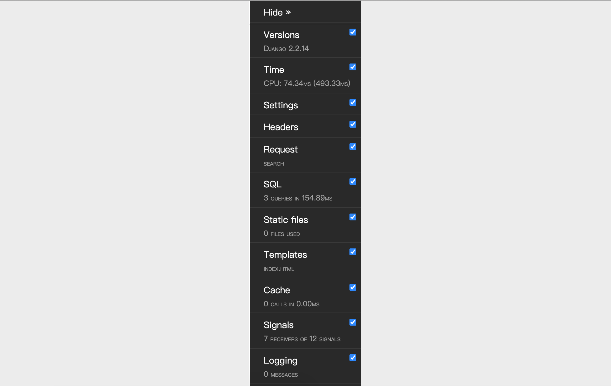

## 日志和调试工具栏

### 配置日志

项目开发阶段，显示足够的调试信息以辅助开发人员调试代码还是非常必要的；项目上线以后，将系统运行时出现的警告、错误等信息记录下来以备相关人员了解系统运行状况并维护代码也是很有必要的。与此同时，采集日志数据也是为网站做数字化运营奠定一个基础，通过对系统运行日志的分析，我们可以监测网站的流量以及流量分布，同时还可以挖掘出用户的使用习惯和行为模式。

接下来，我们先看看如何通过Django的配置文件来配置日志。Django的日志配置基本可以参照官方文档再结合项目实际需求来进行，这些内容基本上可以从官方文档上复制下来，然后进行局部的调整即可，下面给出一些参考配置。

```Python
LOGGING = {
    'version': 1,
    # 是否禁用已经存在的日志器
    'disable_existing_loggers': False,
    # 日志格式化器
    'formatters': {
        'simple': {
            'format': '%(asctime)s %(module)s.%(funcName)s: %(message)s',
            'datefmt': '%Y-%m-%d %H:%M:%S',
        },
        'verbose': {
            'format': '%(asctime)s %(levelname)s [%(process)d-%(threadName)s] '
                      '%(module)s.%(funcName)s line %(lineno)d: %(message)s',
            'datefmt': '%Y-%m-%d %H:%M:%S',
        }
    },
    # 日志过滤器
    'filters': {
        # 只有在Django配置文件中DEBUG值为True时才起作用
        'require_debug_true': {
            '()': 'django.utils.log.RequireDebugTrue',
        },
    },
    # 日志处理器
    'handlers': {
        # 输出到控制台
        'console': {
            'class': 'logging.StreamHandler',
            'level': 'DEBUG',
            'filters': ['require_debug_true'],
            'formatter': 'simple',
        },
        # 输出到文件(每周切割一次)
        'file1': {
            'class': 'logging.handlers.TimedRotatingFileHandler',
            'filename': 'access.log',
            'when': 'W0',
            'backupCount': 12,
            'formatter': 'simple',
            'level': 'INFO',
        },
        # 输出到文件(每天切割一次)
        'file2': {
            'class': 'logging.handlers.TimedRotatingFileHandler',
            'filename': 'error.log',
            'when': 'D',
            'backupCount': 31,
            'formatter': 'verbose',
            'level': 'WARNING',
        },
    },
    # 日志器记录器
    'loggers': {
        'django': {
            # 需要使用的日志处理器
            'handlers': ['console', 'file1', 'file2'],
            # 是否向上传播日志信息
            'propagate': True,
            # 日志级别(不一定是最终的日志级别)
            'level': 'DEBUG',
        },
    }
}
```

大家可能已经注意到了，上面日志配置中的`formatters`是**日志格式化器**，它代表了如何格式化输出日志，其中格式占位符分别表示：

1. `%(name)s` - 记录器的名称
2. `%(levelno)s` - 数字形式的日志记录级别
3. `%(levelname)s` - 日志记录级别的文本名称
4. `%(filename)s` - 执行日志记录调用的源文件的文件名称
5. `%(pathname)s` - 执行日志记录调用的源文件的路径名称
6. `%(funcName)s` - 执行日志记录调用的函数名称
7. `%(module)s` - 执行日志记录调用的模块名称
8. `%(lineno)s` - 执行日志记录调用的行号
9. `%(created)s` - 执行日志记录的时间
10. `%(asctime)s` - 日期和时间
11. `%(msecs)s` - 毫秒部分
12. `%(thread)d` - 线程ID（整数）
13. `%(threadName)s` - 线程名称
14. `%(process)d` - 进程ID （整数）

日志配置中的handlers用来指定**日志处理器**，简单的说就是指定将日志输出到控制台还是文件又或者是网络上的服务器，可用的处理器包括：

1. `logging.StreamHandler(stream=None)` - 可以向类似与`sys.stdout`或者`sys.stderr`的任何文件对象输出信息
2. `logging.FileHandler(filename, mode='a', encoding=None, delay=False)` - 将日志消息写入文件
3. `logging.handlers.DatagramHandler(host, port)` - 使用UDP协议，将日志信息发送到指定主机和端口的网络主机上
4. `logging.handlers.HTTPHandler(host, url)` - 使用HTTP的GET或POST方法将日志消息上传到一台HTTP 服务器
5. `logging.handlers.RotatingFileHandler(filename, mode='a', maxBytes=0, backupCount=0, encoding=None, delay=False)` - 将日志消息写入文件，如果文件的大小超出`maxBytes`指定的值，那么将重新生成一个文件来记录日志
6. `logging.handlers.SocketHandler(host, port)` - 使用TCP协议，将日志信息发送到指定主机和端口的网络主机上 
7. `logging.handlers.SMTPHandler(mailhost, fromaddr, toaddrs, subject, credentials=None, secure=None, timeout=1.0)` - 将日志输出到指定的邮件地址
8. `logging.MemoryHandler(capacity, flushLevel=ERROR, target=None, flushOnClose=True)` - 将日志输出到内存指定的缓冲区中

上面每个日志处理器都指定了一个名为`level`的属性，它代表了日志的级别，不同的日志级别反映出日志中记录信息的严重性。Python中定义了六个级别的日志，按照从低到高的顺序依次是：NOTSET、DEBUG、INFO、WARNING、ERROR、CRITICAL。

最后配置的**日志记录器**是用来真正输出日志的，Django框架提供了如下所示的内置记录器：

1. `django` - 在Django层次结构中的所有消息记录器
2. `django.request` - 与请求处理相关的日志消息。5xx响应被视为错误消息；4xx响应被视为为警告消息
3. `django.server` - 与通过runserver调用的服务器所接收的请求相关的日志消息。5xx响应被视为错误消息；4xx响应被记录为警告消息；其他一切都被记录为INFO
4. `django.template` - 与模板渲染相关的日志消息
5. `django.db.backends` - 有与数据库交互产生的日志消息，如果希望显示ORM框架执行的SQL语句，就可以使用该日志记录器。

日志记录器中配置的日志级别有可能不是最终的日志级别，因为还要参考日志处理器中配置的日志级别，取二者中级别较高者作为最终的日志级别。

### 配置Django-Debug-Toolbar

如果想调试你的Django项目，你一定不能不过名为Django-Debug-Toolbar的神器，它是项目开发阶段辅助调试和优化的必备工具，只要配置了它，就可以很方便的查看到如下表所示的项目运行信息，这些信息对调试项目和优化Web应用性能都是至关重要的。

| 项目        | 说明                              |
| ----------- | --------------------------------- |
| Versions    | Django的版本                      |
| Time        | 显示视图耗费的时间                |
| Settings    | 配置文件中设置的值                |
| Headers     | HTTP请求头和响应头的信息          |
| Request     | 和请求相关的各种变量及其信息      |
| StaticFiles | 静态文件加载情况                  |
| Templates   | 模板的相关信息                    |
| Cache       | 缓存的使用情况                    |
| Signals     | Django内置的信号信息              |
| Logging     | 被记录的日志信息                  |
| SQL         | 向数据库发送的SQL语句及其执行时间 |

1. 安装Django-Debug-Toolbar。

   ```Shell
   pip install django-debug-toolbar
   ```

2. 配置 - 修改settings.py。

   ```Python
   INSTALLED_APPS = [
       'debug_toolbar',
   ]
   
   MIDDLEWARE = [
       'debug_toolbar.middleware.DebugToolbarMiddleware',
   ]
   
   DEBUG_TOOLBAR_CONFIG = {
       # 引入jQuery库
       'JQUERY_URL': 'https://cdn.bootcss.com/jquery/3.3.1/jquery.min.js',
       # 工具栏是否折叠
       'SHOW_COLLAPSED': True,
       # 是否显示工具栏
       'SHOW_TOOLBAR_CALLBACK': lambda x: True,
   }
   ```

3. 配置 - 修改urls.py。

   ```Python
   if settings.DEBUG:
   
       import debug_toolbar
   
       urlpatterns.insert(0, path('__debug__/', include(debug_toolbar.urls)))
   ```

4. 在配置好Django-Debug-Toolbar之后，页面右侧会看到一个调试工具栏，如下图所示，上面包括了如前所述的各种调试信息，包括执行时间、项目设置、请求头、SQL、静态资源、模板、缓存、信号等，查看起来非常的方便。

   

### 优化ORM代码

在配置了日志或Django-Debug-Toolbar之后，我们可以查看一下之前将老师数据导出成Excel报表的视图函数执行情况，这里我们关注的是ORM框架生成的SQL查询到底是什么样子的，相信这里的结果会让你感到有一些意外。执行`Teacher.objects.all()`之后我们可以注意到，在控制台看到的或者通过Django-Debug-Toolbar输出的SQL是下面这样的：

```SQL
SELECT `tb_teacher`.`no`, `tb_teacher`.`name`, `tb_teacher`.`detail`, `tb_teacher`.`photo`, `tb_teacher`.`good_count`, `tb_teacher`.`bad_count`, `tb_teacher`.`sno` FROM `tb_teacher`; args=()
SELECT `tb_subject`.`no`, `tb_subject`.`name`, `tb_subject`.`intro`, `tb_subject`.`create_date`, `tb_subject`.`is_hot` FROM `tb_subject` WHERE `tb_subject`.`no` = 101; args=(101,)
SELECT `tb_subject`.`no`, `tb_subject`.`name`, `tb_subject`.`intro`, `tb_subject`.`create_date`, `tb_subject`.`is_hot` FROM `tb_subject` WHERE `tb_subject`.`no` = 101; args=(101,)
SELECT `tb_subject`.`no`, `tb_subject`.`name`, `tb_subject`.`intro`, `tb_subject`.`create_date`, `tb_subject`.`is_hot` FROM `tb_subject` WHERE `tb_subject`.`no` = 101; args=(101,)
SELECT `tb_subject`.`no`, `tb_subject`.`name`, `tb_subject`.`intro`, `tb_subject`.`create_date`, `tb_subject`.`is_hot` FROM `tb_subject` WHERE `tb_subject`.`no` = 101; args=(101,)
SELECT `tb_subject`.`no`, `tb_subject`.`name`, `tb_subject`.`intro`, `tb_subject`.`create_date`, `tb_subject`.`is_hot` FROM `tb_subject` WHERE `tb_subject`.`no` = 103; args=(103,)
SELECT `tb_subject`.`no`, `tb_subject`.`name`, `tb_subject`.`intro`, `tb_subject`.`create_date`, `tb_subject`.`is_hot` FROM `tb_subject` WHERE `tb_subject`.`no` = 103; args=(103,)
```

这里的问题通常被称为“1+N查询”（有的地方也将其称之为“N+1查询”），原本获取老师的数据只需要一条SQL，但是由于老师关联了学科，当我们查询到`N`条老师的数据时，Django的ORM框架又向数据库发出了`N`条SQL去查询老师所属学科的信息。每条SQL执行都会有较大的开销而且会给数据库服务器带来压力，如果能够在一条SQL中完成老师和学科的查询肯定是更好的做法，这一点也很容易做到，相信大家已经想到怎么做了。是的，我们可以使用连接查询，但是在使用Django的ORM框架时如何做到这一点呢？对于多对一关联（如投票应用中的老师和学科），我们可以使用`QuerySet`的用`select_related()`方法来加载关联对象；而对于多对多关联（如电商网站中的订单和商品），我们可以使用`prefetch_related()`方法来加载关联对象。

在导出老师Excel报表的视图函数中，我们可以按照下面的方式优化代码。

```Python
queryset = Teacher.objects.all().select_related('subject')
```

事实上，用ECharts生成前端报表的视图函数中，查询老师好评和差评数据的操作也能够优化，因为在这个例子中，我们只需要获取老师的姓名、好评数和差评数这三项数据，但是在默认的情况生成的SQL会查询老师表的所有字段。可以用`QuerySet`的`only()`方法来指定需要查询的属性，也可以用`QuerySet`的`defer()`方法来指定暂时不需要查询的属性，这样生成的SQL会通过投影操作来指定需要查询的列，从而改善查询性能，代码如下所示：

```Python
queryset = Teacher.objects.all().only('name', 'good_count', 'bad_count')
```

当然，如果要统计出每个学科的老师好评和差评的平均数，利用Django的ORM框架也能够做到，代码如下所示：

```Python
queryset = Teacher.objects.values('subject').annotate(good=Avg('good_count'), bad=Avg('bad_count'))
```

这里获得的`QuerySet`中的元素是字典对象，每个字典中有三组键值对，分别是代表学科编号的`subject`、代表好评数的`good`和代表差评数的`bad`。如果想要获得学科的名称而不是编号，可以按照如下所示的方式调整代码：

```Python
queryset = Teacher.objects.values('subject__name').annotate(good=Avg('good_count'), bad=Avg('bad_count'))
```

可见，Django的ORM框架允许我们用面向对象的方式完成关系数据库中的分组和聚合查询。

