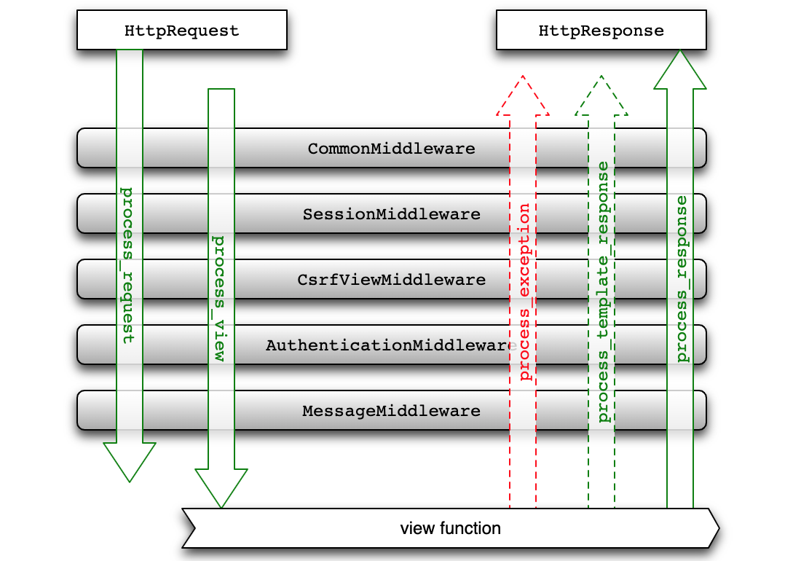

## 中间件的应用

之前我们已经实现了用户必须登录才能投票的限制，但是一个新的问题来了。如果我们的应用中有很多功能都需要用户先登录才能执行，例如将前面导出Excel报表和查看统计图表的功能都做了必须登录才能访问的限制，那么我们是不是需要在每个视图函数中添加代码来检查session中是否包含`userid`的代码呢？答案是否定的，如果这样做了，我们的视图函数中必然会充斥着大量的重复代码。编程大师*Martin Fowler*曾经说过：**代码有很多种坏味道，重复是最坏的一种**。在Python程序中，我们可以通过装饰器来为函数提供额外的能力；在Django项目中，我们可以把类似于验证用户是否登录这样的重复性代码放到**中间件**中。

### Django中间件概述

中间件是安插在Web应用请求和响应过程之间的组件，它在整个Web应用中扮演了拦截过滤器的角色，通过中间件可以拦截请求和响应，并对请求和响应进行过滤（简单的说就是执行额外的处理）。通常，一个中间件组件只专注于完成一件特定的事，例如：Django框架通过`SessionMiddleware`中间件实现了对session的支持，又通过`AuthenticationMiddleware`中间件实现了基于session的请求认证。通过把多个中间件组合在一起，我们可以完成更为复杂的任务，Django框架就是这么做的。

Django项目的配置文件中就包含了对中间件的配置，代码如下所示。

```Python
MIDDLEWARE = [
    'django.middleware.security.SecurityMiddleware',
    'django.contrib.sessions.middleware.SessionMiddleware',
    'django.middleware.common.CommonMiddleware',
    'django.middleware.csrf.CsrfViewMiddleware',
    'django.contrib.auth.middleware.AuthenticationMiddleware',
    'django.contrib.messages.middleware.MessageMiddleware',
    'django.middleware.clickjacking.XFrameOptionsMiddleware',
]
```

我们稍微为大家解释一下这些中间件的作用：

1. `CommonMiddleware` - 基础设置中间件，可以处理以下一些配置参数。
   - DISALLOWED_USER_AGENTS - 不被允许的用户代理（浏览器）
   - APPEND_SLASH - 是否追加`/`
   - USE_ETAG - 浏览器缓存相关
2. `SecurityMiddleware` - 安全相关中间件，可以处理和安全相关的配置项。
   - SECURE_HSTS_SECONDS - 强制使用HTTPS的时间
   - SECURE_HSTS_INCLUDE_SUBDOMAINS - HTTPS是否覆盖子域名
   - SECURE_CONTENT_TYPE_NOSNIFF - 是否允许浏览器推断内容类型
   - SECURE_BROWSER_XSS_FILTER - 是否启用跨站脚本攻击过滤器
   - SECURE_SSL_REDIRECT - 是否重定向到HTTPS连接
   - SECURE_REDIRECT_EXEMPT - 免除重定向到HTTPS
3. `SessionMiddleware` - 会话中间件。
4. `CsrfViewMiddleware` - 通过生成令牌，防范跨请求份伪的造中间件。
5. `XFrameOptionsMiddleware` - 通过设置请求头参数，防范点击劫持攻击的中间件。

在请求的过程中，上面的中间件会按照书写的顺序从上到下执行，然后是URL解析，最后请求才会来到视图函数；在响应的过程中，上面的中间件会按照书写的顺序从下到上执行，与请求时中间件执行的顺序正好相反。

### 自定义中间件

Django中的中间件有两种实现方式：基于类的实现方式和基于函数的实现方式，后者更接近于装饰器的写法。装饰器实际上是代理模式的应用，将横切关注功能（与正常业务逻辑没有必然联系的功能，例如：身份认证、日志记录、编码转换之类的功能）置于代理中，由代理对象来完成被代理对象的行为并添加额外的功能。中间件对用户请求和响应进行拦截过滤并增加额外的处理，在这一点上它跟装饰器是完全一致的，所以基于函数的写法来实现中间件就跟装饰器的写法几乎一模一样。下面我们用自定义的中间件来实现用户登录验证的功能。

```Python
"""
middlewares.py
"""
from django.http import JsonResponse
from django.shortcuts import redirect

# 需要登录才能访问的资源路径
LOGIN_REQUIRED_URLS = {'/praise/', '/criticize/', '/excel/', '/teachers_data/'}


def check_login_middleware(get_resp):

    def wrapper(request, *args, **kwargs):
        # 请求的资源路径在上面的集合中
        if request.path in LOGIN_REQUIRED_URLS:
            # 会话中包含userid则视为已经登录
            if 'userid' not in request.session:
                # 判断是不是Ajax请求
                if request.is_ajax():
                    # Ajax请求返回JSON数据提示用户登录
                    return JsonResponse({'code': 10003, 'hint': '请先登录'})
                else:
                    backurl = request.get_full_path()
                    # 非Ajax请求直接重定向到登录页
                    return redirect(f'/login/?backurl={backurl}')
        return get_resp(request, *args, **kwargs)

    return wrapper
```

当然，我们也可以定义一个类来充当装饰器，如果类中有`__call__`魔术方法，这个类的对象就像函数一样可调用，所以下面是另一种实现中间件的方式，道理跟上面的代码完全一样。

还有一种基于类实现中间件的方式，这种方式在较新版本的Django中已经不推荐使用了，但是大家接触到的代码中，仍然有可能遇到这种写法，大致的代码如下所示。

```Python
from django.utils.deprecation import MiddlewareMixin


class MyMiddleware(MiddlewareMixin):

    def process_request(self, request):
        pass

    def process_view(self, request, view_func, view_args, view_kwargs):
        pass

    def process_template_response(self, request, response):
        pass

    def process_response(self, request, response):
        pass

    def process_exception(self, request, exception):
        pass
```

上面类中的五个方法都是中间件的钩子函数，分别在收到用户请求、进入视图函数之前、渲染模板、返回响应和出现异常的时候被回调。当然，写不写这些方法是根据中间件的需求来确定的，并不是所有的场景都需要重写五个方法，下面的图相信能够帮助大家理解这种写法。



写好中间件代码后，需要修改配置文件来激活中间件使其生效。

```Python
MIDDLEWARE = [
    'django.middleware.security.SecurityMiddleware',
    'django.contrib.sessions.middleware.SessionMiddleware',
    'django.middleware.common.CommonMiddleware',
    'django.middleware.csrf.CsrfViewMiddleware',
    'django.contrib.auth.middleware.AuthenticationMiddleware',
    'django.contrib.messages.middleware.MessageMiddleware',
    'django.middleware.clickjacking.XFrameOptionsMiddleware',
    'debug_toolbar.middleware.DebugToolbarMiddleware',
    'vote.middlewares.check_login_middleware',
]
```

注意上面这个中间件列表中元素的顺序，当收到来自用户的请求时，中间件按照从上到下的顺序依次执行，这行完这些中间件以后，请求才会最终到达视图函数。当然，在这个过程中，用户的请求可以被拦截，就像上面我们自定义的中间件那样，如果用户在没有登录的情况下访问了受保护的资源，中间件会将请求直接重定向到登录页，后面的中间件和视图函数将不再执行。在响应用户请求的过程中，上面的中间件会按照从下到上的顺序依次执行，这样的话我们还可以对响应做进一步的处理。

中间件执行的顺序是非常重要的，对于有依赖关系的中间件必须保证被依赖的中间件要置于依赖它的中间件的前面，就好比我们刚才自定义的中间件要放到`SessionMiddleware`的后面，因为我们要依赖这个中间件为请求绑定的`session`对象才能判定用户是否登录。

