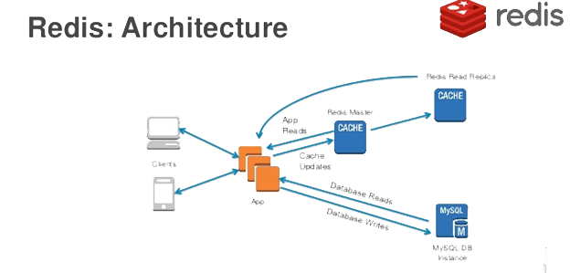

## 使用缓存

通常情况下，Web应用的性能瓶颈都会出现在关系型数据库上，当并发访问量较大时，如果所有的请求都需要通过关系型数据库完成数据持久化操作，那么数据库一定会不堪重负。优化Web应用性能最为重要的一点就是使用缓存，把那些数据体量不大但访问频率非常高的数据提前加载到缓存服务器中，这又是典型的空间换时间的方法。通常缓存服务器都是直接将数据置于内存中而且使用了非常高效的数据存取策略（哈希存储、键值对方式等），在读写性能上远远优于关系型数据库的，因此我们可以让Web应用接入缓存服务器来优化其性能，其中一个非常好的选择就是使用Redis。

Web应用的缓存架构大致如下图所示。



### Django项目接入Redis

在此前的课程中，我们介绍过Redis的安装和使用，此处不再进行赘述。如果需要在Django项目中接入Redis，可以使用三方库`django-redis`，这个三方库又依赖了一个名为`redis` 的三方库，它封装了对Redis的各种操作。

安装`django-redis`。

```Bash
pip install django-redis
```

修改Django配置文件中关于缓存的配置。

```Python
CACHES = {
    'default': {
        # 指定通过django-redis接入Redis服务
        'BACKEND': 'django_redis.cache.RedisCache',
        # Redis服务器的URL
        'LOCATION': ['redis://1.2.3.4:6379/0', ],
        # Redis中键的前缀（解决命名冲突）
        'KEY_PREFIX': 'vote',
        # 其他的配置选项
        'OPTIONS': {
            'CLIENT_CLASS': 'django_redis.client.DefaultClient',
            # 连接池（预置若干备用的Redis连接）参数
            'CONNECTION_POOL_KWARGS': {
                # 最大连接数
                'max_connections': 512,
            },
            # 连接Redis的用户口令
            'PASSWORD': 'foobared',
        }
    },
}
```

至此，我们的Django项目已经可以接入Redis，接下来我们修改项目代码，用Redis为之写的获取学科数据的接口提供缓存服务。

### 为视图提供缓存服务

#### 声明式缓存

所谓声明式缓存是指不修改原来的代码，通过Python中的装饰器（代理）为原有的代码增加缓存功能。对于FBV，代码如下所示。

```Python
from django.views.decorators.cache import cache_page


@api_view(('GET', ))
@cache_page(timeout=86400, cache='default')
def show_subjects(request):
    """获取学科数据"""
    queryset = Subject.objects.all()
    data = SubjectSerializer(queryset, many=True).data
    return Response({'code': 20000, 'subjects': data})
```

上面的代码通过Django封装的`cache_page`装饰器缓存了视图函数的返回值（响应对象），`cache_page`的本意是缓存视图函数渲染的页面，对于返回JSON数据的视图函数，相当于是缓存了JSON数据。在使用`cache_page`装饰器时，可以传入`timeout`参数来指定缓存过期时间，还可以使用`cache`参数来指定需要使用哪一组缓存服务来缓存数据。Django项目允许在配置文件中配置多组缓存服务，上面的`cache='default'`指定了使用默认的缓存服务（因为之前的配置文件中我们也只配置了名为`default`的缓存服务）。视图函数的返回值会被序列化成字节串放到Redis中（Redis中的str类型可以接收字节串），缓存数据的序列化和反序列化也不需要我们自己处理，因为`cache_page`装饰器会调用`django-redis`库中的`RedisCache`来对接Redis，该类使用了`DefaultClient`来连接Redis并使用了[pickle序列化](https://python3-cookbook.readthedocs.io/zh_CN/latest/c05/p21_serializing_python_objects.html)，`django_redis.serializers.pickle.PickleSerializer`是默认的序列化类。

如果缓存中没有学科的数据，那么通过接口访问学科数据时，我们的视图函数会通过执行`Subject.objects.all()`向数据库发出SQL语句来获得数据，视图函数的返回值会被缓存，因此下次请求该视图函数如果缓存没有过期，可以直接从缓存中获取视图函数的返回值，无需再次查询数据库。如果想了解缓存的使用情况，可以配置数据库日志或者使用Django-Debug-Toolbar来查看，第一次访问学科数据接口时会看到查询学科数据的SQL语句，再次获取学科数据时，不会再向数据库发出SQL语句，因为可以直接从缓存中获取数据。

对于CBV，可以利用Django中名为`method_decorator`的装饰器将`cache_page`这个装饰函数的装饰器放到类中的方法上，效果跟上面的代码是一样的。需要提醒大家注意的是，`cache_page`装饰器不能直接放在类上，因为它是装饰函数的装饰器，所以Django框架才提供了`method_decorator`来解决这个问题，很显然，`method_decorator`是一个装饰类的装饰器。

```Python
from django.utils.decorators import method_decorator
from django.views.decorators.cache import cache_page


@method_decorator(decorator=cache_page(timeout=86400, cache='default'), name='get')
class SubjectView(ListAPIView):
    """获取学科数据的视图类"""
    queryset = Subject.objects.all()
    serializer_class = SubjectSerializer
```

#### 编程式缓存

所谓编程式缓存是指通过自己编写的代码来使用缓存服务，这种方式虽然代码量会稍微大一些，但是相较于声明式缓存，它对缓存的操作和使用更加灵活，在实际开发中使用得更多。下面的代码去掉了之前使用的`cache_page`装饰器，通过`django-redis`提供的`get_redis_connection`函数直接获取Redis连接来操作Redis。

```Python
def show_subjects(request):
    """获取学科数据"""
    redis_cli = get_redis_connection()
    # 先尝试从缓存中获取学科数据
    data = redis_cli.get('vote:polls:subjects')
    if data:
        # 如果获取到学科数据就进行反序列化操作
        data = json.loads(data)
    else:
        # 如果缓存中没有获取到学科数据就查询数据库
        queryset = Subject.objects.all()
        data = SubjectSerializer(queryset, many=True).data
        # 将查到的学科数据序列化后放到缓存中
        redis_cli.set('vote:polls:subjects', json.dumps(data), ex=86400)
    return Response({'code': 20000, 'subjects': data})
```

需要说明的是，Django框架提供了`cache`和`caches`两个现成的变量来支持缓存操作，前者访问的是默认的缓存（名为`default`的缓存），后者可以通过索引运算获取指定的缓存服务（例如：`caches['default']`）。向`cache`对象发送`get`和`set`消息就可以实现对缓存的读和写操作，但是这种方式能做的操作有限，不如上面代码中使用的方式灵活。还有一个值得注意的地方，由于可以通过`get_redis_connection`函数获得的Redis连接对象向Redis发起各种操作，包括`FLUSHDB`、`SHUTDOWN`等危险的操作，所以在实际商业项目开发中，一般都会对`django-redis`再做一次封装，例如封装一个工具类，其中只提供了项目需要用到的缓存操作的方法，从而避免了直接使用`get_redis_connection`的潜在风险。当然，自己封装对缓存的操作还可以使用“Read Through”和“Write Through”的方式实现对缓存的更新，这个在下面会介绍到。

### 缓存相关问题

#### 缓存数据的更新

在使用缓存时，一个必须搞清楚的问题就是，当数据改变时，如何更新缓存中的数据。通常更新缓存有如下几种套路，分别是：

1. Cache Aside Pattern
2. Read/Write Through Pattern
3. Write Behind Caching Pattern

第1种方式的具体做法就是，当数据更新时，先更新数据库，再删除缓存。注意，不能够使用先更新数据库再更新缓存的方式，也不能够使用先删除缓存再更新数据库的方式，大家可以自己想一想为什么（考虑一下有并发的读操作和写操作的场景）。当然，先更新数据库再删除缓存的做法在理论上也存在风险，但是发生问题的概率是极低的，所以不少的项目都使用了这种方式。

第1种方式相当于编写业务代码的开发者要自己负责对两套存储系统（缓存和关系型数据库）的操作，代码写起来非常的繁琐。第2种方式的主旨是将后端的存储系统变成一套代码，对缓存的维护封装在这套代码中。其中，Read Through指在查询操作中更新缓存，也就是说，当缓存失效的时候，由缓存服务自己负责对数据的加载，从而对应用方是透明的；而Write Through是指在更新数据时，如果没有命中缓存，直接更新数据库，然后返回。如果命中了缓存，则更新缓存，然后再由缓存服务自己更新数据库（同步更新）。刚才我们说过，如果自己对项目中的Redis操作再做一次封装，就可以实现“Read Through”和“Write Through”模式，这样做虽然会增加工作量，但无疑是一件“一劳永逸”且“功在千秋”的事情。

第3种方式是在更新数据的时候，只更新缓存，不更新数据库，而缓存服务这边会**异步的批量更新**数据库。这种做法会大幅度提升性能，但代价是牺牲数据的**强一致性**。第3种方式的实现逻辑比较复杂，因为他需要追踪有哪数据是被更新了的，然后再批量的刷新到持久层上。

#### 缓存穿透

缓存是为了缓解数据库压力而添加的一个中间层，如果恶意的访问者频繁的访问缓存中没有的数据，那么缓存就失去了存在的意义，瞬间所有请求的压力都落在了数据库上，这样会导致数据库承载着巨大的压力甚至连接异常，类似于分布式拒绝服务攻击（DDoS）的做法。解决缓存穿透的一个办法是约定如果查询返回为空值，把这个空值也缓存起来，但是需要为这个空值的缓存设置一个较短的超时时间，毕竟缓存这样的值就是对缓存空间的浪费。另一个解决缓存穿透的办法是使用布隆过滤器，具体的做法大家可以自行了解。

#### 缓存击穿

在实际的项目中，可能存在某个缓存的key某个时间点过期，但恰好在这个时间点对有对该key的大量的并发请求过来，这些请求没有从缓存中找到key对应的数据，就会直接从数据库中获取数据并写回到缓存，这个时候大并发的请求可能会瞬间把数据库压垮，这种现象称为缓存击穿。比较常见的解决缓存击穿的办法是使用互斥锁，简单的说就是在缓存失效的时候，不是立即去数据库加载数据，而是先设置互斥锁（例如：Redis中的setnx），只有设置互斥锁的操作成功的请求，才能执行查询从数据库中加载数据并写入缓存，其他设置互斥锁失败的请求，可以先执行一个短暂的休眠，然后尝试重新从缓存中获取数据，如果缓存还没有数据，则重复刚才的设置互斥锁的操作，大致的参考代码如下所示。

```Python
data = redis_cli.get(key)
while not data:
    if redis_cli.setnx('mutex', 'x'):
        redis.expire('mutex', timeout)
        data = db.query(...)
        redis.set(key, data)
        redis.delete('mutex')
    else:
        time.sleep(0.1)
        data = redis_cli.get(key)
```

#### 缓存雪崩

缓存雪崩是指在将数据放入缓存时采用了相同的过期时间，这样就导致缓存在某一时刻同时失效，请求全部转发到数据库，导致数据库瞬时压力过大而崩溃。解决缓存雪崩问题的方法也比较简单，可以在既定的缓存过期时间上加一个随机时间，这样可以从一定程度上避免不同的key在同一时间集体失效。还有一种办法就是使用多级缓存，每一级缓存的过期时间都不一样，这样的话即便某个级别的缓存集体失效，但是其他级别的缓存还能够提供数据，避免所有的请求都落到数据库上。