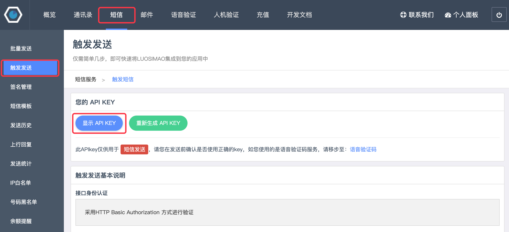
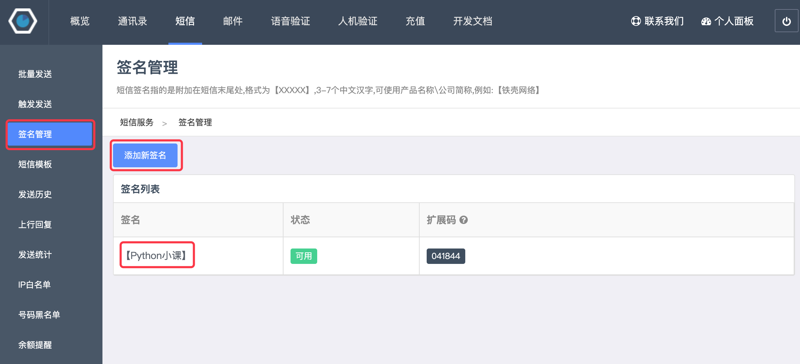
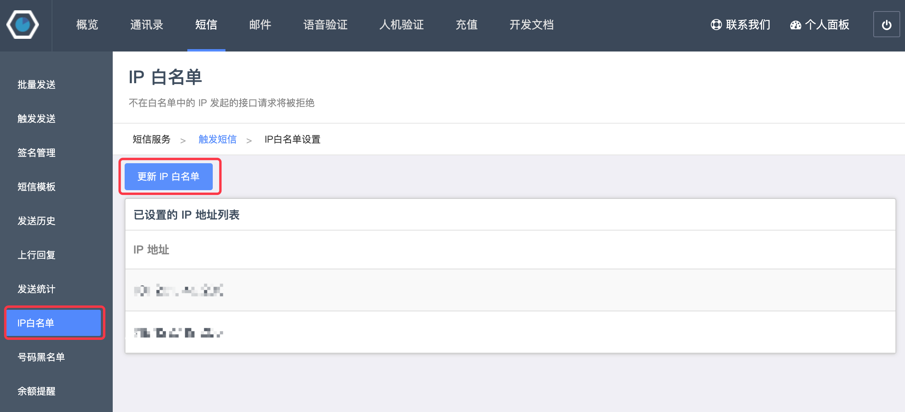
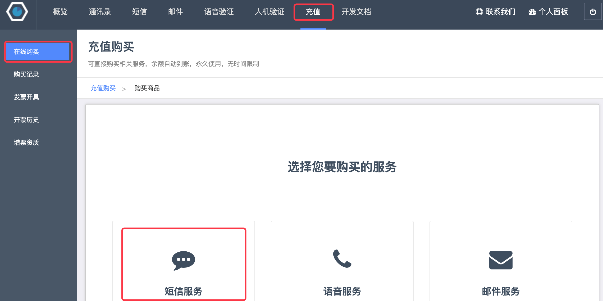
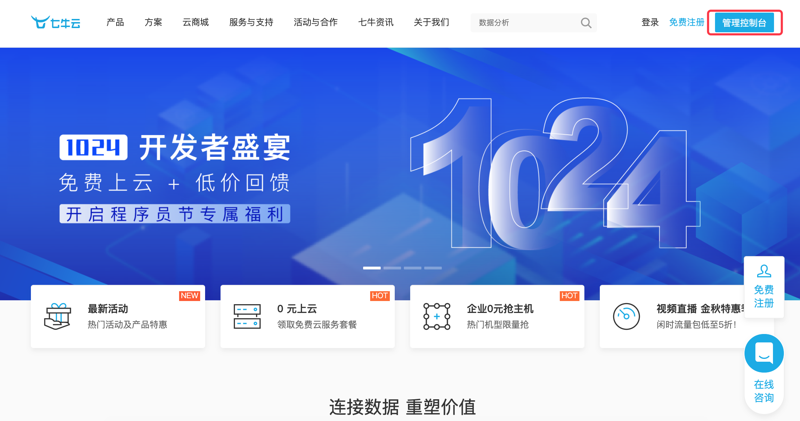
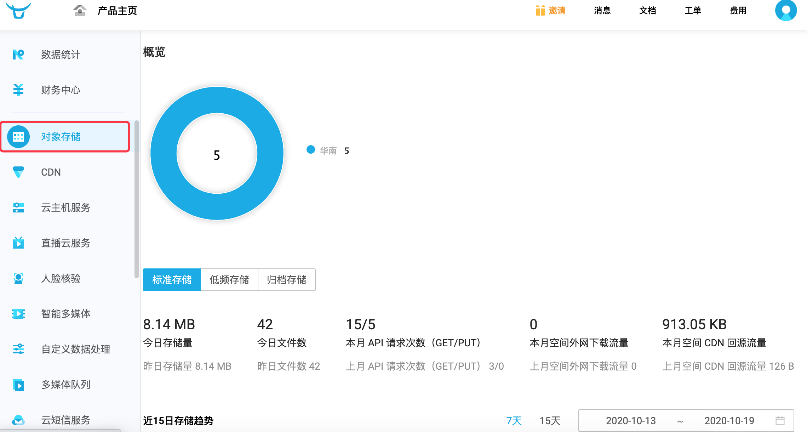
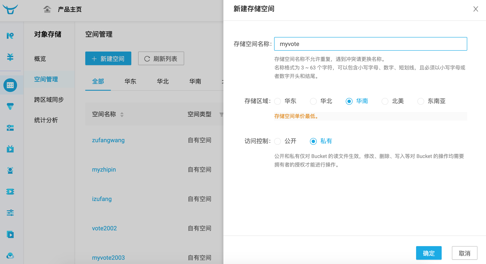
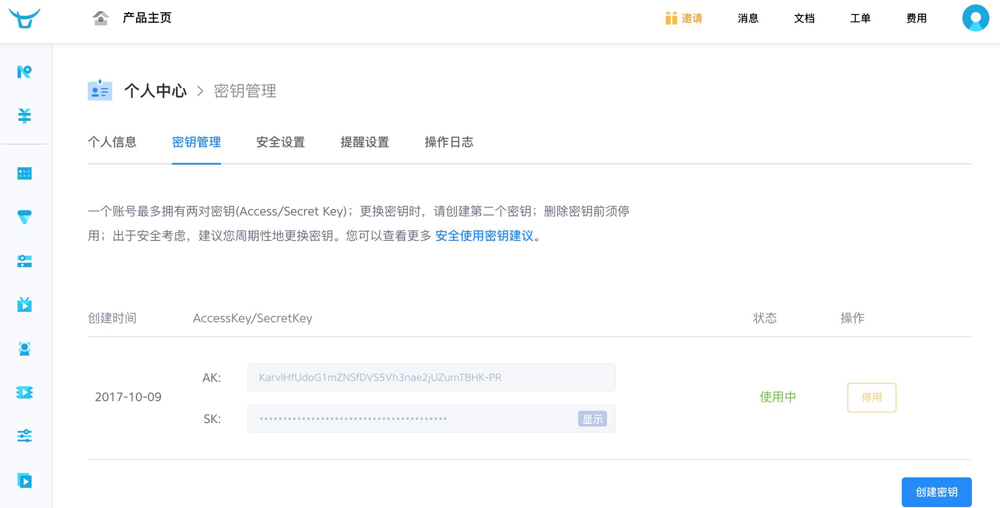
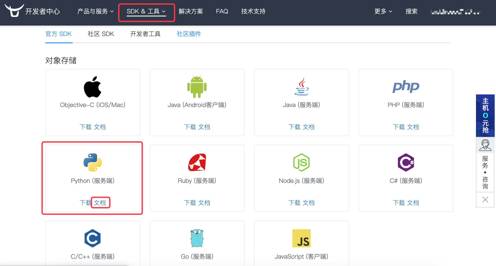
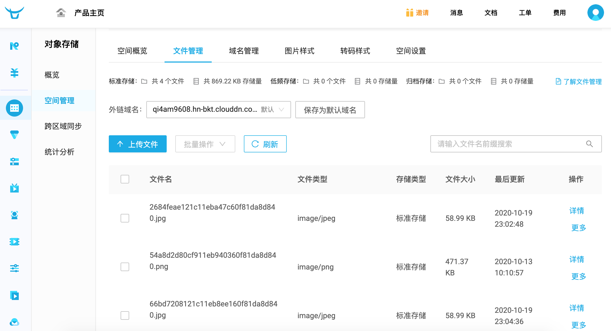

## 接入三方平台

在Web应用的开发过程中，有一些任务并不是我们自己能够完成的。例如，我们的Web项目中需要做个人或企业的实名认证，很显然我们并没有能力判断用户提供的认证信息的真实性，这个时候我们就要借助三方平台提供的服务来完成该项操作。再比如说，我们的项目中需要提供在线支付功能，这类业务通常也是借助支付网关来完成而不是自己去实现，我们只需要接入像微信、支付宝、银联这样的三方平台即可。

在项目中接入三方平台基本上就两种方式：API接入和SDK接入。

1. API接入指的是通过访问三方提供的URL来完成操作或获取数据。国内有很多这样的平台提供了大量常用的服务，例如[聚合数据](https://www.juhe.cn/)上提供了生活服务类、金融科技类、交通地理类、充值缴费类等各种类型的API。我们可以通过Python程序发起网络请求，通过访问URL获取数据，这些API接口跟我们项目中提供的数据接口是一样的，只不过我们项目中的API是供自己使用的，而这类三方平台提供的API是开放的。当然开放并不代表免费，大多数能够提供有商业价值的数据的API都是需要付费才能使用的。
2. SDK接入指的是通过安装三方库并使用三方库封装的类、函数来使用三方平台提供的服务的方式。例如我们刚才说到的接入支付宝，就需要先安装支付宝的SDK，然后通过支付宝封装的类和方法完成对支付服务的调用。

下面我们通过具体的例子来讲解如何接入三方平台。

### 接入短信网关

一个Web项目有很多地方都可以用到短信服务，例如：手机验证码登录、重要消息提醒、产品营销短信等。要实现发送短信的功能，可以通过接入短信网关来实现，国内比较有名的短信网关包括：云片短信、网易云信、螺丝帽、SendCloud等，这些短信网关一般都提供了免费试用功能。下面我们以[螺丝帽](https://luosimao.com/)平台为例，讲解如何在项目中接入短信网关，其他平台操作基本类似。

1. 注册账号，新用户可以免费试用。

2. 登录到管理后台，进入短信版块。

3. 点击“触发发送”可以找到自己专属的API Key（身份标识）。

    

4. 点击“签名管理”可以添加短信签名，短信都必须携带签名，免费试用的短信要在短信中添加“【铁壳测试】”这个签名，否则短信无法发送。

    

5. 点击“IP白名单”将运行Django项目的服务器地址（公网IP地址，本地运行可以打开[xxx]()网站查看自己本机的公网IP地址）填写到白名单中，否则短信无法发送。

    

6. 如果没有剩余的短信条数，可以到“充值”页面选择“短信服务”进行充值。

    

接下来，我们可以通过调用螺丝帽短信网关实现发送短信验证码的功能，代码如下所示。

```Python
def send_mobile_code(tel, code):
    """发送短信验证码"""
    resp = requests.post(
        url='http://sms-api.luosimao.com/v1/send.json',
        auth=('api', 'key-自己的APIKey'),
        data={
            'mobile': tel,
            'message': f'您的短信验证码是{code}，打死也不能告诉别人哟。【Python小课】'
        },
        verify=False
    )
    return resp.json()
```

运行上面的代码需要先安装`requests`三方库，这个三方库封装了HTTP网络请求的相关功能，使用起来非常的简单，我们在之前的内容中也讲到过这个三方库。`send_mobile_code`函数有两个参数，第一个参数是手机号，第二个参数是短信验证码的内容，第5行代码需要提供自己的API Key，就是上面第2步中查看到的自己的API Key。请求螺丝帽的短信网关会返回JSON格式的数据，对于上面的代码如果返回`{'err': 0, 'msg': 'ok'}`，则表示短信发送成功，如果`err`字段的值不为`0`而是其他值，则表示短信发送失败，可以在螺丝帽官方的[开发文档](https://luosimao.com/docs/api/)页面上查看到不同的数值代表的含义，例如：`-20`表示余额不足，`-32`表示缺少短信签名。

可以在视图函数中调用上面的函数来完成发送短信验证码的功能，稍后我们可以把这个功能跟用户注册结合起来。

生成随机验证码和验证手机号的函数。

```Python
import random
import re

TEL_PATTERN = re.compile(r'1[3-9]\d{9}')


def check_tel(tel):
    """检查手机号"""
    return TEL_PATTERN.fullmatch(tel) is not None


def random_code(length=6):
    """生成随机短信验证码"""
    return ''.join(random.choices('0123456789', k=length))
```

发送短信验证码的视图函数。

```Python
@api_view(('GET', ))
def get_mobilecode(request, tel):
    """获取短信验证码"""
    if check_tel(tel):
        redis_cli = get_redis_connection()
        if redis_cli.exists(f'vote:block-mobile:{tel}'):
            data = {'code': 30001, 'message': '请不要在60秒内重复发送短信验证码'}
        else:
            code = random_code()
            send_mobile_code(tel, code)
            # 通过Redis阻止60秒内容重复发送短信验证码
            redis_cli.set(f'vote:block-mobile:{tel}', 'x', ex=60)
            # 将验证码在Redis中保留10分钟（有效期10分钟）
            redis_cli.set(f'vote2:valid-mobile:{tel}', code, ex=600)
            data = {'code': 30000, 'message': '短信验证码已发送，请注意查收'}
    else:
        data = {'code': 30002, 'message': '请输入有效的手机号'}
    return Response(data)
```

> **说明**：上面的代码利用Redis实现了两个额外的功能，一个是阻止用户60秒内重复发送短信验证码，一个是将用户的短信验证码保留10分钟，也就是说这个短信验证码的有效期只有10分钟，我们可以要求用户在注册时提供该验证码来验证用户手机号的真实性。

### 接入云存储服务

当我们提到**云存储**这个词的时候，通常是指把数据存放在由第三方提供的虚拟服务器环境下，简单的说就是将某些数据或资源通过第三平台托管。一般情况下，提供云存储服务的公司都运营着大型的数据中心，需要云存储服务的个人或组织通过向其购买或租赁存储空间来满足数据存储的需求。在开发Web应用时，可以将静态资源，尤其是用户上传的静态资源直接置于云存储服务中，云存储通常会提供对应的URL使得用户可以访问该静态资源。国内外比较有名的云存储服务（如：亚马逊的S3、阿里的OSS2等）一般都物美价廉，相比自己架设静态资源服务器，云存储的代价更小，而且一般的云存储平台都提供了CDN服务，用于加速对静态资源的访问，所以不管从哪个角度出发，使用云存储的方式管理Web应用的数据和静态资源都是非常好的选择，除非这些资源涉及到个人或商业隐私，否则就可以托管到云存储中。

下面我们以接入[七牛云](https://www.qiniu.com/)为例，讲解如何实现将用户上传的文件保存到七牛云存储。七牛云是国内知名的云计算及数据服务提供商，七牛云在海量文件存储、CDN、视频点播、互动直播以及大规模异构数据的智能分析与处理等领域都有自己的产品，而且非付费用户也可以免费接入，使用其提供的服务。下面是接入七牛云的流程：

1. 注册账号，登录管理控制台。

    

2. 选择左侧菜单中的对象存储。

    

3. 在空间管理中选择新建空间（例如：myvote），如果提示空间名称已被占用，更换一个再尝试即可。注意，创建空间后会提示绑定自定义域名，如果暂时还没有自己的域名，可以使用七牛云提供的临时域名，但是临时域名会在30天后被回收，所以最好准备自己的域名（域名需要备案，不清楚如何操作的请自行查阅相关资料）。

    

4. 在网页的右上角点击个人头像中的“密钥管理”，查看自己的密钥，稍后在代码中需要使用AK（AccessKey）和SK（SecretKey）两个密钥来认证用户身份。

    

5. 点击网页上方菜单中的“文档”，进入到[七牛开发者中心](https://developer.qiniu.com/)，选择导航菜单中的“SDK&工具”并点击“官方SDK”子菜单，找到Python（服务端）并点击“文档”查看官方文档。

    

接下来，只要安装官方文档提供的示例，就可以接入七牛云，使用七牛云提供的云存储以及其他服务。首先可以通过下面的命令安装七牛云的三方库。

```Bash
pip install qiniu
```

接下来可以通过`qiniu`模块中的`put_file`和`put_stream`两个函数实现文件上传，前者可以上传指定路径的文件，后者可以将内存中的二进制数据上传至七牛云，具体的代码如下所示。

```Python
import qiniu

AUTH = qiniu.Auth('密钥管理中的AccessKey', '密钥管理中的SecretKey')
BUCKET_NAME = 'myvote'


def upload_file_to_qiniu(key, file_path):
    """上传指定路径的文件到七牛云"""
    token = AUTH.upload_token(BUCKET_NAME, key)
    return qiniu.put_file(token, key, file_path)


def upload_stream_to_qiniu(key, stream, size):
    """上传二进制数据流到七牛云"""
    token = AUTH.upload_token(BUCKET_NAME, key)
    return qiniu.put_stream(token, key, stream, None, size)
```

下面是一个文件上传的简单前端页。

```HTML
<!DOCTYPE html>
<html lang="en">
<head>
    <meta charset="UTF-8">
    <title>上传文件</title>
</head>
<body>
    <form action="/upload/" method="post" enctype="multipart/form-data">
        <div>
            <input type="file" name="photo">
            <input type="submit" value="上传">
        </div>
    </form>
</body>
</html>
```

> **说明**：前端如果使用表单实现文件上传，表单的method属性必须设置为post，enctype属性需要设置为multipart/form-data，表单中type属性为file的input标签，就是上传文件的文件选择器。

实现上传功能的视图函数如下所示。

```Python
from django.views.decorators.csrf import csrf_exempt


@csrf_exempt
def upload(request):
    # 如果上传的文件小于2.5M，则photo对象的类型为InMemoryUploadedFile，文件在内存中
    # 如果上传的文件超过2.5M，则photo对象的类型为TemporaryUploadedFile，文件在临时路径下
    photo = request.FILES.get('photo')
    _, ext = os.path.splitext(photo.name)
    # 通过UUID和原来文件的扩展名生成独一无二的新的文件名
    filename = f'{uuid.uuid1().hex}{ext}'
    # 对于内存中的文件，可以使用上面封装好的函数upload_stream_to_qiniu上传文件到七牛云
    # 如果文件保存在临时路径下，可以使用upload_file_to_qiniu实现文件上传
    upload_stream_to_qiniu(filename, photo.file, photo.size)
    return redirect('/static/html/upload.html')
```

> **注意**：上面的视图函数使用了`csrf_exempt`装饰器，该装饰器能够让表单免除必须提供CSRF令牌的要求。此外，代码第11行使用了`uuid`模块的`uuid1`函数来生成全局唯一标识符。

运行项目尝试文件上传的功能，文件上传成功后，可以在七牛云“空间管理”中点击自己空间并进入“文件管理”界面，在这里可以看到我们刚才上传成功的文件，而且可以通过七牛云提供的域名获取该文件。



