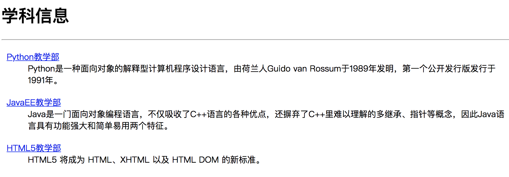
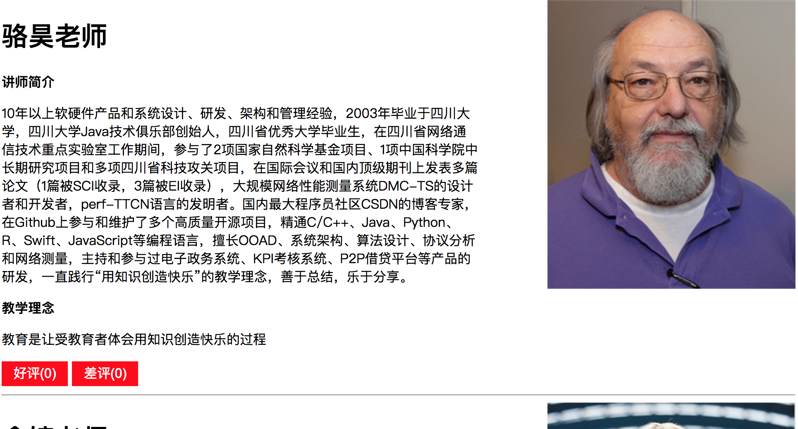

## Django 2.x实战(03) - 静态资源和Ajax请求

基于前面两个章节讲解的知识，我们已经可以使用Django框架来实现Web应用的开发了。接下来我们就尝试实现一个投票应用，具体的需求是用户进入系统首先来到“登录页”；登录成功后可以查看到“学科介绍”页面，该页面显示了一个学校所开设的所有学科；通过点击某个学科，可以进入“讲师详情”页面，该页面展示了该学科所有讲师的详细情况，可以在该页面上给讲师点击“好评”或“差评”；对于未注册的用户，可以在登录页点击“新用户注册”进入“注册页”完成用户注册，注册成功或失败都会获得相应的提示信息，注册成功后会返回“登录页”。

### 准备工作

由于之前已经详细的讲解了如何创建Django项目以及项目的相关配置，因此我们略过这部分内容，唯一需要说明的是，我们将项目命名为hellodjango，在项目下创建了一个名为demo的应用。从“学科介绍”和“讲师详情”页面的需求，我们可以首先分析出两个业务实体，一个是学科，一个是讲师，二者之前是一对多关联。因此，我们首先修改应用demo下的models.py文件来定义数据模型。

```Python

from django.db import models
from django.db.models import PROTECT


class Subject(models.Model):
    no = models.AutoField(primary_key=True, db_column='sno', verbose_name='编号')
    name = models.CharField(max_length=50, db_column='sname', verbose_name='学科名称')
    intro = models.CharField(max_length=511, db_column='sintro', verbose_name='学科介绍')

    def __str__(self):
        return self.name

    class Meta(object):
        db_table = 'tb_subject'
        verbose_name = '学科'
        verbose_name_plural = '学科'


class Teacher(models.Model):
    no = models.AutoField(primary_key=True, db_column='tno', verbose_name='编号')
    name = models.CharField(max_length=20, db_column='tname', verbose_name='姓名')
    intro = models.CharField(max_length=1023, db_column='tintro', verbose_name='简介')
    motto = models.CharField(max_length=255, db_column='tmotto', verbose_name='教学理念')
    photo = models.CharField(max_length=511, db_column='tphoto', verbose_name='照片', null=True, blank=True)
    subject = models.ForeignKey(Subject, db_column='sno', on_delete=PROTECT, related_name='+', verbose_name='所属学科')
    manager = models.BooleanField(default=False, db_column='tmanager', verbose_name='是否主管')
    good_count = models.IntegerField(default=0, db_column='tgcount', verbose_name='好评数')
    bad_count = models.IntegerField(default=0, db_column='tbcount', verbose_name='差评数')

    @property
    def gcount(self):
        return f'{self.good_count}' \
            if self.good_count <= 999 else '999+'

    @property
    def bcount(self):
        return f'{self.bad_count}' \
            if self.bad_count <= 999 else '999+'

    class Meta(object):
        db_table = 'tb_teacher'
        verbose_name = '讲师'
        verbose_name_plural = '讲师'
```

模型定义完成后，可以通过“生成迁移”和“执行迁移”来完成关系型数据库中二维表的创建，当然这需要提前启动数据库服务器并创建好对应的数据库，同时我们在项目中已经安装了PyMySQL而且完成了相应的配置，这些内容此处不再赘述。

```Shell

(venv)$ python manage.py makemigrations demo
...
(venv)$ python manage.py migrate
...
```

完成模型迁移之后，我们可以通过下面的SQL语句来添加学科和讲师的数据。

```SQL

INSERT INTO `tb_subject` 
    (`sname`, `sintro`)
VALUES
	('Python教学部', 'Python是一种面向对象的解释型计算机程序设计语言，由荷兰人Guido van Rossum于1989年发明，第一个公开发行版发行于1991年。' ),
	('JavaEE教学部', 'Java是一门面向对象编程语言，不仅吸收了C++语言的各种优点，还摒弃了C++里难以理解的多继承、指针等概念，因此Java语言具有功能强大和简单易用两个特征。' ),
	('HTML5教学部', 'HTML5 将成为 HTML、XHTML 以及 HTML DOM 的新标准。' );

INSERT INTO `tb_teacher` 
    (`tname`, `tintro`, `tmotto`, `tphoto`, `tmanager`, `sno`)
VALUES
	('骆昊', '10年以上软硬件产品和系统设计、研发、架构和管理经验，2003年毕业于四川大学，四川大学Java技术俱乐部创始人，四川省优秀大学毕业生，在四川省网络通信技术重点实验室工作期间，参与了2项国家自然科学基金项目、1项中国科学院中长期研究项目和多项四川省科技攻关项目，在国际会议和国内顶级期刊上发表多篇论文（1篇被SCI收录，3篇被EI收录），大规模网络性能测量系统DMC-TS的设计者和开发者，perf-TTCN语言的发明者。国内最大程序员社区CSDN的博客专家，在Github上参与和维护了多个高质量开源项目，精通C/C++、Java、Python、R、Swift、JavaScript等编程语言，擅长OOAD、系统架构、算法设计、协议分析和网络测量，主持和参与过电子政务系统、KPI考核系统、P2P借贷平台等产品的研发，一直践行“用知识创造快乐”的教学理念，善于总结，乐于分享。', '教育是让受教育者体会用知识创造快乐的过程', 'images/ken.png', 1, 1),
	('余婷', '5年以上移动互联网项目开发经验和教学经验，曾担任上市游戏公司高级软件研发工程师和移动端（iOS）技术负责人，参了多个企业级应用和游戏类应用的移动端开发和后台服务器开发，拥有丰富的开发经验和项目管理经验，以个人开发者和协作开发者的身份在苹果的AppStore上发布过多款App。精通Python、C、Objective-C、Swift等开发语言，熟悉iOS原生App开发、RESTful接口设计以及基于Cocos2d-x的游戏开发。授课条理清晰、细致入微，性格活泼开朗、有较强的亲和力，教学过程注重理论和实践的结合，在学员中有良好的口碑。', '每天叫醒你的不是闹钟而是梦想', 'images/linus.png', 0, 1),
	('肖世荣', '10年以上互联网和移动互联网产品设计、研发、技术架构和项目管理经验，曾在中国移动、symbio、ajinga.com、万达信息等公司担任架构师、项目经理、技术总监等职务，长期为苹果、保时捷、耐克、沃尔玛等国际客户以及国内的政府机构提供信息化服务，主导的项目曾获得“世界科技先锋”称号，个人作品“许愿吧”曾在腾讯应用市场生活类App排名前3，拥有百万级用户群体，运营的公众号“卵石坊”是国内知名的智能穿戴设备平台。精通Python、C++、Java、Ruby、JavaScript等开发语言，主导和参与了20多个企业级项目（含国家级重大项目和互联网创新项目），涉及的领域包括政务、社交、电信、卫生和金融，有极为丰富的项目实战经验。授课深入浅出、条理清晰，善于调动学员的学习热情并帮助学员理清思路和方法。', '世上没有绝望的处境，只有对处境绝望的人', 'images/dennis.png', 0, 1),
	('王海飞', '5年以上Python开发经验，先后参与了O2O商城、CRM系统、CMS平台、ERP系统等项目的设计与研发，曾在全国最大最专业的汽车领域相关服务网站担任Python高级研发工程师、项目经理等职务，擅长基于Python、Java、PHP等开发语言的企业级应用开发，全程参与了多个企业级应用从需求到上线所涉及的各种工作，精通Django、Flask等框架，熟悉基于微服务的企业级项目开发，拥有丰富的项目实战经验。善于用浅显易懂的方式在课堂上传授知识点，在授课过程中经常穿插企业开发的实际案例并分析其中的重点和难点，通过这种互动性极强的教学模式帮助学员找到解决问题的办法并提升学员的综合素质。', '不要给我说什么底层原理、框架内核！老夫敲代码就是一把梭！复制！黏贴！拿起键盘就是干！', NULL, 0, 1),
	('何瀚宇', '5年以上JavaEE项目开发和教学经验，参与过人力资源管理系统、电子教育产品在线商城、平安好医生App、平安好车主App等项目的设计与研发。擅长Java语言、面向对象编程、JavaEE框架、Web前端开发、数据库编程和Android应用开发，对新技术有着浓厚的兴趣和钻研精神，对微服务架构、虚拟化技术、区块链、边缘计算等领域都有自己独到的认识和见解，有丰富的项目经验和教学经验。授课时注重学习方法的引导，提倡以项目为导向的实战型教学，同时也注重基础知识的掌握和底层原理的理解，课堂氛围轻松幽默，能够把枯燥乏味的知识变成生动有趣的案例，帮助学员更快更好的掌握技术的要领，从事JavaEE教学工作以来，获得了学生潮水般的好评。', '每天撸代码，生活乐无边！', 'images/andrew.png', 0, 2),
	('吴明富', '毕业于西南交通大学，高级软件研发工程师，10年以上的开发和培训经验。曾就职于华为赛门铁克科技有限公司，负责公司内部ERP系统的研发，参与和主导过多个大型门户网站、电子商务网站、电子政务系统以及多个企业级Web项目的设计和开发，同时负责过多门企业内训课程的研发与讲授，有着非常丰富的JavaEE项目开发经验和Web前端开发经验，精通C/C++、Java、PHP、JavaScript等开发语言，能够使用多种技术进行全栈开发。授课经验丰富、思路清晰、富有激情，对知识点的讲解由浅入深、深入浅出，能够通过实际开发的场景引导学员思考业务并理解相关技术，善于将多年的项目实战经验和企业内训经验融入课堂，通过理论联系实际的方式帮助学员迅速提升就业能力。', '人生的道路在态度的岔口一分为二', NULL, 1, 3);
```

接下来，我们就可以修改views.py文件，通过编写视图函数先实现“学科介绍”页面。

```Python

def show_subjects(request):
    ctx = {'subjects_list': Subject.objects.all()}
    return render(request, 'demo/subject.html', ctx)
```

至此，我们还需要一个模板页，模板的配置以及模板页中模板语言的用法在之前已经进行过简要的介绍，如果不熟悉可以看看下面的代码，相信学会编写模板页并熟练的使用模板语言并不是一件困难的事情。

```HTML

<!DOCTYPE html>
<html lang="en">
<head>
    <meta charset="UTF-8">
    <title>学科信息</title>
    <style>
        body {
            width: 960px;
            margin: 0 auto;
        }
        .sub {
            margin: 20px 10px;
        }
    </style>
</head>
<body>
    <h1>学科信息</h1>
    <hr>
    
    <dl class="sub">
        <dt><a href="/subjects/{{ subject.no }}">{{ subject.name }}</a></dt>
        <dd>{{ subject.intro }}</dd>
    </dl>
    
</body>
</html>
```

启动服务器，运行效果如下图所示。



### 加载静态资源

在上面的模板中，我们为每个学科添加了一个超链接，点击超链接可以查看该学科的讲师信息，为此我们得修改项目的urls.py文件配置一个新的URL。

```Python

from django.contrib import admin
from django.urls import path

from demo import views

urlpatterns = [
    path('', views.show_subjects),
    path('subjects/<int:no>', views.show_teachers),
    path('admin/', admin.site.urls),
]
```

Django 2.x在配置URL时可以使用如上面所示的占位符语法，而且可以指定占位符的类型，因为在查询学科讲师信息时，需要传入该学科的编号作为条件，而学科编号在定义模型时设定为`AutoField`，其本质就是`int`类型。相较于Django 1.x中使用正则表达式的命名捕获组来从URL中获取数据（如果对Django 1.x并没有什么概念，这句话可以暂时忽略不计），这种更加优雅的写法可以让我们在视图函数中直接获得学科编号，代码如下所示。

```Python

def show_teachers(request, no):
    teachers = Teacher.objects.filter(subject__no=no)
    ctx = {'teachers_list': teachers}
    return render(request, 'demo/teacher.html', ctx)
```

接下来我们可以定制“讲师详情”的模板页。

```HTML

<!DOCTYPE html>

<html lang="en">
<head>
    <meta charset="UTF-8">
    <title>讲师信息</title>
    <style>
        .container {
            width: 960px;
            margin: 0 auto;
        }
        .basic {
            width: 60%;
            float: left;
        }
        .potrait {
            width: 40%;
            float: left;
            text-align: right;
        }
        hr {
            clear: both;
        }
        .button {
            display: inline-block;
            width: 80px;
            height: 30px;
            background-color: red;
            color: white;
            font: 16px/30px Arial;
            text-decoration: none;
            text-align: center;
        	margin-bottom: 10px;
		}
    </style>
</head>
<body>
    
    <div class="container">
        <div class="basic">
            <h1>{{ x.name }}老师</h1>
            <p><strong>讲师简介</strong></p>
            <p>{{ x.intro }}</p>
            <p><strong>教学理念</strong></p>
            <p>{{ x.motto }}</p>
            <a href="/good/{{ x.no }}" class="button">好评({{ x.gcount }})</a>
            <a href="/bad/{{ x.no }}" class="button">差评({{ x.bcount }})</a>
        </div>
        <div class="potrait">
            
            
            
        </div>
        <hr>
    </div>
    
</body>
</html>
```

请注意上面的模板页面，我们在第2行和``标签中使用了加载静态资源的模板指令，通过加载静态资源的指令我们可以显示讲师的头像。当然，我们还得创建放置静态资源的文件夹并在项目的配置文件中指明静态资源文件夹的所在以及静态资源的URL。

```Shell

(venv)$ mkdir static
(venv)$ cd static
(venv)$ mkdir css js images
```

首先在项目根目录下创建static文件，再进入static目录，创建css、js和images三个文件夹，分别用来放置层叠样式表、JavaScript文件和图片资源。

```Python

# 此处省略上面的代码

STATICFILES_DIRS = [os.path.join(BASE_DIR, 'static'), ]
STATIC_URL = '/static/'

# 此处省略下面的代码
```

接下来运行项目查看结果。



### Ajax请求

接下来就可以实现“好评”和“差评”的功能了，很明显如果能够在不刷新页面的情况下实现这两个功能会带来更好的用户体验，因此我们考虑使用[Ajax](https://zh.wikipedia.org/wiki/AJAX)来实现“好评”和“差评”。

首先修改项目的urls.py文件，为“好评”和“差评”功能映射对应的URL，跟上面一样我们在URL中使用了占位符语法来绑定讲师的编号。

```Python

from django.contrib import admin
from django.urls import path

from demo import views

urlpatterns = [
    path('', views.login),
    path('subjects/', views.show_subjects),
    path('subjects/<int:no>/', views.show_teachers),
    path('good/<int:no>/', views.make_comment),
    path('bad/<int:no>/', views.make_comment),
    path('admin/', admin.site.urls),
]
```

设计视图函数`make_comment`来支持“好评”和“差评”功能，可以通过`json`模块的`dumps`函数实现将字典转成JSON字符串并作为`HttpResponse`返回给浏览器的内容。在创建`HttpResponse`对象时，可以通过`content_type`参数来指定响应的[MIME类型](http://www.w3school.com.cn/media/media_mimeref.asp)为JSON且使用UTF-8编码（避免JSON字符串中的中文出现乱码）。

```Python

def make_comment(request, no):
    ctx = {'code': 200}
    try:
        teacher = Teacher.objects.get(pk=no)
        if request.path.startswith('/good'):
            teacher.good_count += 1
            ctx['result'] = f'好评({teacher.gcount})'
        else:
            teacher.bad_count += 1
            ctx['result'] = f'差评({teacher.bcount})'
        teacher.save()
    except Teacher.DoesNotExist:
        ctx['code'] = 404
    return HttpResponse(json.dumps(ctx),
                        content_type='application/json; charset=utf-8')
```

修改模板页引入jQuery库来实现事件处理、Ajax请求和DOM操作。

```HTML

<!DOCTYPE html>

<html lang="en">
<head>
    <meta charset="UTF-8">
    <title>讲师信息</title>
    <style>
        .container {
            width: 960px;
            margin: 0 auto;
        }
        .basic {
            width: 60%;
            float: left;
        }
        .potrait {
            width: 40%;
            float: left;
            text-align: right;
        }
        hr {
            clear: both;
        }
        .button {
            display: inline-block;
            width: 80px;
            height: 30px;
            background-color: red;
            color: white;
            font: 16px/30px Arial;
            text-decoration: none;
            text-align: center;
            margin-bottom: 10px;
        }
    </style>
</head>
<body>
    
    <div class="container">
        <div class="basic">
            <h1>{{ x.name }}老师</h1>
            <p><strong>讲师简介</strong></p>
            <p>{{ x.intro }}</p>
            <p><strong>教学理念</strong></p>
            <p>{{ x.motto }}</p>
            <a href="/good/{{ x.no }}" class="button">好评({{ x.gcount }})</a>
            <a href="/bad/{{ x.no }}" class="button">差评({{ x.bcount }})</a>
        </div>
        <div class="potrait">
            
            
            
        </div>
        <hr>
    </div>
    
    <script src=""></script>
    <script>
       $(function() {
           $('.basic .button').on('click', function(evt) {
               evt.preventDefault();
               var $a = $(evt.target);
               var url = $a.attr('href');
               $.ajax({
                   'url': url,
                   'type': 'get',
                   'dataType': 'json',
                   'success': function(json) {
                       if (json.code == 200) {
                           $a.text(json.result);
                       }
                   }
               });
           });
       });
    </script>
</body>
</html>
```

### 小结

到此，这个小项目的核心功能已然完成，在下一个章节中我们会增加用户登录和注册的功能，稍后我们还会限定登录后的用户才能进行投票操作，而且每个用户只能投出3票。