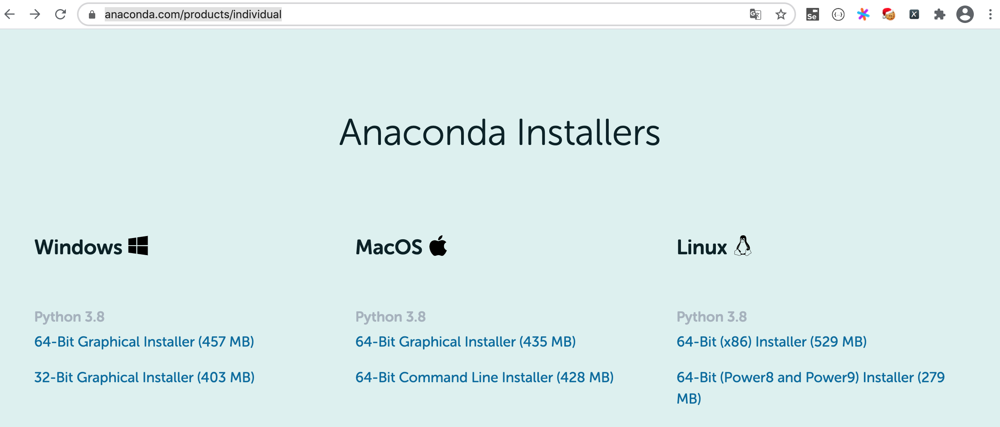
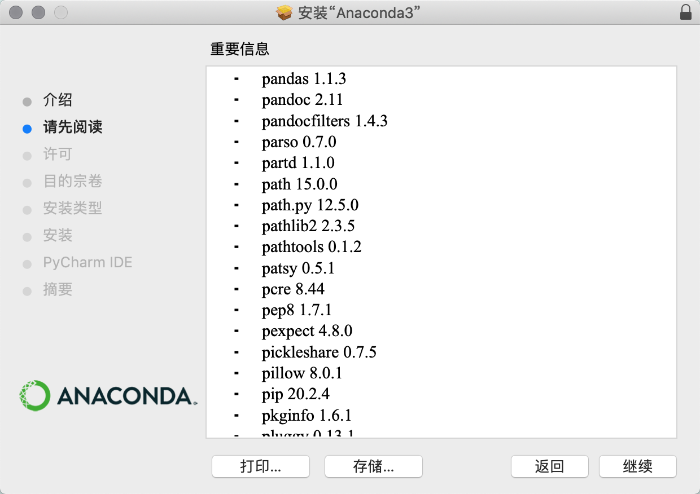
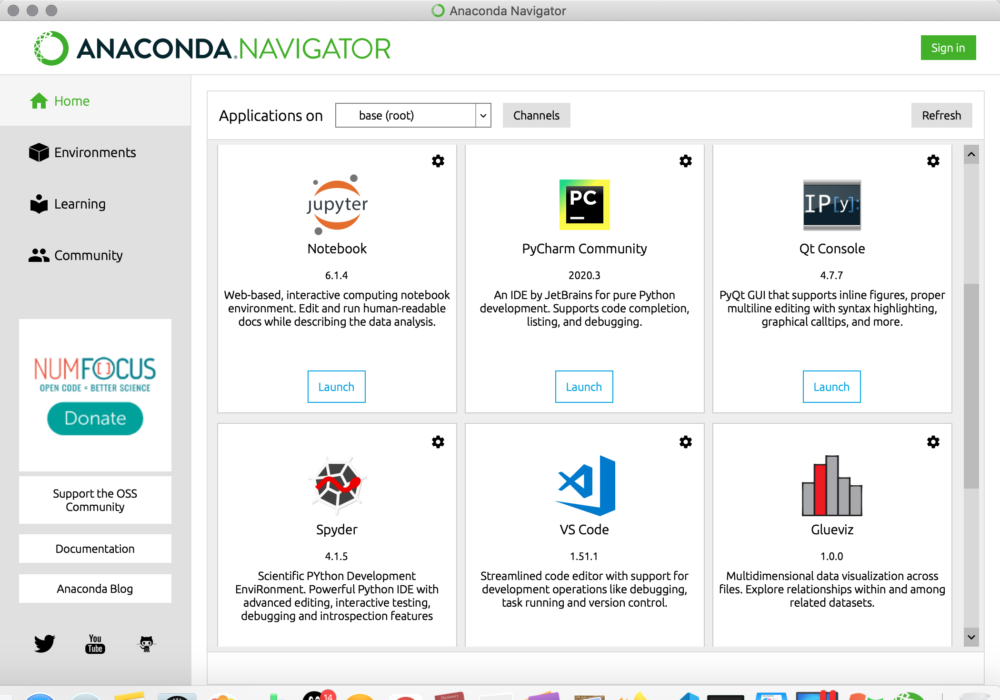
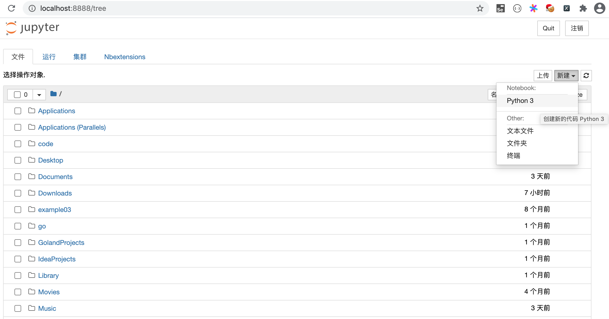
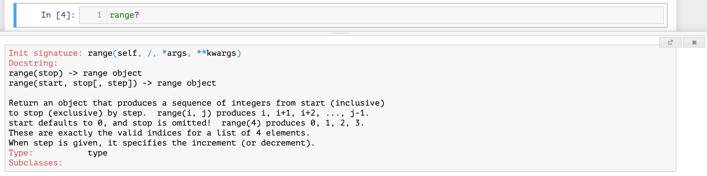
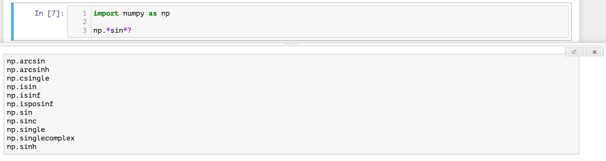
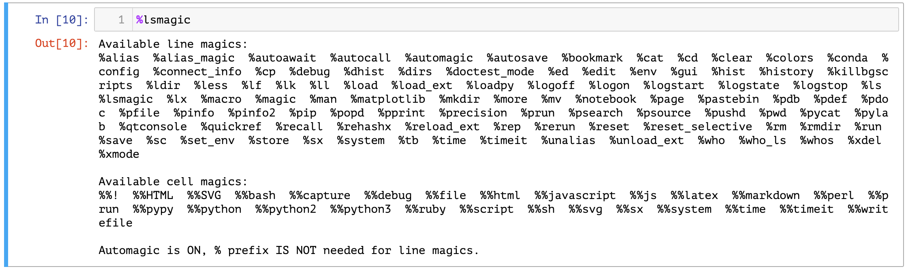
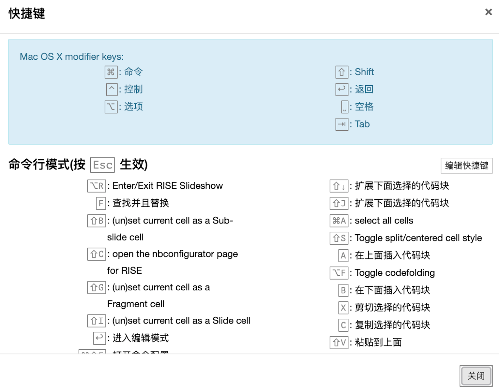
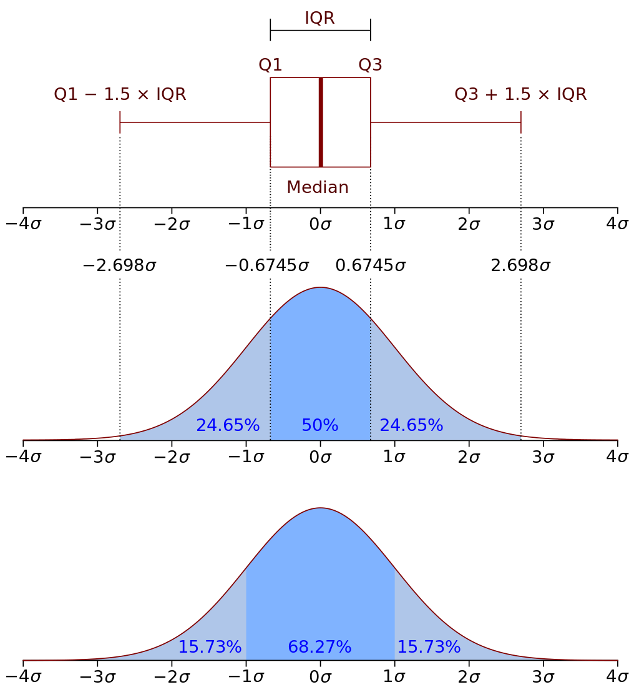

## 数据分析概述

当今世界对信息技术的依赖程度在不断加深，每天都会有大量的数据产生，我们经常会感到数据越来越多，但是要从中发现有价值的信息却越来越难。这里所说的信息，可以理解为对数据集处理之后的结果，是从数据集中提炼出的可用于其他场合的结论性的东西，而**从原始数据中抽取出有价值的信息**的这个过程我们就称之为**数据分析**，它是数据科学工作的一部分。

### 数据分析师的职责和技能栈

我们通常将从事数据分析、数据科学和数据相关产品的岗位都统称为数据分析岗位，但是根据工作性质的不同，又可以分为**数据分析方向**、**数据挖掘方向**、**数据产品方向**和**数据工程方向**。我们通常所说的数据分析师主要是指**业务数据分析师**，很多数据分析师的职业生涯都是从这个岗位开始的，而且这个岗位也是招聘数量最大的岗位。业务数据分析师在公司通常不属于研发部门而**属于运营部门**，所以这个岗位也称为**数据运营**或**商业分析**，通常招聘信息对这个岗位的描述是：

1. 负责各部门相关的报表。
2. 建立和优化指标体系。
3. 监控数据波动和异常，找出问题。
4. 优化和驱动业务，推动数字化运营。
5. 找出潜在的市场和产品的上升空间。

根据上面的描述，作为业务数据分析师，我们的工作不是给领导一个简单浅显的结论，而是结合公司的业务，完成**揪出异常**、**找到原因**、**探索趋势**的工作。所以作为数据分析师，不管是用Python语言、Excel、SPSS或其他的商业智能工具，工具只是达成目标的手段，**数据思维是核心技能**，而从实际业务问题出发到最终发现数据中的商业价值是终极目标。数据分析师在很多公司只是一个基础岗位，精于业务的数据分析师可以向**数据分析经理**或**数据运营总监**等管理岗位发展；对于熟悉机器学习算法的数据分析师来说，可以向**数据挖掘工程师**或**算法专家**方向发展，而这些岗位除了需要相应的数学和统计学知识，在编程能力方面也比数据分析师有更高的要求，可能还需要有大数据存储和处理的相关经验；作为数据产品经理，除了传统产品经理的技能栈之外，也需要较强的技术能力，例如要了解常用的推荐算法、机器学习模型，能够为算法的改进提供依据，能够制定相关埋点的规范和口径，虽然不需要精通各种算法，但是要站在产品的角度去考虑数据模型、指标、算法等的落地；数据工程师是一个偏技术的岗位，基本上的成长道路都是从SQL开始，逐步向Hadoop生态圈迁移，然后每天跟Flume和Kafka亲密接触的一个过程。

以下是我总结的数据分析师的技能栈，仅供参考。

1. 计算机科学（数据分析工具、编程语言、数据库、……）
2. 数学和统计学（数据思维、统计思维）
3. 人工智能（机器学习算法）
4. 业务理解能力（沟通、表达、经验）
5. 总结和表述能力（商业PPT、文字总结）

### 数据分析的流程

一个完整的数据分析流程应该包含以下几个方面，当然因为行业和工作内容的不同会略有差异。

1. 确定目标（输入）：理解业务，确定要解决的问题
2. 收集数据（数据库、电子表格、三方接口、网络爬虫、开放数据集、……）
3. 数据清洗（数据清洗、数据变换、特征工程、……）
4. 探索数据（分组、聚合、拼接、运算、可视化、……）
5. 模型迭代（选择模型、应用算法、模型调优、……）
6. 模型部署（输出）：模型落地，改进业务，A/B测试，报告撰写

### 数据分析相关库

使用Python从事数据科学相关的工作是一个非常棒的选择，因为Python整个生态圈中，有大量的成熟的用于数据科学的软件包（工具库）。而且不同于其他的用于数据科学的编程语言（如：Julia、R），Python除了可以用于数据科学，能做的事情还很多，可以说Python语言几乎是无所不能的。

#### 三大神器

1. [NumPy](https://numpy.org/)：支持常见的数组和矩阵操作，通过`ndarray`类实现了对多维数组的封装，提供了操作这些数组的方法和函数集。由于NumPy内置了并行运算功能，当使用多核CPU时，Numpy会自动做并行计算。
2. [Pandas](https://pandas.pydata.org/)：pandas的核心是其特有的数据结构`DataFrame`和`Series`，这使得pandas可以处理包含不同类型的数据的负责表格和时间序列，这一点是NumPy的`ndarray`做不到的。使用pandas，可以轻松顺利的加载各种形式的数据，然后对数据进行切片、切块、处理缺失值、聚合、重塑和可视化等操作。
3. [Matplotlib](https://matplotlib.org/)：matplotlib是一个包含各种绘图模块的库，能够根据我们提供的数据创建高质量的图形。此外，matplotlib还提供了pylab模块，这个模块包含了很多像[MATLAB](https://www.mathworks.com/products/matlab.html)一样的绘图组件。

#### 其他相关库

1. [SciPy](https://scipy.org/)：完善了NumPy的功能，封装了大量科学计算的算法，包括线性代数、稀疏矩阵、信号和图像处理、最优化问题、快速傅里叶变换等。
2. [Seaborn](https://seaborn.pydata.org/)：Seaborn是基于matplotlib的图形可视化工具，直接使用matplotlib虽然可以定制出漂亮的统计图表，但是总体来说还不够简单方便，Seaborn相当于是对matplotlib做了封装，让用户能够以更简洁有效的方式做出各种有吸引力的统计图表。
3. [Scikit-learn](https://scikit-learn.org/)：Scikit-learn最初是SciPy的一部分，它是Python数据科学运算的核心，提供了大量机器学习可能用到的工具，包括：数据预处理、监督学习（分类、回归）、无监督学习（聚类）、模式选择、交叉检验等。
4. [Statsmodels](https://www.statsmodels.org/stable/index.html)：包含了经典统计学和经济计量学算法的库。

### 安装和使用Anaconda

如果希望快速开始使用Python处理数据科学相关的工作，建议大家直接安装Anaconda，它是工具包最为齐全的Python科学计算发行版本。对于新手来说，先安装官方的Python解释器，再逐个安装工作中会使用到的库文件会比较麻烦，尤其是在Windows环境下，经常会因为构建工具或DLL文件的缺失导致安装失败，而一般新手也很难根据错误提示信息采取正确的解决措施，容易产生严重的挫败感。

对于个人用户来说，可以从Anaconda的[官方网站](https://www.anaconda.com/)下载它的“个人版（Individual Edition）”安装程序，安装完成后，你的计算机上不仅拥有了Python环境和Spyder（类似于PyCharm的集成开发工具），还拥有了与数据科学工作相关的近200个工具包，包括我们上面提到的那些库。除此之外，Anaconda还提供了一个名为conda的包管理工具，通过这个工具不仅可以管理Python的工具包，还可以用于创建运行Python程序的虚拟环境。

可以通过Anaconda官网提供的下载链接选择适合自己操作系统的安装程序，建议大家选择图形化的安装程序，下载完成后双击安装程序开始安装，如下所示。





完成安装后，macOS用户可以在“应用程序”或“Launchpad”中找到名为“Anaconda-Navigator”的应用程序，运行该程序可以看到如下所示的界面，我们可以在这里选择需要执行的操作。



对于Windows用户，建议按照安装向导的提示和推荐的选项来安装Anaconda。在完成安装之后，通过Windows的“开始菜单”找到Anaconda，并选择要执行的功能。我们可以选择启动名为“Jupyter Notebook”的工具（以下都简称为Notebook）来开始数据科学的探索之旅，我们也可以运行名为“Spyder”的工具来编写Python代码。

### 使用Notebook

#### 安装和启动Notebook

如果已经安装了Anaconda，可以按照上面所说的方式直接启动Notebook。对于安装了Python环境但是没有安装Anaconda的用户，可以用Python的包管理工具pip来安装`jupyter`，然后在终端（Windows系统称之为命令行提示符）中运行`jupyter notebook`命令来启动Notebook，如下所示。

安装：

```Bash
pip install jupyter
```

运行：

```Bash
jupyter notebook
```

Notebook是基于网页的用于交互计算的应用程序，可以用于代码开发、文档撰写、代码运行和结果展示。简单的说，你可以在网页中直接**编写代码**和**运行代码**，代码的运行结果也会直接在代码块下方进行展示。如在编写代码的过程中需要编写说明文档，可在同一个页面中使用Markdonw格式进行编写，而且可以直接看到渲染后的效果。此外，Notebook的设计初衷是提供一个能够支持多种编程语言的工作环境，目前它能够支持超过40种编程语言，包括Python、R、Julia、Scala等。

首先，我们可以创建一个用于书写Python代码的Notebook，如下图所示。



接下来，我们就可以编写代码、撰写文档和运行程序啦，如下图所示。


#### Notebook使用技巧

如果使用Python做工程化的项目开发，PyCharm肯定是最好的选择，它提供了一个集成开发环境应该具有的所有功能，尤其是智能提示、代码补全、自动纠错这类功能会让开发人员感到非常舒服。如果使用Python做数据科学相关的工作，Notebook并不比PyCharm逊色，在数据和图表展示方面Notebook更加优秀。这个工具的使用非常简单，大家可以看看Notebook菜单栏，相信理解起来不会有太多困难，在知乎上有一篇名为[《最详尽使用指南：超快上手Jupyter Notebook》](https://zhuanlan.zhihu.com/p/32320214)的文章，也可以帮助大家快速认识Notebook。

下面我为大家介绍一些Notebook的使用技巧，希望能够帮助大家提升工作效率。

1. 自动补全。在使用Notebook编写代码时，按`Tab`键会获得代码提示。

2. 获得帮助。在使用Notebook时，如果希望了解一个对象（如变量、类、函数等）的相关信息或使用方式，可以在对象后面使用`?`并运行代码， 窗口下方会显示出对应的信息，帮助我们了解该对象，如下所示。

    

3. 搜索命名。如果只记得一个类或一个函数名字的一部分，可以使用通配符`*`并配合`?`进行搜索，如下所示。

    

4. 调用命令。可以在Notebook中使用`!`后面跟系统命令的方式来执行系统命令。

5. 魔法指令。Notebook中有很多非常有趣且有用的魔法指令，例如可以使用`%timeit`测试语句的执行时间，可以使用`%pwd`查看当前工作目录等。如果想查看所有的魔法指令，可以使用`%lsmagic`，如果了解魔法指令的用法，可以使用`%magic`来查看，如下图所示。

    

    常用的魔法指令有：

    | 魔法指令                                    | 功能说明                                   |
    | ------------------------------------------- | ------------------------------------------ |
    | `%pwd`                                      | 查看当前工作目录                           |
    | `%ls`                                       | 列出当前或指定文件夹下的内容               |
    | `%cat`                                      | 查看指定文件的内容                         |
    | `%hist`                                     | 查看输入历史                               |
    | `%matplotlib inline`                        | 设置在页面中嵌入matplotlib输出的统计图表   |
    | `%config Inlinebackend.figure_format='svg'` | 设置统计图表使用SVG格式（矢量图）          |
    | `%run`                                      | 运行指定的程序                             |
    | `%load`                                     | 加载指定的文件到单元格中                   |
    | `%quickref`                                 | 显示IPython的快速参考                      |
    | `%timeit`                                   | 多次运行代码并统计代码执行时间             |
    | `%prun`                                     | 用`cProfile.run`运行代码并显示分析器的输出 |
    | `%who` / `%whos`                            | 显示命名空间中的变量                       |
    | `%xdel`                                     | 删除一个对象并清理所有对它的引用           |

    

6. 快捷键。Notebook中的很多操作可以通过快捷键来实现，使用快捷键可以提升我们的工作效率。Notebook的快捷键又可以分为命令模式下的快捷键和编辑模式下的快捷键，所谓编辑模式就是处于输入代码或撰写文档状态的模式，在编辑模式下按`Esc`可以回到命令模式，在命令模式下按`Enter`可以进入编辑模式。

    命令模式下的快捷键：

    | 快捷键                          | 功能说明                                     |
    | ------------------------------- | -------------------------------------------- |
    | Alt + Enter（Option + Enter）   | 运行当前单元格并在下面插入新的单元格         |
    | Shift + Enter                   | 运行当前单元格并选中下方的单元格             |
    | Ctrl + Enter（Command + Enter） | 运行当前单元格                               |
    | j / k、Shift + j / Shift + k    | 选中下方/上方单元格、连续选中下方/上方单元格 |
    | a / b                           | 在下方/上方插入新的单元格                    |
    | c / x                           | 复制单元格 / 剪切单元格                      |
    | v / Shift + v                   | 在下方/上方粘贴单元格                        |
    | dd / z                          | 删除单元格 / 恢复删除的单元格                |
    | l / Shift + l                   | 显示或隐藏当前/所有单元格行号                |
    | ii / 00                         | 中断/重启Notebook内核                        |
    | Space / Shift + Space           | 向下/向上滚动页面                            |

    编辑模式下的快捷键：

    | 快捷键                                           | 功能说明                               |
    | ------------------------------------------------ | -------------------------------------- |
    | Shift + Tab                                      | 获得提示信息                           |
    | Ctrl + ]（Command + ]）/ Ctrl + [（Command + [） | 增加/减少缩进                          |
    | Alt + Enter（Option + Enter）                    | 运行当前单元格并在下面插入新的单元格   |
    | Shift + Enter                                    | 运行当前单元格并选中下方的单元格       |
    | Ctrl + Enter（Command + Enter）                  | 运行当前单元格                         |
    | Ctrl + Left / Right（Command + Left / Right）    | 光标移到行首/行尾                      |
    | Ctrl + Up / Down（Command + Up / Down）          | 光标移动代码开头/结尾处                |
    | Up / Down                                        | 光标上移/下移一行或移到上/下一个单元格 |

    > **温馨提示**：如果记不住这些快捷键也没有关系，在命令模式下按`h`键可以打开Notebook的帮助系统，马上就可以看到快捷键的设置，而且可以根据实际的需要重新编辑快捷键，如下图所示。
    >
    > 

### 补充知识

#### 描述型统计

1. 集中趋势

    - **众数**（mode）：数据集合中出现频次最多的数据。数据的趋势越集中，众数的代表性就越好。众数不受极值的影响，但是无法保证唯一性。

    - **均值**（mean）：均值代表某个数据集的整体水平，它的缺点是容易受极值的影响，可以使用加权平均值来消除极值的影响，但是可能事先并不清楚数据的权重，所以对于正数可以用几何平均值来替代算术平均值，二者的计算公式如下所示。
      
        算术平均值：
        $
        \bar{x}=\frac{\sum_{i=1}^{n}x_{i}}{n}=\frac{x_{1}+x_{2}+\cdots +x_{n}}{n}
        $
        
        
        几何平均值：
        $
        \left(\prod_{i=1}^{n}x_{i}\right)^{\frac{1}{n}}={\sqrt[{n}]{x_{1}x_{2} \cdots x_{n}}}
        $
        
- **分位数**：将一个随机变量的概率分布范围分为几个具有相同概率的连续区间，比如最常见的中位数（二分位数，median），就是将数据集划分为数量相等的上下两个部分。除此之外，常见的分位数还有四分位数（quartile）、百分位数（percentile）等。
    
    - 中位数：
            $
            {Q}_{\frac {1}{2}}(x)={\begin{cases}x'_{\frac{n+1}{2}},&n是奇数\\{\frac {1}{2}}(x'_{\frac{n}{2}}+x'_{{\frac{n}{2}}+1}),&n是偶数\end{cases}}
            $
            
    - 四分位数：
    
        **第一四分位数**（$Q_1$），又称**较小四分位数**或**下四分位数**，等于该样本中所有数值由小到大排列后第25%的数字。
    
        **第二四分位数**（$Q_2$），又称**中位数**，等于该样本中所有数值由小到大排列后第50%的数字。
    
        **第三四分位数**（$Q_3$），又称**较大四分位数**或**上四分位数**，等于该样本中所有数值由小到大排列后第75%的数字。
    
        **四分位距离**（$IQR$，Inter-Quartile Range），即$Q_3-Q_1$的值。
    
    在实际工作中，我们经常通过四分位数再配合[箱线图](https://zhuanlan.zhihu.com/p/110580568)来发现异常值。例如，小于$Q_1 - 1.5 \times IQR$的值或大于$Q3 + 1.5 \times IQR$的值可以视为普通异常值，而小于$Q_1 - 3 * IQR$的值或大于$Q3 + 3 * IQR$的值通常视为极度异常值。这种检测异常值的方法跟[“$3\sigma$法则”](https://zh.wikipedia.org/wiki/68%E2%80%9395%E2%80%9399.7%E5%8E%9F%E5%89%87)的道理是一致的，如下图所示。
    
    

2. 离散趋势

     - **极值**：就是最大值（maximum）、最小值（minimum），代表着数据集合中的上限和下限。
     - **极差**（range）：又称“全距”，是一组数据中的最大观测值和最小观测值之差，记作$R$。一般情况下，极差越大，离散程度越大，数据受极值的影响越严重。
        	- 方差（variance）：将每个值与均值的偏差进行平方，最后除以总数据量的值。简单来说就是表示数据与期望值的偏离程度。方差越大，就意味着每个值与平均值的差值平方和越大、越不稳定、波动越剧烈，因此代表着数据整体比较分散，呈现出离散的趋势；而方差越小，代表着每个值与平均值的差值平方和越小、越稳定、波动越平滑，因此代表着数据整体很集中。
        	- **标准差**（standard deviation）：将方差进行平方根，与方差一样都是表示数据与期望值的偏离程度。
        	- **分位差**：分位数的差值，如上面提到的四分位距离。

3. 分布

    - **峰态**：峰态就是概率分布曲线的峰值高低，是尖峰、平顶峰，还是正态峰。
    - **偏度**：偏度就是峰值与平均值的偏离程度，是左偏还是右偏。

#### 推理性统计

1. 概率分布

    - 离散型分布：如果随机发生的事件之间是毫无联系的，每一次随机事件发生都是独立的、不连续的、不受其他事件影响的，那么这些事件的概率分布就属于离散型分布。

        - 二项分布（Binomial distribution）：$n$个独立的是/非试验中成功的次数的离散概率分布，其中每次试验的成功概率为$p$。一般地，如果随机变量$X$服从参数为$n$和$p$的二项分布，记为$X\sim B(n,p)$。$n$次试验中正好得到$k$次成功的概率由概率质量函数给出，如下所示。
            $
            \displaystyle f(k,n,p)=\Pr(X=k)={n \choose k}p^{k}(1-p)^{n-k}
            $
            对于$k= 0, 1, 2, ..., n$，其中${n \choose k}={\frac {n!}{k!(n-k)!}}$
            
        - 泊松分布：适合于描述单位时间内随机事件发生的次数的概率分布。如某一服务设施在一定时间内受到的服务请求的次数、汽车站台的候客人数、机器出现的故障数、自然灾害发生的次数、DNA序列的变异数、放射性原子核的衰变数等等。泊松分布的概率质量函数为：
        
            $
            P(X=k)=\frac{e^{-\lambda}\lambda^k}{k!}
            $
          泊松分布的参数$\lambda$是单位时间（或单位面积）内随机事件的平均发生率。
        
    - 连续型分布：

        - 正态分布：又名**高斯分布**（Gaussian distribution），是一个非常常见的连续概率分布，经常用自然科学和社会科学中来代表一个不明的随机变量。若随机变量$X$服从一个位置参数为$\mu$、尺度参数为$\sigma$的正态分布，记为$X \sim N(\mu,\sigma^2)$，其概率密度函数为：
            $
            \displaystyle f(x)={\frac {1}{\sigma {\sqrt {2\pi }}}}\;e^{-{\frac {\left(x-\mu \right)^{2}}{2\sigma ^{2}}}}
            $

        - 伽马分布：假设$X_1, X_2, ... X_n$为连续发生事件的等候时间，且这$n$次等候时间为独立的，那么这$n$次等候时间之和$Y$（$Y=X_1+X_2+...+X_n$）服从伽玛分布，即$Y \sim \Gamma(\alpha,\beta)$，其中$\alpha=n, \beta=\lambda$，这里的$\lambda$是连续发生事件的平均发生频率。

        - 卡方分布：若$k$个随机变量$Z_1,Z_2,...,Z_k$是相互独立且符合标准正态分布（数学期望为0，方差为1）的随机变量，则随机变量$Z$的平方和$X=\sum_{i=1}^{k}Z_i^2$被称为服从自由度为$k$的卡方分布，记为$X \sim \chi^2(k)$。

    - 大数定律：样本数量越多，则其算术平均值就有越高的概率接近期望值。

        - 弱大数定律（辛钦定理）：样本均值依概率收敛于期望值，即对于任意正数$\epsilon$，有：
            $
            \lim_{n \to \infty}P(|\overline{X_n}-\mu|>\epsilon)=0
            $

        - 强大数定律：样本均值以概率1收敛于期望值，即：
            $
            P(\lim_{n \to \infty}\overline{X_n}=\mu)=1
            $

    - 中心极限定理：如果统计对象是大量独立的随机变量，那么这些变量的平均值分布就会趋向于正态分布，不管原来它们的概率分布是什么类型。

2. 假设检验

    假设检验就是通过抽取样本数据，并且通过**小概率反证法**去验证整体情况的方法。假设检验的核心思想是小概率反证法（首先假设想推翻的命题是成立的，然后试图找出矛盾，找出不合理的地方来证明命题为假命题），即在原假设（零假设，null hypothesis）的前提下，估算某事件发生的可能性，如果该事件是小概率事件，在一次研究中本来是不可能发生的，现在却发生了，这时候就可以推翻原假设，接受备择假设（alternative hypothesis）。如果该事件不是小概率事件，我们就找不到理由来推翻之前的假设，实际中可引申为接受所做的无效假设。

    假设检验会存在两种错误情况，一种称为“拒真”，一种称为“取伪”。如果原假设是对的，但你拒绝了原假设，这种错误就叫作“拒真”，这个错误的概率也叫作显著性水平$\alpha$，或称为容忍度；如果原假设是错的，但你承认了原假设，这种错误就叫作“取伪”，这个错误的概率我们记为$\beta$。

描述性统计通常用于研究表象，将现象用数据的方式描述出来；推理性统计通常用于推测本质，也就是你看到的表象的东西有多大概率符合你对隐藏在表象后的本质的猜测。