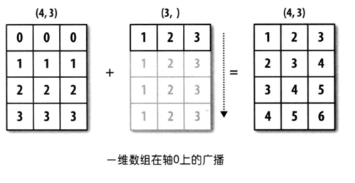
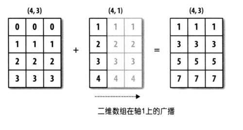

## NumPy的应用

Numpy是一个开源的Python科学计算库，**用于快速处理任意维度的数组**。Numpy**支持常见的数组和矩阵操作**，对于同样的数值计算任务，使用NumPy不仅代码要简洁的多，而且NumPy的性能远远优于原生Python，基本是一个到两个数量级的差距，而且数据量越大，NumPy的优势就越明显。

Numpy最为核心的数据类型是`ndarray`，使用`ndarray`可以处理一维、二维和多维数组，该对象相当于是一个快速而灵活的大数据容器。NumPy底层代码使用C语言编写，解决了GIL的限制，`ndarray`在存储数据的时候，数据与数据的地址都是连续的，这样就给使得批量操作速度很快，远远优于Python中的`list`；另一方面`ndarray`对象提供了更多的方法来处理数据，尤其是和统计相关的方法，这些方法也是Python原生的`list`没有的。

 ### 准备工作

1. 启动Notebook

    ```Bash
    jupyter notebook
    ```

    > **提示**：在启动Notebook之前，建议先安装好数据分析相关依赖项，包括之前提到的三大神器以及相关依赖项，包括：`numpy`、`pandas`、`matplotlib`、`openpyxl`、`xlrd`、`xlwt`等。如果使用Anaconda，则无需单独安装。

2. 导入

    ```Python
    import numpy as np
    import pandas as pd
    import matplotlib.pyplot as plt
    ```

    > **说明**：如果已经启动了Notebook但尚未安装相关依赖库，例如NumPy，可以在Notebook的单元格中输入`!pip install numpy`并运行该单元格来安装NumPy，其他库如法炮制。安装成功后选择“Kernel”（服务）菜单的“Restart”（重启）选项来重启Notebook内核（前面有讲到重启的快捷键）来使新安装的库生效。上面我们不仅导入了NumPy，还将pandas和matplotlib库一并导入了。

### 创建数组对象

创建`ndarray`对象有很多种方法，下面就如何创建一维数组、二维数组和多维数组进行说明。

#### 一维数组

- 方法一：使用`array`函数，通过`list`创建数组对象

    代码：

    ```Python
    array1 = np.array([1, 2, 3, 4, 5])
    array1
    ```

    输出：

    ```
    array([1, 2, 3, 4, 5])
    ```

- 方法二：使用`arange`函数，指定取值范围创建数组对象

    代码：

    ```Python
    array2 = np.arange(0, 20, 2)
    array2
    ```

    输出：

    ```
    array([ 0,  2,  4,  6,  8, 10, 12, 14, 16, 18])
    ```

- 方法三：使用`linspace`函数，用指定范围均匀间隔的数字创建数组对象

    代码：

    ```Python
    array3 = np.linspace(-5, 5, 101)
    array3
    ```

    输出：

    ```
    array([-5. , -4.9, -4.8, -4.7, -4.6, -4.5, -4.4, -4.3, -4.2, -4.1, -4. ,
           -3.9, -3.8, -3.7, -3.6, -3.5, -3.4, -3.3, -3.2, -3.1, -3. , -2.9,
           -2.8, -2.7, -2.6, -2.5, -2.4, -2.3, -2.2, -2.1, -2. , -1.9, -1.8,
           -1.7, -1.6, -1.5, -1.4, -1.3, -1.2, -1.1, -1. , -0.9, -0.8, -0.7,
           -0.6, -0.5, -0.4, -0.3, -0.2, -0.1,  0. ,  0.1,  0.2,  0.3,  0.4,
            0.5,  0.6,  0.7,  0.8,  0.9,  1. ,  1.1,  1.2,  1.3,  1.4,  1.5,
            1.6,  1.7,  1.8,  1.9,  2. ,  2.1,  2.2,  2.3,  2.4,  2.5,  2.6,
            2.7,  2.8,  2.9,  3. ,  3.1,  3.2,  3.3,  3.4,  3.5,  3.6,  3.7,
            3.8,  3.9,  4. ,  4.1,  4.2,  4.3,  4.4,  4.5,  4.6,  4.7,  4.8,
            4.9,  5. ])
    ```

- 方法四：使用`numpy.random`模块的函数生成随机数创建数组对象

    产生10个$[0, 1)$范围的随机小数，代码：

    ```Python
    array4 = np.random.rand(10)
    array4
    ```

    输出：

    ```
    array([0.45556132, 0.67871326, 0.4552213 , 0.96671509, 0.44086463,
           0.72650875, 0.79877188, 0.12153022, 0.24762739, 0.6669852 ])
    ```

    产生10个$[1, 100)$范围的随机整数，代码：

    ```Python
    array5 = np.random.randint(1, 100, 10)
    array5
    ```

    输出：

    ```
    array([29, 97, 87, 47, 39, 19, 71, 32, 79, 34])
    ```

    产生20个$\mu=50$，$\sigma=10$的正态分布随机数，代码：

    ```Python
    array6 = np.random.normal(50, 10, 20)
    array6
    ```

    输出：

    ```
    array([55.04155586, 46.43510797, 20.28371158, 62.67884053, 61.23185964,
           38.22682148, 53.17126151, 43.54741592, 36.11268017, 40.94086676,
           63.27911699, 46.92688903, 37.1593374 , 67.06525656, 67.47269463,
           23.37925889, 31.45312239, 48.34532466, 55.09180924, 47.95702787])
    ```

> **说明**：创建一维数组还有很多其他的方式，比如通过读取字符串、读取文件、解析正则表达式等方式，这里我们暂不讨论这些方式，有兴趣的读者可以自行研究。

#### 二维数组

- 方法一：使用`array`函数，通过嵌套的`list`创建数组对象

    代码：

    ```Python
    array7 = np.array([[1, 2, 3], [4, 5, 6]])
    array7
    ```

    输出：

    ```
    array([[1, 2, 3],
           [4, 5, 6]])
    ```

- 方法二：使用`zeros`、`ones`、`full`函数指定数组的形状创建数组对象

    使用`zeros`函数，代码：

    ```Python
    array8 = np.zeros((3, 4))
    array8
    ```

    输出：

    ```
    array([[0., 0., 0., 0.],
           [0., 0., 0., 0.],
           [0., 0., 0., 0.]])
    ```

    使用`ones`函数，代码：

    ```Python
    array9 = np.ones((3, 4))
    array9
    ```

    输出：

    ```
    array([[1., 1., 1., 1.],
           [1., 1., 1., 1.],
           [1., 1., 1., 1.]])
    ```

    使用`full`函数，代码：

    ```Python
    array10 = np.full((3, 4), 10)
    array10
    ```

    输出：

    ```
    array([[10, 10, 10, 10],
           [10, 10, 10, 10],
           [10, 10, 10, 10]])
    ```

- 方法三：使用eye函数创建单位矩阵

    代码：

    ```Python
    array11 = np.eye(4)
    array11
    ```

    输出：

    ```
    array([[1., 0., 0., 0.],
           [0., 1., 0., 0.],
           [0., 0., 1., 0.],
           [0., 0., 0., 1.]])
    ```

- 方法四：通过`reshape`将一维数组变成二维数组

    代码：

    ```Python
    array12 = np.array([1, 2, 3, 4, 5, 6]).reshape(2, 3)
    array12
    ```

    输出：

    ```
    array([[1, 2, 3],
           [4, 5, 6]])
    ```

    > **提示**：`reshape`是`ndarray`对象的一个方法，使用`reshape`方法时需要确保调形后的数组元素个数与调形前数组元素个数保持一致，否则将会产生异常。

- 方法五：通过`numpy.random`模块的函数生成随机数创建数组对象

    产生$[0, 1)$范围的随机小数构成的3行4列的二维数组，代码：

    ```Python
    array13 = np.random.rand(3, 4)
    array13
    ```

    输出：

    ```
    array([[0.54017809, 0.46797771, 0.78291445, 0.79501326],
           [0.93973783, 0.21434806, 0.03592874, 0.88838892],
           [0.84130479, 0.3566601 , 0.99935473, 0.26353598]])
    ```

    产生$[1, 100)$范围的随机整数构成的3行4列的二维数组，代码：

    ```Python
    array14 = np.random.randint(1, 100, (3, 4))
    array14
    ```

    输出：

    ```
    array([[83, 30, 64, 53],
           [39, 92, 53, 43],
           [43, 48, 91, 72]])
    ```

#### 多维数组

- 使用随机的方式创建多维数组

    代码：

    ```Python
    array15 = np.random.randint(1, 100, (3, 4, 5))
    array15
    ```

    输出：

    ```
    array([[[94, 26, 49, 24, 43],
            [27, 27, 33, 98, 33],
            [13, 73,  6,  1, 77],
            [54, 32, 51, 86, 59]],
    
           [[62, 75, 62, 29, 87],
            [90, 26,  6, 79, 41],
            [31, 15, 32, 56, 64],
            [37, 84, 61, 71, 71]],
    
           [[45, 24, 78, 77, 41],
            [75, 37,  4, 74, 93],
            [ 1, 36, 36, 60, 43],
            [23, 84, 44, 89, 79]]])
    ```

- 将一维二维的数组调形为多维数组

    一维数组调形为多维数组，代码：

    ```Python
    array16 = np.arange(1, 25).reshape((2, 3, 4))
    array16
    ```

    输出：

    ```Python
    array([[[ 1,  2,  3,  4],
            [ 5,  6,  7,  8],
            [ 9, 10, 11, 12]],
    
           [[13, 14, 15, 16],
            [17, 18, 19, 20],
            [21, 22, 23, 24]]])
    ```

    二维数组调形为多维数组，代码：

    ```Python
    array17 = np.random.randint(1, 100, (4, 6)).reshape((4, 3, 2))
    array17
    ```

    输出：

    ```
    array([[[60, 59],
            [31, 80],
            [54, 91]],
    
           [[67,  4],
            [ 4, 59],
            [47, 49]],
    
           [[16,  4],
            [ 5, 71],
            [80, 53]],
    
           [[38, 49],
            [70,  5],
            [76, 80]]])
    ```

- 读取图片获得对应的三维数组

    代码：
    
    ```Python
    array18 = plt.imread('guido.jpg')
array18
    ```

    输出：
    
    ```
    array([[[ 36,  33,  28],
            [ 36,  33,  28],
            [ 36,  33,  28],
            ...,
            [ 32,  31,  29],
            [ 32,  31,  27],
            [ 31,  32,  26]],
    
           [[ 37,  34,  29],
            [ 38,  35,  30],
            [ 38,  35,  30],
            ...,
            [ 31,  30,  28],
            [ 31,  30,  26],
            [ 30,  31,  25]],
    
           [[ 38,  35,  30],
            [ 38,  35,  30],
            [ 38,  35,  30],
            ...,
            [ 30,  29,  27],
            [ 30,  29,  25],
            [ 29,  30,  25]],
    
           ...,
    
           [[239, 178, 123],
            [237, 176, 121],
            [235, 174, 119],
            ...,
            [ 78,  68,  56],
            [ 75,  67,  54],
            [ 73,  65,  52]],
    
           [[238, 177, 120],
            [236, 175, 118],
            [234, 173, 116],
            ...,
            [ 82,  70,  58],
            [ 78,  68,  56],
            [ 75,  66,  51]],
    
           [[238, 176, 119],
            [236, 175, 118],
            [234, 173, 116],
            ...,
            [ 84,  70,  61],
            [ 81,  69,  57],
            [ 79,  67,  53]]], dtype=uint8)
    ```
    
    > **说明**：上面的代码读取了当前路径下名为`guido.jpg` 的图片文件，计算机系统中的图片通常由若干行若干列的像素点构成，而每个像素点又是由红绿蓝三原色构成的，所以能够用三维数组来表示。读取图片用到了matplotlib库的`imread`函数。

### 数组对象的属性

1. `size`属性：数组元素个数

    代码：

    ```Python
    array19 = np.arange(1, 100, 2)
    array20 = np.random.rand(3, 4)
    print(array19.size, array20.size)
    ```

    输出：

    ```
    50 12
    ```

2. `shape`属性：数组的形状

    代码：

    ```Python
    print(array19.shape, array20.shape)
    ```

    输出：

    ```
    (50,) (3, 4)
    ```

3. `dtype`属性：数组元素的数据类型

    代码：

    ```Python
    print(array19.dtype, array20.dtype)
    ```

    输出：

    ```
    int64 float64
    ```

    `ndarray`对象元素的数据类型可以参考如下所示的表格。

    

4. `ndim`属性：数组的维度

    代码：

    ```Python
    print(array19.ndim, array20.ndim)
    ```

    输出：

    ```
    1 2
    ```

5. `itemsize`属性：数组单个元素占用内存空间的字节数

    代码：

    ```Python
    array21 = np.arange(1, 100, 2, dtype=np.int8)
    print(array19.itemsize, array20.itemsize, array21.itemsize)
    ```

    输出：

    ```
    8 8 1
    ```

    > **说明**：在使用`arange`创建数组对象时，通过`dtype`参数指定元素的数据类型。可以看出，`np.int8`代表的是8位有符号整数，只占用1个字节的内存空间，取值范围是$[-128,127]$。

6. `nbytes`属性：数组所有元素占用内存空间的字节数

    代码：

    ```Python
    print(array19.nbytes, array20.nbytes, array21.nbytes)
    ```

    输出：

    ```
    400 96 50
    ```

7. `flat`属性：数组（一维化之后）元素的迭代器

    代码：

    ```Python
    from typing import Iterable
    
    print(isinstance(array20.flat, np.ndarray), isinstance(array20.flat, Iterable))
    ```

    输出：

    ```
    False True
    ```

8. `base`属性：数组的基对象（如果数组共享了其他数组的内存空间）

    代码：

    ```Python
    array22 = array19[:]
    print(array22.base is array19, array22.base is array21)
    ```

    输出：

    ```
    True False
    ```

    > **说明**：上面的代码用到了数组的切片操作，它类似于Python中`list`类型的切片，但在细节上又不完全相同，下面会专门讲解这个知识点。通过上面的代码可以发现，`ndarray`切片后得到的新的数组对象跟原来的数组对象共享了内存中的数据，因此`array22`的`base`属性就是`array19`对应的数组对象。

### 数组的索引和切片

和Python中的列表类似，NumPy的`ndarray`对象可以进行索引和切片操作，通过索引可以获取或修改数组中的元素，通过切片可以取出数组的一部分。

1. 索引运算（普通索引）

    一维数组，代码：

    ```Python
    array23 = np.array([1, 2, 3, 4, 5, 6, 7, 8, 9])
    print(array23[0], array23[array23.size - 1])
    print(array23[-array23.size], array23[-1])
    ```

    输出：

    ```
    1 9
    1 9
    ```

    二维数组，代码：

    ```Python
    array24 = np.array([[1, 2, 3], [4, 5, 6], [7, 8, 9]])
    print(array24[2])
    print(array24[0][0], array24[-1][-1])
    print(array24[1][1], array24[1, 1])
    ```

    输出：

    ```
    [7 8 9]
    1 9
    5 5
    [[ 1  2  3]
     [ 4 10  6]
     [ 7  8  9]]
    ```

    代码：

    ```Python
    array24[1][1] = 10
    print(array24)
    array24[1] = [10, 11, 12]
    print(array24)
    ```

    输出：

    ```
    [[ 1  2  3]
     [ 4 10  6]
     [ 7  8  9]]
    [[ 1  2  3]
     [10 11 12]
     [ 7  8  9]]
    ```

2. 切片运算（切片索引）

    切片是形如`[开始索引:结束索引:步长]`的语法，通过指定**开始索引**（默认值无穷小）、**结束索引**（默认值无穷大）和**步长**（默认值1），从数组中取出指定部分的元素并构成新的数组。因为开始索引、结束索引和步长都有默认值，所以它们都可以省略，如果不指定步长，第二个冒号也可以省略。一维数组的切片运算跟Python中的`list`类型的切片非常类似，此处不再赘述，二维数组的切片可以参考下面的代码，相信非常容易理解。

    代码：

    ```Python
    print(array24[:2, 1:])
    ```

    输出：

    ```
    [[2 3]
     [5 6]]
    ```

    代码：

    ```Python
    print(array24[2])
    print(array24[2, :])
    ```

    输出：

    ```
    [7 8 9]
    [7 8 9]
    ```

    代码：

    ```Python
    print(array24[2:, :])
    ```

    输出：

    ```
    [[7 8 9]]
    ```

    代码：

    ```Python
    print(array24[:, :2])
    ```

    输出：

    ```
    [[1 2]
     [4 5]
     [7 8]]
    ```

    代码：

    ```Python
    print(array24[1, :2])
    print(array24[1:2, :2])
    ```

    输出：

    ```
    [4 5]
    [[4 5]]
    ```

    代码：

    ```Python
    print(array24[::2, ::2])
    ```

    输出：

    ```
    [[1 3]
     [7 9]]
    ```

    代码：

    ```Python
    print(array24[::-2, ::-2])
    ```

    输出：

    ```
    [[9 7]
     [3 1]]
    ```

    关于数组的索引和切片运算，大家可以通过下面的两张图来增强印象，这两张图来自[《利用Python进行数据分析》](https://item.jd.com/12398725.html)一书，它是pandas的作者Wes McKinney撰写的Python数据分析领域的经典教科书，有兴趣的读者可以购买和阅读原书。

    
        
      

3. 花式索引（fancy index）

    花式索引（Fancy indexing）是指利用整数数组进行索引，这里所说的整数数组可以是NumPy的`ndarray`，也可以是Python中`list`、`tuple`等可迭代类型，可以使用正向或负向索引。

    一维数组的花式索引，代码：

    ```Python
    array25 = np.array([50, 30, 15, 20, 40])
    array25[[0, 1, -1]]
    ```

    输出：

    ```
    array([50, 30, 40])
    ```

    二维数组的花式索引，代码：

    ```Python
    array26 = np.array([[30, 20, 10], [40, 60, 50], [10, 90, 80]])
    # 取二维数组的第1行和第3行
    array26[[0, 2]]
    ```

    输出：

    ```
    array([[30, 20, 10],
           [10, 90, 80]])
    ```

    代码：

    ```Python
    # 取二维数组第1行第2列，第3行第3列的两个元素
    array26[[0, 2], [1, 2]]
    ```

    输出：

    ```
    array([20, 80])
    ```

    代码：

    ```Python
    # 取二维数组第1行第2列，第3行第2列的两个元素
    array26[[0, 2], 1]
    ```

    输出：

    ```
    array([20, 90])
    ```

4. 布尔索引

    布尔索引就是通过布尔类型的数组对数组元素进行索引，布尔类型的数组可以手动构造，也可以通过关系运算来产生布尔类型的数组。

    代码：

    ```Python
    array27 = np.arange(1, 10)
    array27[[True, False, True, True, False, False, False, False, True]]
    ```

    输出：

    ```
    array([1, 3, 4, 9])
    ```

    代码：

    ```Python
    array27 >= 5
    ```

    输出：

    ```
    array([False, False, False, False,  True,  True,  True,  True,  True])
    ```

    代码：

    ```Python
    # ~运算符可以实现逻辑变反，看看运行结果跟上面有什么不同
    ~(array27 >= 5)
    ```
    
    输出：
    
    ```
    array([ True,  True,  True,  True, False, False, False, False, False])
    ```
    
    代码：
    
    ```Python
    array27[array27 >= 5]
    ```
    
    输出：
    
    ```
    array([5, 6, 7, 8, 9])
    ```

> **提示**：切片操作虽然创建了新的数组对象，但是新数组和原数组共享了数组中的数据，简单的说，如果通过新数组对象或原数组对象修改数组中的数据，其实修改的是同一块数据。花式索引和布尔索引也会创建新的数组对象，而且新数组复制了原数组的元素，新数组和原数组并不是共享数据的关系，这一点通过前面讲的数组的`base`属性也可以了解到，大家一定要注意。

#### 案例：通过数组切片处理图像

学习基础知识总是比较枯燥且没有成就感的，所以我们还是来个案例为大家演示下上面学习的数组索引和切片操作到底有什么用。前面我们说到过，可以用三维数组来表示图像，那么通过图像对应的三维数组进行操作，就可以实现对图像的处理，如下所示。

读入图片创建三维数组对象。

```Python
guido_image = plt.imread('guido.jpg')
plt.imshow(guido_image)
```

对数组的0轴进行反向切片，实现图像的垂直翻转。

```Python
plt.imshow(guido_image[::-1])
```


对数组的1轴进行反向切片，实现图像的水平翻转。

```Python
plt.imshow(guido_image[:,::-1])
```


将Guido的头切出来。

```Python
plt.imshow(guido_image[30:350, 90:300])
```


### 数组对象的方法

#### 统计方法

`ndarray`对象的统计方法主要包括：`sum()`、`mean()`、`std()`、`var()`、`min()`、`max()`、`argmin()`、`argmax()`、`cumsum()`等，分别用于对数组中的元素求和、求平均、求标准差、求方差、找最大、找最小、求累积和等，请参考下面的代码。

```Python
array28 = np.array([1, 2, 3, 4, 5, 5, 4, 3, 2, 1])
print(array28.sum())
print(array28.mean())
print(array28.max())
print(array28.min())
print(array28.std())
print(array28.var())
print(array28.cumsum())
```

输出：

```
30
3.0
5
1
1.4142135623730951
2.0
[ 1  3  6 10 15 20 24 27 29 30]
```

####其他方法

1. `all()` / `any()`方法：判断数组是否所有元素都是`True` / 判断数组是否有为`True`的元素。

2. `astype()`方法：拷贝数组，并将数组中的元素转换为指定的类型。

3. `dot()`方法：实现一个数组和另一个数组的点积运算。

    在数学上，**点积**（dot product）又称**数量积**或**标量积**，是一种接受两个等长的数字序列，返回单个数字的代数运算。从代数角度看，先对两个数字序列中的每组对应元素求积，再对所有积求和，结果即为点积，即：$\boldsymbol{A} \cdot \boldsymbol{B} = \sum_{i=1}^{n}a_ib_i$。从几何角度看，点积则是两个向量的长度与它们夹角余弦的积，即：$\boldsymbol{A} \cdot \boldsymbol{B}=|\boldsymbol{A}||\boldsymbol{B}|\cos{\theta}$。

    在欧几里得几何中，两个笛卡尔坐标向量的点积也称为**内积**（inner product），NumPy中也提供了实现内积的函数，但是内积的含义要高于点积，点积相当于是内积在欧几里得空间$\mathbb{R}^n$的特例，而内积可以推广到**赋范向量空间**（不理解没有关系，当我没说就行了）。

    一维数组的点积运算，代码：

    ```Python
    array29 = np.array([3, 4])
    array30 = np.array([5, 6])
    array29.dot(array30)
    ```

    输出：

    ```
    39
    ```

    二维数组的点积运算，代码：

    ```Python
    array31 = np.array([[1, 2, 3], [4, 5, 6]])
    array32 = np.array([[1, 2], [3, 4], [5, 6]])
    array31.dot(array32)
    ```

    输出：

    ```
    array([[22, 28],
           [49, 64]])
    ```

    > **说明**：可以看出，二维数组的点积就是矩阵乘法运算。

4. `dump()`方法：保存数组到文件中，可以通过NumPy中的`load()`函数从保存的文件中加载数据创建数组。

    代码：

    ```Python
    array31.dump('array31-data')
    array32 = np.load('array31-data', allow_pickle=True)
    array32
    ```

    输出：

    ```
    array([[1, 2],
           [3, 4],
           [5, 6]])
    ```

5. `fill()`方法：向数组中填充指定的元素。

6. `flatten()`方法：将多维数组扁平化为一维数组。

    代码：

    ```Python
    array32.flatten()
    ```

    输出：

    ```
    array([1, 2, 3, 4, 5, 6])
    ```

7. `nonzero()`方法：返回非0元素的索引。

8. `round()`方法：对数组中的元素做四舍五入操作。

9. `sort()`方法：对数组进行就地排序。

    代码：

    ```Python
    array33 = np.array([35, 96, 12, 78, 66, 54, 40, 82])
    array33.sort()
    array33
    ```

    输出：

    ```
    array([12, 35, 40, 54, 66, 78, 82, 96])
    ```

10. `swapaxes()`和`transpose()`方法：交换数组指定的轴。

   代码：

   ```Python
   # 指定需要交换的两个轴，顺序无所谓
   array32.swapaxes(0, 1)
   ```

   输出：

   ```
   array([[1, 3, 5],
          [2, 4, 6]])
   ```

   代码：

   ```Python
   # 对于二维数组，transpose相当于实现了矩阵的转置
   array32.transpose()
   ```

   输出：

   ```
   array([[1, 3, 5],
          [2, 4, 6]])
   ```

11. `take()`方法：从数组中取指定索引的元素，类似于花式索引。

     代码：

     ```Python
     array34 = array33.take([0, 2, -3, -1])
     array34
     ```

     输出：

     ```
     array([12, 40, 78, 96])
     ```

12. `tolist()`方法：将数组转成Python中的`list`。

### 数组的运算

使用NumPy最为方便的是当需要对数组元素进行运算时，不用编写循环代码遍历每个元素，所有的运算都会自动的**矢量化**（使用高效的提前编译的底层语言代码来对数据序列进行数学操作）。简单的说就是，NumPy中的数学运算和数学函数会自动作用于数组中的每个成员。

#### 数组跟标量的运算

代码：

```Python
array35 = np.arange(1, 10)
print(array35 + 10)
print(array35 * 10)
```

输出：

```
[11 12 13 14 15 16 17 18 19]
[10 20 30 40 50 60 70 80 90]
```

#### 数组跟数组的运算

代码：

```Python
array36 = np.array([1, 1, 1, 2, 2, 2, 3, 3, 3])
print(array35 + array36)
print(array35 * array36)
print(array35 ** array36)
```

输出：

```
[ 2  3  4  6  7  8 10 11 12]
[ 1  2  3  8 10 12 21 24 27]
[  1   2   3  16  25  36 343 512 729]
```

#### 通用一元函数

通用函数是对`ndarray`中的数据执行元素级运算的函数。你可以将其看做普通函数（接收一个标量值作为参数，返回一个标量值）的矢量化包装器，如下所示。

代码：

```Python
print(np.sqrt(array35))
print(np.log2(array35))
```

输出：

```
[1.         1.41421356 1.73205081 2.         2.23606798 2.44948974
 2.64575131 2.82842712 3.        ]
[0.         1.         1.5849625  2.         2.32192809 2.5849625
 2.80735492 3.         3.169925  ]
```

**表1：通用一元函数**

| 函数                             | 说明                                          |
| -------------------------------- | --------------------------------------------- |
| `abs` / `fabs`                   | 求绝对值的函数                                |
| `sqrt`                           | 求平方根的函数，相当于`array ** 0.5 `         |
| `square`                         | 求平方的函数，相当于`array ** 2`              |
| `exp`                            | 计算$e^x$的函数                               |
| `log` / `log10` / `log2`         | 对数函数（`e`为底 / `10`为底 / `2`为底）      |
| `sign`                           | 符号函数（`1` - 正数；`0` - 零；`-1` - 负数） |
| `ceil` / `floor`                 | 上取整 /  下取整                              |
| `isnan`                          | 返回布尔数组，NaN对应`True`，非NaN对应`False` |
| `isfinite` / `isinf`             | 判断数值是否为无穷大的函数                    |
| `cos` / `cosh` / `sin`           | 三角函数                                      |
| `sinh` / `tan` / `tanh`          | 三角函数                                      |
| `arccos` / `arccosh` / `arcsin`  | 反三角函数                                    |
| `arcsinh` / `arctan` / `arctanh` | 反三角函数                                    |
| `rint` / `round`                 | 四舍五入函数                                  |

#### 通用二元函数

代码：

```Python
array37 = np.array([[4, 5, 6], [7, 8, 9]])
array38 = np.array([[1, 2, 3], [3, 2, 1]])
print(array37 * array38)
print(np.power(array37, array38))
```

输出：

```
[[ 4 10 18]
 [21 16  9]]
[[  4  25 216]
 [343  64   9]]
```

**表2：通用二元函数**

| 函数                              | 说明 |
| --------------------------------- | ---- |
| `add(x, y)` / `substract(x, y)` | 加法函数 / 减法函数 |
|`multiply(x, y)` / `divide(x, y)`|乘法函数 / 除法函数|
| `floor_divide(x, y)` / `mod(x, y)` | 整除函数 / 求模函数 |
|`allclose(x, y)`|检查数组`x`和`y`元素是否几乎相等|
| `power(x, y)`                     | 数组$x$的元素$x_i$和数组$y$的元素$y_i$，计算$x_i^{y_i}$ |
| `maximum(x, y)` / `fmax(x, y)`   | 两两比较元素获取最大值 / 获取最大值（忽略NaN） |
| `minimum(x, y)` / `fmin(x, y)`    | 两两比较元素获取最小值 / 获取最小值（忽略NaN） |
| `inner(x, y)` | 内积运算 |
| `cross(x, y) `/ `outer(x, y)` | 叉积运算 / 外积运算 |
| `intersect1d(x, y)` | 计算`x`和`y`的交集，返回这些元素构成的有序数组        |
| `union1d(x, y)`     | 计算`x`和`y`的并集，返回这些元素构成的有序数组        |
| `in1d(x, y)`        | 返回由判断`x` 的元素是否在`y`中得到的布尔值构成的数组 |
| `setdiff1d(x, y)`   | 计算`x`和`y`的差集，返回这些元素构成的数组            |
| `setxor1d(x, y)`    | 计算`x`和`y`的对称差，返回这些元素构成的数组          |

>**补充说明**：在二维空间内，两个向量$\boldsymbol{A}=\begin{bmatrix} a_1 \\ a_2 \end{bmatrix}$和$\boldsymbol{B}=\begin{bmatrix} b_1 \\ b_2 \end{bmatrix}$的叉积是这样定义的：$\boldsymbol{A}\times \boldsymbol{B}=\begin{vmatrix} a_1 \quad a_2 \\ b_1 \quad b_2 \end{vmatrix}=a_1b_2 - a_2b_1$，其中$\begin{vmatrix} a_1 \quad a_2 \\ b_1 \quad b_2 \end{vmatrix}$称为行列式。但是一定要注意，叉积并不等同于行列式，行列式的运算结果是一个标量，而叉积运算的结果是一个向量。如果不明白，我们可以看看三维空间两个向量，$\boldsymbol{A}=\begin{bmatrix} a_1 \\ a_2 \\ a_3 \end{bmatrix}$和$\boldsymbol{B}=\begin{bmatrix} b_1 \\ b_2 \\ b_3 \end{bmatrix}$的叉积是$\left< \hat{i} \begin{vmatrix} a_2 \quad a_3 \\ b_2 \quad b_3 \end{vmatrix}, -\hat{j} \begin{vmatrix} a_1 \quad a_3 \\ b_1 \quad b_3 \end{vmatrix}, \hat{k} \begin{vmatrix} a_1 \quad a_2 \\ b_1 \quad b_2 \end{vmatrix} \right>$，其中$\hat{i}, \hat{j}, \hat{k}$代表每个维度的单位向量。

#### 广播机制

上面的例子中，两个二元运算的数组形状是完全相同的，我们再来研究一下，两个形状不同的数组是否可以直接做二元运算或使用二元函数进行运算，请看下面的例子。

代码：

```Python
array39 = np.array([[0, 0, 0], [1, 1, 1], [2, 2, 2], [3, 3, 3]])
array40 = np.array([1, 2, 3])
array39 + array40
```

输出：

```
array([[1, 2, 3],
       [2, 3, 4],
       [3, 4, 5],
       [4, 5, 6]])
```

代码：

```Python
array41 = np.array([[1], [2], [3], [4]])
array39 + array41
```

输出：

```
array([[1, 1, 1],
       [3, 3, 3],
       [5, 5, 5],
       [7, 7, 7]])
```

通过上面的例子，我们发现形状不同的数组仍然有机会进行二元运算，但也绝对不是任意的数组都可以进行二元运算。简单的说，只有两个数组后缘维度相同或者其中一个数组后缘维度为1时，广播机制会被触发，而通过广播机制如果能够使两个数组的形状一致，才能进行二元运算。所谓后缘维度，指的是数组`shape`属性对应的元组中最后一个元素的值（从后往前数最后一个维度的值），例如，我们之前打开的图像对应的数组后缘维度为3，3行4列的二维数组后缘维度为4，而有5个元素的一维数组后缘维度为5。简单的说就是，后缘维度相同或者其中一个数组的后缘维度为1，就可以应用广播机制；而广播机制如果能够使得数组的形状一致，就满足了两个数组对应元素做运算的需求，如下图所示。






### 其他常用函数

除了上面讲到的函数外，NumPy中还提供了很多用于处理数组的函数，`ndarray`对象的很多方法也可以通过直接调用函数来实现，下表给出了一些常用的函数。

**表3：NumPy其他常用函数**

| 函数                | 说明                                             |
| ------------------- | ------------------------------------------------ |
| `unique`         | 去除数组重复元素，返回唯一元素构成的有序数组  |
| `copy`           | 返回拷贝数组得到的数组                        |
| `sort`           | 返回数组元素排序后的拷贝                      |
| `split` / `hsplit` / `vsplit` | 将数组拆成若干个子数组                           |
| `stack` / `hstack` / `vstack` | 将多个数组堆叠成新数组                |
| `concatenate`       | 沿着指定的轴连接多个数组构成新数组               |
| `append` / `insert` | 向数组末尾追加元素 / 在数组指定位置插入元素                 |
| `argwhere`          | 找出数组中非0元素的位置                          |
| `extract` / `select` / `where` | 按照指定的条件从数组中抽取或处理数组元素       |
| `flip`              | 沿指定的轴翻转数组中的元素                       |
| `fromiter`          | 通过迭代器创建数组对象                           |
| `fromregex`         | 通过读取文件和正则表达式解析获取数据创建数组对象 |
| `repeat` / `tile` | 通过对元素的重复来创建新数组 |
| `roll` | 沿指定轴对数组元素进行移位 |
| `resize` | 重新调整数组的大小 |
| `place` / `put` | 将数组中满足条件的元素/指定的元素替换为指定的值 |
| `ptp` | 沿指定的轴计算极差（最大值与最小值的差） |
| `median` | 沿指定轴计算中位数 |
| `partition` | 用选定的元素对数组进行一次划分并返回划分后的数组 |

> **提示**：上面的`resize`函数和`ndarray`对象的`resize`方法是有区别的，`resize`函数在调整数组大小时会重复数组中的元素作为填补多出来的元素的值，而`ndarry`对象的`resize`方法是用0来填补多出来的元素。这些小细节不清楚暂时也不要紧，但是如果用到对应的功能了就要引起注意。

代码：

```Python
array42 = np.array([[1, 1, 1], [2, 2, 2], [3, 3, 3]])
array43 = np.array([[4, 4, 4], [5, 5, 5], [6, 6, 6]])
np.hstack((array42, array43))
```

输出：

```
array([[1, 1, 1, 4, 4, 4],
       [2, 2, 2, 5, 5, 5],
       [3, 3, 3, 6, 6, 6]])
```

代码：

```Python
np.vstack((array42, array43))
```

输出：

```
array([[1, 1, 1],
       [2, 2, 2],
       [3, 3, 3],
       [4, 4, 4],
       [5, 5, 5],
       [6, 6, 6]])
```

代码：

```Python
np.concatenate((array42, array43))
```

输出：

```
array([[1, 1, 1],
       [2, 2, 2],
       [3, 3, 3],
       [4, 4, 4],
       [5, 5, 5],
       [6, 6, 6]])
```

代码：

```Python
np.concatenate((array42, array43), axis=1)
```

输出：

```
array([[1, 1, 1, 4, 4, 4],
       [2, 2, 2, 5, 5, 5],
       [3, 3, 3, 6, 6, 6]])
```

### 矩阵运算

NumPy中提供了专门用于线性代数（linear algebra）的模块和表示矩阵的类型`matrix`，当然我们通过二维数组也可以表示一个矩阵，官方并不推荐使用`matrix`类而是建议使用二维数组，而且有可能在将来的版本中会移除`matrix`类。无论如何，利用这些已经封装好的类和函数，我们可以轻松愉快的实现线性代数中很多的操作。

#### 线性代数快速回顾

1. **向量**也叫**矢量**，是一个同时具有大小和方向，且满足平行四边形法则的几何对象。与向量相对的概念叫**标量**或**数量**，标量只有大小、绝大多数情况下没有方向。
2. 向量可以进行**加**、**减**、**数乘**、**点积**、**叉积**等运算。
3. **行列式**由向量组成，它的性质可以由向量解释。
4. 行列式可以使用**行列式公式**计算：$det(\boldsymbol{A})=\sum_{n!} \pm {a_{1\alpha}a_{2\beta} \cdots a_{n\omega}}$。
5. 高阶行列式可以用**代数余子式**展开成多个低阶行列式，如：$det(\boldsymbol{A})=a_{11}C_{11}+a_{12}C_{12}+ \cdots +a_{1n}C_{1n}$。
6. **矩阵**是由一系列元素排成的矩形阵列，矩阵里的元素可以是数字、符号或数学公式。
7. 矩阵可以进行**加法**、**减法**、**数乘**、**乘法**、**转置**等运算。
8. **逆矩阵**用$\boldsymbol{A^{-1}}$表示，$\boldsymbol{A}\boldsymbol{A^{-1}}=\boldsymbol{A^{-1}}\boldsymbol{A}=\boldsymbol{I}$；没有逆矩阵的方阵是**奇异矩阵**。
9. 如果一个方阵是**满秩矩阵**(矩阵的秩等于矩阵的阶数)，该方阵对应的线性方程有唯一解。

> **说明**：**矩阵的秩**是指矩阵中线性无关的行/列向量的最大个数，同时也是矩阵对应的线性变换的像空间的维度。

#### NumPy中矩阵相关函数

1. 创建矩阵对象。

    代码：

    ```Python
    # matrix构造函数可以传入类数组对象也可以传入字符串
    m1 = np.matrix('1 2 3; 4 5 6')
    m1
    ```

    输出：

    ```
    matrix([[1, 2, 3],
            [4, 5, 6]])
    ```

    代码：

    ```Python
    # asmatrix函数也可以写成mat函数，它们其实是同一个函数
    m2 = np.asmatrix(np.array([[1, 1], [2, 2], [3, 3]]))
    m2
    ```

    输出：

    ```
    matrix([[1, 1],
            [2, 2],
            [3, 3]])
    ```

    代码：

    ```Python
    m1 * m2
    ```

    输出：

    ```
    matrix([[14, 14],
            [32, 32]])
    ```

    > **说明**：注意`matrix`对象和`ndarray`对象乘法运算的差别，如果两个二维数组要做矩阵乘法运算，应该使用`@`运算符或`matmul`函数，而不是`*`运算符。

2. 矩阵对象的属性。

    | 属性    | 说明                                      |
    | ------- | ----------------------------------------- |
    | `A`     | 获取矩阵对象对应的`ndarray`对象           |
    | `A1`    | 获取矩阵对象对应的扁平化后的`ndarray`对象 |
    | `I`     | 可逆矩阵的逆矩阵                          |
    | `T`     | 矩阵的转置                                |
    | `H`     | 矩阵的共轭转置                            |
    | `shape` | 矩阵的形状                                |
    | `size`  | 矩阵元素的个数                            |

3. 矩阵对象的方法。

  矩阵对象的方法跟之前讲过的`ndarray`数组对象的方法基本差不多，此处不再进行赘述。

#### NumPy的线性代数模块

NumPy的`linalg`模块中有一组标准的矩阵分解运算以及诸如求逆和行列式之类的函数，它们跟MATLAB和R等语言所使用的是相同的行业标准线性代数库，下面的表格列出了`numpy`以及`linalg`模块中常用的跟线性代数相关的函数。

| 函数            | 说明                                                         |
| --------------- | ------------------------------------------------------------ |
| `diag`          | 以一维数组的形式返回方阵的对角线元素或将一维数组转换为方阵（非对角元素元素为0） |
| `vdot` | 向量的点积                                      |
| `dot`  | 数组的点积                                      |
| `inner`  | 数组的内积                                      |
| `outer`  | 数组的叉积                                      |
| `trace`         | 计算对角线元素的和                                           |
| `norm`  | 求模运算                                      |
| `det`           | 计算行列式的值（在方阵上计算得到的标量）                     |
| `matrix_rank`   | 计算矩阵的秩                                      |
| `eig`           | 计算矩阵的特征值（eigenvalue）和特征向量（eigenvector）      |
| `inv`           | 计算非奇异矩阵（$n$阶方阵）的逆矩阵                          |
| `pinv`          | 计算矩阵的摩尔-彭若斯（Moore-Penrose）广义逆                 |
| `qr`            | QR分解（把矩阵分解成一个正交矩阵与一个上三角矩阵的积）       |
| `svd`           | 计算奇异值分解（singular value decomposition）               |
| `solve`         | 解线性方程组$\boldsymbol{A}\boldsymbol{x}=\boldsymbol{b}$，其中$\boldsymbol{A}$是一个方阵 |
| `lstsq`         | 计算$\boldsymbol{A}\boldsymbol{x}=\boldsymbol{b}$的最小二乘解 |

大家如果有兴趣可以用下面的代码验证上面的函数。

代码：

```Python
m3 = np.array([[1., 2.], [3., 4.]])
np.linalg.inv(m3)
```

输出：

```
array([[-2. ,  1. ],
       [ 1.5, -0.5]])
```

代码：

```Python
m4 = np.array([[1, 3, 5], [2, 4, 6], [4, 7, 9]])
np.linalg.det(m4)
```

输出：

```
2
```

代码：

```Python
# 解线性方程组ax=b
# 3x + y = 9，x + 2y = 8
a = np.array([[3,1], [1,2]])
b = np.array([9, 8])
np.linalg.solve(a, b)
```

输出：

```
array([2., 3.])
```

