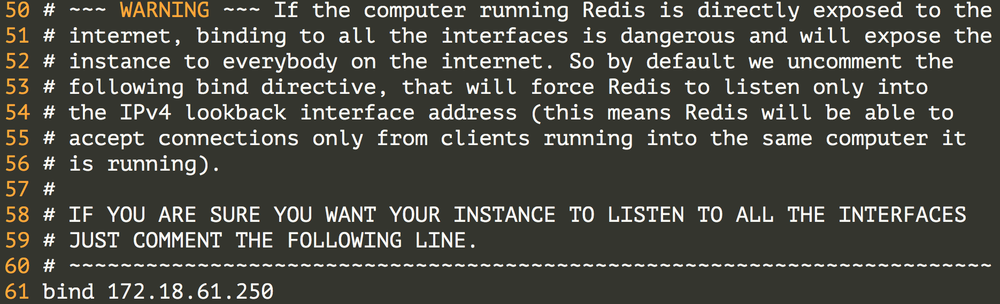
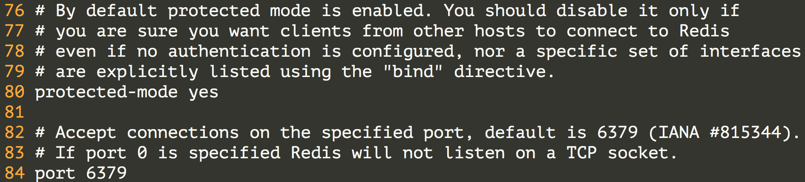
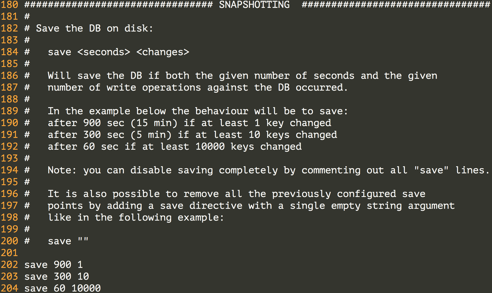
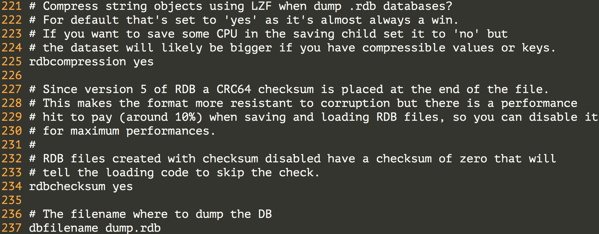
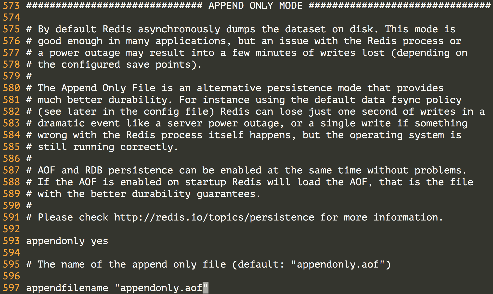
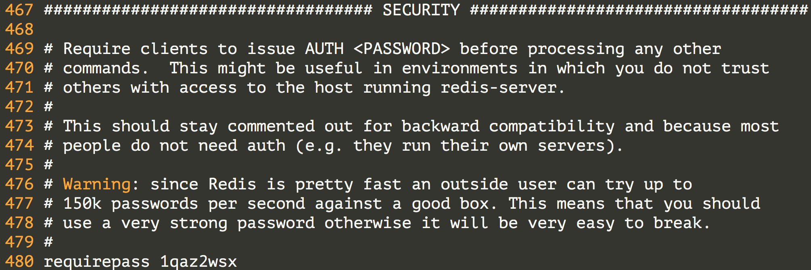
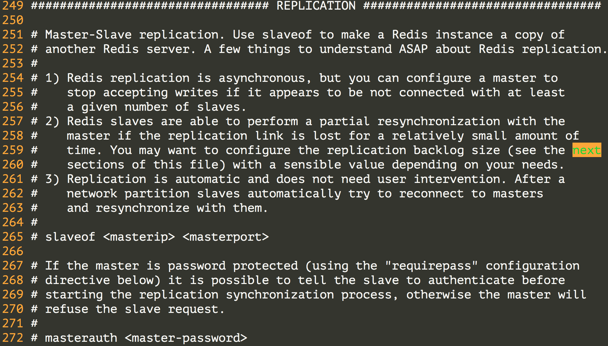
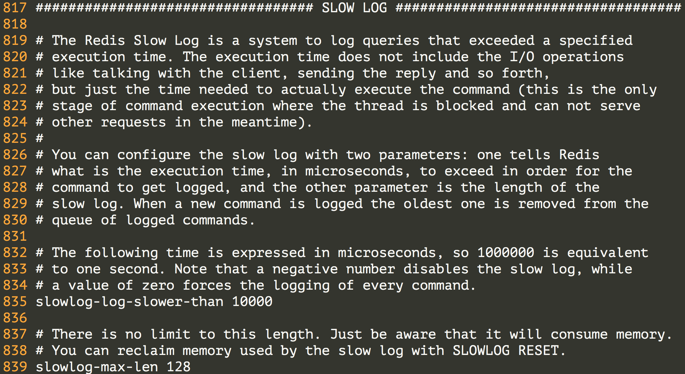

## 存储数据

### 数据缓存

通过前面章节的内容，我们已经知道了如何从指定的页面中抓取数据，以及如何保存抓取的结果，但是我们没有考虑过这么一种情况，就是我们可能需要从已经抓取过的页面中提取出更多的数据，重新去下载这些页面对于规模不大的网站倒是问题也不大，但是如果能够把这些页面缓存起来，对应用的性能会有明显的改善。

### 使用NoSQL

#### Redis简介

Redis是REmote DIctionary Server的缩写，它是一个用ANSI C编写的高性能的key-value存储系统，与其他的key-value存储系统相比，Redis有以下一些特点（也是优点）：

- Redis的读写性能极高，并且有丰富的特性（发布/订阅、事务、通知等）。
- Redis支持数据的持久化（RDB和AOF两种方式），可以将内存中的数据保存在磁盘中，重启的时候可以再次加载进行使用。
- Redis不仅仅支持简单的key-value类型的数据，同时还提供hash、list、set，zset、hyperloglog、geo等数据类型。
- Redis支持主从复制（实现读写分析）以及哨兵模式（监控master是否宕机并调整配置）。

#### Redis的安装和配置

可以使用Linux系统的包管理工具（如yum）来安装Redis，也可以通过在Redis的[官方网站](https://redis.io/)下载Redis的[源代码](http://download.redis.io/releases/redis-3.2.11.tar.gz)解压缩解归档之后进行构件安装。

```Shell

# wget http://download.redis.io/releases/redis-3.2.11.tar.gz
# gunzip redis-3.2.11.tar.gz
# tar -xvf redis-3.2.11.tar
# cd redis-3.2.11
# make && make install
```

接下来我们将redis-3.2.11目录下的redis.conf配置文件复制到用户主目录下并修改配置文件（如果你对配置文件不是很有把握就不要直接修改而是先复制一份再修改这个副本）。

```Shell

# cd ..
# cp redis-3.2.11/redis.conf redis.conf
# vim redis.conf
```

配置将Redis服务绑定到指定的IP地址和端口。





配置底层有多少个数据库。


配置Redis的持久化机制 - RDB。





配置Redis的持久化机制 - AOF。



配置访问Redis服务器的验证口令。



配置Redis的主从复制，通过主从复制可以实现读写分离。



配置慢查询日志。



这样我们就完成了Redis的基本配置，如果对上面的东西感到困惑，可以先系统的了解一下Redis，[《Redis开发与运维》](https://item.jd.com/12121730.html)是一本不错的入门读物，而[《Redis实战》](https://item.jd.com/11791607.html)是不错的进阶读物。

#### Redis的服务器和客户端

接下来启动Redis服务器，可以将服务器放在后台去运行。

```Shell

# redis-server redis.conf &

           _.-``__ ''-._
      _.-``    `.  `_.  ''-._           Redis 3.2.11 (00000000/0) 64 bit
  .-`` .-```.  ```\/    _.,_ ''-._
 (    '      ,       .-`  | `,    )     Running in standalone mode
 |`-._`-...-` __...-.``-._|'` _.-'|     Port: 6379
 |    `-._   `._    /     _.-'    |     PID: 12345
  `-._    `-._  `-./  _.-'    _.-'
 |`-._`-._    `-.__.-'    _.-'_.-'|
 |    `-._`-._        _.-'_.-'    |           http://redis.io
  `-._    `-._`-.__.-'_.-'    _.-'
 |`-._`-._    `-.__.-'    _.-'_.-'|
 |    `-._`-._        _.-'_.-'    |
  `-._    `-._`-.__.-'_.-'    _.-'
      `-._    `-.__.-'    _.-'
          `-._        _.-'
              `-.__.-'
```

接下来，我们尝试用Redis客户端去连接服务器。

```Shell

# redis-cli -h 172.18.61.250 -p 6379
172.18.61.250:6379> auth 1qaz2wsx
OK
172.18.61.250:6379> ping
PONG
172.18.61.250:6379>
```

Redis有着非常丰富的数据类型，也有很多的命令来操作这些数据，具体的内容可以查看[Redis命令参考](http://redisdoc.com/)，在这个网站上，除了Redis的命令参考，还有Redis的详细文档，其中包括了通知、事务、主从复制、持久化、哨兵、集群等内容。

```Shell

172.18.61.250:6379> set username admin
OK
172.18.61.250:6379> get username
"admin"
172.18.61.250:6379> hset student1 name hao
(integer) 0
172.18.61.250:6379> hset student1 age 38
(integer) 1
172.18.61.250:6379> hset student1 gender male
(integer) 1
172.18.61.250:6379> hgetall student1
1) "name"
2) "hao"
3) "age"
4) "38"
5) "gender"
6) "male"
172.18.61.250:6379> lpush num 1 2 3 4 5
(integer) 5
172.18.61.250:6379> lrange num 0 -1
1) "5"
2) "4"
3) "3"
4) "2"
5) "1"
172.18.61.250:6379> sadd fruits apple banana orange apple grape grape
(integer) 4
172.18.61.250:6379> scard fruits
(integer) 4
172.18.61.250:6379> smembers fruits
1) "grape"
2) "orange"
3) "banana"
4) "apple"
172.18.61.250:6379> zadd scores 90 zhao 78 qian 66 sun 95 lee
(integer) 4
172.18.61.250:6379> zrange scores 0 -1
1) "sun"
2) "qian"
3) "zhao"
4) "lee"
172.18.61.250:6379> zrevrange scores 0 -1
1) "lee"
2) "zhao"
3) "qian"
4) "sun"
```

#### 在Python程序中使用Redis

可以使用pip安装redis模块。redis模块的核心是名为Redis的类，该类的对象代表一个Redis客户端，通过该客户端可以向Redis服务器发送命令并获取执行的结果。上面我们在Redis客户端中使用的命令基本上就是Redis对象可以接收的消息，所以如果了解了Redis的命令就可以在Python中玩转Redis。

```Shell

$ pip3 install redis
$ python3
```

```Python

>>> import redis
>>> client = redis.Redis(host='1.2.3.4', port=6379, password='1qaz2wsx')
>>> client.set('username', 'admin')
True
>>> client.hset('student', 'name', 'hao')
1
>>> client.hset('student', 'age', 38)
1
>>> client.keys('*')
[b'username', b'student']
>>> client.get('username')
b'admin'
>>> client.hgetall('student')
{b'name': b'hao', b'age': b'38'}
```

#### MongoDB简介

MongoDB是2009年问世的一个面向文档的数据库管理系统，由C++语言编写，旨在为Web应用提供可扩展的高性能数据存储解决方案。虽然在划分类别的时候后，MongoDB被认为是NoSQL的产品，但是它更像一个介于关系数据库和非关系数据库之间的产品，在非关系数据库中它功能最丰富，最像关系数据库。

MongoDB将数据存储为一个文档，一个文档由一系列的“键值对”组成，其文档类似于JSON对象。目前，MongoDB已经提供了对Windows、MacOS、Linux、Solaris等多个平台的支持，而且也提供了多种开发语言的驱动程序，Python当然是其中之一。

#### MongoDB的安装和配置


#### 使用MongoDB实现CRUD操作


### 实例 - 缓存知乎发现上的链接和页面代码

```Python

from hashlib import sha1
from urllib.parse import urljoin

import pickle
import re
import requests
import zlib

from bs4 import BeautifulSoup
from redis import Redis


def main():
    # 指定种子页面
    base_url = 'https://www.zhihu.com/'
    seed_url = urljoin(base_url, 'explore')
    # 创建Redis客户端
    client = Redis(host='1.2.3.4', port=6379, password='1qaz2wsx')
    # 设置用户代理(否则访问会被拒绝)
    headers = {'user-agent': 'Baiduspider'}
    # 通过requests模块发送GET请求并指定用户代理
    resp = requests.get(seed_url, headers=headers)
    # 创建BeautifulSoup对象并指定使用lxml作为解析器
    soup = BeautifulSoup(resp.text, 'lxml')
    href_regex = re.compile(r'^/question')
    # 将URL处理成SHA1摘要(长度固定更简短)
    hasher_proto = sha1()
    # 查找所有href属性以/question打头的a标签
    for a_tag in soup.find_all('a', {'href': href_regex}):
        # 获取a标签的href属性值并组装完整的URL
        href = a_tag.attrs['href']
        full_url = urljoin(base_url, href)
        # 传入URL生成SHA1摘要
        hasher = hasher_proto.copy()
        hasher.update(full_url.encode('utf-8'))
        field_key = hasher.hexdigest()
        # 如果Redis的键'zhihu'对应的hash数据类型中没有URL的摘要就访问页面并缓存
        if not client.hexists('zhihu', field_key):
            html_page = requests.get(full_url, headers=headers).text
            # 对页面进行序列化和压缩操作
            zipped_page = zlib.compress(pickle.dumps(html_page))
            # 使用hash数据类型保存URL摘要及其对应的页面代码
            client.hset('zhihu', field_key, zipped_page)
    # 显示总共缓存了多少个页面
    print('Total %d question pages found.' % client.hlen('zhihu'))


if __name__ == '__main__':
    main()

```


