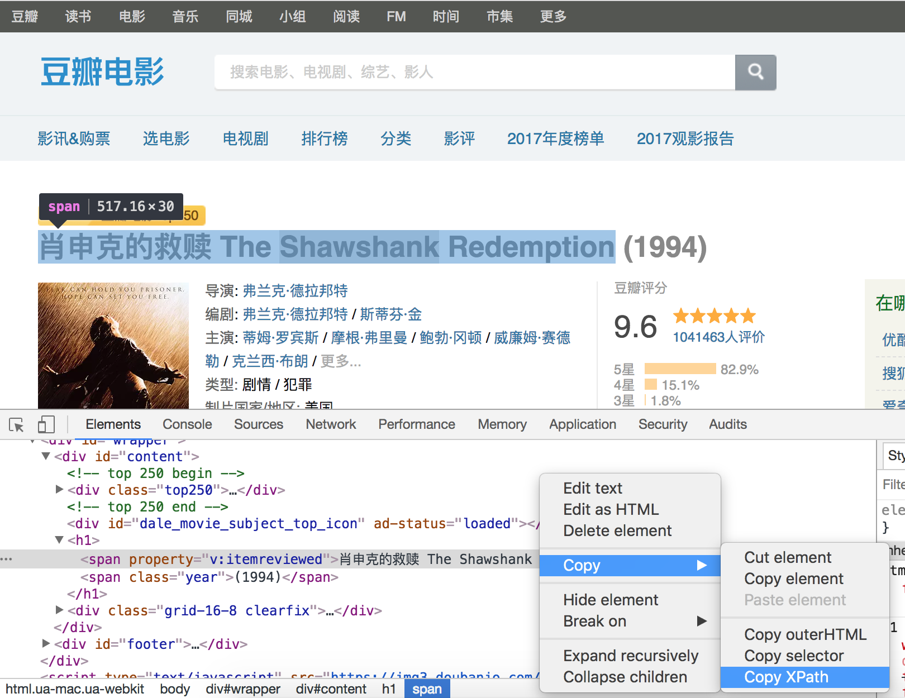

## 数据采集和解析

通过上一个章节的讲解，我们已经了解到了开发一个爬虫需要做的工作以及一些常见的问题，下面我们给出一个爬虫开发相关技术的清单以及这些技术涉及到的标准库和第三方库，稍后我们会一一介绍这些内容。

1. 下载数据 - **urllib** / **requests** / **aiohttp**。
2. 解析数据 - **re** / **lxml** / **beautifulsoup4** / **pyquery**。
3. 缓存和持久化 - **pymysql** / **sqlalchemy** / **peewee**/ **redis** / **pymongo**。
4. 生成数字签名 - **hashlib**。
5. 序列化和压缩 - **pickle** / **json** / **zlib**。
6. 调度器 - 多进程（**multiprocessing**） / 多线程（**threading**）。

### HTML页面

```HTML
<!DOCTYPE html>
<html>
	<head>
		<title>Home</title>
		<style type="text/css">
			/* 此处省略层叠样式表代码 */
		</style>
	</head>
	<body>
		<div class="wrapper">
			<header>
				<h1>Yoko's Kitchen</h1>
				<nav>
					<ul>
						<li><a href="" class="current">Home</a></li>
						<li><a href="">Classes</a></li>
						<li><a href="">Catering</a></li>
						<li><a href="">About</a></li>
						<li><a href="">Contact</a></li>
					</ul>
				</nav>
			</header>
			<section class="courses">
				<article>
					<figure>
						
						<figcaption>Bok Choi</figcaption>
					</figure>
					<hgroup>
						<h2>Japanese Vegetarian</h2>
						<h3>Five week course in London</h3>
					</hgroup>
					<p>A five week introduction to traditional Japanese vegetarian meals, teaching you a selection of rice and noodle dishes.</p>
				</article>    
				<article>
					<figure>
						
						<figcaption>Teriyaki Sauce</figcaption>
					</figure>
					<hgroup>
						<h2>Sauces Masterclass</h2>
						<h3>One day workshop</h3>
					</hgroup>
					<p>An intensive one-day course looking at how to create the most delicious sauces for use in a range of Japanese cookery.</p>
				</article>    
			</section>
			<aside>
				<section class="popular-recipes">
					<h2>Popular Recipes</h2>
					<a href="">Yakitori (grilled chicken)</a>
					<a href="">Tsukune (minced chicken patties)</a>
					<a href="">Okonomiyaki (savory pancakes)</a>
					<a href="">Mizutaki (chicken stew)</a>
				</section>
				<section class="contact-details">
					<h2>Contact</h2>
					<p>Yoko's Kitchen<br>
						27 Redchurch Street<br>
						Shoreditch<br>
						London E2 7DP</p>
				</section>
			</aside>
			<footer>
				&copy; 2011 Yoko's Kitchen
			</footer>
		</div>
        <script>
        	// 此处省略JavaScript代码
        </script>
	</body>
</html>
```

如果你对上面的代码并不感到陌生，那么你一定知道HTML页面通常由三部分构成，分别是用来承载内容的Tag（标签）、负责渲染页面的CSS（层叠样式表）以及控制交互式行为的JavaScript。通常，我们可以在浏览器的右键菜单中通过“查看网页源代码”的方式获取网页的代码并了解页面的结构；当然，我们也可以通过浏览器提供的开发人员工具来了解更多的信息。

#### 使用requests获取页面

1. GET请求和POST请求。

   ```Python
   
   ```

2. URL参数和请求头。

   ```Python
   
   ```

3. 复杂的POST请求（文件上传）。

   ```Python
   
   ```

4. 操作Cookie。

   ```Python
   
   ```

5. 设置代理服务器。

   ```Python
   
   ```

> 说明：关于requests的详细用法可以参考它的[官方文档](http://docs.python-requests.org/zh_CN/latest/user/quickstart.html)。

### 页面解析

#### 几种解析方式的比较

| 解析方式       | 对应的模块    | 速度   | 使用难度 | 备注                                        |
| -------------- | ------------- | ------ | -------- | ------------------------------------------- |
| 正则表达式解析 | re            | 快     | 困难     | 常用正则表达式<br/>在线正则表达式测试       |
| XPath解析      | lxml          | 快     | 一般     | 需要安装C语言依赖库<br/>唯一支持XML的解析器 |
| CSS选择器解析  | bs4 / pyquery | 不确定 | 简单     |                                             |

> 说明：BeautifulSoup可选的解析器包括：Python标准库（html.parser）、lxml的HTML解析器、lxml的XML解析器和html5lib。

#### 使用正则表达式解析页面

如果你对正则表达式没有任何的概念，那么推荐先阅读[《正则表达式30分钟入门教程》]()，然后再阅读我们之前讲解在Python中如何使用正则表达式一文。


#### XPath解析和lxml

XPath是在XML文档中查找信息的一种语法，它使用路径表达式来选取XML文档中的节点或者节点集。这里所说的XPath节点包括元素、属性、文本、命名空间、处理指令、注释、根节点等。

```XML
<?xml version="1.0" encoding="UTF-8"?>
<bookstore>
    <book>
      <title lang="eng">Harry Potter</title>
      <price>29.99</price>
    </book>
    <book>
      <title lang="eng">Learning XML</title>
      <price>39.95</price>
    </book>
</bookstore>
```
对于上面的XML文件，我们可以用如下所示的XPath语法获取文档中的节点。

| 路径表达式      | 结果                                                         |
| --------------- | ------------------------------------------------------------ |
| bookstore       | 选取 bookstore 元素的所有子节点。                            |
| /bookstore      | 选取根元素 bookstore。注释：假如路径起始于正斜杠( / )，则此路径始终代表到某元素的绝对路径！ |
| bookstore/book  | 选取属于 bookstore 的子元素的所有 book 元素。                |
| //book          | 选取所有 book 子元素，而不管它们在文档中的位置。             |
| bookstore//book | 选择属于 bookstore 元素的后代的所有 book 元素，而不管它们位于 bookstore 之下的什么位置。 |
| //@lang         | 选取名为 lang 的所有属性。                                   |

在使用XPath语法时，还可以使用XPath中的谓词。

| 路径表达式                         | 结果                                                         |
| ---------------------------------- | ------------------------------------------------------------ |
| /bookstore/book[1]                 | 选取属于 bookstore 子元素的第一个 book 元素。                |
| /bookstore/book[last()]            | 选取属于 bookstore 子元素的最后一个 book 元素。              |
| /bookstore/book[last()-1]          | 选取属于 bookstore 子元素的倒数第二个 book 元素。            |
| /bookstore/book[position()<3]      | 选取最前面的两个属于 bookstore 元素的子元素的 book 元素。    |
| //title[@lang]                     | 选取所有拥有名为 lang 的属性的 title 元素。                  |
| //title[@lang='eng']               | 选取所有 title 元素，且这些元素拥有值为 eng 的 lang 属性。   |
| /bookstore/book[price>35.00]       | 选取 bookstore 元素的所有 book 元素，且其中的 price 元素的值须大于 35.00。 |
| /bookstore/book[price>35.00]/title | 选取 bookstore 元素中的 book 元素的所有 title 元素，且其中的 price 元素的值须大于 35.00。 |

XPath还支持通配符用法，如下所示。

| 路径表达式   | 结果                              |
| ------------ | --------------------------------- |
| /bookstore/* | 选取 bookstore 元素的所有子元素。 |
| //*          | 选取文档中的所有元素。            |
| //title[@*]  | 选取所有带有属性的 title 元素。   |

如果要选取多个节点，可以使用如下所示的方法。

| 路径表达式                       | 结果                                                         |
| -------------------------------- | ------------------------------------------------------------ |
| //book/title \| //book/price     | 选取 book 元素的所有 title 和 price 元素。                   |
| //title \| //price               | 选取文档中的所有 title 和 price 元素。                       |
| /bookstore/book/title \| //price | 选取属于 bookstore 元素的 book 元素的所有 title 元素，以及文档中所有的 price 元素。 |

> 说明：上面的例子来自于菜鸟教程网站上[XPath教程](<https://www.runoob.com/xpath/xpath-tutorial.html>)，有兴趣的读者可以自行阅读原文。

当然，如果不理解或者不太熟悉XPath语法，可以在Chrome浏览器中按照如下所示的方法查看元素的XPath语法。




### BeautifulSoup的使用

BeautifulSoup是一个可以从HTML或XML文件中提取数据的Python库。它能够通过你喜欢的转换器实现惯用的文档导航、查找、修改文档的方式。

1. 遍历文档树
   - 获取标签
   - 获取标签属性
   - 获取标签内容
   - 获取子（孙）节点
   - 获取父节点/祖先节点
   - 获取兄弟节点
2. 搜索树节点
   - find / find_all
   - select_one / select

> 说明：更多内容可以参考BeautifulSoup的[官方文档](https://www.crummy.com/software/BeautifulSoup/bs4/doc/index.zh.html)。

### PyQuery的使用

pyquery相当于jQuery的Python实现，可以用于解析HTML网页。

### 实例 - 获取知乎发现上的问题链接

```Python
from urllib.parse import urljoin

import re
import requests

from bs4 import BeautifulSoup


def main():
    headers = {'user-agent': 'Baiduspider'}
    proxies = {
        'http': 'http://122.114.31.177:808'
    }
    base_url = 'https://www.zhihu.com/'
    seed_url = urljoin(base_url, 'explore')
    resp = requests.get(seed_url,
                        headers=headers,
                        proxies=proxies)
    soup = BeautifulSoup(resp.text, 'lxml')
    href_regex = re.compile(r'^/question')
    link_set = set()
    for a_tag in soup.find_all('a', {'href': href_regex}):
        if 'href' in a_tag.attrs:
            href = a_tag.attrs['href']
            full_url = urljoin(base_url, href)
            link_set.add(full_url)
    print('Total %d question pages found.' % len(link_set))


if __name__ == '__main__':
    main()
```

