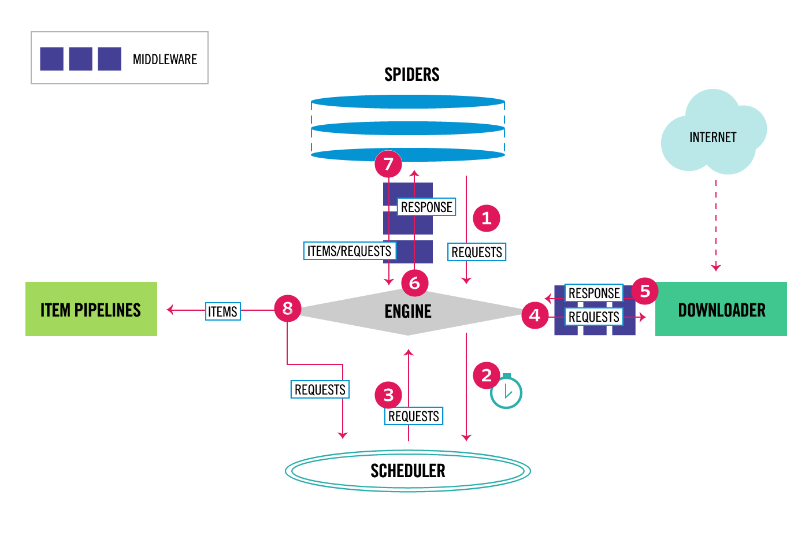

## Scrapy爬虫框架入门

### Scrapy概述

Scrapy是Python开发的一个非常流行的网络爬虫框架，可以用来抓取Web站点并从页面中提取结构化的数据，被广泛的用于数据挖掘、数据监测和自动化测试等领域。下图展示了Scrapy的基本架构，其中包含了主要组件和系统的数据处理流程（图中带数字的红色箭头）。



#### 组件

1. Scrapy引擎（Engine）：Scrapy引擎是用来控制整个系统的数据处理流程。
2. 调度器（Scheduler）：调度器从Scrapy引擎接受请求并排序列入队列，并在Scrapy引擎发出请求后返还给它们。
3. 下载器（Downloader）：下载器的主要职责是抓取网页并将网页内容返还给蜘蛛（Spiders）。
4. 蜘蛛（Spiders）：蜘蛛是有Scrapy用户自定义的用来解析网页并抓取特定URL返回的内容的类，每个蜘蛛都能处理一个域名或一组域名，简单的说就是用来定义特定网站的抓取和解析规则。
5. 条目管道（Item Pipeline）：条目管道的主要责任是负责处理有蜘蛛从网页中抽取的数据条目，它的主要任务是清理、验证和存储数据。当页面被蜘蛛解析后，将被发送到条目管道，并经过几个特定的次序处理数据。每个条目管道组件都是一个Python类，它们获取了数据条目并执行对数据条目进行处理的方法，同时还需要确定是否需要在条目管道中继续执行下一步或是直接丢弃掉不处理。条目管道通常执行的任务有：清理HTML数据、验证解析到的数据（检查条目是否包含必要的字段）、检查是不是重复数据（如果重复就丢弃）、将解析到的数据存储到数据库（关系型数据库或NoSQL数据库）中。
6. 中间件（Middlewares）：中间件是介于Scrapy引擎和其他组件之间的一个钩子框架，主要是为了提供自定义的代码来拓展Scrapy的功能，包括下载器中间件和蜘蛛中间件。

#### 数据处理流程

Scrapy的整个数据处理流程由Scrapy引擎进行控制，通常的运转流程包括以下的步骤：

1. 引擎询问蜘蛛需要处理哪个网站，并让蜘蛛将第一个需要处理的URL交给它。

2. 引擎让调度器将需要处理的URL放在队列中。

3. 引擎从调度那获取接下来进行爬取的页面。

4. 调度将下一个爬取的URL返回给引擎，引擎将它通过下载中间件发送到下载器。

5. 当网页被下载器下载完成以后，响应内容通过下载中间件被发送到引擎；如果下载失败了，引擎会通知调度器记录这个URL，待会再重新下载。

6. 引擎收到下载器的响应并将它通过蜘蛛中间件发送到蜘蛛进行处理。

7. 蜘蛛处理响应并返回爬取到的数据条目，此外还要将需要跟进的新的URL发送给引擎。

8. 引擎将抓取到的数据条目送入条目管道，把新的URL发送给调度器放入队列中。

上述操作中的2-8步会一直重复直到调度器中没有需要请求的URL，爬虫停止工作。

### 安装和使用Scrapy

可以先创建虚拟环境并在虚拟环境下使用pip安装scrapy。

```Shell

```

项目的目录结构如下图所示。

```Shell
(venv) $ tree
.
|____ scrapy.cfg
|____ douban
| |____ spiders
| | |____ __init__.py
| | |____ __pycache__
| |____ __init__.py
| |____ __pycache__
| |____ middlewares.py
| |____ settings.py
| |____ items.py
| |____ pipelines.py
```

> 说明：Windows系统的命令行提示符下有tree命令，但是Linux和MacOS的终端是没有tree命令的，可以用下面给出的命令来定义tree命令，其实是对find命令进行了定制并别名为tree。 
>
> `alias tree="find . -print | sed -e 's;[^/]*/;|____;g;s;____|; |;g'"`
>
> Linux系统也可以通过yum或其他的包管理工具来安装tree。
>
> `yum install tree`

根据刚才描述的数据处理流程，基本上需要我们做的有以下几件事情：

1. 在items.py文件中定义字段，这些字段用来保存数据，方便后续的操作。

   ```Python
   # -*- coding: utf-8 -*-
   
   # Define here the models for your scraped items
   #
   # See documentation in:
   # https://doc.scrapy.org/en/latest/topics/items.html
   
   import scrapy
   
   
   class DoubanItem(scrapy.Item):
   
       name = scrapy.Field()
       year = scrapy.Field()
       score = scrapy.Field()
       director = scrapy.Field()
       classification = scrapy.Field()
       actor = scrapy.Field()
   ```

2. 在spiders文件夹中编写自己的爬虫。

   ```Shell
   (venv) $ scrapy genspider movie movie.douban.com --template=crawl
   ```

   ```Python
   # -*- coding: utf-8 -*-
   import scrapy
   from scrapy.selector import Selector
   from scrapy.linkextractors import LinkExtractor
   from scrapy.spiders import CrawlSpider, Rule
   
   from douban.items import DoubanItem
   
   
   class MovieSpider(CrawlSpider):
       name = 'movie'
       allowed_domains = ['movie.douban.com']
       start_urls = ['https://movie.douban.com/top250']
       rules = (
           Rule(LinkExtractor(allow=(r'https://movie.douban.com/top250\?start=\d+.*'))),
           Rule(LinkExtractor(allow=(r'https://movie.douban.com/subject/\d+')), callback='parse_item'),
       )
   
       def parse_item(self, response):
           sel = Selector(response)
           item = DoubanItem()
           item['name']=sel.xpath('//*[@id="content"]/h1/span[1]/text()').extract()
           item['year']=sel.xpath('//*[@id="content"]/h1/span[2]/text()').re(r'\((\d+)\)')
           item['score']=sel.xpath('//*[@id="interest_sectl"]/div/p[1]/strong/text()').extract()
           item['director']=sel.xpath('//*[@id="info"]/span[1]/a/text()').extract()
           item['classification']= sel.xpath('//span[@property="v:genre"]/text()').extract()
           item['actor']= sel.xpath('//*[@id="info"]/span[3]/a[1]/text()').extract()
           return item
   ```
   > 说明：上面我们通过Scrapy提供的爬虫模板创建了Spider，其中的rules中的LinkExtractor对象会自动完成对新的链接的解析，该对象中有一个名为extract_link的回调方法。Scrapy支持用XPath语法和CSS选择器进行数据解析，对应的方法分别是xpath和css，上面我们使用了XPath语法对页面进行解析，如果不熟悉XPath语法可以看看后面的补充说明。

   到这里，我们已经可以通过下面的命令让爬虫运转起来。

   ```Shell
   (venv)$ scrapy crawl movie
   ```

   可以在控制台看到爬取到的数据，如果想将这些数据保存到文件中，可以通过`-o`参数来指定文件名，Scrapy支持我们将爬取到的数据导出成JSON、CSV、XML、pickle、marshal等格式。

   ```Shell
   (venv)$ scrapy crawl moive -o result.json
   ```

3. 在pipelines.py中完成对数据进行持久化的操作。

   ```Python
   # -*- coding: utf-8 -*-
   
   # Define your item pipelines here
   #
   # Don't forget to add your pipeline to the ITEM_PIPELINES setting
   # See: https://doc.scrapy.org/en/latest/topics/item-pipeline.html
   import pymongo
   
   from scrapy.exceptions import DropItem
   from scrapy.conf import settings
   from scrapy import log
   
   
   class DoubanPipeline(object):
   
       def __init__(self):
           connection = pymongo.MongoClient(settings['MONGODB_SERVER'], settings['MONGODB_PORT'])
           db = connection[settings['MONGODB_DB']]
           self.collection = db[settings['MONGODB_COLLECTION']]
   
       def process_item(self, item, spider):
           #Remove invalid data
           valid = True
           for data in item:
             if not data:
               valid = False
               raise DropItem("Missing %s of blogpost from %s" %(data, item['url']))
           if valid:
           #Insert data into database
               new_moive=[{
                   "name":item['name'][0],
                   "year":item['year'][0],
                   "score":item['score'],
                   "director":item['director'],
                   "classification":item['classification'],
                   "actor":item['actor']
               }]
               self.collection.insert(new_moive)
               log.msg("Item wrote to MongoDB database %s/%s" %
               (settings['MONGODB_DB'], settings['MONGODB_COLLECTION']),
               level=log.DEBUG, spider=spider) 
           return item
   
   ```
   利用Pipeline我们可以完成以下操作：

   - 清理HTML数据，验证爬取的数据。
   - 丢弃重复的不必要的内容。
   - 将爬取的结果进行持久化操作。

4. 修改settings.py文件对项目进行配置。

   ```Python
   # -*- coding: utf-8 -*-
   
   # Scrapy settings for douban project
   #
   # For simplicity, this file contains only settings considered important or
   # commonly used. You can find more settings consulting the documentation:
   #
   #     https://doc.scrapy.org/en/latest/topics/settings.html
   #     https://doc.scrapy.org/en/latest/topics/downloader-middleware.html
   #     https://doc.scrapy.org/en/latest/topics/spider-middleware.html
   
   BOT_NAME = 'douban'
   
   SPIDER_MODULES = ['douban.spiders']
   NEWSPIDER_MODULE = 'douban.spiders'
   
   
   # Crawl responsibly by identifying yourself (and your website) on the user-agent
   USER_AGENT = 'Mozilla/5.0 (Macintosh; Intel Mac OS X 10_8_3) AppleWebKit/536.5 (KHTML, like Gecko) Chrome/19.0.1084.54 Safari/536.5'
   
   # Obey robots.txt rules
   ROBOTSTXT_OBEY = True
   
   # Configure maximum concurrent requests performed by Scrapy (default: 16)
   # CONCURRENT_REQUESTS = 32
   
   # Configure a delay for requests for the same website (default: 0)
   # See https://doc.scrapy.org/en/latest/topics/settings.html#download-delay
   # See also autothrottle settings and docs
   DOWNLOAD_DELAY = 3
   RANDOMIZE_DOWNLOAD_DELAY = True
   # The download delay setting will honor only one of:
   # CONCURRENT_REQUESTS_PER_DOMAIN = 16
   # CONCURRENT_REQUESTS_PER_IP = 16
   
   # Disable cookies (enabled by default)
   COOKIES_ENABLED = True
   
   MONGODB_SERVER = '120.77.222.217'
   MONGODB_PORT = 27017
   MONGODB_DB = 'douban'
   MONGODB_COLLECTION = 'movie'
   
   # Disable Telnet Console (enabled by default)
   # TELNETCONSOLE_ENABLED = False
   
   # Override the default request headers:
   # DEFAULT_REQUEST_HEADERS = {
   #   'Accept': 'text/html,application/xhtml+xml,application/xml;q=0.9,*/*;q=0.8',
   #   'Accept-Language': 'en',
   # }
   
   # Enable or disable spider middlewares
   # See https://doc.scrapy.org/en/latest/topics/spider-middleware.html
   # SPIDER_MIDDLEWARES = {
   #    'douban.middlewares.DoubanSpiderMiddleware': 543,
   # }
   
   # Enable or disable downloader middlewares
   # See https://doc.scrapy.org/en/latest/topics/downloader-middleware.html
   # DOWNLOADER_MIDDLEWARES = {
   #    'douban.middlewares.DoubanDownloaderMiddleware': 543,
   # }
   
   # Enable or disable extensions
   # See https://doc.scrapy.org/en/latest/topics/extensions.html
   # EXTENSIONS = {
   #    'scrapy.extensions.telnet.TelnetConsole': None,
   # }
   
   # Configure item pipelines
   # See https://doc.scrapy.org/en/latest/topics/item-pipeline.html
   ITEM_PIPELINES = {
       'douban.pipelines.DoubanPipeline': 400,
   }
   
   LOG_LEVEL = 'DEBUG'
   
   # Enable and configure the AutoThrottle extension (disabled by default)
   # See https://doc.scrapy.org/en/latest/topics/autothrottle.html
   #AUTOTHROTTLE_ENABLED = True
   # The initial download delay
   #AUTOTHROTTLE_START_DELAY = 5
   # The maximum download delay to be set in case of high latencies
   #AUTOTHROTTLE_MAX_DELAY = 60
   # The average number of requests Scrapy should be sending in parallel to
   # each remote server
   #AUTOTHROTTLE_TARGET_CONCURRENCY = 1.0
   # Enable showing throttling stats for every response received:
   #AUTOTHROTTLE_DEBUG = False
   
   # Enable and configure HTTP caching (disabled by default)
   # See https://doc.scrapy.org/en/latest/topics/downloader-middleware.html#httpcache-middleware-settings
   HTTPCACHE_ENABLED = True
   HTTPCACHE_EXPIRATION_SECS = 0
   HTTPCACHE_DIR = 'httpcache'
   HTTPCACHE_IGNORE_HTTP_CODES = []
   HTTPCACHE_STORAGE = 'scrapy.extensions.httpcache.FilesystemCacheStorage'
   ```

### 补充说明

#### XPath语法

1. XPath路径表达式：XPath使用路径表达式来选取XML文档中的节点或者节点集。

2. XPath节点：元素、属性、文本、命名空间、处理指令、注释、根节点。

3. XPath语法。（注：下面的例子来自于[菜鸟教程](http://www.runoob.com/)网站的[XPath教程](http://www.runoob.com/xpath/xpath-syntax.html)。)

   XML文件。

   ```XML
   <?xml version="1.0" encoding="UTF-8"?>
   
   <bookstore>
   
       <book>
         <title lang="eng">Harry Potter</title>
         <price>29.99</price>
       </book>
   
       <book>
         <title lang="eng">Learning XML</title>
         <price>39.95</price>
       </book>
   
   </bookstore>
   ```
   XPath语法。

   | 路径表达式      | 结果                                                         |
   | --------------- | ------------------------------------------------------------ |
   | bookstore       | 选取 bookstore 元素的所有子节点。                            |
   | /bookstore      | 选取根元素 bookstore。注释：假如路径起始于正斜杠( / )，则此路径始终代表到某元素的绝对路径！ |
   | bookstore/book  | 选取属于 bookstore 的子元素的所有 book 元素。                |
   | //book          | 选取所有 book 子元素，而不管它们在文档中的位置。             |
   | bookstore//book | 选择属于 bookstore 元素的后代的所有 book 元素，而不管它们位于 bookstore 之下的什么位置。 |
   | //@lang         | 选取名为 lang 的所有属性。                                   |

   XPath谓词。

   | 路径表达式                         | 结果                                                         |
   | ---------------------------------- | ------------------------------------------------------------ |
   | /bookstore/book[1]                 | 选取属于 bookstore 子元素的第一个 book 元素。                |
   | /bookstore/book[last()]            | 选取属于 bookstore 子元素的最后一个 book 元素。              |
   | /bookstore/book[last()-1]          | 选取属于 bookstore 子元素的倒数第二个 book 元素。            |
   | /bookstore/book[position()<3]      | 选取最前面的两个属于 bookstore 元素的子元素的 book 元素。    |
   | //title[@lang]                     | 选取所有拥有名为 lang 的属性的 title 元素。                  |
   | //title[@lang='eng']               | 选取所有 title 元素，且这些元素拥有值为 eng 的 lang 属性。   |
   | /bookstore/book[price>35.00]       | 选取 bookstore 元素的所有 book 元素，且其中的 price 元素的值须大于 35.00。 |
   | /bookstore/book[price>35.00]/title | 选取 bookstore 元素中的 book 元素的所有 title 元素，且其中的 price 元素的值须大于 35.00。 |

   通配符用法。

   | 路径表达式   | 结果                              |
   | ------------ | --------------------------------- |
   | /bookstore/* | 选取 bookstore 元素的所有子元素。 |
   | //*          | 选取文档中的所有元素。            |
   | //title[@*]  | 选取所有带有属性的 title 元素。   |

   选取多个路径。

   | 路径表达式                       | 结果                                                         |
   | -------------------------------- | ------------------------------------------------------------ |
   | //book/title \| //book/price     | 选取 book 元素的所有 title 和 price 元素。                   |
   | //title \| //price               | 选取文档中的所有 title 和 price 元素。                       |
   | /bookstore/book/title \| //price | 选取属于 bookstore 元素的 book 元素的所有 title 元素，以及文档中所有的 price 元素。 |

#### 在Chrome浏览器中查看元素XPath语法


