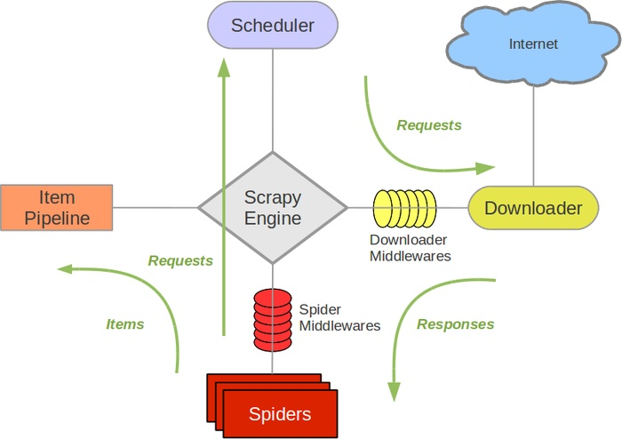

## Scrapy的应用(01)

### Scrapy概述

Scrapy是Python开发的一个非常流行的网络爬虫框架，可以用来抓取Web站点并从页面中提取结构化的数据，被广泛的用于数据挖掘、数据监测和自动化测试等领域。下图展示了Scrapy的基本架构，其中包含了主要组件和系统的数据处理流程（图中的绿色箭头）。



#### 组件

1. Scrapy引擎（Engine）：Scrapy引擎是用来控制整个系统的数据处理流程。
2. 调度器（Scheduler）：调度器从Scrapy引擎接受请求并排序列入队列，并在Scrapy引擎发出请求后返还给它们。
3. 下载器（Downloader）：下载器的主要职责是抓取网页并将网页内容返还给蜘蛛（Spiders）。
4. 蜘蛛（Spiders）：蜘蛛是有Scrapy用户自定义的用来解析网页并抓取特定URL返回的内容的类，每个蜘蛛都能处理一个域名或一组域名，简单的说就是用来定义特定网站的抓取和解析规则。
5. 条目管道（Item Pipeline）：条目管道的主要责任是负责处理有蜘蛛从网页中抽取的数据条目，它的主要任务是清理、验证和存储数据。当页面被蜘蛛解析后，将被发送到条目管道，并经过几个特定的次序处理数据。每个条目管道组件都是一个Python类，它们获取了数据条目并执行对数据条目进行处理的方法，同时还需要确定是否需要在条目管道中继续执行下一步或是直接丢弃掉不处理。条目管道通常执行的任务有：清理HTML数据、验证解析到的数据（检查条目是否包含必要的字段）、检查是不是重复数据（如果重复就丢弃）、将解析到的数据存储到数据库（关系型数据库或NoSQL数据库）中。
6. 中间件（Middlewares）：中间件是介于Scrapy引擎和其他组件之间的一个钩子框架，主要是为了提供自定义的代码来拓展Scrapy的功能，包括下载器中间件和蜘蛛中间件。

#### 数据处理流程

Scrapy的整个数据处理流程由Scrapy引擎进行控制，通常的运转流程包括以下的步骤：

1. 引擎询问蜘蛛需要处理哪个网站，并让蜘蛛将第一个需要处理的URL交给它。
2. 引擎让调度器将需要处理的URL放在队列中。
3. 引擎从调度那获取接下来进行爬取的页面。
4. 调度将下一个爬取的URL返回给引擎，引擎将它通过下载中间件发送到下载器。
5. 当网页被下载器下载完成以后，响应内容通过下载中间件被发送到引擎；如果下载失败了，引擎会通知调度器记录这个URL，待会再重新下载。
6. 引擎收到下载器的响应并将它通过蜘蛛中间件发送到蜘蛛进行处理。
7. 蜘蛛处理响应并返回爬取到的数据条目，此外还要将需要跟进的新的URL发送给引擎。
8. 引擎将抓取到的数据条目送入条目管道，把新的URL发送给调度器放入队列中。
9. 上述操作会一直重复直到调度器中没有需要请求的URL，爬虫停止工作。

### 安装和使用Scrapy

可以先创建虚拟环境并在虚拟环境下使用pip安装scrapy。

```Shell

$ 
```

项目的目录结构如下图所示。

```Shell

(venv) $ tree
.
|____ scrapy.cfg
|____ qianmu
| |____ spiders
| | |____ __init__.py
| | |____ __pycache__
| |____ __init__.py
| |____ __pycache__
| |____ middlewares.py
| |____ settings.py
| |____ items.py
| |____ pipelines.py
```

> 说明：Windows系统的命令行提示符下有tree命令，但是Linux和MacOS的终端是没有tree命令的，可以用下面给出的命令来定义tree命令，其实是对find命令进行了定制并别名为tree。 
>
> `alias tree="find . -print | sed -e 's;[^/]*/;|____;g;s;____|; |;g'"`
>
> Linux系统也可以通过yum或其他的包管理工具来安装tree。
>
> `yum install tree`

根据刚才描述的数据处理流程，基本上需要我们做的有以下几件事情：

1. 在items.py文件中定义字段，这些字段用来保存数据，方便后续的操作。
2. 在spiders文件夹中编写自己的爬虫。
3. 在pipelines.py中完成对数据进行持久化的操作。
4. 修改settings.py文件对项目进行配置。


