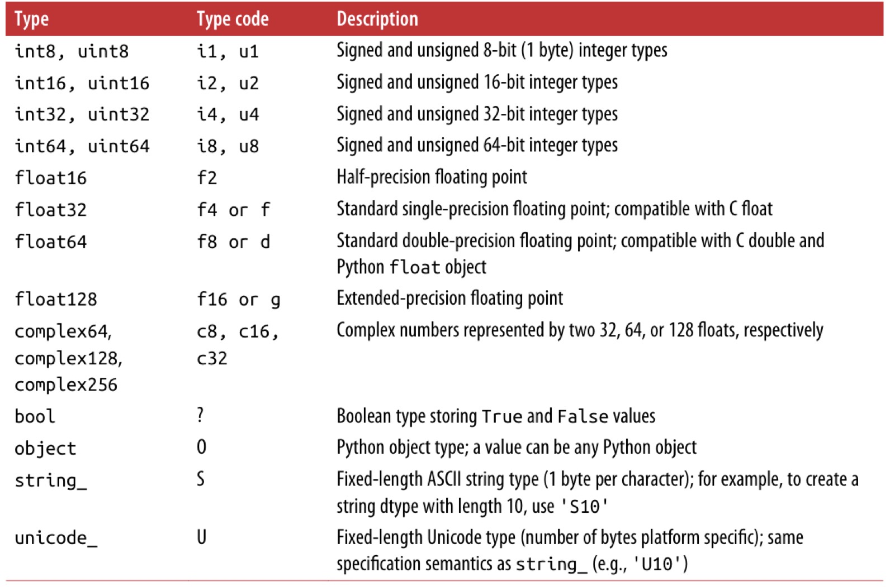
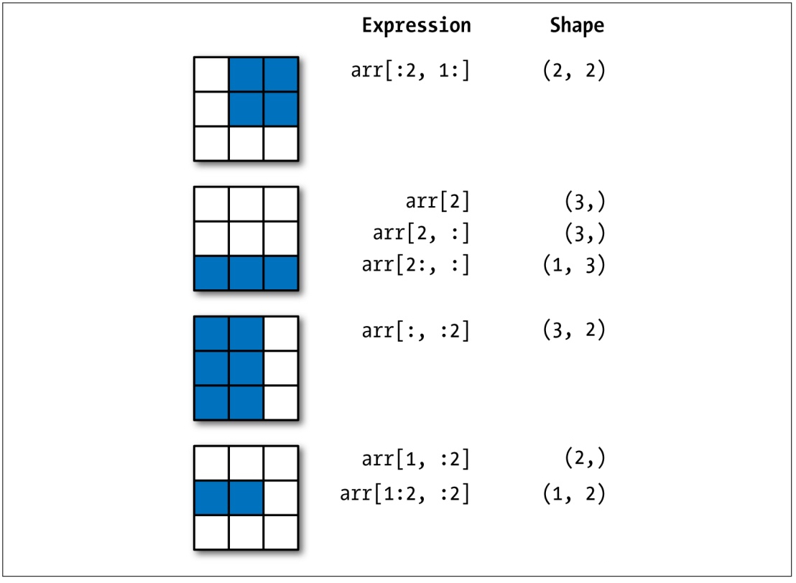
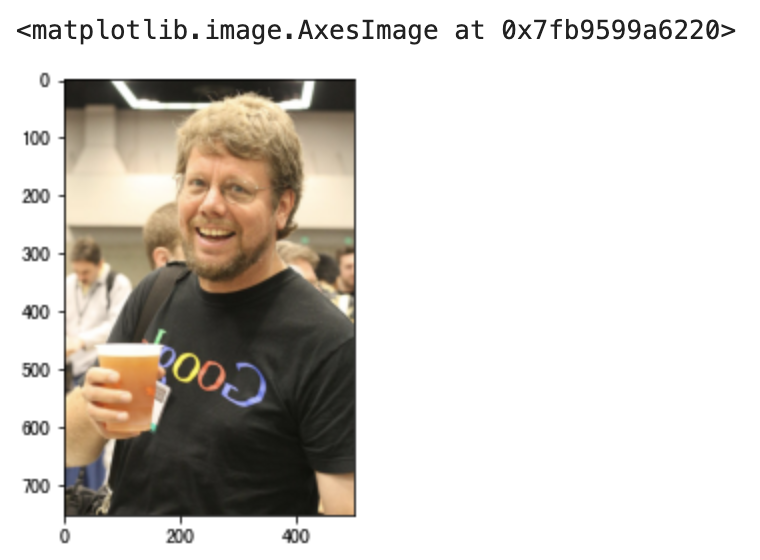
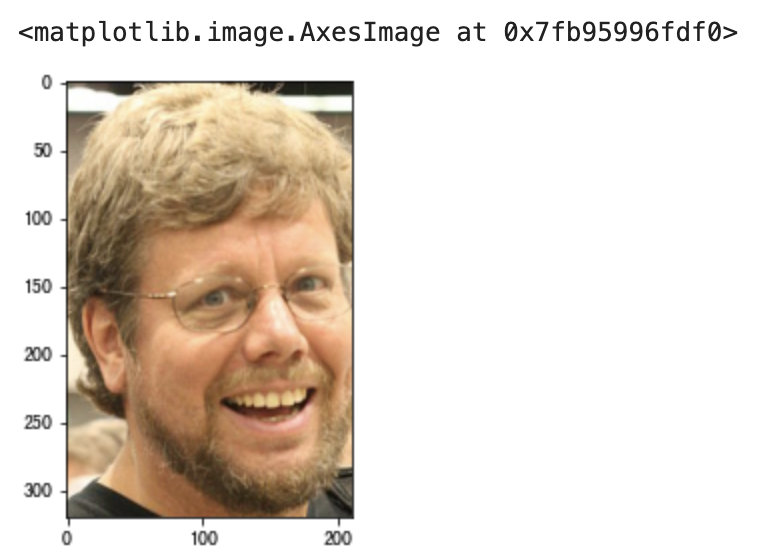

## NumPy的应用-1

Numpy 是一个开源的 Python 科学计算库，**用于快速处理任意维度的数组**。Numpy **支持常见的数组和矩阵操作**，对于同样的数值计算任务，使用 NumPy 不仅代码要简洁的多，而且 NumPy 在性能上也远远优于原生 Python，至少是一到两个数量级的差距，而且数据量越大，NumPy 的优势就越明显。

NumPy 最为核心的数据类型是`ndarray`，使用`ndarray`可以处理一维、二维和多维数组，该对象相当于是一个快速而灵活的大数据容器。NumPy 底层代码使用 C 语言编写，解决了 GIL 的限制，`ndarray`在存取数据的时候，数据与数据的地址都是连续的，这确保了可以进行高效率的批量操作，性能上远远优于 Python 中的`list`；另一方面`ndarray`对象提供了更多的方法来处理数据，尤其获取数据统计特征的方法，这些方法也是 Python 原生的`list`没有的。

 ### 准备工作

1. 启动 JupyterLab

    ```Bash
    jupyter lab
    ```

    > **提示**：在启动 JupyterLab 之前，建议先安装好数据分析相关依赖项，包括之前提到的三大神器以及相关依赖项。如果使用 Anaconda，则无需单独安装，可以通过 Anaconda 的 Navigator 来启动。

2. 导入

    ```Python
    import numpy as np
    import pandas as pd
    import matplotlib.pyplot as plt
    ```

    > **说明**：如果已经启动了 JupyterLab 但尚未安装相关依赖库，例如尚未安装`numpy`，可以在单元格中输入`%pip install numpy`并运行该单元格来安装 NumPy。当然，我们也可以在单元格中输入`%pip install numpy pandas matplotlib`把 Python 数据分析三个核心的三方库都安装上。注意上面的代码，我们不仅导入了 NumPy，还将 pandas 和 matplotlib 库一并导入了。

### 创建数组对象

创建`ndarray`对象有很多种方法，下面我们介绍一些常用的方法。

方法一：使用`array`函数，通过`list`创建数组对象

代码：

```Python
array1 = np.array([1, 2, 3, 4, 5])
array1
```

输出：

```
array([1, 2, 3, 4, 5])
```

代码：

```Python
array2 = np.array([[1, 2, 3], [4, 5, 6]])
array2
```

输出：

```
array([[1, 2, 3],
       [4, 5, 6]])
```

方法二：使用`arange`函数，指定取值范围和跨度创建数组对象

代码：

```Python
array3 = np.arange(0, 20, 2)
array3
```

输出：

```
array([ 0,  2,  4,  6,  8, 10, 12, 14, 16, 18])
```

方法三：使用`linspace`函数，用指定范围和元素个数创建数组对象，生成等差数列

代码：

```Python
array4 = np.linspace(-1, 1, 11)
array4
```

输出：

```
array([-1. , -0.8, -0.6, -0.4, -0.2,  0. ,  0.2,  0.4,  0.6,  0.8,  1. ])
```

方法四：使用`logspace`函数，生成等比数列

代码：

```python
array5 = np.logspace(1, 10, num=10, base=2)
array5
```

> **注意**：等比数列的起始值是$2^1$，等比数列的终止值是$2^{10}$，`num`是元素的个数，`base`就是底数。

输出：

```
array([   2.,    4.,    8.,   16.,   32.,   64.,  128.,  256.,  512., 1024.])
```

方法五：通过`fromstring`函数从字符串提取数据创建数组对象

代码：

```Python
array6 = np.fromstring('1, 2, 3, 4, 5', sep=',', dtype='i8')
array6 
```

输出：

```
array([1, 2, 3, 4, 5])
```

方法六：通过`fromiter`函数从生成器（迭代器）中获取数据创建数组对象

代码：

```Python
def fib(how_many):
    a, b = 0, 1
    for _ in range(how_many):
        a, b = b, a + b
        yield a


gen = fib(20)
array7 = np.fromiter(gen, dtype='i8')
array7
```

输出：

```
array([   1,    1,    2,    3,    5,    8,   13,   21,   34,   55,   89,
        144,  233,  377,  610,  987, 1597, 2584, 4181, 6765])
```

方法七：使用`numpy.random`模块的函数生成随机数创建数组对象

产生10个$[0, 1)$范围的随机小数，代码：

```Python
array8 = np.random.rand(10)
array8
```

输出：

```
array([0.45556132, 0.67871326, 0.4552213 , 0.96671509, 0.44086463,
       0.72650875, 0.79877188, 0.12153022, 0.24762739, 0.6669852 ])
```

产生10个$[1, 100)$范围的随机整数，代码：

```Python
array9 = np.random.randint(1, 100, 10)
array9
```

输出：

```
array([29, 97, 87, 47, 39, 19, 71, 32, 79, 34])
```

产生20个$\small{\mu=50}$，$\small{\sigma=10}$的正态分布随机数，代码：

```Python
array10 = np.random.normal(50, 10, 20)
array10
```

输出：

```
array([55.04155586, 46.43510797, 20.28371158, 62.67884053, 61.23185964,
       38.22682148, 53.17126151, 43.54741592, 36.11268017, 40.94086676,
       63.27911699, 46.92688903, 37.1593374 , 67.06525656, 67.47269463,
       23.37925889, 31.45312239, 48.34532466, 55.09180924, 47.95702787])
```

产生$[0, 1)$范围的随机小数构成的3行4列的二维数组，代码：

```Python
array11 = np.random.rand(3, 4)
array11
```

输出：

```
array([[0.54017809, 0.46797771, 0.78291445, 0.79501326],
       [0.93973783, 0.21434806, 0.03592874, 0.88838892],
       [0.84130479, 0.3566601 , 0.99935473, 0.26353598]])
```

产生$[1, 100)$范围的随机整数构成的三维数组，代码：

```Python
array12 = np.random.randint(1, 100, (3, 4, 5))
array12
```

输出：

```
array([[[94, 26, 49, 24, 43],
        [27, 27, 33, 98, 33],
        [13, 73,  6,  1, 77],
        [54, 32, 51, 86, 59]],

       [[62, 75, 62, 29, 87],
        [90, 26,  6, 79, 41],
        [31, 15, 32, 56, 64],
        [37, 84, 61, 71, 71]],

       [[45, 24, 78, 77, 41],
        [75, 37,  4, 74, 93],
        [ 1, 36, 36, 60, 43],
        [23, 84, 44, 89, 79]]])
```

方法八：创建全0、全1或指定元素的数组

使用`zeros`函数，代码：

```Python
array13 = np.zeros((3, 4))
array13
```

输出：

```
array([[0., 0., 0., 0.],
       [0., 0., 0., 0.],
       [0., 0., 0., 0.]])
```

使用`ones`函数，代码：

```Python
array14 = np.ones((3, 4))
array14
```

输出：

```
array([[1., 1., 1., 1.],
       [1., 1., 1., 1.],
       [1., 1., 1., 1.]])
```

使用`full`函数，代码：

```Python
array15 = np.full((3, 4), 10)
array15
```

输出：

```
array([[10, 10, 10, 10],
       [10, 10, 10, 10],
       [10, 10, 10, 10]])
```

方法九：使用`eye`函数创建单位矩阵

代码：

```Python
np.eye(4)
```

输出：

```
array([[1., 0., 0., 0.],
       [0., 1., 0., 0.],
       [0., 0., 1., 0.],
       [0., 0., 0., 1.]])
```

方法十：读取图片获得对应的三维数组

代码：

```Python
array16 = plt.imread('res/guido.jpg')
array16
```

输出：

```
array([[[ 36,  33,  28],
        [ 36,  33,  28],
        [ 36,  33,  28],
        ...,
        [ 32,  31,  29],
        [ 32,  31,  27],
        [ 31,  32,  26]],

       [[ 37,  34,  29],
        [ 38,  35,  30],
        [ 38,  35,  30],
        ...,
        [ 31,  30,  28],
        [ 31,  30,  26],
        [ 30,  31,  25]],

       [[ 38,  35,  30],
        [ 38,  35,  30],
        [ 38,  35,  30],
        ...,
        [ 30,  29,  27],
        [ 30,  29,  25],
        [ 29,  30,  25]],

       ...,

       [[239, 178, 123],
        [237, 176, 121],
        [235, 174, 119],
        ...,
        [ 78,  68,  56],
        [ 75,  67,  54],
        [ 73,  65,  52]],

       [[238, 177, 120],
        [236, 175, 118],
        [234, 173, 116],
        ...,
        [ 82,  70,  58],
        [ 78,  68,  56],
        [ 75,  66,  51]],

       [[238, 176, 119],
        [236, 175, 118],
        [234, 173, 116],
        ...,
        [ 84,  70,  61],
        [ 81,  69,  57],
        [ 79,  67,  53]]], dtype=uint8)
```

> **说明**：上面的代码读取了当前路径下`res`目录中名为`guido.jpg` 的图片文件，计算机系统中的图片通常由若干行若干列的像素点构成，而每个像素点又是由红绿蓝三原色构成的，刚好可以用三维数组来表示。读取图片用到了`matplotlib`库的`imread`函数。

### 数组对象的属性

`size`属性：获取数组元素个数。

代码：

```Python
array17 = np.arange(1, 100, 2)
array18 = np.random.rand(3, 4)
print(array16.size)
print(array17.size)
print(array18.size)
```

输出：

```
1125000
50
12
```

`shape`属性：获取数组的形状。

代码：

```Python
print(array16.shape)
print(array17.shape)
print(array18.shape)
```

输出：

```
(750, 500, 3)
(50,)
(3, 4)
```

`dtype`属性：获取数组元素的数据类型。

代码：

```Python
print(array16.dtype)
print(array17.dtype)
print(array18.dtype)
```

输出：

```
uint8
int64
float64
```

`ndarray`对象元素的数据类型可以参考如下所示的表格。



`ndim`属性：获取数组的维度。

代码：

```Python
print(array16.ndim)
print(array17.ndim)
print(array18.ndim)
```

输出：

```
3
1
2
```

`itemsize`属性：获取数组单个元素占用内存空间的字节数。

代码：

```Python
print(array16.itemsize)
print(array17.itemsize)
print(array18.itemsize)
```

输出：

```
1
8
8
```

`nbytes`属性：获取数组所有元素占用内存空间的字节数。

代码：

```Python
print(array16.nbytes)
print(array17.nbytes)
print(array18.nbytes)
```

输出：

```
1125000
400
96
```

### 数组的索引运算

和 Python 中的列表类似，NumPy 的`ndarray`对象可以进行索引和切片操作，通过索引可以获取或修改数组中的元素，通过切片操作可以取出数组的一部分，我们把切片操作也称为切片索引。

#### 普通索引

类似于 Python 中`list`类型的索引运算。

代码：

```Python
array19 = np.arange(1, 10)
print(array19[0], array19[array19.size - 1])
print(array19[-array20.size], array19[-1])
```

输出：

```
1 9
1 9
```

代码：

```Python
array20 = np.array([[1, 2, 3], [4, 5, 6], [7, 8, 9]])
array20[2]
```

输出：

```
array([7, 8, 9])
```

代码：

```Python
print(array20[0][0])
print(array20[-1][-1])
```

输出：

```
1
9
```

代码：

```Python
print(array20[1][1])
print(array20[1, 1])
```

输出：

```
5
5
```

代码：

```Python
array20[1][1] = 10
array20
```

输出：

```
array([[ 1,  2,  3],
       [ 4, 10,  6],
       [ 7,  8,  9]])
```

代码：

```Python
array20[1] = [10, 11, 12]
array20
```

输出：

```
array([[ 1,  2,  3],
       [10, 11, 12],
       [ 7,  8,  9]])
```

#### 切片索引

切片索引是形如`[开始索引:结束索引:跨度]`的语法，通过指定**开始索引**（默认值无穷小）、**结束索引**（默认值无穷大）和**跨度**（默认值1），从数组中取出指定部分的元素并构成新的数组。因为开始索引、结束索引和步长都有默认值，所以它们都可以省略，如果不指定步长，第二个冒号也可以省略。一维数组的切片运算跟 Python 中的`list`类型的切片非常类似，此处不再赘述，二维数组的切片可以参考下面的代码，相信非常容易理解。

代码：

```Python
array20[:2, 1:]
```

输出：

```
array([[ 2,  3],
       [11, 12]])
```

代码：

```Python
array20[2, :]
```

输出：

```
array([7, 8, 9])
```

代码：

```Python
array20[2:, :]
```

输出：

```
array([[7, 8, 9]])
```

代码：

```Python
array20[:, :2]
```

输出：

```
array([[ 1,  2],
       [10, 11],
       [ 7,  8]])
```

代码：

```Python
array20[::2, ::2]
```

输出：

```
array([[1, 3],
       [7, 9]])
```

代码：

```Python
array20[::-2, ::-2]
```

输出：

```
array([[9, 7],
       [3, 1]])
```

关于数组的索引和切片运算，大家可以通过下面的两张图来增强印象，这两张图来自[《利用Python进行数据分析》](https://item.jd.com/12398725.html)一书，它是 pandas 库的作者 Wes McKinney 撰写的 Python 数据分析领域的经典教科书，有兴趣的读者可以购买和阅读原书。

图1：二维数组的普通索引


图2：二维数组的切片索引



#### 花式索引

花式索引是用保存整数的数组充当一个数组的索引，这里所说的数组可以是 NumPy 的`ndarray`，也可以是 Python 中`list`、`tuple`等可迭代类型，可以使用正向或负向索引。

代码：

```Python
array19[[0, 1, 1, -1, 4, -1]]
```

输出：

```
array([1, 2, 2, 9, 5, 9])
```

代码：

```Python
array20[[0, 2]]
```

输出：

```
array([[1, 2, 3],
       [7, 8, 9]])
```

代码：

```Python
array20[[0, 2], [1, 2]]
```

输出：

```
array([2, 9])
```

代码：

```Python
array20[[0, 2], 1]
```

输出：

```
array([2, 8])
```

#### 布尔索引

布尔索引就是通过保存布尔值的数组充当一个数组的索引，布尔值为`True`的元素保留，布尔值为`False`的元素不会被选中。布尔值的数组可以手动构造，也可以通过关系运算来产生。

代码：

```Python
array19[[True, True, False, False, True, False, False, True, True]]
```

输出：

```
array([1, 2, 5, 8, 9])
```

代码：

```Python
array19 > 5
```

输出：

```
array([False, False, False, False, False,  True,  True,  True,  True])
```

代码：

```Python
~(array19 > 5)
```

输出：

```
array([ True,  True,  True,  True,  True, False, False, False, False])
```

> **说明**：`~`运算符可以对布尔数组中的布尔值进行逻辑取反，也就是原来的`True`会变成`False`，原来的`False`会变成`True`。

代码：

```Python
array19[array20 > 5]
```

输出：

```
array([6, 7, 8, 9])
```

代码：

```Python
array19 % 2 == 0
```

输出：

```
array([False,  True, False,  True, False,  True, False,  True, False])
```

代码：

```Python
array19[array20 % 2 == 0]
```

输出：

```
array([2, 4, 6, 8])
```

代码：

```Python
(array19 > 5) & (array19 % 2 == 0)
```

输出：

```
array([False, False, False, False, False,  True, False,  True, False])
```

> **说明**：`&`运算符可以作用于两个布尔数组，如果两个数组对应元素都是`True`，那么运算的结果就是`True`，否则就是`False`，该运算符的运算规则类似于 Python 中的 `and` 运算符，只不过作用的对象是两个布尔数组。

代码：

```Python
array19[(array19 > 5) & (array19 % 2 == 0)]
```

输出：

```
array([6, 8])
```

代码：

```Python
array19[(array19 > 5) | (array19 % 2 == 0)]
```

输出：

```
array([2, 4, 6, 7, 8, 9])
```

> **说明**：`|`运算符可以作用于两个布尔数组，如果两个数组对应元素都是`False`，那么运算的结果就是`False`，否则就是`True`，该运算符的运算规则类似于 Python 中的 `or` 运算符，只不过作用的对象是两个布尔数组。

代码：

```Python
array20[array21 % 2 != 0]
```

输出：

```
array([1, 3, 5, 7, 9])
```

关于索引运算需要说明的是，切片索引虽然创建了新的数组对象，但是新数组和原数组共享了数组中的数据，简单的说，无论你通过新数组对象或原数组对象修改数组中的数据，修改的其实是内存中的同一块数据。花式索引和布尔索引也会创建新的数组对象，而且新数组复制了原数组的元素，新数组和原数组并不是共享数据的关系，这一点可以查看数组对象的`base`属性，有兴趣的读者可以自行探索。

### 案例：通过数组切片处理图像

学习基础知识总是比较枯燥且没有成就感的，所以我们还是来个案例为大家演示下上面学习的数组索引和切片操作到底有什么用。前面我们说到过，可以用三维数组来表示图像，那么通过图像对应的三维数组进行操作，就可以实现对图像的处理，如下所示。

读入图片创建三维数组对象。

```Python
guido_image = plt.imread('guido.jpg')
plt.imshow(guido_image)
```


对数组的0轴进行反向切片，实现图像的垂直翻转。

```Python
plt.imshow(guido_image[::-1])
```


对数组的1轴进行反向切片，实现图像的水平翻转。

```Python
plt.imshow(guido_image[:,::-1])
```



通过切片操作实现抠图，将吉多大叔的头抠出来。

```Python
plt.imshow(guido_image[30:350, 90:300])
```



通过切片操作实现降采样。

```Python
plt.imshow(guido_image[::10, ::10])
```


