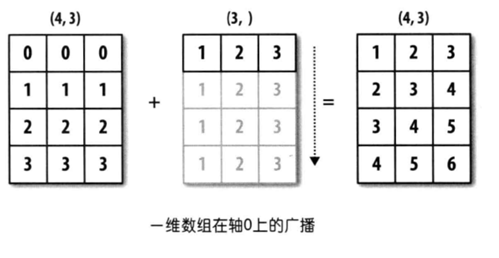
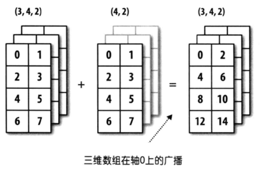
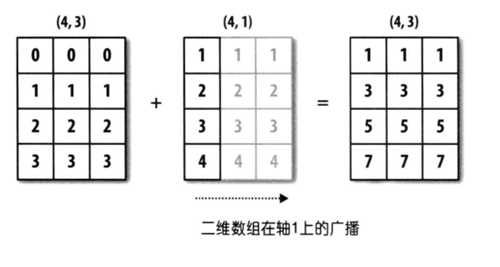

## NumPy的应用-3

### 数组的运算

使用 NumPy 最为方便的是当需要对数组元素进行运算时，不用编写循环代码遍历每个元素，所有的运算都会自动的**矢量化**。简单的说就是，NumPy 中的数学运算和数学函数会自动作用于数组中的每个成员。

#### 数组跟标量的运算

NumPy 的数组可以跟一个数值进行加、减、乘、除、求模、求幂等运算，对应的运算会作用到数组的每一个元素上，如下所示。

代码：

```python
array1 = np.arange(1, 10)
print(array1 + 10)
print(array1 * 10)
```

输出：

```
[11 12 13 14 15 16 17 18 19]
[10 20 30 40 50 60 70 80 90]
```

除了上述的运算，关系运算也是没有问题的，之前讲布尔索引的时候已经遇到过了。

代码：

```python
print(array1 > 5)
print(array1 % 2 == 0)
```

输出：

```
[False False False False False  True  True  True  True]
[False  True False  True False  True False  True False]
```

#### 数组跟数组的运算

NumPy 的数组跟数组也可以执行算术运算和关系运算，运算会作用于两个数组对应的元素上，这就要求两个数组的形状（`shape`属性）要相同，如下所示。

代码：

```python
array2 = np.array([1, 1, 1, 2, 2, 2, 3, 3, 3])
print(array1 + array2)
print(array1 * array2)
print(array1 ** array2)
```

输出：

```
[ 2  3  4  6  7  8 10 11 12]
[ 1  2  3  8 10 12 21 24 27]
[  1   2   3  16  25  36 343 512 729]
```

代码：

```python
print(array1 > array2)
print(array1 % array2 == 0)
```

输出：

```
[False  True  True  True  True  True  True  True  True]
[ True  True  True  True False  True False False  True]
```

#### 通用一元函数

NumPy 中通用一元函数的参数是一个数组对象，函数会对数组进行元素级的处理，例如：`sqrt`函数会对数组中的每个元素计算平方根，而`log2`函数会对数组中的每个元素计算以2为底的对数，代码如下所示。

代码：

```python
print(np.sqrt(array1))
print(np.log2(array1))
```

输出：

```
[1.         1.41421356 1.73205081 2.         2.23606798 2.44948974
 2.64575131 2.82842712 3.        ]
[0.         1.         1.5849625  2.         2.32192809 2.5849625
 2.80735492 3.         3.169925  ]
```

**表1：通用一元函数**

| 函数                             | 说明                                          |
| -------------------------------- | --------------------------------------------- |
| `abs` / `fabs`                   | 求绝对值的函数                                |
| `sqrt`                           | 求平方根的函数，相当于`array ** 0.5 `         |
| `square`                         | 求平方的函数，相当于`array ** 2`              |
| `exp`                            | 计算$e^x$的函数                               |
| `log` / `log10` / `log2`         | 对数函数（`e`为底 / `10`为底 / `2`为底）      |
| `sign`                           | 符号函数（`1` - 正数；`0` - 零；`-1` - 负数） |
| `ceil` / `floor`                 | 上取整 /  下取整                              |
| `isnan`                          | 返回布尔数组，NaN对应`True`，非NaN对应`False` |
| `isfinite` / `isinf`             | 判断数值是否为无穷大的函数                    |
| `cos` / `cosh` / `sin`           | 三角函数                                      |
| `sinh` / `tan` / `tanh`          | 三角函数                                      |
| `arccos` / `arccosh` / `arcsin`  | 反三角函数                                    |
| `arcsinh` / `arctan` / `arctanh` | 反三角函数                                    |
| `rint` / `round`                 | 四舍五入函数                                  |

#### 通用二元函数

NumPy 中通用二元函数的参数是两个数组对象，函数会对两个数组中的对应元素进行运算，例如：`maximum`函数会对两个数组中对应的元素找最大值，而`power`函数会对两个数组中对应的元素进行求幂操作，代码如下所示。

代码：

```python
array3 = np.array([[4, 5, 6], [7, 8, 9]])
array4 = np.array([[1, 2, 3], [3, 2, 1]])
print(np.maximum(array3, array4))
print(np.power(array3, array4))
```

输出：

```
[[4 5 6]
 [7 8 9]]
[[  4  25 216]
 [343  64   9]]
```

**表2：通用二元函数**

| 函数                               | 说明                                                         |
| ---------------------------------- | ------------------------------------------------------------ |
| `add(x, y)` / `substract(x, y)`    | 加法函数 / 减法函数                                          |
| `multiply(x, y)` / `divide(x, y)`  | 乘法函数 / 除法函数                                          |
| `floor_divide(x, y)` / `mod(x, y)` | 整除函数 / 求模函数                                          |
| `allclose(x, y)`                   | 检查数组`x`和`y`元素是否几乎相等                             |
| `power(x, y)`                      | 数组$x$的元素$x_i$和数组$y$的元素$y_i$，计算$x_i^{y_i}$      |
| `maximum(x, y)` / `fmax(x, y)`     | 两两比较元素获取最大值 / 获取最大值（忽略NaN）               |
| `minimum(x, y)` / `fmin(x, y)`     | 两两比较元素获取最小值 / 获取最小值（忽略NaN）               |
| `dot(x, y)`                        | 点积运算（数量积，通常记为$\cdot$，用于欧几里得空间（Euclidean space）） |
| `inner(x, y)`                      | 内积运算（内积的含义要高于点积，点积相当于是内积在欧几里得空间$\mathbb{R}^n$的特例，而内积可以推广到赋范向量空间，只要它满足平行四边形法则即可） |
| `cross(x, y) `                     | 叉积运算（向量积，通常记为$\times$，运算结果是一个向量）     |
| `outer(x, y)`                      | 外积运算（张量积，通常记为$\bigotimes$，运算结果通常是一个矩阵） |
| `intersect1d(x, y)`                | 计算`x`和`y`的交集，返回这些元素构成的有序数组               |
| `union1d(x, y)`                    | 计算`x`和`y`的并集，返回这些元素构成的有序数组               |
| `in1d(x, y)`                       | 返回由判断`x` 的元素是否在`y`中得到的布尔值构成的数组        |
| `setdiff1d(x, y)`                  | 计算`x`和`y`的差集，返回这些元素构成的数组                   |
| `setxor1d(x, y)`                   | 计算`x`和`y`的对称差，返回这些元素构成的数组                 |

>**说明**：关于向量和矩阵的运算，我们在下一个章节加以说明。

#### 广播机制

上面数组运算的例子中，两个数组的形状（`shape`属性）是完全相同的，我们再来研究一下，两个形状不同的数组是否可以直接做二元运算或使用通用二元函数进行运算，请看下面的例子。

代码：

```python
array5 = np.array([[0, 0, 0], [1, 1, 1], [2, 2, 2], [3, 3, 3]])
array6 = np.array([1, 2, 3])
array5 + array6
```

输出：

```
array([[1, 2, 3],
       [2, 3, 4],
       [3, 4, 5],
       [4, 5, 6]])
```

代码：

```python
array7 = np.array([[1], [2], [3], [4]])
array5 + array7
```

输出：

```
array([[1, 1, 1],
       [3, 3, 3],
       [5, 5, 5],
       [7, 7, 7]])
```

通过上面的例子，我们发现形状不同的数组仍然有机会进行二元运算，但这不代表任意形状的数组都可以进行二元运算。简单的说，只有两个数组后缘维度相同或者后缘维度不同但其中一个数组后缘维度为1时，广播机制才会被触发。通过广播机制，NumPy 将两个原本形状不相同的数组变成形状相同，才能进行二元运算。所谓后缘维度，指的是数组形状（`shape`属性）从后往前看对应的部分，我们举例说明。



上图中，一个数组的形状是`(4, 3)`，另一个数组的形状是`(3, )`，从后往前看对应的部分都是`3`，属于后缘维度相同，可以应用广播机制，第二个数组会沿着缺失元素那个轴的方向去广播自己，最终让两个数组形状达成一致。



上图中，一个数组的形状是`(3, 4, 2)`，另一个数组的形状是`(4, 2)`，从后往前看对应的部分都是`(4, 2)`，属于后缘维度相同，可以应用广播机制，第二个数组会沿着缺失元素那个轴的方向去广播自己，最终让两个数组形状达成一致。



上图中，一个数组的形状是`(4, 3)`，另一个数组的形状是`(4, 1)`，这是后缘维度不相同的情况，但是第二个数组跟第一个数组不同的地方为`1`，第二个数组可以沿着为`1` 的那个轴广播自己，最终让两个数组形状达成一致。

> **思考**：一个3行1列的二维数组和一个1行3列的二维数组能够执行加法运算吗？

### 其他常用函数

除了上面讲到的函数外，NumPy 中还提供了很多用于处理数组的函数，`ndarray`对象的很多方法也可以通过调用函数来实现，下表给出了一些常用的函数。

**表3：NumPy其他常用函数**

| 函数                           | 说明                                             |
| ------------------------------ | ------------------------------------------------ |
| `unique`                       | 去除数组重复元素，返回唯一元素构成的有序数组     |
| `copy`                         | 返回拷贝数组得到的数组                           |
| `sort`                         | 返回数组元素排序后的拷贝                         |
| `split` / `hsplit` / `vsplit`  | 将数组拆成若干个子数组                           |
| `stack` / `hstack` / `vstack`  | 将多个数组堆叠成新数组                           |
| `concatenate`                  | 沿着指定的轴连接多个数组构成新数组               |
| `append` / `insert`            | 向数组末尾追加元素 / 在数组指定位置插入元素      |
| `argwhere`                     | 找出数组中非0元素的位置                          |
| `extract` / `select` / `where` | 按照指定的条件从数组中抽取或处理数组元素         |
| `flip`                         | 沿指定的轴翻转数组中的元素                       |
| `fromregex`                    | 通过读取文件和正则表达式解析获取数据创建数组对象 |
| `repeat` / `tile`              | 通过对元素的重复来创建新数组                     |
| `roll`                         | 沿指定轴对数组元素进行移位                       |
| `resize`                       | 重新调整数组的大小                               |
| `place` / `put`                | 将数组中满足条件的元素/指定的元素替换为指定的值  |
| `partition`                    | 用选定的元素对数组进行一次划分并返回划分后的数组 |

**去重（重复元素只保留一项）**。

代码：

```python
np.unique(array5)
```

输出：

```
array([0, 1, 2, 3])
```

**堆叠和拼接**。

代码：

```python
array8 = np.array([[1, 1, 1], [2, 2, 2], [3, 3, 3]])
array9 = np.array([[4, 4, 4], [5, 5, 5], [6, 6, 6]])
np.hstack((array8, array9))
```

输出：

```
array([[1, 1, 1, 4, 4, 4],
       [2, 2, 2, 5, 5, 5],
       [3, 3, 3, 6, 6, 6]])
```

代码：

```python
np.vstack((array8, array9))
```

输出：

```
array([[1, 1, 1],
       [2, 2, 2],
       [3, 3, 3],
       [4, 4, 4],
       [5, 5, 5],
       [6, 6, 6]])
```

代码：

```python
np.concatenate((array8, array9))
```

输出：

```
array([[1, 1, 1],
       [2, 2, 2],
       [3, 3, 3],
       [4, 4, 4],
       [5, 5, 5],
       [6, 6, 6]])
```

代码：

```python
np.concatenate((array8, array9), axis=1)
```

输出：

```
array([[1, 1, 1, 4, 4, 4],
       [2, 2, 2, 5, 5, 5],
       [3, 3, 3, 6, 6, 6]])
```

**追加和插入元素**。

代码：

```python
np.append(array1, [10, 100])
```

输出：

```
array([  1,   2,   3,   4,   5,   6,   7,   8,   9,  10, 100])
```

代码：

```python
np.insert(array1, 1, [98, 99, 100])
```

输出：

```
array([  1,  98,  99, 100,   2,   3,   4,   5,   6,   7,   8,   9])
```

**抽取和处理元素**。

代码：

```python
np.extract(array1 % 2 != 0, array1)
```

输出：

```
array([1, 3, 5, 7, 9])
```

> **说明**：上面`extract`函数的操作相当于我们之前讲的布尔索引。

代码：

```python
np.select([array1 <= 3, array1 >= 7], [array1 * 10, array1 ** 2])
```

输出：

```
array([10, 20, 30,  0,  0,  0, 49, 64, 81])
```

> **说明**：上面`select`函数的第一个参数设置了两个条件，满足第一个条件的元素执行了乘以10的操作，满足第二个条件的元素执行了求平方的操作，两个条件都不能满足的数组元素会被处理为0。

代码：

```python
np.where(array1 <= 5, array1 * 10, array1 ** 2)
```

输出：

```
array([10, 20, 30, 40, 50, 36, 49, 64, 81])
```

> **说明**：上面`where`函数的第一个参数给出了条件，满足条件的元素执行了乘以10的操作，不能满足条件的元素执行了求平方的操作。

**重复数组元素创建新数组**。

代码：

```python
np.repeat(array1, 3)
```

输出：

```
array([1, 1, 1, 2, 2, 2, 3, 3, 3, 4, 4, 4, 5, 5, 5, 6, 6, 6, 7, 7, 7, 8, 8, 8, 9, 9, 9])
```

代码：

```python
np.tile(array1, 2)
```

输出：

```
array([1, 2, 3, 4, 5, 6, 7, 8, 9, 1, 2, 3, 4, 5, 6, 7, 8, 9])
```

**调整数组大小**。

代码：

```python
np.resize(array1, (5, 3))
```

输出：

```
array([[1, 2, 3],
       [4, 5, 6],
       [7, 8, 9],
       [1, 2, 3],
       [4, 5, 6]])
```

> **提示**：`array1`原本是一个有9个元素的一维数组，通过`resize`函数调整成为5行3列共15个元素的二维数组，缺少的元素通过复用原数组中的元素来补充。

代码：

```python
 np.resize(array5, (2, 4))
```

输出：

```
array([[0, 0, 0, 1],
       [1, 1, 2, 2]])
```

**替换数组元素**。

代码：

```python
np.put(array1, [0, 1, -1, 3, 5], [100, 200])
array1
```

输出：

```
array([100, 200,   3, 200,   5, 100,   7,   8, 100])
```

> **说明**：上面`put`函的第二个参数给出了要被替换的元素的索引，但是用来作为替换值的元素只有`100`和`200`，所以这两个值会被循环使用，因此索引为`0`、`1`、`-1`、`3`、`5`的元素被依次替换成了`100`、`200`、`100`、`200`、`100`。

代码：

```python
np.place(array1, array1 > 5, [1, 2, 3])
array1
```

输出：

```
array([1, 2, 3, 3, 5, 1, 2, 3, 1])
```

> **注意**：`put`函数和`place`函数都没有返回新的数组对象，而是在原来的数组上直接进行替换。
