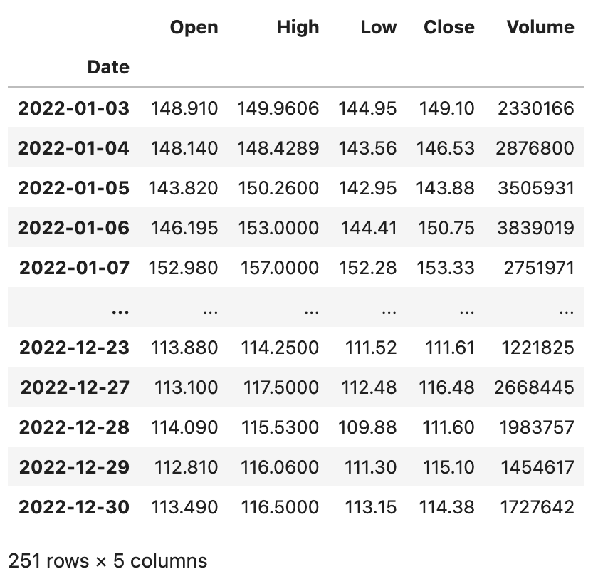
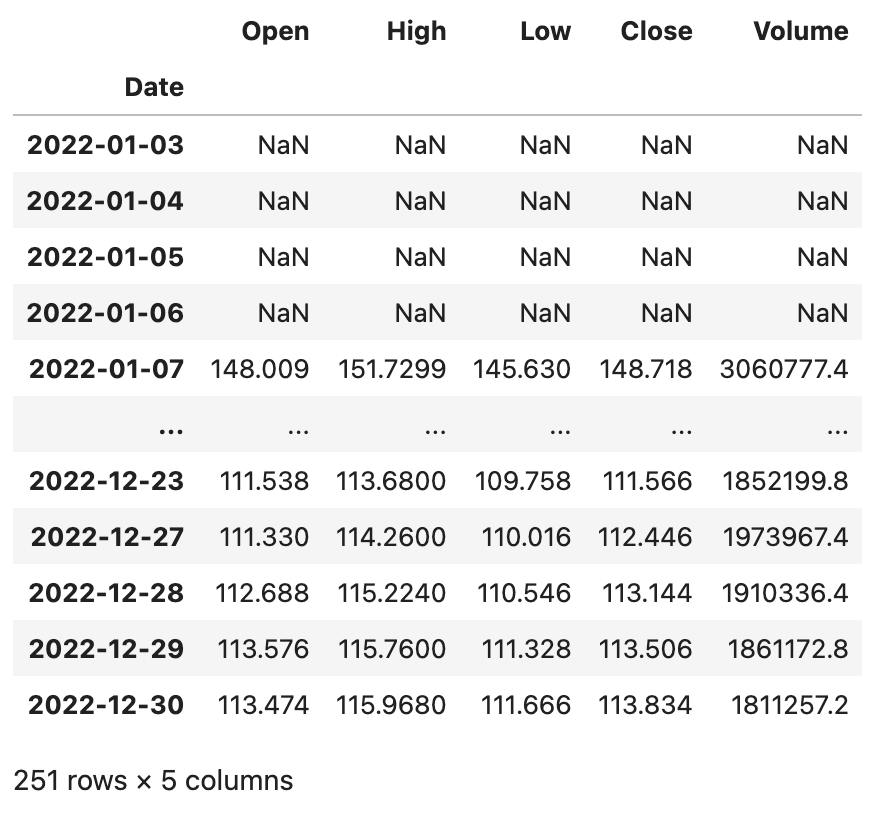
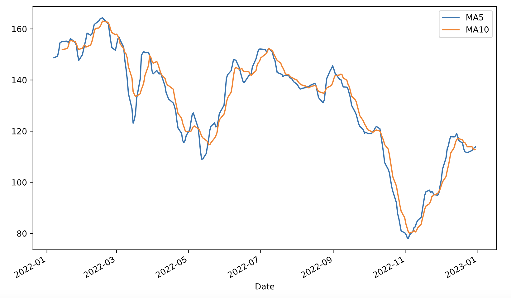
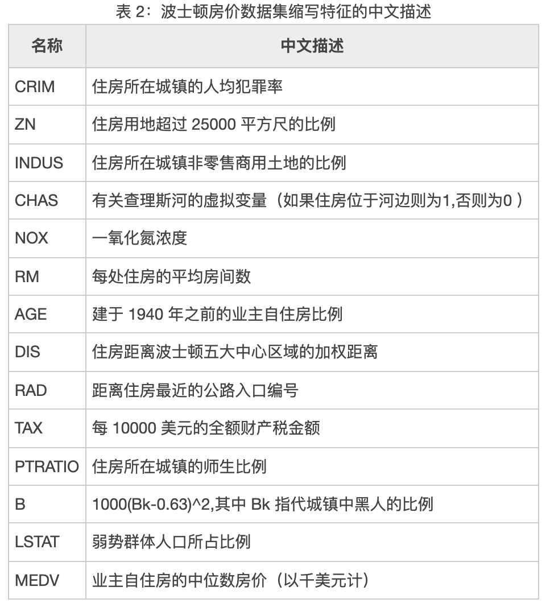
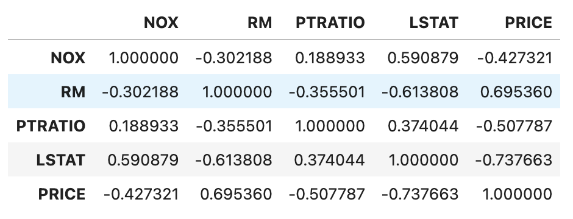
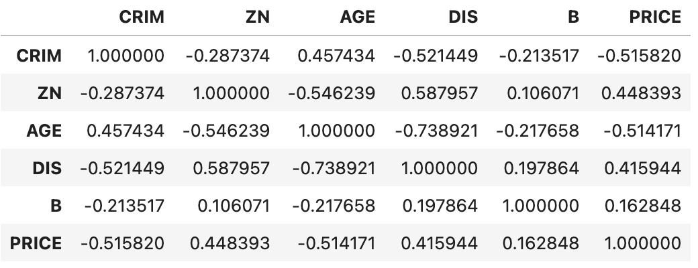

## 深入浅出pandas-5

我们再来补充一些使用`DataFrame`做数据分析时会使用到的操作，这些操作不仅常见而且也非常重要。

### 计算同比环比

我们之前讲过一个统计月度销售额的例子，我们可以通过`groupby`方法做分组聚合，也可以通过`pivot_table`生成透视表，如下所示。

```python
sales_df = pd.read_excel('data/2020年销售数据.xlsx')
sales_df['月份'] = sales_df.销售日期.dt.month
sales_df['销售额'] = sales_df.售价 * sales_df.销售数量
result_df = sales_df.pivot_table(index='月份', values='销售额', aggfunc='sum')
result_df.rename(columns={'销售额': '本月销售额'}, inplace=True)
result_df
```

输出：

```
      本月销售额
月份         
1       5409855
2       4608455
3       4164972
4       3996770
5       3239005
6       2817936
7       3501304
8       2948189
9       2632960
10      2375385
11      2385283
12      1691973
```

在得到月度销售额之后，如果我们需要计算月环比，这里有两种方案。第一种方案是我们可以使用`shift`方法对数据进行移动，将上一个月的数据与本月数据对齐，然后通过`(本月销售额 - 上月销售额) / 上月销售额`来计算月环比，代码如下所示。

```python
result_df['上月销售额'] = result_df.本月销售额.shift(1)
result_df
```

输出：

```
      本月销售额      上月销售额
月份                    
1       5409855            NaN
2       4608455      5409855.0
3       4164972      4608455.0
4       3996770      4164972.0
5       3239005      3996770.0
6       2817936      3239005.0
7       3501304      2817936.0
8       2948189      3501304.0
9       2632960      2948189.0
10      2375385      2632960.0
11      2385283      2375385.0
12      1691973      2385283.0
```

在上面的例子中，`shift`方法的参数为`1`表示将数据向下移动一个单元，当然我们可以使用参数`-1`将数据向上移动一个单元。相信大家能够想到，如果我们有更多年份的数据，我们可以将参数设置为`12`，这样就可以计算今年的每个月与去年的每个月之间的同比。

```python
result_df['环比'] = (result_df.本月销售额 - result_df.上月销售额) / result_df.上月销售额
result_df.style.format(
    formatter={'上月销售额': '{:.0f}', '环比': '{:.2%}'},
    na_rep='--------'
)
```

输出：

```
      本月销售额      上月销售额         环比
月份                    
1       5409855       --------     -------- 
2       4608455        5409855      -14.81%     
3       4164972        4608455       -9.62%
4       3996770        4164972       -4.04%
5       3239005        3996770      -18.96%
6       2817936        3239005      -13.00%
7       3501304        2817936       24.25%
8       2948189        3501304      -15.80%
9       2632960        2948189      -10.69%
10      2375385        2632960       -9.78%
11      2385283        2375385        0.42%
12      1691973        2385283      -29.07%
```

> **说明**：使用 JupyterLab 时，可以通过`DataFrame`对象的`style`属性在网页中对其进行渲染，上面的代码通过`Styler`对象的`format`方法将环比格式化为百分比进行显示，此外还指定了将空值替换为`--------`。

更为简单的第二种方案是直接使用`pct_change`方法计算变化的百分比，我们先将之前的上月销售额和环比列删除掉。

```python
result_df.drop(columns=['上月销售额', '环比'], inplace=True)
```

接下来，我们使用`DataFrame`对象的`pct_change`方法完成环比的计算。值得一提的是，`pct_change`方法有一个名为`periods`的参数，它的默认值是`1`，计算相邻两项数据变化的百分比，这不就是我们想要的环比吗？如果我们有很多年的数据，在计算时把这个参数的值修改为`12`，就可以得到相邻两年的月同比。

```python
result_df['环比'] = result_df.pct_change()
result_df
```

### 窗口计算

`DataFrame`对象的`rolling`方法允许我们将数据置于窗口中，然后用函数对窗口中的数据进行运算和处理。例如，我们获取了某只股票近期的数据，想制作5日均线和10日均线，那么就需要先设置窗口再进行运算。我们先用如下所示的代码读取2022年百度的股票数据，数据文件可以通过下面的链接来获取。

```Python
baidu_df = pd.read_excel('data/2022年股票数据.xlsx', sheet_name='BIDU')
baidu_df.sort_index(inplace=True)
baidu_df
```

输出：



上面的`DataFrame`有`Open`、`High`、`Low`、`Close`、`Volume`五个列，分别代表股票的开盘价、最高价、最低价、收盘价和成交量，接下来我们对百度的股票数据进行窗口计算。

```Python
baidu_df.rolling(5).mean()
```

输出：



我们也可以在`Series`上使用`rolling`设置窗口并在窗口内完成运算，例如我们可以对上面的百度股票收盘价（`Close`列）计算5日均线和10日均线，并使用`merge`函数将其组装到一个`DataFrame`对象中并绘制出双均线图，代码如下所示。

```Python
close_ma5 = baidu_df.Close.rolling(5).mean()
close_ma10 = baidu_df.Close.rolling(10).mean()
result_df = pd.merge(close_ma5, close_ma10, left_index=True, right_index=True)
result_df.rename(columns={'Close_x': 'MA5', 'Close_y': 'MA10'}, inplace=True)
result_df.plot(kind='line', figsize=(10, 6))
plt.show()
```

输出：



### 相关性判定

在统计学中，我们通常使用协方差（covariance）来衡量两个随机变量的联合变化程度。如果变量 $X$ 的较大值主要与另一个变量 $Y$ 的较大值相对应，而两者较小值也相对应，那么两个变量倾向于表现出相似的行为，协方差为正。如果一个变量的较大值主要对应于另一个变量的较小值，则两个变量倾向于表现出相反的行为，协方差为负。简单的说，协方差的正负号显示着两个变量的相关性。方差是协方差的一种特殊情况，即变量与自身的协方差。

$$
cov(X,Y) = E((X - \mu)(Y - \upsilon)) = E(X \cdot Y) - \mu\upsilon
$$

如果 $X$ 和 $Y$ 是统计独立的，那么二者的协方差为0，这是因为在 $X$ 和 $Y$ 独立的情况下：

$$
E(X \cdot Y) = E(X) \cdot E(Y) = \mu\upsilon
$$

协方差的数值大小取决于变量的大小，通常是不容易解释的，但是正态形式的协方差可以显示两变量线性关系的强弱。在统计学中，皮尔逊积矩相关系数就是正态形式的协方差，它用于度量两个变量 $X$ 和 $Y$ 之间的相关程度（线性相关），其值介于`-1`到`1`之间。

$$
\frac {cov(X, Y)} {\sigma_{X}\sigma_{Y}}
$$

估算样本的协方差和标准差，可以得到样本皮尔逊系数，通常用希腊字母 $\rho$ 表示。

$$
\rho = \frac {\sum_{i=1}^{n}(X_i - \bar{X})(Y_i - \bar{Y})} {\sqrt{\sum_{i=1}^{n}(X_i - \bar{X})^2} \sqrt{\sum_{i=1}^{n}(Y_i - \bar{Y})^2}}
$$

我们用 $\rho$ 值判断指标的相关性时遵循以下两个步骤。

1. 判断指标间是正相关、负相关，还是不相关。
    - 当 $ \rho \gt 0 $，认为变量之间是正相关，也就是两者的趋势一致。
    - 当 $ \rho \lt 0 $，认为变量之间是负相关，也就是两者的趋势相反。
    - 当 $ \rho \approx 0 $，认为变量之间是不相关的，但并不代表两个指标是统计独立的。
2. 判断指标间的相关程度。
    - 当 $ \rho $ 的绝对值在 $ [0.6,1] $ 之间，认为变量之间是强相关的。
    - 当 $ \rho $ 的绝对值在 $ [0.1,0.6) $ 之间，认为变量之间是弱相关的。
    - 当 $ \rho $ 的绝对值在 $ [0,0.1) $ 之间，认为变量之间没有相关性。

皮尔逊相关系数适用于：

  1. 两个变量之间是线性关系，都是连续数据。
  2. 两个变量的总体是正态分布，或接近正态的单峰分布。
  3. 两个变量的观测值是成对的，每对观测值之间相互独立。

这里，我们顺便说一下，如果两组变量并不是来自于正态总体的连续值，我们该如何判断相关性呢？对于定序尺度（等级），我们可以使用斯皮尔曼秩相关系数，其计算公式如下所示：
$$
r_{s}=1-{\frac {6\sum d_{i}^{2}}{n(n^{2}-1)}}
$$
其中，$d_{i}=\operatorname {R} (X_{i})-\operatorname {R} (Y_{i})$，即每组观测中两个变量的等级差值，$n$为观测样本数。

对于定类尺度（类别），我们可以使用卡方检验的方式来判定其是否相关。其实很多时候，连续值也可以通过分箱的方式处理成离散的等级或类别，然后使用斯皮尔曼秩相关系数或卡方检验的方式来判定相关性。

`DataFrame`对象的`cov`方法和`corr`方法分别用于计算协方差和相关系数，`corr`方法有一个名为`method`的参数，其默认值是`pearson`，表示计算皮尔逊相关系数；除此之外，还可以指定`kendall`或`spearman`来计算肯德尔系数或斯皮尔曼秩相关系数。

我们从名为`boston_house_price.csv`的文件中获取著名的波士顿房价数据集来创建一个`DataFrame`。

```python
boston_df = pd.read_csv('data/boston_house_price.csv')
boston_df
```

输出：


> **说明**：上面代码中使用了相对路径来访问 CSV 文件，也就是说 CSV 文件在当前工作路径下名为`data`的文件夹中。如果需要上面例子中的 CSV 文件，可以通过下面的百度云盘地址进行获取。链接：<https://pan.baidu.com/s/1rQujl5RQn9R7PadB2Z5g_g?pwd=e7b4>，提取码：e7b4。

可以看出，该数据集中包含了诸多影响房价的特征，包括犯罪率、一氧化氮浓度、平均房间数、低收入人群占比等，其中`PRICE`代表房价，具体情况如下所示。



接下来，我们将其中可以视为来自于正态总体的连续值，通过`corr`方法计算皮尔逊相关系数，看看哪些跟房价是正相关或负相关的关系，代码如下所示。

```Python
boston_df[['NOX', 'RM', 'PTRATIO', 'LSTAT', 'PRICE']].corr()
```

输出：



可以看出，平均房间数（`RM`）跟房价有较强的正相关性，而低收入人群占比（`LSTAT`）跟房价之间存在明显的负相关性。

斯皮尔曼秩相关系数对数据条件的要求没有皮尔逊相关系数严格，只要两个变量的观测值是成对的等级数据，或者是由连续变量转化成等级的数据，不论两个变量的总体分布形态、样本容量的大小如何，都可以用斯皮尔曼等级相关系数来进行研究。我们可以通过下面的方式对部分特征进行预处理，然后计算斯皮尔曼秩相关系数。

```Python
boston_df['CRIM'] = boston_df.CRIM.apply(lambda x: x // 5 if x < 25 else 5).map(int)
boston_df['ZN'] = pd.qcut(boston_df.ZN, q=[0, 0.75, 0.8, 0.85, 0.9, 0.95, 1], labels=np.arange(6))
boston_df['AGE'] = (boston_df.AGE // 20).map(int)
boston_df['DIS'] = (boston_df.DIS // 2.05).map(int)
boston_df['B'] = (boston_df.B // 66).map(int)
boston_df['PRICE'] = pd.qcut(boston_df.PRICE, q=[0, 0.15, 0.3, 0.5, 0.7, 0.85, 1], labels=np.arange(6))
boston_df[['CRIM', 'ZN', 'AGE', 'DIS', 'B', 'PRICE']].corr(method='spearman')
```

输出：



可以看出，房价跟犯罪率（`CRIM`）和房龄（`AGE`）之间存在较为明显的负相关关系，跟住房用地尺寸（`ZN`）存在微弱的正相关关系。相关性可以帮助我们在实际工作中找到业务抓手，即找到那些能够影响或改变工作结果的相关因素。

