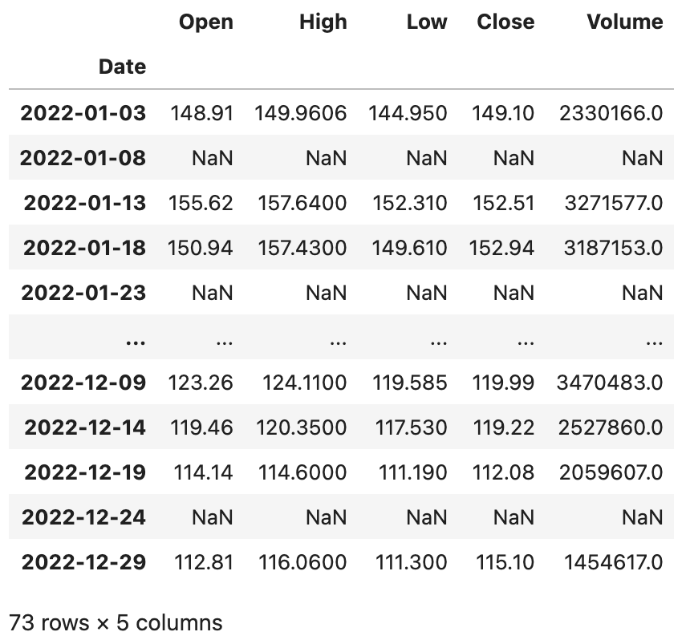
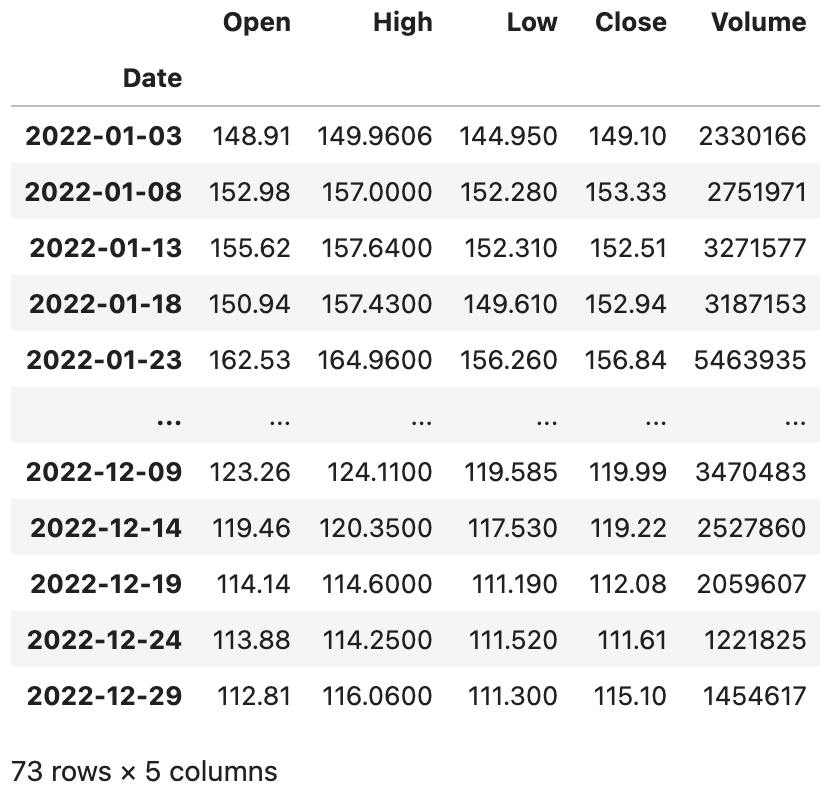
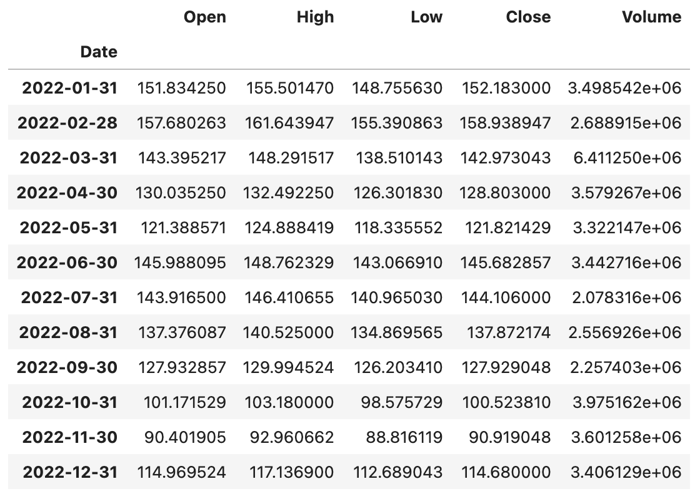
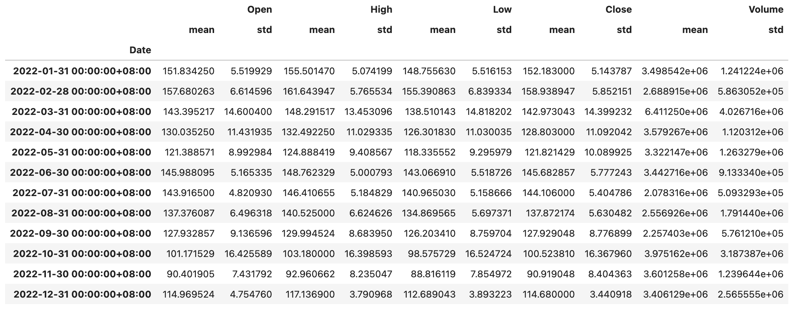
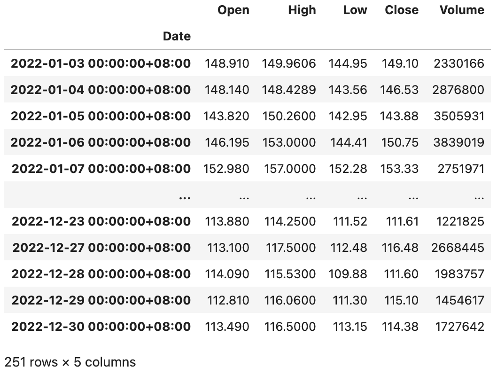
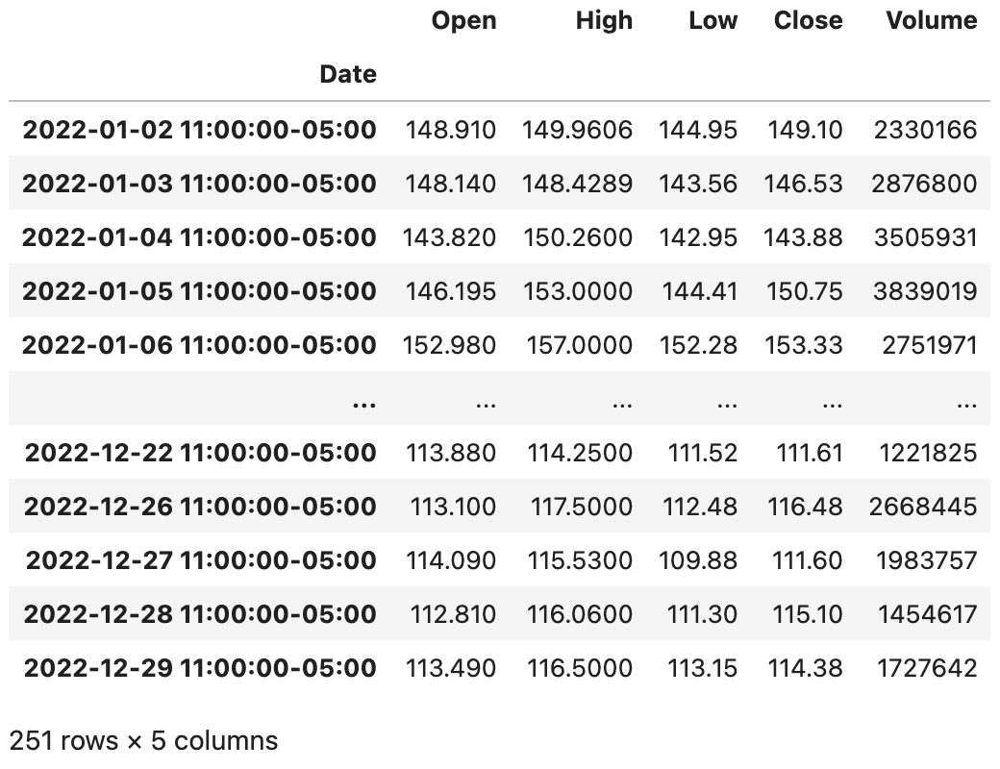

## 深入浅出pandas-6

我们再来看看`Index`类型，它为`Series`和`DataFrame`对象提供了索引服务，有了索引我们就可以排序数据（`sort_index`方法）、对齐数据（在运算和合并数据时非常重要）并实现对数据的快速检索（索引运算）。由于`DataFrame`类型表示的是二维数据，所以它的行和列都有索引，分别是`index`和`columns`。`Index`类型的创建的比较简单，通常给出`data`、`dtype`和`name`三个参数即可，分别表示作为索引的数据、索引的数据类型和索引的名称。由于`Index`本身也是一维的数据，索引它的方法和属性跟`Series`非常类似，你可以尝试创建一个`Index`对象，然后尝试一下之前学过的属性和方法在`Index`类型上是否生效。接下来，我们主要看看`Index`的几种子类型。

### 范围索引

范围索引是由具有单调性的整数构成的索引，我们可以通过`RangeIndex`构造器来创建范围索引，也可以通过`RangeIndex`类的类方法`from_range`来创建范围索引，代码如下所示。

代码：

```Python
sales_data = np.random.randint(400, 1000, 12)
index = pd.RangeIndex(1, 13, name='月份')
ser = pd.Series(data=sales_data, index=index)
ser
```

输出：

```
月份
1     703
2     705
3     557
4     943
5     961
6     615
7     788
8     985
9     921
10    951
11    874
12    609
dtype: int64
```

### 分类索引

分类索引是由定类尺度构成的索引。如果我们需要通过索引将数据分组，然后再进行聚合操作，分类索引就可以派上用场。分类索引还有一个名为`reorder_categories`的方法，可以给索引指定一个顺序，分组聚合的结果会按照这个指定的顺序进行呈现，代码如下所示。

代码：

```Python
sales_data = [6, 6, 7, 6, 8, 6]
index = pd.CategoricalIndex(
    data=['苹果', '香蕉', '苹果', '苹果', '桃子', '香蕉'],
    categories=['苹果', '香蕉', '桃子'],
    ordered=True
)
ser = pd.Series(data=sales_data, index=index)
ser
```

输出：

```
苹果    6
香蕉    6
苹果    7
苹果    6
桃子    8
香蕉    6
dtype: int64
```

基于索引分组数据，然后使用`sum`进行求和。

```Python
ser.groupby(level=0).sum()
```

输出：

```
苹果    19
香蕉    12
桃子     8
dtype: int64
```

指定索引的顺序。

```python
ser.index = index.reorder_categories(['香蕉', '桃子', '苹果'])
ser.groupby(level=0).sum()
```

输出：

```
香蕉    12
桃子     8
苹果    19
dtype: int64
```

### 多级索引

Pandas 中的`MultiIndex`类型用来表示层次或多级索引。可以使用`MultiIndex`类的类方法`from_arrays`、`from_product`、`from_tuples`等来创建多级索引，我们给大家举几个例子。

代码：

```python
tuples = [(1, 'red'), (1, 'blue'), (2, 'red'), (2, 'blue')]
index = pd.MultiIndex.from_tuples(tuples, names=['no', 'color'])
index
```

输出：

```
MultiIndex([(1,  'red'),
            (1, 'blue'),
            (2,  'red'),
            (2, 'blue')],
           names=['no', 'color'])
```

代码：

```python
arrays = [[1, 1, 2, 2], ['red', 'blue', 'red', 'blue']]
index = pd.MultiIndex.from_arrays(arrays, names=['no', 'color'])
index
```

输出：

```
MultiIndex([(1,  'red'),
            (1, 'blue'),
            (2,  'red'),
            (2, 'blue')],
           names=['no', 'color'])
```

代码：

```python
sales_data = np.random.randint(1, 100, 4)
ser = pd.Series(data=sales_data, index=index)
ser
```

输出：

```
no  color
1   red      43
    blue     31
2   red      55
    blue     75
dtype: int64
```

代码：

```python
ser.groupby('no').sum()
```

输出：

```
no
1     74
2    130
dtype: int64
```

代码：

```python
ser.groupby(level=1).sum()
```

输出：

```
color
blue    106
red      98
dtype: int64
```

代码：

```Python
stu_ids = np.arange(1001, 1006)
semisters = ['期中', '期末']
index = pd.MultiIndex.from_product((stu_ids, semisters), names=['学号', '学期'])
courses = ['语文', '数学', '英语']
scores = np.random.randint(60, 101, (10, 3))
df = pd.DataFrame(data=scores, columns=courses, index=index)
df
```

输出：

```
             语文 数学 英语
学号	学期			
1001  期中	93	77	60
      期末	93	98	84
1002  期中	64	78	71
      期末	70	71	97
1003  期中	72	88	97
      期末	99	100	63
1004  期中	80	71	61
      期末	91	62	72
1005  期中	82	95	67
      期末	84	78	86
```

根据第一级索引分组数据，按照期中成绩占`25%`，期末成绩占`75%` 的方式计算每个学生每门课的成绩。

代码：

```Python
df.groupby(level=0).agg(lambda x: x.values[0] * 0.25 + x.values[1] * 0.75)
```

输出：

```
        语文    数学    英语
学号			
1001	93.00	92.75	78.00
1002	68.50	72.75	90.50
1003	92.25	97.00	71.50
1004	88.25	64.25	69.25
1005	83.50	82.25	81.25
```

### 间隔索引

间隔索引顾名思义是使用固定的间隔范围充当索引，我们通常会使用`interval_range`函数来创建间隔索引，代码如下所示。

代码：

```python
index = pd.interval_range(start=0, end=5)
index
```

输出：

```
IntervalIndex([(0, 1], (1, 2], (2, 3], (3, 4], (4, 5]], dtype='interval[int64, right]')
```

`IntervalIndex`有一个名为`contains`的方法，可以检查范围内是否包含了某个元素，如下所示。

代码：

```python
index.contains(1.5)
```

输出：

```
array([False,  True, False, False, False])
```

`IntervalIndex`还有一个名为`overlaps`的方法，可以检查一个范围跟其他的范围是否有重叠，如下所示。

代码：

```python
index.overlaps(pd.Interval(1.5, 3.5))
```

输出：

```
array([False,  True,  True,  True, False])
```

如果希望间隔范围是左闭右开的状态，可以在创建间隔索引时通过`closed='left'`来做到；如果希望两边都是关闭状态，可以将`close`参数的值赋值为`both`，代码如下所示。

代码：

```python
index = pd.interval_range(start=0, end=5, closed='left')
index
```

输出：

```
IntervalIndex([[0, 1), [1, 2), [2, 3), [3, 4), [4, 5)], dtype='interval[int64, left]')
```

代码：

```python
index = pd.interval_range(start=pd.Timestamp('2022-01-01'), end=pd.Timestamp('2022-01-04'), closed='both')
index
```

输出：

```
IntervalIndex([[2022-01-01, 2022-01-02], [2022-01-02, 2022-01-03], [2022-01-03, 2022-01-04]], dtype='interval[datetime64[ns], both]')
```


### 日期时间索引

`DatetimeIndex`应该是众多索引中最复杂最重要的一种索引，我们通常会使用`date_range()`函数来创建日期时间索引，该函数有几个非常重要的参数`start`、`end`、`periods`、`freq`、`tz`，分别代表起始日期时间、结束日期时间、生成周期、采样频率和时区。我们先来看看如何创建`DatetimeIndex`对象，再来讨论它的相关运算和操作，代码如下所示。

代码：

```Python
pd.date_range('2021-1-1', '2021-6-30', periods=10)
```

输出：

```
DatetimeIndex(['2021-01-01', '2021-01-21', '2021-02-10', '2021-03-02',
               '2021-03-22', '2021-04-11', '2021-05-01', '2021-05-21',
               '2021-06-10', '2021-06-30'],
              dtype='datetime64[ns]', freq=None)
```

代码：

```Python
pd.date_range('2021-1-1', '2021-6-30', freq='W')
```

> **说明**：`freq=W`表示采样周期为一周，它会默认星期日是一周的开始；如果你希望星期一表示一周的开始，你可以将其修改为`freq=W-MON`；你也可以试着将该参数的值修改为`12H`，`M`，`Q`等，看看会发生什么，相信你不难猜到它们的含义。

输出：

```
DatetimeIndex(['2021-01-03', '2021-01-10', '2021-01-17', '2021-01-24',
               '2021-01-31', '2021-02-07', '2021-02-14', '2021-02-21',
               '2021-02-28', '2021-03-07', '2021-03-14', '2021-03-21',
               '2021-03-28', '2021-04-04', '2021-04-11', '2021-04-18',
               '2021-04-25', '2021-05-02', '2021-05-09', '2021-05-16',
               '2021-05-23', '2021-05-30', '2021-06-06', '2021-06-13',
               '2021-06-20', '2021-06-27'],
              dtype='datetime64[ns]', freq='W-SUN')
```

`DatatimeIndex`可以跟`DateOffset`类型进行运算，这一点很好理解，以为我们可以设置一个时间差让时间向前或向后偏移，具体的操作如下所示。

代码：

```Python
index = pd.date_range('2021-1-1', '2021-6-30', freq='W')
index - pd.DateOffset(days=2)
```

输出：

```
DatetimeIndex(['2021-01-01', '2021-01-08', '2021-01-15', '2021-01-22',
               '2021-01-29', '2021-02-05', '2021-02-12', '2021-02-19',
               '2021-02-26', '2021-03-05', '2021-03-12', '2021-03-19',
               '2021-03-26', '2021-04-02', '2021-04-09', '2021-04-16',
               '2021-04-23', '2021-04-30', '2021-05-07', '2021-05-14',
               '2021-05-21', '2021-05-28', '2021-06-04', '2021-06-11',
               '2021-06-18', '2021-06-25'],
              dtype='datetime64[ns]', freq=None)
```

代码：

```Python
index + pd.DateOffset(hours=2, minutes=10)
```

输出：

```
DatetimeIndex(['2021-01-03 02:10:00', '2021-01-10 02:10:00',
               '2021-01-17 02:10:00', '2021-01-24 02:10:00',
               '2021-01-31 02:10:00', '2021-02-07 02:10:00',
               '2021-02-14 02:10:00', '2021-02-21 02:10:00',
               '2021-02-28 02:10:00', '2021-03-07 02:10:00',
               '2021-03-14 02:10:00', '2021-03-21 02:10:00',
               '2021-03-28 02:10:00', '2021-04-04 02:10:00',
               '2021-04-11 02:10:00', '2021-04-18 02:10:00',
               '2021-04-25 02:10:00', '2021-05-02 02:10:00',
               '2021-05-09 02:10:00', '2021-05-16 02:10:00',
               '2021-05-23 02:10:00', '2021-05-30 02:10:00',
               '2021-06-06 02:10:00', '2021-06-13 02:10:00',
               '2021-06-20 02:10:00', '2021-06-27 02:10:00'],
              dtype='datetime64[ns]', freq=None)
```

如果`Series`对象或`DataFrame`对象使用了`DatetimeIndex`类型的索引，此时我们可以通过`asfreq()`方法指定一个时间频率来实现对数据的抽样，我们仍然以之前讲过的百度股票数据为例，给大家做一个演示。

代码：

```Python
baidu_df = pd.read_excel('data/2022年股票数据.xlsx', sheet_name='BIDU', index_col='Date')
baidu_df.sort_index(inplace=True)
baidu_df.asfreq('5D')
```

输出：



大家可能注意到了，每5天抽取1天有可能会抽中非交易日，那么对应的列都变成了空值，为了解决这个问题，在使用`asfreq`方法时可以通过`method`参数来指定一种填充空值的方法，可以将相邻的交易日的数据填入进来。

代码：

```Python
baidu_df.asfreq('5D', method='ffill')
```

输出：



当使用`DatetimeIndex`索引时，我们也可以通过`resample()`方法基于时间对数据进行重采样，相当于根据时间周期对数据进行了分组操作，分组之后还可以进行聚合统计，代码如下所示。

代码：

```Python
baidu_df.resample('1M').mean()
```

输出：



代码：

```python
baidu_df.resample('1M').agg(['mean', 'std'])
```

输出：



> **提示**：不知大家是否注意到，上面输出的`DataFrame` 的列索引是一个`MultiIndex`对象。你可以访问上面的`DataFrame`对象的`columns`属性看看。

如果要实现日期时间的时区转换，我们可以先用`tz_localize()`方法将日期时间本地化，代码如下所示。

代码：

```Python
baidu_df = baidu_df.tz_localize('Asia/Chongqing')
baidu_df
```

输出：



在对时间本地化以后，我们再使用`tz_convert()`方法就可以实现转换时区，代码如下所示。

代码：

```Python
baidu_df.tz_convert('America/New_York')
```

输出：



如果你的数据使用了`DatetimeIndex`类型的索引，那么你就很有可能要对数据进行时间序列分析，关于时间序列分析的方法和模型并不是本章节要探讨的内容，我们在其他的专栏中为大家分享。
