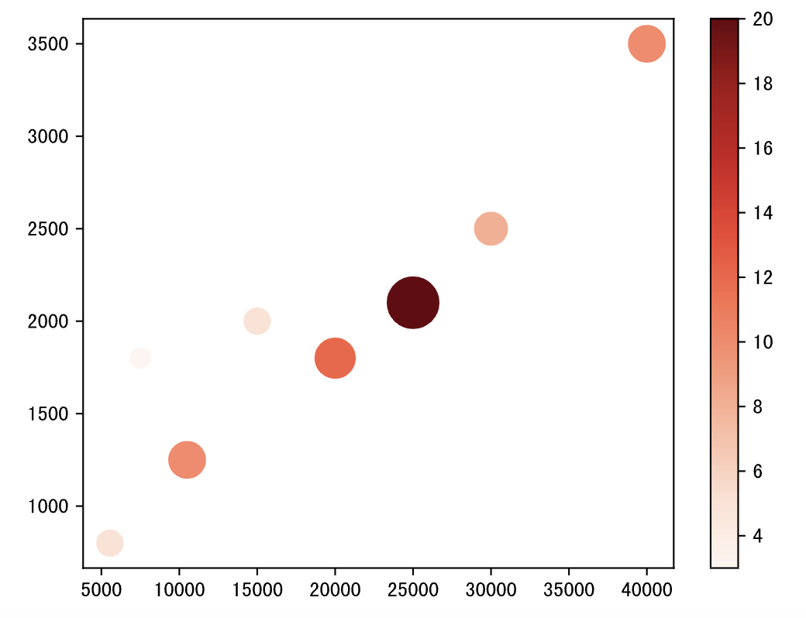
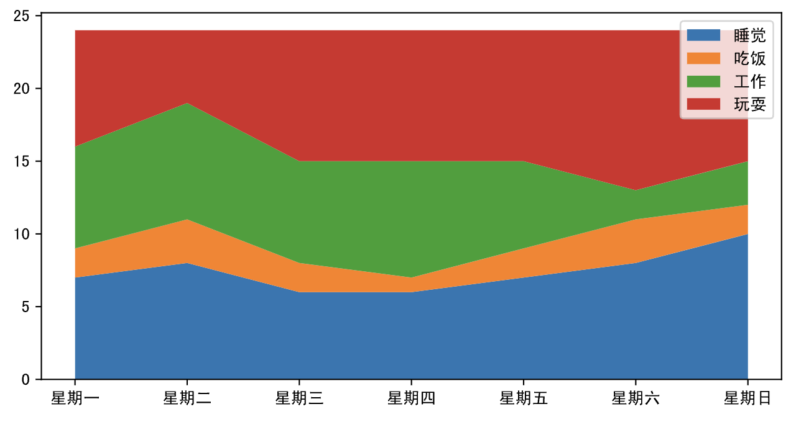
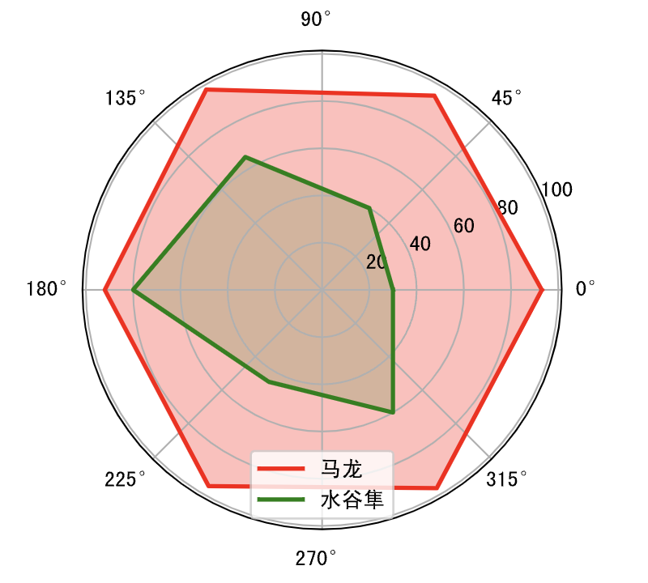
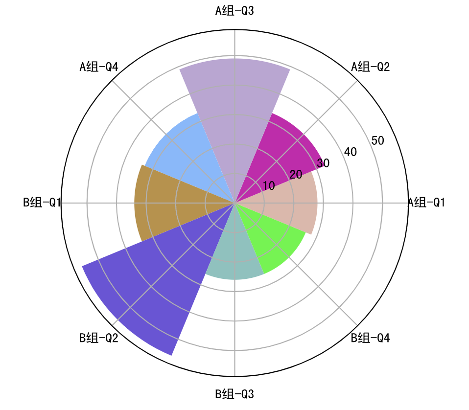
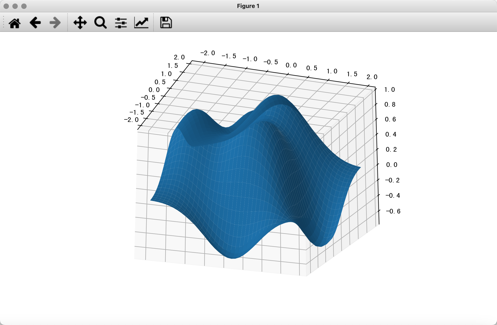

## 数据可视化-2

本章我们尝试用 matplotlib 来绘制一些高阶统计图表。正如前面所说的，大家可以通过 matplotlib 官方网站上提供的[文档](https://matplotlib.org/stable/tutorials/index.html)和[示例](https://matplotlib.org/stable/gallery/index.html)来学习如何使用 matplotlib 并绘制出更加高级的统计图表；尤其是在定制一些比较复杂的图表时，我们建议大家直接找到官网提供的示例，然后只需要做出相应的修改，就可以绘制出自己想要的图表。这种“拷贝+修改”的做法应该会大大提高你的工作效率，因为大多数时候，你的代码跟官网上的代码就仅仅是数据有差别而已，没有必要去做重复乏味的事情。

### 气泡图

气泡图可以用来了解三个变量之间的关系，通过比较气泡位置和大小来分析数据维度之间的相关性。例如在我们之前绘制的月收入和网购支出的散点图中，我们已经发现了二者的正相关关系，如果我们引入第三个变量网购次数，那么我们就需要使用气泡图来进行展示。

代码：

```python
income = np.array([5550, 7500, 10500, 15000, 20000, 25000, 30000, 40000])
outcome = np.array([800, 1800, 1250, 2000, 1800, 2100, 2500, 3500])
nums = np.array([5, 3, 10, 5, 12, 20, 8, 10])

# 通过scatter函数的s参数和c参数分别控制面积和颜色
plt.scatter(income, outcome, s=nums * 30, c=nums, cmap='Reds')
# 显示颜色条
plt.colorbar()
# 显示图表
plt.show()
```

输出：



### 面积图

面积图又叫堆叠折线图，是在折线图的基础上，对折线以下的区域进行颜色填充（展示面积），用于在连续间隔或时间跨度上展示数值，一般用来显示趋势和对比数值，不同颜色的填充可以让多个面积块之间的对比和趋势更好的突显。下面的例子中，我们用面积图来展示从周一到周日花在睡觉、吃饭、工作和玩耍上的时间。

代码：

```python
plt.figure(figsize=(8, 4))
days = np.arange(7)
sleeping = [7, 8, 6, 6, 7, 8, 10]
eating = [2, 3, 2, 1, 2, 3, 2]
working = [7, 8, 7, 8, 6, 2, 3]
playing = [8, 5, 9, 9, 9, 11, 9]
# 绘制堆叠折线图
plt.stackplot(days, sleeping, eating, working, playing)
# 定制横轴刻度
plt.xticks(days, labels=[f'星期{x}' for x in '一二三四五六日'])
# 定制图例
plt.legend(['睡觉', '吃饭', '工作', '玩耍'], fontsize=10)
# 显示图表
plt.show()
```

输出：



### 雷达图

雷达图通常用来比较多个定量数据，用于查看哪些变量具有相似的值。 雷达图也可用于查看数据集中哪些变量的值比较低，哪些变量的值比较高，是显示性能或表现的理想选择。经常观看篮球、足球比赛的读者应该对雷达图非常熟悉，例如在 NBA 的转播中就经常使用雷达图来展示球员的各项数据。雷达图的本质折线图，只不过将折线图映射到了极坐标系。在绘制雷达图时，需要让折线闭合，简单的说就是首尾相连，下面是绘制雷达图的代码。

代码：

```python
labels = np.array(['速度', '力量', '经验', '防守', '发球', '技术'])
# 马龙和水谷隼的数据
malong_values = np.array([93, 95, 98, 92, 96, 97])
shuigu_values = np.array([30, 40, 65, 80, 45, 60])
angles = np.linspace(0, 2 * np.pi, labels.size, endpoint=False)
# 多加一条数据让图形闭合
malong_values = np.append(malong_values, malong_values[0])
shuigu_values = np.append(shuigu_values, shuigu_values[0])
angles = np.append(angles, angles[0])
# 创建画布
plt.figure(figsize=(4, 4), dpi=120)
# 创建坐标系
ax = plt.subplot(projection='polar')
# 绘图和填充
plt.plot(angles, malong_values, color='r', linewidth=2, label='马龙')
plt.fill(angles, malong_values, color='r', alpha=0.3)
plt.plot(angles, shuigu_values, color='g', linewidth=2, label='水谷隼')
plt.fill(angles, shuigu_values, color='g', alpha=0.2)
# 显示图例
ax.legend()
# 显示图表
plt.show()
```

输出：



### 玫瑰图

玫瑰图是映射在极坐标下的柱状图，由弗罗伦斯·南丁格尔（Florence Nightingale）所发明，当年是南丁格尔用来呈现战地医院季节性死亡率的一种图表。由于半径和面积的关系是平方的关系，南丁格尔玫瑰图会将数据的比例大小夸大，尤其适合对比大小相近的数值，同时由于圆形有周期的特性，所以南丁格尔玫瑰图也适用于表示一个周期内的时间概念，比如星期、月份。

代码：

```python
group1 = np.random.randint(20, 50, 4)
group2 = np.random.randint(10, 60, 4)
x = np.array([f'A组-Q{i}' for i in range(1, 5)] + [f'B组-Q{i}' for i in range(1, 5)])
y = np.array(group1.tolist() + group2.tolist())
# 玫瑰花瓣的角度和宽度
theta = np.linspace(0, 2 * np.pi, x.size, endpoint=False)
width = 2 * np.pi / x.size
# 生成8种随机颜色
colors = np.random.rand(8, 3)
# 将柱状图投影到极坐标
ax = plt.subplot(projection='polar')
# 绘制柱状图
plt.bar(theta, y, width=width, color=colors, bottom=0)
# 设置网格
ax.set_thetagrids(theta * 180 / np.pi, x, fontsize=10)
# 显示图表
plt.show()
```

输出：



### 3D图表

matplotlib 还可以用于绘制3D图，具体的内容大家可以参考官方文档，下面我们用一段简单的代码为大家展示如何绘制3D图表。

代码：

```python
from mpl_toolkits.mplot3d import Axes3D

fig = plt.figure(figsize=(8, 4), dpi=120)
# 创建3D坐标系并添加到画布上
ax = Axes3D(fig, auto_add_to_figure=False)
fig.add_axes(ax)
x = np.arange(-2, 2, 0.1)
y = np.arange(-2, 2, 0.1)
x, y = np.meshgrid(x, y)
z = (1 - y ** 5 + x ** 5) * np.exp(-x ** 2 - y ** 2)
# 绘制3D曲面
ax.plot_surface(x, y, z)
# 显示图表
plt.show()
```

输出：


需要指出的是， JupyterLab 中渲染的3D图并不是真正的3D图，因为你没有办法调整观察者的视角，也没有办法旋转或者缩放。如果想要看到真正的3D效果，需要在将图表渲染到 Qt 窗口中，为此我们可以先安装名为 PyQt6 的三方库，如下所示。

```
%pip install PyQt6
```

然后，我们使用魔法指令让 JupyterLab 将图表渲染到 Qt 窗口中。

```
%matplotlib qt
```

在完成上面的操作后，我们可以重新运行刚才绘制3D图的代码，看到如下所示的窗口。在这个窗口中，我们可以通过鼠标对3D进行旋转、缩放，我们有可以选中图表的一部分数据进行观测，是不是非常的酷。


