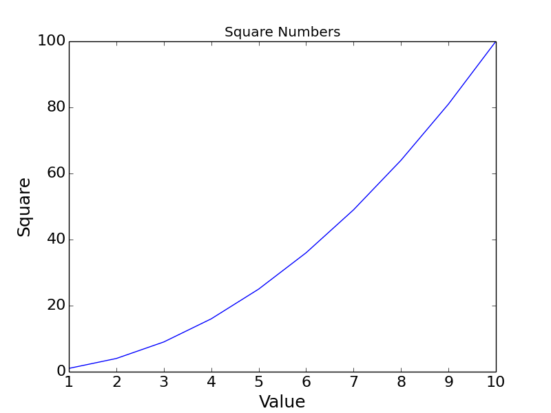
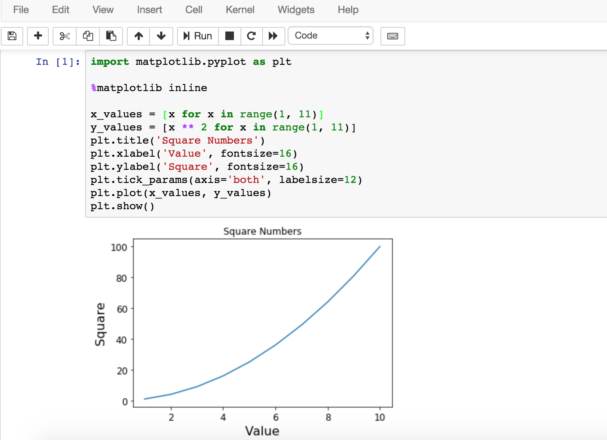
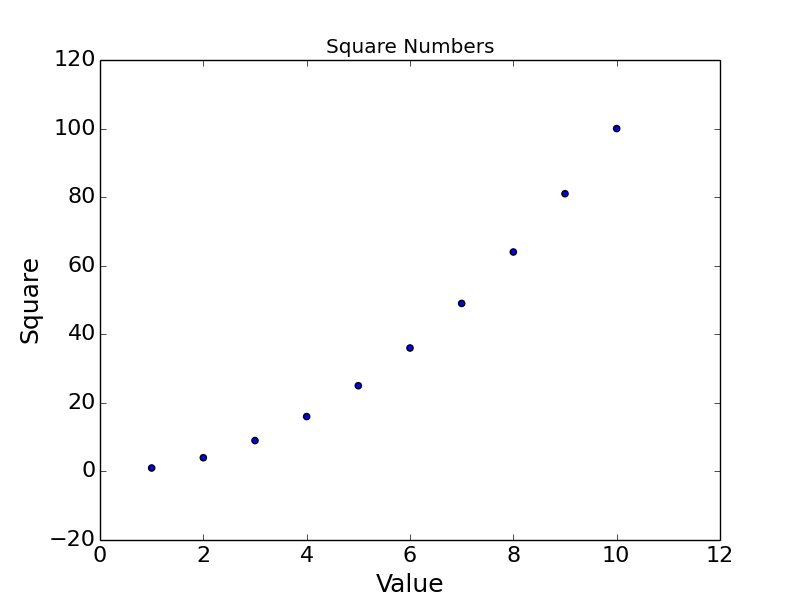
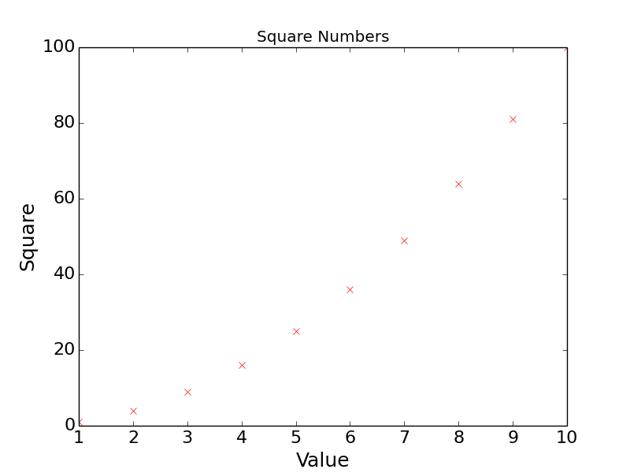
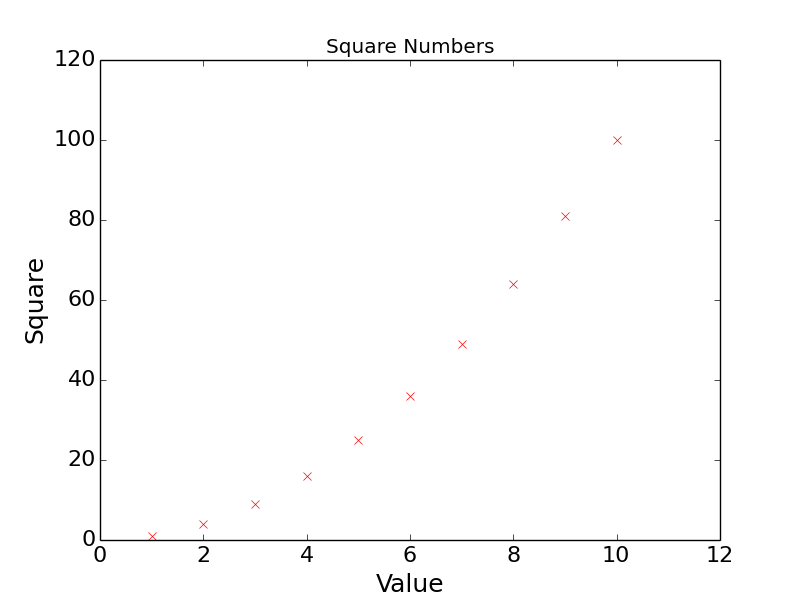
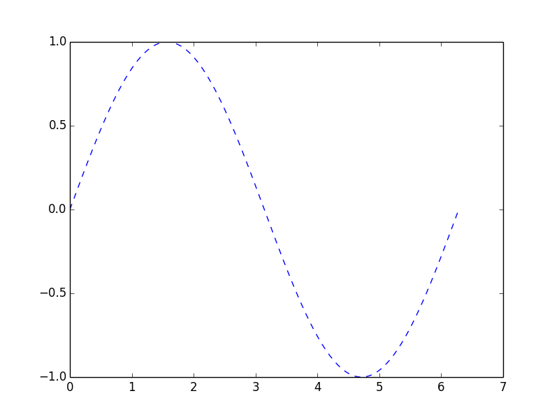
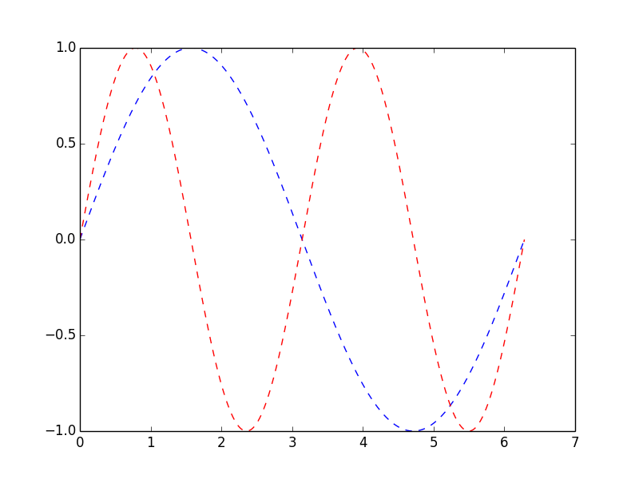
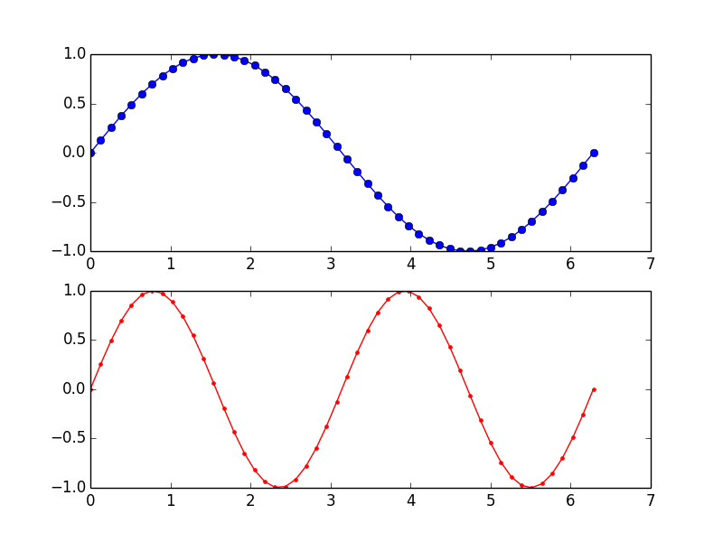
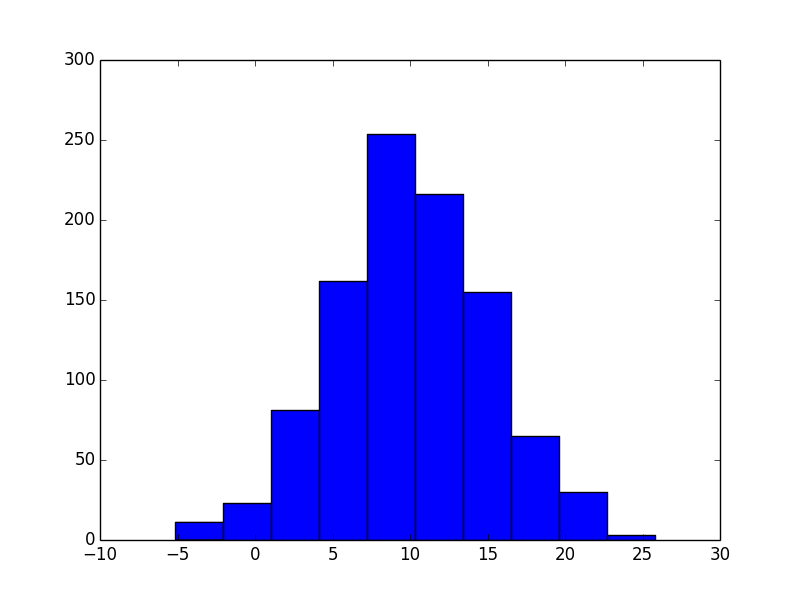
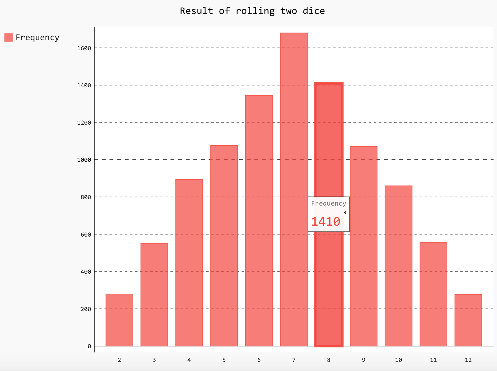

## Matplotlib和数据可视化

数据的处理、分析和可视化已经成为Python近年来最为重要的应用领域之一，其中数据的可视化指的是将数据呈现为漂亮的统计图表，然后进一步发现数据中包含的规律以及隐藏的信息。数据可视化又跟数据挖掘和大数据分析紧密相关，而这些领域以及当下被热议的“深度学习”其最终的目标都是为了实现从过去的数据去对未来的状况进行预测。Python在实现数据可视化方面是非常棒的，即便是使用个人电脑也能够实现对百万级甚至更大体量的数据进行探索的工作，而这些工作都可以在现有的第三方库的基础上来完成（无需“重复的发明轮子”）。[Matplotlib](https://matplotlib.org/)就是Python绘图库中的佼佼者，它包含了大量的工具，你可以使用这些工具创建各种图形（包括散点图、折线图、直方图、饼图、雷达图等），Python科学计算社区也经常使用它来完成数据可视化的工作。

### 安装matplotlib

可以使用pip来安装matplotlib，命令如下所示。

```Shell
pip install matplotlib
```

### 绘制折线图

```Python
# coding: utf-8
import matplotlib.pyplot as plt


def main():
    # 保存x轴数据的列表
    x_values = [x for x in range(1, 11)]
    # 保存y轴数据的列表
    y_values = [x ** 2 for x in range(1, 11)]
    # 设置图表的标题以及x和y轴的说明
    plt.title('Square Numbers')
    plt.xlabel('Value', fontsize=18)
    plt.ylabel('Square', fontsize=18)
    # 设置刻度标记的文字大小
    plt.tick_params(axis='both', labelsize=16)
    # 绘制折线图
    plt.plot(x_values, y_values)
    plt.show()


if __name__ == '__main__':
    main()

```

运行程序，效果如下图所示。



如果使用jupyter的notebook，需要使用魔法指令`%matplotlib inresline`来设置在页面中显示图表，效果如下所示。



### 绘制散点图

可以将上面代码中的的`plot`函数换成`scatter`函数来绘制散点图，效果如下图所示。



当然，也可以直接通过`plot`函数设置绘图的颜色和线条的形状将折线图改造为散点图，对应的代码如下所示，其中参数'xr'表示每个点的记号是‘x’图形，颜色是红色（<u>r</u>ed）。

```Python
plt.plot(x_values, y_values, 'xr')
```

重新运行程序，效果如下图所示。



可能大家已经注意到了，1和10对应的‘x’记号在图形边角的位置不太明显，要解决这个问题可以通过添加下面的代码调整x轴和y轴的坐标范围。

```Python
plt.axis([0, 12, 0, 120])
```

调整后的效果如下图所示。



### 绘制正弦曲线

在下面的程序中，我们使用了名为[NumPy](http://www.numpy.org/)的第三方库来产生样本并计算正弦值。NumPy是一个运行速度非常快的数学库，主要用于数组计算。它可以让你在Python中使用向量和数学矩阵，以及许多用C语言实现的底层函数。如果想通过Python学习数据科学或者机器学习相关的内容，那么就得先学会使用NumPy。

```Python
# coding: utf-8
import matplotlib.pyplot as plt
import numpy as np


def main():
    # 指定采样的范围以及样本的数量
    x_values = np.linspace(0, 2 * np.pi, 1000)
    # 计算每个样本对应的正弦值
    y_values = np.sin(x_values)
    # 绘制折线图(线条形状为--, 颜色为蓝色)
    plt.plot(x_values, y_values, '--b')
    plt.show()


if __name__ == '__main__':
    main()

```

运行程序，效果如下图所示。



如果要在一个坐标系上绘制多个图像，可以按照如下的方式修改代码。

```Python
# coding: utf-8
import matplotlib.pyplot as plt
import numpy as np


def main():
    x_values = np.linspace(0, 2 * np.pi, 1000)
    plt.plot(x_values, np.sin(x_values), '--b')
    plt.plot(x_values, np.sin(2 * x_values), '--r')
    plt.show()


if __name__ == '__main__':
    main()

```

修改后的代码运行效果如下图所示。



如果需要分别在两个坐标系上绘制出两条曲线，可以按照如下的方式操作。

```Python
# coding: utf-8
import matplotlib.pyplot as plt
import numpy as np


def main():
    # 将样本数量减少为50个
    x_values = np.linspace(0, 2 * np.pi, 50)
    # 设置绘图为2行1列活跃区为1区(第一个图)
    plt.subplot(2, 1, 1)
    plt.plot(x_values, np.sin(x_values), 'o-b')
    # 设置绘图为2行1列活跃区为2区(第二个图)
    plt.subplot(2, 1, 2)
    plt.plot(x_values, np.sin(2 * x_values), '.-r')
    plt.show()


if __name__ == '__main__':
    main()

```

效果如下图所示。



### 绘制直方图

我们可以通过NumPy的random模块的normal函数来生成[正态分布](https://zh.wikipedia.org/wiki/%E6%AD%A3%E6%80%81%E5%88%86%E5%B8%83)的采样数据，其中的三个参数分别表示期望、标准差和样本数量，然后绘制成直方图，代码如下所示。

```Python
# coding: utf-8
import matplotlib.pyplot as plt
import numpy as np


def main():
    # 通过random模块的normal函数产生1000个正态分布的样本
    data = np.random.normal(10.0, 5.0, 1000)
    # 绘制直方图(直方的数量为10个)
    plt.hist(data, 10)
    plt.show()


if __name__ == '__main__':
    main()

```

运行效果如下图所示。



### 使用Pygal绘制矢量图

矢量图（SVG）是[计算机图形学](https://zh.wikipedia.org/wiki/%E8%AE%A1%E7%AE%97%E6%9C%BA%E5%9B%BE%E5%BD%A2%E5%AD%A6)中用点、直线或者多边形等基于数学方程的几何图元表示的图像，也是目前应用得非常多的一种图像文件格式，全称是“Scalable Vector Graphics”。和使用像素表示图像的位图不同，SVG基于XML存储图像数据，它是W3C定义的一种开放标准的矢量图形语言，可以用来设计更为清晰的Web图像，因为SVG与分辨率无关，在任意放大时不会丢失细节或影响清晰度。SVG可以直接用代码来描绘图像，也可以用任何文字处理工具来打开它，通过改变SVG的代码我们可以让图像具备交互功能。

Python中可以使用Pygal来生成SVG，可以通过pip来安装它。

```Python
from random import randint
import pygal


def roll_dice(n=1):
	total = 0
	for _ in range(n):
		total += randint(1, 6)
	return total


def main():
    results = []
    # 将两颗色子摇10000次记录点数
    for _ in range(10000):
        face = roll_dice(2)
        results.append(face)
    freqs = []
    # 统计2~12点各出现了多少次
    for value in range(2, 13):
        freq = results.count(value)
        freqs.append(freq)
    # 绘制柱状图
    hist = pygal.Bar()
    hist.title = 'Result of rolling two dice'
    hist.x_labels = [x for x in range(2, 13)]
    hist.add('Frequency', freqs)
    # 保存矢量图
    hist.render_to_file('result.svg')


if __name__ == '__main__':
    main()
    

```

运行上面的程序，效果如下图所示。



### 后记

Matplotlib和NumPy的强大我们在这里也只是窥视了其冰山一角，我们在后续的内容里面还会使用到这两个第三方库，到时候我们再续点为大家介绍其他的功能。