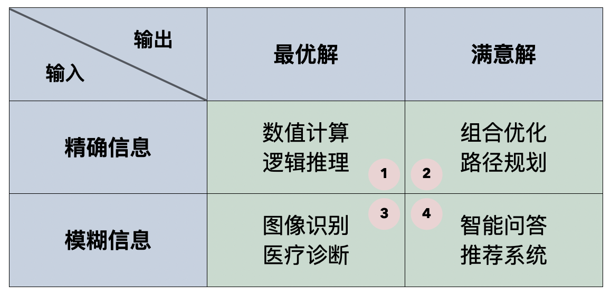
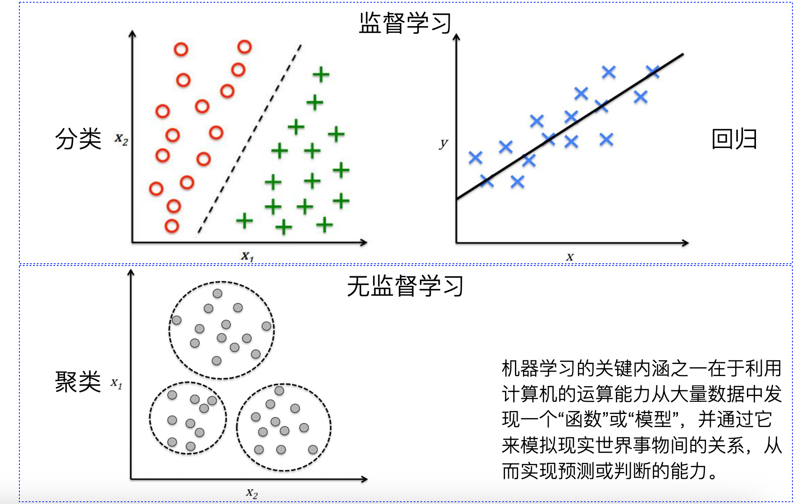
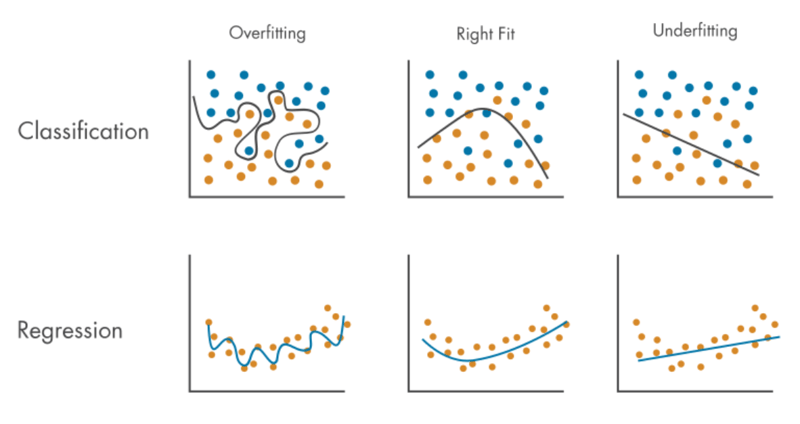
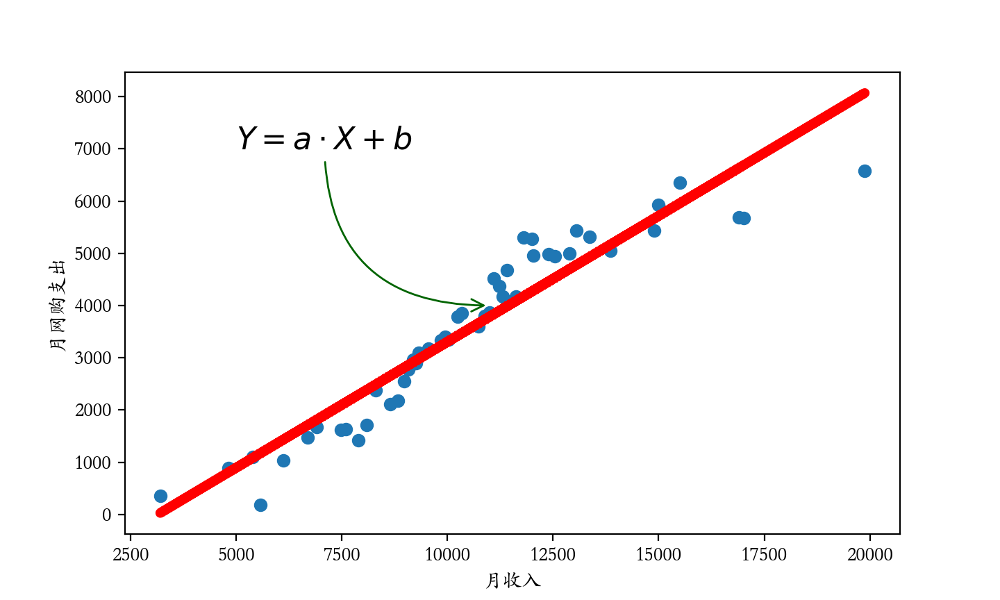

## 浅谈机器学习

人工智能无疑是最近几年热度极高的一个词，从2016年谷歌 DeepMind 团队开发的 AlphaGo 围棋程序战胜人类顶尖棋手，到2017年基于 Transformer 架构的 NLP 模型发布，再到2023年 OpenAI 推出基于 GPT-4 的 ChatGPT 以及人工智能在医疗、自动驾驶等领域的深度应用，人工智能的热潮到达了自1956年达特茅斯会议以来前所未有的高度，可以说几乎每个人的生活都或多或少的受到了人工智能的影响。人工智能是计算机科学的一个重要分支，涉及计算机模拟智能行为的能力以及机器模仿人类智能行为的能力。研究人工智能的主要目标是开发出能够独立做出决策的系统，从而在医疗、工程、金融、教育、科研、公共服务等诸多领域帮助人类更高效的工作。人工智能的英文是“*artificial intelligence*”，因此通常被简称为 *AI*，人工智能包含了诸多的内容，我们经常说到的机器学习、深度学习、自然语言处理、计算机视觉、强化学习、数据挖掘、专家系统、工业机器人、自动驾驶等都属于人工智能的范畴。狭义的人工智能通常只能执行特定的任务，会聊天的人工智能通常不会开车，会开车的人工智能通常不会下棋；广义的人工智能需要具备通用智能，能够执行任何人类智能可以执行的任务；而更进一步的能够超越人类智能的人工智能，我们称之为超人工智能。

本课程我们主要探讨人工智能中的机器学习（Machine Learning）。机器学习是人工智能的一个子领域，关注如何通过数据和算法来使计算机系统从经验中学习并进行预测或决策。简单的说，机器学习是实现人工智能的一种方法，有很多 AI 系统都是通过机器学习技术开发的。有的时候，我们也用数据挖掘（Data Mining）这个词来指代机器学习，所谓的数据挖掘就是从数据中提取有用的信息和知识，分析和解释数据中的模式和趋势，最终达成预测未来趋势和行为的目标。当然，我们在提到这两个词的时候，表达的侧重点还是有所区别，数据挖掘主要关注知识发现，而机器学习侧重于构建和优化预测模型。

### 人工智能发展史

治学先治史，我们简单回顾一下人工智能发展史上的里程碑事件，对于比较久远的历史，我们只简单提一些重要的时间节点，我们把重点放在最近几年的重大事件上。


> **说明**：上图来自于[AMiner网站](https://www.aminer.cn/ai-history)，按照该网站的要求，在引用上图需要引用下面的论文。需要高清原图的，也可以在该网站上获取。
>
> Jie Tang, Jing Zhang, Limin Yao, Juanzi Li, Li Zhang, and Zhong Su. [ArnetMiner: Extraction and Mining of Academic Social Networks.](https://www.aminer.cn/pub/53e9a5afb7602d9702edacce/arnetminer-extraction-and-mining-of-academic-social-networks) In Proceedings of the Fourteenth ACM SIGKDD International Conference on Knowledge Discovery and Data Mining (SIGKDD'2008). pp.990-998.

1. 1950年，艾伦·图灵发表了一篇划时代的论文，文中预言了创造出具有智能的机器的可能性并提出了著名的图灵测试。图灵测试旨在通过计算机与人类进行对话，如果计算机能够使人类无法区分回答问题的是机器还是人类，就认为该计算机具有智能。
2. 1956年，达特茅斯会议召开，该会议被认为是人工智能的诞生标志。会议上约翰·麦卡锡、马文·明斯基、克劳德·香农等人提出了人工智能的研究议程。达特茅斯会议的几位主要参与者也被后人誉为“人工智能七侠”，包括约翰·麦卡锡、马文·明斯基、阿伦·纽厄尔、赫伯特·西蒙、克劳德·香农、奥利弗·塞尔弗里奇和内森·罗切斯特，他们为人工智能的发展奠定了基础，其中有五个人获得了图灵奖。
3. 1957年，弗兰克·罗森布拉特提出了感知机模型，这是最早的神经网络模型之一，用于解决二分类问题。
4. 1958年，约翰·麦卡锡开发了 LISP 编程语言，这种语言特别适合于符号处理，成为早期 AI 研究的主要编程语言。
5. 1980年，卡内基梅隆大学为 DEC 公司设计了一个名为 XCON 的专家系统，每年为公司省下约四千万美元的开销。由于专家系统在 DEC 公司取得了巨大的成功，全世界有很多公司都开始研发和应用专家系统。
6. 1982年，物理学家约翰·霍普菲尔德证明一种新型的神经网络（后被称为“Hopfield网络”）能够用一种全新的方式学习和处理信息。
7. 1986年，杰弗里·辛顿及其团队提出了反向传播算法，解决了训练深层神经网络的难题，神经网络相关的方法论再次受到关注。这一突破使得神经网络在各类任务中表现优异，成为机器学习的重要工具。
8. 1997年，IBM 开发的国际象棋程序 Deep Blue 战胜了国际象棋世界冠军传奇棋手卡斯帕罗夫。
9. 2011年，IBM 开发的能够使用自然语言来回答问题的人工智能系统在综艺节目《危险边缘》中打败了最高奖金得主布拉德·鲁特尔和连胜纪录保持者肯·詹宁斯，赢得了100万美元的奖金。
10. 2012年，杰弗里·辛顿和他的学生在 ImageNet 竞赛中使用深度卷积神经网络（CNN）获得了巨大成功，标志着深度学习的兴起。随后，深度学习在图像识别、语音识别、自然语言处理等领域取得了显著进展。
11. 2016年，谷歌 DeepMind开发的 AlphaGo 战胜了围棋世界冠军李世乭，展示了深度学习和蒙特卡洛树搜索技术的强大能力。
12. 2017年，谷歌的研究人员提出了 Transformer 模型，彻底改变了自然语言处理领域。Transformer 模型基于自注意力机制，大大提高了序列建模的效率和效果。后面的 BERT、GPT 等模型都是基于 Transformer 架构。
13. 2018年，OpenAI 开发的 AI 系统 OpenAI Five 在多人在线战术竞技游戏《Dota 2》中击败了半专业和专业玩家团队。
14. 2019年，OpenAI 发布了 GPT-2，一个具有15亿参数的语言模型，展示了生成高质量自然语言文本的能力。同年，DeepMind 开发的 AlphaStar 在实时战略游戏《星际争霸II》中击败了人类顶级选手。
15. 2020年，OpenAI 发布了 GPT-3，一个具有1750亿参数的语言模型，是当时最大的语言模型，GPT-3 在生成自然语言文本、翻译、编写代码等任务中表现出色，推动了自然语言处理和生成模型的进一步发展。同年，DeepMind 的 AlphaFold 2 在蛋白质结构预测的 CASP 竞赛中取得了突破性成果，预测精度达到了实验级别，这一成就被认为是生物学领域的重大突破，有望推动药物研发和生物学研究的进步。
16. 2021年，OpenAI 发布了 DALL-E，这个模型能够根据文本描述生成图像，展示了生成模型在多模态学习和图像生成中的潜力。同年，OpenAI 发布了 Codex，一个可以理解和生成代码的语言模型，是 Copilot 的核心技术。
17. 2023年，OpenAI 推出了基于 GPT-4 的 ChatGPT，可以进行更自然、更流畅的对话。随后，国内外行业巨头纷纷入局大模型，各种各样的大模型应用遍地开花。
18. 2024年，OpenAI 在 DALL-E 的基础上推出了 Sora，一个可以通过文本描述生成视频的人工智能模型。几天后，一家名为 Cognition AI 的初创公司推出了第一位 AI 软件工程师 Devin。 

人工智能自图灵测试和达特茅斯会议以来，经历了多次的高潮和低谷。目前，受益于由于计算机运算和存储能力的飞速提升，从前很多难以实现的技术都成为了现实，而人工智能也又一次被推到了风口浪尖。从早期的专家系统到今天的大模型，AI 技术还在不断的演进和突破。无论是 AlphaGo 攻占了人类智慧的最后高地，还是自动驾驶技术的逐渐普及，又或是人工智能内容生成（AIGC）的广泛应用，你可以清楚的感受到，人工智能正在改变我们的生活。

### 什么是机器学习

人类通过记忆和归纳这两种方式进行学习，通过记忆可以积累单个事实，使用归纳可以从旧的事实推导出新的事实。机器学习是赋予机器从数据中学习知识的能力，这个过程并不需要人类的帮助（给出明确的规则），也就是说机器学习关注的是从数据中学习一种模式（pattern），即便数据本身存在问题（噪声），这也是机器学习算法和传统算法最根本的区别。传统的算法需要计算机被告知如何从复杂系统中找到答案，算法利用计算机的运算能力去寻找最佳结果。传统算法最大的缺点就是人类必须首先知道最佳的解决方案是什么，而机器学习算法并不需要人类告诉模型最佳解决方案，取而代之的是，我们提供和问题相关的示例数据。

我们可以把需要计算机解决的问题分为四类，分类的依据一方面是输入是精确的还是模糊的，另一方面是输出是最优的还是满意的，我们可以制作出如下所示的表格。可以看出，传统算法擅长解决的只有第一类问题，而机器学习比较擅长解决第三类和第四类问题；第二类问题基本属于 NP 问题（非确定性多项式时间问题），包括旅行经销商问题、图着色问题、集合覆盖问题等，我们通常会采用启发式算法（如模拟退火算法、遗传算法等）或近似算法来解决这类问题，当然机器学习算法也可以为这类问题提供满意解。



当然，机器学习算法并非完美到无懈可击。在通过数据训练模型时，我们需要使用预处理和清洗后的数据，如果数据本身质量非常糟糕，我们也很难训练出一个好的模型，这也是我们经常说到的 GIGO（Garbage In Garbage Out）。如果要使用机器学习，我们还得确定变量之间是否存在某种关系，机器学习无法处理不存在任何关系的数据。大多数时候，机器学习模型输出的是一系列的数字和指标，需要人类解读这些数字和指标并做出决策，判定模型的好坏并决定模型如何在实际的业务场景中落地。通常，我们用来训练模型的数据会存在噪声数据（noisy data），很多机器学习模型对噪声都非常敏感，如果不能处理好这些噪声数据，我们就不太容易得到好的模型。

### 机器学习的应用领域

即使对于机器学习这个概念不那么熟悉，但是机器学习的成果已经广泛渗透到了生产生活的各个领域，下面的这些场景对于你来说一定不陌生。

**场景1**：搜索引擎会根据搜索和使用习惯，优化下一次搜索的结果。

**场景2**：电商网站会根据你的访问历史自动推荐你可能感兴趣的商品。

**场景3**：金融类产品会通过你最近的金融活动信息综合评定你的贷款申请。

**场景4**：视频和直播平台会自动识别图片和视频中有没有不和谐的内容。

**场景5**：智能家电和智能汽车会根据你的语音指令做出相应的动作。

简单的总结一下，机器学习可以应用到但不限于以下领域：

#### 1. **图像识别与计算机视觉**

计算机视觉（Computer Vision）是机器学习的一个重要应用领域，涉及到使机器能够理解和处理图像和视频数据。

- **人脸识别**：通过深度学习模型识别图片中的人脸，如安全监控、手机解锁等。
- **自动驾驶**：自动驾驶汽车使用计算机视觉来识别道路标志、行人、其他车辆、交通信号灯等，从而实现自主导航。
- **医疗影像分析**：机器学习应用于X光片、MRI扫描和CT图像的分析，帮助医生发现疾病（如癌症、脑卒中等）。
- **图像分类与标注**：自动为图像打标签，比如在社交媒体平台上自动识别图片中的物品和场景。

#### 2. **自然语言处理（NLP）**

自然语言处理是机器学习在文本和语音数据上的应用，目的是让计算机能够理解和生成自然语言。

- **语音识别**：如智能助手（Siri、Google Assistant）通过语音识别技术将语音转换为文本。
- **机器翻译**：Google翻译、百度翻译等应用，使用机器学习技术进行语言之间的自动翻译。
- **情感分析**：分析社交媒体帖子、评论等文本数据的情感倾向（积极、消极、中立）。
- **文本生成**：自动生成文章或新闻（如GPT系列），为用户提供文章自动写作、智能客服等功能。
- **聊天机器人**：例如客服机器人，通过自然语言处理技术与用户进行对话。

#### 3. **推荐系统**

推荐系统利用用户行为数据来预测用户可能感兴趣的物品或服务。

- **电子商务**：如亚马逊、淘宝等平台根据用户的浏览和购买记录推荐商品。
- **影视推荐**：如Netflix、YouTube等根据用户观看历史推荐电影、视频和节目。
- **社交网络推荐**：例如，Facebook和Twitter根据用户的兴趣推荐朋友、帖子或广告。

#### 4. **金融领域**

机器学习在金融领域的应用主要体现在风险管理、预测和自动化交易等方面。

- **信用评分**：银行和金融机构利用机器学习模型评估借款人的信用风险。
- **欺诈检测**：通过分析交易模式，机器学习模型能够检测到潜在的欺诈行为（如信用卡欺诈、洗钱行为）。
- **算法交易**：利用机器学习算法进行股票和其他金融资产的自动化交易，实时根据市场数据进行决策。
- **投资组合管理**：使用机器学习模型进行资产配置和投资组合优化。

#### 5. **医疗健康**

机器学习在医疗行业中被广泛应用，尤其是在疾病预测、个性化治疗和医疗图像分析等方面。

- **疾病预测**：使用机器学习算法预测疾病的发生概率，例如糖尿病、心脏病等。
- **个性化医疗**：基于患者的历史健康数据、基因数据等，机器学习可以帮助提供个性化的治疗方案。
- **药物发现**：通过大数据分析，机器学习能够加速新药的发现过程，例如通过预测化合物的药效来筛选潜在药物。
- **健康监测**：利用可穿戴设备（如智能手表、健康追踪器）收集的数据，机器学习可以监测健康状况并预测疾病风险。

#### 6. **智能交通与自动驾驶**

自动驾驶技术和智能交通系统都依赖于机器学习技术。

- **自动驾驶汽车**：自动驾驶依赖于机器学习来识别周围环境（如行人、交通信号、其他车辆等），并作出决策。
- **交通预测**：根据交通流量、天气、节假日等因素，机器学习可以预测路况、交通拥堵情况，优化路线规划。
- **车联网（V2X）**：车与车、车与基础设施之间的通信系统，利用机器学习进行数据分析和决策。

#### 7. **智能家居与物联网**

物联网（IoT）设备可以通过机器学习实现自动化和智能化操作。

- **智能家居**：如智能音响（Amazon Echo、Google Home）和智能家电（智能空调、智能冰箱等），通过语音和传感器数据自动调整设备设置。
- **环境监控**：基于机器学习的传感器数据分析，可以监测室内空气质量、温度等参数，并自动调节环境条件。
- **智能安防**：监控摄像头通过人脸识别和行为识别技术，识别潜在的安全威胁。

#### 8. **体育分析**

机器学习也在体育领域得到应用，特别是在数据分析和比赛策略优化方面。

- **运动员表现分析**：通过分析运动员的训练数据、比赛数据等，机器学习可以帮助教练制定个性化的训练计划。
- **比赛结果预测**：通过历史数据和实时数据，机器学习可以预测比赛的结果、球队表现等。
- **虚拟体育教练**：利用机器学习技术为运动员提供数据驱动的训练建议和反馈。

#### 9. **制造与工业自动化**

机器学习在工业和制造领域主要用于优化生产流程、提高效率和减少故障。

- **预测性维护**：机器学习模型通过分析设备的历史数据，预测设备可能发生故障的时间，从而提前进行维护。
- **质量控制**：通过对生产数据进行分析，机器学习可以自动识别生产过程中出现的质量问题。
- **自动化生产**：机器学习可以帮助机器人根据环境和任务自动调节生产流程，提高生产效率和质量。

### 机器学习的分类

机器学习模型可以按照不同的标准进行分类，主要包括以下几种：

#### 按照学习方式分类



1. 监督学习（Supervised Learning）
   - 回归（Regression）：用于预测连续值的模型，例如线性回归、Ridge 回归、Lasso 回归等。
   - 分类（Classification）：用于预测离散类别的模型，例如逻辑回归、支持向量机、决策树、随机森林、k近邻、朴素贝叶斯等。

2. 无监督学习（Unsupervised Learning）
   - 聚类（Clustering）：用于将数据分组的模型，例如K均值聚类、层次聚类、DBSCAN 等。
   - 降维（Dimensionality Reduction）：用于减少特征数量的模型，例如主成分分析（PCA）、线性判别分析（LDA）、t分布随机近邻嵌入（t-SNE）等。
   - 关联规则学习（Association Rule Learning）：用于发现数据集中项之间关系的模型，例如 Apriori 算法、Eclat 算法等。

3. 半监督学习（Semi-Supervised Learning）
   - 结合了监督学习和无监督学习的方法，使用大量未标记的数据和少量标记的数据来构建模型。

4. 强化学习（Reinforcement Learning）
   - 基于奖励机制的学习方法，例如Q-Learning、深度Q网络（DQN）、策略梯度方法等。

#### 按照模型的复杂度分类

1. 线性模型（Linear Models）：如线性回归、逻辑回归。
2. 非线性模型（Non-linear Models）：如带核函数的支持向量机（SVM with Kernel）、神经网络。

#### 按照模型的结构分类

1. 生成模型（Generative Models）：可以生成新的数据点，如朴素贝叶斯、隐马尔可夫模型（HMM）。
2. 判别模型（Discriminative Models）：仅用于分类或回归，如逻辑回归、支持向量机。

如果不理解上面的分类也没有关系，后续的课程中我们会覆盖到上面说到的很多算法，我们会通过讲解算法的原理、适用场景、优缺点和代码实现来帮助大家掌握这些算法并将其应用于解决实际问题。

### 机器学习的步骤

机器学习的实施步骤通常分为多个阶段，从问题定义、数据准备到模型部署和维护，每个步骤都非常重要，具体如下所示。

1. **定义问题**。首先我们需要做业务理解，明确问题的性质和类型，这个会直接影响到后续的数据收集、特征工程、选择算法以及评估指标的确定。

2. **数据收集**。机器学习模型的训练需要大量的数据，这些数据可能包含结构化数据（数据库、Excel 电子表格等）、非结构化数据（文本、图像、音频、视频等）、其他类型的数据集。

3. **数据清洗**。数据清洗要确保数据质量高且适合模型训练，具体包括：缺失值和异常值处理、数据标准化和归一化、特殊编码、特征工程等。

4. **数据划分**。为了评估机器学习模型的泛化能力，需要将数据划分为训练集和测试集。除此以外，还可能使用交叉验证的方式将数据分成多个子集，每个子集轮流作为验证集，从而对模型的超参数进行调整。

5. **模型选择**。针对分类问题、回归问题、聚类问题、深度学习，我们选择的机器学习算法或模型是不一样的。

6. **模型训练**。使用训练集对模型进行训练，使模型能够学习到输入特征与目标之间的关系。此外，每个机器学习算法都有超参数，这些参数需要根据数据和任务来调优。

7. **模型评估**。模型评估主要的目标是确定模型在新数据（测试集）上的表现，确保模型没有出现过拟合（overfitting）或欠拟合（underfitting），如下图所示。欠拟合会导致模型的预测效果糟糕，而过拟合会导致模型缺乏泛化能力，即在测试集和新数据上表现欠佳。当然，为了提高模型的性能或适应性，可能还要通过正则化、集成学习、算法调整等方式进行调优。

    

8. **模型部署**。当你对模型的性能感到满意时，可以将模型部署到生产环境中，进行实时预测或批量预测。我们通过监控模型在实际应用中的表现，确保其持续保持较好的预测效果。如果模型性能下降，可能需要重新训练或调整。

9. **模型维护**。机器学习模型不是一成不变的，随着时间的推移，模型可能需要通过重新训练、增量学习等方式来维持其性能。

> **说明**：如果对上面出现的一些概念不是很理解，可以先跳过去，我们会在遇到这些问题的时候展开讲解。

### 第一次机器学习

下面，我们用一个极为简单的例子带大家开启第一次机器学习之旅。当然，作为本课的第一个案例，我们并没有严格执行上面提到的机器学习的实施步骤，我们只想通过这个例子对机器学习有一个感性的认知，消除机器学习在很多人心中的“神秘感”。为了研究某城市某类消费者每月收入和每月网购支出的关系，我们收集到了50条样本数据（后面我们统称为历史数据），分别保存在两个列表中，如下所示。

```python
# 每月收入
X = [9558, 8835, 9313, 14990, 5564, 11227, 11806, 10242, 11999, 11630,
     6906, 13850, 7483, 8090, 9465, 9938, 11414, 3200, 10731, 19880,
     15500, 10343, 11100, 10020, 7587, 6120, 5386, 12038, 13360, 10885,
     17010, 9247, 13050, 6691, 7890, 9070, 16899, 8975, 8650, 9100,
     10990, 9184, 4811, 14890, 11313, 12547, 8300, 12400, 9853, 12890]
# 每月网购支出
Y = [3171, 2183, 3091, 5928, 182, 4373, 5297, 3788, 5282, 4166,
     1674, 5045, 1617, 1707, 3096, 3407, 4674, 361, 3599, 6584,
     6356, 3859, 4519, 3352, 1634, 1032, 1106, 4951, 5309, 3800,
     5672, 2901, 5439, 1478, 1424, 2777, 5682, 2554, 2117, 2845,
     3867, 2962,  882, 5435, 4174, 4948, 2376, 4987, 3329, 5002]
```

我们假设月收入和月网购支出都来自于正态总体，接下来我们可以通过计算皮尔逊相关系数来判定两组数据是否存在相关性，代码如下所示。如果对相关性和相关系数不理解，可以移步到我的[《数据思维和统计思维》](https://www.zhihu.com/column/c_1620074540456964096)专栏看看。

```python
import numpy as np

np.corrcoef(X, Y)
```

输出：

```
array([[1.        , 0.94862936],
       [0.94862936, 1.        ]])
```

可以看出该城市该类人群的月收入和月网购支出之间存在强正相关性（相关系数为`0.94862936`）。当然，计算皮尔逊相关系数也可以使用 scipy 中的`stats.pearsonr`函数，该函数在计算相关系数的同时，还会给出统计检验的 P 值，我们可以根据 P 值来判定相关性是否显著，代码如下所示。

```python 
stats.pearsonr(X, Y)
```

输出：

```
PearsonRResult(statistic=0.9486293572644154, pvalue=1.2349851929268588e-25)
```

上面，我们已经确认了月收入和月网购支出之间存在强相关性，那么一个很自然的想法就是通过某人的月收入来预测他的月网购支出，反过来当然也是可以的。为了做到这一点，可以充分利用我们收集到的历史数据，让计算机通过对数据的“学习”获得相应的知识，从而实现对未知状况的预测。我们可以将上述数据中的$\small{X}$称为自变量或特征（*feature*），将$\small{Y}$称为因变量或目标值（*target*），**机器学习的关键就是要通过历史数据掌握如何实现从特征到目标值的映射**。

#### kNN算法

要通过月收入预测月网购支出，一个最朴素的想法就是将历史数据做成一个字典，月收入作为字典中的键，月网购支出作为对应的值，这样就可以通过查字典的方式通过收入查到支出，如下所示。

```python
sample_data = {key: value for key, value in zip(X, Y)}
```

但是，输入的月收入未必在字典中对应的键，没有键就无法获取对应的值，这个时候我们可以找到跟输入的月收入最为接近的 k 个键，对这 k 个键对应的值求平均，用这个平均值作为对月网购支出的预测。这里的方法就是机器学习中最为简单的 k 最近邻算法（kNN），它是一种用于分类和回归的非参数统计方法，下面我们用原生 Python 代码来实现 kNN 算法，暂时不使用 NumPy、SciPy、Scikit-Learn 这样的三方库，主要帮助大家理解算法的原理。

```python
import heapq
import statistics


def predict_by_knn(history_data, param_in, k=5):
    """用kNN算法做预测
    :param history_data: 历史数据
    :param param_in: 模型的输入
    :param k: 邻居数量（默认值为5）
    :return: 模型的输出（预测值）
    """
    neighbors = heapq.nsmallest(k, history_data, key=lambda x: (x - param_in) ** 2)
    return statistics.mean([history_data[neighbor] for neighbor in neighbors])
```

上面的代码中，我们用 Python 中`heapq`模块的`nsmallest`来找到历史数据中最小的 k 个元素，通过该函数的`key`参数，我们界定了最小指的是跟输入的参数`param_in`误差最小，由于误差有正数和负数，所以通常都需要求平方或者取绝对值。对于算术平均值的计算，我们使用了 Python 中`statistics`模块的`mean`函数，对`heapq`和`statistics`模块不熟悉的可以看看 Python 的官方文档，此处不再赘述。接下来，我们用上面的函数来预测月网购支出，代码如下所示。

```python
incomes = [1800, 3500, 5200, 6600, 13400, 17800, 20000, 30000]
for income in incomes:
    print(f'月收入: {income:>5d}元, 月网购支出: {predict_by_knn(sample_data, income):>6.1f}元')
```

输出：

```
月收入:  1800元, 月网购支出:  712.6元
月收入:  3500元, 月网购支出:  712.6元
月收入:  5200元, 月网购支出:  936.0元
月收入:  6600元, 月网购支出: 1487.0元
月收入: 13400元, 月网购支出: 5148.6元
月收入: 17800元, 月网购支出: 6044.4元
月收入: 20000元, 月网购支出: 6044.4元
月收入: 30000元, 月网购支出: 6044.4元
```

通过上面的输出，我们可以看出 kNN 算法的一个弊端，样本数据的缺失或者不均衡情况会导致预测结果非常糟糕。上面月收入`17800`元、`20000`元、`30000`元的网购支出预测值都是`6044.4`元，那是因为历史数据中月收入的最大值是`19880`，所以跟它们最近的 k 个邻居是完全相同的，所以从历史数据预测出的网购支出也是相同的；同理，月收入`1800`元跟月收入`3500`元的网购支出预测值也是相同的，因为跟`1800`元最近的 k 个邻居和跟`3500`元最近的 k 个邻居也是完全相同的。当然，上面我们给出的 kNN 算法实现还有其他的问题，大家应该不难发现`predict_by_knn`函数中，我们每次找寻最近的 k 个邻居时，都要将整个历史数据遍历一次，如果数据集体量非常大，那么这个地方就会产生很大的开销。

#### 回归模型

我们换一种思路来预测网购支出，我们将月收入和月网购支出分别作为横纵坐标来绘制散点图。既然网购支出跟月收入之间存在强正相关，这就意味着可以找一条直线来拟合这些历史数据点，我们把这条直线的方程$\small{Y = aX + b}$称为回归方程或回归模型，如下图所示。



现在，我们的问题就变成了如何利用收集到的历史数据计算出回归模型的斜率$\small{a}$和截距$\small{b}$。为了评价回归模型的好坏，也就是我们计算出的斜率和截距是否理想，我们可以先定义评判标准，一个简单且直观的评判标准就是我们将月收入$\small{X}$带入回归模型，计算出月网购支出的预测值$\small{\hat{Y}}$，预测值$\small{\hat{Y}}$和真实值$\small{Y}$之间的误差越小，说明我们的回归模型越理想。之前我们提到过，计算误差的地方通常都需要取绝对值或者求平方，我们可以用误差平方的均值来作为评判标准，通常称之为均方误差（MSE），如下所示。
$$
MSE = \frac{1}{n}{\sum_{i=1}^{n}(y_{i} - \hat{y}_{i})^{2}}
$$
根据上面的公式，我们可以写出计算均方误差的函数，通常称之为损失函数。

```python
import statistics


def get_loss(X, Y, a, b):
    """损失函数
    :param X: 回归模型的自变量
    :param Y: 回归模型的因变量
    :param a: 回归模型的斜率
    :param b: 回归模型的截距
    :return: MSE（均方误差）
    """
    Y_hat = [a * x + b for x in X]
    return statistics.mean([(y - y_hat) ** 2 for y, y_hat in zip(Y, Y_hat)])
```

能让 MSE 达到最小的$\small{a}$和$\small{b}$，我们称之为回归方程的最小二乘解，接下来的工作就是要找到这个最小二乘解。简单的说，我们要将可能的$\small{a}$和$\small{b}$带入损失函数，看看什么样的$\small{a}$和$\small{b}$能让损失函数取到最小值。如果对$\small{a}$和$\small{b}$的取值一无所知，我们可以通过不断产生随机数的方式来寻找$\small{a}$和$\small{b}$，这种方法称为蒙特卡洛模拟，通俗点说就是随机瞎蒙，代码如下所示。

```python
import random

# 先将最小损失定义为一个很大的值
min_loss, a, b = 1e12, 0, 0

for _ in range(100000):
    # 通过产生随机数的方式获得斜率和截距
    _a, _b = random.random(), random.random() * 4000 - 2000
    # 带入损失函数计算回归模型的MSE
    curr_loss = get_loss(X, Y, _a, _b)
    if curr_loss < min_loss:
        # 找到更小的MSE就记为最小损失
        min_loss = curr_loss
        # 记录下当前最小损失对应的a和b
        a, b = _a, _b

print(f'MSE = {min_loss}')
print(f'{a = }, {b = }')
```

上面的代码进行了`100000`次的模拟，$\small{a}$和$\small{b}$的值在$\small{[-2000, 2000)}$范围随机选择的，下面是在我的电脑上跑出来的结果。大家可以把自己蒙特卡罗模拟的结果分享到评论区，看看谁的运气更好，找到了让误差更小的$\small{a}$和$\small{b}$。

```
MSE = 270690.1419424315
a = 0.4824040159203802, b = -1515.0162977046068
```

对于数学知识比较丰富的小伙伴，我们可以将回归模型带入损失函数，由于$\small{X}$和$\small{Y}$是已知的历史数据，那么损失函数其实是一个关于$\small{a}$和$\small{b}$的二元函数，如下所示。
$$
MSE = f(a, b) = \frac{1}{n}{\sum_{i=1}^{n}(y_{i} - (ax_{i} + b))^{2}}
$$
根据微积分的极值定理，我们可以对$\small{f(a, b)}$求偏导数，并令其等于0，这样我们就可以计算让$\small{f(a, b)}$取到最小值的$\small{a}$和$\small{b}$分别是多少，即：
$$
\frac{\partial{f(a, b)}}{\partial{a}} = -\frac{2}{n}\sum_{i=1}^{n}x_{i}(y_{i} - x_{i}a - b) = 0
$$

$$
\frac{\partial{f(a, b)}}{\partial{b}} = -\frac{2}{n}\sum_{i=1}^{n}(y_i - x_{i}a - b) = 0
$$

求解上面的方程组可以得到：
$$
a = \frac{\sum(x_{i} - \bar{x})(y_{i} - \bar{y})}{\sum(x_{i} - \bar{x})^{2}}
$$

$$
b = \bar{y} - a\bar{x}
$$

需要说明的是，如果回归模型本身比较复杂，不像线性模型$\small{Y = aX + b}$这么简单，可能没有办法像上面那样直接求解方程，而是要通过不断的迭代去逼近极值点，这个我们会在后续的内容中为大家讲解。回到刚才的问题，我们可以通过上面的公式计算出$\small{a}$和$\small{b}$的值，为了运算方便，下面直接使用了 NumPy 中的函数，因为 NumPy 中的运算都是矢量化的，通常不需要我们自己写循环结构，对 NumPy 不熟悉的小伙伴，可以移步到我的[《基于Python的数据分析》](https://www.zhihu.com/column/c_1217746527315496960)专栏。

```python
import numpy as np

x_bar, y_bar = np.mean(X), np.mean(Y)
a = np.dot((X - x_bar), (Y - y_bar)) / np.sum((X - x_bar) ** 2)
b = y_bar - a * x_bar
print(f'{a = }, {b = }')
```

输出：

```
a = 0.482084452824066, b = -1515.2028590756745
```

事实上，NumPy 库中还有封装好的函数可以帮我们完成参数拟合，你可以使用`linalg`模块的`lstsq`函数来计算最小二乘解，也可以使用`polyfit`函数或`Polynomial`类型的`fit`方法来获得最小二乘解，代码如下所示。大家可以看看，跟上面求偏导数找极值点获得的结果是否相同。

```python
a, b = np.polyfit(X, Y, deg=1)
print(f'{a = }, {b = }')
```

或

```python
from numpy.polynomial import Polynomial

b, a = Polynomial.fit(X, Y, deg=1).convert().coef
print(f'{a = }, {b = }')
```

> **说明**：上面代码中的`deg`参数代表多项式的最高次项是几次项，`deg=1`说明我们使用的是线性回归模型。

### 小结

首先，希望上面的内容能让大家对机器学习有一个初步的了解；其次，我希望通过本章的内容向大家传达一个观点，自己手撕机器学习的代码比直接调用三方库弄出一个结果来其实更有意思，它会让你对算法原理、应用场景、利弊情况等都有一个更好的认知。

