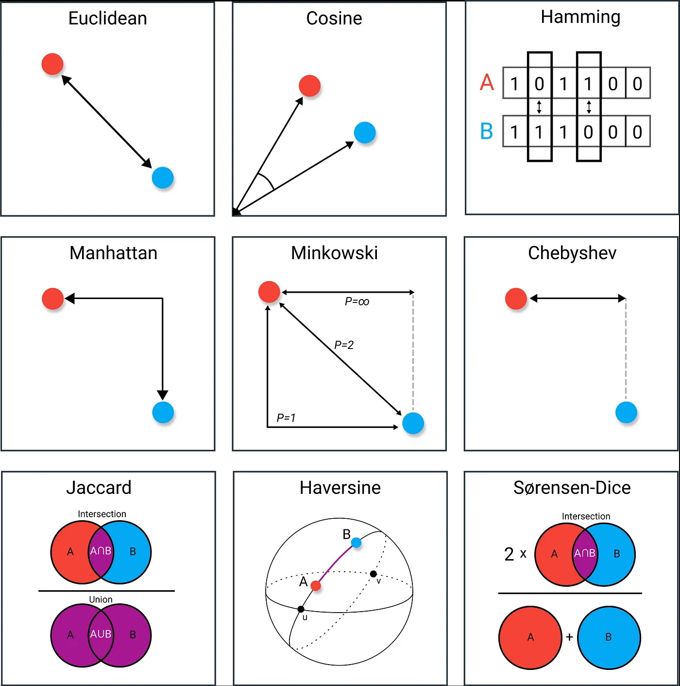
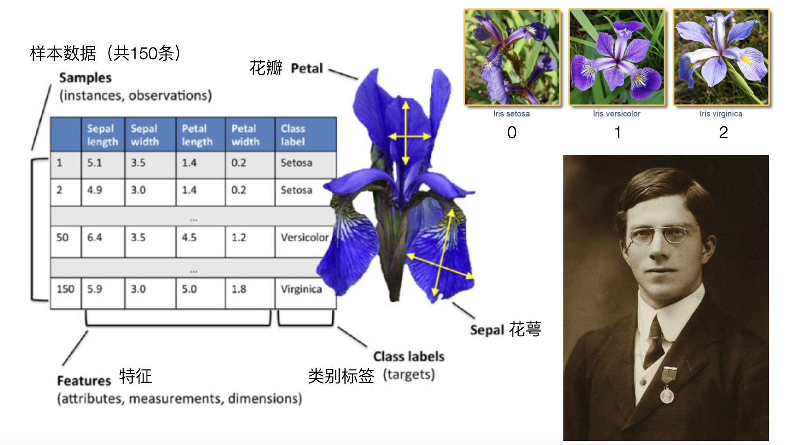
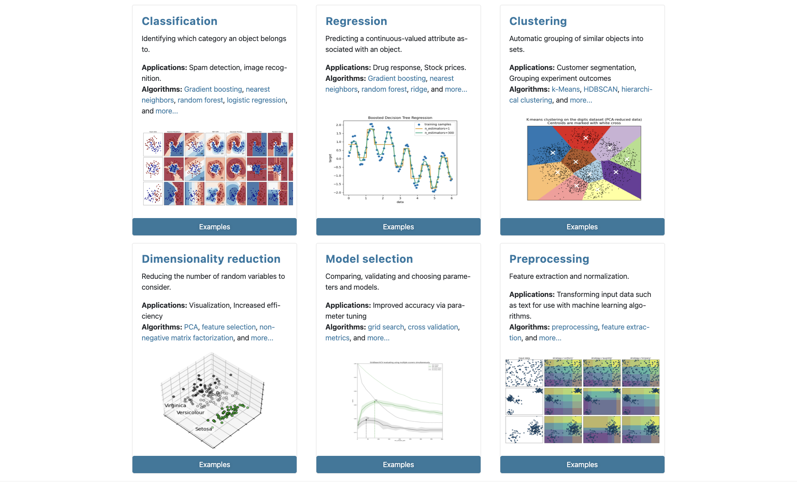
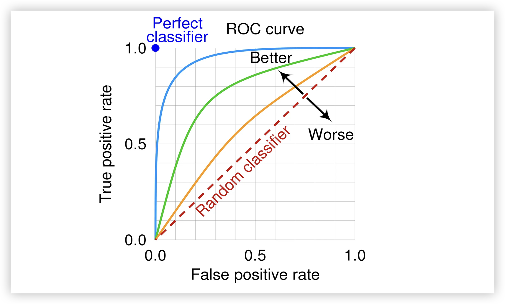
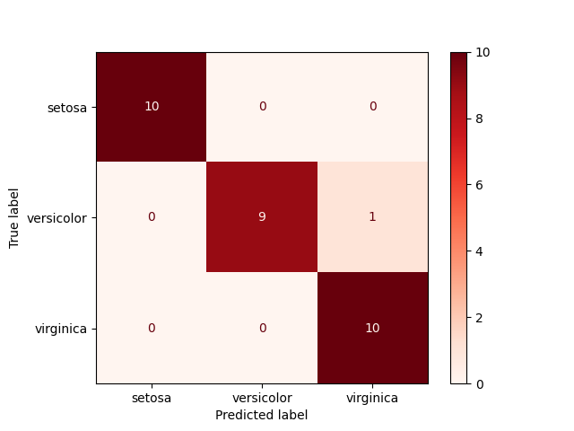
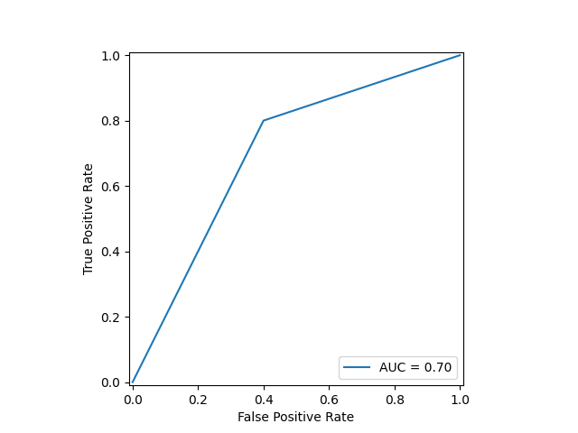
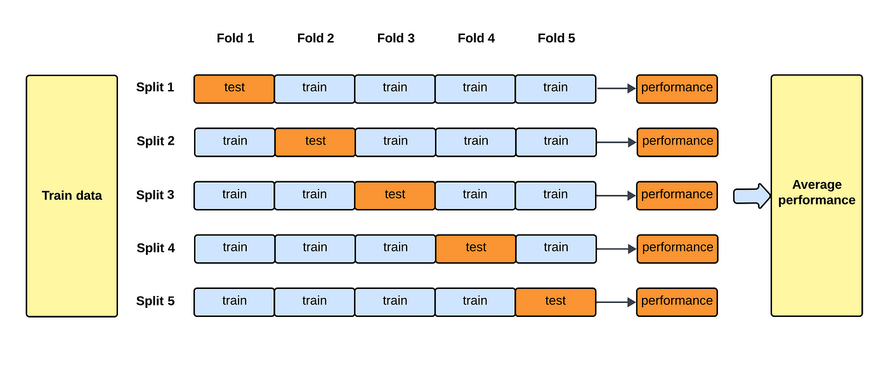
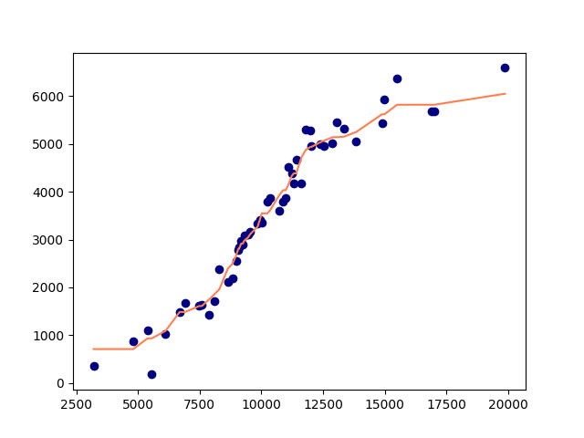

## k最近邻算法

k 最近邻算法（kNN）是一种用于分类和回归的非参数统计方法，由美国统计学家伊芙琳·费克斯和小约瑟夫·霍奇斯于 1951 年提出。kNN 算法的原理是从历史数据中找到$\small{k}$个跟新输入的实例最邻近的实例，根据它们中的多数所属的类别来对新实例进行分类或者输出新实例的目标值，这种算法我们在前面已经为大家做了简单的展示。与主流的机器学习算法不同，k 最近邻算法没有显式的学习训练过程，它用的是“近朱者赤，近墨者黑”这样一种简单朴素的思想来实现分类或回归。k 最近邻算法有两个关键问题，第一个是$\small{k}$值如何选择，即用多少个最近邻来判定新实例所属的类别或确定其目标值；第二个是如何判定两个实例是近还是远，这里就涉及到度量距离的问题。

### 距离的度量

我们可以用距离（distance）来衡量特征空间中两个实例之间的相似度，常用的距离度量包括闵氏距离、马氏距离、余弦距离、编辑距离等。闵氏距离全称闵可夫斯基距离（Minkowski Distance），对于两个$\small{n}$维向量$\small{\bold{x}=(x_{1}, x_{2}, \cdots, x_{n})}$和$\small{\bold{y}=(y_{1}, y_{2}, \cdots, y_{n})}$，它们之间的距离可以定义为：
$$
d(\bold{x}, \bold{y}) = (\sum_{i=1}^{n}{|x_{i} - y_{i}|}^{p})^{\frac{1}{p}}
$$
其中，$\small{p \ge 1}$，虽然$\small{p \lt 1}$可以计算，但不再严格满足距离的定义，通常不被视为真正的距离。

当$\small{p = 1}$时，闵氏距离退化为**曼哈顿距离**，即：
$$
d(\bold{x}, \bold{y}) = \sum_{i=1}^{n}|x_{i} - y_{i}|
$$
当$\small{p = 2}$时，闵氏距离退化为**欧几里得距离**，即：
$$
d(\bold{x}, \bold{y}) = \sqrt{\sum_{i=1}^{n}(x_{i} - y_{i})^{2}}
$$
当$\small{p \to \infty}$时，闵氏距离成为**切比雪夫距离**，即：
$$
d(\bold{x}, \bold{y}) = \underset{i}{max}(|x_{i} - y_{i}|)
$$
其他的距离度量方式我们等用到的时候再为大家介绍。在使用k 最近邻算法做分类时，我们的数据集通常都是数值型数据，此时直接使用欧几里得距离是一个不错的选择。



### 数据集介绍

接下来为大家隆重介绍一下我们后续会使用到的一个重要的数据集——鸢尾花数据集（iris dataset）。鸢尾花数据集是机器学习领域中最著名、最经典的数据集之一，由英国统计学家 *Ronald A. Fisher*于1936年在他的论文*《The Use of Multiple Measurements in Taxonomic Problems》*中首次引入，被广泛用于机器学习算法的入门和实验。



鸢尾花数据集共有150条样本，其中包含3种类型的鸢尾花，分别是山鸢尾（Iris setosa）、多彩鸢尾（Iris versicolor）和为吉尼亚鸢尾（Iris virginica），如上图所示，每种各有50条样本。样本数据包含了4个特征（features）和1个类别标签（class label），4个特征分别是花萼长度（Sepal length）、花萼宽度（Sepal width）、花瓣长度（Petal length）、花瓣宽度（Petal width），都是以厘米为单位的正数，数据集中的类别标签有0、1、2三个值，对应上面提到的三种鸢尾花类型。

#### 数据集的加载

我们可以通过著名的 Python 机器学习库 scikit-learn 来加载这个数据集，scikit-learn 包含了各种分类、回归、聚类算法，同时还提供了多层感知机、支持向量机、随机森林等模型，覆盖了从数据预处理、特征工程到模型训练、模型评估和参数调优等各项功能，如下图所示。我们推荐大家使用这个库来完成机器学习中的各种操作，scikit-learn 的[官方网站](https://scikit-learn.org/stable/)上面还提供了用户指南、API文档和案例等内容，有兴趣的读者可以自行访问。



由于我们后续的课程基本都会用到这个库，大家可以先通过下面的命令安装这个库。

```
pip install scikit-learn
```

如果你已经打开了 IPython 或 Jupyter 但尚未安装 scikit-learn，可以通过下面的魔法指令来安装这个库。

```
%pip install scikit-learn
```

在安装完成之后，我们可以通过下面的代码加载鸢尾花数据集并查看该数据集的介绍。

```Python
from sklearn.datasets import load_iris

# 加载鸢尾花数据集
iris = load_iris()
# 查看数据集的介绍
print(iris.DESCR)
```

接下来，我们可以获得数据集中的特征和标签，代码如下所示。

```python
# 特征（150行4列的二维数组，分别是花萼长、花萼宽、花瓣长、花瓣宽）
X = iris.data
# 标签（150个元素的一维数组，包含0、1、2三个值分别代表三种鸢尾花）
y = iris.target
```

如果希望更直观的查看鸢尾花数据集，我们可以用上面获得的特征和标签来创建一个 DataFrame 对象，有兴趣的读者可以自己试一试。

#### 数据集的划分

通常，我们需要将原始数据划分成训练集和测试集，其中训练集是为了训练模型选择的数据，而测试集则是为了测试模型训练效果保留的数据。对于上面的鸢尾花数据集，我们可以选择80%的数据（120条）作为训练集，保留20%的数据（30条）作为测试集，下面的代码用 NumPy 实现了对数据集的划分。

```python
# 将特征和标签堆叠到同一个数组中
data = np.hstack((X, y.reshape(-1, 1)))
# 通过随机乱序函数将原始数据打乱
np.random.shuffle(data)
# 选择80%的数据作为训练集
train_size = int(y.size * 0.8)
train, test = data[:train_size], data[train_size:]
X_train, y_train = train[:, :-1], train[:, -1]
X_test, y_test = test[:, :-1], test[:, -1]
```

当然，更简便的划分数据集的方式是使用 scikit-learn 封装好的函数`train_test_split`，我们只需要传入特征和标签，指定好`train_size`或`test_size`就可以实现同样的操作。`train_test_split`函数返回一个四元组，四个元素分别代表用于训练的特征、用于训练的标签、用于测试的特征和用于测试的标签。

```python
from sklearn.model_selection import train_test_split

X_train, X_test, y_train, y_test = train_test_split(X, y, train_size=0.8, random_state=3)
```

> **说明**：上面代码中`train_test_split`函数的`random_state`参数可以理解成随机数的种子，如果你使用跟我相同的随机数种子，那么我们划分的训练集和测试集也是完全相同的。

### kNN分类的实现

下面我们先不用 scikit-learn 而是用基础的数据科学库 NumPy 和 SciPy 来实现 kNN 算法，这样做的目的是帮助大家更好的理解算法原理，在此基础上我们再感受 scikit-learn 的强大并明白其中类、函数、参数等为什么要如此设定，相信大家坚持看下去一定能体会到我的良苦用心。

#### 基于NumPy的实现

k 最近邻算法需要计算距离，下面我们先设计计算两个数据点欧式距离的函数，代码如下所示。

```python
import numpy as np


def euclidean_distance(u, v):
    """计算两个n维向量的欧式距离"""
    return np.sqrt(np.sum(np.abs(u - v) ** 2))
```

接下来，我们设计根据邻居的标签为新数据生成标签的函数。

```python
from scipy import stats


def make_label(X_train, y_train, X_one, k):
    """
    根据历史数据中k个最近邻为新数据生成标签
    :param X_train: 训练集中的特征
    :param y_train: 训练集中的标签
    :param X_one: 待预测的样本（新数据）特征
    :param k: 邻居的数量
    :return: 为待预测样本生成的标签（邻居标签的众数）
    """
    # 计算x跟每个训练样本的距离
    distes = [euclidean_distance(X_one, X_i) for X_i in X_train]
    # 通过一次划分找到k个最小距离对应的索引并获取到相应的标签
    labels = y_train[np.argpartition(distes, k - 1)[:k]]
    # 获取标签的众数
    return stats.mode(labels).mode
```

> **说明**：`np.partition`函数可以对数组进行一次划分，将 k 个比较小的元素放在数组的左边，n - k 个比较大的元素放在数组的右边，跟快速排序算法中做一次划分操作的效果是一样的。上面代码中的`np.argpartition`函数是把 k 个较小元素的索引放在数组的左边，这样经过`[:k]`切片操作和对`y_train`的花式索引运算，就可以获得 k 个跟新数据距离较小的样本对应的标签。最后，我们通过 scipy 库的 stats 模块的`mode`函数可以获得标签的众数，并用它作为我们给新数据预测的类别标签。

在完成上述准备工作后，用 k 最近邻做预测的函数就呼之欲出了，代码如下所示。

```python
def predict_by_knn(X_train, y_train, X_new, k=5):
    """KNN算法
    :param X_train: 训练集中的特征
    :param y_train: 训练集中的标签
    :param X_new: 待预测的样本构成的数组
    :param k: 邻居的数量（默认值为5）
    :return: 保存预测结果（标签）的数组
    """
    return np.array([make_label(X_train, y_train, X, k) for X in X_new])
```

我们用上面准备好的鸢尾花数据的训练集和测试集来做实验，看看我们的`predict_by_knn`函数能否很好的运转起来。下面代码中的`y_pred`是我们通过函数预测的30条鸢尾花的类型，我们跟`y_test`做一个比较，就可以看到我们的预测效果。

```python
y_pred = predict_by_knn(X_train, y_train, X_test)
y_pred == y_test
```

我这里的输出是：

```
array([ True,  True,  True,  True,  True,  True,  True,  True,  True,
        True,  True,  True,  True,  True,  True,  True, False,  True,
        True,  True,  True,  True,  True,  True,  True,  True,  True,
        True,  True,  True])
```

输出的结果中有一个`False`，这表示预测的标签跟真实的标签并不相同，是一个错误的预测结果，也就是说我们预测的准确率为$\small{\frac{29}{30} = 96.67 \%}$。当然，如果你划分训练集和测试集时跟我指定的`random_state`参数不相同，这里得到的结果可能会跟我不同。

#### 基于scikit-learn的实现

使用 scikit-learn 来实现 kNN 算法就要简单许多了，我们基本上只需要做三个动作就可以得到想要的结果，代码如下所示。

```python
from sklearn.neighbors import KNeighborsClassifier

# 创建模型
model = KNeighborsClassifier()
# 训练模型
model.fit(X_train, y_train)
# 预测结果
y_pred = model.predict(X_test)
```

我们来看看输出的结果，是不是跟我们自己手撕的代码完全一致。

```python
y_pred == y_test
```

输出：

```
array([ True,  True,  True,  True,  True,  True,  True,  True,  True,
        True,  True,  True,  True,  True,  True,  True, False,  True,
        True,  True,  True,  True,  True,  True,  True,  True,  True,
        True,  True,  True])
```

当然，scikit-learn 库考虑到的东西肯定比我们自己手撕的代码丰富得多，例如我们想知道模型预测的准确率（accuracy），可以使用下面的函数。

```python
model.score(X_test, y_test)
```

输出：

```
0.9666666666666667
```

### 模型评估

当然，评价一个分类器的预测效果是否良好，不能只简单的看一下准确率，因为在类别不平衡的情况下，准确率很可能会误导你的判断。例如，我们的测试数据中维吉尼亚鸢尾花的样本数量非常小，那么即便我们的模型根本无法判断维吉尼亚鸢尾花，模型也会表现出很高的准确率。所以，我们还要考察查准率（精确率）、查全率（召回率）、F1 分数等指标，而**混淆矩阵**则是用于详细展示分类模型性能的工具，适用于二分类和多分类任务，二分类问题的混淆矩阵如下所示。

|      | **预测为正类（Positive）** | **预测为负类（Negative）** |
| ---- | ------------------------- | ------------------------- |
| **实际为正类（Positive）** | True Positive（TP） | False Negative（FN） |
| **实际为负类（Negative）** | False Positive（FP） | True Negative（TN） |

我们举一个例子来说明如何使用混淆矩阵并计算出分类模型的评估指标。假设某种医学检测系统的目标预测是否患有某种疾病，类别“正类”表示“患病”，类别“负类”表示“未患病”，1000个样本的测试结果如下所示。

|      | **预测为患病** | **预测为未患病** |
| ---- | -------------- | ---------------- |
| **实际为患病** | 80（TP） | 20（FN） |
| **实际为未患病** | 30（FP） | 870（TN） |

1. **准确率**（Accuracy）。
    $$
    准确率 = \frac{TP + TN}{TP + FP + FN + TN}
    $$
    上面的例子，模型预测的准确率为：$\small{\frac{80 + 870}{80 + 30 + 20 + 870} = \frac{950}{1000} = 95\%}$。

2. **精确率**（Precesion）。精确率用于衡量在所有被预测为正类的样本中，实际上属于正类的比例，通常也被称为查准率。
    $$
    精确率 = \frac{TP}{TP+FP}
    $$
    上面的例子，模型预测的精确率为：$\small{\frac{80}{80 + 30} = \frac{80}{110} = 72.73\%}$。

3. **召回率**（Recall）。召回率用于衡量在所有实际为正类的样本中，被模型正确预测为正类的比例，通常也被称为查全率或真正例率（True Positive Rate）。
    $$
    召回率 = \frac{TP}{TP + FN}
    $$
    上面的例子，模型预测的召回率为：$\small{\frac{80}{80 + 20} = \frac{80}{100} = 80\%}$。

4. **F1 分数**（F1 Score）。F1 分数是精确率和召回率的调和平均数，它在精确率和召回率之间寻求一个平衡，尤其适用于在两者之间有权衡的情况。
    $$
    F1分数 = \frac{2}{\frac{1}{精确率} + \frac{1}{召回率}} = 2 \times \frac{精确率 \times 召回率}{精确率 + 召回率}
    $$
    上面的例子，模型预测的F1 分数为：$\small{2 \times \frac{0.7273 * 0.8}{0.7273 + 0.8} = 76.19\%}$。

5. **特异度**（Specificity）和**假正例率**（False Positive Rate）。特异度用于衡量的是在所有实际为负类的样本中，被模型正确预测为负类的比例，类似于召回率，只不过针对的是负类样本。
    $$
    特异度 = \frac{TN}{TN + FP}
    $$
    $$
    假正例率 = 1 - 特异度
    $$
    
    上面的例子，模型预测的特异度为：$\small{\frac{870}{870 + 30} = \frac{870}{900} = 96.67\%}$。
    
6. **ROC** 和 **AUC**。

    - **ROC**（Receiver Operating Characteristic Curve）绘制了召回率与假正例率的关系，如下图所示。
    
        
    
    - **AUC**（Area Under the Curve）是 ROC 曲线下的面积，衡量模型区分正类和负类的能力。AUC 值的范围是$\small[0, 1]$，值越接近 1，表示模型区分正负类的能力越强。0.5 < AUC < 1，说明我们的模型优于随机猜测，只要这个分类器（模型）妥善设置阈值的话，就有预测价值。AUC = 0.5，说明我们的模型跟随机猜测一样，模型没有预测价值。AUC < 0.5，模型比随机猜测还差，但只要总能反向预测，它的实际效果就优于随机猜测。

对于多分类问题，混淆矩阵的行数和列数都等于类别数，混淆矩阵是一个方阵，也就是说如果有$\small{n}$个类别，那么混淆矩阵就是一个$\small{n \times n}$的方阵。根据上面我们得到的鸢尾花数据集的预测结果，我们先输出真实值和预测值，然后制作对应的混淆矩阵，如下所示。

```python
print(y_test)
print(y_pred)
```

输出：

```
[0 0 0 0 0 2 1 0 2 1 1 0 1 1 2 0 1 2 2 0 2 2 2 1 0 2 2 1 1 1]
[0 0 0 0 0 2 1 0 2 1 1 0 1 1 2 0 2 2 2 0 2 2 2 1 0 2 2 1 1 1]
```

|      | **预测为类别0（山鸢尾）** | **预测为类别1（多彩鸢尾）** | **预测为类别2（为吉尼亚鸢尾）** |
| :---- | :---------------: | :---------------: | :---------------: |
| **实际为类别0（山鸢尾）** | 10 | 0 | 0 |
| **实际为类别1（多彩鸢尾）** | 0 | 9 | 1 |
| **实际为类别2（吉尼亚鸢尾）** | 0 | 0 | 10 |


我们可以用 scikit-learn 中的`confusion_matrix`和`classification_report`函数来输出混淆矩阵和评估报告，代码如下所示。

```python
from sklearn.metrics import classification_report, confusion_matrix

# 输出分类模型混淆矩阵
print('混淆矩阵: ')
print(confusion_matrix(y_test, y_pred))
# 输出分类模型评估报告
print('评估报告: ')
print(classification_report(y_test, y_pred))
```

输出：

```
混淆矩阵: 
[[10  0  0]
 [ 0  9  1]
 [ 0  0 10]]
评估报告: 
              precision    recall  f1-score   support

           0       1.00      1.00      1.00        10
           1       1.00      0.90      0.95        10
           2       0.91      1.00      0.95        10

    accuracy                           0.97        30
   macro avg       0.97      0.97      0.97        30
weighted avg       0.97      0.97      0.97        30
```

如果希望用可视化的方式输出混淆矩阵，可以使用如下所示的代码。

```python
import matplotlib.pyplot as plt
from sklearn.metrics import ConfusionMatrixDisplay

# 创建混淆矩阵显示对象
cm_display_obj = ConfusionMatrixDisplay(confusion_matrix(y_test, y_pred), display_labels=iris.target_names)
# 绘制并显示混淆矩阵
cm_display_obj.plot(cmap=plt.cm.Reds)
plt.show()
```

> **说明**：其中的`iris.target_names`就是类别标签`0`、`1`、`2`对应的三种鸢尾花的英文名。



对于二分类问题，如果想要绘制出 ROC 曲线并显示 AUC 值，可以使用如下所示的代码。

```python
from sklearn.metrics import roc_curve, auc
from sklearn.metrics import RocCurveDisplay

# 手动构造一组真实值和对应的预测值
y_test_ex = np.array([0, 0, 0, 1, 1, 0, 1, 1, 1, 0])
y_pred_ex = np.array([1, 0, 0, 1, 1, 0, 1, 1, 0, 1])
# 通过roc_curve函数计算出FPR（假正例率）和TPR（真正例率）
fpr, tpr, _ = roc_curve(y_test_ex, y_pred_ex)
# 通过auc函数计算出AUC值并通过RocCurveDisplay类绘制图形
RocCurveDisplay(fpr=fpr, tpr=tpr, roc_auc=auc(fpr, tpr)).plot()
plt.show()
```



### 参数调优

之前我们说过，kNN 算法有两个关键问题，一是距离的度量，二是 k 值的选择。我们使用 scikit-learn 的`KNeighborsClassifier`创建分类器模型时，可以对模型的超参数进行设置，这里有几个比较重要的参数：

1. `n_neighbors`：近邻的数量，就是 kNN 算法中 k 的值。
2. `weights`：可以选择`uniform`或`distance`，前者表示所有样本的权重相同，后者表示距离越近权重越高，默认值是`uniform`。当然，我们也可以通过传入自定义的函数来确定每个样本的权重。
3. `algorithm`：有`auto`、`ball_tree`、`kd_tree`、`brute`四个选项，默认值为`auto`。其中`ball_tree`是一种树形结构，基于球体划分的方法将数据点分配到层次化的树结构中，在高维数据和稀疏数据场景下有较好的性能；`kd_tree`也是一种树形结构，通过选择一个维度将空间划分为若干个子区域再进行搜索，从而避免跟所有的邻居进行比较，对于低维度和空间分布均匀的数据，后者有较好的效果，在高维空间中会遇到的维度灾难问题；`auto`选项是根据输入数据的维度自动选择`ball_tree`或`kd_tree`；`brute`选项则是使用暴力搜索算法（穷举法），再处理小数据集时，它是一个简单且有效的选择。
4. `leaf_size`：使用`ball_tree`或`kd_tree`算法时，该参数用于限制树结构叶子节点最大样本数量，默认值为`30`，该参数会影响树的构建和节点查找的性能。
5. `p`：闵可夫斯基距离公式中的`p`，默认值为2，计算欧氏距离。

我们可以使用**网格搜索**（Grid Search）和**交叉验证**（Cross Validation）的方式对模型的超参数进行调整，评估模型的泛化能力，提升模型的预测效果。网格搜索就是通过穷举法遍历给定的超参数空间，找到最优的超参数组合；交叉验证则是将训练集分成多个子集，通过在不同的训练集和验证集上进行多次训练和评估，对模型的预测效果进行综合评判。K-Fold交叉验证是最常用的交叉验证方法，通过将数据集划分为 K 个子集，每次选取其中一个子集作为验证集，剩下的 K-1 个子集作为训练集，对每个子集重复这个过程，完成 K 次训练和评估并将平均值作为模型的最终性能评估，如下图所示。



下面的代码了 scikit-learn 库中的`GridSearchCV`来做网格搜索和交叉验证，通过这种方式找到针对鸢尾花数据集实施 kNN 算法的最优参数。

```python
from sklearn.model_selection import GridSearchCV

# 网格搜索交叉验证
gs = GridSearchCV(
    KNeighborsClassifier(),
    param_grid={
        'n_neighbors': [1, 3, 5, 7, 9, 11, 13, 15],
        'weights': ['uniform', 'distance'],
        'p': [1, 2]
    },
    cv=5
)
gs.fit(X_train, y_train)
```

可以通过下面的代码获得最优参数及其评分。

```python
print('最优参数:', gs.best_params_)
print('评分:', gs.best_score_)
```

输出：

```
最优参数: {'n_neighbors': 5, 'p': 2, 'weights': 'uniform'}
评分: 0.9666666666666666
```

如果需要使用训练好的最优模型进行预测，可以按照如下所示的代码进行操作。

```python
gs.predict(X_test)
```

### kNN回归

kNN 算法通常用于解决分类问题，当然它也可以用于解决回归问题，其基本思想也是通过找出跟新实例最近的 k 个邻居，然后根据这 k 个邻居的标签（在回归问题中我们通常称之为目标值）来预测新实例的目标值。由于我们需要预测的不是类别标签而是一个数值，所以通常会使用平均或加权平均的方式来处理 k 个邻居的目标值，从而获得对新实例目标值的预测。让我们回到上一课用月收入预测网购支出的那个例子，然后使用 scikit-learn 中的`KNeighborsRegressor`来构建回归模型，我们先做一些准备工作，代码如下所示。

```python
# 每月收入
incomes = np.array([
    9558, 8835, 9313, 14990, 5564, 11227, 11806, 10242, 11999, 11630,
    6906, 13850, 7483, 8090, 9465, 9938, 11414, 3200, 10731, 19880,
    15500, 10343, 11100, 10020, 7587, 6120, 5386, 12038, 13360, 10885,
    17010, 9247, 13050, 6691, 7890, 9070, 16899, 8975, 8650, 9100,
    10990, 9184, 4811, 14890, 11313, 12547, 8300, 12400, 9853, 12890
])
# 每月网购支出
outcomes = np.array([
    3171, 2183, 3091, 5928, 182, 4373, 5297, 3788, 5282, 4166,
    1674, 5045, 1617, 1707, 3096, 3407, 4674, 361, 3599, 6584,
    6356, 3859, 4519, 3352, 1634, 1032, 1106, 4951, 5309, 3800,
    5672, 2901, 5439, 1478, 1424, 2777, 5682, 2554, 2117, 2845,
    3867, 2962,  882, 5435, 4174, 4948, 2376, 4987, 3329, 5002
])
X = np.sort(incomes).reshape(-1, 1)  # 将收入排序后处理成二维数组
y = outcomes[np.argsort(incomes)]    # 将网购支出按照收入进行排序
```

> **说明**：即便只有一个特征，我们也需要将自变量处理二维数组的形式，因为我们训练模型时使用的`fit`方法并不能接受一维数组作为它的第一个参数。这里提前对 X 和 y 排序是为了待会绘制散点图和折线图的时候根据 X 的值从小到大依次绘制。

接下来，我们创建 kNN 回归模型。

```python
from sklearn.neighbors import KNeighborsRegressor

# 创建模型
model = KNeighborsRegressor()
# 训练模型
model.fit(X, y)
# 预测结果
y_pred = model.predict(X)
```

上面我们直接用所有的历史数据进行模型训练，然后通过绘制下面的图形来看看预测效果到底如何。

```python
# 原始数据散点图
plt.scatter(X, y, color='navy')
# 预测结果折线图
plt.plot(X, y_pred, color='coral')
plt.show()
```



kNN 回归模型计算复杂度较高，而且对噪声数据非常敏感，在很多时候它可能并不是一个很好的选择。当然，如何评估一个回归模型的效果，这个问题我们留到后续的章节再为大家进行讲解。

### 总结

kNN 算法是一种简单但不失强大的机器学习算法，适用于小数据集上的分类和回归任务，它的优点是简单易懂，没有显示的训练过程，不依赖于对数据分布的假设，可以适应复杂的数据模式。当然，kNN 算法的缺点也非常明显，最大的问题在于计算效率，所以在数据集较大时可能并不是最好的选择。除此以外，kNN 算法对噪声非常敏感，同时预测结果依赖于 k 的取值和样本是否均衡（各个类别的样本数量是否大致相等），k 值过小可能导致过拟合，k值过大又可能导致欠拟合，而不均衡的样本可能会导致类别偏倚（Class Imbalance Bias），也就是说，如果大部分训练样本都属于类别 A，而类别 B 样本较少，那么在分类时，KNN 更容易将测试样本预测为类别 A。
