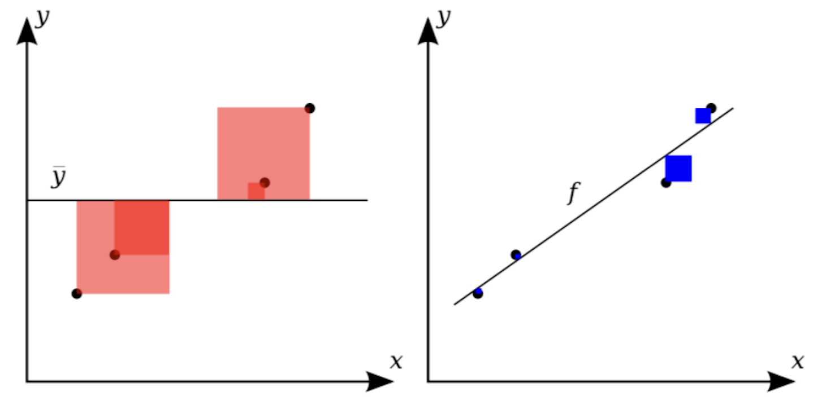
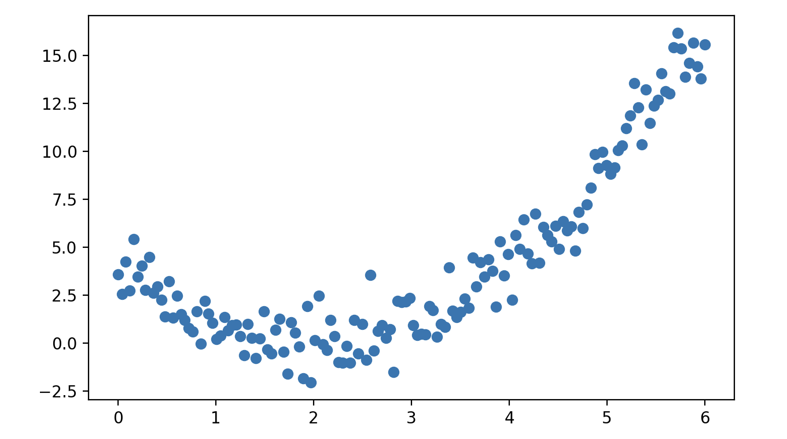
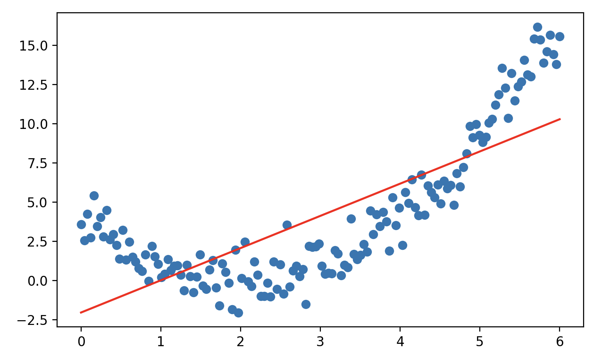
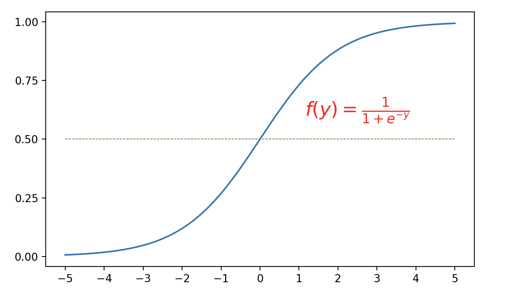

## 回归模型

回归模型是机器学习和统计学中的一种基本模型，用于预测连续型输出变量。简单的说，给定一组输入变量（自变量）和对应的输出变量（因变量），回归模型旨在找到输入变量和输出变量之间的映射关系。回归模型的形式可能比较简单，但它确包含了机器学习中最主要的建模思想。通常，我们建立回归模型主要有两个目标：

1. **描述数据之间的关系**。我们之前讲过**机器学习的关键就是要通过历史数据掌握如何从特征映射到目标值**，这个过程不需要我们事先设置任何的规则，而是让机器通过对历史数据的学习来获得。回归模型可以帮助我们通过模型表达输入和输出之间的关系。
2. **对未知数据做出预测**。通过学习到的映射关系，模型可以对新的输入数据进行预测。

回归模型的应用非常广泛，我们为大家举几个具体的例子：

1. **零售行业**。全球最大的电商平台亚马逊（Amazon）会根据历史销量、商品属性（价格、折扣、品牌、类别等）、时间特征（季节、工作日、节假日等）、外部因素（天气、社媒等）等特征创建回归模型预测未来一段时间内不同商品的需求量。在促销活动期间，会使用多元回归结合交互项来分析促销对销量的影响。
2. **汽车行业**。为了优化电池的充电策略，延长电池的使用寿命，为电车用户提供更准确的电量预警，特斯拉（Tesla）使用回归模型，通过电池充放电次数、环境温度、放电深度、电池物理参数等建立回归模型，预测电池的剩余寿命。
3. **房地产行业**。美国最大的在线房地产平台 Zillow 曾经使用回归模型帮助用户评估房屋的价值，通过房屋的面积、房龄、地理位置、房屋类型、社区安全等级、学校评分等对房屋的市场价格做出预测。

### 回归模型的分类

根据模型的复杂程度和假设，回归模型可以分为以下几类：

1. **线性回归**（Linear Regression）：假设输入变量和输出变量之间是线性关系。

    - 一元线性回归：建立一个因变量与单个自变量之间线性关系的模型。
        $$
        y = \beta_0 + \beta_1 x + \varepsilon
        $$
        其中，$\small{y}$ 是目标变量（因变量），$\small{x}$ 是输入变量（自变量），$\small{\beta_{0}}$ 是截距，表示$\small{x=0}$ 时的预测值，$\small{\beta_{1}}$ 是回归系数（斜率），表示输入变量对输出变量影响的大小，$\small{\varepsilon}$ 是误差项，用于表示数据中的随机噪声或无法解释的部分。

    - 多元线性回归：建立一个因变量与多个自变量之间线性关系的模型。
        $$
        y = \beta_{0} + \beta_{1} x_{1} + \beta_{2} x_{2} + \cdots + \beta_{n} x_{n} + \varepsilon
        $$
        上面的公式也可以用向量的形式简化表示为：
        $$
        y = \mathbf{x}^{T} \mathbf{\beta} + \varepsilon
        $$
        其中，$\small{\mathbf{x} = [1, x_{1}, x_{2}, \dots, x_{n}]^{T}}$ 是包含截距的输入向量，$\small{\mathbf{\beta} = [\beta_{0}, \beta_{1}, \beta_{2}, \dots, \beta_{n}]^{T}}$ 是模型参数（包括截距 $\small{\beta_{0}}$ 和回归系数 $\small{\beta_{1}, \beta_{2}, \cdots, \beta_{n}}$），$\small{\varepsilon}$ 是误差项。

2. **多项式回归**（Polynomial Regression）：引入高阶特征，使模型能拟合更复杂的非线性关系，属于线性模型的扩展，因为因为它对参数 $\small{\beta}$ 的求解仍然是线性形式，如下面所示的二次关系：
    $$
    y = \beta_{0} + \beta_{1} x + \beta_{2} x^{2} + \varepsilon
    $$

3. **非线性回归**（Nonlinear Regression）：非线性回归完全放弃了线性假设，模型形式可以是任意非线性函数。

4. **岭回归**（Ridge Regression）、**套索回归**（Lasso Regression）、**弹性网络回归**（Elastic Net Regression）：在线性回归基础上加入正则化项，用于处理过拟合、多重共线性和特征筛选问题。

5. **逻辑回归**（Logistic Regression）：逻辑回归虽然名字中带“回归”，但实际上是用于分类问题的模型。它通过 Sigmoid 函数将线性组合的输入值映射到区间$\small{(0, 1)}$，表示分类概率，适用于二分类问题；也可以扩展为 Softmax 回归，解决多分类问题。
    $$
    P(y=1|x) = \frac{1}{1 + e^{-(\beta_{0} + \beta_{1} x_{1} + \cdots + \beta_{n} x_{n})}}
    $$

### 回归系数的计算

建立回归模型的关键是找到最佳的回归系数 $\small{\mathbf{\beta}}$，所谓最佳回归系数是指让模型对数据的拟合效果达到最好的模型参数，即能够最小化模型的预测值 $\small{\hat{y}_{i}}$ 与实际观测值 $\small{y_{i}}$ 之间差异的模型参数。为此，我们先定义如下所示的损失函数。
$$
L(\mathbf{\beta}) = \sum_{i=1}^{m}(y_{i} - \hat{y}_{i})^{2}
$$
其中，$\small{m}$表示样本容量，代入回归模型，有：
$$
L(\mathbf{\beta}) = \sum_{i=1}^{m}(y_{i} - \mathbf{x}_{i}^{T}\mathbf{\beta})^{2}
$$
如果用矩阵形式表示，有：	
$$
L(\mathbf{\beta}) = (\mathbf{y} - \mathbf{X\beta})^{T}(\mathbf{y} - \mathbf{X\beta})
$$
其中，$\mathbf{y}$ 是目标值的向量，大小为 $\small{m \times 1}$，$\mathbf{X}$ 是特征矩阵，大小为 $\small{m \times n}$，$\small{\mathbf{\beta}}$ 是回归系数的向量，大小为 $\small{n \times 1}$。

通过最小化损失函数 $\small{L(\mathbf{\beta})}$，我们可以得到线性回归模型的解析解。对 $\small{L(\mathbf{\beta})}$ 求导并令其为 0，有：
$$
\frac{\partial{L(\mathbf{\beta})}}{\partial{\mathbf{\beta}}} = -2\mathbf{X}^{T}(\mathbf{y} - \mathbf{X\beta}) = 0
$$
整理后得到：
$$
\mathbf{\beta} = (\mathbf{X}^{T}\mathbf{X})^{-1}\mathbf{X}^{T}\mathbf{y}
$$
对于矩阵 $\small{\mathbf{X}^{T}\mathbf{X}}$ 不满秩的情况，可以通过添加正则化项的方式使得矩阵可逆，如下所示，这个就是线性回归的解析解。
$$
\mathbf{\beta} = (\mathbf{X}^{T}\mathbf{X} + \mathbf{\lambda \mit{I}})^{-1}\mathbf{X}^{T}\mathbf{y}
$$
> **说明**：如果你对这里提到的正则化不理解可以先放放，后面我们再来讨论这个问题。

上述方法适用于小规模数据集，当数据体量不大（样本和特征数量较少）时，计算效率是没有问题的。对于大规模数据集或更为复杂的优化问题，我们可以使用**梯度下降法**，通过迭代更新参数来逐步逼近最优解。梯度下降法的目标也是最小化损失函数，该方法通过计算梯度方向进行参数更新。梯度是一个向量，包含了目标函数在各个参数方向上的偏导数。对于上面的损失函数 $\small{L(\mathbf{\beta})}$，梯度可以表示为：
$$
\nabla L(\mathbf{\beta}) = \left[ \frac{\partial{L}}{\partial{\beta_{1}}},  \frac{\partial{L}}{\partial{\beta_{2}}}, \cdots,  \frac{\partial{L}}{\partial{\beta_{n}}} \right]
$$
梯度下降法通过以下更新规则来更新参数 $\small{\mathbf{\beta}}$：
$$
\mathbf{\beta}^{\prime} = \mathbf{\beta} - \alpha \nabla L(\mathbf{\beta}) \\
\mathbf{\beta} = \mathbf{\beta^{\prime}}
$$
其中，$\small{\alpha}$​ 是学习率（step size），通常是一个较小的正数，用于控制每次更新的幅度。如果学习率 $\small{\alpha}$ 选择得当，梯度下降法将收敛到目标函数的局部最小值。如果学习率过大，可能导致震荡不收敛；如果学习率过小，则收敛的速度缓慢，需要更多次的迭代。

### 新数据集介绍

之前介绍的鸢尾花数据集并不适合讲解回归模型，为此我们引入另一个经典的汽车 MPG 数据集。汽车 MPG 数据集最初由美国汽车协会提供，我们可以通过该数据集预测车辆的燃油效率，即每加仑燃料行驶的里程（Miles Per Gallon, MPG）。需要注意的是，scikit-learn 库没有内置该数据集，我们可以直接从 [UCI 机器学习仓库](https://archive.ics.uci.edu/dataset/9/auto+mpg) 网站下载数据集，也可以通过执行下面的代码联网加载该数据集。

```python
import ssl
import pandas as pd

ssl._create_default_https_context = ssl._create_unverified_context
df = pd.read_csv('https://archive.ics.uci.edu/static/public/9/data.csv')
df.info()
```

输出：

```
<class 'pandas.core.frame.DataFrame'>
RangeIndex: 398 entries, 0 to 397
Data columns (total 9 columns):
 #   Column        Non-Null Count  Dtype  
---  ------        --------------  -----  
 0   car_name      398 non-null    object 
 1   cylinders     398 non-null    int64  
 2   displacement  398 non-null    float64
 3   horsepower    392 non-null    float64
 4   weight        398 non-null    int64  
 5   acceleration  398 non-null    float64
 6   model_year    398 non-null    int64  
 7   origin        398 non-null    int64  
 8   mpg           398 non-null    float64
dtypes: float64(4), int64(4), object(1)
memory usage: 28.1+ KB
```

根据上面的输出，我们简单介绍下数据集的九个属性，前面八个都是输入变量（第一个暂不使用），最后一个是输出变量，具体如下表所示。

| 属性名称       | 描述                                                         |
| -------------- | ------------------------------------------------------------ |
| *car_name*     | 汽车的名称，字符串，这个属性对建模暂时没有帮助               |
| *cylinders*    | 气缸数量，整数                                               |
| *displacement* | 发动机排量（立方英寸），浮点数                               |
| *horsepower*   | 马力，浮点数，有空值需要提前处理                             |
| *weight*       | 汽车重量（磅），整数                                         |
| *acceleration* | 加速（0 - 60 mph所需时间），浮点数                           |
| *model_year*   | 模型年份（1970年 - 1982年），这里用的是两位的年份            |
| *origin*       | 汽车来源（1 = 美国, 2 = 欧洲, 3 = 日本），这里的`1`、`2`、`3`应该视为三种类别而不是整数 |
| *mpg*          | 车辆的燃油效率，每加仑行驶的里程（目标变量）                 |

我们先删除`car_name`这个暂时用不上的属性，然后使用`DataFrame`对象的`corr`方法检查输入变量（特征）与输出变量（目标值）之间是否存在相关性。通过相关性分析我们可以选择相关性强的特征，剔除掉那些与目标值相关性较弱的特征，这有助于减少模型的复杂性和过拟合的风险。在多元回归中，多重共线性（即输入变量之间高度相关）可能会影响回归系数的估计，导致模型不稳定。可以通过计算特征之间的相关性和方差膨胀因子（VIF）等来检测共线性问题。

```python
# 删除指定的列
df.drop(columns=['car_name'], inplace=True)
# 计算相关系数矩阵
df.corr()
```

> **说明**：`DataFrame`对象的`corr`方法默认计算皮尔逊相关系数，皮尔逊相关系数适合来自于正态总体的连续值，对于等级数据之间相关性的判定，可以通过修改`method`参数为`spearmean`或`kendall`来计算斯皮尔曼秩相关或肯德尔系数。当然，连续值也可以通过分箱操作处理成等级数据，然后再进行相关性的判定。

在使用该数据集建模之前，我们需要做一些准备工作，首先处理掉`horsepower`字段的空值，然后将`origin`字段处理成**独热编码**（One-Hot Encoding）。独热编码是一种用于处理分类变量的常见编码方式，通常分类数据（如性别、颜色、季节等）无法直接输入机器学习模型进行训练，因为大多数算法只能处理数值数据。独热编码通过将每个分类变量转换为若干个新的二元特征（`0`或` 1`）来表示，从而使得这些变量可以输入到机器学习模型中。假设我们有一个叫“颜色”的特征列，可能的取值有`红色`、`绿色`和`蓝色`，我们可以将其通过独热编码转换成三个二元特征，如下表所示：

| 红色  | 绿色 | 蓝色 |
| :--: | :--: | :--: |
| 1    | 0    | 0    |
| 0    | 1    | 0    |
| 0    | 0    | 1    |
| 0    | 1    | 0    |
| 1    | 0    | 0    |

> **说明**：我们也可以只保留绿色和蓝色两个列，如果两个列的取值都为`0`，那么说明我们的颜色是红色。

独热编码方法简单直观，容易理解和实现。对于无序类别独热编码是非常有效的，因为它不会引入任何虚假的顺序关系，处理后的数据类型是数值型的，很多机器学习算法都能很好的处理。当然，如果类别特征有大量不同的类别取值，独热编码会生成大量的新特征，可能导致数据的维度大幅增加，从而影响计算性能和存储效率，尤其是在数据中有很多稀疏类别时。

下面的代码实现了对数据的预处理。

```python
# 删除有缺失值的样本
df.dropna(inplace=True)
# 将origin字段处理为类别类型
df['origin'] = df['origin'].astype('category') 
# 将origin字段处理为独热编码
df = pd.get_dummies(df, columns=['origin'], drop_first=True)
df
```

输出：

```
     cylinders  displacement  horsepower  weight  ...  model_year   mpg  origin_2  origin_3
0            8         307.0       130.0    3504  ...          70  18.0     False     False
1            8         350.0       165.0    3693  ...          70  15.0     False     False
2            8         318.0       150.0    3436  ...          70  18.0     False     False
3            8         304.0       150.0    3433  ...          70  16.0     False     False
4            8         302.0       140.0    3449  ...          70  17.0     False     False
..         ...           ...         ...     ...  ...         ...   ...       ...       ...
393          4         140.0        86.0    2790  ...          82  27.0     False     False
394          4          97.0        52.0    2130  ...          82  44.0      True     False
395          4         135.0        84.0    2295  ...          82  32.0     False     False
396          4         120.0        79.0    2625  ...          82  28.0     False     False
397          4         119.0        82.0    2720  ...          82  31.0     False     False

[392 rows x 9 columns]
```

> **说明**：上面调用 pandas 的`get_dummies`函数将`origin`列处理成了独热编码，由于将`drop_first`参数设置为`True`，所以原来的取值`1`、`2`、`3`只保留了两个列，分别叫`origin_2`和`origin_3`。Scikit-learn 库中`preprocessing`模块的`OneHotEncoder`也支持将类别特征处理成独热编码。

接下来，我们还是将数据集拆分为训练集和测试集，代码如下所示。

```python
from sklearn.model_selection import train_test_split

X, y = df.drop(columns='mpg').values, df['mpg'].values
X_train, X_test, y_train, y_test = train_test_split(X, y, train_size=0.8, random_state=3)
```

### 线性回归代码实现

我们首先使用 scikit-learn 库`linear_model`模块的`LinearRegression`来创建线性回归模型，`LinearRegression`使用最小二乘法计算回归模型的参数，代码如下所示。

```python
from sklearn.linear_model import LinearRegression

model = LinearRegression()
model.fit(X_train, y_train)
y_pred = model.predict(X_test)
```

如果想查看线性回归模型的参数（回归系数和截距），可以通过下面的代码来实现。

```python
print('回归系数:', model.coef_)
print('截距:', model.intercept_)
```

输出：

```
回归系数: [-0.70865621  0.03138774 -0.03034065 -0.0064137   0.06224274  0.82866534
  3.20888265  3.68252848]
截距: -21.685482718950933
```

### 回归模型的评估

回归模型的预测效果到底如何，我们可以通过下面的指标对其进行评估。

1. 均方误差（Mean Squared Error, MSE）。MSE 是回归模型最常用的评估指标之一，定义为预测值与真实值误差的平方平均值。
    $$
    \text{MSE} = \frac{1}{m} \sum_{i=1}^{m}(y_{i} - \hat{y}_{i})^{2}
    $$
    
2. 均方根误差（Root Mean Squared Error, RMSE）。RMSE 是 MSE 的平方根形式，用于更直观地衡量误差的实际尺度（单位与目标变量一致）。
    $$
    \text{RMSE} = \sqrt{\text{MSE}} = \sqrt{\frac{1}{m} \sum_{i=1}^{m}(y_{i} - \hat{y}_{i})^{2}}
    $$
    
3. 平均绝对误差（Mean Absolute Error, MAE）。MAE 是另一个常用的误差度量指标，定义为预测值与真实值误差的绝对值平均值。
    $$
    \text{MAE} = \frac{1}{m} \sum_{i=1}^{m}|y_{i} - \hat{y}_{i}|
    $$
    
4. 决定系数（R-Squared, $\small{R^2}$）。$\small{R^2}$ 是一个相对指标，用于衡量模型对数据的拟合程度，其值越接近 1 越好。$\small{R^2}$ 的计算公式为：
    $$
    R^{2} = 1 - \frac{\text{SS}_{\text{res}}}{\text{SS}_{\text{tot}}}
    $$
    其中，$\small{\text{SS}_{\text{res}} = \sum_{i=1}^{m}(y_{i} - \hat{y}_{i})^2}$ 为残差平方和，$\small{\text{SS}_{\text{tot}} = \sum_{i=1}^{m} (y_{i} - \bar{y})^{2}}$ 为总平方和，如下图所示。下图左边红色正方形的面积之和代表总平方和，右边蓝色正方形的面积之和代表残差的平方和，很显然，模型拟合的效果越好，$\small{\frac{\text{SS}_{\text{res}}}{\text{SS}_{\text{tot}}}}$的值就越接近 0，$\small{R^{2}}$的值就越接近 1。通常$\small{R^{2} \ge 0.8}$时，我们认为模型的拟合效果已经很不错了。
    
    

可以使用 scikit-learn 中封装好的函数计算出均方误差、平均绝对误差和$\small{R^{2}}$的值，代码如下所示。

```python
from sklearn.metrics import mean_absolute_error, mean_squared_error, r2_score

mse = mean_squared_error(y_test, y_pred)
mae = mean_absolute_error(y_test, y_pred)
r2 = r2_score(y_test, y_pred)

print(f'均方误差: {mse:.4f}')
print(f'平均绝对误差: {mae:.4f}')
print(f'决定系数: {r2:.4f}')
```

输出：

```
均方误差: 13.1215
平均绝对误差: 2.8571
决定系数: 0.7848
```

### 引入正则化项

岭回归是在线性回归的基础上引入 $\small{L2}$ 正则化项，目的是防止模型过拟合，尤其是当特征数较多或特征之间存在共线性时。岭回归的损失函数如下所示：
$$
L(\mathbf{\beta}) = \sum_{i=1}^{m}(y_{i} - \hat{y}_{i})^{2} + \lambda \sum_{j=1}^{n}\beta_{j}^{2}
$$
其中，$\small{L2}$ 正则化项 $\small{\lambda \sum_{j=1}^{n} \beta_{j}^{2}}$ 会惩罚较大的回归系数，相当于缩小了回归系数的大小，但不会使系数为 0（即不会进行特征选择）。可以通过 scikit-learn 库`linear_model`模块的`Ridge`类实现岭回归，代码如下所示。

```python
from sklearn.linear_model import Ridge

model = Ridge()
model.fit(X_train, y_train)
y_pred = model.predict(X_test)
print('回归系数:', model.coef_)
print('截距:', model.intercept_)
mse = mean_squared_error(y_test, y_pred)
r2 = r2_score(y_test, y_pred)
print(f'均方误差: {mse:.4f}')
print(f'决定系数: {r2:.4f}')
```

输出：

```
回归系数: [-0.68868217  0.03023126 -0.0291811  -0.00642523  0.06312298  0.82583962
  3.04105754  3.49988826]
截距: -21.390402697674855
均方误差: 12.9604
决定系数: 0.7874
```

套索回归引入 $\small{L1}$ 正则化项，不仅防止过拟合，还具有特征选择的功，特别适用于高维数据。套索回归的损失函数如下所示：
$$
L(\mathbf{\beta}) = \sum_{i=1}^{m}(y_{i} - \hat{y}_{i})^{2} + \lambda \sum_{j=1}^{n}|\beta_{j}|
$$
其中，$\small{L1}$ 正则化项 $\small{\lambda \sum_{j=1}^{n}|\beta_{j}|}$ 会将某些不重要的回归系数缩减为 0，从而实现特征选择。可以通过 scikit-learn 库`linear_model`模块的`Lasso`类实现套索回归，代码如下所示。

```python
from sklearn.linear_model import Lasso

model = Lasso()
model.fit(X_train, y_train)
y_pred = model.predict(X_test)
print('回归系数:', model.coef_)
print('截距:', model.intercept_)
mse = mean_squared_error(y_test, y_pred)
r2 = r2_score(y_test, y_pred)
print(f'均方误差: {mse:.4f}')
print(f'决定系数: {r2:.4f}')
```

输出：

```
回归系数: [-0.00000000e+00  4.46821248e-04 -1.22830326e-02 -6.29725191e-03
  0.00000000e+00  6.91590631e-01  0.00000000e+00  0.00000000e+00]
截距: -9.109888229245005
均方误差: 11.1035
决定系数: 0.8179
```

> **注意**：上面代码运行结果中的回归系数，有四个特征的回归系数被设置为 0，相当于从 8 个特征中选出了 4 个重要的特征。模型的拟合效果是优于之间的回归模型的，这一点从均方误差和决定系数可以看出。

弹性网络回归结合了岭回归和套索回归的优点，通过同时引入 $\small{L1}$ 和 $\small{L2}$ 正则化项，适用于高维数据且特征之间存在相关的情况，其损失函数如下所示：
$$
L(\mathbf{\beta}) = \sum_{i=1}^{m}(y_{i} - \hat{y}_{i})^{2} + \alpha \lambda \sum_{j=1}^{n}|\beta_{j}| + (1 - \alpha) \lambda \sum_{j=1}^{n}\beta_{j}^{2}
$$
其中，$\small{\alpha}$ 是控制 $\small{L1}$ 和 $\small{L2}$ 正则化的权重比例。

### 线性回归另一种实现

上面我们提到过，除了最小二乘法我们还可以使用梯度下降法来求解回归模型的参数，scikit-learn 库`linear_model`模块的`SGDRegressor`就使用了这种方法，SGD 就是 Stochastic Gradient Descent 的缩写。随机梯度下降每次迭代只使用一个随机样本来计算梯度，计算速度快，适合大规模数据集，而且可以跳出局部最优解。需要注意的是它的学习率，如果学习率设置得不合理，它的收敛性可能会发生波动，通常需要使用学习率衰减策略来促进收敛。此外，随机梯度下降对特征的尺度非常敏感，通常需要在训练之前对特征进行标准化或归一化处理，完整的代码如下所示。

```python
from sklearn.linear_model import SGDRegressor
from sklearn.preprocessing import StandardScaler

# 对特征进行选择和标准化处理
scaler = StandardScaler()
scaled_X = scaler.fit_transform(X[:, [1, 2, 3, 5]])
# 重新拆分训练集和测试集
X_train, X_test, y_train, y_test = train_test_split(scaled_X, y, train_size=0.8, random_state=3)

# 模型的创建、训练和预测
model = SGDRegressor()
model.fit(X_train, y_train)
y_pred = model.predict(X_test)
print('回归系数:', model.coef_)
print('截距:', model.intercept_)

# 模型评估
mse = mean_squared_error(y_test, y_pred)
r2 = r2_score(y_test, y_pred)
print(f'均方误差: {mse:.4f}')
print(f'决定系数: {r2:.4f}')
```

输出：

```
回归系数: [-0.25027084 -0.41349219 -4.9559786   2.83009217]
截距: [23.48707219]
均方误差: 11.3853
决定系数: 0.8133
```

这里，我们还需要强调一下`SGDRegressor`构造函数几个重要的参数，也是回归模型比较重要的超参数，如下所示：

1. `loss`：指定优化目标（损失函数），默认值为`'squared_error'`（最小二乘法），其他可以选择的值有：`'huber'`、`'epsilon_insensitive'` 和 `'squared_epsilon_insensitive'`，其中`'huber'`适用于对异常值更鲁棒的回归模型。

2. `penalty`：指定正则化方法，用于防止过拟合，默认为`'l2'`（L2 正则化），其他可以选择的值有：`'l1'`（L1正则化）、`'elasticnet'`（弹性网络，L1 和 L2 的组合）、`None`（不使用正则化）。

3. `alpha`：正则化强度的系数，控制正则化项的权重，默认值为`0.0001`。较大的 `alpha` 值会加重正则化的影响，从而限制模型复杂度；较小的值会让模型更关注训练数据的拟合。
4. `l1_ratio`：当 `penalty='elasticnet'` 时，控制 L1 和 L2 正则化之间的权重，默认值为`0.15`，取值范围为`[0, 1]`（`0` 表示完全使用 L2，`1` 表示完全使用 L1）。
5. `tol`：优化算法的容差，即判断收敛的阈值，默认值为`1e-3`。当目标函数的改变量小于 `tol` 时，训练会提前终止；如果希望训练更加精确，可以适当降低 `tol`。
6. `learning_rate`：指定学习率的调节策略，默认值为`'constant'`，表示使用固定学习率，具体的值由 `eta0` 指定；其他可选项包括：
    - `'optimal'`：基于公式`eta = 1.0 / (alpha * (t + t0))`自动调整。
    - `'invscaling'`：按 `eta = eta0 / pow(t, power_t)` 缩放学习率。
    - `'adaptive'`：动态调整，误差减少时保持当前学习率，否则减小学习率。

7. `eta0`：初始学习率，默认值为`0.01`，当 `learning_rate='constant'` 或其他策略使用时，`eta0` 决定了初始更新步长。
8. `power_t`：当 `learning_rate='invscaling'` 时，控制学习率衰减速度，默认值为`0.25`。较小的值会让学习率下降得更慢，从而更长时间地关注全局优化。
9. `early_stopping`：是否启用早停机制，默认值为`False`。如果设置为 `True`，模型会根据验证集性能自动停止训练，防止过拟合。
10. `validation_fraction`：指定用作验证集的训练数据比例，默认值为`0.1`。当 `early_stopping=True` 时，该参数会起作用。
11. `max_iter`：训练的最大迭代次数，默认值为`1000`。当数据较大或学习率较小时，可能需要增加迭代次数以保证收敛。
12. `shuffle`：是否在每个迭代轮次开始时打乱训练数据，默认值为`True`，表示打乱数据。打乱数据有助于提高模型的泛化能力。
13. `warm_start`：是否使用上次训练的参数继续训练，默认值为`False`。当设置为 `True` 时，可以在已有模型的基础上进一步优化。
14. `verbose`：控制训练过程的日志输出，默认值为`0`，可以设置为更高值以观察训练进度。

### 多项式回归

有的时候，我们关心的自变量和因变量之间并不是简单的线性关系，例如广告投入与销售额增长的关系、设备的使用时间与故障率之间的关系等。除此以外，如果数据中存在明显的拐点或者要通过简单的公式来近似某些复杂的现象，线性回归模型可能并不能满足这样的需求，这个时候我们就需要建立多项式回归模型。

下面我们用一个简单的例子对多项式回归加以说明，我们先生成一组数据点并绘制出对应的散点图，代码如下所示。

```python
import numpy as np
import matplotlib.pyplot as plt

x = np.linspace(0, 6, 150)
y = x ** 2 - 4 * x + 3 + np.random.normal(1, 1, 150)
plt.scatter(x, y)
plt.show()
```

输出：



显然，这样的一组数据点是很难通过线性模型进行拟合的，下面的代码可以证明这一点。

```Python
x_ = x.reshape(-1, 1)

model = LinearRegression()
model.fit(x_, y)
a, b = model.coef_[0], model.intercept_
y_pred = a * x + b
plt.scatter(x, y)
plt.plot(x, y_pred, color='r')
plt.show()
```

输出：



很显然，这是一个欠拟合的结果。我们再看看 $\small{R^{2}}$ 的值：

```python
r2 = r2_score(y, y_pred)
print(f'决定系数: {r2:.4f}')
```

输出：

```
决定系数: 0.5933
```

Scikit-learn 库`preprocessing`模块中的`PolynomialFeatures`类可以将原始特征扩展为多项式特征，从而将线性模型转换为具有高次项的模型。创建`PolynomialFeatures`对象时有几个重要的参数：

1. `degree`：设置多项式的最高次项。例如，`degree=3` 会生成包含一次项、二次项和三次项的特征。
2. `interaction_only`：默认值为`False`，如果设置为`True`，则只生成交互项（如$\small{x_{1}x_{2}}$），不生成单独的高次项（如$\small{x_{1}^{2}}$、$\small{x_{2}^{2}}$）。
3. `include_bias`：默认值为`True`，表示包括常数项（通常为 1），设置为`False`则不包括常数项。

下面我们通过代码来演示如何通过`PolynomialFeatures`类进行特征预处理，实现多项式回归。

```python
from sklearn.preprocessing import PolynomialFeatures

poly = PolynomialFeatures(degree=2)
x_ = poly.fit_transform(x_)

model = LinearRegression()
model.fit(x_, y)
y_pred = model.predict(x_)
r2 = r2_score(y, y_pred)
print(f'决定系数: {r2:.4f}')
```

输出：

```
决定系数: 0.9497
```

通过特征预处理引入了高次项之后，模型拟合的效果得到了明显的改善。如果希望只对一部分特征添加高次项，可以使用 scikit-learn 库`compose`模块的`ColumnTransformer`来定义处理规则，有兴趣的读者可以自行研究。需要注意的是，多项式回归时随着高次项的引入，模型发生过拟合的风险增加会大大增加，尤其在数据量较小时；另一方面，高次项的值可能会导致特征范围变得很大，要考虑对特征进行标准化处理。

### 逻辑回归

逻辑回归尽管名字中含有“回归”，但逻辑回归实际上是一种分类算法，用于处理二分类问题，例如电子邮件是不是垃圾邮件、用户是否会点击广告、信用卡客户是否存在违约风险等。逻辑回归的核心思想是通过 Sigmoid 函数将线性回归的输出映射到$\small{(0, 1)}$区间，作为对分类概率的预测。Sigmoid 函数的曲线如下图所示。



下面，我们用 scikit-learn 库`datasets`模块提供的`make_classification`函数生成一组模拟数据， 通过逻辑回归来构建分类预测模型，代码如下所示。

```python
from sklearn.datasets import make_classification
from sklearn.linear_model import LogisticRegression
from sklearn.metrics import classification_report

# 生成1000条样本数据，每个样本包含6个特征
X, y = make_classification(n_samples=1000, n_features=6, random_state=3)
# 将1000条样本数据拆分为训练集和测试集
X_train, X_test, y_train, y_test = train_test_split(X, y, train_size=0.8, random_state=3)

# 创建和训练逻辑回归模型
model = LogisticRegression()
model.fit(X_train, y_train)

# 对测试集进行预测并评估
y_pred = model.predict(X_test)
print(classification_report(y_test, y_pred))
```

输出：

```
              precision    recall  f1-score   support

           0       0.95      0.93      0.94       104
           1       0.93      0.95      0.94        96

    accuracy                           0.94       200
   macro avg       0.94      0.94      0.94       200
weighted avg       0.94      0.94      0.94       200
```

这里，我们再强调一下`LogisticRegression`构造函数几个重要的参数，也是逻辑回归模型比较重要的超参数，如下所示：

1. `penalty`：指定正则化类型，用于控制模型复杂度，防止过拟合，默认值为`l2`。
2. `C`：正则化强度的倒数，默认值为`1.0`。较小的 `C` 值会加强正则化（更多限制模型复杂度），较大的 `C` 值会减弱正则化（更注重拟合训练数据）。
3. `solver`：指定优化算法，默认值为`lbfgs`，可选值包括：
    - `'newton-cg'`、`'lbfgs'`、`'sag'`、`'saga'`：支持 L2 和无正则化。
    - `'liblinear'`：支持 L1 和 L2 正则化，适用于小型数据集。
    - `'saga'`：支持 L1、L2 和 ElasticNet，适用于大规模数据。
4. `multi_class`：指定多分类问题的处理方式，默认值为`'auto'`，根据数据选择 `'ovr'` 或 `'multinomial'`，前者表示一对多策略，适合二分类或多分类的基础情况，后者表示多项式回归策略，适用于多分类问题，需与 `'lbfgs'`、`'sag'` 或 `'saga'` 搭配使用。
5. `fit_intercept`：是否计算截距（偏置项），默认值为`True`。
6. `class_weight`：类别权重，处理类别不平衡问题，默认值为`None`，设置为`'balanced'`可以根据类别频率自动调整权重。

> **说明**：逻辑回归有些超参数跟我们之前讲的`SGDRegressor`是类似的，此处不再进行赘述。

### 总结

回归模型是一种统计分析方法，用于建立自变量与因变量之间的关系。它通过拟合数据来预测目标变量的值，在经济学、工程、医学等领域有着广泛的应用，可以帮助决策者进行数据驱动的预测和分析。

